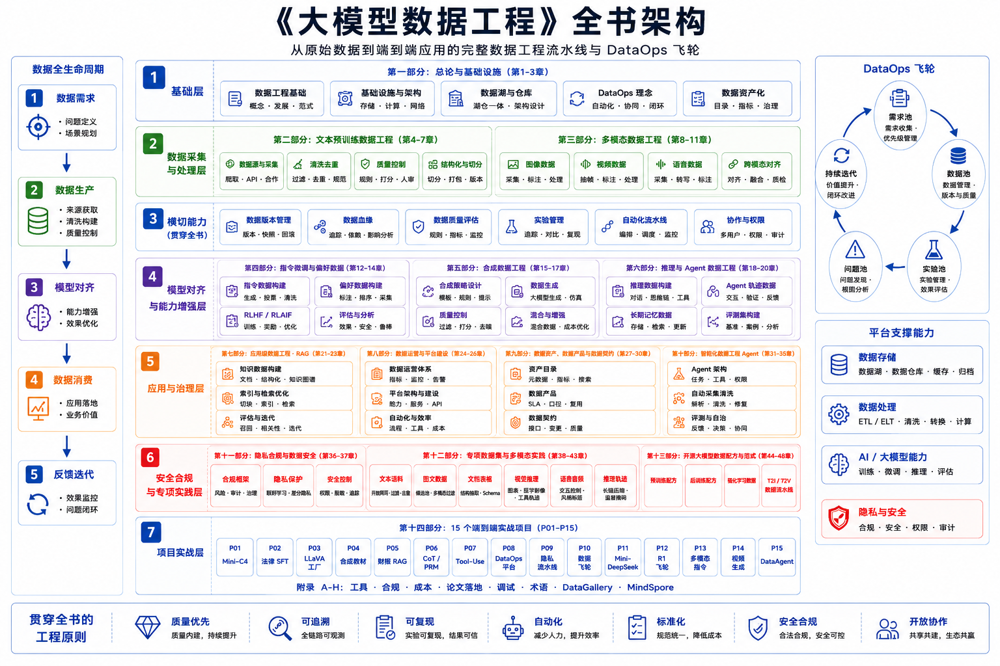

# 《大模型数据工程：架构、算法及项目实战》

[](https://datascale-ai.github.io/data_engineering_book/)
[](LICENSE)

**[English](README_en.md) | 中文 | [日本語](README_ja.md)**

## 简介

> *"Data is the new oil, but only if you know how to refine it."*

在大模型时代，**数据质量决定模型上限**。然而，市面上关于 LLM 数据工程的系统性资料极为稀缺——大多数团队仍在"摸着石头过河"。

本书正是为解决这一痛点而生。我们系统性地梳理了从**预训练数据清洗**到**多模态对齐**、从 **RAG 检索增强**到**合成数据生成**，再到 **DataOps 平台建设**与**隐私合规治理**的完整技术体系，涵盖：

- 🧹 **预训练数据工程**：如何从 Common Crawl 等海量噪声数据中提炼出高质量语料
- 🖼️ **多模态数据处理**：图文对、视频、音频数据的采集、清洗与对齐
- 🎯 **对齐数据构造**：SFT 指令数据、RLHF 偏好数据、CoT 推理数据的自动化生成
- 🤖 **推理与 Agent 数据**：思维链、Tool-Use、多轮交互与记忆数据工程
- 🔍 **RAG 数据流水线**：企业级文档解析、语义切片与多模态检索
- ⚙️ **DataOps 与平台建设**：团队组织、数据版本管理、平台可观测性
- 🔒 **隐私合规与安全**：数据治理框架、联邦学习与隐私保护技术

本书不仅有深入的理论讲解，更包含 **10 个端到端实战项目**，提供可运行的代码和详细的架构设计，让你能够**即学即用**。

**在线阅读**: [https://datascale-ai.github.io/data_engineering_book/](https://datascale-ai.github.io/data_engineering_book/)

## 全书架构



*从原始数据到端到端应用的完整数据工程流水线*

## 目录结构

```
📖 全书十大部分，28章 + 10个实战项目
│
├── 第一部分：基础设施与核心理念
│   ├── 第1章：大模型时代的数据变革（从 Data Ops 到 AI Ops）
│   └── 第2章：AI 原生数据栈（向量库、对象存储、Ray/Spark 分布式计算）
│
├── 第二部分：文本预训练数据工程
│   ├── 第3章：数据获取（CommonCrawl 解析与高并发爬虫）
│   ├── 第4章：清洗与质量控制（去重、PII 脱敏、防基准污染）
│   └── 第5章：分词、序列化与高效加载（DataLoader 优化）
│
├── 第三部分：多模态数据工程
│   ├── 第6章：图文对数据处理
│   ├── 第7章：数据重描述
│   └── 第8章：视频与音频数据
│
├── 第四部分：指令微调与偏好数据
│   ├── 第12章：SFT 数据设计与指令体系
│   ├── 第13章：偏好数据与奖励信号
│   └── 第14章：标注平台、QA 体系与数据运营
│
├── 第五部分：合成数据工程
│   ├── 第15章：合成数据工厂：从种子到验证
│   ├── 第16章：知识蒸馏与模型协作
│   └── 第17章：合成数据质量控制与模型坍缩
│
├── 第六部分：推理与 Agent 数据工程
│   ├── 第18章：思维链与推理数据工程
│   ├── 第19章：Tool-Use 与函数调用数据
│   └── 第20章：Agent 记忆与多轮交互数据
│
├── 第七部分：应用级数据工程
│   ├── 第21章：RAG 数据流水线
│   ├── 第22章：多模态 RAG 与视觉检索
│   └── 第23章：在线反馈闭环与知识更新
│
├── 第八部分：数据运营与平台建设
│   ├── 第24章：DataOps 飞轮与团队组织
│   ├── 第25章：数据版本管理与实验追踪
│   └── 第26章：数据平台可观测性
│
├── 第九部分：隐私合规与数据安全
│   ├── 第27章：数据合规框架与治理
│   └── 第28章：联邦学习与隐私保护技术
│
└── 第十部分：项目集（P01-P10）
    ├── 项目一：基于 Ray 构建分布式 Mini-C4 数据流水线
    ├── 项目二：垂直领域专家 SFT（法律）
    ├── 项目三：LLaVA 多模态指令数据工厂
    ├── 项目四：合成数学与代码教材工厂
    ├── 项目五：多模态 RAG 企业财报助手
    ├── 项目六：CoT 推理数据集构建与 PRM 训练
    ├── 项目七：Agent Tool-Use 数据工厂
    ├── 项目八：企业级 DataOps 平台搭建
    ├── 项目九：隐私保护数据流水线
    └── 项目十：端到端 LLM 数据飞轮
```

## 核心亮点

### 理论体系完整
- **Data-Centric AI** 理念贯穿全书
- 覆盖 LLM 数据全生命周期：预训练 → 微调 → RLHF → RAG → DataOps
- 深入讲解 Scaling Laws、数据质量评估、多模态对齐、隐私合规等前沿话题

### 技术栈现代化
| 领域 | 技术选型 |
|------|----------|
| 分布式计算 | Ray Data, Spark, Dask |
| 数据存储 | Parquet, WebDataset, 向量数据库 (Milvus/Qdrant) |
| 文本处理 | Trafilatura, KenLM, MinHash LSH, fastText 质量评分 |
| 多模态 | CLIP, ColPali, img2dataset |
| 数据版本 | DVC, LakeFS, MLflow |
| 平台可观测 | Great Expectations, Evidently AI, Apache Airflow |
| 隐私保护 | 联邦学习, 差分隐私, 安全多方计算 |

### 实战项目丰富

| 项目 | 核心技术 | 输出 |
|------|----------|------|
| Mini-C4 预训练集 | Trafilatura + Ray + MinHash | 高质量文本语料库 |
| 法律专家 SFT | Self-Instruct + CoT | 领域指令数据集 |
| LLaVA 多模态指令 | Bbox 对齐 + 多图交错 | 视觉指令数据集 |
| 合成数学教材 | Evol-Instruct + 沙箱验证 | PoT 推理数据集 |
| 财报 RAG | ColPali + Qwen-VL | 多模态问答系统 |
| CoT 推理 + PRM | 过程奖励模型 | 推理过程数据集 |
| Agent Tool-Use | 工具调用链 + 轨迹标注 | Agent 训练数据集 |
| DataOps 平台 | Airflow + DVC + 质量监控 | 企业级数据运营体系 |
| 隐私保护流水线 | 联邦学习 + 差分隐私 | 合规训练数据流水线 |
| LLM 数据飞轮 | 在线反馈 + 持续迭代 | 端到端闭环系统 |

## 本地运行

### 环境要求

- Python 3.8+
- MkDocs Material
- mkdocs-static-i18n（多语言支持）

### 安装与预览

```bash
# 克隆仓库
git clone https://github.com/datascale-ai/data_engineering_book.git
cd data_engineering_book

# 安装依赖
pip install mkdocs-material mkdocs-glightbox pymdown-extensions "mkdocs-static-i18n[material]"

# 本地预览
mkdocs serve
```

访问 http://127.0.0.1:8000 即可预览书籍（支持中/英/日切换）。

### 构建静态站点

```bash
mkdocs build
```

生成的静态文件位于 `site/` 目录。

## 项目结构

```
data_engineering_book/
├── docs/
│   ├── zh/                    # 中文内容
│   │   ├── index.md           # 中文首页
│   │   └── part1/ ~ part10/   # 各章节
│   ├── en/                    # 英文内容
│   ├── ja/                    # 日文内容
│   ├── images/                # 图片资源（中英共享）
│   ├── stylesheets/           # 自定义样式
│   └── javascripts/           # JavaScript (MathJax等)
├── .github/workflows/         # GitHub Actions 自动部署
├── images/                    # 项目图片资源
├── mkdocs.yml                 # MkDocs 配置文件
├── LICENSE                    # 开源协议
├── README.md                  # 中文说明（本文件）
├── README_en.md               # English README
└── README_ja.md               # 日本語 README
```

## 适合读者

- 大模型研发工程师
- 数据工程师 / MLOps / DataOps 工程师
- AI 产品经理（技术向）
- 对 LLM 数据流水线感兴趣的研究人员

## 主要作者

於俊教授团队

**实验室信息**：  
中国科学技术大学-语音及语言信息处理国家工程研究中心；中国科学技术大学-自动化系-多媒体计算及智能机器人研究中心；中国科学技术大学-自动化系-多模态智能体联合研究中心

## 贡献指南

欢迎提交 Issue 和 Pull Request！

1. Fork 本仓库
2. 创建特性分支 (`git checkout -b feature/AmazingFeature`)
3. 提交更改 (`git commit -m 'Add some AmazingFeature'`)
4. 推送到分支 (`git push origin feature/AmazingFeature`)
5. 提交 Pull Request

## 许可证

本项目采用 MIT 许可证 - 详见 [LICENSE](LICENSE) 文件。

## 联系我们

- GitHub Issues: [提交问题](https://github.com/datascale-ai/data_engineering_book/issues)
- 在线阅读: [https://datascale-ai.github.io/data_engineering_book/](https://datascale-ai.github.io/data_engineering_book/)

---

**如果这本书对你有帮助，欢迎 Star 支持！** ⭐
