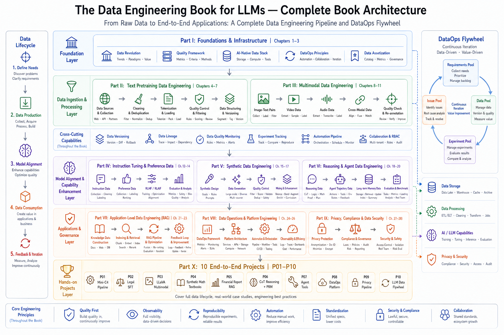

# Data Engineering for Large Models: Architecture, Algorithms & Projects

[](https://datascale-ai.github.io/data_engineering_book/en/)
[](LICENSE)

**English | [中文](README.md) | [日本語](README_ja.md)**

## Introduction

> *"Data is the new oil, but only if you know how to refine it."*

In the era of large models, **data quality determines the upper bound of model performance**. Yet systematic resources on LLM data engineering remain extremely scarce — most teams are still learning by trial and error.

This book is designed to fill that gap. We systematically cover the complete technical stack from **pre-training data cleaning** to **multimodal alignment**, from **RAG retrieval augmentation** to **synthetic data generation**, all the way through **DataOps platform engineering** and **privacy-compliant data governance**, including:

- 🧹 **Pre-training Data Engineering**: Extracting high-quality corpora from massive noisy data sources like Common Crawl
- 🖼️ **Multimodal Data Processing**: Collection, cleaning, and alignment of image-text pairs, video, and audio data
- 🎯 **Alignment Data Construction**: Automated generation of SFT instruction data, RLHF preference data, and CoT reasoning data
- 🤖 **Reasoning & Agent Data**: Chain-of-thought, Tool-Use, multi-turn interaction, and memory data engineering
- 🔍 **RAG Data Pipeline**: Enterprise-grade document parsing, semantic chunking, and multimodal retrieval
- ⚙️ **DataOps & Platform Engineering**: Team organization, data versioning, and platform observability
- 🔒 **Privacy, Compliance & Security**: Data governance frameworks, federated learning, and privacy-enhancing technologies

Beyond in-depth theoretical explanations, the book includes **10 end-to-end capstone projects** with runnable code and detailed architecture designs for hands-on learning.

**Read Online**: [https://datascale-ai.github.io/data_engineering_book/en/](https://datascale-ai.github.io/data_engineering_book/en/)

## Book Architecture



*A complete data engineering pipeline from raw data to end-to-end applications*

## Table of Contents

```
📖 10 Parts, 28 Chapters + 10 Capstone Projects
│
├── Part 1: Overview & Infrastructure
│   ├── Chapter 1: Data Revolution in the LLM Era
│   ├── Chapter 2: LLM Data Lifecycle & Quality Assessment Framework
│   └── Chapter 3: AI-Native Data Stack & Cost Governance
│
├── Part 2: Text Pre-training Data Engineering
│   ├── Chapter 4: Data Sources, Acquisition & Copyright
│   ├── Chapter 5: Cleaning, Deduplication & Decontamination
│   ├── Chapter 6: Tokenization, Serialization & Efficient Loading
│   └── Chapter 7: Data Evaluation, Quality Loop & Operational Iteration
│
├── Part 3: Multimodal Data Engineering
│   ├── Chapter 8: Image-Text Pair Data Engineering
│   ├── Chapter 9: Recaptioning & Document Understanding
│   ├── Chapter 10: Video & Audio Data Engineering
│   └── Chapter 11: Cross-Modal Alignment & Fusion
│
├── Part 4: Instruction Fine-tuning & Preference Data
│   ├── Chapter 12: SFT Data Design & Instruction Taxonomy
│   ├── Chapter 13: Preference Data & Reward Signals
│   └── Chapter 14: Annotation Platforms, QA Systems & Data Operations
│
├── Part 5: Synthetic Data Engineering
│   ├── Chapter 15: Synthetic Data Factory: From Seeds to Validation
│   ├── Chapter 16: Knowledge Distillation & Model Collaboration
│   └── Chapter 17: Synthetic Data Quality Control & Model Collapse
│
├── Part 6: Reasoning & Agent Data Engineering
│   ├── Chapter 18: Chain-of-Thought & Reasoning Data Engineering
│   ├── Chapter 19: Tool-Use & Function-Calling Data
│   └── Chapter 20: Agent Memory & Multi-turn Interaction Data
│
├── Part 7: Application-Level Data Engineering
│   ├── Chapter 21: RAG Data Pipeline
│   ├── Chapter 22: Multimodal RAG & Visual Retrieval
│   └── Chapter 23: Online Feedback Loop & Knowledge Update
│
├── Part 8: DataOps & Platform Engineering
│   ├── Chapter 24: DataOps Flywheel & Team Organization
│   ├── Chapter 25: Data Versioning & Experiment Tracking
│   └── Chapter 26: Data Platform Observability
│
├── Part 9: Privacy, Compliance & Data Security
│   ├── Chapter 27: Data Compliance Framework & Governance
│   └── Chapter 28: Federated Learning & Privacy-Enhancing Technologies
│
└── Part 10: Capstone Projects (P01–P10)
    ├── Project 1: Distributed Mini-C4 Pipeline with Ray
    ├── Project 2: Domain Expert SFT (Legal)
    ├── Project 3: LLaVA Multimodal Instruction Data Factory
    ├── Project 4: Synthetic Math & Code Textbook Factory
    ├── Project 5: Multimodal RAG Financial Report Assistant
    ├── Project 6: CoT Reasoning Dataset & PRM Training
    ├── Project 7: Agent Tool-Use Data Factory
    ├── Project 8: Enterprise DataOps Platform: From Data Projects to Org-Level Governance
    ├── Project 9: Privacy-Preserving Data Pipeline
    └── Project 10: End-to-End LLM Data Flywheel
```

## Key Highlights

### Comprehensive Theory
- **Data-Centric AI** philosophy throughout
- Covers the full LLM data lifecycle: Pre-training → Fine-tuning → RLHF → RAG → DataOps
- In-depth coverage of Scaling Laws, data quality evaluation, multimodal alignment, privacy compliance, and more

### Modern Tech Stack
| Domain | Technologies |
|--------|-------------|
| Distributed Computing | Ray Data, Spark, Dask |
| Data Storage | Parquet, WebDataset, Vector Databases (Milvus/Qdrant) |
| Text Processing | Trafilatura, KenLM, MinHash LSH, fastText Quality Scoring |
| Multimodal | CLIP, ColPali, img2dataset |
| Data Versioning | DVC, LakeFS, MLflow |
| Platform Observability | Great Expectations, Evidently AI, Apache Airflow |
| Privacy & Security | Federated Learning, Differential Privacy, Secure MPC |

### Rich Capstone Projects

| Project | Core Technologies | Output |
|---------|-------------------|--------|
| Mini-C4 Pre-training Set | Trafilatura + Ray + MinHash | High-quality text corpus |
| Legal Expert SFT | Self-Instruct + CoT | Domain instruction dataset |
| LLaVA Multimodal Instruction | Bbox alignment + multi-image interleaving | Visual instruction dataset |
| Synthetic Math Textbook | Evol-Instruct + sandbox verification | PoT reasoning dataset |
| Financial Report RAG | ColPali + Qwen-VL | Multimodal QA system |
| CoT Reasoning + PRM | Process Reward Modeling | Reasoning process dataset |
| Agent Tool-Use Factory | Tool-call chains + trajectory annotation | Agent training dataset |
| DataOps Platform | Airflow + DVC + quality monitoring | Enterprise data ops system |
| Privacy Pipeline | Federated Learning + Differential Privacy | Compliant training pipeline |
| LLM Data Flywheel | Online feedback + continuous iteration | End-to-end closed-loop system |

## Local Development

### Requirements

- Python 3.8+
- MkDocs Material
- mkdocs-static-i18n (i18n support)

### Install & Preview

```bash
# Clone the repository
git clone https://github.com/datascale-ai/data_engineering_book.git
cd data_engineering_book

# Install dependencies
pip install mkdocs-material mkdocs-glightbox pymdown-extensions "mkdocs-static-i18n[material]"

# Local preview
mkdocs serve
```

Visit http://127.0.0.1:8000 to preview the book (with Chinese/English/Japanese language switcher).

### Build Static Site

```bash
mkdocs build
```

The generated static files are located in the `site/` directory.

## Project Structure

```
data_engineering_book/
├── docs/
│   ├── zh/                    # Chinese content
│   │   ├── index.md           # Chinese homepage
│   │   └── part1/ ~ part10/   # All chapters
│   ├── en/                    # English content
│   ├── ja/                    # Japanese content
│   ├── images/                # Image assets (shared)
│   ├── stylesheets/           # Custom styles
│   └── javascripts/           # JavaScript (MathJax etc.)
├── .github/workflows/         # GitHub Actions CI/CD
├── images/                    # Project image assets
├── mkdocs.yml                 # MkDocs configuration
├── LICENSE                    # License
├── README.md                  # 中文说明
├── README_en.md               # English README (this file)
└── README_ja.md               # 日本語 README
```

## Target Audience

- LLM R&D Engineers
- Data Engineers / MLOps / DataOps Engineers
- AI Product Managers (Technical)
- Researchers interested in LLM data pipelines

## Main Author

Professor Jun Yu's Team

**Laboratory Information:**  
National Engineering Laboratory for Speech and Language Information Processing, University of Science and Technology of China;  
Multimedia Computing and Intelligent Robotics Research Center, Department of Automation, University of Science and Technology of China;  
Joint Research Center for Multi-Modal Intelligent Agents, Department of Automation, University of Science and Technology of China

## Contributing

Contributions are welcome! Feel free to submit Issues and Pull Requests.

1. Fork this repository
2. Create a feature branch (`git checkout -b feature/AmazingFeature`)
3. Commit your changes (`git commit -m 'Add some AmazingFeature'`)
4. Push to the branch (`git push origin feature/AmazingFeature`)
5. Open a Pull Request

## License

This project is licensed under the MIT License - see the [LICENSE](LICENSE) file for details.

## Contact

- GitHub Issues: [Submit an issue](https://github.com/datascale-ai/data_engineering_book/issues)
- Read Online: [https://datascale-ai.github.io/data_engineering_book/en/](https://datascale-ai.github.io/data_engineering_book/en/)

---

**If you find this book helpful, please give it a Star!** ⭐
