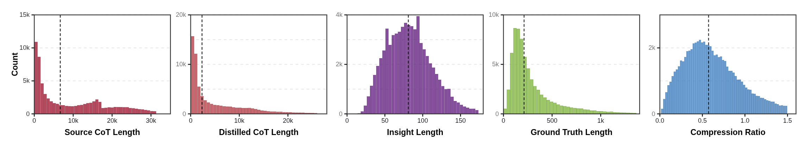

# Chapter 40: Interaction Control and Reasoning Trace Data Engineering

<div class="chapter-authors">Fengxin Chen; Xuan Li</div>

## Abstract

This chapter combines controllable voice interaction and implicit/explicit reasoning traces into one specialized-dataset chapter. VoiceStyleControl focuses on dual-channel supervision for semantic content and voice style, while Latent-Switch-69K focuses on long-CoT compression, latent placeholders, and supervision masks. Together they show that interaction-oriented data engineering must preserve not only inputs and outputs, but also control variables, hidden states, and verifiable boundaries.

## Keywords

controllable voice; style control; reasoning traces; Latent-Switch; supervision masks; interaction data engineering

## Case A: VoiceStyleControl: Semantic Responses and Voice-Style Control

### Case A.0: Learning Objectives

Upon completing this chapter, readers should be able to:

- Explain why voice interaction data must explicitly record acoustic conditions, emotions, and discrete speech tokens beyond the semantic layer, rather than reusing the supervision objectives of pure text conversation.
- Distinguish the field responsibilities of the semantic channel, style channel, and acoustic supervision channel, and understand the principle of separating input-side user state from output-side assistant target.
- Understand the complementary relationship between S2SEmoControl and TTSSpeakerControl in terms of scale, field structure, and training value.
- Design multi-dimensional sample acceptance rules covering text consistency, audio usability, acoustic condition consistency, emotion perceptibility, and authorization traceability.
- Identify risks related to voice identity, authorization, emotional misuse, anti-forgery provenance, and privacy protection, and govern them within the data pipeline.

### Case A.1: Why Voice Conversation Requires Explicit Style Control

Ordinary text conversation samples typically consist of role, context, user request, and assistant response. As long as role boundaries, text length, safety labels, and training masks are clear, the model can learn the input–output mapping on text tokens. Speech samples introduce an additional layer of acoustic state that text cannot replace: sampling rate, duration, silence, loudness, noise, speaker identity, prosody, emotion, and discrete speech tokens all influence training outcomes. Having only the response text can explain "what was said" but not "how it should be said."

The difference between controllable voice interaction data and ordinary ASR/TTS corpora therefore lies first not in having more fields, but in a changed problem definition. ASR asks "which text corresponds to this audio segment"; ordinary TTS asks "can this text be read out naturally"; controllable voice interaction further asks "with which voice, which emotion, and at what intensity should this response enter the conversation." If these conditions are not explicitly expressed, the model can only treat acoustic variation as random noise in the training audio and will struggle to reliably respond at inference time to control conditions such as "say it with a particular emotion" or "say it in a particular voice."

First, voice conversation requires separating "content" from "expression." What the user said and what the assistant should answer constitute the semantic layer; which voice delivers the utterance, at what speech rate, energy level, and pause pattern, and whether the emotion is pronounced, constitute the expression layer. Text conversation data typically needs only to organize the semantic layer; voice generation data must make the expression layer part of the training supervision as well. Otherwise, the differences between the same response delivered in neutral, happy, fearful, or angry states will be flattened by the data pipeline.

Second, voice conversation must distinguish "understanding the user's voice" from "generating the assistant's voice." In real systems, users may be anxious, angry, or hesitant, or may speak with a heavy accent against noisy backgrounds; the assistant, however, typically needs to maintain stable acoustic conditions and an emotion strategy defined by the product specification. A customer-service assistant should not automatically become angry when the user is angry; a companion assistant should not change its timbre without reason mid-conversation. The significance of explicit style control is precisely that it separates input-side state from output-side target at the sample level, rather than assuming the two are identical.

Third, voice conversation requires translating emotion from "textual description" into "acoustic expression." Happy, angry, fearful, neutral, and sad are not just labels — they manifest in pitch, energy, speech rate, pauses, and prosody. For the model, the true learning target is not memorizing an emotion word but generating speech consistent with a given target expressive state. For this reason, controllable voice data must simultaneously preserve text content, target style specification, and corresponding speech supervision, so that emotion control can enter the generation process.

Fourth, voice conversation requires verifiable acoustic supervision. Text can enter training directly as a token sequence; speech must undergo a series of engineering steps involving audio files, sampling rate, duration, loudness, silence, and discrete speech tokens. Explicit style control cannot simply append "say it happily" as a note; it must also provide an actual audio clip as the target, so the model knows how that style condition should manifest acoustically.

From a product-experience perspective, these boundaries are critical. A companion assistant can be designed to be warm, stable, and low-key; an audiobook character can be designed to be more emotionally expressive with a stronger persona; a customer-service assistant typically needs to remain neutral and clear even when the user is angry. All three may use the same underlying semantic response capability, yet they differ in their requirements for voice identity, emotional intensity, and risk boundaries. If training samples do not explicitly distinguish these conditions, the model can only treat voice style as random noise in the audio, making stable control at inference time difficult.

From a data engineering perspective, explicit style control also changes sample acceptance criteria. A text sample generally enters the candidate pool as long as the user's question and the assistant's answer match; a voice sample must simultaneously satisfy text consistency, audio usability, target acoustic condition consistency, emotion perceptibility, and authorization traceability. Failure on any single dimension affects training: correct text with a wrong acoustic condition weakens condition control; correct acoustic condition with wrong emotion weakens emotion control; perceptible emotion with dangerous content converts risky behavior into output with greater persuasive impact.

### Case A.2: Dataset Overview: Two Complementary Subsets — S2S and TTS

VoiceStyleControl is composed of two task types: speech-to-speech dialogue generation and controllable speech generation conditioned on text. Both serve the same goal — enabling the model to generate emotionally expressive speech based on semantic content, acoustic conditions, and emotional style — but they provide supervision from different perspectives.

VoiceStyleControl contains 154,906 samples in total. Of these, S2SEmoControl contains 20,117 samples (approximately 13.0% of the total), targeting style-controllable speech-to-speech dialogue generation; TTSSpeakerControl contains 134,789 samples (approximately 87.0% of the total), targeting controllable text-to-speech generation. The former is closer to a real voice assistant scenario, where the model must understand the user's spoken request and generate a spoken assistant response; the latter focuses more directly on training the model to generate target speech from a style text, acoustic condition, and emotional style.

**Table 40-1: VoiceStyleControl Sample Scale and Emotion Distribution**

| Emotion | S2SEmoControl | TTSSpeakerControl | Total | Total ratio |
|---|---:|---:|---:|---:|
| happy | 4,050 | 38,500 | 42,550 | 27.5% |
| angry | 4,104 | 38,054 | 42,158 | 27.2% |
| fearful | 4,010 | 24,925 | 28,935 | 18.7% |
| neutral | 3,825 | 0 | 3,825 | 2.5% |
| sad | 4,128 | 33,310 | 37,438 | 24.2% |
| **Total** | **20,117** | **134,789** | **154,906** | **100.0%** |

Table 40-1 shows that the five emotion classes in S2SEmoControl are nearly balanced, each ranging from approximately 3.8k to 4.1k samples; TTSSpeakerControl covers four expressive emotions — happy, angry, fearful, and sad — and does not explicitly include neutral. This design is not accidental. S2S dialogue needs neutral as a stable baseline; without it, the model tends to learn all responses as high-intensity emotional expressions. The TTS controllable generation subset, which has more samples, concentrates its capacity on expressions such as "say it happily," "say it angrily," "say it a bit fearfully," and "say it sadly" — cases that require greater acoustic variation.

In terms of record composition, neither subset is a simple combination of "text + audio." Each sample contains at least five categories of information: task source and task type, text-side content, acoustic and emotion conditions, speech generation supervision, and basic audio configuration. Together, these determine whether a voice sample can be used to train conditioned, emotionally expressive speech generation: task information determines the loading procedure, text content provides the semantic target, acoustic and emotion conditions specify the generation style, speech supervision provides learnable acoustic targets, and basic audio configuration ensures that training and evaluation can be reproduced.

The two subsets respectively serve as "capability foundation" and "interaction deployment." TTSSpeakerControl, with its larger sample count, directly teaches the model to map natural-language style descriptions, acoustic conditions, and emotional styles to target speech; S2SEmoControl, though smaller, more closely resembles a real voice assistant — the model must first understand the user-side speech and then generate a spoken assistant response. When used jointly, the TTS subset provides stable style-generation supervision, while the S2S subset places this capability back in a conversational context, training the model on the transformation between user acoustic state and assistant generation target.

VoiceStyleControl should therefore not be understood simply as a TTS dataset. The core supervision objective of an ordinary TTS corpus is "given text, read the text"; VoiceStyleControl's core supervision objective is "given semantic content and style conditions, generate speech appropriate to the conversational goal." The former primarily concerns pronunciation, naturalness, and audio quality; the latter also concerns user state, assistant acoustic conditions, emotion selection, cross-turn consistency, and safety boundaries. Once the data objective differs, schema design, balancing, splitting, and evaluation all change accordingly.

### Case A.3: Sample Schema: Separate Modeling of the Semantic Channel and Style Channel


*Figure 40-1: Dual-channel schema for semantic response and style control. The semantic channel answers "what to say," the style channel answers "with which voice and emotion to say it," and the acoustic supervision channel binds both to audio files, speech tokens, and sampling configuration.*

Figure 40-1 illustrates the core structure of VoiceStyleControl. The semantic channel is responsible for fields such as `query`, `answer`, `task`, and `language`; the style channel is responsible for fields such as `query_gender`, `answer_gender`, `query_mood`, `answer_mood`, `query_id`, and `answer_id`; the acoustic supervision channel is responsible for `query_audio_path`, `answer_audio_path`, `query_token_25hz`, `answer_token_25hz`, and `sample_rate`. The three channels are merged in training records but must be checked separately during construction, quality inspection, and evaluation.

Separate channel modeling enables precise failure attribution. If the model generates correct response text but produces an unstable timbre, the issue typically lies in the style channel or the reference audio pool; if the acoustic condition is correct but characters are mispronounced, the issue lies in the semantic channel, ASR reverse-transcription, or synthetic text alignment; if the audio is playable but the token path cannot be read, the issue lies in the acoustic supervision channel or the packaging manifest. Collapsing all information into a single free-text prompt facilitates rapid sample assembly but makes downstream data repair and experimental attribution considerably harder.

An S2SEmoControl record expresses the mapping from the user side `(query_audio, query_text, query_gender, query_mood)` to the assistant side `(answer_text, answer_audio, answer_gender, answer_mood)`. Conversational content, acoustic conditions, emotion labels, audio files, and speech tokens are bound together in a single record, making it not a loose combination of "text Q&A plus attached audio" but a complete voice interaction training sample.

```json
{
  "uuid": "1977946a067ee3442",
  "_id": "6750567505b5d5170356ae61",
  "source": "S2SEmoControl",
  "task": "S2S",
  "query": "Tell me a short story.",
  "answer": "Sure, let me make up a short story for you. Once upon a time there was a very diligent little nightingale...",
  "query_gender": "female",
  "answer_gender": "male",
  "query_mood": "neutral",
  "answer_mood": "neutral",
  "language": "en",
  "sample_rate": 16000,
  "query_id": "female-neutral-1",
  "answer_id": "male-neutral-2",
  "query_token_25hz": "S2SEmoControl/.../query_token_0.ark:3121",
  "query_audio_ark": "S2SEmoControl/.../query_audio_0.ark:1024",
  "query_audio_path": "S2SEmoControl/.../1977946a06cf564f1-query.wav",
  "answer_token_25hz": "S2SEmoControl/.../answer_token_0.ark:22637",
  "answer_audio_ark": "S2SEmoControl/.../answer_audio_0.ark:8192",
  "answer_audio_path": "S2SEmoControl/.../1977946a06cf564f1-answer.wav"
}
```

In this sample, the user says "Tell me a short story." and the assistant replies "Sure, let me make up a short story for you. Once upon a time there was a very diligent little nightingale...". `query_gender` is `female` and `answer_gender` is `male`; both `query_mood` and `answer_mood` are `neutral`. During training, `query_audio_path` and `query_token_25hz` can serve as speech understanding inputs, with `query` providing the transcribed semantic anchor; `answer` is the semantic target, and `answer_token_25hz` together with `answer_audio_path` provide the speech generation supervision; `answer_gender` and `answer_mood` specify the style conditions for the output voice.

TTSSpeakerControl concentrates the control capability in a text-to-speech form. The input text is split into two parts: `text` describes how the voice should express itself, while `answer` is the content to be spoken. For example, `text` may read "female, somewhat fearful, sweaty palms, trembling voice," and `answer` may read "Run, it's not safe here." This type of record indicates that the TTS subset does not randomly assign mood labels to sentences; instead, it constructs style–content pairs in which the natural-language style description, the structured label, and the content to be synthesized must mutually reinforce each other.

```json
{
  "uuid": "c6810929-8962-4cc1-b3b5-aadd4cbb1106",
  "_id": "197b764f5a31c2-female-fearful",
  "source": "TTSSpeakerControl",
  "task": "TTS",
  "text": "female, somewhat fearful, sweaty palms, trembling voice",
  "answer": "Run, it's not safe here",
  "answer_gender": "female",
  "answer_mood": "fearful",
  "language": "en",
  "sample_rate": 16000,
  "prompt": "female, somewhat fearful, sweaty palms, trembling voice",
  "answer_id": "female-fearful-1",
  "answer_token_25hz": "TTSSpeakerControl/.../answer_token_0.ark:1379",
  "answer_audio_ark": "TTSSpeakerControl/.../answer_audio_0.ark:4096",
  "answer_audio_path": "TTSSpeakerControl/.../c6810929-8962-4cc1-b3b5-aadd4cbb1106-answer.wav"
}
```

Combining samples from both S2S and TTS, the fields in VoiceStyleControl can be organized into six layers: task identifier, text content, acoustic conditions, emotion conditions, speech supervision, and basic audio configuration. S2S samples contain both user-side and assistant-side fields and therefore distinguish query-side from answer-side; TTS samples generate only assistant-side speech and therefore have a more concentrated set of fields. `language` fixes the language, and `sample_rate` fixes the audio sampling configuration; these foundational fields are the underlying contract for training loading and evaluation reproducibility and must not be inferred implicitly from path names or directory conventions alone.

**Table 40-2: Field Descriptions for Speaker, Emotion, and Sampling Labels**

| Label layer | Field | Values / examples | Distribution or engineering requirements |
|---|---|---|---|
| Query-side speaker | `query_gender` | `female` / `male`, e.g., `female` | Calculated separately for the query side. |
| Answer-side acoustic condition | `answer_gender` | `male` / `female` | Before training, monitor balance by answer-side gender, mood, and reference acoustic condition to avoid output voice bias. |
| Query-side emotion | `query_mood` | `happy`, `angry`, `fearful`, `neutral`, `sad` | Five classes are nearly balanced in S2SEmoControl. |
| Answer-side emotion | `answer_mood` | Same as above | Total counts as per Table 40-1; TTSSpeakerControl does not explicitly include `neutral`. |
| Language and sampling | `language` / `sample_rate` | `en` / `16000` | Used as loading, resampling, and evaluation-reproducibility fields; not inferred implicitly from paths. |
| Reference voice citation | `query_id` / `answer_id` | e.g., `female-neutral-1` | Points to a style instance in the authorized reference voice pool; does not expose real identity. |

In VoiceStyleControl, emotion distribution is only the first layer of balancing information. When samples actually enter training and evaluation, they are further decomposed along the input-side and output-side axes: `query_gender × query_mood` describes the state distribution of user speech, `answer_gender × answer_mood` describes the target distribution of assistant-generated speech, and the reference voice ID constrains how the same acoustic condition is reused across different texts and emotions. Language and sampling rate appear foundational but determine whether loading, resampling, and audio metrics are comparable. Only by examining all these axes together can one determine whether a particular emotion is concentrated under a specific acoustic condition, whether a particular reference timbre appears too frequently in both training and test sets, and whether a model failure originates from the semantic, acoustic, or emotion control dimension.

At the data-synthesis stage, this field difference manifests as two ways of organizing conditions: S2SEmoControl must handle reference-voice selection and emotion injection on both the query and answer sides, while TTSSpeakerControl separates the style description from the content to be spoken before synthesizing answer-side speech. The concrete synthesis logic is covered in Section 40.4, steps four and five; this section first fixes the field contract.

A unified JSON Schema constrains required fields by task type; a production-grade manifest should further add enum constraints, path-existence validation, file hashes, authorization IDs, tokenizer name, tokenizer version, and token frame rate declarations.

```json
{
  "$schema": "https://json-schema.org/draft/2020-12/schema",
  "title": "VoiceStyleControlRecord",
  "type": "object",
  "required": [
    "source",
    "task",
    "answer",
    "language",
    "sample_rate",
    "answer_audio_path"
  ],
  "oneOf": [
    {
      "title": "S2SEmoControl",
      "required": [
        "query",
        "query_gender",
        "answer_gender",
        "query_mood",
        "answer_mood",
        "query_id",
        "answer_id",
        "query_audio_path",
        "answer_audio_path",
        "query_token_25hz",
        "answer_token_25hz"
      ],
      "properties": {
        "task": {
          "const": "S2S"
        }
      }
    },
    {
      "title": "TTSSpeakerControl",
      "required": [
        "text",
        "answer_gender",
        "answer_mood",
        "answer_id",
        "answer_token_25hz",
        "answer_audio_path"
      ],
      "properties": {
        "task": {
          "const": "TTS"
        }
      }
    }
  ],
  "properties": {
    "source": {
      "type": "string"
    },
    "task": {
      "enum": ["S2S", "TTS"]
    },
    "query": {
      "type": "string",
      "description": "Transcription of the spoken user query; used only in S2S"
    },
    "text": {
      "type": "string",
      "description": "Natural-language style description; used only in TTS"
    },
    "answer": {
      "type": "string",
      "description": "Assistant response or content to be synthesized"
    },
    "query_gender": {
      "type": "string"
    },
    "answer_gender": {
      "type": "string"
    },
    "query_mood": {
      "type": "string"
    },
    "answer_mood": {
      "type": "string"
    },
    "language": {
      "type": "string"
    },
    "sample_rate": {
      "type": "integer"
    },
    "query_id": {
      "type": "string"
    },
    "answer_id": {
      "type": "string"
    },
    "query_token_25hz": {
      "type": "string"
    },
    "answer_token_25hz": {
      "type": "string"
    },
    "query_audio_ark": {
      "type": "string"
    },
    "answer_audio_ark": {
      "type": "string"
    },
    "query_audio_path": {
      "type": "string"
    },
    "answer_audio_path": {
      "type": "string"
    }
  }
}
```

The unified schema splits the training entry point into three parts: semantic input consists of `query`, `text`, or `answer` text tokens; style input consists of `query_gender`, `answer_gender`, `query_mood`, `answer_mood`, and reference voice ID; and the acoustic target is the answer-side speech token or audio. `answer_gender` and `answer_mood` must not remain only in offline metadata — they must be mapped to control conditions or conditioning text in the dataloader; otherwise the model will never acquire genuine controllable generation capability.

Once training samples enter the dataloader, they are projected from the standard schema into task-specific views. The S2S view may take the form `query_audio + answer_gender + answer_mood -> answer_token`, optionally augmented with the `query` transcription as an auxiliary semantic input; the TTS view may take the form `text + answer + answer_gender + answer_mood -> answer_token`. The evaluation view, conversely, fixes certain fields while varying others — for example, fixing `answer` while varying `answer_mood`, or fixing `answer_mood` while varying `answer_id`. This design principle — stable record contract, variable training view — serves controllable speech generation experiments, not auxiliary speaker identification or voice-print modeling experiments.

### Case A.4: Construction Pipeline: From Text Conversation to Controllable Voice Records


*Figure 40-2: VoiceStyleControl data construction pipeline. Text conversation or style content is first assigned speaker and emotion conditions, then audio is generated or collected through the authorized reference voice pool, and finally the samples are tokenized, quality-checked, balanced, and packaged.*

The construction of VoiceStyleControl can be divided into seven steps: text conversation or style content generation, style attribute assignment, authorized reference voice pool preparation, speech synthesis or collection, discrete speech tokenization, quality inspection and balancing, and packaging and release. Each step simultaneously affects semantic quality, style quality, and compliance risk.

This pipeline is not a simple sequential production line but a series of continuous data gates. After text content is generated, it must be determined whether the semantics are appropriate for the designated emotion; after reference voices are selected, it must be verified that the authorization covers the current task; after speech is synthesized, it must be confirmed that the audio, text, acoustic conditions, and emotion all pass simultaneously. If a problem is discovered at any step, the sample should not simply "flow downstream with a defect" — it must be returned to the corresponding queue for repair. Otherwise, downstream evaluation can only detect that the model is unstable but cannot explain where the instability originates.

The first step is generating or collecting text content. S2SEmoControl consumes cleaned dialogue JSONL, with each record containing a user `query` and an assistant `answer` spanning scenarios such as everyday requests, emotional expression, storytelling, explanation, and reminders; answers remain natural and complete and respect safety boundaries. TTSSpeakerControl uses Qwen3-8B with emotion-specific prompts to generate style–content pairs so that the style description and the content to be spoken reinforce each other. For example, fearful samples may be more urgent and sad samples more subdued, but emotion labels must not be used as pretexts for hazardous inducement.

Acceptance of text content looks beyond grammatical fluency to whether the emotion and semantics are compatible. `fearful` can correspond to "Run, it's not safe here" but should not appear in a casual chat as exaggerated scaremongering; `angry` can serve character-driven expression but should not treat abusive, threatening, or discriminatory content as emotional enhancement. If no boundaries are set during the text generation stage, subsequent speech synthesis will convert risky text into more impactful audio — amplifying the risk through acoustic expression.

The second step is assigning style attributes. For S2S, gender and mood must be assigned separately to both the query side and the answer side; for TTS, gender and mood are assigned to the answer side only, with a natural-language style description written into `text`. The assignment strategy must consider both balance and combination coverage: balance ensures that every emotion has a sufficient number of samples, and combination coverage ensures the model has seen transfers from diverse user styles to diverse assistant styles. If the data contains only same-gender, same-mood combinations, the model will easily couple input style and output style, weakening answer-side control capability.

Combination coverage is especially important for the S2S subset. A user-side angry query does not imply the assistant-side should also be angry; a user-side fearful query does not imply the assistant-side should be equally fearful. On the contrary, many real products require the assistant to remain neutral, clear, and action-oriented under high-pressure user emotions. Data construction should retain enough cross-combination samples — for example, a female-angry query paired with a male-neutral answer, or a male-sad query paired with a female-neutral answer — so that the model learns to treat user state as an understanding signal rather than simply copying it as output style.

The third step is preparing the reference voice pool. VoiceStyleControl uses a multi-speaker, multi-emotion reference pool and synthesizes speech in the target style via CosyVoice2 using zero-shot voice cloning. The engineering priority is not "clone as closely as possible" but "authorizable, reusable, and revocable." Reference audio should document reference voice ID, emotion condition, collection time, permitted use scope, authorization status, and revocation status; `query_id` and `answer_id` should expose only engineering references and must not contain real names or information that allows identity reversal.

The fourth step is speech synthesis or collection. S2S requires generating both query speech and answer speech and binding each audio file to its corresponding text record; TTS generates answer-side speech from `text` and `answer` (see the step-five example for the concrete implementation). During synthesis, sampling rate should be fixed or explicitly recorded; loudness, silence, maximum duration, and file encoding should be controlled to prevent instability caused by abnormal audio lengths or formats in the dataloader during training. If real recordings are used, additional handling is required for environmental noise, microphone variation, speaker fatigue, and third-party background sounds.

The following example from S2SEmoControl shows how schema fields enter the synthesis process: `query_id` and `answer_id` select reference voices for the two sides; when `answer_mood` is not `neutral`, an emotion instruction is attached to the query-side synthesis text so that the input speech carries the output style control intent.

```python
def build_synthesis_inputs(record):
    language = record["language"]
    query_content = record["query"]
    answer_content = record["answer"]
    answer_mood = record["answer_mood"]
    query_prompt_id, answer_prompt_id, record = select_prompt_speech(record)

    if answer_mood != "neutral":
        prompt = random.choice(INSTRUCT[language]).format(mood=answer_mood)
        record["prompt"] = prompt
        if random.random() < 0.5:
            query_content = prompt + query_content
        else:
            query_content = query_content + prompt

    return (
        record,
        PROMPT_TEXT[language][query_prompt_id],
        query_content,
        PROMPT_TEXT[language][answer_prompt_id],
        answer_content,
    )

record, q_instruct, q_content, a_instruct, a_content = build_synthesis_inputs(record)
language = record["language"]
q_tokens, q_speech = backend.compute_zeroshot_speech_token(
    q_instruct, audio_dict[language][record["query_id"]], q_content
)
a_tokens, a_speech = backend.compute_zeroshot_speech_token(
    a_instruct, audio_dict[language][record["answer_id"]], a_content
)
```

This example illustrates the key S2S branch: `answer_mood` determines whether an emotion instruction is injected, and `q_tokens`, `a_tokens`, and their corresponding waveforms map to the `query_token_25hz` and `answer_token_25hz` fields in the manifest.

The fifth step is discrete speech tokenization. Speech generation training needs acoustic targets to be organized as discrete speech tokens so that generation can be formulated as a sequence modeling problem. A common approach is to encode existing waveforms with tokenizers such as S3Tokenizer; VoiceStyleControl instead follows the CosyVoice generative path — speech tokens are produced synchronously during synthesis and decoded into playable audio, so this repository has no separate "synthesize first, tokenize later" post-processing step. S2S records write `query_token_25hz` and `answer_token_25hz`; TTS records write the answer-side `answer_token_25hz`. The frame rate is 25 Hz (CosyVoice2 `token_frame_rate`), and manifest field names reflect this. When releasing the data, the manifest should still bind the tokenizer name, version, frame rate, codebook configuration, and reconstruction method. The worst scenario for a training set is "same field name, different meanings": if the same field is generated by different frame rates or different tokenizer versions across batches, the model will receive inconsistent supervision in sequence length and acoustic granularity.

TTSSpeakerControl uses another synthesis path: `answer` is the content to be spoken, while `text` or `prompt` is the style description. From a data-engineering perspective, the important part is not every internal parameter of CosyVoice's flow model and vocoder, but a stable data flow: extract content and style instruction from the record, call the synthesis function to produce answer-side tokens and audio, then write the supervision locations back into the same manifest record.

```python
for sample_idx, record in id2meta:
    text_content, instruction_text = extract_tts_fields(record)
    if len(text_content) > 512:
        continue

    sample_key = str(record.get("uuid") or record.get("id") or sample_idx)
    speech_token, speech_audio = compute_tts_speech_token(
        text_content, instruction_text, SPK_ID
    )
    token_offset = answer_token_writer.write(sample_idx, speech_token.tobytes())
    audio_offset = answer_audio_writer.write(sample_idx, speech_audio.tobytes())

    record["answer_token_25hz"] = f"{paths.answer_token_ark}:{token_offset}"
    record["answer_audio_ark"] = f"{paths.answer_audio_ark}:{audio_offset}"
    record["answer_audio_path"] = str(
        paths.answer_wav_dir / f"{sample_key}-answer.wav"
    )
    wavfile.write(record["answer_audio_path"], ARK_SAMPLE_RATE, speech_audio)
    write_jsonl_record(jsonlf, record)
```

This example corresponds to the core chain by which a natural-language style description becomes trainable speech supervision: `instruction_text` enters the synthesis function, `speech_token` becomes the discrete target that later training can model directly, and `speech_audio` supports listening checks, reverse ASR, and human review. Once the token offset, audio offset, and wav path are written back to the same record, the sample becomes traceable.

The sixth step is quality inspection, balancing, and splitting. Quality inspection must go beyond checking whether audio can be played; it must also verify whether text and audio are consistent, whether the target acoustic condition matches, whether the emotion is perceptible, whether audio quality is stable, whether paths exist, and whether tokens are readable. Balancing should not be performed only by total emotion count; it must also monitor across `task`, `language`, `sample_rate`, reference voice ID, text length, and audio duration. Splitting should apply isolation by reference voice ID to prevent the same reference timbre from appearing in both the training set and the test set, which would inflate acoustic condition evaluation scores.

The seventh step is packaging. Final samples can be stored in JSONL, Parquet, or Hugging Face Dataset format, but the training manifest must retain audio paths, token paths, hashes, authorization status, and data version. Audio files, token ark files, and metadata should not be loosely associated by human naming conventions but must be strictly bound by the manifest. Only then, when a sample is re-synthesized, re-annotated, or removed, can the team identify which training versions are affected.

The packaging artifacts include not only JSONL, Parquet, or Hugging Face Dataset files but also a data card describing the data boundaries. The data card records total sample count, subset composition, emotion distribution, gender field distribution, reference voice IDs, language, sampling rate, tokenizer version, authorization scope, and splitting strategy, and distinguishes training conditions, audit metadata, and anonymized fields in the public release. This boundary statement prevents `answer_id` from being misused as a real identity label and prevents `mood` from being treated as a reliable ground truth requiring no verification.

### Case A.5: Quality Assessment and Closed-Loop Remediation


*Figure 40-3: Quality assessment and data flywheel closed loop. Automated validation, reverse ASR, style assessment, and manual sampling together form a defective-sample queue that feeds back into re-synthesis, re-annotation, downweighting, or removal.*

Quality assessment for controllable voice interaction data must simultaneously cover semantics, voice, emotion, audio, and safety. A sample that "sounds human" in isolation is not necessarily acceptable: it may contain misread text, a mismatched voice identity, overly intense emotion, or inappropriate fearful delivery in a hazardous scenario. The quality system should combine automated metrics with human review in a closed loop; defective samples enter queues for re-synthesis, re-annotation, downweighting, or removal.

Quality gates should be divided into "hard failures" and "soft risks." Missing paths, incorrect sampling rates, corrupted audio, unreadable tokens, and severe ASR reverse-transcription inconsistency typically constitute hard failures and should be blocked immediately. Slightly weak emotion intensity, average naturalness, or borderline acoustic condition perception can enter a soft-risk queue, where the decision to re-synthesize, downweight, or manually review is made based on task criticality. Treating every issue as a disqualifying veto wastes remediable samples; allowing every issue to pass dilutes the control signal with noise.

**Table 40-3: Quality Assessment Metrics**

| Assessment dimension | Core question | Automated metrics | Key points for human review | Handling of failures |
|---|---|---|---|---|
| Semantic consistency | Does the answer address the user's intent? Is TTS content read out correctly? | ASR reverse-transcription CER/WER, semantic similarity, intent hit rate | Non-responsive answers, omission of key information, hazardous suggestions | Rewrite text, re-synthesize, remove |
| Acoustic condition consistency | Does the output match the target `answer_gender`, `answer_mood`, and reference acoustic condition? | Field-level consistency check, automated/human gender verification, reference timbre spot-check | Target condition errors, cross-sample voice bleeding, timbre too close to an unauthorized real person | Re-select reference audio, re-synthesize, downweight or isolate |
| Emotion control | Is the target mood stably expressed? | Emotion classification accuracy, confusion matrix, F0/energy/speech-rate statistics | Emotion too intense, conflict with semantics, or potentially manipulative | Re-annotate, reduce intensity, remove |
| Audio quality | Can the audio serve as generation supervision? | SNR, loudness, silence ratio, clipping rate, MOS/NISQA | Clipping, broken phrasing, mechanical artifacts, background noise | Denoise, resample, re-synthesize |
| Conversational naturalness | Is the S2S response natural? Is the persona stable? | Multi-turn coherence score, latency and duration distribution | Abrupt tone, persona inconsistency, repeated style jumping | Reorder, add context, manual review |
| Safety and compliance | Is the sample authorizable, traceable, and revocable? | Authorization record completeness rate, watermark detection rate, audit log coverage | Risks of impersonation, manipulation, or replication of sensitive identities | Block, anonymize, remove, and audit |

Semantic consistency can be established via reverse ASR as a first layer of automated checking. Synthesized audio is transcribed back to text; CER/WER is computed and compared against `answer`; for S2S, the answer is also checked for relevance to the query. If "Run, it's not safe here" is synthesized as "Walk slowly, it's safe here," the sample must be removed regardless of audio quality. Semantic similarity and LLM-as-judge can assist in locating issues, but human spot-checking must be retained for safety-sensitive or high-emotion samples.

Acoustic condition consistency focuses on whether the generated output matches the sample's `answer_gender`, `answer_mood`, and reference acoustic condition — not on training or evaluating a separate speaker identification model. On the answer side, `answer_id` should be consistent with `answer_gender` and `answer_mood`; on the query side, `query_id` should be consistent with user-side labels. If the same `answer_id` exhibits noticeably different timbres across different samples, the reference pool, synthesis parameters, and tokenization pipeline must be traced. Human listening checks and automated verification are quality inspection tools only and do not change the dataset's training objective.

Emotion control evaluation cannot rely solely on classifier confidence. Happy often manifests as higher energy and faster pace; sad may manifest as slower speech rate and lower energy; fearful may be accompanied by trembling, urgency, or unstable pauses; angry may manifest as stronger energy and harder delivery. However, Chinese linguistic expression, speaker variation, and content semantics all alter acoustic presentation, so the evaluation target should be "perceptible and consistent with the text," not a fixed acoustic template for each emotion.

Closed-loop remediation should preserve failure type information. Semantic errors are sent back to text generation or ASR reverse-transcription; acoustic condition errors are sent back to reference voice selection or synthesis parameters; emotion errors are sent back to style description, emotion labels, or the synthesis model; audio quality errors are sent back to waveform processing; compliance errors enter isolation, removal, and audit workflows. Every remediation should generate a new version rather than overwrite the source file. Only then can subsequent model performance changes be traced to data changes rather than becoming unexplainable training fluctuations.

### Case A.6: Evaluation Protocol: Making Controllability Comparable

The evaluation set should be constructed independently from the training set logic, with particular care to prevent the same reference voice ID from appearing in both training and test sets. For S2SEmoControl, evaluation samples should cover combinations of different query emotions mapped to different answer emotions; for TTSSpeakerControl, evaluation samples should cover the same `answer` under different `text`, `answer_gender`, and `answer_mood` conditions. An effective evaluation protocol does not merely ask "does the generated voice sound good" — it also asks "whether the same sentence genuinely differs across different control conditions, and whether those differences are reasonable."

The evaluation set can be divided into three types of slices. The first type is the standard slice, covering the main task distribution in the training set, used to observe overall usability. The second type is the counterfactual slice, fixing text or reference voice ID and varying only the `answer_mood` or `answer_gender` condition, used to verify whether control fields are effective. The third type is the safety slice, containing scenarios such as identity impersonation, high-pressure emotion, sensitive professions, financial verification codes, and medical advice, used to check whether the model might misuse "controllable generation" as "controllable manipulation." The findings from these three slice types must not be merged into a single aggregate score, as high-quality audio samples could otherwise mask high-risk behaviors.

Semantic evaluation consists of two layers: content fidelity and dialogue relevance. Content fidelity checks whether TTS output accurately reads out `answer` and whether S2S output can be transcribed to text that is semantically consistent with the target answer. Dialogue relevance checks whether the S2S answer addresses the query rather than generating fluent but irrelevant sentences. Evaluation can combine ASR reverse-transcription, semantic similarity, LLM-as-judge, and human review, but scoring prompts, model versions, and human annotation guidelines must be preserved to prevent evaluation drift over time.

Acoustic condition evaluation should also be layered. The structural label layer checks whether `answer_gender` and `answer_mood` are consistent with sample targets; the perceptual layer checks whether the generated audio matches the corresponding reference acoustic condition and emotional expression; the isolation layer checks whether the model is excessively close to an unauthorized individual or leaks the voice print of a real person in the training set. The evaluation objective is not to construct voice-print similarity rankings or to treat "as similar as possible to a specific real person" as the sole optimization direction; it is to confirm that the model can generate reasonable, compliant, emotionally expressive speech under the sample conditions.

Emotion evaluation requires constructing counterfactual sets. For example: fix a neutral sentence and request happy, angry, fearful, and sad in turn; or fix `answer_gender` and vary `answer_mood`; or fix `answer_mood` and vary `answer_gender`. This paired evaluation approach reveals whether the model genuinely uses the control fields. If all outputs vary only in volume while speech rate, pauses, and prosody do not change with `answer_mood`, the model may have learned only shallow intensity adjustment.

Audio quality evaluation includes both objective metrics and subjective scores. Objective metrics cover duration distribution and automated MOS; subjective scores focus on naturalness, intelligibility, emotional credibility, and conversational comfort. Safety evaluation should serve as a release gate: scenarios including identity impersonation, sensitive professions, financial verification codes, medical advice, minors, and high-pressure emotional inducement must all be checked to ensure the system does not generate output using strong emotions or specific timbres in inappropriate contexts.

Evaluation results should also be written back to the data version, not stored only in model reports. If a particular model version achieves high emotion classification accuracy on fearful but low human comfort scores, the data may have constructed fearful as an overly intense or overly theatrical expression; if the reference acoustic condition increasingly resembles a recognizable real person and compliance risk rises, the reference audio or evaluation target may be over-optimizing for identity replication. Only by feeding these findings back into sample filtering, proportion adjustment, and synthesis strategy will evaluation genuinely improve the next version of data.

### Case A.7: Governance of Privacy, Authorization, and Misuse Risks

Voice identity is a highly sensitive data asset. A person's voice contains cues about age, gender, regional background, emotional state, health condition, and personal identity; in speaker verification systems, voice can even function as an authentication credential. Once controllable voice data incorporates voice cloning, authorization, revocation, usage restriction, and auditing must be embedded in the data lifecycle — not appended as disclaimer footnotes at model release time.

**Table 40-4: Privacy and Misuse Risk Control Checklist**

| Risk type | Triggering scenario | Control measures | Audit evidence |
|---|---|---|---|
| Voice identity authorization | Reference audio originates from real speakers or identifiable voices | Pre-collection consent, purpose limitation, revocability, authorization version number | Authorization timestamp, revocation records |
| Voice-cloning misuse prevention | Synthetic audio is used for impersonation, fraud, or bypassing platform detection | Audio digital watermarking, acoustic fingerprinting, generation-source signatures, anti-forgery marks for public samples | Watermark detection logs, fingerprint-library versions, provenance verification records |
| Emotional manipulation | Using fearful, angry, or intimate delivery to influence user judgment | Prohibit strong emotion in high-risk scenarios, prompt review, minor protection | Human review forms |
| Privacy leakage | Audio contains names, phone numbers, addresses, or background speakers | ASR anonymization, background sound filtering, data minimization, retention period | Anonymization report, deletion request handling records |
| Bias and stereotyping | `gender` persistently correlated with `mood` or content type | Distribution monitoring, counterfactual samples, ban on gender-stereotyping templates | Distribution reports, bias evaluation results |
| Version loss of control | Samples re-synthesized or re-annotated without traceability | Data version management, hashing, training set freezing | Experiment tracking IDs |

Table 40-4 implements risk governance as data gates. References with missing authorization must not enter the synthesis queue; references with revoked authorization must be traceable to all derived audio and tokens; high-risk emotional manipulation samples must not rely solely on post-training safety strategies — they must be blocked or downweighted during data construction. For voice generation, compliance is not the final filter before launch but an integral part of the sample lifecycle.

The reference voice pool is the governance focal point. Every reference should have a `consent_id`, authorization scope, collection method, permitted tasks, expiration time, and revocation status. If authorization covers research use only, samples must not enter commercial model training; if a speaker revokes authorization, the manifest must be able to identify all affected `query_id/answer_id` values, audio files, token files, and training versions. When releasing externally, reference IDs that cannot be reverse-mapped to real identities should be used wherever possible; voice IDs, file names, or paths should not be designed as real names.

Voice-cloning outputs should also include verifiable anti-forgery mechanisms. Synthetic audio entering the training set, evaluation set, or public examples should embed an inaudible digital watermark where feasible, or at least generate a searchable acoustic fingerprint. The manifest should simultaneously record the generation model, model version, watermark key id, `consent_id`, sample hash, and data version. Before release, watermark or fingerprint detection should verify that the audio remains traceable; high-risk samples that fail detection after transcoding, cropping, or compression should be downgraded to internal-only use, re-synthesized, or removed. In this way, voice cloning is not treated as safe merely because authorization exists; it also carries an evidence chain for later identification, platform cooperation, and revocation handling.

Emotion control also has misuse boundaries. Strong emotions such as fearful and angry can enhance expressiveness but may also be used to manipulate users. Scenarios in customer service, education, healthcare, and finance should restrict high-pressure emotional output; in particular, fearful delivery must not be used to induce users to transfer funds, make purchases, reveal verification codes, or make health decisions. For minors and emotionally vulnerable individuals, systems should default to neutral or gently supportive styles and retain policy trigger logs.

Privacy protection also encompasses content anonymization. Voice samples may contain names, addresses, phone numbers, account numbers, geographic locations, or background third-party speech. Even though VoiceStyleControl is primarily generated from synthetic text, the engineering pipeline should still retain ASR anonymization, sensitive-word scanning, background sound detection, and human spot-checking. If real user voice feedback is introduced later, user consent, data minimization, retention periods, deletion requests, and purpose-change notifications must all be incorporated into platform workflows.

Bias governance is equally important. If women's voices are consistently associated with fearful or sad in the training set while men's voices are more associated with angry, the model will learn and amplify these stereotypes. Therefore, gender statistics must not remain at the level of marginal proportions; they must be examined in cross-tabulation views of `query_gender`, `answer_gender`, `query_mood`, and `answer_mood`. The evaluation set should also include counterfactual samples to check whether emotional expression for the same content is equitable across different genders.

### Case A.8: Connections to Adjacent Chapters in Data Engineering

VoiceStyleControl inherits the foundational capabilities of audio and video data engineering. The audio segmentation, ASR, noise reduction, speaker separation, and temporal alignment discussed in Chapter 10 are further refined into a more precise sample contract: one must know not only which text a given audio segment corresponds to, but also which reference voice ID generated it, at what mood, at what sampling rate, and at what token frequency. An ordinary audio pipeline addresses "can alignment be achieved"; controllable voice interaction further addresses "once aligned, can the voice be generated conditionally."

It also connects to multi-turn interaction data. When Chapter 20 examines agent memory and multi-turn context, role, intent, and historical state are the primary variables; when interaction enters voice form, the assistant's persona also manifests in timbre and emotional stability. A multi-turn voice assistant cannot present a neutral male voice in the first turn, then inexplicably switch to a fearful female voice in the second, and an angry male voice in the third. Consequently, `answer_gender`, `answer_mood`, and `answer_id` can become part of the voice agent's memory, used to maintain voice identity across continuous sessions.

Online feedback loops will move voice style from offline labels toward user experience. The clicks, satisfaction scores, corrections, and complaints in Chapter 23 manifest in voice products as feedback such as "can't hear clearly," "too rushed," "too harsh," "doesn't sound like before," or "emotion is inappropriate." This feedback cannot be converted directly into training samples; it should first enter an evaluation queue to determine whether the error is semantic, audio quality, style, or safety policy, and then decide whether to re-synthesize, re-annotate, adjust proportions, or revise rejection rules.

The privacy compliance chapters define boundaries for VoiceStyleControl. Chapter 36's data compliance framework requires that authorization, purpose, retention, and auditing be placed at the front of the data lifecycle; Chapter 37's privacy protection techniques remind us that voice identity risk can be reduced through access control, federated training, encrypted storage, and data minimization. The more strongly controllable voice data emphasizes acoustic conditions and reference timbres, the less it can treat compliance as an appendix.

In the context of multimodal generative data engineering, VoiceStyleControl shares a core pattern with Chapter 48: decomposing generation targets into content conditions and style conditions, then binding training supervision with a structured schema. The prompt, style, motion, camera, and safety tag of T2I/T2V correspond in voice to `answer`, `answer_gender`, `answer_mood`, reference voice ID, `sample_rate`, and audio token. The end-to-end LLM data flywheel in Part 14 Project 10 can also absorb this design: construct an initial version of voice data offline, train a controllable generation model, collect experience feedback online, feed it back into quality inspection and balancing, and then release the next version of data and model.

### Case A: Summary

The value of VoiceStyleControl lies not in simply accumulating voice samples to a larger scale but in placing semantic response, acoustic conditions, emotion control, and speech generation supervision together in a single auditable record. S2SEmoControl provides interaction supervision from spoken query to spoken answer; TTSSpeakerControl provides direct supervision from natural-language style description to target speech. Together, they enable the model both to understand user speech and to generate responses according to specified acoustic conditions and emotions.

Key data engineering work includes: explicitly separating the semantic channel from the style channel and retaining control fields such as `query_gender`, `answer_gender`, `query_mood`, and `answer_mood`; writing `sample_rate`, audio paths, speech token paths, and tokenizer version into the data contract; constructing an evaluation protocol jointly from ASR reverse-transcription, acoustic condition verification, emotion recognition, audio quality metrics, and human review; and implementing authorization, revocation, watermarking, and auditing within the reference voice pool and voice cloning pipeline.

As voice interaction moves from "capable of speaking" to "speaking in a controllable manner," the boundaries of a dataset shift accordingly. Every sample must answer four questions: Is the content correct? Does the acoustic condition match the target specification? Does the emotion satisfy the control condition? Is the generation process compliant and traceable? Only when all four questions are answered affirmatively can controllable voice interaction data function as a reliable training asset.

## Case B: Latent-Switch-69K: Reasoning Trace Compression and Latent Compute Slots

### Case B: Learning Objectives

After completing this chapter, readers should be able to:

- Understand the engineering constraints of Long-CoT with respect to token cost, explicit process supervision, and reasoning efficiency, and explain why compression is necessary.
- Describe the roles of solution intuition, compressed CoT, latent placeholders, and answer masks within a latent-then-explicit sample.
- Design mask invariants and consistency checks governing latent budgets, student sequences, and supervision masks.
- Evaluate risks in reasoning data compression, including answer consistency, verification sufficiency, compression boundaries, and domain bias.
- Transfer the latent-switch concept of separating hidden planning from explicit verification to custom datasets in mathematics, code, and complex instruction-following tasks.

### Case B.0: Opening Problem: Why Does Long-CoT Still Need to Be Compressed

Chapters 18 through 20 have already covered the basic forms of Chain-of-Thought data, tool-call traces, and agent interaction data. For reasoning models, long chains of thought carry obvious appeal: the model writes out intermediate steps, allowing trainers to inspect whether it is solving problems along some interpretable path, and making it easier at inference time to detect errors through self-consistency sampling, verifiers, or process reward models. However, once Long-CoT transitions from research examples into training corpora, the problems immediately become engineering problems.

First, long CoT carries a high token cost. Derivations in mathematics, code, and science problems typically dominate the output length, while the actual final answer occupies only a small fraction. If all intermediate reasoning enters training and inference as visible text, the model must spend context window capacity, training memory, and inference time on large amounts of repetitive, unrolled, exploratory, and self-correcting text. Second, long CoT does not naturally equate to high-quality reasoning. Some traces merely decompose simple conclusions into many steps; some contain erroneous branches; and some produce redundant or even inconsistent intermediate explanations while still arriving at a correct final answer. Third, standard SFT has difficulty distinguishing "high-level problem-solving intent that should be internalized by the model" from "verification steps that must be written out explicitly for the user." If the entire CoT is treated as ordinary target tokens, models tend to learn the writing habit of lengthy elaboration rather than a more effective reasoning scheduling strategy.

Latent-Switch-69K emerged against this backdrop. It is neither a simple "shorter CoT dataset" nor a collection of Long-CoT samples summarized and directly used for SFT. It serves [LaTER](https://github.com/TioeAre/LaTER)-style latent-then-explicit reasoning systems: the model first passes through a bounded latent reasoning interval, completing high-level planning and compressed thinking in continuous hidden states, then switches back to visible text and uses a shorter explicit CoT for symbolic verification, before generating the final answer. The data engineering objective therefore shifts: samples must answer not only "what is the answer" but also "which content is appropriate for the hidden planning budget and which content still needs to serve as visible verification supervision."


*Figure 40-4: Latent-Switch-69K distills reasoning traces from Dolci-Think-SFT-32B into solution intuitions, compressed CoT, latent budgets, student sequences, and mask-aligned SFT records.*

This chapter builds on Part V's synthetic data engineering and Part VI's reasoning data engineering. Chapters 15 through 17 discuss how to generate, distill, and quality-check high-quality training samples; Chapter 18 covers the organization of explicit CoT; and Chapters 19 and 20 cover the recording of intermediate states in tool and agent traces. Latent-Switch-69K pushes these threads to a finer level: intermediate reasoning need not always be stored as natural language, and datasets can explicitly reserve slots for hidden computation. Looking ahead, this chapter connects naturally to Chapter 45 on post-training data recipes, Chapter 46 on RL reasoning data engineering, and the reasoning flywheel projects in Part XIV (P06, P10, P12).

### Case B.1: Dataset Overview: Scale, Difficulty, and Domain Composition

The final training split of the [Latent-Switch-69K dataset](https://huggingface.co/datasets/Tioe/LATENT-SWITCH-69K) contains 69,745 samples. Each retained sample includes a user question, a distilled solution intuition, a shortened explicit CoT, a final answer, latent-step metadata, and masks that determine how different token spans are supervised during training. This structure distinguishes it from ordinary CoT/SFT data: standard SFT records typically require only a prompt and an assistant output, and standard CoT data typically requires only that reasoning and the answer be written inside `<think>` tags or natural-language paragraphs. Latent-Switch-69K additionally records a budget for hidden planning and renders that budget as latent placeholders in the student sequence.

In terms of difficulty distribution, the dataset does not pursue perfect uniformity. Medium-difficulty samples constitute the majority at 45,650 samples (65.5%); hard samples account for 17,428 (25.0%); and easy samples account for 6,667 (9.5%). This distribution has a clear rationale for latent-switch training. Medium-difficulty questions typically require genuine reasoning rather than templated question-answering, yet they are not so complex as to destabilize the distillation process. Hard samples provide longer, more complex reasoning chains, exposing the model to higher-budget implicit planning scenarios. Easy samples help the model retain the ability to produce short answers and direct verifications, preventing all samples from being cast as long-reasoning tasks.

| Statistic | Value | Share / Notes |
| --- | ---: | --- |
| Total examples | 69,745 | 100.0% |
| Easy | 6,667 | 9.5% |
| Medium | 45,650 | 65.5% |
| Hard | 17,428 | 25.0% |
| Compression ratio mean | 0.612 | distilled CoT length / original CoT length |
| Compression ratio median | 0.569 | The median sample retains approximately 56.9% of the explicit reasoning length |
| Latent steps mean | 41.49 | Average number of latent placeholders per sample |
| Latent steps median | 40.00 | The median sample has approximately 40 latent steps |

In terms of domain composition, Latent-Switch-69K skews heavily toward reasoning-intensive tasks. Mathematics problems account for approximately 37%, code problems for approximately 34%, science-oriented questions for approximately 5%, and the remainder comes primarily from instruction-following and general-knowledge prompts. This proportion is not accidental. The tasks that most benefit from latent-then-explicit reasoning are those that involve "a high-level solution plan but where one does not want to unroll all derivations"; mathematics and code have strong verifiability, clear step structure, and high token costs. Science questions provide conceptual reasoning and multi-condition judgment scenarios, while general instruction and knowledge samples prevent the model from learning only the expression patterns of competition mathematics or code completion.


*Figure 40-5: The final training set contains 69,745 samples; mathematics, code, and precise instruction-following data account for a large share.*

From a data engineering perspective, three classes of statistics must be preserved simultaneously. The first is scale statistics, which confirm that the training set is large enough to serve as a dedicated latent reasoning supervision corpus rather than a small collection of prompt templates. The second is difficulty statistics, confirming that data is not stacked randomly but serves curriculum stability and latent budget stability. The third is domain statistics, clarifying that this dataset is best suited for training and evaluating reasoning tasks in mathematics, code, science, and complex instructions, and should not be misread as general-purpose SFT data covering all conversational scenarios.

Latent-Switch-69K retains the following fields: `dataset_name`, `source_dataset`, `record_id`, `difficulty`, `domain`, `source_cot_length`, `distilled_cot_length`, `compression_ratio`, `solution_intuition_length`, `n_latent_steps`, `assistant_cot`, `assistant_answer`, and `mask_schema_version`. These fields may appear primarily engineering-oriented, but they determine whether one can later explain whether a given training result stems from a shorter CoT, a latent budget adjustment, or a change in domain proportions.

Looking more closely, the fields of Latent-Switch-69K fall into four groups. The first group is provenance fields, which record where a sample came from, which task family the original question belongs to, and whether it originates from mathematics, code, science, or general instruction data. Provenance fields are not decorative; they govern downstream mixing, deduplication, and accountability. For example, when a model improves on code tasks but becomes verbose on open-ended question answering, engineers need to return to the provenance fields to check whether code sample weights are too high or whether instruction-following samples have been compressed too short.

The second group is reasoning content fields, comprising the source reasoning trace, solution intuition, `assistant_cot`, and `assistant_answer`. The source trace is the reference prior to distillation and does not necessarily enter the final student sequence; the solution intuition is the high-level plan; the `assistant_cot` is the compressed explicit verification chain; and `assistant_answer` is the final answer. These four elements must maintain a traceable relationship. Ideally, an auditor can start from a single training sample and trace back: which information from the original long CoT was distilled into the intuition, which necessary derivations remain in the compressed CoT, and whether the answer is consistent with the verifiable target of the original question.

The third group is length and budget fields, including source CoT length, distilled CoT length, intuition length, compression ratio, and `n_latent_steps`. These fields directly serve cost control and budget diagnostics. If the average compression ratio of a data version suddenly drops to 0.3, the token cost appears lower, but this may indicate that the explicit verification chain has been compressed too short. If the mean `n_latent_steps` suddenly rises, the effective sequence length during training and the hidden computation cost at inference both increase. Without these length fields, teams cannot make quantitative judgments between "efficiency gains" and "supervision loss."

The fourth group is supervision fields, including `prompt_mask`, `latent_internal_mask`, `latent_boundary_mask`, `cot_mask`, `answer_mask`, and `teacher_kl_mask`. These masks determine how the same token sequence is interpreted during training. Ordinary dataset schemas typically care only about whether text fields are present; Latent-Switch-69K must also treat masks as data assets. The reason is straightforward: the same span of text, given different masks, corresponds to a different training objective. A latent placeholder fitted with CE becomes an ordinary token; masked and replaced by a recurrent latent state, it becomes a hidden computation slot.

### Case B.2: Distillation and Record Formation: From Teacher Trace to Compressed Reasoning Record

The starting point for constructing Latent-Switch-69K is reasoning traces sampled from Dolci-Think-SFT-32B. These original traces, understood as source reasoning traces, contain the question, one or more assistant outputs, a possible ground truth or extractable answer, and source and metadata. The construction process does not directly filter for short answers; instead, it first decomposes long traces into two complementary objectives: a high-level problem-solving intent and a shorter explicit verification chain.

The following pedagogical example shows the simplest way to extract source traces: load Dolci-Think-SFT-32B from Hugging Face, shuffle it with a fixed random seed, select a batch of records, and normalize the conversations into the minimum fields required for subsequent distillation. In the production LaTER pipeline, `sample_Dolci-Think-SFT-32B.py` reads local Parquet shards and applies source-stratified reservoir sampling to prevent simple random sampling from shifting the proportions of different data sources.

```python
from datasets import load_dataset


def first_message(messages, role):
    return next(
        (item["content"] for item in messages if item.get("role") == role),
        "",
    )


def last_message(messages, role):
    return next(
        (item["content"] for item in reversed(messages) if item.get("role") == role),
        "",
    )


dataset = load_dataset("allenai/Dolci-Think-SFT-32B", split="train")
sample_size = min(2000, len(dataset))
sampled = dataset.shuffle(seed=42).select(range(sample_size))

source_traces = []
for row in sampled:
    messages = row.get("messages", [])
    source_traces.append(
        {
            "record_id": row.get("id"),
            "source_dataset": row.get("source", row.get("dataset", "unknown")),
            "problem": first_message(messages, "user"),
            "source_cot": last_message(messages, "assistant"),
        }
    )
```

The first stage is extracting the solution intuition. The data construction prompt asks the teacher to extract only key insights—neither writing a short CoT nor directly providing the final answer. This field should describe "the high-level plan for solving this problem," for example which equations to set up, which state space to enumerate, which data structure to use for a coding problem, or which causal relationship to isolate for a science question. Its granularity sits between a label and a full derivation: more specific than a domain label, yet more compressed than step-by-step reasoning. The core value of this approach is extracting the planning signal from Long-CoT that can be internalized, providing the basis for the subsequent latent budget.

The second stage is generating a compressed explicit CoT. The teacher continues solving the problem conditioned on the original question and the solution intuition, producing a shorter reasoning process and a final answer. Because the teacher already has the high-level plan, it does not need to re-expand the full exploration process or repeat invalid branches from the original trace. Each retained sample therefore contains four main components: problem, intuition, compressed CoT, and final answer. Unlike ordinary summarization, the goal of the compressed CoT is not to "shorten the original text" but to retain sufficient visible verification paths so that the model, after latent reasoning, can still complete symbolic checks using text.

The following minimal implementation connects the two stages through an OpenAI-compatible API. The first stage requests only a JSON-formatted `correct_insight`; the second stage continues from the problem and that intuition, recording the hidden reasoning returned by the API as `distilled_cot` and the visible content as the final answer. The API key, endpoint, and teacher model are all read from environment variables.

```python
import asyncio
import json
import os

from openai import AsyncOpenAI


client_kwargs = {"api_key": os.environ["OPENAI_API_KEY"]}
if os.getenv("OPENAI_BASE_URL"):
    client_kwargs["base_url"] = os.environ["OPENAI_BASE_URL"]

client = AsyncOpenAI(**client_kwargs)
teacher_model = os.environ["TEACHER_MODEL"]


async def call_teacher(system_prompt, user_prompt):
    response = await client.chat.completions.create(
        model=teacher_model,
        messages=[
            {"role": "system", "content": system_prompt},
            {"role": "user", "content": user_prompt},
        ],
        extra_body={"thinking": {"type": "enabled"}},
    )
    message = response.choices[0].message
    reasoning = getattr(message, "reasoning_content", None)
    content = message.content or ""

    # Some compatible APIs place reasoning inside the visible content.
    if not reasoning and "<think>" in content and "</think>" in content:
        reasoning, content = content.split("<think>", 1)[1].split("</think>", 1)
    return (reasoning or "").strip(), content.strip()


async def distill_one(problem, source_cot):
    _, insight_json = await call_teacher(
        "Return valid JSON with one field named correct_insight. "
        "Give only the high-level solution plan, without the final answer "
        "or a complete chain of thought.",
        f"Problem:\n{problem}\n\nReference reasoning:\n{source_cot}",
    )
    intuition = json.loads(insight_json)["correct_insight"]

    distilled_cot, answer = await call_teacher(
        "Continue from the supplied solution intuition. Keep the reasoning "
        "compact, verify the key steps, and give the final answer.",
        f"Problem:\n{problem}\n\nSolution intuition:\n{intuition}",
    )
    return {
        "problem": problem,
        "solution_intuition": intuition,
        "distilled_cot": distilled_cot,
        "answer": answer,
    }


record = asyncio.run(
    distill_one(source_traces[0]["problem"], source_traces[0]["source_cot"])
)
```


*Figure 40-6: The extensive visible reasoning in the source trace is split into two types of signal: solution intuition is used to estimate the latent budget, and the compressed CoT is used for explicit verification and answer supervision.*

The compression ratio is defined as:

$$
\text{compression ratio}
= \frac{\text{distilled CoT length}}{\text{original CoT length}}.
$$

The mean compression ratio across the final corpus is 0.612 and the median is 0.569. This indicates that the distilled visible CoT typically retains approximately 57% to 61% of the original reasoning length. This figure should not be interpreted as "forty percent of reasoning information has been deleted." A more accurate reading is: some details have been compressed into the high-level plan represented by the solution intuition and further mapped onto the latent placeholder budget, while the necessary derivations still retained inside `<think>` serve for explicit verification and to supervise the model's visible reasoning style.



*Figure 40-7: This figure shows the distributions of source CoT length, distilled CoT length, intuition length, ground truth length, and compression ratio.*

Sample retention criteria should revolve around three questions. First, does the source trace have a sufficiently reliable final answer? If the original answer cannot be extracted, is clearly inconsistent with the ground truth, or cannot be stably reproduced by the teacher, the sample is not suitable for the final set. Second, does the solution intuition express only the high-level plan? If the intuition directly discloses the answer or is written as a complete CoT, it is no longer appropriate as a proxy for the latent budget. Third, does the compressed CoT still connect the question to the answer? If compressed too aggressively, the explicit reasoning degenerates into a few disconnected sentences; the model may imitate the answer but fails to learn the boundary between switching from implicit planning to explicit verification.

This distillation process offers an important lesson for data engineering teams: reasoning data compression cannot focus solely on token counts. More reliable compression must simultaneously check intent preservation, answer consistency, and verification sufficiency—that is, compressed samples must retain the problem-solving intent, preserve sufficient visible verification paths, and maintain consistency in the final answer.

Mapping this pipeline to an engineering system, it can be decomposed into six auditable stages. Stage one is source trace extraction: unifying prompts, assistant outputs, ground truth, dataset source, and metadata from Dolci-Think-SFT-32B into internal records. The most important task at this stage is to preserve the original context rather than rewriting it prematurely, because if teacher outputs turn out to be anomalous, engineers need to return to the source trace to determine whether the error originated in the original trace, the prompt template, or the answer extraction step.

Stage two is high-level intuition distillation. The prompt explicitly instructs the teacher to return JSON and constrains `correct_insight` to describe only a coarse-grained plan—without providing the final answer and without writing a complete CoT. This constraint is critical because the role of the intuition is not to train the model to "repeat this text," but to estimate how much hidden planning space to allocate to the model. If the intuition already contains detailed derivations, the latent budget shifts from "compressing planning complexity" to "copying the length of an invisible CoT," which undermines the clarity of the data design.

Stage three is compact explicit CoT generation. The teacher generates a shorter reasoning chain conditioned on the original question and the intuition, in effect reorganizing the publicly verifiable portion of the source trace. Two extremes must be avoided: on one end, a CoT that is still very long with almost no compression; on the other end, only a conclusion remains with no verification. Well-formed samples typically retain key equations, key branches, key code invariants, or the rationale for a final choice, while removing repetitive scaffolding, self-doubt, and futile explorations.

Stage four is answer validation. For mathematics problems, one can check whether the extracted answer is consistent with the ground truth; for multiple-choice problems, one can check the option format; for code problems, one should attempt unit tests or static rule checks; and for open-ended questions, at minimum a teacher consistency check or sampled human review is required. Latent-switch training depends on answer consistency more heavily than ordinary summarization tasks, because answer tokens are the primary supervision location for correctness, and incorrect answers will be learned by the model together with the latent budget and explicit CoT.

Stage five is sequence rendering. The system renders the problem, latent placeholders, compressed CoT, and answer into a chat-style student sequence. This stage requires a tokenizer contract: `<latent_think>`, `</latent_think>`, `<think>`, and `</think>` must be recognized stably and must not be split into unpredictable fragments by different tokenizers or different special-token registration methods. Otherwise, span detection and mask construction will both be unreliable.

Stage six is mask materialization. The data loader re-locates boundaries based on token IDs and constructs labels, loss weights, and various masks. This stage should not rely solely on character offsets in the raw string, because changing the tokenizer will invalidate character offsets. A more robust approach is to construct spans based on the positions of special tokens in the token ID sequence, and to validate for each sample that boundary token counts, ordering, answer span, and teacher-reference span are all valid.

### Case B.3: Latent Budget and Student Sequence: How Samples Are Rendered

One of the key fields in Latent-Switch-69K is `n_latent_steps`. It determines how many latent placeholders are placed between `<latent_think>` and `</latent_think>` in the student sequence. The basic heuristic adopted in the paper and code is: if the retained solution intuition contains \(L\) tokens, the latent budget is approximately \(L/2\), clipped by a maximum latent length and tokenizer constraints. In the final data, the mean latent step count is 41.49 and the median is 40.00.

This budget rule carries two implications. First, latent steps are not arbitrary padding; they are correlated with the compressed high-level reasoning content. A longer intuition suggests that the high-level planning for this problem may be more complex, and the model therefore requires more hidden computation slots. Second, more latent steps are not unconditionally better. An excessively long latent interval increases training and inference costs and may allow the model's hidden state to drift. LaTER's training degree-of-freedom experiments observed a favorable accuracy–token-efficiency tradeoff around 40 to 50 steps, so the latent-step distribution in the final samples is concentrated in that range.

In the student sequence, a sample can be abstractly written as:

\[
\mathrm{LATENT}_{1:m}
\;\rightarrow\;
\mathrm{THINK}_{1:n}
\;\rightarrow\;
\mathrm{ANSWER}_{1:r}
\;\rightarrow\;
\mathrm{EOS}.
\]

Here $(l_1,\dots,l_m)$ are latent placeholder positions, $(t_1,\dots,t_n)$ are the distilled explicit CoT tokens, and $(a_1,\dots,a_r)$ are the final answer tokens. In the code implementation, latent placeholders can be filled with repeated `latent_pad_token` entries; however, during training these positions are not treated as ordinary language targets. In the model's forward pass, the input embeddings at placeholder positions are replaced by recurrent latent states produced by a latent projector. In other words, these positions have token boundaries and a defined length in the sequence, but they are semantically hidden computation slots.

The record-rendering function below mirrors the core logic of `build_sft_record` in LaTER's `preprocess.py`. It first uses the student tokenizer to measure the solution intuition, clips approximately \(L/2\) latent steps to the allowed range, and then stores both the structured fields and the rendered assistant sequence. The example uses `<|endoftext|>` as the placeholder token; an actual training pipeline must ensure that it exactly matches the `latent_pad_token` configured for the tokenizer and model.

```python
import os

from transformers import AutoTokenizer


tokenizer = AutoTokenizer.from_pretrained(os.environ["STUDENT_TOKENIZER"])


def build_sft_record(problem, intuition, distilled_cot, answer):
    intuition_tokens = tokenizer.encode(intuition, add_special_tokens=False)
    n_latent_steps = min(128, max(1, len(intuition_tokens) // 2))
    latent_pad_token = "<|endoftext|>"
    latent_placeholder = latent_pad_token * n_latent_steps

    assistant_content = (
        f"<latent_think>{latent_placeholder}</latent_think>"
        f"<think>{distilled_cot}</think>{answer}"
    )
    return {
        "messages": [
            {"role": "user", "content": problem},
            {"role": "assistant", "content": assistant_content},
        ],
        "assistant_cot": distilled_cot,
        "assistant_answer": answer,
        "solution_intuition": intuition,
        "n_latent_steps": n_latent_steps,
        "latent_pad_token": latent_pad_token,
        "state_align_reference_messages": [
            {
                "role": "user",
                "content": f"Problem:\n{problem}\n\nSolution intuition:\n{intuition}",
            },
            {
                "role": "assistant",
                "content": f"<think>{distilled_cot}</think>{answer}",
            },
        ],
    }


sft_record = build_sft_record(
    record["problem"],
    record["solution_intuition"],
    record["distilled_cot"],
    record["answer"],
)
```

Production preprocessing additionally filters samples according to compression ratio and field completeness and records the loss weights for the CoT and answer. More importantly, the rendered record must still be passed to the data loader to relocate special-token spans and construct supervision masks. Concatenating this string alone does not make the sample safe for training.

Below is a pedagogical, simplified sample sequence. It is intended only to illustrate the schema and mask relationships and is not an actual training sample from the dataset.

```text
<|im_start|>user
Target Question:
A sequence satisfies a_1 = 2, a_{n+1} = 3a_n + 1. Find a_4.
<|im_end|>
<|im_start|>assistant
<latent_think>
<|endoftext|><|endoftext|><|endoftext|><|endoftext|>
</latent_think>
<think>
Apply the recurrence relation step by step. Derive a_2 from a_1, then obtain a_3 and a_4.
a_2 = 3 * 2 + 1 = 7;
a_3 = 3 * 7 + 1 = 22;
a_4 = 3 * 22 + 1 = 67.
</think>
The final answer is 67.
<|im_end|>
```

In this example, `<latent_think>` and `</latent_think>` are structural boundaries; the four `<|endoftext|>` tokens in between are merely placeholders, and their count in real samples is determined by `n_latent_steps`; the region from `<think>` to `</think>` is the visible compressed CoT; and the following text is the answer. For training purposes, what matters is not whether this text looks like natural conversation, but whether each token span can be stably located. The `build_spans` function in the [LaTER training code](https://github.com/TioeAre/LaTER) checks that a sample contains exactly one `<latent_think>`, one `</latent_think>`, one `<think>`, and one `</think>`, and verifies that they satisfy:

```text
assistant_content_start <= latent_start < latent_end < think_start < think_end
```

This ordering constraint is critical. If a boundary token is missing, duplicated, or out of order, masks will be misaligned: latent placeholders may be mistakenly treated as ordinary answer tokens, or the answer span may be truncated. For ordinary SFT data, a boundary error may be merely a formatting issue; for latent-switch data, a boundary misalignment directly changes the training objective.

In a production data warehouse, student sequences should not be stored solely as long strings. A more robust approach is to save both structured fields and rendered text in parallel. Structured fields include `messages`, `assistant_cot`, `assistant_answer`, `n_latent_steps`, `latent_pad_token`, and `state_align_reference_messages`; rendered text is used for quick inspection and compatibility with standard training frameworks. The `LatentSFTDataset` in the code preferentially uses structured fields to construct token IDs and falls back to string re-encoding only when fields are missing. This design reflects an empirical lesson: latent special-token boundaries are too important to depend entirely on pre-concatenated text.

`latent_pad_token` also deserves separate attention. Its role in the sequence is to occupy space rather than carry semantic content. If the tokenizer has already registered this token, the data loader can directly repeat its ID; if not, the string must be repeated and then re-encoded, introducing length uncertainty. For an ordinary padding token this discrepancy may be acceptable; for the latent budget, it changes the actual token count \(m\) and consequently the number of steps in the hidden rollout. Datasets should therefore explicitly document the tokenizer version, special-token registration method, and the semantics of the latent pad token at release time.

The teacher-reference conversation is another sequence that is easy to overlook. It is not a copy of the student sequence; rather, it is a reference conversation constructed by omitting latent placeholders. The teacher input contains the original question and the solution intuition, and the assistant continuation is the compressed CoT and the answer. This design focuses teacher KL supervision on visible reasoning quality and answer distribution rather than requiring the teacher to understand the student's internal latent slots. In other words, the student sequence trains the latent-then-explicit format, while the teacher reference provides a distributional reference for the explicit verification portion; the two serve different supervision objectives.

### Case B.4: Supervision Masks: Which Tokens Contribute to the Loss

The supervision design of Latent-Switch-69K can be summarized in one sentence: prompt tokens and latent interior placeholders do not participate in ordinary token-level CE; structural boundaries, explicit CoT, answers, and end tokens participate in targeted supervision; and teacher KL applies only to selected explicit CoT and answer positions.

In the code implementation, each sample generates multiple masks: `prompt_mask`, `latent_internal_mask`, `latent_boundary_mask`, `cot_mask`, `answer_mask`, and `teacher_kl_mask`. These masks are not merely for visualization convenience; they directly determine the positions where different objectives take effect. Ordinary labels are initialized from student token IDs, and then positions within the prompt span and latent interior span are set to `-100`, indicating that they are ignored by cross-entropy.

The CE label rule can be expressed in simplified form as:

\[
y_i =
\begin{cases}
-100, & i \in \mathcal{S}_{\mathrm{prompt}} \cup \mathcal{S}_{\mathrm{latent\_inner}}, \\
x_i, & \text{otherwise}.
\end{cases}
\]

Here \(\mathcal{S}_{\mathrm{prompt}}\) denotes positions in the user prompt and the context preceding the assistant prefix, and \(\mathcal{S}_{\mathrm{latent\_inner}}\) denotes the interior placeholder positions between `<latent_think>` and `</latent_think>`. Tokens set to `-100` are not directly fitted by ordinary CE. This avoids an erroneous objective: requiring the model to predict a specific fixed text token at latent interior positions. For LaTER, the value of latent interior positions lies not in outputting `<|endoftext|>` tokens but in allowing the model to execute a number of hidden state updates.


*Figure 40-8: Prompt and latent interior tokens are masked from ordinary CE; latent boundaries, explicit CoT, answers, and end tokens are controlled by different weights and masks.*

`latent_boundary_mask` marks the two boundary positions `<latent_think>` and `</latent_think>`. The boundary tokens themselves still require supervision, because the model must learn when to enter the latent interval and when to exit it. Without supervision of boundaries, the model may fail to transition stably to `<think>`, or may generate incomplete structure at inference time.

`cot_mask` covers the span from `<think>` to the position before `answer_start`. In the paper's training objective, interior explicit CoT tokens may use a different weight—for example, applying a factor $\lambda_{CoT}$ to reduce the dominance of explicit reasoning over the total CE loss. This is consistent with the dataset's goals: the explicit CoT remains important because it carries verification and interpretable output, but training should not degenerate into "the more it resembles a long CoT, the better." The model must primarily learn structural boundaries and final-answer behavior.

`answer_mask` covers the answer span between `</think>` and `<|im_end|>`. Answer tokens should generally receive strong supervision, because the final answer is the primary site of task correctness. For mathematics problems it may be a boxed answer; for multiple-choice problems it may be A, B, C, or D; for code problems it may be a function implementation. Regardless of how the latent interval is designed, answer consistency must be strictly maintained.

`teacher_kl_mask` is used for teacher-distribution supervision. Each sample also generates a teacher-reference conversation: it contains no student latent placeholders; instead, it merges the original question and the distilled solution intuition as teacher input and provides a distributional reference at the shortened `<think> ... </think>` and answer positions. The benefit is that the teacher does not need to simulate continuous latent placeholders; it supervises only the token distribution quality of explicit reasoning and the answer.

| Span | Example tokens | CE label | Primary mask | Engineering significance |
| --- | --- | --- | --- | --- |
| Prompt and assistant prefix | user question `<\|im_start\|>assistant` | `-100` | `prompt_mask` | Serves as conditioning, not as output target |
| Latent start boundary | `<latent_think>` | supervised | `latent_boundary_mask` | Model learns to enter latent reasoning |
| Latent interior slots | `l_1 ... l_m` | `-100` | `latent_internal_mask` | Hidden computation slots; placeholder text is not fitted |
| Latent end boundary | `</latent_think>` | supervised | `latent_boundary_mask` | Model learns to stop latent reasoning |
| Explicit reasoning | `<think> ... </think>` | weighted supervised | `cot_mask`, `teacher_kl_mask` | Visible verification chain; weight may be reduced |
| Final answer | answer tokens | supervised | `answer_mask`, `teacher_kl_mask` | Core supervision for task correctness |
| End token `<\|im_end\|>` | supervised | end-token weight | `answer_mask` | Ensures chat format closure |

This mask design explains why Latent-Switch-69K cannot be arbitrarily re-encoded by ordinary data loaders. Ordinary chat data loaders typically care only about the boundary between prompt and response, whereas a latent-switch data loader must know the precise positions of `latent_start`, `latent_end`, `think_start`, `think_end`, `answer_start`, and `im_end`. Any inconsistency in special-token registration or any string re-encoding that shifts boundary token positions will corrupt the masks.

More precisely, the masks also decouple different training objectives. The CE objective trains the model to output structural boundaries, explicit reasoning, and answers; the latent internal mask protects hidden computation slots, preventing the model from learning them as ordinary text; the teacher KL objective brings explicit CoT and answers closer to the teacher's distribution; and halt or boundary-related supervision helps the model terminate latent reasoning at appropriate positions. Although this chapter does not reproduce LaTER's complete training algorithm, the dataset must provide a stable interface for all of these objectives.

For data engineers, the most practical check is not to re-derive the loss function but to confirm that each sample's masks satisfy several invariants. First, all labels in the prompt span should be `-100`. Second, all labels in the latent interior span should be `-100`, but latent boundary tokens should not be treated as ordinary prompt masks. Third, `cot_mask` should cover the positions associated with `<think>` through `</think>`, and `answer_start` must come after `think_end`. Fourth, `answer_mask` should not include `<|im_end|>`, since the end token can be supervised independently. Fifth, the teacher KL mask should not cover the latent interior, because the teacher reference itself contains no such placeholders.

These invariants should be checked at both the data construction stage and the training data-loading stage. Construction-stage checks prevent bad samples from entering the database; loading-stage checks catch new problems introduced by tokenizer changes, `max_length` settings, truncation strategies, or configuration updates. Truncation by `max_length` is a particular concern: once the answer span is truncated, the sample contains only structure and reasoning with no final-answer supervision. The code therefore reconstructs spans after truncation and checks that `answer_start` is still less than `im_end`.

Another detail worth noting is the weight applied to explicit CoT. Latent-Switch-69K does not aim to delete explicit reasoning but to reduce dependence on complete long CoT. If CoT weight is too high, the model will tend to direct its capacity toward reproducing visible reasoning text; if too low, the model may learn only structure and answers while the explicit verification chain weakens. On the data side, at minimum a configurable `cot_loss_weight` or equivalent field should be retained, enabling trainers to adjust the balance between "visible verification" and "final answer" for different tasks.

### Case B.5: Quality Control: Five Categories of Risk in Compression, Boundaries, and Bias

Quality control for Latent-Switch-69K is not merely about filtering dirty text. Because the dataset simultaneously contains compressed reasoning, latent budgets, and multiple masks, risks are distributed across multiple layers.

| Risk type | Typical symptom | Impact | Remediation |
| --- | --- | --- | --- |
| Over-compression | Compressed CoT contains only a conclusion with no visible verification chain | Model fails to learn the transition from latent planning to explicit verification | Add verification sufficiency checks; reject samples with missing steps |
| Reasoning discontinuity | Solution intuition and compressed CoT follow different solution paths | The high-level plan associated with the latent budget cannot support the subsequent CoT | Check intuition–CoT entailment; require teacher to regenerate |
| Answer inconsistency | Source, teacher continuation, and final answer are inconsistent | Training objective conflicts at answer positions | Cross-check with ground truth, a verifier, or answer extraction rules |
| Boundary misalignment | `<latent_think>` or `<think>` tokens are missing, duplicated, or out of order | Mask misalignment causes latent placeholders to be supervised incorrectly | Perform span validation before data ingestion; quarantine invalid samples |
| Domain bias | Math and code are over-represented; general instruction coverage is insufficient | Model style narrows when transferred to non-reasoning tasks | Record domain mix; adjust sampling weights according to training objectives |
| Abnormal latent budget | `n_latent_steps` is 0, excessively large, or mismatched with intuition length | Implicit planning budget is distorted; inference cost becomes uncontrollable | Set upper and lower bounds on budget; monitor mean, median, and tail |
| Teacher KL misalignment | KL mask does not align with teacher reference tokens | Teacher-distribution supervision acts on incorrect positions | Retain teacher span validation; record top-k distribution version |

The first risk is over-compression. A mean compression ratio of 0.612 and median of 0.569 confirm that the corpus significantly shortens visible CoT, but it would be wrong to treat a lower compression ratio as always better. If a sample compresses 1,000 reasoning tokens down to 50 tokens but loses key equations, state transitions, or code invariants, it saves tokens while undermining supervision quality. A more robust metric is compositional: the compressed length is shorter, the answer remains consistent, and the visible reasoning can still explain the final answer.

The second risk is reasoning discontinuity. The solution intuition is the source of the latent budget; if the intuition describes one solution path while the compressed CoT actually follows a different one, the model receives inconsistent signals. For example, the intuition might say "use dynamic programming" while the compressed CoT uses a greedy proof, or the intuition might say "first establish equations" while the subsequent text directly enumerates cases. In such situations the placeholder count may still be reasonable, but the high-level plan it represents is mismatched. The data pipeline must check semantic consistency between intuition and CoT.

The third risk is answer inconsistency. One of the most common problems in reasoning data is that intermediate chains appear reasonable but the final answer differs from the ground truth. For Latent-Switch-69K, answer inconsistency is more serious, because the teacher reference, the student sequence, and the `answer_mask` are all constructed around the final answer. If an incorrect answer enters training, the model not only learns an incorrect conclusion but may also learn an incorrect latent-to-explicit switching pattern. Mathematics and multiple-choice problems can use rule-based verifiers or answer extractors; code problems can use unit tests; open-ended questions require at minimum a teacher consistency check or sampled human review.

The fourth risk is boundary and mask misalignment. `<latent_think>`, `</latent_think>`, `<think>`, and `</think>` are structural tokens, not ordinary text decorations. The data loader checks their counts and order and computes spans accordingly. If a sample has an extra `</think>`, ordinary rendering may still display correctly, but training masks will be misaligned. Quality control should place span validation before data ingestion rather than waiting for training errors.

The fifth risk is domain bias. With mathematics at approximately 37%, code at approximately 34%, and science at approximately 5%, Latent-Switch-69K is well suited for reasoning-heavy training but is not a complete replacement for general-purpose assistant corpora. When mixing it with ordinary SFT data, the training objective should be stated explicitly: whether the goal is to strengthen mathematical and code reasoning, compress visible CoT, or improve response efficiency across all user queries. Different objectives correspond to different sampling weights and evaluation sets.

Quality control must also retain audit information. Each data version should produce at minimum four reports: a length and compression ratio report, a difficulty/domain distribution report, a span and mask validation report, and an answer consistency and failure sample report. For latent reasoning data, having only the final Parquet or JSONL file is insufficient; without these reports it is very difficult after training to determine whether model changes stem from improved data quality or from unintended distribution drift.

To make these reports genuinely useful, a pre-release acceptance checklist should be established for Latent-Switch-69K. At the length level, check the distributions of source CoT, distilled CoT, intuition, answer, and total sequence, with particular attention to overly short and overly long samples. Short samples may provide insufficient supervision; long samples may be truncated frequently during training. At the compression level, check the mean, median, percentiles, and extreme values of the compression ratio, confirming that no single source dataset is causing anomalies.

At the structural level, check each sample individually for the count and order of the four boundary tokens. Any absence, duplication, nesting, or ordering error should trigger immediate quarantine. At the mask level, sample-render token spans and display the prompt, latent interior, latent boundary, CoT, answer, and `im_end` regions in distinct colors to confirm that manual interpretation agrees with the programmatic mask. For any new data source, it is advisable to manually review at least a few dozen samples, especially long mathematical proofs, code functions, multiple-choice questions, and open-ended answers.

At the semantic level, check whether intuition contains the final answer, whether the compressed CoT can support the answer, and whether the answer is consistent with the ground truth or a verifier. For code tasks, one should where possible distinguish between "the reasoning explanation is conceptually correct" and "the final code executes correctly." For mathematics tasks, one should distinguish between "the final numerical value is correct" and "the derivation chain is verifiable." Since the goal of latent-switch data is high-level planning plus explicit verification, neither level can be entirely abandoned.

At the distribution level, check the joint distribution of difficulty, domain, source dataset, language, answer format, and token length. Individual fields may each appear normal, but combinations may reveal bias. For example, hard samples may come almost entirely from mathematics, code samples may almost all use one particular Python template, and instruction samples may have a significantly lower compression ratio than mathematics samples. These biases need not all be eliminated, but they must be documented because they will influence downstream training and evaluation.

At the versioning level, each release should include a data version number, build script version, teacher model version, tokenizer version, special-token contract, filtering rules, and statistical reports. The auditability of a dataset like Latent-Switch-69K derives from the combination of text, structure, and configuration. If only the final text is preserved, it will be very difficult years later to explain why a given sample has 38 latent steps, why a particular CoT was down-weighted, or why certain teacher KL positions were skipped.

### Case B.6: Cross-Chapter Links: From Reasoning Data to the Reasoning Flywheel

Placing Latent-Switch-69K back within the book's overall structure, its value lies not in introducing an isolated dataset but in demonstrating a new interface for reasoning data.

With respect to Part V, it extends the core ideas of synthetic and distillation data. Chapter 15 emphasizes designing samples from a task definition for data synthesis; Chapter 16 discusses how distillation transfers strong model behavior into training corpora; Chapter 17 discusses quality assessment and filtering. Latent-Switch-69K concretizes these principles: extracting high-level solution intuitions from teacher traces, preserving explicit verification with compressed CoT, and using masks to assign different supervision objectives to different token spans.

With respect to Part VI, it represents the next step in CoT data engineering. CoT samples in Chapter 18 typically supervise the reasoning process directly as text; tool-use data in Chapter 19 emphasizes actions, observations, and outcomes; agent data in Chapter 20 emphasizes states and trajectories. Latent-Switch-69K shows that reasoning states can also be partially stored in invisible latent slots. It does not abandon interpretability; rather, it compresses visible explanation to the necessary verification chain and migrates exploratory planning into the hidden computation interval.

With respect to Part XIII, it serves as a prerequisite template for post-training and RL reasoning data recipes. Chapter 45 discusses the data hierarchy for SFT, preference alignment, and online continuous optimization; Chapter 46 discusses RL reasoning, verifiers, candidate groups, and reward signals. Latent-Switch-69K introduces structured reasoning budgets and mask schemas at the SFT stage, enabling subsequent RL stages to continue optimizing around "whether the latent budget is appropriate," "whether explicit verification is sufficient," and "whether the answer is verifiable."

With respect to Part XIV projects, it can interface with P06, P10, and P12 respectively. P06's PRM data focuses on scoring individual process steps; Latent-Switch-69K provides compressed explicit reasoning and answer spans, suitable for further extracting scorable verification steps. P10's LLM data flywheel focuses on online feedback and continuous iteration; latent-switch data can serve as a candidate data asset for reducing inference token costs. P12's R1 reasoning flywheel focuses on multi-sample generation, verifiers, and rejection sampling; Latent-Switch-69K provides a cold-start approach: first use distillation data to teach the model how to switch between latent planning and explicit verification, then use verifiers and RL data to further adjust the budget and answer correctness.

Finally, the engineering conclusions of this chapter can be compressed into four points.

1. Latent reasoning data is not a short version of ordinary CoT data. It must record the relationships among the hidden planning budget, the explicit verification chain, and the final answer.
2. `<latent_think>` and `<think>` are structurally distinct intervals with different semantics. The former provides implicit computation slots; the latter provides visible reasoning supervision.
3. Masks are part of the data schema, not an implementation detail appended to training code. Prompt, latent interior, boundary, CoT, answer, and teacher-KL positions must all be stably recoverable at data construction time.
4. The goal of data compression is not to delete reasoning but to redistribute high-level intent, hidden computation, and explicit verification into more appropriate channels.

If a team reuses only the text output of Latent-Switch-69K while ignoring `n_latent_steps`, latent boundaries, and supervision masks, the result is merely a shorter CoT SFT dataset. Only by managing compression ratio, latent placeholders, student sequences, and masks as a unified data engineering artifact does the dataset fully embody the design principles of latent-then-explicit reasoning.

### Case B.7: Reuse Recommendations: Transferring the Latent-Switch Approach to Custom Data

If a team wishes to apply the ideas behind Latent-Switch-69K to their own mathematical, code, or business reasoning data, the recommended first step is not to modify the model architecture. A more prudent path is to construct the data schema first. The team can start by extracting a small batch of high-quality questions from existing Long-CoT samples, generating solution intuitions manually or with a teacher model, and then generating compressed CoT and final answers. Next, assign a conservative latent budget based on intuition length—for instance, choosing one or two versions from $L/3$, $L/2$, and a fixed 32 steps for comparison. The value of this approach is that the team can first verify whether data can be stably rendered, whether masks are correct, and whether answers are consistent, without immediately committing to expensive training runs.

The second step is to establish a small-scale acceptance set. This set need not be large, but it should cover short problems, long problems, mathematics, code, multiple-choice questions, open-ended questions, and format-constrained prompts. Each sample should be able to answer three questions: does the high-level intuition adequately express the solution plan, does the compressed CoT sufficiently support the answer, and does the latent step count roughly match the problem complexity? If these three criteria frequently fail during manual review, the problem lies not in the training algorithm but in the data construction rules not yet being stable.

The third step is to manage latent-switch data and ordinary SFT data separately. Ordinary SFT data can record only prompt and response; latent-switch data must record structured fields, special-token contracts, mask schemas, and build versions. When mixing for joint training, the sampling weight and intended purpose of each data type should be clearly stated in the manifest. Otherwise, when the model exhibits shortened responses, weaker reasoning explanations, or unstable format boundaries, the team will have difficulty determining whether the problem originates in the Latent-Switch data itself, the mixing ratio, the tokenizer, or the training configuration.

The fourth step is to interpret results carefully. If a model achieves similar answers with fewer visible tokens, this does not necessarily mean that latent reasoning has been learned well; the model may simply have learned to answer directly. A proper evaluation should simultaneously examine answer accuracy, explicit verification chain quality, format closure rate, latent boundary stability, and token cost under different budgets. Only when all of these metrics improve together can one claim that the dataset is genuinely supporting the goal of "implicit planning plus explicit verification."

This is also why this chapter repeatedly emphasizes schema, masks, and quality reports: whether latent reasoning can be successfully deployed depends first on whether the data has clearly defined the interface for hidden planning. This point is especially important.

### Case B: Summary

Latent-Switch-69K illustrates an important shift in reasoning data engineering: from "collecting longer and more detailed CoT" toward "designing more effective reasoning supervision structures." Starting from reasoning traces from Dolci-Think-SFT-32B, the process uses teacher distillation to extract solution intuitions and compressed CoT, maps intuition length to a latent budget, and renders the result as a student sequence composed of `<latent_think>`, placeholders, `<think>`, and answer tokens. The prompt and latent interior are masked from ordinary CE; boundaries, explicit reasoning, answers, and end tokens each receive their own supervision; and teacher KL applies only to selected visible positions.

This design transforms the dataset from a text collection into a training interface that includes structure, budget, masks, and quality reports. For subsequent reasoning models and RL data engineering, the value of Latent-Switch-69K lies precisely here: it turns "writing less reasoning" into an auditable, verifiable, and iterative data engineering problem.

## Chapter Summary

This chapter focused on interaction data and reasoning-trace data through two examples: voice style-control data and latent reasoning supervision data. The former examines how semantic content and style attributes can be separated, annotated, and evaluated in interactive settings. The latter examines how explicit CoT, compressed reasoning, latent budgets, training masks, and teacher signals jointly define a learnable reasoning interface. The shared point is that the dataset is no longer merely a set of inputs and outputs; it defines the process structure of model behavior.

For data engineering of large foundation models, this chapter emphasizes three principles. First, interaction data should preserve state changes, constraints, and feedback signals. Second, reasoning-trace data should make the boundaries among visible reasoning, hidden planning, and answer supervision explicit. Third, any compressed or implicit reasoning design must be accompanied by quality reports and interpretable evaluation. Only with these conditions can datasets support a shift from generating more content to training more controllable and efficient model behavior.

## References

An K, Chen Q, Deng C, Du Z, Gao C, Gao Z, Gu Y, He T, Hu H, Hu K, others (2024) FunAudioLLM: Voice Understanding and Generation Foundation Models for Natural Interaction Between Humans and LLMs. arXiv preprint arXiv:2407.04051.

Chanfungjan (n.d.) VoiceStyleControl. GitHub repository. https://github.com/Chanfungjan/VoiceStyleControl.

Du Z, Chen Q, Zhang S, Hu K, Lu H, Yang Y, Hu H, Zheng S, Gu Y, Ma Z, Gao Z, Yan Z (2024) CosyVoice: A Scalable Multilingual Zero-shot Text-to-speech Synthesizer based on Supervised Semantic Tokens. arXiv preprint arXiv:2407.05407.

Du Z, Wang Y, Chen Q, Shi X, Lv X, Zhao T, Gao Z, Yang Y, Gao C, Wang H, others (2024) CosyVoice 2: Scalable Streaming Speech Synthesis with Large Language Models. arXiv preprint arXiv:2412.10117.

Mittag G, Naderi B, Chehadi A, Möller S (2021) NISQA: A Deep CNN-Self-Attention Model for Multidimensional Speech Quality Prediction with Crowdsourced Datasets. In: Interspeech 2021, pp 2127–2131.

Song X (n.d.) S3Tokenizer: Reverse Engineering of Supervised Semantic Speech Tokenizer proposed in CosyVoice. GitHub repository. https://github.com/xingchensong/S3Tokenizer.

Yang A, Li A, Yang B, Zhang B, Hui B, Zheng B, Yu B, Gao C, Huang C, Lv C, others (2025) Qwen3 Technical Report. arXiv preprint arXiv:2505.09388.

1. Wei, J., Wang, X., Schuurmans, D., Bosma, M., Xia, F., Chi, E., Le, Q. V., & Zhou, D. (2022). Chain-of-Thought Prompting Elicits Reasoning in Large Language Models. NeurIPS 2022.
2. Lightman, H., Kosaraju, V., Burda, Y., Edwards, H., Baker, B., Lee, T., Leike, J., Schulman, J., Sutskever, I., & Cobbe, K. (2023). Let's Verify Step by Step. arXiv:2305.20050.
3. Yao, S., Zhao, J., Yu, D., Du, N., Shafran, I., Narasimhan, K., & Cao, Y. (2023). ReAct: Synergizing Reasoning and Acting in Language Models. arXiv:2210.03629.
4. DeepSeek-AI. (2025). DeepSeek-R1: Incentivizing Reasoning Capability in LLMs via Reinforcement Learning.
5. Hendrycks, D., Burns, C., Kadavath, S., Arora, A., Basart, S., Tang, E., Song, D., & Steinhardt, J. (2021). Measuring Mathematical Problem Solving With the MATH Dataset. NeurIPS 2021.
