# Project 8: Building an Enterprise DataOps Platform: From Data Projects to Organizational Governance

<div class="chapter-authors">Jun Yu; Xin Xu; Zhili Wang</div>

## Abstract

P08 focuses on turning scattered data-engineering actions into DataOps platform capabilities that are governable, traceable, reversible, and measurable.

The chapter is not mainly about a single console page.

Its focus is the system relationship among object modeling, version governance, experiment tracking, lineage rollback, and observability loops.

This project can be read through four main threads:

- Object model and platform specification: define tenants, projects, roles, APIs, and permission boundaries.
- Version governance and experiment tracking: manage version evolution, experiment records, release status, and rollback paths.
- Lineage, observability, and operations: connect metrics, logs, alerts, audit records, and incident reviews to the main platform chain.
- Checks, acceptance, and organizational delivery: use check scripts and deliverables to verify platform consistency and extensibility.

In engineering order, the complete chain is:

**object modeling -> platform specification -> version governance -> experiment tracking -> lineage and rollback -> observability and audit -> acceptance checks -> organizational delivery**

The core goal is to turn fragmented actions in data projects into a sustainable prototype for organization-level DataOps.

---

## Keywords

DataOps; version governance; experiment tracking; lineage rollback; observability

## Project Goals and Reader Takeaways

This project uses an enterprise DataOps platform prototype as the core case.

The goal is to organize versions, experiments, lineage, alerts, and audit records into governable data-platform capability.

After completing this chapter, readers should be able to identify the key data objects in the scenario.

They should also be able to split the engineering chain, define acceptance metrics, and transfer the case method to similar data-engineering tasks.

## Scenario Constraints and Data Boundaries

This project is positioned as a platform prototype and governance-mechanism validation.

It does not cover a complete production control plane or a complex interactive UI.

These boundaries make the case reproducible and auditable.

If data scale, source type, permission scope, or deployment environment changes, sampling strategy, quality thresholds, runtime cost, and compliance requirements must be reassessed.

## Architecture Decision

The project follows an architecture path of object modeling, platform specification, version governance, experiment tracking, lineage rollback, observability, audit, and incident review.

This decision prioritizes input/output contracts, version traceability, anomaly localization, and result reviewability.

It avoids compressing all logic into a one-off script.

## Sample Schema and Data Flow

The core data flow can be summarized as:

```text
platform specification -> data version -> experiment record -> lineage event -> alert/audit -> rollback and incident review -> check report
```

Sample records should at least preserve `id`, `source`, `content_or_payload`, `metadata`, `quality_signals`, `split_or_stage`, and `audit_trace`.

Exact fields should be refined according to the data type, downstream task, and acceptance method.

## Core Implementation Slice

The chapter keeps only implementation fragments that explain design tradeoffs.

Full scripts, long configurations, run logs, and large files should live in the companion repository or appendix.

The code shown here focuses on input/output contracts, quality thresholds, exception handling, and acceptance interfaces.

## Experimental or Acceptance Metrics

Acceptance metrics include version traceability, experiment-record completeness, lineage coverage, alert closure, rollback usability, check-script pass rate, and SLA records.

If the project enters production, coursework, or public reproduction, reports should also record version numbers, dependency environments, random seeds, sampled inspection results, and failed-sample reviews.

*Table P08-1: Publication acceptance table for the DataOps platform*

| Acceptance dimension | Metric or evidence | Publication review focus |
| --- | --- | --- |
| Governance objects | Completeness of tenants, projects, roles, versions, experiments, and events | Platform explanation should prioritize object relationships, not only UI pages or scripts |
| Operational loop | Lineage coverage, alert closure, rollback drill, and incident-review records | Every high-risk action should identify owner, version, and recovery path |
| Organizational boundary | SLA records, layered permissions, and exception-approval examples | Clarify the difference between the prototype and a production control plane |

## Cost, Risk, and Compliance Boundaries

Cost mainly comes from platform integration, metadata maintenance, and operational review.

Risks concentrate on role permissions, accidental version release, and alert fatigue.

When external data, personal information, copyrighted content, or third-party services are involved, the project should retain source notes, permission status, desensitization strategy, call records, and human review records.

## Common Failure Modes

Common failures include input-distribution drift, missing schema fields, thresholds that are too loose or too strict, insufficient evaluation coverage, unstable tool calls, and results that cannot be traced.

Troubleshooting should first locate data boundaries and intermediate artifacts.

Only then should the team inspect models, tools, and deployment settings.

## Reproducible Resource Notes

Reproduction materials should include data-source notes, minimum samples, configuration files, run commands, metric scripts, check reports, and artifact directories.

The main text keeps necessary fragments.

Full notebooks, long scripts, and large files should be maintained separately as companion resources.

Dataset versioning, parallel processing, experiment tracking, and data-quality gates in the platform can respectively refer to Hugging Face Datasets (Hugging Face 2026), Ray Data (Ray Project 2026), MLflow (MLflow Authors 2026), and Great Expectations (Great Expectations Contributors 2026). If the platform is to carry pretraining corpora, it should also preserve data-source and filtering records similar to those in C4/T5 (Raffel et al. 2020).

---

## 1. Project Background: Why a DataOps Platform Is Necessary

In small projects, teams often rely on the experience and tacit coordination of a few people.

One person writes a cleaning script.

Another organizes samples.

Another configures evaluation.

Another checks results.

The project lead then summarizes everything for reporting.

As long as the project is short, the team is small, and there are few versions, this way of working can run.

Once the project enters normal iterative operation, however, this style fails quickly.

The most common problems usually fall into three categories.

The first is **version loss of control**.

Data versions, experiment parameters, prompt configurations, evaluation-set definitions, and report conclusions are scattered across directories and team members.

When results change, the team can see that something changed.

It cannot reliably see how the change happened.

Without unified version governance, results cannot be explained reliably.

They also cannot be rolled back reliably.

The second is **responsibility blur**.

When an experiment degrades, algorithm engineers may suspect the data.

The data team may suspect annotation.

The annotation team may suspect an evaluation change.

The platform team may suspect scheduling anomalies.

If the platform has no unified lineage and audit chain, review becomes a situation where everyone has local evidence but nobody can reconstruct the whole story.

The third is **operational blindness**.

Many teams have job schedulers, but not real platform observability.

A job may finish successfully while its output data is abnormal.

A metric may fluctuate without being linked to a specific version.

An alert may fire without a structured incident review and repair loop.

Therefore, the value of P08 is not to draw a platform concept diagram.

Its value is to organize the most important enterprise DataOps governance objects into a prototype system:

**roles and permissions, platform architecture, data versions, experiment lineage, rollback events, SLA, alerts, audit, and incident review.**

---

## 2. Project Goals and Boundaries

### 2.1 Project Goals

P08 has four main goals.

**Goal 1: build a unified platform specification layer.**

The platform should first define its scope, architecture, APIs, queues, governance policy, and operating model.

From the beginning, the platform is not a loose set of scripts.

It is a system with objects, boundaries, and structure.

**Goal 2: build traceable data-version and experiment links.**

The platform should not only know which data versions exist.

It should know who used them, which experiments referenced them, which experiments regressed, and which versions entered release.

**Goal 3: build observability and review capability.**

The platform should not only record whether an experiment completed.

It should also record alerts, SLA, recovery time, rollbacks, and incident reviews.

Failure paths must become part of the platform.

**Goal 4: build a checkable delivery loop.**

The project should output specifications, simulated operation results, metrics files, check scripts, and test reports.

Code, artifacts, and documentation should align with one another.

The current project has `13` checks, all passing.

### 2.2 Project Boundaries

P08 also has explicit boundaries.

First, it is a **platform prototype**, not a production-grade control plane.

Second, it focuses on **specification design, simulated operation, metric computation, and governance mechanisms**, not complex interactive UI.

Third, the README mentions `render_p8_chapter.py`, but that script is currently missing.

This inconsistency is preserved explicitly instead of being hidden.

### 2.3 Why Boundary Statements Matter

Platform projects are easy to describe in two distorted ways.

One distortion is the "it can do everything" universal platform.

The other is the "it only demos" concept project.

A more credible description is the third path:

**under which boundaries has this prototype structurally implemented key governance capabilities?**

---

## 3. Project Position: Where P08 Sits in the Capability Chain

If the full data-engineering capability chain is viewed as a continuously operating system, P08 is not located in collection, cleaning, or annotation itself.

It sits later, at the platformization stage.

The problem it solves is not "how to build one dataset."

It solves a different question:

> When more data projects, evaluation projects, training projects, and feedback projects appear, how can a team govern these actions through a platform?

Therefore, the chapter does not focus on one concrete script.

It shows an engineering problem from the platform perspective:

- how to define platform objects;
- how to organize version and experiment relationships;
- how to preserve failure paths;
- how to make observability, audit, and review into system objects;
- how to make platform artifacts checkable, verifiable, and extensible.

According to the project brief, P08 should cover versioning, scheduling, quality checks, monitoring, organizational interfaces, and operating rhythm.

The current platform explicitly manages tenants, projects, roles, APIs, queues, UI panels, data versions, experiments, alerts, audit records, and incident reviews.

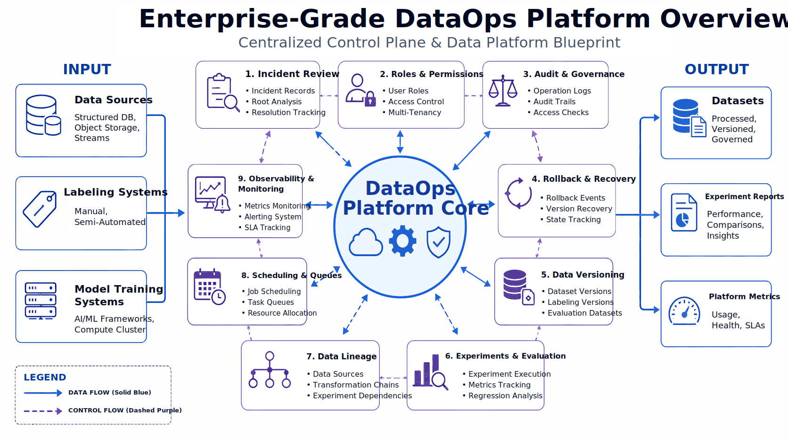

*Figure 1: P08 DataOps platform overview.*

---

## 4. Overall Architecture: Layered Structure of the DataOps Platform

The current platform contains **4 core layers**, **4 queues**, and **5 UI panels**.

This shows that the prototype is not organized around one scheduler.

It is organized by system layers, operating objects, and governance views.

From an engineering perspective, the most explainable structure has four layers.

### 4.1 Access and Service Layer

This layer accepts tenants, projects, users, and external systems.

It usually includes APIs, authentication, role validation, and console entry points.

The platform should not build internal logic first and then add an entry point later.

It should define from the beginning who enters the system, with which identity, and under which boundary.

### 4.2 Scheduling and Execution Layer

This layer turns actions on the platform into tasks.

It includes task queues, scheduling rules, execution status, failure retries, and event triggers.

Without this layer, the platform is only a metadata system.

With only this layer, the platform degenerates into a normal scheduling system.

The platform must bring execution capability and governance capability together.

### 4.3 Metadata and Governance Layer

This is the core layer of a DataOps platform.

It records versions, experiments, lineage, audit, alerts, SLA, rollback, and governance policies.

This is where the platform differs from a script orchestration tool.

Without this layer, a team can at most know whether a task finished.

With this layer, the team knows why a task ran, how to trace problems, and how to recover when regression appears.

### 4.4 Storage and Asset Layer

This layer stores data versions, experiment results, evaluation reports, operation logs, configuration files, and operational records.

It ensures that the platform manages reusable data and governance assets, not just abstract processes.

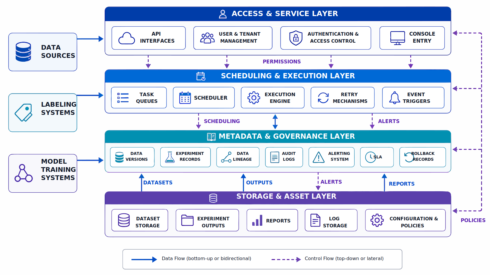

*Figure 2: Four-layer platform architecture.*

---

## 5. Platform Flow: Specification Generation, Simulated Run, Evaluation, and Checks

The current project flow is:

1. `src/build_platform_specs.py`: generate platform specifications and governance design.
2. `src/simulate_platform_ops.py`: simulate platform operation.
3. `src/evaluate_platform.py`: evaluate platform metrics.
4. `src/render_p8_chapter.py`: render chapter preview, mentioned in README but currently missing.
5. `src/run_p8_checks.py`: run project checks.

This order is important.

It shows the difference between a platform project and a normal data-script project.

> A platform must first define what the system is, then run what the system does, and finally evaluate how the system ran.

P08 does not start by writing many task scripts and then adding documentation afterward.

It first builds the specification and governance layers.

It then simulates platform operation and operations management.

This reflects a key platform principle:

- define objects and rules first;
- define runtime and events second;
- define metrics and acceptance last.

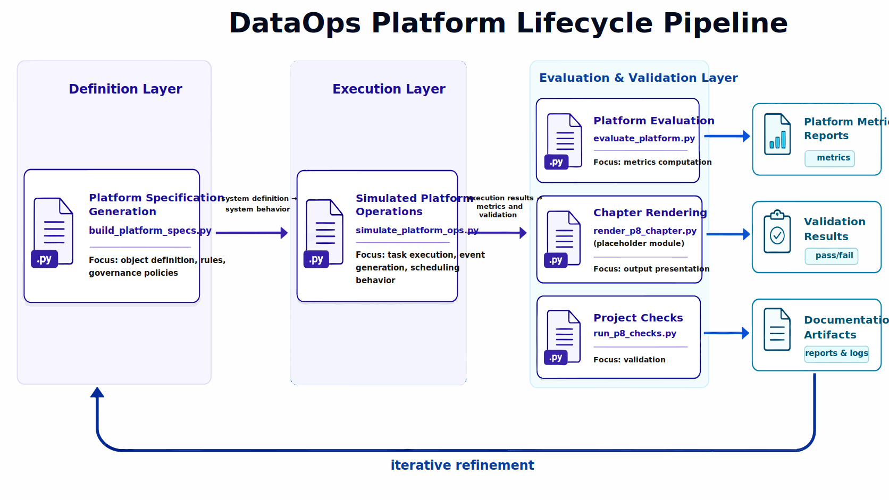

*Figure 3: Specification generation, simulated operation, evaluation, and check flow.*

---

## 6. Object Modeling: Key Object Hierarchy of the Platform

The current platform manages the following key objects:

- tenants: `3`
- projects: `3`
- roles: `5`
- APIs: `6`
- core layers: `4`
- queues: `4`
- UI panels: `5`

These relationships show that P08 does not start from a feature menu.

It starts from platform objects.

That is one important difference between an enterprise platform and a personal script system.

### 6.1 Tenant

A tenant is the top-level resource and governance boundary.

It determines resource isolation.

It also determines permissions, effective scope, approval chains, and governance rules.

A platform without a tenant concept can hardly become a true organization-level shared system.

### 6.2 Project

A project is the actual work unit of the platform.

Data versions, experiment runs, alert events, deliverables, and reports should all belong to a concrete project.

The project layer ensures that the platform is not an abstract governance shell.

It gives teams an operational space that can actually carry work.

### 6.3 Role

The current platform has `5` roles.

The importance of the role model is that it turns "who can do what" from verbal cooperation into system capability.

For example:

- who can create versions;
- who can release versions;
- who can view audit logs;
- who can execute rollback;
- who owns incident review.

In a platform project, roles are not decoration.

They establish the basic responsibility boundary.

### 6.4 APIs, Queues, and UI Panels

The platform has `6` APIs, `4` queues, and `5` UI panels.

These three object families represent:

- **APIs**: programmatic entry points for platform capability;
- **queues**: runtime carriers for platform tasks;
- **UI panels**: ways to organize governance views.

Together, they show that P08 is not only an offline artifact.

Even at prototype level, it considers how the system is called, executed, and observed.

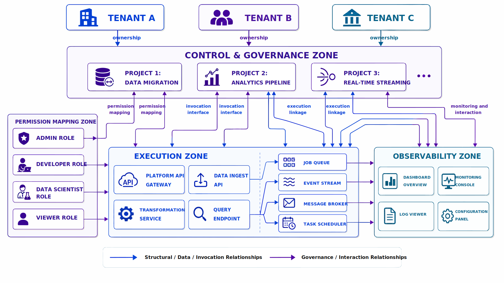

*Figure 4: Tenant, project, role, and API relationship.*

---

## 7. Code Connection: Turning Platform Specifications into Structured Artifacts

P08 deliverables already include:

- `data/processed/platform_scope.json`
- `data/processed/architecture_spec.json`
- `data/processed/api_catalog.json`
- `data/processed/task_queues.json`
- `data/processed/governance_policy.json`
- `data/processed/operating_model.json`

This shows that the platform design is not only textual explanation.

Core specifications are materialized as structured files.

The following implementation illustrates how platform specifications become structured artifacts:

```python
from pathlib import Path
import json

OUTPUT_DIR = Path("data/processed")
OUTPUT_DIR.mkdir(parents=True, exist_ok=True)

platform_scope = {
    "tenant_count": 3,
    "project_count": 3,
    "roles": [
        "admin",
        "platform_pm",
        "data_engineer",
        "qa",
        "ops",
    ],
    "core_layers": 4,
    "queues": 4,
    "ui_panels": 5,
}

with open(OUTPUT_DIR / "platform_scope.json", "w", encoding="utf-8") as f:
    json.dump(platform_scope, f, ensure_ascii=False, indent=2)
```

This structure reflects three platform-design characteristics:

1. Platform objects are explicitly modeled.
2. Specification definition happens before the runtime process.
3. Platform capability is fixed through structured artifacts, not summarized verbally after execution.

Compared with only showing an architecture diagram, this expression is closer to an implementable platform design.

---

## 8. Version Governance: The Platform's Version Center

The current platform manages **6 data versions**, of which **5 are released**.

The scale is not large, but it is enough to support an important point:

> For a DataOps platform, version is not an auxiliary field. It is the basic language of the whole governance loop.

### 8.1 Versions and Explainability

In a platform without version governance, experiment results usually only mean "what was produced this time."

The more important questions are:

- which data version did this result depend on?
- what changed compared with the previous version?
- which change caused the metric movement?
- is this version releasable?
- if rollback is needed, where should the system roll back?

If the system cannot answer these questions, an experiment result is only a one-time observation.

It is not reusable organizational knowledge.

### 8.2 Version Governance Is Not Directory Naming

Many teams create directories by date or owner name and call that version management.

This provides surface separation, but not real platform governance.

True version governance should include at least:

- a unique version identifier;
- version status;
- upstream dependencies;
- change summary;
- release and freeze rules;
- rollback-candidate relationship;
- references to experiments, reports, and release objects.

### 8.3 Version Structure Example

```python
dataset_version = {
    "version_id": "ds_v005",
    "project_id": "p02_legal_sft",
    "status": "released",
    "parent_version": "ds_v004",
    "change_summary": [
        "add high-risk refusal samples",
        "fix duplicated chunking",
        "sync new evaluation labels",
    ],
    "rollback_candidate": True,
}
```

In this structure, a version is no longer a static label.

It is a governance object that participates in runtime, evaluation, and rollback.

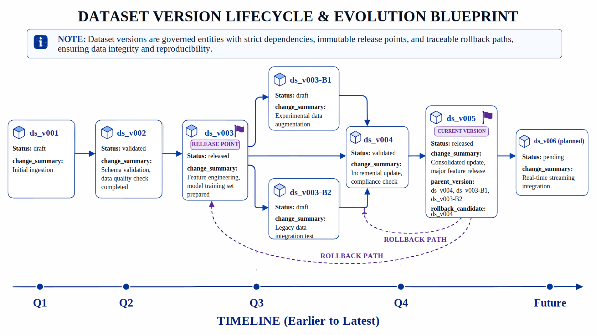

*Figure 5: Version lifecycle with release and rollback points.*

---

## 9. Experiment Tracking: Run Records and Cause Tracing

The current platform records **7 experiments**:

- `completed = 5`
- `regressed = 1`
- `failed = 1`

These numbers are representative because the platform does not keep only successful experiments.

### 9.1 Preserve All Experiment Records

Many project reports show only the best result.

Platform governance is not meant to produce a beautiful presentation.

It is meant to preserve the real operational trajectory of the team.

Failed, regressed, and unstable experiments are often the most valuable platform assets.

They answer questions such as:

- which strategies did not work;
- which versions are risky;
- which metrics are most sensitive to fluctuation;
- which experiment results should not enter release.

### 9.2 What an Experiment Object Should Contain

A platform-level experiment object should include at least:

- experiment ID;
- project ID;
- referenced data version;
- key configuration;
- run status;
- result summary;
- evaluation conclusion;
- whether it triggered an alert;
- whether it relates to rollback.

This lets the platform move from "an experiment happened" to "the experiment can be accountable, reviewable, and gated."

### 9.3 Simplified Experiment Record

Listing P08-4 provides a Python implementation fragment to illustrate the input/output relationship, structural constraints, or execution method in this section.

```python
experiment_run = {
    "experiment_id": "exp_007",
    "project_id": "p02_legal_sft",
    "dataset_version": "ds_v005",
    "status": "regressed",
    "metric_summary": {
        "f1": 0.79,
        "latency_ms": 620,
    },
    "requires_review": True,
}
```

The role of this fragment is to turn the preceding process into a checkable structured representation.

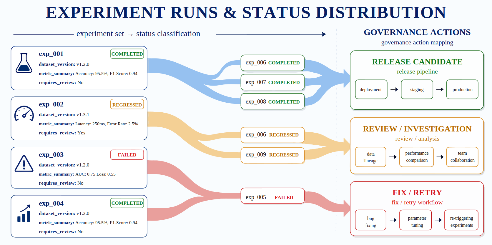

*Figure 6: Experiment status distribution and governance actions.*

---

## 10. Lineage Graph: Linking Versions, Experiments, and Events

The current lineage graph contains **21 nodes** and **19 edges**.

This means the platform has begun to organize dependencies as a graph instead of staying at table records.

### 10.1 Causal Tracing Value of Lineage

The real value of a lineage graph is that it helps teams answer a chain of key questions:

- which experiments used a data version?
- did a failed experiment affect later release?
- which alert was triggered by which experiment or version?
- which chain did a rollback return to?
- which upstream objects produced a report?

Without a lineage graph, these questions require manual tracing.

With a lineage graph, they become daily platform capability.

### 10.2 Simple Edge Definition

Listing P08-5 provides a Python implementation fragment to illustrate the input/output relationship, structural constraints, or execution method in this section.

```python
lineage_edge = {
    "from": "dataset:ds_v005",
    "to": "experiment:exp_007",
    "relation": "used_by",
}
```

The role of this fragment is to turn the preceding process into a checkable structured representation.

### 10.3 Why Introduce Lineage During the Prototype Stage

Many teams think lineage should wait until the platform is mature.

The opposite is usually true.

The earlier lineage is introduced, the easier it is to form sustainable object design.

If versions, experiments, alerts, rollbacks, and reports are treated as connected graph objects from the start, later platform expansion becomes smoother.

If they start as isolated tables, adding lineage later is usually more expensive.

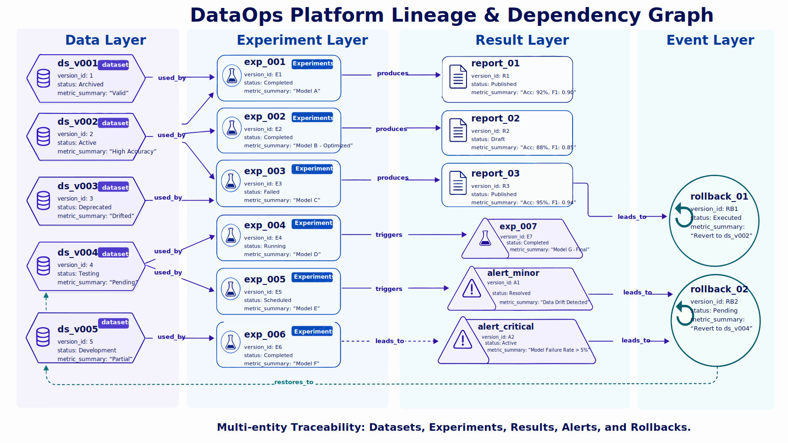

*Figure 7: Version, experiment, result, and rollback lineage.*

---

## 11. Rollback Mechanism: The Platform's Recovery Capability

The current platform explicitly preserves `rollback=1`.

This matters because the platform manages not only the forward path but also the withdrawal path.

### 11.1 Rollback as a Basic Capability

Real data projects do not improve linearly.

A data revision, cleaning-logic change, evaluation-set replacement, or task-order change can make results worse.

If the platform has no explicit rollback capability, teams must restore historical files manually, switch versions by hand, or redeploy old objects after problems occur.

That creates several problems:

- recovery takes longer;
- operations are not auditable;
- responsibility boundaries are unclear;
- experience cannot be accumulated.

### 11.2 What a Rollback Event Should Record

A valid rollback event should include at least:

- rollback ID;
- trigger reason;
- related experiment or alert;
- target rollback version;
- execution time;
- operator;
- recovery status;
- follow-up review link.

### 11.3 How Rollback Supports Organizational Trust

When a platform regresses, the core risk is not that the team has to step back.

The core risk is that stepping back is uncontrollable.

A platform with rollback capability turns "what do we do if something goes wrong" from emergency firefighting into a standard action.

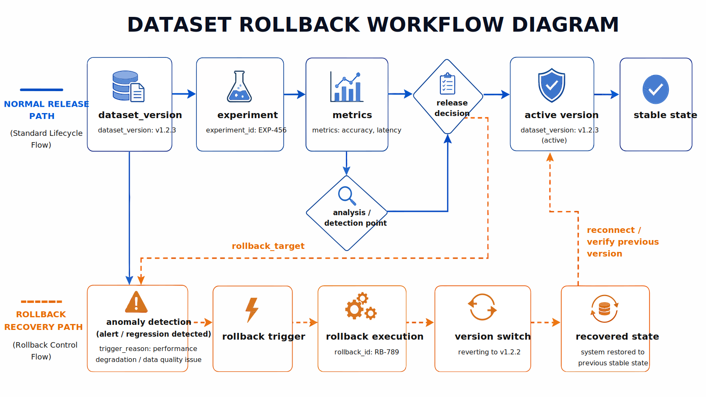

*Figure 8: Rollback trigger and recovery flow.*

---

## 12. Observability: Judging Platform Health

The current observability side includes:

- alerts: `3`
- resolution rate: `100.00%`
- SLA compliance rate: `100.00%`
- average incident recovery time: `36.5` minutes

This shows that P08 is not only counting whether tasks ran successfully.

It begins to measure questions closer to real platform operations:

- are there alerts?
- were alerts resolved?
- did the platform meet SLA?
- how long did recovery take?

### 12.1 Beyond Logs

Logs are important.

But logs only answer "what happened."

Platform operations need more dimensions:

- metrics answer whether the system deviated;
- alerts answer whether response is required;
- audit answers who did what;
- incident review answers how the team will avoid the same issue later.

Together, these dimensions form the observability loop.

### 12.2 SLA Perspective

The value of SLA is that it converts system operation into service commitment.

Once the platform enters organizational use, teams care about more than whether scripts can finish.

They care whether:

- the platform stays available;
- anomalies are found in time;
- failures recover within an acceptable time;
- key governance actions are protected.

### 12.3 Simplified Alert Structure

Listing P08-6 provides a Python implementation fragment to illustrate the input/output relationship, structural constraints, or execution method in this section.

```python
alert = {
    "alert_id": "alert_003",
    "severity": "high",
    "category": "sla_risk",
    "related_object": "experiment:exp_007",
    "status": "resolved",
}
```

The role of this fragment is to turn the preceding process into a checkable structured representation.

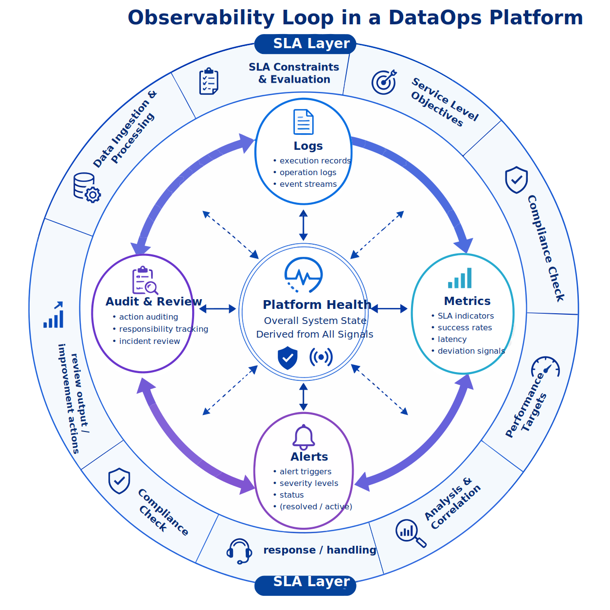

*Figure 9: Metrics, logs, alerts, and audit loop.*

---

## 13. Audit and Incident Review: Making Incident Review Part of the Platform

P08 deliverables explicitly include:

- `alerts.jsonl`
- `audit_log.jsonl`
- `incident_reviews.jsonl`
- `sla_report.json`

This means incident handling is not left outside the system.

That is important because many teams turn incident reviews into meeting notes or chat records instead of platform assets.

The consequence is that the incident was discussed, but the platform did not become stronger.

### 13.1 What Incident Review Should Preserve

A valuable incident review should record more than the fact that a problem happened.

It should preserve:

- symptom;
- impact scope;
- root-cause analysis;
- temporary mitigation;
- permanent fix items;
- responsible roles;
- deadlines;
- related versions or objects.

### 13.2 Linking Audit Logs and Incident Reviews

Audit logs answer "who did what."

Incident reviews answer "why did it go wrong, and how will it not happen again."

If they exist separately, the platform only provides partial evidence.

If they are linked, the platform gains learning capability.

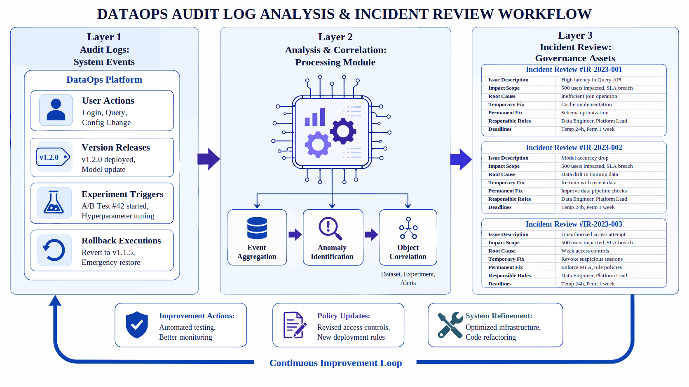

*Figure 10: Audit logs and incident review.*

---

## 14. Console and Operations Views: Panelized Governance Objects

The current platform has **5 UI panels**.

Although this project does not focus on UI implementation, this number shows that governance objects need to be organized into different views.

For a DataOps platform, the value of panels is not that visualization looks nice.

Their value is to:

- classify objects;
- present runtime status structurally;
- separate what different roles need to see;
- turn daily platform actions into understandable operations.

A reasonable console can include:

1. platform overview panel;
2. version and release panel;
3. experiment and evaluation panel;
4. alert and SLA panel;
5. audit and incident-review panel.

This design means the platform is not one large mixed page.

It separates governance objects into views by responsibility.

---

## 15. Project Checks: Platform Consistency Verification

The project currently has `13` checks, all passing.

There are `2` command-level checks and `11` data/artifact-level checks.

The checks cover:

- `py_compile`
- `evaluate_platform`
- `required_files_exist`
- `role_and_permission_model_present`
- `architecture_layers_complete`
- `api_queue_ui_present`
- `version_lineage_links_valid`
- `experiments_reference_versions`

These checks are important because they decide whether the platform really verifies consistency among code, artifacts, and reports.

### 15.1 Role of the Check Chain

Many project documents can look polished.

Architecture diagrams, process diagrams, and metric explanations may all appear complete.

But if code, artifacts, and reports do not match, readers learn packaging rather than engineering.

### 15.2 Meaning of Checks in a Platform Project

For platform projects, checks serve at least three functions:

- verify whether deliverables are complete;
- verify whether object relationships are reasonable;
- verify whether report descriptions match actual data.

### 15.3 Simplified Check Example

Listing P08-7 provides a Python implementation fragment to illustrate the input/output relationship, structural constraints, or execution method in this section.

```python
required_files = [
    "data/processed/platform_scope.json",
    "data/processed/architecture_spec.json",
    "data/processed/dataset_versions.jsonl",
    "data/processed/experiment_runs.jsonl",
    "data/reports/p8_metrics.json",
    "data/reports/p8_test_report.md",
]

for path in required_files:
    assert Path(path).exists(), f"Missing required artifact: {path}"
```

The role of this fragment is to turn the preceding process into a checkable structured representation.

This check looks simple.

It effectively moves platform engineering from "conceptually correct" to "delivery consistent."

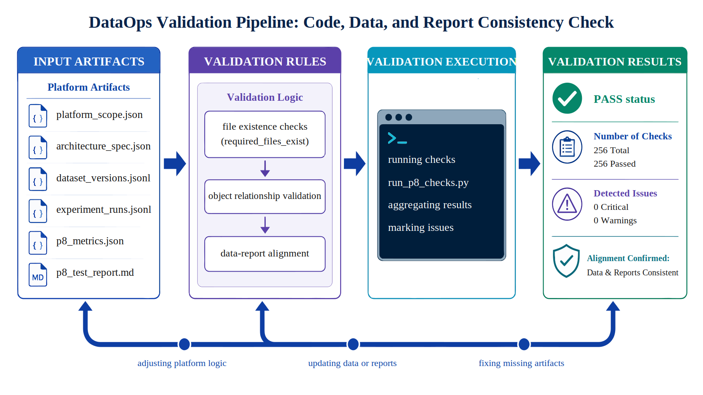

*Figure 11: Check pipeline and consistency validation.*

---

## 16. Main Deliverables: The Complete Platform Artifact Chain

P08's main deliverables include:

- `data/processed/platform_scope.json`
- `data/processed/architecture_spec.json`
- `data/processed/api_catalog.json`
- `data/processed/task_queues.json`
- `data/processed/governance_policy.json`
- `data/processed/operating_model.json`
- `data/processed/dataset_versions.jsonl`
- `data/processed/experiment_runs.jsonl`
- `data/processed/lineage_graph.json`
- `data/processed/rollback_events.jsonl`
- `data/processed/alerts.jsonl`
- `data/processed/audit_log.jsonl`
- `data/processed/incident_reviews.jsonl`
- `data/processed/sla_report.json`
- `data/console/ui_panels.json`
- `data/reports/p8_report.md`
- `data/reports/p8_chapter_preview.pdf`
- `data/reports/p8_preview_stats.json`
- `data/reports/p8_metrics.json`
- `data/reports/p8_test_results.json`
- `data/reports/p8_test_report.md`

This artifact list shows that P08 is not only a final report.

It has formed a full platform artifact chain.

From these files, we can see three points:

- the platform is not only a final presentation layer;
- intermediate states and governance objects are preserved;
- reports, metrics, and checks are generated from real artifacts rather than written backward.

---

## 17. Result Interpretation: Current Platform Characteristics in P08

A key characteristic of P08 is that it does not shrink the platform into an idealized success-only path.

It explicitly preserves:

- regressed experiments;
- failed experiments;
- rollback events;
- alerts and incident reviews;
- a small gap between documentation and code.

Together, these signals show that the current platform covers several object and state categories that matter most in real governance.

It is not only presenting a static architecture.

If a platform prototype keeps only concepts and success paths, later governance capability is difficult to validate.

P08 currently includes two kinds of information at the same time:

- structured governance objects such as objects, rules, versions, experiments, and audit records;
- failure-path information such as regression, failure, rollback, and review.

A platform does not have to be large.

But key governance objects and failure paths must be systematically preserved.

Only then can the platform continue expanding into organization-level capability.

---

## 18. Limitations and Risks: Boundaries of the Platform Prototype

The current project has at least three limitations that should be explicitly preserved.

### 18.1 It Is Still a Prototype

The project already has object modeling, simulated operation, metric evaluation, and check loops.

It is still not a production-grade control plane.

This makes it more suitable as a methodology sample than as an online platform solution.

### 18.2 Documentation and Code Still Have Local Inconsistency

The README mentions `render_p8_chapter.py`, but that script is currently missing.

This does not invalidate the project.

It shows that synchronization between platform engineering and documentation is still a follow-up task.

### 18.3 Deep Multi-tenant Governance Has Not Yet Unfolded

The project explicitly includes tenants.

But cross-BU and cross-organization isolation, approval, quota, and governance depth are not fully developed.

This is one of the key gaps between a prototype and an organization-level system.

Writing these limitations down does not weaken the project.

It improves the credibility of the case.

---

## 19. Follow-up Extensions: Toward Organization-level DataOps

Given the current platform structure, P08 has three natural extension directions.

### 19.1 From Prototype Governance to Multi-BU Collaborative Governance

To extend the current small-team prototype into a real cross-team environment, the platform needs:

- quota management;
- finer-grained permissions;
- approval and exception mechanisms;
- multi-tenant isolation strategies.

### 19.2 From Static Records to Dynamic Gates

The current platform can record versions, experiments, alerts, and rollbacks.

The next step is to connect these objects to dynamic gate logic.

Examples include:

- automatic blocking of release when an experiment regresses;
- SLA risk triggering a freeze;
- high-risk versions requiring human approval;
- rollback in key projects entering an escalation process.

### 19.3 From Technical Platform to Operating Platform

Many platform projects stop at "the system has been built."

A true organization-level platform also needs operating rhythm:

- version-freeze days;
- weekly governance meetings;
- on-call mechanisms;
- incident-review cadence;
- SLA weekly or monthly reports;
- release-gate review.

Only when these rhythms connect to platform objects does DataOps move from tool to organizational capability.

---

## 20. Chapter Summary: Responsibility, Evidence, and Recovery Capability

The key value of P08 is not proving that a platform can manage many JSON files.

It proves something more important:

> When data engineering moves from single-project collaboration to long-term organizational operation, the platform's core responsibility is not to make process pages look uniform. It is to make versions, experiments, failures, alerts, rollbacks, and reviews traceable system objects.

From the current project results, P08 already has several engineering characteristics:

- clear platform boundaries instead of a system that claims to do everything;
- a complete chain from specification generation to simulated operation, metric evaluation, and project checks;
- governance objects such as versions, experiments, lineage, rollback, SLA, alerts, audit, and incident review;
- real failure paths instead of a success-only demo;
- `13/13` passing checks, showing consistency among code, artifacts, and reports.

Therefore, P08's real value is not that it builds a platform prototype.

It uses a moderately sized project to make the most important enterprise DataOps governance logic explainable, verifiable, and reusable.

The chapter's central conclusion can be compressed into one sentence:

> A DataOps platform should not build more pages first. It should build a more complete governance loop.

---

## Special Topic: Implementation Path from Prototype to Organizational Pilot

When teams see a prototype like P08, the first reaction is often: should we build a large all-in-one platform first?

In practice, that is one of the easiest ways for platform projects to fail.

A more realistic path is to split platform construction into stages so the object model, governance capability, and organizational adoption grow together.

### Stage 1: Solidify Objects and Boundaries First

The first step of platformization is usually not writing UI or connecting every scheduler.

It is fixing the most important system objects.

At minimum, the team should answer:

- which tenants, projects, and roles does the platform manage;
- what are data versions, experiments, alerts, rollbacks, and audits as objects;
- which operations are inside the platform and which remain external scripts;
- which workflows are supported within current boundaries and which are not.

The success sign of this stage is not "many functions."

It is that everyone starts using the same vocabulary to describe the same things.

Once this is achieved, later metrics, panels, and automatic gates have clear objects to attach to.

If it is not achieved, more features will make the system less focused.

### Stage 2: Connect the Main Chain of Version, Experiment, and Release

When a prototype enters pilot, the highest-priority chain is version, experiment, and release.

This is where the most frequent organizational disputes usually happen.

At this stage, the platform should answer:

- who created a version, when it was created, and what changed;
- which version an experiment used, what parameters it used, and which evaluation results it produced;
- why a result entered release or why it was rolled back;
- whether a regression happened in versioning, experiment design, evaluation, or scheduling.

Once this main chain is open, the platform already solves many problems around version loss of control and responsibility blur.

More visually impressive features, such as complex workbenches, unified chart walls, or fine-grained workflow orchestration, can be added later.

### Stage 3: Connect Failure Paths to the Main Platform Structure

The real difference in an organizational pilot often appears in failure paths.

If the platform only records successful releases, it soon becomes a display board.

Only when failed experiments, regression alerts, approval blocks, and rollback events are structurally preserved does the platform become governance infrastructure.

This stage should prioritize four items:

- objectify alerts so they do not remain only in messaging tools;
- structure rollback so recovery actions are traceable and reviewable;
- standardize incident review so incident experience feeds back into processes;
- preserve exception approvals so high-risk release is not based on verbal communication.

Some teams worry that writing failure paths into the platform makes the system look unstable.

The opposite is true.

Only a platform that objectifies failures has a chance to become stable.

Stability does not mean no problems.

It means problems can be located, recovered from, and learned from.

### Stage 4: Promote Multi-team Adoption and Operating Rhythm

After the main structure is clear and failure paths are part of the system, the platform is ready for broader team adoption.

The focus then moves from what the system can do to whether the organization will keep using it.

This usually requires:

- team onboarding;
- platform operation manuals and role descriptions;
- weekly reports, monthly reports, on-call cadence, and review cadence;
- dashboard presentation of key metrics;
- version freeze, release review, and exception-approval mechanisms.

Entering an organizational pilot does not mean all technical problems are solved.

It means the platform has begun to carry real collaboration relationships.

At that point, platform construction is no longer a pure technical project.

It is an organizational project with technical and operational dimensions.

---

## Special Topic: Platform-level Metrics and Operating Rhythm

Platform projects easily fall into the mistake of treating metrics as a pile of technical numbers, such as job success rate, CPU usage, or average runtime.

These metrics matter.

But they are not enough to decide whether a DataOps platform creates organizational value.

Platform-level metrics should cover adoption, quality, governance, and recovery.

### Adoption Dimension: Is the Platform Actually Used?

The first question is not how many functions the platform has.

It is whether teams complete key actions inside the platform.

Adoption metrics should include:

- active tenant count, active project count, and active role coverage;
- platform-internal completion rate for key actions such as version creation, release approval, rollback initiation, and alert confirmation;
- number of experiments, releases, and audit records entering through the platform;
- consistency of object-model usage across teams.

If these metrics stay low, the platform exists but has not become the work entry point.

If they rise, the platform has moved from usable tool to organizational habit.

### Quality Dimension: Does the Platform Reduce Uncertainty?

The platform is not meant to replace scripts mechanically.

It is meant to reduce system uncertainty.

Quality metrics can include:

- reference completeness from versions to experiments;
- alignment rate from experiments to reports;
- pre-release check pass rate;
- regression localization time;
- number of consistency gaps among documentation, code, and artifacts.

These metrics reflect whether the platform reduces the state where "something went wrong but nobody knows where."

If that state declines, the platform is already creating real engineering value.

### Governance Dimension: Are High-risk Actions Controlled?

The largest difference between a DataOps platform and an ordinary internal system is that it must constrain high-risk actions.

Governance metrics can include:

- whether high-risk versions all pass approval;
- whether alerts are acknowledged and handled within the required time;
- whether audit-log coverage meets expectations;
- whether key role-permission changes are recorded;
- whether incident reviews form a repair loop.

These metrics may not directly improve performance.

They determine whether the organization can trust the platform for a long time.

Many platforms can run technically, but missing governance makes teams bypass them at critical moments.

### Recovery Dimension: Can the System Recover Orderly After Problems?

Recovery is one of the most valuable and most overlooked metric dimensions.

Organizations do not only care whether problems happen.

They care whether the team can recover quickly and learn how to avoid similar problems.

Recovery metrics can include:

- rollback trigger count and success rate;
- average recovery time and critical-event recovery time;
- completion rate of high-priority incident reviews;
- repeated occurrence rate of similar issues;
- traceability from alert trigger to recovery completion.

These metrics help the platform move from seeing problems to handling problems and accumulating experience.

### Operating Rhythm: Metrics Must Enter Fixed Mechanisms

Metrics lose vitality if they remain in reports.

A more effective pattern is to embed different metric groups into fixed operating rhythms.

A practical rhythm can be:

- daily review of runtime, alert, and recovery metrics;
- weekly review of versions, experiments, regressions, and gate metrics;
- monthly review of tenant adoption, governance maturity, and platform benefit metrics;
- quarterly review of cross-team collaboration, process execution, and expansion direction.

Then platform metrics are no longer collected for reporting.

They enter daily governance actions.

Once metrics enter rhythm, the platform gradually becomes an organizational habit.

---

## Special Topic: Common Anti-patterns in DataOps Platform Construction

Building a platform is not the hardest part.

The harder part is avoiding anti-patterns that look reasonable at first but damage the system over time.

P08 is a good prototype case for making these anti-patterns explicit.

### Anti-pattern 1: Console Without Object Model

This is one of the most common and dangerous anti-patterns.

A team first builds pages that look like a platform, with lists, charts, and buttons.

But when asked how versions, experiments, rollbacks, and alerts relate to each other, the answer is unclear.

The result is that pages keep increasing while the system becomes harder to explain.

A platform without an object model can look fast in the short term.

Long term, it cannot carry governance.

Every new function has to hang from the UI layer instead of stable system objects.

### Anti-pattern 2: Recording Only Success Paths

Many internal platforms preserve successful releases, smooth experiments, and pretty metrics, while leaving failed experiments, abnormal recovery, and manual intervention outside the system.

The result is that the platform can only tell the ideal process.

It cannot support real review.

Once an organization depends on a platform, failure paths must be part of that platform.

Otherwise, every incident sends the team back to chat logs, temporary scripts, and personal memory.

The platform then loses its most important value.

### Anti-pattern 3: Adding Audit and Permissions Last

Another frequent anti-pattern is to run the main process first and add audit, permissions, and approval later.

These capabilities are not surface decorations.

They are part of many object relationships.

If the main process is already fixed, adding them later often means refactoring half the system.

A safer approach is to put role boundaries, audit traces, and high-risk operation control points into the system skeleton from the beginning, even in minimal form.

The earlier the platform considers these issues, the easier it is to extend.

### Anti-pattern 4: Treating Version Governance as Directory Naming

Some teams reduce version governance to naming rules.

Naming rules help people find files.

They are not governance.

True governance includes version metadata, references, release time, approval status, rollback links, and experiment dependencies.

If these do not exist, version management is only a neater folder structure.

P08 emphasizes version centers, experiment tracking, and lineage relationships precisely to avoid this misunderstanding.

Directories help humans locate files.

Structured objects help the system explain causality.

### Anti-pattern 5: Treating the Platform as a Technical Tool Instead of an Organizational Mechanism

The final anti-pattern is also why many platforms never grow.

The team treats the platform as an internal tool written by engineers for engineers.

With that understanding, it is difficult to include project managers, governance roles, audit roles, and operations roles.

It is also difficult to form a fixed operating rhythm.

A real platform is also an organizational mechanism.

It defines who is responsible for what, when exceptions are allowed, which metrics must be tracked, which incidents must be reviewed, and which risks cannot be released verbally.

Only when these mechanisms connect to platform objects does DataOps upgrade from a system to an organizational capability.

---

## Special Topic: Role Conflict and Governance Collaboration During Platform Pilots

After a DataOps platform enters pilot, it often faces a real but less technical issue.

Different roles do not understand the same platform goal in the same way.

The platform team cares about structure and consistency.

Business teams care about efficiency.

Governance teams care about boundaries and responsibility.

Management cares about rhythm and results.

If these views are not explicitly absorbed by the platform, friction appears repeatedly during the pilot.

### Role Conflict Is Usually Not Bad. It Is a Signal.

Common conflicts include:

- business teams want fast release, while governance teams require approval completion;
- algorithm teams want flexible experiments, while the platform team requires unified version entry;
- operations teams care about stability, while project teams care about local efficiency;
- management wants an overall dashboard, while frontline teams need fine-grained context.

These conflicts do not mean the platform has failed.

They mean the platform has started to connect to real collaboration relationships.

The key is not to eliminate conflict.

The key is to let conflict be absorbed into platform objects and governance mechanisms instead of returning to temporary communication every time.

### The Platform Must Provide Different Kinds of Correctness for Different Roles

For platform engineering, one important realization is that different roles define correctness differently.

For engineers, correctness may mean clear object relationships and complete version references.

For governance roles, correctness may mean all high-risk actions are recorded and traceable.

For business roles, correctness may mean the process does not block work excessively.

For management, correctness may mean risk and progress are visible at a glance.

This means one view cannot serve everyone.

A mature platform exposes different levels of information around the same objects:

- engineering roles see structure and dependencies;
- governance roles see approval, audit, and risk;
- business roles see progress, blockers, and delivery status;
- management roles see milestones, trends, and overall health.

Once this is done, many "the platform is not easy to use" complaints become clearer.

They mean the platform needs the right view for the role.

### Collaborative Governance Means Writing Disagreement Into Process

When a platform moves from prototype to organizational capability, what must be preserved is not that everyone always agrees.

It is how the system proceeds when they do not agree.

That usually means defining:

- which releases must go through review;
- which regressions can be temporarily allowed and which must block release;
- who can initiate an exception and who can approve it;
- how review conclusions enter the next platform improvement;
- which conflicts are process problems and which are object-design problems.

Once disagreements are written into process, the platform has governance elasticity.

It does not require the organization to have no conflict.

It requires conflict to be solved in an orderly way.

That is an important practical value of P08 as a platform case.

---

## Special Topic: Release Review and Exception Handling

When a DataOps platform enters multi-team use, it inevitably faces release review and exception handling.

Many organizations do not lack rules.

Their rules stay in documents and do not enter platform rhythm.

Writing release review and exception handling into the chapter helps readers see that platform governance records facts and also manages when change is allowed.

### Release Review Asks Whether This Version Should Be Released Now

When a platform version or key data version enters release review, the question is usually not whether the version has no problem at all.

The real question is whether the evidence is sufficient for release under current conditions.

The review should focus on:

- whether all checks passed, and if not, the risk level of failed checks;
- whether the version introduces new high-risk objects or cross-team dependencies;
- whether rollback is ready if regression appears;
- whether the release affects key tenants, key projects, or key SLA.

This kind of review upgrades release decisions from personal judgment to structured judgment.

### Exceptions Must Be Recorded as Platform Objects

Organizations always have urgent, exceptional, or temporary bypass situations.

The question is not whether exceptions should ever be allowed.

The question is whether exceptions can be objectified by the platform.

A mature exception mechanism should preserve at least:

- exception reason;
- effective scope;
- effective time;
- approving role;
- recovery and review actions after expiration.

If this information enters the platform, exceptions are not governance failure.

They are part of governance.

If exceptions always happen outside the system, the platform gradually loses authority.

---

## Special Topic: Platform Adoption Strategy

Many platform projects are technically usable but never widely adopted.

The root cause is often not missing features, but missing adoption strategy.

For a platform like P08 to form organizational habit, adoption must be designed as its own workstream.

### Start With Frequent Pain Points Before Expanding Feature Scope

The most effective adoption strategy is usually not to push the platform to all teams at once.

It is to start with the most painful, frequent, and consensus-friendly scenarios.

Examples include:

- version tracking;
- experiment regression localization;
- pre-release checks;
- rollback records.

Once these frequent pain points are handled reliably by the platform, teams naturally build usage stickiness.

### Keep First-use Cost Low

Many platforms fail not because long-term value is weak, but because first integration cost is too high.

Better patterns include:

- preset project templates;
- minimum required objects;
- automatic generation of some metadata;
- direct mapping of key results into existing reports and panels.

Then teams do not feel they are doing extra work.

They feel their existing work has gained stronger structure.

---

## Chapter Summary

This chapter uses an enterprise DataOps platform prototype to show how versions, experiments, lineage, alerts, and audit records can be organized into governable data-platform capability.

The value of the case is that task definition, data boundaries, architecture decisions, sample schema, metric acceptance, and reproducible resources are placed in the same chain.

The project is no longer a list of operations.

It becomes a reviewable case study.

The boundary of the case should also remain clear.

It is a platform prototype and governance-mechanism validation.

It does not cover a complete production control plane or complex UI.

In larger-scale, higher-risk, or stricter compliance scenarios, teams should reassess data sources, permission status, human-review ratio, runtime cost, and failure rollback plans.

As part of Part 14, this chapter validates earlier methods at project level.

Readers can combine this case with the data recipes in Part 13, the platform-governance chapters earlier in the book, and the appendices' checklists to form a closed loop from method understanding to engineering delivery.

## References

1. Raffel, C., Shazeer, N., Roberts, A., Lee, K., Narang, S., Matena, M., Zhou, Y., Li, W., and Liu, P. J. (2020). Exploring the Limits of Transfer Learning with a Unified Text-to-Text Transformer. JMLR, 21(140), 1-67.
2. Hugging Face. (2026). Datasets Documentation. https://huggingface.co/docs/datasets/.
3. Ray Project. (2026). Ray Data Documentation. https://docs.ray.io/en/latest/data/data.html.
4. MLflow Authors. (2026). MLflow Documentation. https://mlflow.org/docs/latest/.
5. Great Expectations Contributors. (2026). Great Expectations Documentation. https://docs.greatexpectations.io/.
