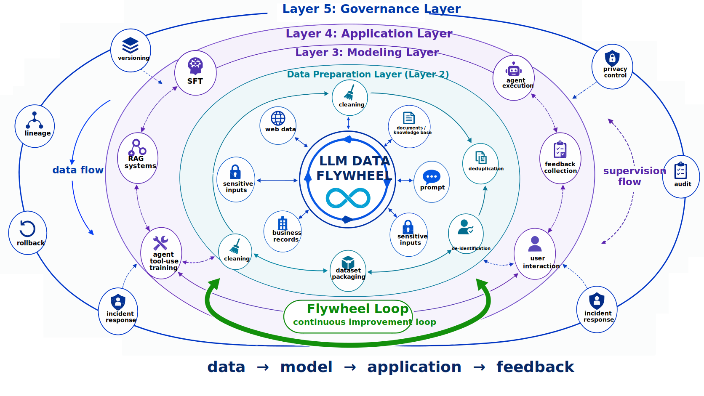
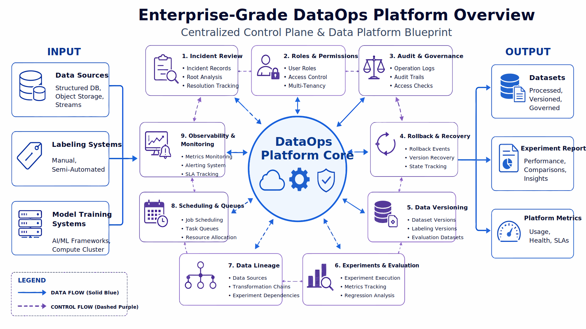
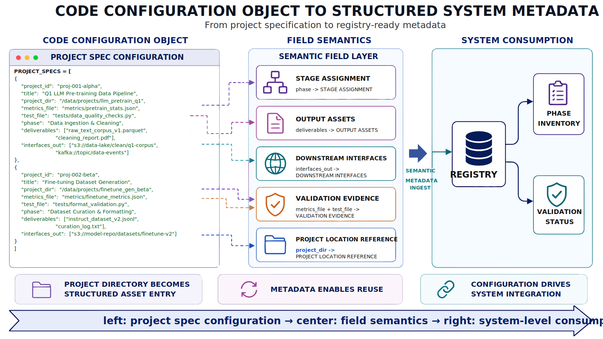
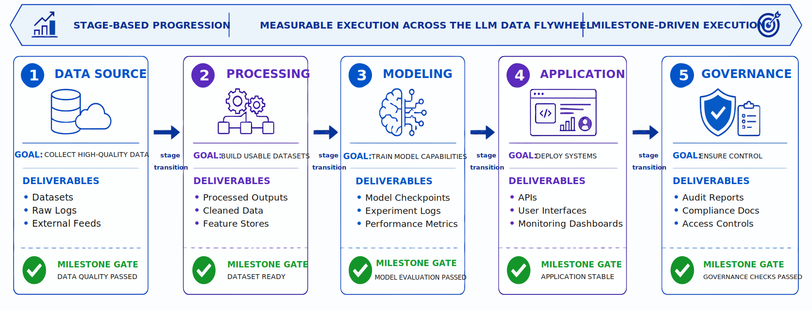
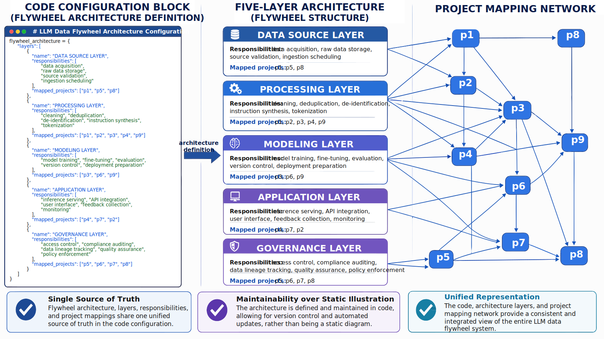
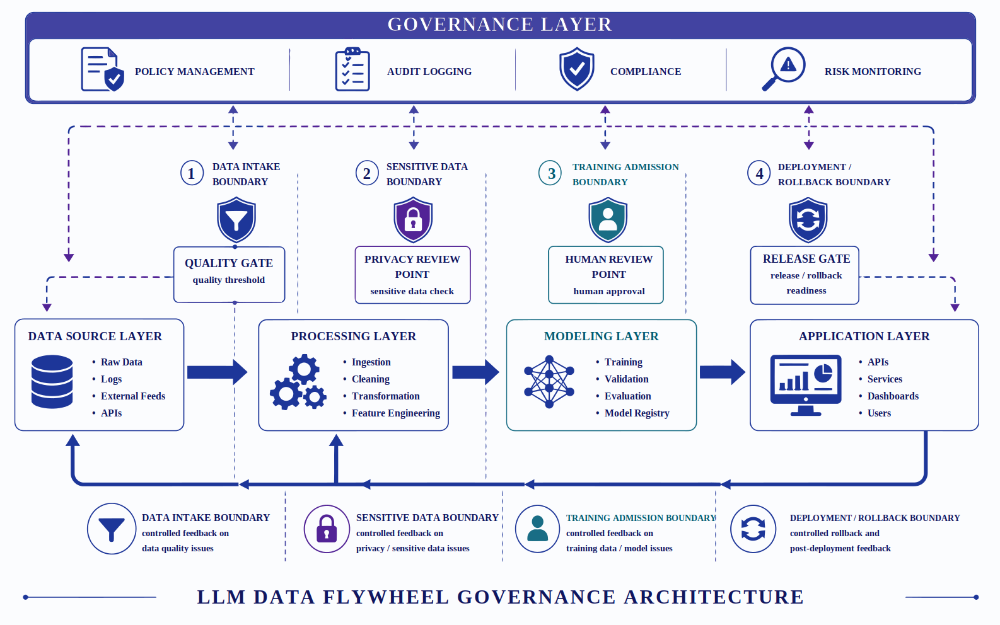
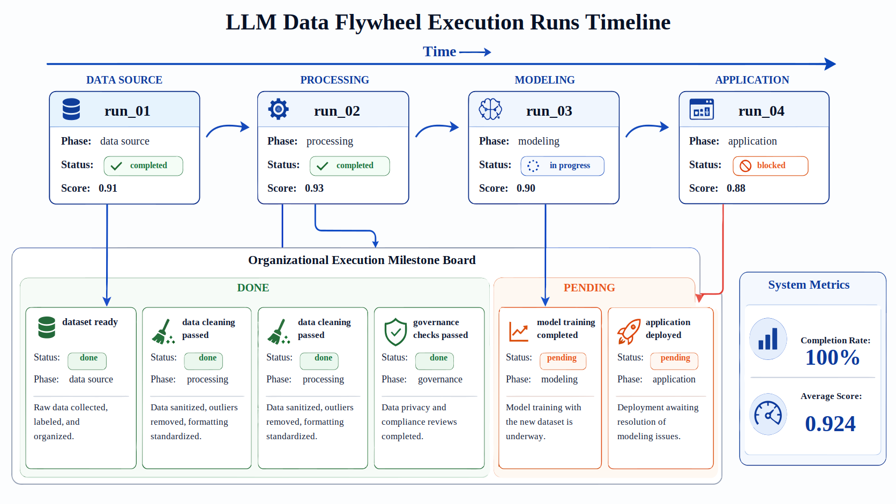
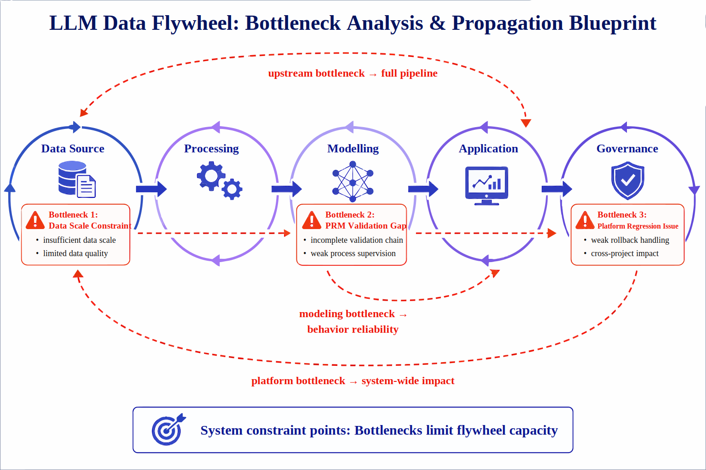
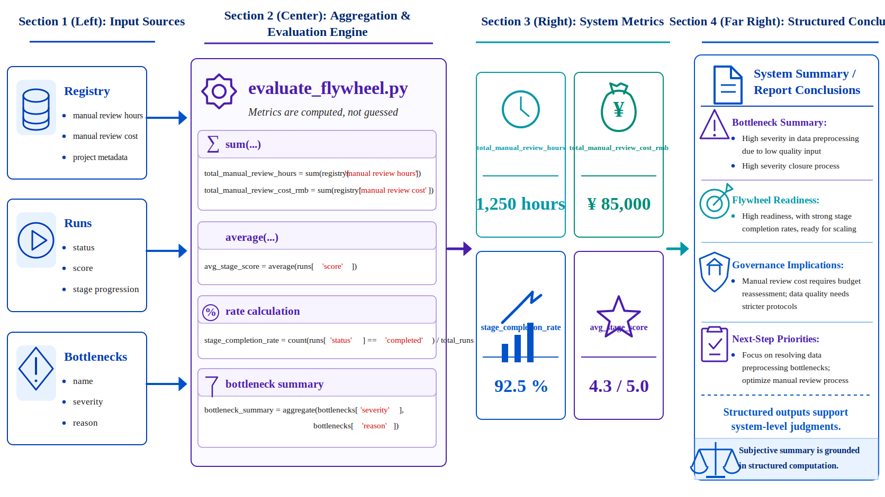
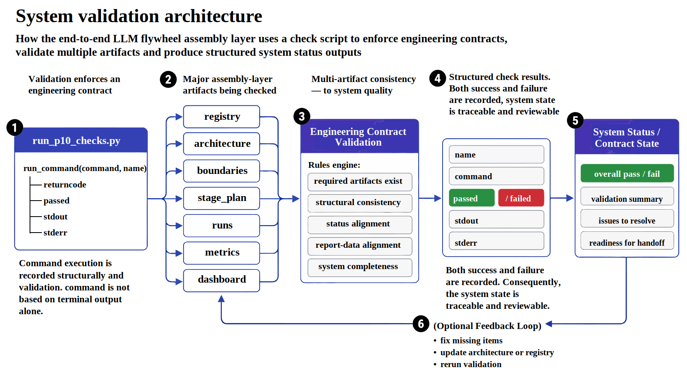

# Project 10: End-to-End LLM Data Flywheel

<div class="chapter-authors">Ke Wang; Xin Xu; Guanlin Mu</div>

## Abstract

P10 focuses on organizing data, supervision, training, applications, platform governance, and feedback reflux into a continuously operating end-to-end LLM data flywheel.

The chapter does not add one more isolated capability.

It integrates the project assets, interfaces, stages, and control points in Part 14 into one unified system.

As this part expands to P01-P15, P10's publication framing should be updated from the early "assembly of the previous nine projects" to the "assembly layer for the Part 14 projects": it covers the foundational data-engineering work in P01-P09 and also reserves space for P11-P15's open-source recipes, reasoning flywheel, multimodal instruction, video generation, and enterprise question-answering capabilities.

This chapter can be read through four main threads:

- Asset aggregation and stage planning: bring the outputs of P01-P15 into one registry and stage system.
- Training, application, and feedback interfaces: define how data enters training, how models enter applications, and how application feedback returns upstream.
- Control points and governance boundaries: write version control, rollback, human review, privacy isolation, and incident response into the system structure.
- Checks, acceptance, and organizational reuse: use code, artifacts, and check scripts to verify whether the flywheel can operate steadily.

In engineering order, the complete chain is:

**asset aggregation -> stage planning -> training packaging -> application execution -> feedback reflux -> version governance -> privacy and rollback control -> system checks**

The core goal is to turn discrete projects into a reviewable, checkable, and extensible LLM engineering flywheel.

---

## Keywords

data flywheel; feedback reflux; asset aggregation; version governance; system acceptance

## Project Goals and Reader Takeaways

This project uses an end-to-end LLM data flywheel as the core case.

The goal is to integrate upstream data projects, feedback, evaluation, and release governance into a continuously improving data flywheel.

After completing the chapter, readers should be able to identify key data objects, split the engineering chain, define acceptance metrics, and transfer the case method to similar data-engineering tasks.

## Scenario Constraints and Data Boundaries

The project emphasizes organization-level process and asset integration.

It does not replace any single model-training system or a complete MLOps platform.

These boundaries make the case reproducible and auditable.

If data scale, source type, permission scope, or deployment environment changes, sampling strategy, quality thresholds, runtime cost, and compliance requirements must be reassessed.

## Architecture Decision

The project follows an architecture path of upstream asset registration, stage planning, feedback writing, evaluation attribution, release control, and milestone governance.

This decision prioritizes input/output contracts, version traceability, anomaly localization, and result reviewability.

It avoids compressing all logic into a one-off script.

## Sample Schema and Data Flow

The core data flow can be summarized as:

```text
project assets -> registry -> stage plan -> training/evaluation feedback -> data revision -> release decision -> flywheel report
```

Sample records should at least preserve `id`, `source`, `content_or_payload`, `metadata`, `quality_signals`, `split_or_stage`, and `audit_trace`.

Exact fields should be refined according to the data type, downstream task, and acceptance method.

## Core Implementation Slice

The chapter keeps only implementation fragments that explain design tradeoffs.

Full scripts, long configurations, run logs, and large files should live in the companion repository or appendix.

The code shown here focuses on input/output contracts, quality thresholds, exception handling, and acceptance interfaces.

## Experimental or Acceptance Metrics

Acceptance metrics include asset coverage, feedback-loop rate, version iteration cycle, evaluation-regression localization, release pass rate, and milestone completion.

For production, course, or public reproduction settings, reports should also record version numbers, dependency environments, random seeds, sampled inspection results, and failed-sample review records.

*Table P10-1: Publication acceptance table for the LLM data flywheel*

| Acceptance dimension | Metric or evidence | Publication review focus |
| --- | --- | --- |
| Asset integration | Upstream project coverage, registry completeness, and interface mapping records | Every upstream asset should explain its source, owner, version, and reuse path |
| Feedback loop | Feedback reflux rate, evaluation-regression localization, and version iteration cycle | Flywheel metrics should explain triggered actions, not only dashboard display |
| Organizational decision | Release pass rate, milestone completion, and risk-ledger closure rate | Cross-project risks must have owners, deadlines, and review outcomes |

## Cost, Risk, and Compliance Boundaries

Cost mainly comes from cross-project governance, feedback collection, and repeated evaluation.

Risks concentrate on unclear attribution, metric drift, and organizational responsibility gaps.

When external data, personal information, copyrighted content, or third-party services are involved, the project should retain source notes, permission status, desensitization strategy, call records, and human review records.

## Common Failure Modes

Common failures include input-distribution drift, missing schema fields, thresholds that are too loose or too strict, insufficient evaluation coverage, unstable model calls, and results that cannot be traced.

Troubleshooting should first locate data boundaries and intermediate artifacts.

Only then should the team inspect models, tools, and deployment settings.

## Reproducible Resource Notes

Reproduction materials should include data-source notes, minimum samples, configuration files, run commands, metric scripts, check reports, and artifact directories.

The main text keeps necessary fragments.

Full notebooks, long scripts, and large files should be maintained separately as companion resources.

The assembly layer needs unified records for datasets, parallel processing, experiment tracking, and quality checks, so it can refer to the engineering objects in Hugging Face Datasets (Hugging Face 2026), Ray Data (Ray Project 2026), MLflow (MLflow Authors 2026), and Great Expectations (Great Expectations Contributors 2026). Before foundation corpora enter the flywheel, they should also preserve source and filtering notes similar to C4/T5 data processing (Raffel et al. 2020).

---

## 1. Project Background: Why an End-to-End LLM Data Flywheel Is Necessary

General LLM engineering practice has accumulated many mature methods for point capabilities.

Teams know how to clean pre-training corpora.

They know how to construct supervised fine-tuning samples.

They know how to build preference pairs, PRM data, RAG, agents, platformization, and privacy governance.

In a real organization, however, the biggest problem is often not any one component.

The problem is that these components are not organized into a continuously operating system chain.

The most common breaks fall into three categories.

The first is **asset breakage**.

Data, templates, and evaluation results produced by one project cannot be directly consumed by the next.

Each new project feels like rebuilding from scratch.

The second is **interface breakage**.

Upstream projects may already have corpora, annotation results, or evaluation records.

Downstream teams still do not know which files to read, which fields to trust, or which version information to inherit.

The process can run once but cannot be rerun steadily.

The third is **governance breakage**.

Many teams are willing to discuss models, effects, and products.

They are less willing to write version control, rollback mechanisms, privacy boundaries, organizational responsibilities, and incident response into the system design.

Once the system expands, this absence makes stable operation difficult.

Therefore, P10 builds an **end-to-end LLM data flywheel assembly layer**.

It aggregates the outputs, stages, interfaces, control points, and governance mechanisms from P01-P15 in Part 14 into one system structure.

The early code prototype included only P01-P09 and can be understood as a minimum assembly implementation. The current publication narrative should explain P10 against the full P01-P15 project set.

This structure is designed for organization-level engineering scenarios with continuous iteration.

As corpora expand, new tasks enter, models change, applications go online, and feedback returns, the reusable object is not one script.

The reusable object is the system method of asset aggregation, stage planning, system boundaries, governance controls, and validation loops.

---

## 2. Project Goals and Boundaries

### 2.1 Project Goals

This project focuses on four goals.

**Goal 1: organize the Part 14 projects into one system map.**

The outputs scattered across directories, reports, and task forms should enter a traceable registry and stage system.

**Goal 2: build a flywheel structure from data to application to governance.**

The project no longer asks only how data was built or how a model trained.

It distinguishes five layers: data source, processing, modeling, application, and governance.

This makes the main structure of the end-to-end system visible.

**Goal 3: make interfaces, control points, and bottlenecks explicit.**

The value of a flywheel is not a nice process diagram.

It is the ability to identify control points, system boundaries, current bottlenecks, and places requiring organizational coordination.

**Goal 4: produce checkable, reproducible, and deliverable assembly artifacts.**

Final outputs include not only architecture diagrams, stage plans, and dashboards, but also check scripts, test results, and report files.

This ensures code, artifacts, and statistics remain consistent.

### 2.2 Project Boundaries

To keep the project reproducible, P10 sets several explicit boundaries.

#### 1. Integration-scope Boundary

The current flywheel focuses on offline integration of existing project artifacts rather than rerunning all upstream training workflows.

The early implementation uses P01-P09 as the minimum closed loop; the current Part 14 publication framing should expand to P01-P15 and mark P11-P15 as new recipe, reasoning, multimodal, video, and enterprise-application capabilities.

It is best understood as a **system assembly map and engineering review layer**.

It is not the online real-time production system itself.

#### 2. Timeliness Boundary

The project emphasizes offline process, structure design, and delivery consistency.

It does not implement a real-time event-driven online loop.

It shows the flywheel frame and method, not the final industrial online orchestration platform.

#### 3. Evaluation Boundary

P10 focuses on cross-project integration degree, stage completion, control points, bottlenecks, and governance structure.

It does not pursue the highest score of a single model on one benchmark.

#### 4. Organizational Boundary

The project already includes organizational responsibilities, shared platform benefits, and governance boundaries.

It remains a teaching-oriented minimum loop.

It should not be exaggerated into a complete enterprise platform solution.

### 2.3 Why Boundary Statements Matter

Boundary statements clarify what has been connected, what still depends on offline assumptions, what conclusions are supported, and what must be extended later.

For an assembly-layer project, this directly determines whether the chapter can become a stable method asset.

Otherwise it remains a conceptual description.

---

## 3. Project Position: P10 as the Assembly Layer of the Capability System

If the full LLM engineering capability chain is viewed as one system, P10 sits at the assembly and closure layer.

Its role is not to add a local capability.

It organizes pre-training, SFT, multimodal data, preference data, RAG, PRM, agents, platforms, and privacy governance into one system.

This chapter focuses on system-level questions:

- how point projects become system capability;
- how asset reuse replaces project stacking;
- how stage planning, interface constraints, and governance controls form a runnable framework;
- how the assembly layer keeps code, checks, and reports consistent;
- how cross-project results become one reviewable and extensible method frame.

---

## 4. Overall Architecture: From Upstream Project Assets to an Organizational Flywheel



From an engineering perspective, this project should be viewed as five layers instead of a linear data-input to model-output chain.

### 4.1 Data Source Layer

This layer answers where the system's raw materials come from.

It includes web data, document data, sensitive data intake, knowledge documents, and original business materials.

It is not one dataset.

It is the entry point of the whole flywheel.

### 4.2 Processing Layer

This layer answers how raw materials become trainable, consumable, and governable intermediate assets.

Cleaning, deduplication, de-identification, instruction synthesis, and curriculum packaging all live here.

It decides whether data is engineered before entering the model layer.

### 4.3 Modeling Layer

This layer answers how supervision becomes model capability.

SFT, PRM, agent tool-use training, and multimodal training all belong here.

The layer is not only about training one model.

It organizes which supervision forms enter model parameters and behavior templates.

### 4.4 Application Layer

This layer answers how model capability enters real task execution.

RAG services, agent execution, and feedback collection are here.

Without the application layer, the flywheel remains a training loop and cannot form business feedback.

### 4.5 Governance Layer

This layer answers how the system remains controllable over time.

Version management, lineage tracing, rollback, privacy control, audit, and incident response all live here.

Many teams write governance as an appendix.

In the flywheel, governance is part of the main structure.

### 4.6 Engineering Role of the Five-layer Structure

The five-layer structure turns "flywheel" from a vague concept into a discussable engineering object.

The team can ask:

- which layer carries which projects;
- which interfaces pass across layers;
- which boundaries need separate control;
- which issues cannot be solved inside one layer.

---

## 5. Upstream Project Aggregation: Registry as the System Entry

The flywheel's reuse capability begins with a registry.

The registry specifies upstream project lists, stage ownership, output assets, and downstream interfaces.

It turns scattered projects into traceable and composable system assets.

P10's registry should be maintained according to the full P01-P15 directory in Part 14.

The early implementation already brings P01-P09 into one aggregation system and forms the project registry and phase inventory. In the current manuscript, P10-P15 need to be added as new assembly objects.

The current publication framing includes:

- projects to include: `15`;
- planned stages: `5`;
- aggregated interfaces that at least cover data, training, application, governance, reasoning, multimodal, video, and enterprise question-answering capability surfaces.

These numbers do not matter only as numbers.

They show that the system has cross-project asset registration, stage partitioning, and interface exposure capability.

They provide a unified entry for reuse, stage planning, and governance control.

### 5.1 Registry Should Not Stop at Project Names

If the registry contains only project names, it is still a directory index.

It is not a system interface layer.

A useful registry should answer:

- which phase the project belongs to;
- which deliverables it outputs;
- which `interfaces_out` it exposes;
- whether its results passed tests;
- whether additional human review or governance control is needed.

### 5.2 Registry as System Starting Point

A flywheel does not form automatically.

It must first define scattered assets as inheritable, traceable, and reusable system objects.

The registry:

- turns discrete projects into composable modules;
- provides input for stage planning;
- supports later architecture mapping and bottleneck identification;
- gives organizational reviews a shared language.



---

## 6. Code Expansion 1: Aggregating Upstream Project Assets

`src/collect_upstream_projects.py` aggregates upstream project assets and normalizes project information into one specification.

Listing P10-2 preserves the key structure in the publication manuscript. The complete project list, metric-file paths, and interface fields should be maintained in the companion resource `src/collect_upstream_projects.py`; the main text only shows the minimum data model that supports flywheel assembly.

```python
PROJECT_SPECS = [
    {
        "project_id": "p1",
        "phase": "acquisition",
        "interfaces_out": ["foundation_corpus", "training_manifest"],
    },
    {
        "project_id": "p2",
        "phase": "alignment",
        "interfaces_out": ["sft_corpus", "preference_data"],
    },
    {
        "project_id": "p10",
        "phase": "governance",
        "interfaces_out": ["project_registry", "release_gate", "feedback_routing"],
        "registry_role": "assembly_layer",
    },
    {
        "project_id": "p11",
        "phase": "foundation_recipe",
        "interfaces_out": ["pretraining_recipe", "tokenizer_artifact", "packed_training_data"],
    },
    # P12-P15 follow the same schema in the accompanying project script.
]
```

The role of this fragment is to turn the preceding process into a checkable structured representation.

This structure reflects several basic requirements for upstream asset aggregation:

- upstream projects must be explicitly modeled;
- project metadata must include phases and interfaces;
- "the project exists" is not the same as "the project can be consumed downstream";
- the first step of a flywheel is to turn project directories into a structured asset directory.

### 6.1 Structured Registry Aggregation

This structured expression turns project aggregation into a reusable method.

Other assembly-layer projects can use the same method to bring existing projects into one registry.

They do not need to depend on manual sorting.



---

## 7. Stage Planning: Five-stage Advancement Structure

System loops are often simplified as a line:

raw data -> cleaning -> training -> launch -> feedback.

That sequence explains order, but not which stage each link belongs to, who owns it, or which milestone moves it forward.

One value of P10 is that it decomposes the flywheel into a clearer stage system.

Current results show that the flywheel has `5` stages.

The stage completion rate is `100.00%`.

The average stage score is `0.924`.

These results show that the flywheel is not only conceptual design.

It has a measurable stage backbone.

### 7.1 Difference Between Staging and Pipelining

A pipeline emphasizes order.

Staging emphasizes:

- what the current goal is;
- what the stage outputs;
- what gate enters the next stage;
- which resources and teams own the stage.

### 7.2 Role of Stage Planning in the Assembly Layer

Stage planning extends the flywheel from simple connection into a promotable, reviewable, and governable organizational structure.

The important point is to make the transferable advancement method explicit.

It should not remain a static diagram.



---

## 8. Code Expansion 2: Building Flywheel Architecture and Stage Planning

`src/build_flywheel.py` maps the Part 14 projects into the flywheel structure.

The early minimum implementation covered only P01-P09. The current publication framing should continue mapping P10-P15 into phases such as governance, foundation recipe, reasoning, multimodal instruction, generative media, and enterprise application.

Listing P10-3 preserves the core skeleton of the layer mapping. The complete implementation can be maintained in the companion resource `src/build_flywheel.py` and updated as the project list changes.

```python
def build_architecture(registry: list[dict]) -> dict:
    return {
        "layers": [
            {
                "name": "data_source_layer",
                "responsibilities": ["web/data ingestion", "document intake"],
                "mapped_projects": ["p1", "p5", "p9", "p11", "p14"],
            },
            {
                "name": "processing_layer",
                "responsibilities": ["cleaning", "dedup", "instruction synthesis"],
                "mapped_projects": ["p1", "p2", "p3", "p4", "p9", "p11", "p13", "p14"],
            },
            {
                "name": "application_layer",
                "responsibilities": ["RAG service", "agent execution", "semantic BI", "feedback collection"],
                "mapped_projects": ["p5", "p7", "p10", "p15"],
            },
            {
                "name": "governance_layer",
                "responsibilities": ["release gates", "privacy controls", "rollback", "cross-project registry"],
                "mapped_projects": ["p8", "p9", "p10"],
            },
        ]
    }
```

The role of this fragment is to turn the preceding process into a checkable structured representation.

This structure shows that the flywheel relies on explicit mapping to maintain consistency.

Once projects and layers are written into data structures, reports, checks, dashboards, and governance analysis can share the same mapping.

### 8.1 Architecture Needs Structured Expression

Architecture written only in diagrams is hard to verify and maintain.

Once projects are added, phases change, or governance boundaries shift, diagrams and explanations become stale unless there is an underlying structured representation.

### 8.2 Understanding the Flywheel Structure from Code

From a code perspective, the flywheel is not an abstract noun.

It is a group of:

- layer definitions;
- responsibility descriptions;
- project mappings;
- stage deliverables;
- run records;
- milestones and control points.

Only this expression makes the flywheel maintainable.



---

## 9. System Boundaries and Control Points

The controllability of a cross-project, cross-stage, cross-team system depends on whether boundaries and control points are explicitly modeled.

When a flywheel enters a real organization, the system's stability is often determined by boundaries that cannot be passed through directly.

P10 currently shows that the flywheel architecture contains `5` layers, `4` control points, and `4` governance boundaries.

This means the project not only describes data movement paths.

It also includes positions that require interception, review, recording, and governance.

### 9.1 What Is a Control Point?

A control point is a valve in the flywheel.

At these positions, the system cannot continue purely through automatic flow.

It must trigger extra judgment, such as:

- whether quality thresholds passed;
- whether sensitive information is involved;
- whether human review is required;
- whether data is allowed to enter downstream training or release.

### 9.2 Governance Boundaries Must Be Explicit

Many incidents do not occur during model inference.

They occur before data enters the system, during cross-stage handoff, during online rollback, or in log audit.

The more complete the flywheel becomes, the more it needs boundary governance.

Completeness is not a reason to ignore governance.

### 9.3 Engineering Role of Control Points

Control points show that the flywheel does not pursue undifferentiated acceleration.

It assigns different flow speeds, review requirements, and traceability levels to different links.



---

## 10. Run Records and Milestones

A system project without run records lacks time.

Real engineering advances by stages, finishes by nodes, and converges through milestones.

Therefore P10 preserves flywheel runs and a milestone board in addition to the final report.

### 10.1 Role of Run Records

Run records give the system a time dimension.

They make it possible to trace:

- which stages the flywheel went through;
- what status and score each stage had;
- which milestones were completed;
- where blockers or risks appeared.

### 10.2 Milestones as Organizational Interfaces

For engineers, the stage plan may be sufficient.

For managers, reviewers, and cross-team collaborators, milestones are easier to communicate.

They convert a complex technical process into an executable organizational rhythm.



---

## 11. Metric Interpretation: Meaning of System-level Signals

P10 currently reports these key results:

- projects that should be included under the current publication framing: `15`;
- planned stages: `5`;
- aggregated interfaces: `17`;
- upstream checks passed: `103/103`;
- flywheel architecture layers: `5`;
- control points: `4`;
- governance boundaries: `4`;
- stage completion rate: `100.00%`;
- average stage score: `0.924`;
- current major bottlenecks: `3`.

These numbers mainly support three system-level conclusions.

First, the early P01-P09 minimum loop is ready to be included in the assembly layer.

The `103/103` upstream checks show that the foundation projects are currently in an integrable state. After Part 14 expands to P15, the recipe, reasoning, multimodal, video, and enterprise-application artifacts from P11-P15 still need to be added to the same registry, with equivalent check criteria established for the new projects.

Second, the flywheel is not merely "many projects."

It has a layered structure, stage design, and governance boundaries.

That makes it discussable at system level.

Third, P10 has begun to identify system bottlenecks.

The value of the assembly layer is not proving that the system is perfect.

It is giving the next optimization round clear priorities.

### 11.1 Difference Between System Metrics and Single Model Metrics

Single model metrics usually answer how well a model performs.

System metrics answer:

- whether projects can integrate;
- whether stages form a closed loop;
- whether governance is complete;
- which places limit the next expansion.

P10 is distinct because it measures whether an engineering chain has closed-loop capability, not whether one local component is optimal.

---

## 12. Bottleneck Analysis: Key Constraints After Flywheel Connection

A connected system chain is not the same as a mature system.

P10 explicitly lists current bottlenecks to explain completion level, constraints, and next investment priorities.

The current project identifies three main bottlenecks:

- foundation corpus scale constraint;
- PRM validation gap;
- platform regression handling.

### 12.1 Foundation Corpus Scale Constraint

A flywheel cannot become stronger only through downstream supervision or application feedback.

The scale and quality of upstream base corpora still decide whether the system's foundation is stable.

If the base layer is too thin, many downstream capability expansions are constrained.

### 12.2 PRM Validation Gap

Reasoning and process supervision are important for mature LLM systems.

If the verification chain itself is not stable enough, downstream models may look good while lacking strong explainability and audit support.

### 12.3 Impact of Platform Regression on the Flywheel

Once a flywheel forms, multiple projects share platforms and processes.

Any platform regression is no longer local.

It can affect multiple downstream links.

Therefore platform governance is not an accessory inside the flywheel.

It is a core stabilizer.

### 12.4 Why Bottlenecks Must Be Included in the Main Text

Bottleneck analysis explains:

- what completion level the system has reached;
- which key issues are still unresolved;
- where the next optimization round should invest.



---

## 13. Cost and Shared Benefits

System-level reuse brings shared benefits, but it also introduces integration cost.

P10 estimates cross-project manual review at about `8.06` hours.

The corresponding cost is about `850.33` RMB.

This means the flywheel begins to make shared cost explicit instead of assuming integration is free.

### 13.1 Integration Cost of the Assembly Layer

A flywheel is not an automatic reuse mechanism.

To make upstream projects integrable, teams usually need to:

- unify interfaces;
- aggregate metadata;
- align check results;
- generate a new report and dashboard layer;
- redo human review when necessary.

### 13.2 Where Shared Platform Benefits Appear

From the source logic, P10 not only computes manual review cost.

It also explicitly gives shared platform benefits and reuse examples.

Examples include:

- reuse of corpora and manifests across projects;
- reuse of reasoning feedback and tool templates;
- centralized governance benefits from P8 and P9.

This turns the claim "the flywheel creates value" from a slogan into specific benefit items.

---

## 14. Code Expansion 3: Generating System-level Metrics in the Evaluation Script

`src/evaluate_flywheel.py` aggregates results scattered across artifacts into system-level metrics and the final report.

The following code illustrates this calculation.

```python
total_manual_review_hours = round(sum(item["estimated_manual_review_hours"] for item in registry), 2)
total_manual_review_cost_rmb = round(sum(item["estimated_manual_review_cost_rmb"] for item in registry), 2)
stage_completion_rate = round(sum(item["status"] == "completed" for item in runs) / max(1, len(runs)), 4)
avg_stage_score = round(sum(item["score"] for item in runs) / max(1, len(runs)), 4)

bottlenecks = [
    {"name": "foundation_corpus_scale", "severity": "medium", "reason": "P1 final retention is only 17.37%, limiting base corpus growth."},
    {"name": "prm_validation_gap", "severity": "medium", "reason": "P6 validation pass rate is 0.6759, leaving room for stronger trace verification."},
    {"name": "platform_regression_handling", "severity": "low", "reason": "P8 still observed one regressed run and one failed run, so release gates should stay strict."},
]
```

This computation turns system-level judgment into structured metrics and structured conclusions.

The main report conclusions are supported by the registry, runs, and intermediate artifacts.

They are not subjective summaries.

### 14.1 Basis of System-level Metric Calculation

Two dimensions must both hold.

The main text needs to explain the engineering meaning of system-level metrics.

Those conclusions must also be supported by structured computation.

This code connects metric generation to result interpretation.



---

## 15. Validation Loop: Consistency Check Mechanism

The maturity of an assembly-layer project cannot be judged only by whether it outputs a report.

It must also have consistency checks.

Otherwise diagrams and descriptions may look complete while underlying artifacts diverge.

P10's current check result is:

- total checks: `13`;
- passed checks: `13`;
- overall status: `PASS`.

Validation coverage includes:

- command-level checks: `2`;
- data/artifact-level checks: `11`;
- command coverage: `py_compile`, `evaluate_flywheel`;
- data coverage: `required_files_exist`, `all_upstream_projects_registered`, `phase_inventory_consistent`, `architecture_layers_and_control_points_present`, `stage_plan_covers_end_to_end`, `flywheel_runs_complete`, and other key checks.

### 15.1 Check Scripts for System Projects

System projects are prone to "local correctness, global disconnection."

Examples include:

- a JSON file exists but fields no longer match the report;
- a stage plan is well written but milestones are not updated;
- code runs but the final report still references old data;
- governance boundaries are added but checks do not cover them.

### 15.2 Engineering Meaning of PASS

PASS means P10 currently has a minimum loop aligning code, artifacts, statistics, and reports.

For an assembly-layer project, this means the chapter is not only documentation cleanup.

It has an consistency chain of reorganization, verification, and expression.

---

## 16. Code Expansion 4: Writing the Check Mechanism as an Engineering Contract

P10's `src/run_p10_checks.py` writes assembly-layer acceptance rules as executable engineering contracts.

The following code shows the basic structure of the check script.

```python
def run_command(command: list[str], name: str) -> dict:
    result = subprocess.run(command, capture_output=True, text=True)
    return {
        "name": name,
        "command": command,
        "returncode": result.returncode,
        "passed": result.returncode == 0,
        "stdout": result.stdout.strip(),
        "stderr": result.stderr.strip(),
    }
```

This structure reflects several requirements:

- command results should be structurally recorded;
- checks should not rely only on terminal output;
- both pass and failure should enter later reports;
- system status must be traceable and reviewable.

The main function also reads registry, architecture, boundaries, stage plan, runs, metrics, and dashboard artifacts.

This means the check is not aimed at one file.

It checks consistency of the assembly layer.

### 16.1 Position of Engineering Contracts in the Assembly Layer

P10 does not only aggregate upstream projects.

It brings the assembly layer itself into engineering quality management.

This section connects system integration with quality contracts.



---

## 17. Main Deliverables: System Delivery List

For a system assembly project, the deliverable list is a key way to decide whether the system has landed structurally.

P10 currently has a fairly complete delivery list:

- `data/processed/upstream_project_registry.json`
- `data/processed/phase_inventory.json`
- `data/processed/flywheel_architecture.json`
- `data/processed/system_boundaries.json`
- `data/processed/stage_plan.json`
- `data/processed/flywheel_runs.jsonl`
- `data/processed/bottleneck_analysis.json`
- `data/processed/cost_model.json`
- `data/processed/org_operating_model.json`
- `data/console/milestone_board.json`
- `data/console/executive_dashboard.json`
- `data/reports/p10_metrics.json`
- `data/reports/p10_report.md`
- `data/reports/p10_test_results.json`
- `data/reports/p10_test_report.md`

### 17.1 Role of the Deliverable List

These deliverables show that the assembly layer has become a concrete, reviewable asset set.

Different artifacts serve different roles:

- engineers read processed data;
- project managers read milestones and dashboards;
- reviewers read reports and metrics;
- QA or platform roles read test results and test reports.

### 17.2 Difference from a Normal Project List

A normal project list often contains only code, reports, and diagrams.

P10's list is closer to a system interface directory.

It shows that information at different levels has been split, organized, and exposed outward.

---

## 18. Organization and Collaboration: Responsibility Interfaces of the Assembly Layer

Many earlier chapters focus on one capability module.

P10 naturally requires cross-project, cross-stage, and cross-role collaboration.

The stability of the assembly layer depends on both code implementation and clear responsibility interfaces.

### 18.1 Key Responsibility Surfaces

From the P10 structure, at least these roles are involved:

- upstream project owners, who ensure their project artifacts, metrics, and test states can be consumed by the assembly layer;
- data and training engineers, who understand input/output interfaces and ensure processed assets are reusable;
- platform roles, who own dashboards, versions, rollback, and runtime governance;
- privacy and governance roles, who ensure sensitive data, audit, and boundary controls are explicit in the flywheel;
- reviewers or project managers, who use milestones and stage plans for cross-team review.

### 18.2 Why Collaboration Structure Is Necessary

When teams first build a system flywheel, the issue is often not implementation capability.

It is the collaboration structure itself:

- nobody owns the assembly layer;
- nobody maintains the registry uniformly;
- nobody defines cross-stage interfaces;
- nobody writes governance requirements as engineering objects;
- all information stays in verbal communication.

Therefore, the flywheel is first an organized engineering structure.

Only then is it a set of scripts.

---

## 19. Management View: Executive Dashboard

If the processed directory and check scripts serve engineering, the executive dashboard serves the organizational side.

Its role is to compress complex cross-project state into a control panel that can be understood quickly.

### 19.1 What the Dashboard Solves

It answers:

- whether the overall flywheel is healthy;
- which stages are complete;
- which bottlenecks should be handled first;
- whether cross-project regression risk exists;
- whether shared platform and governance layers are working.

### 19.2 System Role of the Dashboard

Once the flywheel enters an organization-level view, it cannot operate only by engineers reading JSON files.

More roles need to understand system state at a glance.

The dashboard provides a unified visual entry for the assembly layer.

---

## 20. Limitations and Risks

P10 has formed a fairly complete system structure, but it still has clear limitations.

First, it depends heavily on the accuracy and completeness of reports and artifacts from the upstream projects.

If upstream statistics are wrong, fields are distorted, or tests are incomplete, P10 can only structure those wrong inputs.

Second, the identified bottlenecks still focus on foundation corpus scale, PRM verification quality, and platform regression control.

This means the flywheel exists but has not fully entered a high-frequency self-reinforcing state.

Finally, this is still an **offline system design map**.

It is not yet a real online flywheel with monitoring, experiment feedback, online policy switching, user behavior collection, and automatic budget control.

### 20.1 Role of Limitation Statements

Limitation statements help define current completion and extension direction:

- what has already been connected;
- what remains transitional;
- what should be added next.

---

## 21. Extending Toward an Online Flywheel

P10 already gives clear follow-up directions:

- bring more online feedback, A/B experiments, and cost budgets into the flywheel;
- continue strengthening cross-team stage reviews, governance cadence, and interface contracts;
- move the executive dashboard from static report to continuously updated control panel.

### 21.1 Online Feedback Reflux

Only when application feedback truly returns to the data and training layers does the flywheel move from static loop to dynamic loop.

This step greatly increases system value.

It also increases governance complexity.

### 21.2 Reservation for A/B Experiments and Budget Control

Many teams wait until the system is very large before adding A/B experiments and budget control.

The cost is then higher.

Writing them into the extension direction early helps reserve space in the design.

---

## 22. Closing Role of This Chapter in the Book

P10 appears late in the book.

Its role is to close the previous projects at system level.

Earlier projects handle:

- production methods for certain data types;
- construction methods for certain supervision signals;
- application paths for certain tasks;
- implementation of platform and governance mechanisms.

P10 handles the system-level organization among these capabilities:

- how capabilities become a reusable system chain;
- how organization-level capability forms above point capability;
- how chapters move from parallel topics into one interdependent method system.

Therefore, P10 does not add a new local capability.

It turns the previous projects from a parallel collection into a structured method system.

---

## 23. Main Deliverable List and Code Index

### 23.1 Main Documents and Reports

- `p10_report.md`
- `p10_metrics.json`
- `p10_test_report.md`
- `p10_test_results.json`

### 23.2 Main Processed Intermediate Artifacts

- `upstream_project_registry.json`
- `phase_inventory.json`
- `flywheel_architecture.json`
- `system_boundaries.json`
- `stage_plan.json`
- `flywheel_runs.jsonl`
- `bottleneck_analysis.json`
- `cost_model.json`
- `org_operating_model.json`

### 23.3 Main Console Artifacts

- `milestone_board.json`
- `executive_dashboard.json`

### 23.4 Main Source Index

- `src/collect_upstream_projects.py`
- `src/build_flywheel.py`
- `src/evaluate_flywheel.py`
- `src/run_p10_checks.py`
- `src/pipeline_utils.py`

### 23.5 Purpose of Deliverables and Code Index

The goal is to make clear:

- which files readers should inspect;
- which code corresponds to which chapter logic;
- which artifacts can be used for review;
- which structures can be reused in their own projects.

---

## 24. Closing: Continuity Matters More Than Speed

"Data flywheel" often evokes growth, automation, and acceleration.

From an engineering perspective, however, the core value of a flywheel is **continuity**.

It represents these system capabilities:

- project outputs can be retained and reused in later projects;
- data, models, applications, and governance no longer stay isolated;
- the system preserves structure, boundaries, and memory across iterations;
- the organization moves from project stacking toward capability-system construction.

P10's value is not only summarizing the Part 14 projects.

It reorganizes them into an explainable, checkable, and extensible end-to-end system chain.

That is the most important engineering meaning of this chapter.

---

## Special Topic: Feedback Reflux Design Inside the Flywheel

The key reason a flywheel is called a flywheel is not that it covers many layers.

It is that it forms reflux.

If data enters models, models enter applications, and applications produce results, but results never become the next round of data and governance input, the system is still a one-way pipeline.

### Feedback Is Not Only Likes and Dislikes

When teams discuss feedback reflux, they often first think of user satisfaction.

For LLM systems, valuable feedback is much broader.

It includes:

- failed answers, refusals, hallucinations, and retrieval misses at the application layer;
- tool-call failures, memory drift, and recovery traces in agents;
- missing evidence pages, chart misreadings, and cross-page integration errors in multimodal RAG;
- preference pairs, scoring records, and correction notes from human evaluation;
- blocked events, de-identification gaps, and audit alerts from privacy governance;
- regressed experiments, rollbacks, incident reviews, and exception approvals from the platform layer.

Together, these feedback objects form system behavior evidence.

If only final user satisfaction is preserved, the team sees symptoms but not their layer of origin.

### Feedback Events Need a Unified Schema

For feedback to become reusable reflux capability, it must become structured events.

It cannot remain in chats, spreadsheet notes, or scattered issues.

A usable feedback event should include:

- feedback source: application, evaluation, platform, governance, or human check;
- related project and stage: whether the issue resembles P02, P05, P07, P08, or P09;
- failure or improvement type: data gap, retrieval gap, model gap, or process gap;
- impact scope: single sample, task family, project, or entire system chain;
- recommended action: which rework or optimization queue should absorb it.

Only when these fields are preserved can feedback be consumed downstream.

Otherwise, more feedback is only more experience.

It does not enter the flywheel.

### The Key Is Routing, Not Immediate Full Automation

A common mistake is to pursue fully automatic feedback reflux too early.

In most teams, the more important first step is routing.

The system should reliably send feedback to the right upstream project instead of letting every issue return to the assembly layer.

Examples:

- risk-refusal gaps in legal QA should first enter P02-style SFT and preference data improvement;
- chart misreading or page retrieval errors should return to P05-style multimodal RAG evaluation and retrieval optimization;
- messy tool-call traces likely belong to P07 Agent Tool-use training revision;
- regression experiments and version loss of control should be handled by P08 platform governance objects;
- privacy boundary triggers and data blocking should be absorbed by P09 privacy-process upgrades.

From the system perspective, correct routing is more important than automation itself.

If routing is correct, human intervention can still form a good flywheel.

If routing is wrong, automation only sends problems faster to the wrong place.

### How Feedback Enters the Next Version

After feedback events are formed, they need a loop into version cycles.

A mature approach usually has four steps:

- cluster scattered events into high-frequency problem themes;
- prioritize which issues must block immediately and which can be scheduled;
- map issues to concrete projects and stages as next-version tasks;
- review which feedback has been absorbed, which remains queued, and which is intentionally not handled.

This design turns feedback from emotional or accidental input into a stable part of version progress.

The flywheel does not need "more and more feedback" by itself.

It needs feedback that has somewhere to go.

---

## Special Topic: Budget, Priority, and Return on Investment

A project like P10 exposes many things worth doing at once.

Since the projects in Part 14 all offer extension directions, the team must answer what to invest in first and why.

### Priority Should Not Look Only at Point Effect

Inside a flywheel, a small local change can create large system benefit.

Conversely, a strong point project may have limited overall value if it cannot be reused by other layers.

Priority should consider at least four dimensions:

- impact scope: whether the change affects one module or multiple downstream links;
- reusability: whether the change forms a long-term asset or a one-time result;
- risk exposure: whether the issue already appears frequently on the main chain;
- implementation cost: whether the team can build and maintain it at the current stage.

With these dimensions together, many decisions become clearer.

For example, a unified feedback schema may look less exciting than training a new model.

But it may create more long-term sustainability for the whole flywheel.

### System Projects Should Look at Leverage

For an assembly layer, the best next action is often not the one with the largest single gain.

It is the one with the highest leverage.

Leverage means whether one investment reduces repeated cost, communication cost, and regression cost across many projects.

High-leverage directions include:

- unify registry and interface contracts to reduce upstream integration cost;
- strengthen evaluation gates and quality baselines to reduce risky versions entering the system;
- complete feedback reflux and routing to reduce issue accumulation at the assembly layer;
- improve dashboard and milestone mechanisms to reduce uncertainty in collaboration;
- strengthen platform governance and rollback to reduce recovery cost after flywheel expansion.

These actions may not look flashy.

They often decide whether the flywheel can turn steadily.

### Budget Should Cover Growth and Defense

A common bias in assembly-layer work is to spend all budget on growth: more data, bigger models, more functions.

Defensive items are underestimated.

As the flywheel matures, defensive items become more valuable because they keep expansion controllable.

A balanced budget should cover:

- growth items, such as new data sources, task forms, and application chains;
- efficiency items, such as interface unification, automatic checks, batch evaluation, and pipeline optimization;
- defensive items, such as privacy governance, audit, rollback, incident review, and quality gates;
- organizational items, such as dashboards, milestones, cross-team agreements, and release reviews.

If budget always goes to growth, the flywheel looks faster while hidden friction and risk increase.

If budget always goes to defense, the system may become conservative and fail to create external value.

The assembly layer needs balance.

### ROI Should Measure Accumulated System Memory

The return of a single project is often easy to explain: more samples, higher accuracy, lower latency.

Flywheel projects have another key return that is easier to miss: accumulated system memory.

System memory means whether the following are increasingly preserved and reusable:

- which assets entered the registry;
- which failures can be automatically recognized;
- which control points have entered governance boundaries;
- which problems can be exposed by dashboards and check scripts;
- which collaboration patterns have become fixed rhythms.

If this memory keeps accumulating, ROI should not be judged only by short-term effect.

The capability being built is how many fewer detours each later round will take.

---

## Special Topic: Annual Roadmap for the Assembly Layer

P10 currently shows an offline teaching-oriented flywheel assembly layer with a fairly complete structure.

To move it toward mature organizational practice, a practical annual roadmap can follow the sequence of unify first, gate second, and go online later.

### Phase 1: Unify Assets and Contracts

The year should not start by expanding many features.

It should first unify the basic interfaces of the assembly layer.

Priorities include:

- unify upstream registry fields;
- unify minimum interfaces for metrics, test results, and reports;
- unify processed asset naming, versioning, and source records;
- unify cross-project stage partitioning and delivery lists.

After this phase, the main benefit is not that the flywheel is smarter.

It is that the system is clearer.

All projects begin to be consumed by the assembly layer in similar ways.

Only then do automatic checks, milestone dashboards, and feedback reflux have a shared foundation.

### Phase 2: Complete Quality Gates and Governance Controls

After assets and contracts are basically unified, gates and governance should be completed before complex onlineization.

A flywheel without gates only amplifies unstable content faster.

This phase can focus on:

- quality baselines for key stages;
- pre-release check scripts and approval rules;
- rollback conditions and incident-review triggers;
- earlier privacy and compliance control points.

The goal is to upgrade from "connected" to "connected and controllable."

### Phase 3: Introduce Online Feedback and Experiment Mechanisms

After the first two phases are stable, the flywheel is ready for more online elements.

Examples include:

- application-layer user feedback collection;
- A/B experiment result persistence;
- runtime budget and resource monitoring;
- automatic clustering and reflux of frequent issues;
- continuously updated assembly-layer dashboards.

The difficulty of onlineization is not collecting data.

The difficulty is returning the data to upstream projects in an engineered way.

That is why onlineization is better as a third phase than a first phase.

### Phase 4: Form Stable Cross-team Operations

After unified interfaces, quality gates, and online feedback are in place, the flywheel can move into stable cross-team operations.

The key is organizational sustainability:

- fixed stage reviews and milestone mechanisms;
- clear assembly owner and upstream contacts;
- different dashboards for business, governance, and engineering roles;
- clear budget review, priority review, and review cadence;
- maintainable documentation, reports, and knowledge bases.

If this phase works, the flywheel is no longer only a book case.

It starts to resemble a real organizational practice.

It may not immediately become an enterprise platform, but it has the basic conditions to evolve from a project collection into system capability.

---

## Special Topic: Risk Ledger and Quarterly Review for Flywheel Assembly

For P10 as an assembly layer, one especially useful engineering action is a risk ledger.

The assembly layer can create a false impression: every project is advancing, so the system is advancing.

In reality, local progress and system-level risk can accumulate together.

Without a risk ledger, the assembly layer struggles to make correct priority decisions over time.

### The Assembly Layer Should Record Cross-project Risks

Unlike a single project, P10 should focus on risks that propagate across projects.

Examples include:

- inconsistent upstream statistics that distort the assembly dashboard;
- weak evaluation sets that make several projects overconfident;
- insufficient platform regression control that lets risky versions enter later links;
- privacy boundaries not inherited across layers, creating governance gaps between application and data layers;
- no unified feedback schema, so problems are found but cannot reliably return upstream.

These risks look local when viewed inside one project.

Inside the flywheel, they become system friction.

Therefore the assembly-layer risk ledger should not simply copy upstream issues.

It should record how those issues propagate across layers.

### Quarterly Review Should Focus on System Problems, Not Project Reports

A quarterly review can easily become a sequence of project updates stitched into one summary.

That shows project state, but not necessarily system state.

A better quarterly review asks:

- what was the clearest system bottleneck this quarter;
- which upstream improvement produced downstream benefit;
- which risks repeated and are no longer one-off;
- which governance actions reduced recovery cost;
- which leverage item deserves priority next quarter.

When review centers on these questions, P10 becomes a system decision entry rather than only an assembly display layer.

### Risk Ledger Creates Organizational Memory

Systems often repeat old mistakes not because teams are lazy.

They repeat them because organizational memory is not preserved.

The value of a risk ledger is to answer three questions continuously:

- has this problem appeared before;
- how was it handled then;
- why did it appear again, and which mechanism was not really fixed.

If this information accumulates in quarterly reviews, the flywheel gains an important capability.

It knows not only what the system looks like now.

It also knows why the system reached this state.

For the assembly layer, this traceable organizational memory often has more long-term value than a single efficiency gain.

---

## Special Topic: Mapping the Flywheel to Business Value

The assembly layer has a practical challenge.

Its value is not as visually obvious as a point project.

A new dataset or model-score improvement is easy to explain.

Flywheels, governance, interface contracts, and assembly dashboards can be misunderstood as work only the platform team cares about unless they are mapped to business value.

### First Business Value: Less Repeated Construction

When registry, stage planning, and interface contracts stabilize, the first business value is usually reduced repeated work.

Previously, each project had to reorganize input/output, explain version sources, and rebuild evaluation definitions.

With the assembly layer, these actions can be inherited more often.

This benefit is often the first to appear and the easiest to underestimate.

### Second Business Value: Shorter Problem-localization Time

Business teams may not care how many fields the registry has.

They care how long it takes to explain where an abnormal behavior came from.

When the flywheel connects projects, stages, control points, checks, and the risk ledger, one direct benefit is a shorter localization path.

For the organization, this means less blame-shifting, shorter recovery time, and clearer priorities.

### Third Business Value: More Predictable Expansion

When teams add a new data source, task, application, or governance requirement without an assembly layer, it feels like starting a new project.

With a flywheel, expansion becomes placing a new capability into an existing structure.

The business does not only need a larger system.

It needs a system that remains predictable as it grows.

That is the long-term value of P10.

It helps organizations turn expansion from repeated temporary sprints into planned capability building.

---

## Special Topic: Responsibility Boundary of the Assembly Owner

For a flywheel to operate, it needs a role that many teams overlook: the assembly-layer owner.

Without this role, P10 can degrade into a summary project that everyone looks at but nobody owns.

With this role, the assembly layer becomes a continuous system entry.

### The Owner Maintains the Main System Chain Instead of Replacing Every Project

The key responsibility of the assembly owner is not to replace upstream project owners.

It is to maintain the main system chains:

- whether registry and interface contracts stay unified;
- whether stage plans and milestones remain valid;
- whether check scripts, risk ledger, and dashboards reflect the real system state;
- whether cross-project issues are routed, followed, and reviewed correctly.

If these chains are maintained, the flywheel keeps structural integrity.

If nobody maintains them, the system fragments again quickly.

### The Owner Brings System Language Into the Organization

The assembly owner also has a hidden but important responsibility.

They bring system language into organizational collaboration.

Different teams should start using the same language of stages, interfaces, control points, risks, and milestones.

For the flywheel, that shared language is infrastructure.

It directly reduces ambiguity and explanation cost in cross-project communication.

---

## Chapter Summary

This chapter uses an end-to-end LLM data flywheel as the case.

It shows how upstream data projects, feedback, evaluation, and release governance can be integrated into a continuously improving data flywheel.

The case value is that task definition, data boundaries, architecture decisions, sample schema, metric acceptance, and reproducible resources are placed in one chain.

The project is no longer a list of operations.

It becomes a reviewable case study.

The boundary of the case should also remain clear.

It emphasizes organization-level process and asset integration.

It does not replace a single model-training system or a complete MLOps platform.

In larger-scale, higher-risk, or stricter compliance scenarios, teams should reassess data sources, permission status, human-review ratio, runtime cost, and failure rollback plans.

As part of Part 14, this chapter validates earlier methods at project level.

Readers can combine this case with the data recipes in Part 13, the platform-governance chapters earlier in the book, and the appendices' checklists to form a closed loop from method understanding to engineering delivery.

## References

1. Raffel, C., Shazeer, N., Roberts, A., Lee, K., Narang, S., Matena, M., Zhou, Y., Li, W., and Liu, P. J. (2020). Exploring the Limits of Transfer Learning with a Unified Text-to-Text Transformer. JMLR, 21(140), 1-67.
2. Hugging Face. (2026). Datasets Documentation. https://huggingface.co/docs/datasets/.
3. Ray Project. (2026). Ray Data Documentation. https://docs.ray.io/en/latest/data/data.html.
4. MLflow Authors. (2026). MLflow Documentation. https://mlflow.org/docs/latest/.
5. Great Expectations Contributors. (2026). Great Expectations Documentation. https://docs.greatexpectations.io/.
