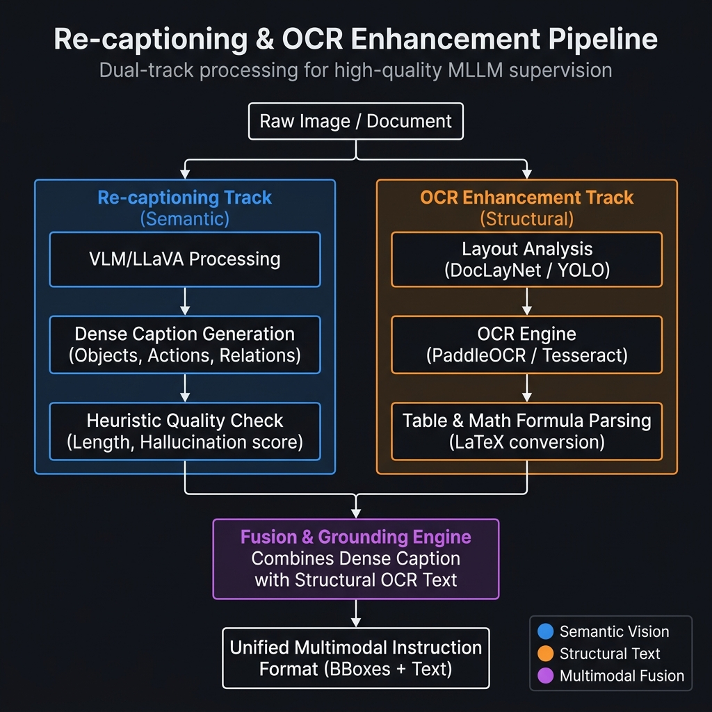
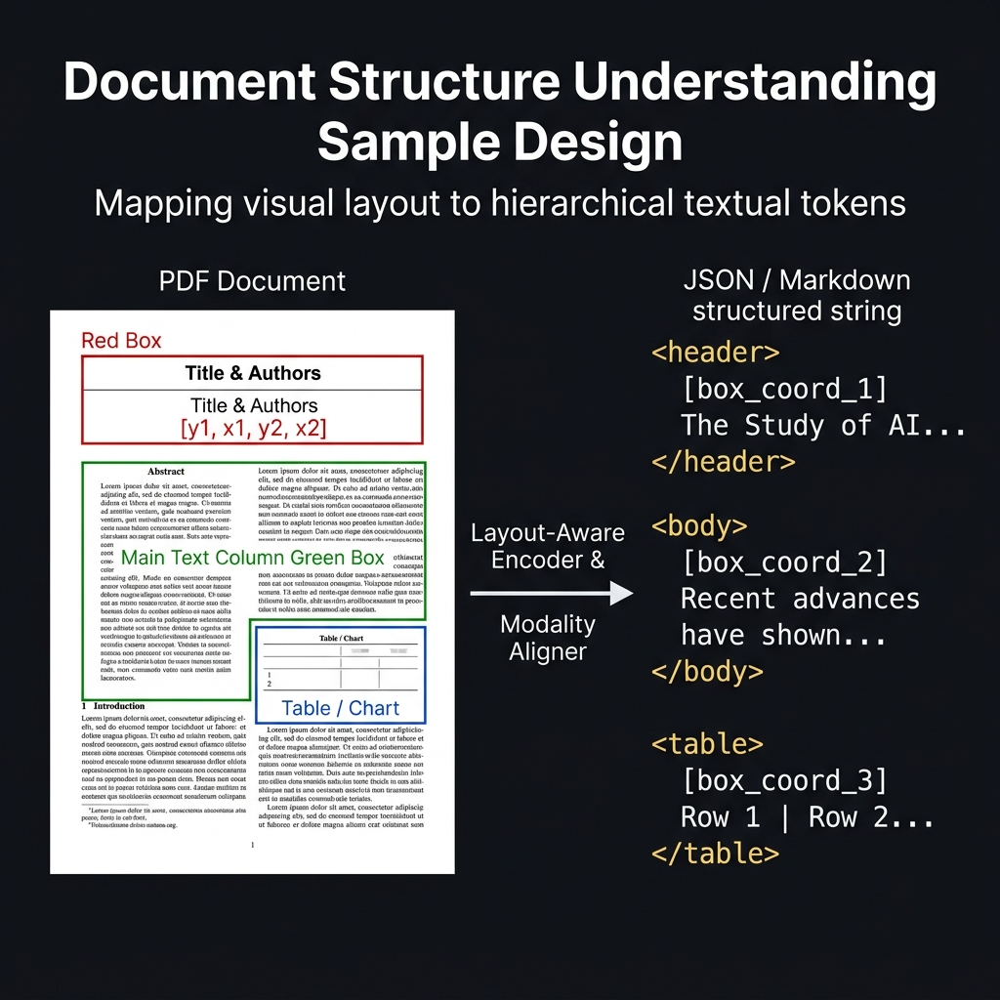

# Chapter 9: Recaptioning and Document Understanding

<div class="chapter-authors">Ke Wang</div>

## Abstract

This chapter explains why image-text data still needs further recaptioning and document structuring after basic cleaning. It first analyzes weak, missing, and overly generic original web captions, then explains the roles of brief captions, dense captions, grounded captions, and multimodal dialogue at different training stages. The chapter then introduces an industrial recaptioning pipeline, including open-source VLM batch generation, multi-model mutual review, human golden samples, and structured bounding-box injection, along with cost, throughput, and risk-estimation perspectives. The document-understanding section focuses on OCR, layout analysis, table parsing, formula restoration, and coordinate alignment, showing why high-density documents cannot be solved by high-resolution image input alone. Finally, the chapter establishes a quality-evaluation matrix for recaptioning and OCR data and uses an anonymized composite case to demonstrate the value of reconstructing financial-document data. Readers should be able to design recaptioning and OCR-enhanced data pipelines for both natural images and long documents.

## Keywords

Recaptioning; OCR; document understanding; layout analysis; BBox; grounding; quality evaluation

## Learning Objectives

- Explain how weak and missing original captions limit vision-language model capability.
- Design a layered data strategy covering brief captions, dense captions, grounded captions, and multimodal dialogue.
- Compare the cost and risk of open-source VLMs, commercial APIs, multi-model mutual review, and human golden labels in recaptioning.
- Explain the roles of OCR, layout analysis, table parsing, and coordinate alignment in document understanding.
- Build machine quality checks, human sampling checks, and error-attribution mechanisms for recaptioned and OCR data.

In the previous chapter, we examined the front-end cleaning pipeline for multimodal data. By removing low-resolution images, watermark interference, sensitive content, and semantically divergent image-text pairs through CLIP Score thresholds, we built a relatively clean visual data lake.

However, visual cleanliness does not mean that the training supervision signal is sufficient. When a user asks "What is the girl in red doing?" and the model only answers "There is a woman wearing red," the model has learned object category but not action, scene, or relation. Likewise, if an English financial-report scan is shown and the user asks "How much did Q4 revenue grow in 2023?", a model that cannot reliably read table numbers and calculate from them has not gained enough document-understanding ability from basic image-text pairs.

This leads to the core question of the chapter: **why is cleaned image-text data still insufficient for advanced multimodal understanding?** We will focus on two key engineering areas: **high-quality recaptioning** and **OCR-based structured document understanding**.

---

## 9.1 Why Original Captions Are Far From Enough

### 9.1.1 Capability Limits Caused by Weak and Missing Descriptions

Even after front-end filtering, multimodal data often originates from the public web. The web text ecosystem has a basic limitation: for reasons of page loading, SEO, or accessibility placeholders, developers usually do not write complete semantic descriptions for every image. Because of how HTML `Alt-text` is designed and used, **native web captions for images are often impoverished**.

Take a typical example from a large open dataset such as LAION-5B (Schuhmann et al. 2022): a 1080p photograph of golden sunlight falling across a wooden desk, with a mechanical keyboard, a cup of iced Americano, and a layered blurred bookshelf in the background. In the raw pair crawled by a data factory, the caption may be only:

> "*An ordinary office desktop*" or simply "*IMG_2023_Office.jpg*"

**Impact on model learning signals**

The harm is not merely that there is "too little information." It changes attention allocation. If massive numbers of vague labels such as "an office corner" are used as alignment prefixes in SFT or pretraining, the model tries to fit millions of RGB pixels to a very low-information short-text target. It may therefore fail to learn fine-grained visual features such as the reflection in the half-full coffee, the indentation of keyboard keycaps, or the direction of sunlight. This phenomenon, in which missing text features cause the visual model to ignore small objects, can be summarized as **dense object blindness** or **entity dropout** caused by weak description; for related systematic analyses, see fine-grained alignment work such as GLIP (Li et al. 2022) and FIBER (Dou et al. 2022).

It also creates logical alignment conflicts. Suppose the subject in an image is a white cat, while the crawled short text only says "white background." The vision encoder extracts contour features for the cat, but the training target asks it to align with "background." The model learns a false correspondence, damaging the stability of multimodal understanding on benchmarks such as MME (Fu et al. 2023) and MMBench (Liu et al. 2023b).

### 9.1.2 Layered Differences Between Brief and Detailed Captions

In R&D and data-distillation pipelines, data architects usually do not expect one dataset to cover every training stage. To gradually improve multimodal foundation-model capability, visual data must be divided by text granularity across training phases:

1. **Brief core-perception captions**
   - Form: "a running golden retriever" or "two parked red sports cars."
   - Core utility: low cost and easy to obtain at billion scale. The main value is rapid projection building during **Stage 1: Modality Alignment**.
   - Engineering role: similar to picture-word flashcards; it helps the Transformer backbone build initial correspondences between basic object shapes and noun vocabulary.

2. **Dense detailed captions / recounting**
   - Form: "On a sunlit afternoon lawn, two thin cumulonimbus clouds float in the sky. A golden retriever is running toward the right side of the frame with its mouth open..."
   - Core utility: scarce on the raw web, usually requiring secondary model generation, human synthesis, or machine rendering.
   - Engineering role: better suited for **Stage 2 and Stage 3: Visual Instruction Tuning and Preference Alignment**, where it improves detailed observation and expressive organization.

3. **The art of data mixing**
   - **Do not overfeed short captions**: if late pretraining remains dominated by short descriptions for too long, the model may lack long-sentence generation and complex-relation expression ability, a form of caption degradation.
   - **Mixing principle**: in SFT, short captions, dense captions, and multimodal dialogue samples should be retained together to balance conceptual recognition, detailed description, and instruction following. Concrete proportions must be calibrated according to model capability goals and ablation experiments.

To move the model from "image-word recognition" to image understanding, relational reasoning, and instruction response, low-information crawled text must be combined with high-quality recaptioned data. The core engineering path is **synthetic recaptioning**, or large-model-generated rewriting.

---

## 9.2 Layered Industrial Recaptioning Pipelines

Recaptioning uses a stronger VLM or expert annotators to generate more accurate and complete text when the original web label is too brief or missing important details.

However, in pretraining settings where the base unit may be one billion filtered images, recaptioning every image at that scale would consume enormous API fees and GPU inference cost. Engineering systems therefore cannot treat all images equally. They need multi-tier triage, cascading fallback, and automated concurrent scheduling.

### 9.2.1 A Pyramid Pipeline: From Lightweight Generation to Multi-Model Review

Industrial data factories often use an inverted-pyramid triage strategy to balance GPU cost and label reliability.

#### 1. Base layer: open-source model batch recaptioning

For natural images with simple composition and clear subjects, such as plain landscapes or product photos on a single-color background, hiring annotators or calling expensive commercial APIs is not economical when the scale is large. At the base layer, data teams usually deploy small open-source visual models inside private compute clusters, such as LLaVA-1.5 (Liu et al. 2024), Qwen2.5-VL (Bai et al. 2025), or InternVL3 (Zhu et al. 2025), and run **fast prompting** in bulk.

**Strict prompt-template example**

To prevent smaller open-source models from generating unfocused descriptions, prompt engineering must strictly constrain factuality, length, and output scope. Listing 9-1 gives a recaptioning prompt template.

*Listing 9-1: Recaptioning prompt template example. This template illustrates the constraint style; production environments should A/B validate it according to model version, image type, and safety policy.*

```text
[System Instruction]: You are a neutral, highly objective visually impaired helper.
[Task]: Describe the main objects, actions, and physical background in this image concisely and accurately.
[Constraint]: Do NOT use any generic filler words like 'This is an image of' or 'I can see'. Do NOT guess the location if no text is shown. Keep the entire response strictly under 50 words. Focus solely on visible facts.
```

#### 2. Middle layer: multi-model-as-a-judge

For complex interleaved scenes, dense environments, or images containing subtle cultural details, a single open-source model may hallucinate, for example identifying a black garden hose on the ground as a snake. To reduce hidden defects from one model, the pipeline upgrades such batches into **three-blind mutual review**, or MoE-Judge:

1. **Parallel inference**: the image is sent independently to three different visual engines, $V_1$ such as a CLIP-biased LLaVA, $V_2$ such as a large proprietary InternVL variant, and $V_3$ such as a structure-aware Pix2Struct (Lee et al. 2023) or Donut (Kim et al. 2022).
2. **Heterogeneous outputs**: the three visual models generate three different descriptions, $C_1, C_2, C_3$.
3. **Text judgment and fusion**: a pure-text model, such as Claude-3.5-Sonnet or GPT-4-Turbo, extracts overlapping high-frequency semantic entities from the three descriptions, downweights edge nouns or suspicious entities seen by only one model, and produces a rewritten result that balances detail and factual consistency.

#### 3. High-value layer: human refinement and golden truth

At the highest-value layer of the funnel, automation scripts mainly perform candidate selection and quality logging. Data-science teams send these samples to trained annotation groups for fine labeling. The share of this data depends on budget, task risk, and the needs of golden evaluation sets, and should not be copied from a fixed ratio.

These human labels should not rely only on low-barrier crowdsourcing. Multimodal alignment requires high noun precision and hierarchical structure, so annotators usually need systematic training and a dedicated internal labeling tool to confirm small regions one by one. Although this portion is tiny, it forms the **golden truth** used later for training recaptioning reward models or fine-tuning base models.

*Table 9-1: Comparison and accounting dimensions for automated recaptioning production tiers. Source: compiled by the authors; cost and throughput must be recalculated according to model version, API pricing, concurrency limits, and annotation region.*

Note: Table 9-1 does not list fixed cost or throughput numbers. Actual results depend on model version, cloud/API pricing, concurrency limits, image resolution, cache strategy, and annotation region; production projects should estimate per-sample cost through small-batch stress tests.

| Recaptioning tier | Cost drivers | Throughput constraints | Complex-scene and chart ability | Advantages and deployment risks |
| :--- | :--- | :--- | :--- | :--- |
| **Small VLM local batch** | GPU card-hours, model quantization method, image resolution | Local inference concurrency and I/O | Weak, especially for tables | **Advantage**: low cost and rapid object alignment.<br>**Risk**: hallucination, not suited to fine-grained training. |
| **Top commercial API refinement** | API unit price, input image size, output length, retry rate | Provider concurrency throttling and safety policy | Strong | **Advantage**: strong commonsense context and dense long text.<br>**Risk**: fast budget burn and possible refusals under safety policy. |
| **Private hybrid multi-review framework** | Multi-model GPU card-hours, scheduling wait, judge-model cost | Slowest model and serial judging | Medium | **Advantage**: runs locally, reduces leakage risk, and reduces hallucination through intersection.<br>**Risk**: complex architecture and slower multi-node serial waiting. |
| **Multi-round human expert labeling** | Expert hours, training cost, quality-inspection ratio, rework rate | Expert supply and visual fatigue | Strong | **Advantage**: creates high-quality calibration data.<br>**Risk**: hard to scale; visual fatigue can cause box-dragging errors. |

### 9.2.2 From Coarse Image Description to Fine-Grained Spatial Alignment: Bidirectional BBox Injection

Traditional image captioning mainly maps an image to a set of words or one sentence. Text labels alone are still not enough to train a visual assistant with spatial localization, mathematical geometry, and physical direction understanding. Data engineering must introduce **fine-grained grounding**.

In this module, continuous text intended for humans must be converted into a data-stream markup structure with coordinates. In a high-resolution recaptioning pipeline, architects call **GroundingDINO** (Liu et al. 2023c), **SAM (Segment Anything Model)** (Kirillov et al. 2023), and other zero-shot or weakly supervised detection frameworks in a side-car workflow to extract exact pixel or normalized object coordinates, such as an apple located at `[x_min=320, y_min=550, x_max=450, y_max=690]`.

The downstream text assembly script no longer outputs only a sentence such as "a bright red apple is placed on the lower-left side of a square wooden table." Instead, it injects structured, closed XML localization tags into the training text. Listing 9-2 shows an XML grounding example.

*Listing 9-2: XML grounding localization markup example. Coordinates and objects are illustrative samples; production environments should constrain them jointly through detector outputs, manual spot-checks, and coordinate normalization rules.*

```xml
On the lower-left side of the wooden square table in the back of the image, there is an <object name="apple" bbox="[[320, 550, 450, 690]]">apple</object>; to its left is a stack of <object name="book" bbox="[[500, 520, 680, 750]]">medical books</object>.
```

The reason is that a Transformer does not naturally possess absolute spatial awareness of near/far, left/right, and high/low. After many samples extend natural-language words into discrete coordinate tokens such as `[Bbox_xx_yy]` and enter the SFT pipeline, the model can not only answer "what is in the image" but also output coordinates or region references for tasks such as "point to the apple." This is the foundation for reducing spatial hallucination and supporting web visual automation agents.

*Industrial recaptioning JSONL sample (Recaptioning Schema). The fields and paths below are anonymized examples.*

The final VLM-generated recaptioning data is packaged as JSONL with strict metadata. Listing 9-3 gives an anonymized example; fields and paths are illustrative.

*Listing 9-3: Anonymized recaptioning JSONL Schema example. Production environments should add data source, model version, review status, license, and safety-filter records.*

```json
{
  "image_id": "laion_5b_recap_001923",
  "image_path": "s3://dataset/images/001923.jpg",
  "original_caption": "IMG_2023_Office.jpg",
  "recaption": {
    "dense_caption": "On the lower-left side of the wooden square table in the back of the image, a glossy red apple rests quietly...",
    "source_model": "InternVL-1.2-MoE",
    "generation_prompt": "You are a neutral, highly objective visually impaired helper..."
  },
  "grounding_bboxes": [
    {"entity": "apple", "bbox": [320, 550, 450, 690]}
  ],
  "clip_score": 0.82,
  "quality_flag": "PASS"
}
```

**Field notes**

- `original_caption`: the low-information label crawled from the source.
- `recaption`: the large-model-generated long description and generation-model record.
- `grounding_bboxes`: fine-grained entity coordinates extracted and mapped through GroundingDINO, central to training pointing ability.
- `clip_score` and `quality_flag`: automatic pre-validation signals; whether a sample is set to `REJECT` should be calibrated according to the current vision-text encoder, language, image type, and manual spot-check distribution (see Figure 9-1 for the full dual-track pipeline).



*Figure 9-1: Recaptioning and OCR dual-track enhancement. The left side shows a semantic vision track for dense narrative descriptions; the right side shows a structural text track containing DOM layout segmentation and table matrices. The two streams are fused into a unified hybrid supervision template. Source: drawn for this book. Alt text: a recaptioning and OCR dual-track enhancement diagram showing visual recaptioning, OCR structure extraction, BBox injection, and hybrid supervision.*

At this point, a recaptioning pipeline for natural images and pure scenes has been established. The next category, high-density text, most strongly affects enterprise VLM deployment: long-document reading and complex business-report structured parsing.

---

## 9.3 OCR Enhancement and Long-Document Understanding

For natural scenes, a foundation VLM can often distinguish common object categories. But for scanned VAT invoices, PDF business-report fragments with nested merged cells, or dense tables with multi-level headings, even AnyRes or 4K input may still misread a key decimal point or associate a financial figure with the wrong column, producing hallucination.

The reason is that regardless of ViT scale, **convolutional downsampling or self-attention still fundamentally extracts coherent regional patterns of light, color, and texture**. Text symbols are different from low-frequency visual texture: text is a sparse, high-frequency, discrete symbolic system. A few pixels, or a small radical in a character, can completely change meaning. Relying on a vision encoder to learn every character and table structure from 16 x 16 patches is usually unreliable.

Data engineering must therefore add a cumbersome but empirically effective auxiliary line: an **OCR and document parsing enhancement pipeline**.

### 9.3.1 Structured Parsing of Document Images

Processing long documents is not a matter of calling OCR or a cloud vision API and receiving continuous text. Business documents often contain difficult **nonlinear layouts**: two-column academic papers, wide financial tables inserted between paragraphs, side annotations, headers, footers, and anti-counterfeit watermarks. If the document is not deconstructed and reorganized with visual-structure awareness before entering the model, extracted text usually lacks logical order.

In mature data-cleaning shops, document preprocessing is usually split into a hierarchical pipeline:

1. **Level-one OCR: layout boundary detection**
   The first layer is usually a layout-detection network, such as one based on YOLOv8 or LayoutLMv3 (Huang et al. 2022). It locates titles, body text, footnotes, chart containers, and code snippets.
2. **Level-two OCR: domain-specific extraction**
   After the PDF page is cut into independent pixel modules, each cropped patch is dispatched to a domain-specific extractor:
   - **Document text extraction**: pure text paragraphs are sent to Tesseract or PaddleOCR for high-accuracy spelling-corrected extraction.
   - **Mathematical formula reverse compilation**: dense formula groups have high error rates under standard OCR. They are routed to specialized engines such as Nougat (Blecher et al. 2023) or commercial services such as Mathpix, converting the image directly into strict LaTeX such as `\int_{0}^{\infty} e^{-x^2} dx`.
   - **Complex table topology reconstruction**: tables with merged cells and cross-page headers are the hardest. Architectures similar to TableMaster can convert visual rows and columns into machine-readable HTML table tags or Markdown trees.

After multi-level OCR extraction, the core engineering difficulty is **absolute geometric alignment across modalities**. If extracted text is not bound to its pixel region in the image, the model still does not know which page area it should attend to. A common practice is to append `<box_coord>` strings after each text span so the attention mechanism can use coordinate anchors.



*Figure 9-2: Document structure layout-to-token mapping. The left side shows a fragment of a two-column academic report. The system first uses bounding-box arrays to locate titles, body text, charts, and formula regions. The right side shows how outputs from specialized models such as Nougat and PaddleOCR are post-processed into hierarchical Markdown text and rich text streams with discrete coordinates `[x_y]`. Source: drawn for this book. Alt text: document layout-to-token mapping showing a page converted by layout detection, OCR, formula parsing, and coordinate labeling into hierarchical text.*

### 9.3.2 How Text Engines Reduce Ultra-High-Resolution Input Burden

This preprocessing mechanism, based on visual feature extraction, bounding boxes, and structured discrete strings, significantly reduces the character-recognition burden on the training cluster. Characters that would otherwise need to be recognized by the visual model during training have already been parsed by a CPU/GPU hybrid OCR pipeline into a long text prompt and provided as context. The vision model can then process the full page at a lower resolution and focus on **macro layout and physical-space features**.

The system shifts part of the difficult character-recognition workload to the text side and lets a **long-context LLM** handle long bill-analysis questions such as "What is the product of row 3 and row 10?" This converts part of a two-dimensional visual parsing problem into a long-context reading problem. This is one reason architectures such as Qwen-VL (Bai et al. 2023) perform well on complex financial reports, business documents, and exams by combining OCR, layout structure, and visual features.

---

## 9.4 Quality Evaluation, Sampling Funnels, and Defect Attribution

In a preprocessing shop where OCR and long-form recaptioning are intertwined, quality control cannot be absent. Even a small number of collapsed samples or hallucinated labels can be amplified over a long training cycle. Actual tolerance depends on training stage, data weight, and target task. Before synthetic recaptioned data enters the main training stream, an industrial quality-control process must be established.

### 9.4.1 Machine Scoring and Heuristic Validation

For hundreds of millions of samples, humans cannot cover enough data. Full automatic large-scale heuristics and validator models are needed first:

1. **Long-short consistency cross-check**
   - **Algorithm pipeline**: the recaptioning center often produces dense captions up to 500 Chinese characters. A front-end probe first extracts the five core entity nouns from the dense caption using a lightweight POS tagger such as NLTK or spaCy, for example keyboard, coffee, desk, monitor, and sunlight.
   - **Consistency standard**: the five entity nouns are then scored against the original image using CLIP or SigLIP similarity. If the mean feature inner product is not higher than that of the original web label, such as "office corner," or drops abnormally relative to the project baseline, the system should trigger a quality alert. This usually means the upstream recaptioning model did not sufficiently generate from the image content and that the day's data package from that node should be isolated.

2. **Punctuation, regular-expression, and repetition-loop sweeping**
   - Even without a complex geometric-semantic model, character-pattern checks can reveal serious synthetic-quality problems. For example, large batches of PDF rich text processed by OCR such as PaddleOCRv4 may end with isolated unclosed HTML tags `</html>`, repeated `[ERROR] [NO_RESPONSE]`, mojibake such as `aaaaa`, or placeholder pollution.
   - Another high-risk failure is an LLM falling into a repetition loop, such as several consecutive fully repeated lines. If the regex anomaly truncation rate in system logs exceeds the node watermark, the scheduler should pause the inference instance and isolate its output. The watermark should be set according to the historical batch distribution.

### 9.4.2 Human-in-the-Loop Blind Sampling and Multi-Layer Attribution

Even if all machine quality metrics pass, a final **expert blind-sampling verification pool** is still necessary. Each day, the control center can randomly sample document cases with complex nested structures and send them to professional reviewers. A number such as 20,000 images per day is only an example for a large team; the real sampling volume should depend on data size, risk level, and budget.

These experts not only judge quality but also provide error-attribution reports from long-document token lists to the model-development team. To reduce responsibility ambiguity after training divergence, for example vision engineers blaming the language base and language engineers blaming visual features, the evaluation group needs an incident classification tree.

*Table 9-2: OCR core error attribution and remediation matrix for cross-modal and advanced document recognition. Source: compiled by the authors from anonymized engineering patterns; error types and remediation actions should be reviewed by document type and OCR model version.*

| Error pattern in model output | Root-cause diagnosis in expert workstation | Core remediation strategy and architectural iteration |
| :--- | :--- | :--- |
| **Small mathematical formulas or table decimals are read incorrectly** | Upstream OCR or table-recognition engine has insufficient extraction accuracy. | Replace or fine-tune Paddle/Mathpix/Table OCR; add dense-table samples; raise document input resolution when necessary. |
| **Layout disorder: title crosses regions; figure legend enters second-column body text** | PDF layout classifier fails, or watermarks and column lines interfere. | Rebuild layout node feature-tree aggregation rules; upgrade from weak-rule HTML extraction to LayoutLM or stronger YOLO layout detection. |
| **Detail hallucination: a pen holder is described as a nonexistent object or abstract meaning** | The recaptioning model over-expands when synthesizing long text and creates visual or commonsense hallucinations. | Use a stricter recaptioning model; introduce three-blind review and entity-consistency filtering; reduce adjective weight. |
| **Irrelevant answer or garbled output** | Possible serialization, byte-pair packing, or tokenizer vocabulary mapping error. | Return to data-reader operators; check placeholders, special tokens, encoding, and batch assembly logic. |

---

## 9.5 Anonymized Composite Case and Chapter Bridge

### 9.5.1 OCR Reconstruction of a Financial Research Knowledge Base

The following is an anonymized composite case used to explain the risks of document OCR and layout structuring; it does not represent a specific public corporate event. A finance team planned to build an intelligent assistant for full-report penetration analysis and quality control. Initially, the algorithm group paginated a large number of industry research PDFs and anonymized financial scans, then fed the page images directly into a vision foundation model, hoping it could complete reading and question answering.

In the first closed blind test, the model could only answer vaguely that "there is a table in the image." For detailed questions such as "compare the year-on-year decline and quarter-on-quarter rise in profit sharing for third-tier-city heavy-metal business," it fabricated revenue numbers across rows. For prospectus scans hundreds of pages long with header watermarks, QA accuracy was far below expectation.

The team paused training and sent the financial-report data back to the data shop for about half a month of reconstruction. In the new OCR assembly pipeline, every page and long image was segmented by multiple networks: pie charts and line charts were extracted separately, dense revenue tables were converted into structured tables, and Table OCR added cell-boundary anchors, structured HTML or Markdown tag trees, page numbers, chart numbers, and source metadata.

The postmortem showed that **without rigorous data engineering, even a strong algorithm cannot compensate for defective data**. After rebuilding OCR and layout structure, the team restarted a lightweight training cycle and jointly validated the result using benchmarks such as ChartQA (Masry et al. 2022) and TabMWP (Lu et al. 2022) together with a manually curated financial-report QA set. Whether a significant improvement is obtained depends on the starting baseline, sample difficulty, model size, and evaluation-set configuration; gains from a single project cannot be reused across projects.

### 9.5.2 From Static Documents to Long Temporal Data

From the text cleaning and filtering in Parts I and II, to image-text alignment in Chapter 8, and then to recaptioning and document structuring in this chapter, a relatively complete processing chain for static two-dimensional data engineering is now in place. Through OCR, layout parsing, BBox labeling, and long-text reconstruction, document images can become trainable, traceable, and measurable high-density supervision signals.

But the real world is not only a static image or one electronic invoice page. Many important scenarios contain continuous temporal logic, motion trajectories, and multi-band audio signals. Although AnyRes and other static-image strategies can handle high-resolution images, video at 30-60 frames per second over minutes or hours quickly increases visual tokens, decoding I/O, audio transcription, and temporal-alignment cost, and can trigger out-of-memory failures and data-loading bottlenecks.

The next chapter therefore moves from static image-text and document understanding to long temporal data: **Chapter 10: Video and Audio Data Engineering**.

## Chapter Summary

This chapter explained why image-text data that has passed basic cleaning is still insufficient for advanced multimodal understanding, and presented two complementary reconstruction paths. The first is synthetic recaptioning: for weak and missing native web captions, data granularity should be designed in layers across short captions, dense captions, and multimodal dialogue. Costs and hallucinations can be controlled through a pyramid funnel of open-source VLM batch generation, three-blind multi-model review, and human golden labels. With GroundingDINO and SAM, BBox coordinates can be injected so natural-language descriptions become structured supervision with spatial anchors. The second path is OCR and long-document understanding: because text is a sparse, high-frequency discrete symbol system, raising image resolution alone cannot reliably read decimals or tables. Layout detection, domain-specific extraction (formula restoration to LaTeX, table reconstruction to HTML/Markdown), and coordinate alignment are needed to convert part of the two-dimensional visual parsing problem into a long-context reading problem.

On the quality side, this chapter established machine quality probes such as long-short text consistency cross-checks and syntax/repetition-loop filtering, and used human blind sampling plus an error-attribution matrix to distinguish responsibility sources such as OCR accuracy, layout disorder, recaptioning hallucination, and serialization defects. This chapter still deals with static two-dimensional data; when data expands into video streams containing temporal and audio dimensions, slicing, transcription, and temporal alignment become the new core difficulties. That is the topic of the next chapter.

## References

Bai J, Bai S, Yang S, Wang S, Tan S, Wang P, Lin J, Zhou C, Zhou J (2023) Qwen-VL: A Versatile Vision-Language Model. arXiv preprint arXiv:2308.12966.

Bai S, Chen K, Liu X, Wang J, Ge W, Song S, Dang K, Wang P, Wang S, Tang J, Zhong H, Zhu Y, Yang M, Li Z, Wan J, Wang P, Ding W, Fu Z, Xu Y, Ye J, Zhang X, Xie T, Cheng Z, Zhang H, Yang Z, Xu H, Lin J (2025) Qwen2.5-VL Technical Report. arXiv preprint arXiv:2502.13923.

Blecher L, Cucurull G, Scialom T, Stojnic R (2023) Nougat: Neural Optical Understanding for Academic Documents. arXiv preprint arXiv:2308.13418.

Fu C, Chen P, Shen Y, Qin Y, Zhang M, Lin X, Qiu Z, Lin W, Yang J, Zheng X, Li K, Sun X, Wu E (2023) MME: A Comprehensive Evaluation Benchmark for Multimodal Large Language Models. arXiv preprint arXiv:2306.13394.

Dou Z Y, Xu Y, Gan Z, Wang J, Wang S, Wang L, Zhu C, Zhang P, Yuan L, Peng N, Liu Z (2022) Coarse-to-Fine Vision-Language Pre-training with Fusion in the Backbone (FIBER). Advances in Neural Information Processing Systems 35:32942-32956.

Huang Y, Lv T, Cui L, Lu Y, Wei F (2022) LayoutLMv3: Pre-training for Document AI with Unified Text and Image Masking. In: Proceedings of the 30th ACM International Conference on Multimedia, pp 4083-4091.

Kim G, Moon S, Xu R, Yim J, Park S, Seo J, Baek J, Yoo M, Park S, Park S (2022) OCR-Free Document Understanding Transformer (Donut). In: European Conference on Computer Vision, pp 498-517.

Kirillov A, Mintun E, Ravi N, Mao H, Rolland C, Gustafson L, Xiao T, Whitehead S, Berg A C, Lo W Y, others (2023) Segment Anything (SAM). In: Proceedings of the IEEE/CVF International Conference on Computer Vision, pp 4015-4026.

Lee J, Jia M, Sangkloy P, Krishnamurthy J, Han S, Chang S F, Hutchinson B (2023) Pix2Struct: Screenshot Parsing as Pretraining for Visual Language Understanding. In: Proceedings of the 40th International Conference on Machine Learning, pp 18893-18912.

Li L H, Zhang P, Zhang H, Yang J, Li C, Zhong Y, Wang L, Yuan L, Zhang L, Hwang J N, Chang K W, Gao J (2022) Grounded Language-Image Pre-training (GLIP). In: Proceedings of the IEEE/CVF Conference on Computer Vision and Pattern Recognition, pp 10965-10975.

Liu H, Li C, Wu Q, Lee Y J (2023b) MMBench: Is Your Multi-modal Model an All-around Player? arXiv preprint arXiv:2307.06281.

Liu S, Zeng Z, Ren T, Li F, Zhang H, Yang J, Li C, Yang J, Su H, Zhu J, Zhang L (2023c) Grounding DINO: Marrying DINO with Grounded Pre-Training for Open-Set Object Detection. arXiv preprint arXiv:2303.05499.

Liu H, Li C, Li Y, Lee Y J (2024) Improved Baselines with Visual Instruction Tuning (LLaVA-1.5). In: CVPR 2024, pp 26296-26306.

Lu P, Qiu L, Chang K W, Zhu W, Rajpurohit T, Clark P, Kalyan A (2022) Dynamic Prompt Learning via Policy Gradient for Semi-structured Mathematical Reasoning (TabMWP). arXiv preprint arXiv:2209.14610.

Masry A, Long D, Tan J Q, Joty S, Hoque E (2022) ChartQA: A Benchmark for Question Answering about Charts with Visual and Logical Reasoning. In: Findings of the Association for Computational Linguistics: ACL 2022, pp 2263-2279.

Radford A, Kim J W, Hallacy C, Ramesh A, Goh G, Agarwal S, Sastry G, Askell A, Mishkin P, Clark J, others (2021) Learning Transferable Visual Models From Natural Language Supervision (CLIP). In: ICML 2021, pp 8748-8763.

Schuhmann C, Beaumont R, Vencu R, Gordon C, Wightman R, Cherti M, Coombes T, Katta A, Mullis C, Wortsman M, others (2022) LAION-5B: An Open Large-Scale Dataset for Training Next Generation Image-Text Models. Advances in Neural Information Processing Systems 35:25278-25294.

Zhu J, Wang W, Chen Z, Liu Z, Ye S, Gu L, Duan Y, Tian H, Su W, Shao J, Gao Z, Cui E, Cao Y, Liu Y, Xu W, Li H, Wang J, Lv H, Chen D, Li S, He Y, Jiang T, Luo J, Wang Y, He C, Shi B, Zhang X, Shao W, He J, Xiong Y, Qu W, Sun P, Jiao P, Wu L, Zhang K, Deng H, Ge J, Chen K, Wang L, Dou M, Lu L, Zhu X, Lu T, Lin D, Qiao Y, Dai J, Wang W (2025) InternVL3: Exploring Advanced Training and Test-Time Recipes for Open-Source Multimodal Models. arXiv preprint arXiv:2504.10479.
