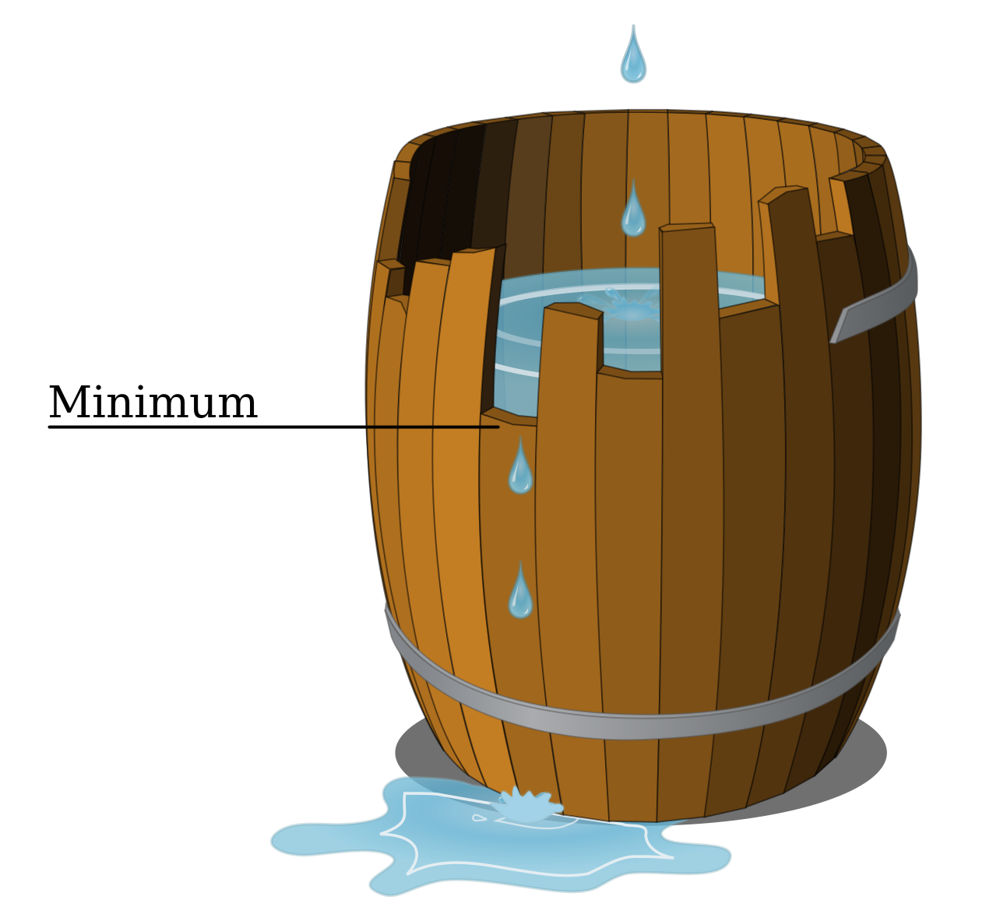
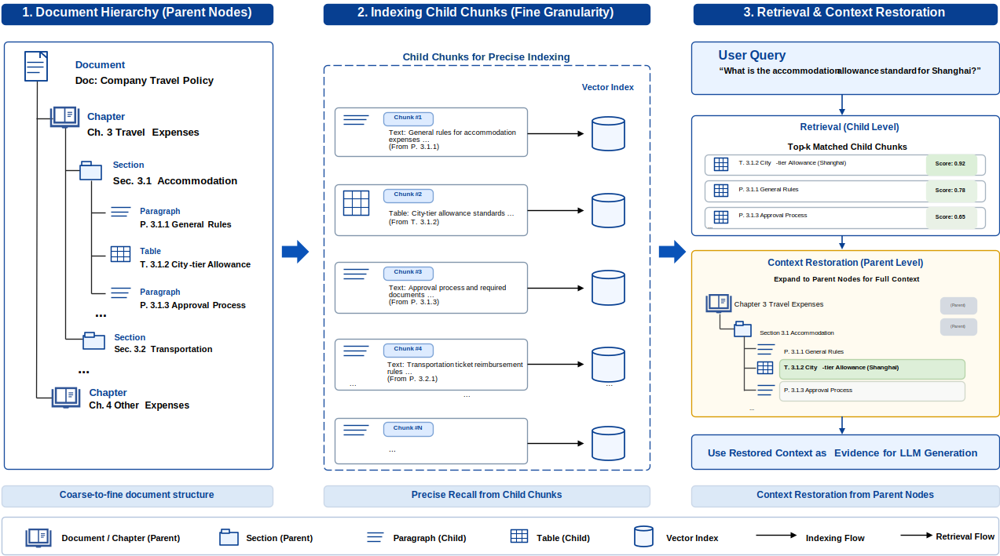
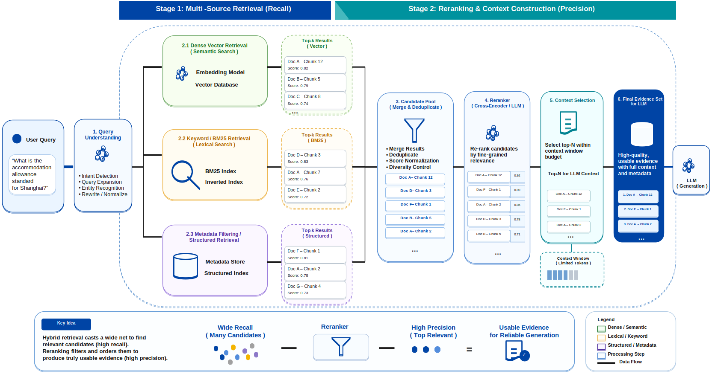

# Chapter 21: The RAG Data Pipeline

<div class="chapter-authors">Wenzhuo Du; Gongpeng Zhao; Jun Yu</div>

## Chapter Abstract

The quality ceiling of a retrieval-augmented generation (RAG) system is often fixed by the upstream data-processing chain before the query ever reaches the model. This chapter reframes RAG as a document engineering problem: the system does not operate on raw documents, but on data representations that have been parsed, cleaned, structured, and chunked. Information loss in any stage is amplified downstream. The chapter follows the actual data pipeline: it first argues that RAG is grounded in document engineering rather than terminal generation; then explains stable multi-source knowledge ingestion, heterogeneous format parsing, and structured cleaning; then discusses how knowledge units become multi-route retrieval infrastructure combining vectors, keywords, structured fields, and parent-child hierarchy; then builds evaluation, error attribution, feedback, and knowledge-update loops for the whole chain; and finally uses an enterprise complex-document case and engineering checklist to show how these methods converge into a traceable, verifiable, deliverable production pipeline.

## Keywords

RAG data pipeline; document engineering; retrieval-augmented generation; chunking; knowledge update; evaluation feedback

## Learning Objectives

- Explain why the performance ceiling of RAG is determined by the upstream data pipeline rather than the terminal generation model.
- Design a document-engineering chain that covers multi-source ingestion, heterogeneous format parsing, and structured cleaning.
- Build a multi-route retrieval index that combines vectors, keywords, structured fields, and parent-child hierarchy.
- Design chunking strategies that preserve document structure while controlling semantic breaks.
- Establish end-to-end evaluation, error attribution, and knowledge feedback loops for production delivery.

------

## Application-Level Data Engineering: An Introduction

As large language models move from possessing capabilities to actually being deployed in applications, the focus of data engineering is shifting accordingly. In the previous parts, the discussion centered mainly on how to construct training data that endows models with language understanding, generation, multimodal processing, and reasoning and tool-use abilities. In real business scenarios, however, model capability often does not directly determine application performance. What truly influences system performance is usually the data system built around the application scenario. At the application stage, the model no longer operates in isolation: it is embedded within a complex system, working together with the knowledge base, the retrieval module, context construction, and user-interaction mechanisms to form a complete pipeline. At this point, the central question is no longer simply "can the model answer," but rather "can the system reliably answer the right questions." For example, whether knowledge is correctly ingested and updated, whether retrieval can hit the key content, whether the context is well organized, and whether model output has traceable evidence — all of these become key factors that determine application quality.

For this reason, this part focuses on the data foundation that large-model applications truly rely on, and discusses how data engineering upgrades from "training-data construction" to "application data closed-loop construction." Here, data is no longer a one-off dataset, but a continuously evolving system resource: it includes both the offline-constructed knowledge bases and index structures, and the user feedback, error cases, and behavioral data generated online. The goal of data engineering also shifts from offline optimality to online stability, and from static optimization to continuous operation. Around this shift, this part unfolds along three directions: the RAG data pipeline, multimodal retrieval and visual knowledge processing, and the online feedback loop with knowledge updates. It systematically discusses the ingestion, processing, evaluation, and feedback mechanisms of application-level data. Compared with earlier parts, this stage places greater emphasis on cross-module coordination and an end-to-end perspective: data problems often do not arise at a single point, but are progressively amplified across document parsing, retrieval, generation, and feedback. They must be governed through a unified set of metrics and feedback mechanisms.

The central question this part seeks to answer is: how do we build an application-level data engineering system that can be continuously updated, evolve under control, and ultimately form a data flywheel? Moreover, this system not only determines the quality of a single answer; it also determines whether the system can run reliably and steadily over the long term in real environments, and whether it can continuously enhance its own capabilities through usage.


## Chapter Introduction

------

As large models are widely applied in enterprise knowledge Q&A, document understanding, and intelligent assistants, RAG (Retrieval-Augmented Generation) has gradually become one of the most mainstream deployment paradigms. Compared with pure model generation, RAG introduces external knowledge so that the system can achieve stronger factuality, higher controllability, and better updatability. In practical engineering, however, a common misconception is to reduce the core of RAG to the choice of retrieval algorithm or vector database, while overlooking the fact that data engineering is the real cornerstone that supports it. Extensive practice shows that the failure of a RAG system is rarely due to insufficient model capability, nor simply due to retrieval models being unsophisticated — it most often originates upstream in the data. For example, incomplete document parsing causes loss of key information; unreasonable chunking strategies break semantic continuity; missing metadata makes retrieval results hard to rank and filter. These issues accumulate progressively as the system runs, ultimately manifesting as "off-topic answers," "wrong citations," or "no answer." Therefore, the performance ceiling of a RAG system is fundamentally determined by its data pipeline. Against this backdrop, this chapter focuses on the data foundation of RAG, and discusses how to build a complete and controllable data pipeline starting from raw knowledge sources. The data engineering here goes far beyond simple vectorization: it covers the full pipeline from data ingestion, parsing and cleaning, structured modeling, to chunking, indexing, and retrieval strategy design. Each stage directly affects the final generation quality, and these effects often propagate across stages.

Compared with traditional data processing, the RAG data pipeline has stronger structural dependence and context sensitivity. Documents must not only be parsed correctly, but also reorganized in a way that is suitable for retrieval and generation. Data must not only be clean, but also locatable and correctly citable. This means the core objective of data engineering has shifted: it is no longer simply about improving data quality per se, but about comprehensively improving the ability of the data to be correctly understood and used by the model. Around this objective, this chapter systematically lays out the key components of the RAG data pipeline: ingestion and parsing of multi-source knowledge, structured cleaning and metadata completion, chunking strategies, index construction and retrieval optimization, and finally evaluation and feedback mechanisms. Through this process, the chapter establishes a core perspective: in a RAG system, data is not a step that precedes the model — it is the infrastructure that determines whether the system operates reliably.

------

## 21.1 Why Document Engineering Is the Foundation of RAG

### 21.1.1 The Nature of Problems in RAG Systems

Related research shows that the gains from retrieval-augmented language models come not only from the generation model itself, but also depend heavily on whether retrieved external evidence can be stably ingested and effectively used (Guu et al. 2020; Izacard and Grave 2021). As RAG (Retrieval-Augmented Generation) is widely deployed in enterprise knowledge Q&A, document assistants, intelligent customer service, and industry knowledge systems, its performance bottlenecks gradually surface. Practice has shown that system performance is determined neither solely by the capability of the foundation model, nor merely by the choice of vector database or retrieval algorithm. In extensive deployment practice, even after introducing more powerful models and more advanced embedding techniques, the system output still exhibits significant and non-random fluctuations. This instability has clear structural characteristics: the system answers fluently for certain types of questions but exhibits systematic failure for others. Further analysis shows that such problems mostly originate in the early stages of the data-processing pipeline rather than at the model-inference stage. By the time a query arrives at the model, the upper bound on answer quality has already been locked in by the upstream data processing. The model is only responsible for reasoning over and expressing the given input; it does not have the ability to repair or reconstruct the underlying data.

Against this backdrop, the simplistic understanding of RAG as merely "retrieval + generation" is an over-simplification. In real production environments, the model does not reason directly over raw documents — it reasons over data representations that have undergone multiple rounds of complex transformation. As shown in Figure 21-1, this transformation pipeline covers document parsing, cleaning and structuring, chunking, index construction, and more. Information loss or structural drift at any node will be amplified step by step downstream. Therefore, the core of building an effective system lies in deep understanding and optimization of the entire data-processing mechanism, not just on the final generation stage.


*Figure 21-1: Data transformation pipeline in a RAG system.*


### 21.1.2 Definition and Engineering Meaning of Document Engineering

Recent document-intelligence research further shows that joint modeling of layout, visual, and textual information is an important foundation for understanding complex documents, not merely an auxiliary step attached to plain-text extraction (Kim et al. 2022). Therefore, the primary task in building a production-grade RAG system is not blindly comparing embedding-model scores on evaluation leaderboards, but rather re-examining and firmly establishing the core position of Document Engineering throughout the entire pipeline (Xu et al. 2020).

Here we need to give a rigorous technical definition of document engineering. Document engineering is by no means the process of invoking a basic parsing library to brute-force convert PDFs or Word documents into plain text strings. It is the process of reducing the dimensionality of complex, unstructured or semi-structured human knowledge sources and reconstructing them into a machine-friendly data representation — one that can be stably represented in a high-dimensional vector space, accurately hit by retrieval engines, unambiguously understood by generative models, and traced and verified by end users. This process covers not only basic Optical Character Recognition (OCR) and text extraction, but more deeply involves layout analysis, document logical-tree reconstruction (e.g., chapter–subsection–paragraph hierarchy parsing), table relationship mapping, image-caption binding, and the systematic attachment of metadata such as timestamps, authors, and access-control classifications (Huang et al. 2022; Appalaraju et al. 2021).


### 21.1.3 The Decisive Role of Document Structure in Knowledge Expression

Research on table extraction and long context likewise suggests that structural position, header relationships, and context position all significantly affect downstream information use (Smock, Pesala and Abraham 2022; Liu et al. 2024). In many RAG projects that fail to deliver their expected business value, the data preprocessing stage commonly suffers from paradigm-level defects. The typical practice is to feed massive heterogeneous documents directly into a parsing script, strip away all layout features to produce a plain-text stream, then mechanically slice it based on a hard-coded fixed threshold (e.g., 500 tokens), and finally feed it into an embedding model to build a vector index (Karpukhin et al. 2020).

This pipeline-style processing has extremely high throughput, but it fundamentally ignores the essential laws of knowledge organization. Domain knowledge is not an unstructured linear pile of characters; its semantic density and logical rigor depend heavily on the native physical layout and contextual associations (Reimers and Gurevych 2019). For example:

* **Policies and legal documents**: outline hierarchy directly determines the scope of application and prerequisites of subsequent clauses.
* **Financial reports and technical manuals**: row headers, column headers, and merged cells in a table give specific business semantics to otherwise isolated numerical values.
* **SOPs (Standard Operating Procedures)**: the order of steps determines the legality and safety of industrial operations.
* **Business contracts**: the leading definitions and interpretation clauses constitute the specific interpretive domain for the technical terms used throughout the text.

If this structural skeleton is destroyed during parsing and chunking, even if every text character is preserved without loss, the knowledge it carries is reduced to semantic fragments stripped of logical connections.


*Figure 21-2: Structural changes from a raw document to RAG-usable knowledge units.*


### 21.1.4 Mathematical Abstraction and System Constraints of the RAG Data Pipeline

From the perspective of explainable, modular knowledge ingestion, work such as REALM has explicitly incorporated retrieval into the language-model computation process, showing that RAG can be understood as a combined system of a data-transformation pipeline and a generation function (Guu et al. 2020). From the perspective of system control and information theory, the final output of RAG can be viewed as the terminal expression of the raw dataset after multiple nonlinear mappings. If we take the raw document set $D$ as the initial input, the full pipeline can be abstracted as the following composite function:

$$
Y = f_{LLM}(Q, R(I(S(C(P(D))))))
$$

The engineering meanings of the variables are:

* $D$ (Document): a massive set of raw unstructured or semi-structured documents;
* $P$ (Parse): layout analysis and structured parsing;
* $C$ (Clean): cleaning, denoising, and abnormal-character handling;
* $S$ (Split/Chunk): context-aware semantic chunking;
* $I$ (Index): vector representation and high-dimensional index construction;
* $R$ (Retrieve): multi-channel recall and reranking based on the user query;
* $Q$ (Query): the user's real-time natural-language question;
* $f_{LLM}$: the inference and text-generation function of the large language model.

This abstraction reveals an engineering iron law: the system output $Y$ is separated from the raw document $D$ by a very long data pipeline. Irreversible structural damage incurred at the front-end stages ($P$, $C$, $S$) cannot be repaired in fact by the downstream retriever ($R$) or generator ($f_{LLM}$), no matter how much compute is thrown at them. This directly explains a typical pain point in real-world business: standard answers that objectively exist in the original document cannot be correctly recalled and generated by the system. The root causes are:

1. The answer exists in the original layout, but is not necessarily correctly parsed into machine-readable text (it may have been discarded as a background image layer);
2. The answer exists in the parsed text, but is not necessarily chunked into an independent and complete knowledge unit (the core subject and predicate may have been separated by a fixed-length cut);
3. The answer is fully present in a knowledge chunk, but may not be recallable by a dual-encoder model (the vector representation may have drifted due to missing context);
4. The answer is successfully recalled, but may not be output in a logically coherent form (it may have been mixed with version-conflicted stale data that interferes with model reasoning).


### 21.1.5 Error Accumulation Mechanisms and Error Decomposition in RAG

Evaluation studies such as RAGAS and RAGTruth emphasize that RAG errors must be decomposed into different dimensions, including retrieval, context use, and generation faithfulness, rather than judged only by whether the final answer looks good or bad (Es et al. 2024; Niu et al. 2024). Referring to the error-accumulation diagram of RAG, one can see that an answer existing in the original document does not mean it exists in a retrieval-reachable knowledge unit; an answer existing in a knowledge unit does not mean it can be recalled; an answer being recalled does not mean it enters the context in a complete, clear, and citable form. RAG failures are rarely the failure of a single module in isolation — they are the accumulation of multiple small information losses along the pipeline, eventually producing user-visible errors.


*Figure 21-3: How RAG errors accumulate along the data pipeline.*


To enable quantitative intervention and control of system errors, we can decompose the "total error" of the RAG system into modular components. It should be noted that the following formula is a **diagnostic decomposition and engineering attribution framework** for helping teams identify whether problems may originate in parsing, structuring, chunking, retrieval, or generation. It does not mean that these error types are strictly independent in a statistical sense, nor does it imply that errors must be added together in a simple linear way:

$$
E_{total} = E_{parse} + E_{structure} + E_{chunk} + E_{retrieve} + E_{generate}
$$

* **$E_{parse}$ (parsing error)**: includes OCR recognition mistakes, disordered reading flow in multi-column layouts, loss of embedded data in charts, etc.
* **$E_{structure}$ (structuring error)**: includes paragraph mis-merging, dimensional reduction of heading hierarchies, list items being detached from their preceding explanations, etc.
* **$E_{chunk}$ (chunking error)**: mainly refers to semantic truncation, e.g., restrictive conditions and execution actions being split into different context chunks.
* **$E_{retrieve}$ (retrieval error)**: matching failures at the recall stage, based on either literal or semantic signals.
* **$E_{generate}$ (generation error)**: logical errors or intrusion of the model's internal knowledge despite being given correct context.

In real systems, these errors often exhibit correlation, coupling, and amplification effects. For example, losing table structure during parsing further increases chunking error, and chunking error in turn lowers retrieval-recall quality. If the retrieval stage recalls fragments with incomplete context, it may also induce faulty reasoning at the generation stage. Therefore, this formula is better suited for diagnosis and attribution, and should not be understood as a strict statistical model or a directly estimable linear error function.

In typical RAG tuning practice, a huge amount of compute and engineering effort is poured into the latter two terms (e.g., fine-tuning embedding models, introducing complex hybrid retrieval, iterating system prompts). In real production environments, however, the first three errors ($E_{parse}, E_{structure}, E_{chunk}$) are usually the decisive bottlenecks of the system's performance ceiling. Especially when dealing with high-barrier data such as enterprise intranet knowledge bases, complex legal case files, or long medical research reports, if upstream document engineering is clearly flawed, the downstream engines are inevitably trapped in the "Garbage In, Garbage Out" predicament.


### 21.1.6 RAG from the Information-Compression Perspective

From a more rigorous system-analysis perspective, the RAG data pipeline can be viewed as a **process of information compression and re-encoding**. The raw document $D$ usually contains information density far exceeding the model's context window, and the essence of the entire RAG pipeline is, under a limited context budget, to compress the raw information into a set of the most representative subsets.

This process can be abstracted as (Manning, Raghavan and Schütze 2008):

$$
\mathcal{K}^* = \arg\max_{\mathcal{K} \subset D} I(\mathcal{K}; Q)
$$

where:

- $\mathcal{K}$: the knowledge subset retrieved and placed in context
- $Q$: the user query
- $I(\cdot)$: mutual information

This expression means:

> An ideal RAG system should select the information subset most relevant to the query, rather than a set of merely textually similar fragments.

In engineering practice, however, due to imperfect document engineering, this ideal goal is often unreachable, mainly manifesting in:

- Loss of document structure, leading to degradation of semantic expressivity
- Unreasonable chunk granularity, leading to diluted or fragmented information
- Missing metadata, leaving the retrieval space without constraints

As a result, real systems often degrade to:

$$
\mathcal{K}_{retrieved} \approx \text{TopK}\left(\text{sim}(Q, \text{Embedding}(\text{Chunk}))\right)
$$

i.e., approximate matching based purely on vector similarity. This degradation is one of the root causes of "RAG systems that look reasonable but frequently produce wrong answers."


### 21.1.7 Core Capabilities of Production-Grade Document Engineering

The way production-grade systems organize knowledge assets also echoes the technical-debt problem in machine-learning systems engineering: if data, dependencies, and monitoring are not governed, system complexity will continue to accumulate after launch (Huyen 2022). A document-engineering pipeline that meets production-grade RAG standards must systematically address four core requirements:

1. **High-fidelity knowledge retention**: not only must text be lossless at the character level, but the document's topology (e.g., the table-of-contents tree), cross-modal mappings (e.g., the 2D table matrix), and logical coherence must be fully preserved.
2. **Adaptive retrieval representation**: heterogeneous knowledge carriers require differentiated processing strategies. Long prospectuses, dense financial tables, FAQ pair libraries, and policy documents have completely different optimal chunking granularities and vectorization mechanisms — they cannot be unified with a single length threshold.
3. **Multi-dimensional context attachment**: while discretizing text, every knowledge chunk must be attached with rich global metadata (e.g., parent document title, current chapter path, business-domain tags), ensuring that chunks remain highly "self-describing" even after being separated from their source.
4. **Full-lifecycle traceability management**: production systems require strict audit and traceability capabilities, precisely identifying which page and which version of which document the answer came from. When underlying policies are revised or revoked, the system should be able to precisely peel off invalidated knowledge chunks and support versioned grayscale updates.

Without document engineering, RAG systems easily fall into a state of "surface usability with deep unreliability." Simple questions can be answered while complex questions begin to fail; plain text can be answered while tables and mixed image-text content frequently produce errors; recent documents can be hit while historical versions and expired content are hard to filter out. Such issues may not be obvious during demos, but once the system enters a real business environment — where user questions become diverse, the knowledge base is continuously updated, and permission and version requirements tighten — the defects are quickly exposed.


### 21.1.8 The Bucket-Stave Effect: Data Determines the System Ceiling

Retrieval benchmark research shows that retrieval models vary significantly across tasks and domains, and that the capability of a single model cannot replace data quality, index design, and evidence organization (Thakur et al. 2021).

**Table 21-1: Typical issues in RAG document engineering and their system-level manifestations**

| Missing aspect of document engineering           | Upstream data-layer manifestation                                                                  | Downstream application-layer (user-side) manifestation                                                                 |
| :----------------------------------------------- | :------------------------------------------------------------------------------------------------- | :--------------------------------------------------------------------------------------------------------------------- |
| **Complex-table parsing failure**                | The 2D row/column topology of the table is flattened into an unordered string; cross-page tables break at their boundaries. | For numerical comparison queries on financial reports, spec parameters, etc., the system frequently outputs incorrect conclusions or mismatches data. |
| **Loss of logical hierarchy and headings**       | Sub-clauses are detached from their parent context; prerequisites that constrain applicability are stripped away. | Answers lack explicit applicability constraints, mistakenly treating "specific-condition exceptions" as "general rules." |
| **Mechanical fixed-length chunking**             | Complete semantic paragraphs are forcibly truncated; pronouns (e.g., "the process") are separated from their referents. | Retrieval hits part of the keywords, but due to missing context, the model generates fragmented or off-topic content. |
| **Missing metadata**                             | Knowledge units lose identifiers such as creation time, issuing department, and version number.   | Stale knowledge cannot be filtered out; when faced with different versions of same-named files, the model easily stitches together logically contradictory answers. |
| **No access-control isolation labels**           | Confidential and public-tier data are mixed into the same public index.                            | Severe data over-permission risks: unauthorized users may probe sensitive information through inducing prompts.        |
| **Missing fine-grained location anchors**        | Text fragments lack precise page numbers, paragraph IDs, or bounding-box coordinates.              | Results are entirely unauditable; users cannot click citations to verify the source, and trust in the system is very low. |
| **Broken cross-modal reference chains**          | The body text retains "as shown in Figure x" but the actual image description of Figure x is not structurally linked. | When faced with operation guides requiring image-text coordination, the model cannot answer or produces serious factual hallucinations. |

It must be emphasized that the goal of RAG is not simply to find similar text. In real applications, users need answers grounded in reliable knowledge, not fragments that are semantically similar but factually unsubstantiated. If the retrieval module recalls similar-but-irrelevant content, the model may generate seemingly reasonable but factually incorrect answers; if it recalls correct content with incomplete context, the model may omit key constraints; if it recalls multiple conflicting versions, the model may mix sources and produce errors that are hard to detect. RAG data engineering therefore deals not only with similarity, but more importantly with knowledge organization.

From the perspective of these engineering constraints, the performance ceiling of a RAG system can be roughly described by:

$$
Performance_{RAG} \approx \min(Q_{data}, Q_{retrieval}, Q_{generation})
$$

where:

* $Q_{data}$ represents the quality of the underlying data and the level of document engineering;
* $Q_{retrieval}$ represents the recall accuracy of the retrieval architecture and retrieval model;
* $Q_{generation}$ represents the instruction-following and knowledge-synthesis ability of the generative LLM.

This expression reveals the classic "bucket-stave" effect: when the underlying data quality $Q_{data}$ has significant defects, no matter how large the model or how complex the hybrid retrieval architecture, gains on overall system performance will exhibit a cliff-like diminishing return. It should be noted that $Q_{data}$, $Q_{retrieval}$, and $Q_{generation}$ are not naturally on the same scale. If a similar expression is used in engineering evaluation, the indicators must first be normalized to a common scale and their evaluation criteria made explicit. This formula is mainly used to explain bottleneck constraints and optimization priorities; it should not be used as an exact performance-prediction formula.




*Figure 21-4: The bucket-stave effect on RAG system performance(copyright:DooFi, Public domain, via Wikimedia Commons)*


### 21.1.9 Engineering Case Study

In enterprise knowledge-engineering practice, building an internal knowledge-base Q&A system is often viewed as the highest-business-value landing scenario for RAG. The technical path at the start of such projects tends to be highly uniform: generic parsing tools batch-convert heterogeneous materials such as policies, product manuals, and meeting minutes into plain text; mechanical slicing is then applied based on a preset token threshold; finally, embeddings are written into a vector database to build an index. This pattern is highly convenient in engineering and can quickly close the functional loop in demo environments. For simple factual queries — e.g., process material confirmation or product feature listing — it usually shows satisfactory answer accuracy. This early apparent success often leads technical teams to a cognitive bias: they mistake the system for being production-ready and tend to push for model iteration or fine-tuning to improve quality. Once the system enters a real production environment, however, performance bottlenecks quickly emerge. User queries gradually shift from single fact retrieval to complex business decision support — e.g., comparing policy differences for specific employee groups, cross-version feature limitation explanations, attribution analysis of financial-metric changes, or the special-case handling path of an abnormal process. The common characteristic of such complex queries is that their answers do not exist in isolated text fragments, but depend on cross-paragraph, cross-structure, and even cross-document information integration and logical reasoning.

In these complex scenarios, the system begins to frequently exhibit factual hallucination and logical breakdown: missing critical constraints, citations taken out of context, version confusion, and even seemingly reasonable but factually wrong explanations. More troublingly, such errors often have non-random structural characteristics — performance fluctuates significantly on similarly structured questions, severely undermining user trust. In the early troubleshooting phase, teams typically follow inertial thinking and look for breakthroughs at the model layer: swap the embedding model, introduce a reranker, or upgrade to a larger generation model. While these optimizations may bring partial gains on specific metrics, they quickly hit a ceiling, and overall instability remains unresolved.

Through deep systematic post-mortems, the root cause is finally traced to the early stages of the data-processing pipeline. Concretely, the front-end pipeline has structural defects in three dimensions. First, the collapse of hierarchical structure. The chapters, clauses, and sub-clauses in policies and manuals form a strict logical constraint system, but during parsing these physical layout and logical hierarchies are flattened into linear text, causing constraints with specific applicability to be misinterpreted as general rules and triggering factual errors. Second, fragmentation of semantic chunking. Fixed-length slicing severely damages the integrity of knowledge, often forcibly splitting a complete logical unit — for example, a rule description containing both prerequisites and conclusions — into multiple fragments. When the user query hits only one fragment, the system, lacking complete context, generates partial or misleading answers. Third, missing metadata. Attributes such as document version, effective date, owning department, and access scope are key to judging the validity of an answer. Early systems often ignore extracting and indexing such metadata, leaving the retriever unable to filter outdated content or distinguish information sources, leading to a mixture of old and new knowledge. Furthermore, for complex-format documents such as financial reports, the loss of table structure is especially deadly. Two-dimensional data is converted into an unordered text sequence during parsing, and the logical relationships among values are lost. Even if the retriever hits the relevant text, the generative model has difficulty reconstructing the original logic from structureless data, causing reasoning to fail.

In summary, the root cause of system failure is not the absence of textual data, but the unusable form of knowledge representation. The core issue is not whether the data exists, but whether it exists in a form that machines can correctly understand and reason over. This realization marks a fundamental shift in design paradigm — from model-centric to data-centric. Technical teams no longer view data as a passively imported object, but as a core asset to be actively constructed. A production-grade RAG system must therefore complete the qualitative transformation from a "document collection" to a "knowledge asset." A document collection is merely a physical pile of files, with internal structure, semantic associations, and version evolution remaining implicit. A knowledge asset, in contrast, requires every minimal knowledge unit to have a clear source identifier, well-defined structural boundaries, complete semantic expression, and traceable version information. The benefits of this upgrade are multi-dimensional. At the retrieval layer, the system can leverage structural features and metadata for precise filtering, rather than relying purely on semantic similarity. At the generation layer, the model reasons over complete and consistent context, greatly reducing information conflicts and missing logic. At the user layer, the citability and verifiability of answers significantly enhance system credibility. From a macro perspective, this process is essentially the transformation of an unstructured-information processing problem into a structured knowledge-engineering problem. Only when this transformation is complete can a RAG system truly evolve from a "tool that answers questions" to "intelligent infrastructure that supports business decisions."


### 21.1.10 Section Summary

It can thus be seen that "the foundation of RAG is document engineering" is not a slogan, but an engineering fact determined by system structure. Model generation ability determines the upper bound of answer expression; the retrieval system determines whether relevant knowledge can be recalled; and document engineering determines whether knowledge enters the system in the correct form. Without high-quality document engineering, a RAG system may still complete demos but will struggle to run reliably in production over the long term.

The core conclusion of this section can be summarized as: in a RAG system, data is not a simple input to the model, but the infrastructure that supports system reliability. Subsequent sections will continue around this infrastructure, discussing multi-source knowledge ingestion, complex document parsing, structured cleaning, chunking, index construction, retrieval evaluation, and feedback flow — together forming a truly sustainable, evolvable RAG data pipeline.


## 21.2 Data Ingestion, Parsing, and Structured Cleaning

### 21.2.1 Multi-Source Knowledge Ingestion

As discussed in the previous section, the reliability of a RAG system depends not only on the generative model or retrieval algorithm, but also on whether upstream document engineering is solid (Lewis et al. 2020; Borgeaud et al. 2022). This section focuses on the engineering reconstruction of the knowledge-supply pipeline, systematically explaining how raw materials are transformed through a rigorous process into structured knowledge units that are retrievable, citable, and governable. Specifically, the discussion covers defining knowledge sources, the standardization mechanisms for heterogeneous and dynamic data, and the formal construction of knowledge units.

As shown in Table 21-2, the knowledge sources of an enterprise-grade RAG system are typically highly heterogeneous and dynamic. Policies, product manuals, FAQs, and financial reports are usually scattered across OA systems, internal wikis, and collaboration platforms in formats such as PDF, Word, Markdown, or web pages. These sources differ not only in format, but also in update frequency, permission boundaries, trustworthiness, and usage scenarios. In a production system, data ingestion is therefore by no means simple file movement; it is the construction of a continuous and traceable data channel. Its core value lies in transforming static files into dynamic assets, so that the system precisely knows each item's source, validity, maintainer, update time, and access permissions, thereby preventing knowledge staleness and version conflicts at the source. The "full-copy and one-time parsing" strategy commonly used in early projects is only suitable for prototype validation. Against the continuous policy revisions and product iterations in real business, the system must have incremental awareness and partial-rebuild capabilities. From an engineering perspective, data ingestion must solve three core problems: stable ingestion across data sources; metadata registration covering source, version, and permissions; and incremental update mechanisms based on change detection.

To this end, establishing a unified **knowledge source registry** is critical. As the entry point of the data pipeline, the registry does not need to store the full text but must completely record each source's identity information, sync strategy, parsing rules, and quality status. This mechanism ensures that every subsequent parsing, chunking, and indexing operation is auditable, transforming a heap of disordered files into normalized knowledge governance.


**Table 21-2: Common knowledge sources for RAG systems and their ingestion characteristics**

| Knowledge source type             | Common formats              | Core processing focus                                | Main risks                                                                |
| --------------------------------- | --------------------------- | ---------------------------------------------------- | ------------------------------------------------------------------------- |
| Policy and regulatory documents   | PDF / Word                  | Hierarchy, clauses, versions, permissions            | Clauses detached from parent context; old versions mistakenly recalled    |
| Product technical manuals         | HTML / Markdown / PDF       | Chapter paths, feature versions, code blocks         | Multiple coexisting versions; descriptions separated from examples        |
| FAQ and customer-service KB       | DB / Excel / JSON           | Q&A pairs, tags, deduplication, unified phrasing     | Duplicate answers; inconsistent wording                                   |
| Financial and business reports    | PDF / Excel                 | Table structure, units, reporting caliber, notes     | Tables flattened; numerical semantics lost                                |
| Meeting minutes and collab docs   | Word / Markdown / online    | Topics, conclusions, action items, owners            | Heavy colloquialism; facts mixed with opinions                            |
| Scanned files and image documents | Image / Scanned PDF         | OCR, layout detection, manual sampling               | Recognition errors, missing characters, disordered reading flow           |

The inherent properties of heterogeneous data sources require highly targeted processing strategies. Policy files need to preserve strict clause hierarchies and version effectiveness; product manuals need to highlight feature modules and platform differences; FAQs need consistent phrasing; financial reports need precise reconstruction of table structure and numerical semantics. If a single text-extraction and fixed-length-chunking pipeline is applied indiscriminately, systematic bias that is hard to fix downstream will be introduced at the entry stage. Therefore, the ingestion stage must establish strict admission boundaries. Low-quality, expired, redundant, or unowned data not only fails to improve the system, but actually dilutes useful information density, increases retrieval noise, and undermines user trust. Mature engineering practice requires a four-fold check at the entry — source trustworthiness, content validity, permission compliance, and maintenance ownership — to block invalid data at the source. This upstream governance directly affects system safety and accuracy. If the validity status, applicability, and access permissions of a document are not clarified at ingestion time, the model will inevitably face high risks during generation: citing revoked policies, confusing departmental rules, or even leaking unauthorized information. Only with strict ingestion specifications can the subsequent parsing, cleaning, and indexing have a solid engineering foundation.

In addition, engineering implementations must strictly distinguish between **full ingestion** and **incremental ingestion**. Full ingestion serves cold start, emphasizing coverage and consistency; incremental ingestion serves ongoing operation, emphasizing change detection and partial rebuild. When source data changes, the system should be able to precisely locate affected knowledge units, only updating those, and maintain chapter paths and citation anchors in sync when structural changes occur, avoiding the resource waste and index churn of full rebuilds.

In summary, the core goal of RAG data ingestion is not the physical movement of data, but the construction of a stable, traceable, and updatable structured data stream. Only with strict ingestion specifications can the subsequent parsing, cleaning, and indexing have a solid engineering foundation.

---

### 21.2.2 Document Parsing

After ingestion, the next step is document parsing. Parsing is the most underestimated stage of the RAG data pipeline, and the one most likely to incur irreversible loss. Its task is not simply to convert a document into text, but to recover as much as possible of the original document's layout, hierarchy, structure, and semantic relationships.

In traditional text-processing tasks, text is usually assumed to be a linear sequence. But real documents are not always linear. PDFs may contain two-column layouts, headers and footers, footnotes, tables, images, annotations, and page numbers; Word documents may include heading styles, numbered lists, nested tables, and revision marks; web pages may contain navigation bars, ads, sidebars, body content, and comments; PPTs often express hierarchy through spatial layout. If parsing extracts only a character stream, much of the implicit structure is lost. For example, in a policy document, "Article 12" and "Article 13" under "Chapter 3: Reimbursement Management" are not isolated paragraphs but jointly belong to the same chapter scope. If only the text is retained without the chapter path, the system may be unable to judge the applicability of a given rule. Similarly, in an expense-standards table, the relationship among "Tier 1 cities / accommodation standard / 800 CNY" is jointly determined by table rows and columns; if the table is flattened into an unordered text string, the model has difficulty determining which number corresponds to which field.

Therefore, document parsing usually needs to be performed at three levels: layout parsing, structure parsing, and semantic parsing. Layout parsing focuses on visual region partitioning on the page, identifying headings, body text, tables, images, headers, footers, and footnotes, and recovering their spatial positions. Structure parsing focuses on the logical relationships among these elements, such as heading hierarchy, paragraph attribution, list nesting, and table row/column relationships. Semantic parsing further identifies content roles, such as definitions, rules, conditions, steps, conclusions, examples, and notes.


*Figure 21-5: Layout parsing and structure reconstruction of complex documents.*


In engineering implementation, different document types usually require different parsing strategies. For well-structured HTML or Markdown documents, the system can directly use the DOM tree or heading markers to recover structure. For Word documents, style information and paragraph numbering can be used to parse hierarchy. For PDFs, it is usually necessary to combine text coordinates, font sizes, spatial distances, and vision models to determine reading order. For scanned files, OCR must be performed first, followed by layout detection and structure reconstruction.

Table parsing is more complex. Each cell in a table is not standalone text; its meaning is jointly defined by the row header, column header, unit, notes, and surrounding context. A value of "800" has almost no semantic meaning detached from its row/column coordinates; only when bound with "Tier 1 city," "accommodation standard," and "CNY/day" does it become knowledge that can answer a question.

Therefore, in complex-document scenarios, tables should not simply be converted into plain text. Both a structured representation and a natural-language representation should be preserved. The structured representation supports precise queries and validation; the natural-language representation enters vector retrieval. Together they balance machine processing and semantic recall. For example, for a travel-standards table, one can simultaneously preserve the original cell coordinates, structured fields, and an expanded natural-language sentence:

```json
{
  "city_tier": "Tier 1",
  "expense_type": "accommodation_standard",
  "amount": 800,
  "unit": "CNY/day",
  "source": "Corporate Travel Management Policy",
  "page": 12,
  "table": 3
}
```


At the same time, a natural-language representation suitable for retrieval can be generated:

> "According to Table 3 on page 12 of the Corporate Travel Management Policy, the accommodation standard for Tier 1 cities is 800 CNY per day."

Such a representation both preserves verifiable structure and improves the hit rate for natural-language retrieval.

In production systems, the parsing stage must also preserve page coordinates or citation anchors. This way, when the model generates an answer, the system can return not only the text source but also the original page number, paragraph, or table cell. This is especially important in enterprise scenarios, because users need not only the answer but also verification of its origin. A RAG system without citation anchors can only provide "seemingly reasonable" answers, but will struggle to build business trust.

Document parsing is therefore not a simple preprocessing step, but the first layer of knowledge reconstruction. If parsing fails, downstream cleaning, chunking, indexing, and generation can only continue on an erroneous foundation.

------

### 21.2.3 Structured Cleaning

After parsing, the system obtains an intermediate result with some structure. But this intermediate result usually cannot be directly indexed. Parsing results often contain noise, duplication, missing items, misordering, inconsistent formatting, and unclear semantic boundaries. The task of structured cleaning is to systematically repair these issues before chunking and indexing. Unlike traditional text cleaning, structured cleaning emphasizes usability at the knowledge level. Traditional methods focus on character-level processing — removing garbled characters, unifying encodings, or normalizing punctuation — whereas RAG-oriented cleaning must judge whether a text fragment fully expresses an independent knowledge point, whether it carries sufficient context, whether it preserves source and version information, and whether it is suitable for retrieval and citation.

Basic normalization forms the first stage of cleaning, including removing duplicate headers and footers, unifying whitespace and line breaks, fixing common OCR errors, deleting meaningless symbols, and handling encoding anomalies. Such operations appear basic but directly determine the quality of embedding representations. If similar content takes on many heterogeneous forms due to formatting differences, the vector space becomes sparse and unstable, harming retrieval performance.

Structure repair addresses logical breaks introduced by the parser. Parsing errors often manifest as cross-page paragraphs incorrectly split, list items erroneously merged, or table captions detached from the table body. This stage reorganizes fragmented content back into coherent logical units, based on heading hierarchy, spatial layout, and text semantics.

Content denoising aims to identify and filter low-value information. Common items in enterprise documents — copyright notices, tables of contents, revision histories, template explanations, and approval-flow traces — contribute little to Q&A tasks and may even cause interference. The system must decide retention policies based on the business scenario. For example, the table of contents has navigational value for understanding document structure but is unsuitable as answering context; revision history is relevant to version traceability but should not participate in normal business retrieval.

Metadata completion is the closing stage of cleaning, and the key to enabling controllable retrieval. Knowledge units lacking source, timestamp, version, chapter path, or permission identifiers can introduce severe security risks in production. Especially in multi-department enterprise scenarios, users in different roles have significantly different access permissions. If all knowledge is indiscriminately written to the same index, there is a serious risk of unauthorized access. Metadata completion must therefore establish knowledge boundaries and access rules at the data-source level.


**Table 21-3: Recommended metadata fields for RAG knowledge units**

| Field             | Meaning                                | Main purpose                                  |
| ----------------- | -------------------------------------- | --------------------------------------------- |
| `doc_id`          | Unique document identifier             | Version management, lineage tracking          |
| `source_system`   | Source system                          | Identifying data origin and sync mode         |
| `chapter_path`    | Chapter path                           | Preserving semantic context; enabling filters |
| `page_range`      | Page range                             | Supporting citation localization              |
| `version`         | Document version                       | Distinguishing old vs. new knowledge          |
| `updated_at`      | Last update time                       | Supporting recency filtering                  |
| `access_level`    | Permission level                       | Preventing unauthorized retrieval             |
| `content_type`    | Paragraph, table, figure, FAQ, etc.    | Determines retrieval and display strategy     |
| `quality_score`   | Quality score                          | Supporting ranking, sampling, alerts          |
| `citation_anchor` | Citation anchor                        | Supporting answer verifiability               |


The fifth class of tasks in structured cleaning is self-description enhancement of knowledge units. Many fragments depend on context to be understood in the original document, e.g., "the above standard applies to full-time employees" or "this process requires application three days in advance." If such sentences are separated from their parent heading, prior definitions, or scope of application, they lose their complete meaning. To address this, when constructing knowledge units one can append the heading path, key leading definitions, or applicability scope into the chunk, so that it is more easily matched correctly during retrieval.

For example, the original sentence:

> "This subsidy standard applies to Tier 1 cities."

If indexed alone, its semantics are incomplete. After context enhancement, it can become:

> "In Section 1.3 'Travel Expense Standards' of Chapter 1 of the Corporate Travel Management Policy, the accommodation subsidy standard applies to Tier 1 cities."

This enhancement does not modify the factual content of the original text; it simply makes the implicit context explicit, giving the knowledge unit stronger retrievability and interpretability. Note that structured cleaning must not over-process. Excessive rewriting can introduce new errors, especially in high-risk domains such as legal, medical, and financial, where the original wording carries strict constraints. A more reasonable approach is to retain the original fragment while adding structured context fields, rather than replacing the original text directly.

------

### 21.2.4 Semantic Chunking and Knowledge-Unit Construction

After parsing and cleaning, the system must split long documents into knowledge units suitable for retrieval — a process commonly called chunking. Compared to ingestion and parsing, chunking appears simple, but its impact on RAG system performance is enormous. Many systems that "can retrieve but answer poorly" have problems rooted in chunking strategy.

Fixed-length chunking is the most common initial approach. For example, slice every 500 or 1000 tokens with some overlap. This approach is simple to implement, has high throughput, and is easy to parallelize. Its biggest flaw, however, is ignoring semantic boundaries. A rule clause, a table description, an operating step, or a case analysis may be cut between two chunks. If the model receives only half of either, it cannot understand the full meaning. A more reasonable approach is semantic-structure-based chunking. For policy documents, chunk by chapters, clauses, and sub-clauses; for product manuals, by feature modules and operating steps; for FAQs, treat the question, answer, and tags as a natural unit; for reports, bind the table, table title, units, notes, and related body text into one knowledge unit. Recent research on RAG for financial reports shows that chunking by document-element type is usually more beneficial for retrieval and Q&A quality than simple fixed-length chunking (Jimeno Yepes et al. 2024).


*Figure 21-6: How different chunking strategies affect semantic integrity.*


The choice of chunk granularity requires trading off several objectives. Granularity that is too coarse causes each chunk to contain too much information, making the vector representation unfocused, so recall is relevant but not precise. Granularity that is too fine leaves insufficient context, making it hard for the model to answer questions that require a full background. Production systems therefore rarely use a single granularity and instead adopt multi-granularity indexing.

The basic idea of multi-granularity indexing is to retain knowledge units at multiple levels simultaneously. For example, for the same document, build chapter-level, paragraph-level, and table-level chunks. At retrieval time, first use coarse-grained recall to locate the chapter, then use fine-grained retrieval to obtain specific evidence. This balances recall coverage and answer precision. In practical design, "answerability" of chunks must also be considered. A good chunk is not only semantically complete; it should also be able to support answering a specific class of questions. For example, if a user asks "Can probation-period employees apply for travel allowances?", the system must recall fragments that include not only "travel allowance standards" but also "applicable groups" or "employee-type restrictions." If such information is scattered across multiple chunks, the retrieval system must have combinatorial recall ability; otherwise the model can only respond based on incomplete evidence.

Therefore, chunking should not be controlled by length alone, but jointly determined by question type and knowledge structure. For rule-type knowledge, applicable conditions, executive actions, and exceptions should be kept in the same knowledge unit as much as possible; for process-type knowledge, step ordering and dependencies should remain contiguous; for table-type knowledge, headers, units, notes, and data rows should be bound; for FAQ-type knowledge, paraphrased questions, standard answers, and tags should all enter the index together.

Chunk overlap also requires attention. Overlap mitigates boundary truncation issues but introduces redundancy. When overlap is too large, the vector store contains many highly similar fragments, leading to duplicated retrieval results and reduced context efficiency. Production systems should choose overlap strategies according to document type, not uniformly across the board.

During knowledge-unit construction, a quality-check mechanism should also be established. Common checks include: whether the chunk is too short or too long, whether it lacks source information, whether it lacks a chapter path, whether it contains garbled characters, whether it is highly duplicated with other chunks, whether permission labels are missing, and whether it references deprecated documents. These checks can serve as quality gates before indexing, preventing low-quality knowledge from entering the retrieval space.

------

### 21.2.5 Engineering Challenges and Quality Assessment

When ingestion, parsing, cleaning, and chunking are integrated into an end-to-end data pipeline, the central engineering challenge shifts from optimizing a single algorithm to ensuring the stability of the overall system. A production-grade RAG system must dynamically balance accuracy, cost, throughput, robustness, and governability (Johnson, Douze and Jégou 2019). Compute consumption and processing efficiency are the first concern. Since complex-document parsing often involves expensive operations such as OCR, layout analysis, and vision-model inference, processing million-scale documents requires batch processing, concurrency scheduling, cache reuse, and incremental updates. Without these, data-update cycles become too long, and the knowledge base lags behind business changes. The robustness of the pipeline directly determines system availability. Real-world documents often include corrupted files, password protection, skewed scans, blurry images, and encoding anomalies. The engineering implementation must provide error isolation, error logging, automatic retry, and manual review workflows, ensuring local anomalies do not break the overall pipeline. Without quality-assessment mechanisms, all upstream effort can be neutralized. Relying only on task-execution status cannot reflect data health: a parsing task that appears successful may have already dropped all table structure, and the output text chunks may have completely severed semantic boundaries. The system thus needs multi-dimensional quality validation, quantifying parsing completeness, chunking reasonableness, and metadata correctness, ensuring that data entering the index has real knowledge value.

From this perspective, the RAG data pipeline must establish a quality metrics system. Common metrics include ingestion success rate, source-data coverage, parsing failure rate, structure-reconstruction rate, OCR error rate, residual-noise rate, metadata completeness rate, chunk-length distribution, duplication rate, permission-label coverage, and traceability rate. These can be divided into automated metrics and human-sampled metrics. Automated metrics suit large-scale monitoring, e.g., length distribution, field-completeness, duplication, and parsing failure rate. Human sampling judges more complex semantic quality, e.g., whether tables are correct, whether chapter paths are accurate, and whether chunks are answerable.

To keep the data pipeline usable over the long run, data-processing logs and lineage records are also required. Each knowledge unit should record which document it was generated from, which steps it went through, which parser version was used, when it was produced, whether it passed quality checks, and whether it was written to the index. When users report an error, the team can follow the lineage to trace the source: was it raw-data error, parsing error, chunking error, indexing error, or something in retrieval and generation? In a production system, introducing the concept of a "data-processing version" helps ensure this long-run usability. Under version management, parsing rules, cleaning rules, and chunking strategies iterate continuously across versions. When system metrics rise or fall after a strategy change, the team must be able to compare across data-processing versions, not only model versions. Otherwise, when system performance shifts, it is hard to tell whether the change came from the model, the data, or the processing rules.

Permission and compliance are also unavoidable concerns at this stage. Permission tagging and sensitive-information detection should occur during ingestion and cleaning, not at answer generation time. Once sensitive content enters a public index, even if restricted at the UI layer, latent leakage risks remain. Permission control should therefore enter the data pipeline as early as possible.

From a system-design perspective, a mature RAG data-processing pipeline typically includes data-source connectors, raw-data storage, document-parsing services, structured-cleaning services, chunk-construction services, quality-inspection services, metadata-management services, version-management services, and index-write services. These modules should be loosely coupled, easy to replace and extend. Their goal is not to generate a usable index once, but to continuously produce, maintain, and optimize knowledge assets.

------

### 21.2.6 Section Summary

This section unfolded around the data entry point of RAG, systematically discussing the full pipeline from multi-source knowledge ingestion, document parsing, and structured cleaning to semantic chunking and quality evaluation. It can be seen that before the retrieval model and the LLM actually take effect, the data has already undergone multiple rounds of critical engineering processing. Each stage affects final answer quality and determines whether the system can run stably in real business environments. Ingestion answers "where does the knowledge come from?" — but production-grade ingestion is not a one-time import; it builds a continuously updated, traceable, and governable data stream. Parsing answers "how is knowledge read by machines?" — its focus is not character extraction, but reconstruction of layout, hierarchy, and table relationships. Structured cleaning answers "how does the knowledge become trustworthy?" — requiring denoising, repair, metadata completion, and preservation of chunk self-description. Semantic chunking answers "at what granularity does knowledge enter the retrieval system?" — balancing semantic integrity, retrieval efficiency, and context budget.

The core conclusion of this section is: the goal of RAG data processing is not to turn documents into text, but to turn raw materials into knowledge units that are structurally clear, semantically complete, retrievable, traceable, and governable. Only on this basis can the subsequent index construction, retrieval optimization, and answer generation have a stable engineering premise. In other words, ingestion, parsing, and structured cleaning are not peripheral work for a RAG system; they are the first phase of building system capability. They determine whether knowledge can be correctly expressed, accurately recalled, and ultimately used reliably by the model. In the next section, we will further discuss how to build the index system and retrieval strategy on top of these knowledge units, so that processed data can truly become a knowledge capability that serves applications.


## 21.3 Chunking, Indexing, and Retrieval Strategies

### 21.3.1 From Knowledge Units to Index Systems: The Engineering Foundation of RAG Retrieval

In the previous section, we discussed how to transform raw documents into structurally clear, semantically complete, and traceable knowledge units through ingestion, parsing, cleaning, and semantic chunking. Once this step is complete, the RAG data pipeline enters a new stage: how to ensure that user questions can stably and accurately recall these knowledge units. If parsing and structured cleaning solve "how knowledge is correctly expressed," then indexing and retrieval strategies solve "how the system correctly finds the knowledge" (Thakur et al. 2021). The relationship between the two is not a simple sequence but a tightly coupled system: chunk granularity, metadata, structural fields, and table representations all directly affect index design; conversely, the capability boundaries of the index system constrain how data is organized in the upstream chunking and cleaning stages.

Many early RAG projects treat indexing as a pure vectorization step: feed each chunk to an embedding model, write the vectors into a vector database, and perform similarity search against user queries. This is simple to implement and supports basic demos, but quickly hits bottlenecks in real business. The reason is that user questions are not always in direct semantic similarity with document fragments. Users may use colloquial expressions, ask combined questions, or query knowledge implicit in tables, versions, conditions, and context. If the index system has only one path, it struggles to handle these complex queries. In production-grade RAG, the index is not just a pile of vectors but a retrieval infrastructure designed around knowledge usage scenarios. It typically includes vector indexes, keyword indexes, structured-field indexes, metadata-filter indexes, and parent–child hierarchical indexes. Different indexes have different responsibilities, jointly forming the basis for multi-channel recall and reranking.

In this sense, index construction is not "writing into a database," but organizing knowledge units into a system structure that is retrievable, filterable, sortable, and traceable. Whether the index is well-designed directly determines whether a RAG system can be upgraded from "similar text retrieval" to "reliable knowledge retrieval."

---

### 21.3.2 Index Granularity Design: Parent–Child Indexes, Multi-Granularity Indexes, and Context Preservation

The first key issue in index construction is granularity. That is, what should the smallest retrieval unit be: a sentence, a paragraph, a clause, a chapter, or a whole document? This question may seem to belong to the chunking stage, but it is in fact a core design issue at the indexing stage as well, since chunking determines the form of knowledge units, while indexing determines how they participate in recall and ranking. If the index granularity is too fine — e.g., indexing by sentence — local matching precision is high but recalled results lack context. When users ask about a rule, the system may recall only the conclusion sentence, without the applicable conditions, exceptions, or prior definitions. Lacking context, the model easily generates incomplete or even incorrect answers. If granularity is too coarse — e.g., by chapter or whole document — context is fully preserved, but precision drops. A chapter may contain multiple topics, the vector becomes too averaged, and similarity between the user query and the chapter vector is not concentrated enough. Recalled content may be "overall relevant" but not contain the key evidence needed.

Production-grade RAG systems therefore commonly use multi-granularity indexes or parent–child indexes. The basic idea of parent–child indexing is to use small child chunks for precise recall, but when constructing the model's context, return to their parent structure to fill in the missing context. This guarantees recall precision while avoiding context loss during generation. For example, in a policy document, clauses can be used as child chunks for the vector index, with their chapters retained as parent nodes. When a user question hits a specific clause, the system returns not only the clause itself but also supplements its parent heading, scope of application, and adjacent clauses. For technical manuals, operating steps can be used as child chunks and feature modules as parent nodes; for financial reports, table rows or table regions can be child units and the full table or report chapter the parent.




*Figure 21-7: Parent–child indexes and multi-granularity retrieval.*


Multi-granularity indexes can also support more complex retrieval strategies. For example, the system can first do coarse-grained recall to locate potentially relevant documents or chapters, then perform fine-grained retrieval within these candidates. Such two-stage retrieval can significantly reduce search space, improve precision, and avoid blind similarity searches across all chunks.

From engineering practice, parent–child and multi-granularity indexes are particularly suitable for long documents, policies, contracts, technical manuals, and report knowledge bases. The knowledge in these documents typically has clear hierarchical structure. Ignoring hierarchy and laying all chunks into a single vector space makes it hard for the retrieval system to distinguish local evidence from global context, and even harder to handle cross-paragraph, cross-table, or cross-chapter questions.

---

### 21.3.3 Vector Retrieval, Keyword Retrieval, Structured Retrieval, and Hybrid Retrieval

In RAG systems, vector retrieval (dense retrieval) usually gets the most attention. Its advantage is capturing semantic similarity: even if the user does not use the same keywords as the document, related content may still be recalled. For example, when the user asks "How much can I reimburse for hotel during a business trip?", the system can recall fragments containing "accommodation standard," "travel expenses," and "city tier." This semantic generalization is a key advantage of dense retrieval over traditional keyword retrieval (Karpukhin et al. 2020; Reimers and Gurevych 2019).

However, vector retrieval is not a silver bullet. It is good at semantic similarity but not at precise constraints. For information such as version numbers, dates, amounts, codes, proper nouns, and statute numbers, keyword retrieval (e.g., BM25 / sparse retrieval) or structured-field retrieval is usually more reliable. For example, if a user asks "How does Article 1.3 of the 2024 reimbursement policy stipulate this?", a vector-only system may recall semantically similar content from a different version; keyword and metadata filters are more precise at limiting the scope.

To address this, keyword retrieval represented by BM25 has been proposed and widely used (Robertson and Zaragoza 2009). Its strength is exact matching, especially for proper nouns, terminology, codes, product models, API names, and statute clauses; its weakness is insensitivity to expression variation. If the user does not use the exact terms from the document, keyword retrieval may miss.

Unlike these two, structured retrieval relies mainly on metadata and structural fields. For example, filter by document type, business domain, update time, version number, permission level, chapter path, or content type. Structured retrieval may not directly answer a question, but it greatly narrows the search space and prevents mis-recall. For instance, when answering "the latest travel accommodation standard," the system should first filter for the valid version, currently effective date, and policies that the user has permission to access, and then do semantic retrieval.

Production-grade RAG systems therefore rarely choose between vector, keyword, and structured retrieval — they adopt hybrid retrieval. Different retrieval methods take on different roles: structured filtering controls scope; keyword retrieval ensures precise hits; vector retrieval boosts semantic recall; a reranker model produces the final ordering of candidates.

**Table 21-4: Applicability boundaries of different retrieval methods**

| Retrieval method   | Main strengths                                            | Main weaknesses                                      | Typical use cases                                                          |
| ------------------ | ---------------------------------------------------------- | ---------------------------------------------------- | -------------------------------------------------------------------------- |
| Vector retrieval   | Strong semantic generalization; handles synonyms           | Unstable for precise numbers, versions, codes        | Concept Q&A, natural-language questions, fuzzy queries                     |
| Keyword retrieval  | Precise matching; interpretable                            | Insensitive to paraphrase and synonyms               | Statute numbers, product models, terminology, proper nouns                 |
| Structured retrieval | Highly controllable; supports permission/version/time filters | Depends on high-quality metadata                  | Enterprise KBs, policy retrieval, compliance scenarios                     |
| Hybrid retrieval   | Combines semantic recall and exact constraint              | Complex architecture; requires weight tuning         | Production-grade RAG systems                                               |
| Reranker           | Improves ranking of candidate results                      | Higher compute cost; added latency                   | High-precision Q&A, complex knowledge retrieval                            |

The key to hybrid retrieval is not to simply merge results from different methods, but to dynamically choose the recall strategy based on question type. For "What does Article 1.3 stipulate?", keyword and structured filters should have higher weight; for natural-language questions like "How can employees reimburse hotel costs on business trips?", dense retrieval plays a bigger role; for "Which product version supports this feature?", version metadata filtering and keyword retrieval are both important.

In more mature systems, the retrieval strategy can even be dynamically chosen by a query-understanding module. The system first analyzes whether the user question is factual, rule-based, comparative, procedural, table-based, or cross-document, then chooses different recall paths accordingly. This significantly improves retrieval quality but also raises the bar for data structure and metadata completeness.

---

### 21.3.4 Reranking

After multi-source retrieval, the system typically has a set of candidate knowledge fragments. These candidates come from different retrieval channels — vector retrieval results, keyword retrieval results, structured-filter results, and context expanded via parent–child indexes. At this point, a new question arises: which candidates should enter the final context, which should be discarded, and which should rank higher?

This is what reranking does. Reranking does not search across the full knowledge base; it makes more refined relevance judgments on the candidates from the recall stage (Nogueira and Cho 2019). Compared to the dual-encoder models used in vector retrieval, rerankers usually use cross-encoders or LLM-based judgment, allowing them to see the user question and the candidate fragment simultaneously, and thus judge their match more accurately. For instance, if the user asks "Can probation-period employees apply for travel allowances?", vector retrieval may recall multiple fragments containing "travel allowance," "employee," and "application," but some only discuss full-time employees, some only the application process, and others the allowance standard. The reranker must determine which fragments actually capture the relationship between "probation-period employees" and "eligibility for travel allowances," rather than just sharing similar words (Khattab and Zaharia 2020).

The value of reranking is especially clear in complex questions. For simple factual queries, top-k vector retrieval may suffice; for multi-condition, comparative, rule-based, or cross-document questions, the initial recall often contains many "seemingly relevant but not actually answerable" fragments. Without reranking, these fragments enter the model context and interfere with generation, even inducing wrong conclusions.



*Figure 21-8: Two-stage retrieval with hybrid search and reranking.*


In practice, reranking must balance effectiveness and latency. Cross-encoders or LLM-based rerankers are usually more accurate than vector retrieval but more expensive. A common practice is to first do cheap recall on a large candidate set, then rerank to compress it. For example, recall top-100, rerank to top-10, and finally select top-3 to top-5 based on context budget.

Beyond relevance ranking, the reranking stage can also incorporate more business constraints. For example, prefer the latest version, prefer authoritative sources, down-weight low-quality chunks, filter out content that does not match user permissions, and avoid duplicate fragments of the same document filling up the context. These strategies make reranking not only a model-ranking problem but a comprehensive decision point combining retrieval quality, business rules, and security governance.

Note that reranking cannot fix everything. If upstream parsing was incorrect, chunk semantics are incomplete, or metadata is missing, no matter how strong the reranker, it can only sort among flawed candidates. Reranking should be viewed as an enhancement to the retrieval pipeline, not a substitute for document engineering and index design.

---

### 21.3.5 Unified Indexing for Tables, Structured Fields, and Multi-Type Knowledge

In enterprise-grade RAG, knowledge does not always exist as ordinary natural-language paragraphs. A great deal of critical knowledge resides in tables, fields, enumeration values, code blocks, figure captions, and structured databases. How to bring these heterogeneous forms of knowledge into a unified retrieval system is a problem any production-grade system must solve. For ordinary text chunks, vector indexes typically work well; but for tables and structured fields, direct vectorization is often suboptimal. Table semantics depend on row–column relationships, and embedding models do not always reliably encode 2D structure. Multiple numbers in a table may end up close in the flattened text, and the model has difficulty correctly identifying which number corresponds to which field.

For tabular data, three representations are usually built simultaneously. The first is a structured representation that preserves row–column relationships, field names, units, notes, and coordinates; the second is an expanded natural-language representation used for semantic retrieval; the third is a summary representation used for coarse-grained recall. For example, a travel-expense table can be represented as structured JSON, expanded to "the accommodation standard for Tier 1 cities is 800 CNY per day," and summarized as "this table defines accommodation, transportation, and meal subsidy standards for cities of different tiers." For database fields or business-system records, similar strategies apply: structured fields for filtering and exact queries, natural-language descriptions for semantic recall, and field metadata for interpretation and traceability. In an operations knowledge base, for example, an incident ticket may contain system name, error code, occurrence time, root cause, resolution, and impact scope; the system should support both exact retrieval by error code and natural-language recall of similar cases. Code blocks are another special type of knowledge. Code and explanatory text cannot simply be split apart; otherwise the model may recall the code without the explanation, or vice versa. For technical documentation, code blocks should be bound with their function description, parameter explanations, and applicable versions, and where necessary metadata about language, dependency versions, and runtime environment should also be retained. The key to unified indexing for multi-type knowledge is not to flatten everything into the same textual representation, but to preserve the original structure for each knowledge type while also providing a retrieval-friendly textual view. Conceptually: preserve structure underneath, build retrievable representations on top. This both supports precise queries and supports natural-language Q&A.

In the final retrieval stage, the system should choose different knowledge types based on question type. For "What is the reimbursement cap?", prioritize tables and rule clauses; for "How do I call this API?", prioritize code blocks and technical descriptions; for "How was a similar fault handled?", prioritize historical incident tickets and resolution records. The more accurately knowledge types are identified, the closer retrieval results are to truly usable evidence.

---

### 21.3.6 Retrieval Evaluation

Once index and retrieval strategies are designed, a key question remains: how do we evaluate whether the retrieval system is effective? Many teams look only at the similarity score from vector retrieval or top-k hit rate, but these metrics do not adequately reflect the real performance of a RAG system. The goal of RAG retrieval is not to find "seemingly relevant" text, but to find "evidence sufficient to support a correct answer."

Retrieval evaluation should therefore have at least three layers. The first is relevance evaluation — whether recalled results are relevant to the user question. The second is answerability evaluation — whether the recalled results contain the full information needed to answer. The third is citability evaluation — whether recalled results can be verified and audited by the user. Relevance evaluation can be done via manual annotation or standard Q&A sets to compute Recall@k, Precision@k, MRR, etc. Answerability evaluation is closer to the RAG setting: it judges whether recalled fragments are sufficient to generate a correct answer. For example, a fragment may be highly relevant but contain only background, not the final answer; this kind of result may score well in traditional metrics but is insufficient for RAG generation.

Citability evaluation focuses on whether evidence has a clear source, page, chapter path, and version information. For an enterprise knowledge base, a correct answer that cannot be traced is still a trust problem. Particularly in compliance, finance, legal, and medical scenarios, answers must be traceable to original evidence; otherwise the system cannot support formal business processes.

**Table 21-5: Core metrics for RAG retrieval evaluation**

| Evaluation dimension | Typical metrics                  | Question of interest                                |
| -------------------- | -------------------------------- | --------------------------------------------------- |
| Relevance            | Recall@k, Precision@k, MRR       | Did we find relevant fragments?                     |
| Answerability        | Answer Support Rate              | Are recalled fragments sufficient for the answer?   |
| Completeness         | Context Completeness             | Are conditions, conclusions, exceptions all present? |
| Deduplication        | Duplicate Ratio                  | Are many duplicates recalled?                       |
| Freshness            | Freshness Accuracy               | Are the latest valid versions recalled first?       |
| Permission safety    | Permission Match Rate            | Are unauthorized contents filtered out?             |
| Citability           | Citation Coverage                | Can we locate the original evidence?                |

Retrieval evaluation is best combined with real user questions, rather than relying solely on offline-constructed question sets, because real user questions tend to be more colloquial, fuzzier, and more revealing of system boundaries. For example, instead of asking "What is the accommodation standard in Article 1.3?", a user may ask "I am traveling to Shanghai next week, how much can the company reimburse for my hotel?". The latter requires the system to understand the relationship among location, business travel, accommodation, and reimbursement standards, and recall the correct policy fragments. A mature retrieval-evaluation system therefore typically includes an offline evaluation set, live failure samples, manual sampling, and periodic regression tests. After every change to chunking strategy, embedding model, reranker, or metadata filter, regression tests should be re-run to avoid local optimization causing regressions elsewhere. The ultimate goal of retrieval evaluation is not to prove that some model scores higher, but to judge whether the current index and retrieval system can stably support business questions. Only when retrieval is stable, evidence is complete, and citations are reliable can the generative model produce trustworthy answers.

---

### 21.3.7 Section Summary

This section unfolded around index construction and retrieval strategies in the RAG data pipeline, discussing the key engineering issues from knowledge units to the retrieval system. We saw that indexing is not simply about converting chunks to vectors and writing them to a database; it is about organizing knowledge units into a system structure that is recallable, filterable, sortable, and traceable.

In terms of index granularity, production-grade systems generally need parent–child indexes and multi-granularity indexes to balance precise recall and context restoration. In retrieval methods, vector retrieval, keyword retrieval, and structured retrieval each have boundaries, and hybrid retrieval better handles real business questions. At the ranking stage, rerankers further turn initial recall results into usable evidence, but they cannot replace upstream document engineering and index design. For tables, code blocks, structured fields, and other non-ordinary text knowledge, the system must not simply flatten them into text; it must preserve the underlying structure while also building a retrieval-friendly natural-language representation. Only then can RAG handle complex enterprise knowledge, not just plain paragraph Q&A.

The core conclusion of this section is: the goal of RAG retrieval is not to find similar text, but to find evidence sufficient for a correct answer. Index and retrieval strategy design should always revolve around "evidence usability." The next section will discuss how to evaluate, recycle, and update retrieval and generation results, so that RAG evolves from a one-time build to continuous improvement.


## 21.4 Evaluation, Feedback, and Knowledge Updates

### 21.4.1 Why RAG Systems Must Establish an Evaluation Loop

After completing data ingestion, document parsing, structured cleaning, chunk construction, and index/retrieval design, a RAG system has the basic ability to recall evidence from the knowledge base and generate answers. But the system being functional does not mean it is reliable; correctly answering demo questions does not mean it will run stably long-term in real business.

In production, the user questions a RAG system faces are highly open-ended. Users do not phrase questions according to the document text, and they do not always ask questions with clean boundaries. They may use colloquial language, omit key conditions, combine multiple business questions into one, or ask questions that are not directly written in the document but require multi-fragment reasoning. The problems exposed after launch are therefore often more complex than those during offline construction.

Unlike traditional model evaluation, the evaluation target of a RAG system is not a single model but a complete pipeline. A wrong answer may come from missing data, document-parsing errors, unreasonable chunking, index missing the correct evidence, reranker ordering errors, or the generation model failing to use context correctly; even when the answer is correct, an incorrect citation can damage trust. This means RAG evaluation cannot focus only on whether the final answer is correct; it must decompose the pipeline and judge whether each stage fulfilled its responsibility. The core goal of the evaluation system is not to give the system a single score, but to help the team locate the source of problems and convert evaluation results into actionable optimizations.

Without an evaluation loop, RAG systems easily fall into "tuning by feel." Teams may repeatedly swap embedding models, adjust top-k, rewrite prompts, or upgrade the LLM, but improvements are unstable and may even regress on certain question types. A truly mature RAG system should be able to answer: Which questions failed to recall correct evidence? Which questions recalled evidence but still produced wrong answers? Which knowledge is outdated? Which user feedback should flow back into data processing? Which errors are data issues, which are retrieval issues, and which are generation issues?

Evaluation, feedback, and knowledge updates are therefore the key elements that upgrade RAG from "one-shot construction" to "continuous evolution." They turn RAG from a static Q&A system into a closed-loop data system that continuously repairs, completes, and improves itself based on real usage.

---

### 21.4.2 Layered Evaluation

RAG evaluation should follow a layered approach. The simplest method is to evaluate only the final answer — whether it is correct, fluent, and intent-aligned. But this cannot explain the source of errors. When a system answers incorrectly, if you do not know whether retrieval or generation failed, future optimization lacks direction.

Production-grade RAG systems thus typically need at least three layers of evaluation: retrieval, context, and generation.

Retrieval-layer evaluation focuses on whether the system found the correct evidence. "Correct evidence" here is not merely "relevant text" but content that can support the answer. Traditional retrieval metrics such as Recall@k, Precision@k, and MRR still have value, but are insufficient in RAG settings (Manning, Raghavan and Schütze 2008), because a fragment may be semantically related yet inadequate to answer the question. For example, if the user asks "Can probation-period employees apply for travel allowances?", and the system recalls "travel allowance standards" but not "applicability restrictions," the result can be counted as relevant but not as answerable.

Context-layer evaluation focuses on whether the context sent to the model is complete, conflict-free, and citable. RAG systems do not pass all recalled results to the model; they must select evidence within a limited context window. Too many duplicates waste tokens; conflicting versions disturb model judgment; lacking source information makes even correct answers hard to verify. Context evaluation should therefore focus on evidence sufficiency, redundancy, conflict rate, and citation coverage.

Generation-layer evaluation focuses on whether the model produced a correct answer grounded in the evidence. The "grounded in evidence" part is especially important. An answer may be factually correct but not derived from the recalled evidence — drawn instead from the model's internal knowledge. In open-domain settings this might be acceptable, but in enterprise knowledge bases it is risky, because enterprise users typically require answers to be traceable, auditable, and verifiable, not merely "sound plausible."

**Table 21-6: Layered evaluation metrics for RAG systems**

| Evaluation layer | Core question                          | Typical metrics                                              | Common failure modes                                                              |
| ---------------- | -------------------------------------- | ------------------------------------------------------------ | --------------------------------------------------------------------------------- |
| Retrieval        | Did we find correct evidence?          | Recall@k, MRR, Evidence Hit Rate                             | Missed key fragments; recalled semantically similar but unanswerable content      |
| Context          | Is the evidence complete and usable?   | Context Completeness, Duplicate Ratio, Conflict Rate         | Missing conditions; version conflicts; duplicates dominate context                |
| Generation       | Did the model use the evidence well?   | Answer Correctness, Faithfulness, Citation Accuracy          | Hallucination; over-generalization; wrong citations; missed constraints           |
| User             | Did we meet the real need?             | Satisfaction Rate, Follow-up Rate, Correction Rate           | User follow-ups; thumbs-down; escalation; question rewording                      |

This table shows that RAG evaluation is not a single-point judgment but multi-layer diagnosis. Retrieval addresses "did we find it"; context addresses "is what we found usable"; generation addresses "did we use it correctly"; the user layer addresses "did we truly meet the need." Optimization gets a clear direction only when these layers work together. For example, if retrieval-layer Evidence Hit Rate is low, the issue likely lies in data coverage, index strategy, or query rewriting; if retrieval recall is high but Answer Correctness is low, the issue is likely in context selection or generation; if answers are correct but Citation Accuracy is low, the issue lies in citation anchors, evidence binding, or output format.

Layered evaluation prevents teams from attributing all problems to insufficient model capability. Many RAG performance gains do not come from a bigger generative model but from fixing retrieval evidence, completing metadata, optimizing chunk granularity, or improving reranking.

---

### 21.4.3 Building the Evaluation Dataset

Whether the evaluation system is effective depends on whether the evaluation dataset represents the real distribution of questions. In RAG settings, evaluation data should not include only "question–answer" but also "question–standard answer–evidence source–question type–applicable conditions." The key for RAG is not generating any answer but generating verifiable answers grounded in a specified knowledge source. A high-quality RAG evaluation sample should include at least four fields: the user question (a natural-language query); the standard answer (used to judge correctness); the standard evidence (the corresponding document, chapter, page, or chunk); and the question label (e.g., factual, rule-based, procedural, table, cross-document). Question labels help the team analyze which categories the system performs poorly on.

Three common methods are used to build evaluation sets. The first is manual construction, where business experts or the data team extract questions from core documents. These samples are high-quality and suitable as a golden test set, but expensive and limited in scale. The second is model-assisted generation: automatically generate questions and answers from document content, then manually sample for review. This rapidly expands coverage but must avoid template-like generation. The third is online log recycling: select representative samples from real user questions. These are closest to actual usage and especially useful for discovering system boundaries.

All three should be combined. The manual golden set is for stable regression testing; the model-generated set expands coverage; live failure samples drive iteration. Relying only on the golden set risks insufficient coverage; only on generated sets risks divergence from real user expression; only on live samples may lack standard answers and evidence annotation.

**Table 21-7: Sources of RAG evaluation data and their use cases**

| Data source           | Pros                                          | Cons                            | Use cases                              |
| --------------------- | --------------------------------------------- | ------------------------------- | -------------------------------------- |
| Manual golden set     | High quality, accurate evidence, regression-ready | Expensive, limited scale     | Core capability evaluation, regression |
| Model-generated set   | Fast coverage, low cost, scalable             | May be template-like; needs review | Expanding question types, stress tests |
| Live real questions   | Close to users, exposes real flaws            | High annotation cost, noisy    | Error analysis, system iteration       |
| Targeted challenge set| Targets tables, versions, permissions, etc.   | Narrow coverage                | Validating high-risk capabilities      |

Evaluation sets should also cover varying difficulty levels. Basic questions need only one fragment, e.g., "What materials are needed for travel reimbursement?". Medium-difficulty questions involve conditions, e.g., "Does this standard apply to probation-period employees?". High-difficulty questions may require cross-document, cross-version, or table reasoning, e.g., "How does the new policy's accommodation standard compare to the previous version?". If the set has only basic questions, the system will easily fail in complex scenarios after launch.

Furthermore, evaluation data needs to be continuously updated. As the KB content changes, old samples may become invalid; as user questions evolve, the original set may not cover new needs. The evaluation set itself should therefore be under version control. After every major KB update, check whether the evidence in evaluation samples remains valid, and update standard answers and citation sources as needed.

---

### 21.4.4 Online Feedback and Error Attribution

Offline evaluation helps the team find issues before launch but cannot fully cover real user environments. The real driver of RAG improvement comes from online feedback after launch. Every question, follow-up, click, correction, or abandonment by users can signal an improvement.

Online feedback can be explicit or implicit. Explicit feedback includes upvotes, downvotes, textual corrections, and manual annotations like "wrong answer" or "wrong citation." Implicit feedback comes from user behavior, e.g., whether the user follows up, clicks the citation source, copies the answer, rephrases the question, or escalates to a human. Explicit feedback is clearer but limited in volume; implicit feedback has larger scale but must be interpreted with context. For example, a downvote indicates an issue but the cause may vary: the answer may be factually wrong, may miss the point, may have unreliable citations, or simply be poorly worded. If the system records only "downvote" without the query, recalled evidence, context, final answer, and subsequent user actions, attribution is hard.

Online feedback must therefore be combined with full-pipeline logging. As shown in Figure 21-9, for every Q&A, the system should record the user question, query-rewrite result, recall candidates, reranker ordering, final context, generated answer, citation sources, user feedback, and subsequent behavior. Only with this can the team replay the entire pipeline after a failure and locate the source. Error attribution typically falls into several categories: (1) data coverage — the KB lacks the relevant content; (2) parsing or cleaning — the source exists but structure is broken; (3) chunking — the answer is split across chunks; (4) retrieval — the correct chunk was not recalled; (5) ranking — the correct chunk was recalled but ranked too low; (6) generation — evidence was correct but the model answered incorrectly; (7) citation — the answer is correct but the citation is inaccurate. Each error type has a corresponding fix: data coverage needs new sources; parsing issues need parser improvement; chunking issues need chunk-strategy adjustment; retrieval issues need embedding, query rewriting, or hybrid retrieval tuning; ranking issues need reranker improvements; generation issues need prompt or model adjustments; citation issues need fixes to citation anchors.


*Figure 21-9: Evaluation, feedback, and optimization loop in a RAG system.*


The core value of this closed loop is that it turns scattered user feedback into actionable data assets. Feedback is no longer just "user dissatisfaction"; it enters a failure-sample bank, the evaluation set, the knowledge-update queue, and the system-optimization backlog. As feedback accumulates, the system progressively covers the real question distribution and forms continuous-improvement capability.

---

### 21.4.5 Knowledge Updates and Version Governance

A key advantage of RAG is the ability to keep answers timely by updating external knowledge. But this advantage holds only when the update mechanism is sound. If KB updates are slow or version management is messy, RAG can actually amplify the risk of stale information.

Knowledge updating is not simply adding new documents to the index. In reality, a new piece of knowledge may replace an old one or apply only to part of the business; after a policy version updates, old versions may need to be archived but not used as default answers; a product feature may launch in a new version while existing customers still use the old rules. These scenarios require version governance.

Knowledge updates usually involve four actions: add, modify, deprecate, and rollback. "Add" means introducing new documents or units; "modify" means existing content has changed and must be re-parsed, re-chunked, and re-indexed; "deprecate" means knowledge no longer applies and should be removed from the default retrieval space; "rollback" restores the previous version when problems emerge after a new release.

Engineering implementations should use incremental updates as much as possible. The system needs to identify which documents have changed, which chunks are affected, and which indexes must be rebuilt, rather than running everything fresh each time. Incremental updates save cost and reduce instability windows.

Knowledge updates also need conflict handling. When different documents give inconsistent answers to the same question, the system cannot simply pass them all to the model — it should use metadata and business rules to determine priority. For example, the newest version supersedes older ones; formal policies supersede meeting minutes; HQ rules supersede local supplements; department-specific rules supersede general rules. If a conflict cannot be auto-resolved, it should enter a manual review queue.

---

### 21.4.6 Section Summary

This section unfolded around evaluation, feedback, and knowledge updates in RAG systems, discussing the key mechanisms needed to evolve from launch to continuous improvement. Unlike traditional models, a RAG system is not a single model but a complex pipeline consisting of data, indexing, retrieval, ranking, context assembly, and generation. RAG evaluation must therefore be layered, separately checking whether retrieval hits the evidence, whether context is complete and usable, whether generation is faithful, and whether citations are traceable.

The evaluation dataset is the foundation of closed-loop optimization. A high-quality set should not only contain questions and answers but also standard evidence, question types, and applicability conditions. Manual golden sets, model-generated sets, live real questions, and targeted challenge sets each have value and should jointly cover different difficulties and scenarios.

Online feedback connects RAG to the real distribution of questions. By recording user behavior, explicit feedback, and full-pipeline logs, the team can turn user-side problems into data assets that are attributable, reviewable, and fixable. Error attribution further decomposes "the answer is wrong" into categories such as data coverage, parsing, chunking, retrieval, ranking, generation, and citation, guiding concrete optimization actions.

Knowledge updates and version governance determine whether a RAG system can remain trustworthy over time. Production-grade systems must support add, modify, deprecate, and rollback, handle version transitions, permission boundaries, and knowledge conflicts, and validate updates via regression testing.

The core conclusion of this section: a RAG system is not a one-off Q&A tool that is "done" after launch; it is a closed-loop knowledge system that must be continuously evaluated, fed back into the pipeline, and updated. Only when user feedback flows back into the data, index, retrieval, and generation pipeline does the system become more reliable through real usage.


## 21.5 Enterprise Case and Engineering Checklist: From Document Pipeline to Production-Grade RAG

### 21.5.1 Why Real Complex Documents Are Needed to Validate the RAG Pipeline

In the previous sections, we have discussed the key stages of the RAG data pipeline from the perspectives of document engineering, data ingestion, structured cleaning, semantic chunking, index construction, hybrid retrieval, reranking, and evaluation/feedback. At this point, a complete engineering question arises: how do we judge whether these methods can actually support a production system?

The most direct way is to apply them to real, complex document scenarios for validation. A RAG system performing well in plain-text scenarios does not mean it is production-ready. Real enterprise documents are rarely clean, flat, single-format text; they are complex knowledge carriers with heading hierarchies, tables, figures, footnotes, version notes, permission boundaries, and cross-page structures. Only when the system can handle such complex documents and stably return verifiable answers under real user questions can we say its data pipeline has production value (Sculley et al. 2015).

Many RAG projects fail in subtle ways at the prototype stage. Teams may use a few simple FAQs or product manuals to complete a demo, and the system can answer basic questions like "How do I use this feature?" or "What materials are required for this process?" But once it enters enterprise knowledge bases, policy Q&A, financial-report interpretation, or operations manuals, issues quickly emerge: tables cannot be parsed correctly, chapter context is lost, old-version content is mis-recalled, answers lack citations, and follow-up answers are inconsistent.

Production-grade RAG must therefore be end-to-end validated on complex document cases. This is not a standalone model test, but a test of whether the entire data pipeline can accomplish: correctly ingesting documents, recovering layout structure, organizing tables and body text into knowledge units, building indexes with metadata, recalling correct evidence for user questions, generating answers with citations, and feeding user feedback back into data updates (Huyen 2022).

This section uses the example of an enterprise internal "Travel Expense Management Policy and Reimbursement Guide" document to show how to build a production-grade RAG data pipeline from complex documents, and provides an engineering checklist to help readers turn the methods above into a reusable implementation framework.

---

### 21.5.2 Complex Document Case: Enterprise Travel-Policy Q&A System

Suppose an enterprise wants to build an internal knowledge Q&A system to answer employee questions about travel, reimbursement, approval, and expense standards. The knowledge sources include the Travel Expense Management Policy, the Reimbursement Process Operating Manual, the City Tier and Accommodation Standard Table, the Finance Shared Service Center FAQ, and the Approval Authority Description.

These documents have typical complex-document characteristics. First, they are not single texts but a mix of policy clauses, process descriptions, expense tables, approval diagrams, and FAQs. Second, they have clear version differences. For example, the 2023 and 2024 versions may differ in accommodation standards, approval flows, and rules for special expenses. Third, they contain many conditional rules, e.g., "whether probation-period employees are eligible," "whether Tier 1 and Tier 2 city standards differ," and "whether exceeding the standard requires additional approval." Finally, they involve permission requirements: some approval-authority descriptions and finance exception-handling rules are only viewable by specific departments.

If a simple RAG prototype is used, the processing flow may be: convert all PDFs into plain text, chunk by fixed length, vectorize, and write into a vector store. This approach may be usable for simple questions like:

> "What materials are required for travel reimbursement?"

But it shows clear flaws on more complex questions. For example:

> "A probation-period employee traveled to Shanghai. Hotel costs exceeded the standard but were approved by the department head — can they be reimbursed?"

This question involves employee status, city tier, accommodation standard, over-standard handling, and approval authority. If the system recalls only a chunk containing "accommodation standard" and not "applicability to probation-period employees" or "over-standard approval rules," the model easily generates incomplete or incorrect answers.

Another example:

> "Does the 2024 policy raise the Tier 1 city accommodation standard compared to the 2023 version?"

This question requires identifying the version, locating the tables in both versions, and comparing them. If the parsing stage did not preserve table structure or the metadata lacks a version field, the system will struggle to answer correctly.

Such scenarios are highly suitable for stress-testing the completeness of a RAG data pipeline. They require the system not only to "find similar text," but also to understand document structure, preserve table semantics, recognize version differences, apply permission filters, and return traceable answers.

---

### 21.5.3 End-to-End Processing Flow: From Policy Document to Retrievable Knowledge Asset

For these complex documents, the production-grade processing flow can be divided into six stages: data ingestion, document parsing, structured cleaning, knowledge-unit construction, indexing and retrieval, and evaluation/feedback.

The first stage is data ingestion. The system needs to sync relevant materials from the enterprise document repository, financial systems, and FAQ database, and register information for each source. Policy files should record file name, version, effective date, issuing department, scope of application, and permission level; FAQ data should record question category, update time, owner, and review status; tables should record reporting caliber, units, and source document.

The second stage is document parsing. For PDF policy files, the system must recognize headings, clauses, tables, page numbers, footnotes, and approval-flow diagrams. For tables, it must not only extract text but also preserve row/column structure, headers, units, and notes. For process diagrams, it should at least extract figure titles, captions, node names, and process order. If scanned files are involved, OCR with manual sampling is needed.

The third stage is structured cleaning. The system should remove duplicate headers/footers, drop irrelevant template content, repair cross-page tables, merge paragraphs split by pagination, and complete metadata. For the "Accommodation Standard Table," structured fields such as "city tier," "accommodation standard," "transportation allowance," and "meal allowance" should be built, with source page numbers preserved.

The fourth stage is knowledge-unit construction. Multiple types of knowledge units are produced based on document structure: clause chunks, table chunks, FAQ chunks, and process chunks. Each unit should carry `doc_id`, `version`, `chapter_path`, `page_range`, `content_type`, `access_level`, `citation_anchor`, etc.

The fifth stage is indexing and retrieval. The system should not only build vector indexes but also keyword indexes, metadata-filter indexes, and table-field indexes. For "Shanghai accommodation standard," structured filtering by city tier, expense type, and version should be combined with vector retrieval for relevant explanations. For rule questions like "Can over-standard expenses be reimbursed?", both policy clauses and approval-flow descriptions need to be recalled.

The sixth stage is evaluation and feedback. After launch, the system records user questions, recalled fragments, final answers, citations, and user feedback. Wrong answers enter a failure-sample bank, annotated with error source: data missing, parsing error, chunking error, retrieval failure, ranking failure, or generation error. Each error type triggers different actions: data supplementation, parsing-rule fixes, chunk adjustment, index update, or prompt optimization.

---

### 21.5.4 Knowledge-Unit Schema and Code Example

In complex-document RAG systems, the knowledge-unit schema is the core interface of the entire pipeline. It connects parsing, cleaning, indexing, retrieval, generation, and feedback. A well-designed schema lets the system pass stable, complete, and traceable information among modules; a poorly designed schema leads to constant patching for data defects.

Taking the travel policy document as an example, a knowledge unit can use the following structure:

```json
{
  "chunk_id": "travel_policy_2024_sec_1_3_table_row_1",
  "doc_id": "travel_policy_2024",
  "doc_title": "Corporate Travel Management Policy",
  "document_version": "2024-03-15",
  "source_system": "internal_policy_portal",
  "content_type": "table_row",
  "chapter_path": "Chapter 1 > Section 1.3 Travel Expense Standards",
  "page_range": [12, 13],
  "access_level": "internal",
  "business_domain": "finance",
  "chunk_text": "For Tier 1 cities, the accommodation standard is 800 CNY per day, transportation allowance is 300 CNY per day, and meal allowance is 150 CNY per day.",
  "structured_fields": {
    "city_tier": "Tier 1",
    "accommodation_standard": 800,
    "transportation_allowance": 300,
    "meal_allowance": 150,
    "currency": "CNY",
    "unit": "per_day"
  },
  "citation_anchor": {
    "page": 12,
    "table_id": "table_1_3",
    "row_id": 1
  },
  "quality_score": 0.94,
  "updated_at": "2024-03-15T10:30:45Z"
}
```

This schema preserves natural-language text, structured fields, and a citation anchor. `chunk_text` is used for semantic retrieval and generation context, `structured_fields` for precise filtering and numerical judgments, `citation_anchor` for answer traceability, `access_level` for permission control, and `quality_score` for ranking and quality monitoring.

Below is a simplified Python example showing how to turn a parsed table row into a knowledge unit. A real production system will be more complex, but this example helps illustrate the core logic.

```python
from dataclasses import dataclass, asdict
from typing import Dict, Any, List
import hashlib
import json
from datetime import datetime


@dataclass
class KnowledgeUnit:
    chunk_id: str
    doc_id: str
    doc_title: str
    document_version: str
    source_system: str
    content_type: str
    chapter_path: str
    page_range: List[int]
    access_level: str
    business_domain: str
    chunk_text: str
    structured_fields: Dict[str, Any]
    citation_anchor: Dict[str, Any]
    quality_score: float
    updated_at: str


def stable_id(*parts: str) -> str:
    raw = "::".join(parts)
    return hashlib.md5(raw.encode("utf-8")).hexdigest()[:12]


def build_travel_table_unit(
    doc_id: str,
    doc_title: str,
    version: str,
    chapter_path: str,
    page: int,
    row: Dict[str, Any],
    row_id: int
) -> KnowledgeUnit:
    city_tier = row["city_tier"]
    accommodation = row["accommodation_standard"]
    transport = row["transportation_allowance"]
    meal = row["meal_allowance"]

    chunk_text = (
        f"In {doc_title}, under {chapter_path}, "
        f"the travel expense standard for {city_tier} cities is: "
        f"accommodation {accommodation} CNY per day, "
        f"transportation allowance {transport} CNY per day, "
        f"and meal allowance {meal} CNY per day."
    )

    chunk_id = stable_id(doc_id, version, chapter_path, str(page), str(row_id))

    return KnowledgeUnit(
        chunk_id=chunk_id,
        doc_id=doc_id,
        doc_title=doc_title,
        document_version=version,
        source_system="internal_policy_portal",
        content_type="table_row",
        chapter_path=chapter_path,
        page_range=[page],
        access_level="internal",
        business_domain="finance",
        chunk_text=chunk_text,
        structured_fields={
            "city_tier": city_tier,
            "accommodation_standard": accommodation,
            "transportation_allowance": transport,
            "meal_allowance": meal,
            "currency": "CNY",
            "unit": "per_day"
        },
        citation_anchor={
            "page": page,
            "table_id": "travel_expense_standard",
            "row_id": row_id
        },
        quality_score=0.95,
        updated_at=datetime.utcnow().isoformat()
    )


if __name__ == "__main__":
    row = {
        "city_tier": "Tier 1",
        "accommodation_standard": 800,
        "transportation_allowance": 300,
        "meal_allowance": 150
    }

    unit = build_travel_table_unit(
        doc_id="travel_policy_2024",
        doc_title="Corporate Travel Management Policy",
        version="2024-03-15",
        chapter_path="Chapter 1 > Section 1.3 Travel Expense Standards",
        page=12,
        row=row,
        row_id=1
    )

    print(json.dumps(asdict(unit), ensure_ascii=False, indent=2))
```

This code embodies an important idea: a knowledge unit is not a plain text fragment but a data object carrying structure, context, source, permission, and quality information. It can enter vector retrieval, participate in structured filtering, and serve as citable evidence during generation.

In real engineering, such code rarely runs standalone; it is embedded into the parsing and cleaning pipeline. The system obtains the table structure from the parser, then performs field normalization, unit validation, version attachment, and permission judgment to produce an indexable knowledge unit. For paragraphs, FAQs, process diagrams, and code blocks, similar schemas apply — only the `content_type` and `structured_fields` differ.

------

### 21.5.5 Engineering Checklist: Acceptance Criteria for a Production-Grade RAG Data Pipeline

To turn the above methods into actionable engineering practice, we can establish a checklist for the RAG data pipeline. The checklist does not replace concrete implementations; it helps the team systematically inspect key elements before launch, avoiding a system that only "runs" but fails to reach a "trustworthy, controllable, maintainable" production standard.

**Table 21-8: Production-grade RAG data pipeline checklist**

| Category              | Key question                                         | Acceptance criterion                                       |
| --------------------- | ---------------------------------------------------- | ---------------------------------------------------------- |
| Data ingestion        | Source, version, owner, permissions recorded?        | Each source has a registration record and a named owner    |
| Document parsing      | Headings, tables, page numbers, figures preserved?   | Structure reconstruction is accurate in sampled complex docs |
| Table handling        | Row/column relations, units, notes, references preserved? | Table Q&A returns accurate values and sources           |
| Structured cleaning   | Noise removed and metadata completed?                | Chunks carry source, chapter path, version, permission     |
| Semantic chunking     | Conditions and conclusions kept together?            | Rule-type questions recall complete evidence               |
| Index construction    | Vector, keyword, metadata filters supported?         | Different question types use different retrieval paths     |
| Permission control    | Permission filters applied in indexing and retrieval? | Unauthorized users cannot recall sensitive content        |
| Citation traceability | Locatable to page, paragraph, or table?              | Citations are clickable or human-verifiable               |
| Evaluation regression | Golden set and failure-sample set in place?          | Regression tests run after every update                    |
| Knowledge updates     | Add / modify / deprecate / rollback supported?       | Old-version knowledge no longer enters default answers     |

This checklist can serve as a minimum acceptance standard before launch. For high-risk scenarios — finance, legal, medical, government, compliance KBs — additional manual review, permission auditing, sensitive-information detection, and grayscale rollout are needed.

The value of the checklist is not only pre-launch inspection but also team collaboration. RAG projects typically involve algorithms, data engineering, platform, business, legal, and security roles. Without a unified inspection framework, each team focuses only on its own module: the algorithm team cares about recall, the platform team about stability, the business team about answer correctness, the security team about permission compliance. A checklist unifies these objectives into one acceptance form, exposing problems earlier and making them easier to locate.

In early-stage projects, the checklist helps the team define the boundaries of a minimum viable version. For low-risk internal Q&A, some audit requirements may be relaxed temporarily — but document source, chunk metadata, and citation anchors must be complete. For formal business processes, permission control, version governance, and regression tests must be in place. For external-customer-facing systems, compliance, privacy, and liability boundaries must also be considered.

------

### 21.5.6 From Case to Method: Reusable Patterns for RAG Data Pipelines

Through the travel-policy case, it is clear that the key to production-grade RAG is not a single algorithm but whether the entire pipeline is reusable. The complex-document case is just one concrete scenario, but the methods behind it transfer to other domains.

In a legal KB, the complexity may be contracts: clauses, definition references, version differences, and applicability scope. In a medical KB, it may be clinical guidelines, drug labels, contraindications, and evidence levels. In an operations KB, it may be error codes, log patterns, resolution steps, and historical tickets. In financial reports, it may be tables, footnotes, metric definitions and reporting calibers, and cross-period comparisons.

These scenarios look different on the surface, but the core pattern of the RAG data pipeline is the same: first identify the knowledge type, then design an appropriate parsing strategy; next build knowledge units with context and metadata; choose indexing and retrieval strategies based on question type; finally correct continuously through evaluation and feedback.

A mature RAG platform should therefore not hard-code workflows for a specific document type; it should offer a configurable data-processing framework. The platform can let users configure parsers, chunking strategies, metadata schemas, index strategies, and quality rules per document type. Then when the system expands from policies to contracts, reports, manuals, or tickets, the architecture need not be rebuilt — only configurations are extended within the same pipeline framework.

This reusability is precisely what brings RAG data engineering from project-based work to platform-level capability. A single project can rely on manual tuning and bespoke scripts, but organization-level RAG must rely on standardized pipelines, unified schemas, observable metrics, and reusable components. Only then can the enterprise continuously build knowledge applications across multiple business scenarios, rather than starting from scratch each time.

------

### 21.5.7 Section Summary

This section used an enterprise travel-policy Q&A system to show how the RAG data engineering methods discussed earlier can be applied to real complex-document scenarios. We saw that production-grade RAG faces not clean text but a complex knowledge system that includes policy clauses, tables, processes, versions, permissions, and citation relationships.

In such scenarios, the simple "PDF-to-text → fixed-length chunking → vector store" approach can hardly support stable answers. The system must complete the upgrade from a document collection to a knowledge asset: recording source and version at ingestion, restoring structure and tables at parsing, completing metadata at cleaning, preserving semantic boundaries and citation anchors at knowledge-unit construction, supporting hybrid retrieval at indexing, and continuously feeding failure samples back during evaluation.

The knowledge-unit schema, code example, and engineering checklist provided in this section are intended to help readers turn abstract methods into actionable practice. The core idea can be summarized as: the reliability of production-grade RAG comes from governable data objects, not from loose text fragments.


## Chapter Summary

This chapter argued that the performance bottleneck of RAG systems usually lies not in the generation model or retrieval algorithm, but in document engineering: by the time a query reaches the model, the ceiling of answer quality has already been determined by upstream stages such as parsing, cleaning, chunking, and indexing. Around this judgment, the chapter successively introduced methods for multi-source knowledge ingestion and knowledge-source registry construction, structured cleaning paths that transform heterogeneous dynamic data into retrievable and citable knowledge units, multi-path indexing and retrieval designs composed of vectors, keywords, structured fields, and parent-child hierarchies, and pipeline-based evaluation methods that decompose recall, reranking, and generation to locate error sources.

On top of evaluation, this chapter further incorporated online failure-sample feedback and knowledge updates into the pipeline, making every error an input to subsequent repair. It also used an enterprise complex-document case and an engineering checklist to verify these methods on real knowledge carriers where tables, layouts, versions, and permissions are intertwined. Together, these stages form a traceable, verifiable, and deliverable production-grade data pipeline. When knowledge expands from pure text to images, tables, and layout structures, the basic assumptions of text RAG no longer hold; the next chapter therefore turns to multimodal RAG and visual retrieval.

## References

Lewis P, Perez E, Piktus A, Petroni F, Karpukhin V, Goyal N, Küttler H, Lewis M, Yih W-t, Rocktäschel T, Riedel S, Kiela D (2020) Retrieval-Augmented Generation for Knowledge-Intensive NLP Tasks. In: Advances in Neural Information Processing Systems 33, pp 9459–9474.

Gao Y, Xiong Y, Gao X, Jia K, Pan J, Bi Y, Dai Y, Sun J, Wang M, Wang H (2023) Retrieval-Augmented Generation for Large Language Models: A Survey. arXiv preprint arXiv:2312.10997.

Guu K, Lee K, Tung Z, Pasupat P, Chang M-W (2020) REALM: Retrieval-Augmented Language Model Pre-Training. In: Proceedings of the 37th International Conference on Machine Learning (ICML), pp 3929–3938.

Izacard G, Grave E (2021) Leveraging Passage Retrieval with Generative Models for Open Domain Question Answering. In: Proceedings of the 16th Conference of the European Chapter of the Association for Computational Linguistics (EACL), pp 874–880.

Kim G, Hong T, Yim M, Nam J, Park J, Yim J, Hwang W, Yun S, Han D, Park S (2022) OCR-free Document Understanding Transformer. In: European Conference on Computer Vision (ECCV).

Xu Y, Li M, Cui L, Huang S, Wei F, Zhou M (2020) LayoutLM: Pre-training of Text and Layout for Document Image Understanding. In: Proceedings of the 26th ACM SIGKDD International Conference on Knowledge Discovery & Data Mining, pp 1192–1200.

Huang Y, Lv T, Cui L, Lu Y, Wei F (2022) LayoutLMv3: Pre-training for Document AI with Unified Text and Image Masking. In: Proceedings of the 30th ACM International Conference on Multimedia, pp 4083–4091.

Appalaraju S, Jasani B, Kota B U, Xie Y, Manmatha R (2021) DocFormer: End-to-End Transformer for Document Understanding. In: Proceedings of the IEEE/CVF International Conference on Computer Vision (ICCV), pp 993–1003.

Smock B, Pesala R, Abraham R (2022) PubTables-1M: Towards Comprehensive Table Extraction from Unstructured Documents. In: Proceedings of the IEEE/CVF Conference on Computer Vision and Pattern Recognition (CVPR), pp 4634–4642.

Liu N F, Lin K, Hewitt J, Paranjape A, Bevilacqua M, Petroni F, Liang P (2024) Lost in the Middle: How Language Models Use Long Contexts. Transactions of the Association for Computational Linguistics 12:157–173.

Karpukhin V, Oğuz B, Min S, Lewis P, Wu L, Edunov S, Chen D, Yih W-t (2020) Dense Passage Retrieval for Open-Domain Question Answering. In: Proceedings of the 2020 Conference on Empirical Methods in Natural Language Processing (EMNLP), pp 6769–6781.

Reimers N, Gurevych I (2019) Sentence-BERT: Sentence Embeddings using Siamese BERT-Networks. In: Proceedings of the 2019 Conference on Empirical Methods in Natural Language Processing and the 9th International Joint Conference on Natural Language Processing, pp 3982–3992.

Es S, James J, Espinosa-Anke L, Schockaert S (2024) RAGAS: Automated Evaluation of Retrieval Augmented Generation. In: Proceedings of the 18th Conference of the European Chapter of the Association for Computational Linguistics: System Demonstrations, pp 150-158.

Niu C, Wu Y, Zhu J, Xu S, Shum K, Zhong R, Song J, Zhang T (2024) RAGTruth: A Hallucination Corpus for Developing Trustworthy Retrieval-Augmented Language Models. In: Proceedings of the 62nd Annual Meeting of the Association for Computational Linguistics (ACL), pp 10862-10878.

Manning C D, Raghavan P, Schütze H (2008) Introduction to Information Retrieval. Cambridge University Press.

Thakur N, Reimers N, Rücklé A, Srivastava A, Gurevych I (2021) BEIR: A Heterogeneous Benchmark for Zero-shot Evaluation of Information Retrieval Models. In: Proceedings of the Neural Information Processing Systems Track on Datasets and Benchmarks.

Jimeno Yepes A, You Y, Milczek J, Laverde S, Li R (2024) Financial Report Chunking for Effective Retrieval Augmented Generation. arXiv preprint arXiv:2402.05131.

Johnson J, Douze M, Jégou H (2019) Billion-scale similarity search with GPUs. IEEE Transactions on Big Data 7(3):535–547.

Borgeaud S, Mensch A, Hoffmann J, Cai T, Rutherford E, Millican K, van den Driessche G B, Lespiau J-B, Damoc B, Clark A, de Las Casas D, Guy A, Menick J, Ring R, Hennigan T, Huang S, Maggiore L, Jones C, Cassirer A, Brock A, Paganini M, Irving G, Vinyals O, Osindero S, Simonyan K, Rae J W, Elsen E, Sifre L (2022) Improving language models by retrieving from trillions of tokens. In: Proceedings of the 39th International Conference on Machine Learning (ICML), pp 2206–2240.

Robertson S, Zaragoza H (2009) The Probabilistic Relevance Framework: BM25 and Beyond. Foundations and Trends in Information Retrieval 3(4):333–389.

Nogueira R, Cho K (2019) Passage Re-ranking with BERT. arXiv preprint arXiv:1901.04085.

Khattab O, Zaharia M (2020) ColBERT: Efficient and Effective Passage Search via Contextualized Late Interaction over BERT. In: Proceedings of the 43rd International ACM SIGIR Conference on Research and Development in Information Retrieval, pp 39–48.

Sculley D, Holt G, Golovin D, Davydov E, Phillips T, Ebner D, Chaudhary V, Young M, Crespo J-F, Dennison D (2015) Hidden Technical Debt in Machine Learning Systems. In: Advances in Neural Information Processing Systems 28, pp 2503–2511.

Huyen C (2022) Designing Machine Learning Systems: An Iterative Process for Production-Ready Applications. O'Reilly Media.