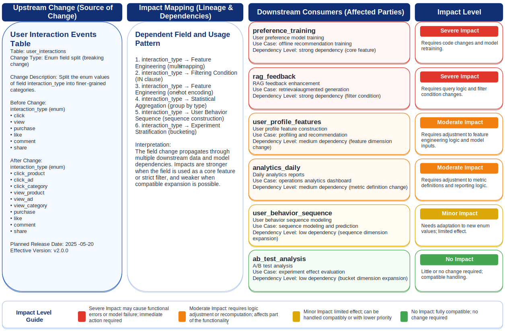

# Chapter 28: Data Productization and Data Contracts

<div class="chapter-authors">Zhongyi Liu; Ye Yu; Wenzhuo Du</div>

## Chapter Abstract

A dataset registered in a catalog may still have field semantics changed silently upstream or stop updating, and those changes can be amplified along the data chain into model degradation or online incidents. This chapter explains how to upgrade data from static datasets into data products that consumers can rely on over time, and how to use data contracts to constrain the rights and obligations of producers and consumers. It first draws on data mesh thinking and introduces a data product canvas covering inputs, outputs, service-level agreement (SLA), owner, and change policy. It then decomposes contracts into five machine-readable, verifiable, versioned clauses: schema, quality, freshness, privacy, and compatibility, while defining bidirectional responsibility boundaries. Next, it discusses change-compatibility categories and consumer governance, showing how field changes, distribution drift, index rebuilds, and evaluation-set refreshes can evolve through advance notice and canary validation. Finally, it reviews an incident in which splitting the `interaction_type` enum caused both training and retrieval degradation, showing how schema validation, distribution monitoring, and versioned rollback can catch silent failures before release.

## Keywords

Data productization and data contracts; data assets; metadata governance; data products; data contracts

## Learning Objectives

- Distinguish dataset thinking from data product thinking, and use a data product canvas to describe inputs, outputs, SLA, owner, and change policy.
- Design machine-readable, verifiable, versioned contract clauses for schema, quality, freshness, privacy, and compatibility.
- Define bidirectional responsibility boundaries between data producers and consumers, and classify the compatibility of field changes, distribution drift, index rebuilds, and evaluation-set refreshes.
- Design advance notice and canary validation mechanisms to govern consumer dependencies in a controlled and rollbackable way.
- Explain how silent schema failures can be amplified into both training and retrieval degradation, and propose preventive controls.

## Chapter Guide

Chapter 27 explained how data catalogs and metadata governance turn organizational data from "visible but unreachable" into discoverable, understandable, and trustworthy assets. But discoverable and understandable data is not automatically dependable. A cataloged dataset may still have field meanings changed silently upstream, or may stop updating after one ingestion failure. When downstream training pipelines, RAG knowledge bases, or evaluation systems depend on it, small upstream changes can be amplified into model degradation, online incidents, or compliance risks (Sambasivan et al. 2021).

This chapter addresses that problem: how to upgrade data from "static datasets" into **data products** that consumers can rely on over time, and how to use explicit **data contracts** to define the rights and obligations of producers and consumers. Unlike traditional data delivery, data productization is not about handing data over once. It treats data like a software product that provides a service outward: the structure, quality, freshness, privacy boundaries, and change behavior of the data must be maintained continuously, and downstream consumers must be notified and protected in a controlled, predictable way when change occurs.

This shift is especially important in large-model data engineering. Training solidifies data characteristics into parameters. RAG systems continuously consume changing knowledge sources. Evaluation systems depend on stable data distributions so that results remain comparable. In these settings, unnoticed upstream changes can mean failed training, wrong online answers, or distorted evaluation conclusions.

The chapter proceeds in four parts. First, it explains the shift from datasets to data products and introduces product elements such as inputs, outputs, SLA, owner, and change policy. Second, it breaks down five core data-contract clauses: schema, quality, freshness, privacy, and compatibility. Third, it discusses change compatibility and consumer governance, explaining how field changes, sample-distribution changes, index rebuilds, and evaluation-set refreshes can be announced in advance and validated through canaries. Finally, it reviews a realistic incident in which an upstream field change caused both training and retrieval quality to decline, showing how contracts and rollback should have contained the damage.

## 28.1 From Datasets to Data Products

### 28.1.1 Limits of Dataset Thinking

In many organizations, early data delivery follows a simple dataset mindset: when a team needs data, the producer exports a file or opens a table, and delivery is considered complete. This can work for one-off analysis and prototypes. It breaks down when multiple teams and applications depend on the same data for a long time.

The first problem is that dataset thinking treats data as a static deliverable rather than a continuing service. A CSV export is disconnected from upstream as soon as it is delivered; downstream consumers cannot see schema evolution, definition changes, or quality fluctuations. The second problem is unclear responsibility. When data fails, consumers do not know whom to contact, and producers often do not feel responsible for downstream use. The third problem is uncontrolled change. Upstream producers may change fields, adjust meanings, or stop updates at any time, and the impact on downstream systems is completely unpredictable. That freedom is convenient for producers and disastrous for consumers: any depended-on dataset can quietly become invalid at any moment.

The root issue is that dataset thinking asks whether data has been delivered, not whether it can be used reliably over time. In production ML systems, unmanaged data dependencies accumulate as technical debt and raise maintenance cost until failures appear (Sculley et al. 2015). Solving this requires upgrading delivery from a file to a product.

### 28.1.2 Data Products Deliver Stable Capability, Not One-Time Files

The concept of a **data product** has become prominent with the rise of data mesh architectures (Dehghani 2022; Machado, Costa and Santos 2022). Its core idea is that data should be managed like a user-facing software product: it has clear consumers, promised service quality, a responsible owner, and predictable evolution.

Treating data as a product means delivering not a snapshot at one moment, but a **stable capability** that consumers can rely on over time: the structure will not change without reason, quality will not degrade silently, and updates will not stop unexpectedly. This stability is not free. It requires producers to take continuing responsibility for downstream use, define service-level commitments, and follow established communication and canary processes when change occurs.

The core of a data product is therefore not only the amount or richness of data. It is the system of **predictability** around the data. This matches a broader lesson from ML engineering: reliability in real environments often depends less on the model alone and more on the discipline around data (Paleyes, Urma and Lawrence 2022; Lwakatare et al. 2020).

### 28.1.3 Data Product Canvas: Inputs, Outputs, SLA, Owner, and Change Policy

To build a real data product, the team must answer a structured set of questions: what upstream inputs does it consume, what outputs does it provide, what service quality does it promise, who owns it, and how will it evolve? These questions can be summarized in a **Data Product Canvas**, a shared template for defining and reviewing data products.

As shown in Figure 28-1, the canvas organizes the key elements of a data product into one view, so that producers, consumers, and governance teams can discuss product boundaries and commitments in the same context.


*Figure 28-1: Data product canvas.*

Several elements are central:

- **Inputs** describe the upstream data sources and assets this data product depends on. They make upstream lineage explicit, so that when an upstream source changes, the team can immediately assess whether this product is affected.
- **Outputs** define the external data interface, including schema, granularity, field semantics, and access methods. Once published, the output interface becomes a consumer-facing commitment and cannot be changed arbitrarily.
- **SLA** distinguishes a data product from an ordinary dataset. Borrowing from service-level engineering (Beyer et al. 2016), a data-product SLA usually includes update frequency and delay limits, such as "updated before 08:00 every day"; availability, such as "99.5% annual availability"; quality floors, such as "completeness not lower than 0.98"; and incident response time. SLA turns the vague promise of "best effort" into measurable, accountable indicators.
- **Owner** defines who is ultimately accountable for the quality, stability, and evolution of the data product. A data product without a clear owner will eventually decay because nobody maintains it. In addition to the owner, a steward is usually responsible for day-to-day operations.
- **Change Policy** defines how the data product evolves: which changes are allowed, how much advance notice is required, whether canarying is required, and how consumers are informed. Change policy is the institutional guarantee for product predictability and is the core topic of Section 28.3.

Table 28-1 summarizes the fundamental differences between datasets and data products along these dimensions.

**Table 28-1: Dataset versus data product**

| Dimension | Dataset | Data Product |
| --- | --- | --- |
| Delivery form | One-time file or snapshot | Stable service that can be relied on |
| Responsible party | Often unclear | Explicit owner and steward |
| Service commitment | None | SLA for freshness, quality, and availability |
| Change management | Can change freely | Controlled by policy and contracts |
| Consumer relationship | Loose and invisible | Registered, traceable, notifiable |
| Evolution | Unpredictable | Versioned, canaried, backward-compatible |

### 28.1.4 Section Summary

Moving from datasets to data products is a shift from static files to stable capability. By defining inputs, outputs, SLA, owner, and change policy, a data product anchors predictability in process rather than memory. But a canvas only describes what a product should promise. To make promises executable, checkable, and accountable, a more formal machine-readable agreement is needed: the data contract.

## 28.2 Fields and Boundaries of a Data Contract

### 28.2.1 What Is a Data Contract?

If a data product canvas answers what a product promises, a **data contract** answers how those promises are precisely defined, machine-validated, and jointly followed. A data contract is a formal, versioned, executable agreement between data producers and consumers. It turns expectations that used to live in conversation and personal memory into structured, verifiable rules.

A data contract is fundamentally different from a traditional schema definition. A schema describes structure: fields and types. A data contract describes a broader set of commitments: structure, quality, freshness, privacy, and compatibility. In this sense, a data contract can be understood as an executable counterpart to dataset documentation practices such as Datasheets for Datasets (Gebru et al. 2021): documentation records composition, uses, and limits; contracts further turn those commitments into engineering artifacts that can be checked automatically by pipelines and evolve with versions.

Contracts are also bidirectional. They constrain what producers must provide and clarify what consumers can expect. They also state what consumers must not depend on. This makes responsibility clear when data fails: did the producer violate the contract, or did the consumer rely on behavior that was never promised?

The idea is highly consistent with practice in ML data validation. In production ML systems, automatic validation of schema and statistical properties for incoming data has been shown to be an effective way to intercept low-quality data and prevent failures from propagating downstream (Breck et al. 2019). A data contract moves this validation earlier and institutionalizes it as a formal agreement between producer and consumer.

### 28.2.2 Five Core Contract Clauses

A complete data contract usually contains five core clause groups, each covering a different side of data reliability. Table 28-2 summarizes the questions and examples for these five contract types.

**Table 28-2: Focus and examples of five data-contract types**

| Contract Type | Question Answered | Example Clauses |
| --- | --- | --- |
| Schema | What does the data look like? | Field names, types, nullability, enum values, primary keys |
| Quality | How trustworthy is it? | Completeness >= 0.98, validity >= 0.97, deduplication rate, anomaly limits |
| Freshness | How current is it? | Updated before 08:00 daily, latency <= 2 hours, alert on missed update |
| Privacy | Who can use it, and how? | PII fields, anonymization requirements, access scope, compliance tags |
| Compatibility | How can it evolve without breaking downstream users? | Backward compatibility, notice period, deprecation window |

**Schema contracts** define field names, data types, nullability, enum values, primary-key constraints, and similar structural rules. The key point is to make value-range constraints explicit. For example, if an `interaction_type` field is declared as the closed set `{click, like, collect, share}`, then any new or split enum value introduced upstream immediately violates the contract and can be detected. This point becomes central in the incident review in Section 28.4. Schema contracts must also define field semantics, not just types, because a field with the same type but a changed meaning is one of the most dangerous failure modes (Rahm and Bernstein 2001).

**Quality contracts** define quality floors through measurable indicators: completeness, validity, duplication, outlier rates, and distribution stability (Wang and Strong 1996; Redman 1998). They should be tied to consumer needs; one dataset may need different quality thresholds for aggregate analysis and model training (Strong, Lee and Wang 1997).

**Freshness contracts** define update frequency, latency limits, and missed-update alerts. In RAG systems, freshness directly affects answer correctness: an outdated knowledge source can make the model answer from stale information. Freshness contracts turn the vague expectation of "how new the data should be" into a monitorable hard indicator.

**Privacy contracts** define privacy and compliance boundaries: which fields are PII, whether they have been anonymized, which roles and purposes may access the data, and which regulations apply. They turn the permission and compliance requirements discussed in the previous chapter into part of the public commitment of a data product, preventing sensitive data from being leaked accidentally or used beyond authorization during delivery.

**Compatibility contracts** define how the product evolves without harming downstream consumers: which changes are considered backward-compatible, how much notice is required before change, and how long older versions remain available before deprecation. Compatibility ideas borrow from schema evolution in data-intensive systems: backward compatibility means data produced by the new version can still be read correctly by consumers written against the old schema, while forward compatibility means the reverse (Kleppmann 2017). Compatibility contracts connect static commitments with dynamic change and are the core of Section 28.3.

### 28.2.3 Data Contract Template

Putting the five clause groups together forms a complete data contract. As shown in Figure 28-2, a typical contract template includes metadata such as name, version, and owner; the five clause groups; and effective/change information.


*Figure 28-2: Data contract template.*

```yaml
contract: user_interaction_feedback
version: 2.0.0
owner: data-platform-team@company.com
consumers: [preference_training, rag_feedback, analytics]

schema:
  - user_id:          string, required, hashed
  - interaction_type: enum{click,like,collect,share}, required
  - event_time:       timestamp(UTC, ms), required
quality:
  completeness: ">=0.98"
  validity:     ">=0.97"
  interaction_type_distribution: "click ratio 0.4-0.6; alert on abrupt drift"
freshness:
  update: "before 08:00 UTC daily"
  max_delay: "2h"
  on_miss: alert
privacy:
  pii_fields: [user_id]
  handling: hashed
  access: internal
compatibility:
  policy: backward_compatible
  notice_period: "14 days"
  deprecation: "old version retained for one version cycle"
```

The contract is **machine-readable, checkable, and versioned**. It can live in version control, evolve with the data product, be checked by CI before release, and trigger alerts or blocks when violated. It is no longer a passive document; it is an engineering artifact embedded in the production process.

### 28.2.4 Execution and Responsibility Boundaries

Contracts matter only if executed. Execution happens at multiple points:

- **Before release**, CI checks schema and quality clauses and blocks nonconforming data.
- **At runtime**, monitoring measures quality and freshness and alerts on violations.
- **During change**, compatibility checks classify the change and trigger notification or canary processes.

Contracts also define responsibility. Within the contract, producer failures are producer responsibility. If consumers depend on behavior outside the contract, such as assuming a nullable field is always non-null or an undocumented field will never disappear, they own that risk. Many production data incidents come from hidden consumer dependencies outside explicit contracts (Polyzotis et al. 2018; Shankar et al. 2022).

### 28.2.5 Section Summary

Data contracts turn product promises from vague verbal agreements into precise, machine-readable, checkable formal specifications. Schema, quality, freshness, privacy, and compatibility cover the structural, quality, freshness, privacy, and evolution aspects of reliability. The bidirectional nature of contracts clarifies the rights and obligations of producers and consumers and draws clear responsibility boundaries. Static contracts alone are not enough, however, because data products inevitably change. How to keep change from harming downstream consumers is the core problem addressed in the next section.

## 28.3 Change Compatibility and Consumer Governance

### 28.3.1 Change Is the Main Risk of Data Products

Data products evolve as business systems, upstream sources, structures, definitions, and distributions change. Change itself is healthy. The risk is **ungoverned change**: a producer changes data that consumers depend on without their knowledge.

The danger comes from a fundamental property of data products: downstream consumers are often invisible, numerous, and independent. A local field adjustment can affect a training pipeline, a RAG index, and several reports. Unlike software API breaks, data changes often do not fail loudly. The pipeline continues running, but the result becomes wrong. Silent failure is the core reason data incidents are hard to detect early (Sambasivan et al. 2021).

Change governance turns change from a risk source that may cause silent failure into a controlled, predictable, canaryable routine operation. It requires three things: **classification**, so that safe and dangerous changes are distinguished; **advance notice and canary validation**, so that risky changes are exposed before they affect everyone; and **consumer visibility**, so that impact analysis is possible.

### 28.3.2 Change Classification and Compatibility

Not all changes are equally dangerous. Based on downstream impact, data changes can be divided into three categories, as shown in Table 28-3.

**Table 28-3: Field change types and compatibility**

| Change Type | Example | Compatibility | Handling |
| --- | --- | --- | --- |
| Backward-compatible | Add nullable fields, broaden value range, improve documentation | Safe | Notify; no canary required |
| Potentially breaking | Add enum values, adjust field semantics, distribution drift | Risky | Advance notice plus canary validation |
| Breaking | Delete/rename fields, change type or unit, tighten constraints | Dangerous | Version upgrade with old/new coexistence |

**Backward-compatible changes** do not break existing consumers, such as adding a nullable field or broadening the allowed value range of a field. By definition, consumers written against the old schema can still read the new data correctly (Kleppmann 2017). These changes are relatively safe and usually require only notification, not canarying.

**Breaking changes** inevitably break existing consumers, such as deleting a field, renaming a field, changing a data type or unit, or tightening value constraints. They must never overwrite the existing product in place. Instead, they must go through a version-upgrade process: publish a new version, let old and new versions coexist during a transition window, and give consumers enough time to migrate.

The most dangerous category is the middle ground: **potentially breaking changes**. They may look compatible at the schema level because no type changes and no fields disappear, but semantics or distributions have already changed. Adding an enum value, slightly changing a field's computation definition, or shifting the data distribution because an upstream sampling policy changed all belong to this category. These changes do not trigger type errors, but they can quietly invalidate downstream filtering logic, feature computation, or retrieval weights. Recognizing and handling this category well is the part of change governance that most tests engineering discipline.

To judge quickly and consistently how a change should be handled in engineering practice, teams can use a **change compatibility decision tree**, as shown in Figure 28-3.


*Figure 28-3: Change compatibility decision tree.*

### 28.3.3 Advance Notice and Canary Validation

For potentially breaking and breaking changes, classification alone is not enough. A mechanism for **advance notice and canary validation** is also needed so that risk is exposed before downstream consumers are truly affected. Consider the four typical change categories emphasized in this section.

1. **Field changes.** When schema changes, the system should automatically classify compatibility from the compatibility contract and notify all registered consumers through agreed channels within the notice period, such as 14 days. For breaking changes, the new field behavior should first be released as a new version that coexists with the old version. Only after consumers migrate and confirm one by one should the old version enter the deprecation cycle. This dual-version coexistence is essentially trading storage and operational cost for a safe migration window.
2. **Sample-distribution changes.** Distribution drift is the most hidden kind of change because it changes statistical properties rather than structure. For example, an upstream anti-scraping policy adjustment may sharply reduce the proportion of samples from a certain user group. Schema validation cannot find this; only distribution monitoring in the quality contract can. When the value distribution of a key field deviates from the baseline beyond a threshold, the system should alert (Breck et al. 2019; Schelter et al. 2018). For training data, distribution drift can directly change the priors learned by the model. For evaluation data, it can make evaluation results no longer comparable.
3. **Index rebuilds.** In RAG and similar scenarios, knowledge-source updates often require rebuilding vector indexes. Index rebuilding is a special kind of change: it may introduce a new chunking strategy or a new embedding model and thereby change retrieval behavior. It should be canaried. First serve part of the traffic with the new index in a shadow environment, compare retrieval-quality metrics such as recall and citation accuracy between old and new indexes, and switch fully only after confirming no degradation, rather than overwriting the online index directly.
4. **Evaluation-set refreshes.** Evaluation sets are also data products that require governance. Refreshing an evaluation set changes the evaluation baseline, so model scores before and after the refresh are no longer directly comparable. Evaluation-set refreshes should therefore be versioned, and differences between old and new evaluation sets should be recorded at the time of refresh. Regression tests for critical models should run on both old and new evaluation sets for a period, ensuring that score changes come from the model itself rather than from the evaluation set. In addition, evaluation-set leakage into training data must be strictly prevented; once leakage occurs, evaluation results become systematically distorted.

The shared principle of canary validation is to validate impact in a controlled scope before a change takes full effect. This mirrors canary release in software engineering: validate first in a small, reversible scope and keep risk within a tolerable range.

### 28.3.4 Consumer Governance and Impact Analysis

Advance notice and impact analysis require knowing who consumes the data product. Mature platforms require consumers to register before use, declaring scenario, depended fields, and SLA requirements. The consumer registry plus lineage graph forms the basis of **consumer impact analysis**.

When a change is proposed, impact analysis asks: which consumers are affected, how severe is the impact, and which consumers must confirm the migration? Using the consumer registry and lineage graph, the system can automatically list affected consumers and classify severity based on each consumer's depended fields, scenario, and SLA requirements. This turns blind pre-change guessing into precise, evidence-based evaluation, which is exactly the key capability demonstrated in the incident review in Section 28.4.

### 28.3.5 Section Summary

Change is an unavoidable reality of data products, and ungoverned change is their main risk. By classifying changes as backward-compatible, potentially breaking, or breaking, and using a decision tree to guide handling, teams can assess risk consistently. For risky changes, advance notice and canary validation expose risk before it reaches downstream systems. The prerequisite for all of this is making consumer relationships registered and traceable, so precise impact analysis becomes possible. The next section uses a concrete incident review to show what happens when these mechanisms are missing and how contracts and rollback contain damage.

## 28.4 Data Contract Failure Review

### 28.4.1 Incident Background

The best way to understand the value of data contracts is to review what happens without them. This section describes a representative composite incident, combining typical features from multiple real cases. It shows how one upstream field change propagates along the data chain and eventually causes both training and retrieval quality to decline, and how contracts and rollback mechanisms should have contained the damage.

The incident involves a data product named `user_interaction_feedback`, a user-interaction feedback dataset consumed by two downstream systems: a preference-model training pipeline (`preference_training`) and a relevance-feedback module for a RAG system (`rag_feedback`).

The key field is `interaction_type`, originally an enum with values `{click, like, collect, share}`. `click` is the largest and most important positive signal.

### 28.4.2 Timeline: How an Upstream Field Change Propagated

**Stage 1: an upstream "harmless" change.** The upstream logging team splits `click` into `click_card` and `click_detail` for finer behavior analysis. They see it as an enhancement: no field is deleted and the schema field list is unchanged. The change goes live without notification.

**Stage 2: silent downstream failure.** Both downstream systems filter on `interaction_type == "click"` to identify positive signals. After the change, the share of `click` drops near zero because it has been split into two new values. The pipelines do not error. Fields and types still exist. Training and RAG feedback jobs run normally, but positive samples have nearly disappeared.

**Stage 3: degradation is noticed.** A new preference model goes online and recommendation quality falls. At the same time, RAG answer relevance gets worse. Both teams first debug their own models and algorithms, trying hyperparameters, model rollback, and retrieval strategy changes. Days are spent without improvement because the shared data dependency is the cause (Sculley et al. 2015; Shankar et al. 2022).

**Stage 4: root cause located.** Only after an engineer compared historical data distributions did the team find the cliff-like drop in `click` and finally trace it to the upstream "harmless" enum split. Nearly a week passed from rollout to root-cause identification, during which online recommendation and QA quality continued to be harmed.

### 28.4.3 Consumer Impact Analysis

This incident clearly exposes the cost of silent failure. If a consumer registry and impact-analysis capability had existed, the upstream team would have immediately received a list of affected consumers when proposing the change. Table 28-4 shows a retrospective consumer impact analysis.

**Table 28-4: Consumer impact analysis for splitting the `interaction_type` enum**

| Consumer | Depended Field | Use | Impact | Consequence | Response |
| --- | --- | --- | --- | --- | --- |
| preference_training | interaction_type | Filter `== click` as positive samples | Severe | Positive samples nearly disappear; model quality drops | Block change; migrate first |
| rag_feedback | interaction_type | Weight chunks by click | Severe | Feedback weight fails; relevance drops | Block change; migrate first |
| analytics_daily | interaction_type | GROUP BY statistics by type | Medium | Reporting definition breaks | Notify and update definition |

This table turns the impact of one change from vague concern into a row-level checklist: who is affected, how, how badly, and what to do. Even consumers such as `analytics_daily`, which are affected but less severely, are included, demonstrating the completeness of impact analysis. As shown in Figure 28-4, the essence of this analysis is to map one upstream change along lineage to all downstream consumers and grade them by impact severity.



*Figure 28-4: Consumer impact analysis.*

### 28.4.4 How Contracts and Rollback Contain the Damage

With data contracts, the same change would follow a different path.

**First defense: schema contract interception.** `interaction_type` is declared in the contract as the closed enum `{click, like, collect, share}`. When upstream tries to introduce `click_card` and `click_detail`, the pre-release CI check immediately detects that the enum values are outside the contract and **blocks the release**. At that point, the change is identified as potentially breaking and must go through advance notice and canary validation rather than directly overwriting the existing product.

**Second defense: quality-contract distribution monitoring.** Even if schema validation were bypassed for some reason, the distribution constraint in the contract, such as "`click` ratio should be between 0.4 and 0.6," would alert immediately when `click` dropped sharply (Schelter et al. 2018). This means the problem would be found **on the day of the change, before the data entered training**, rather than several days after the model went online and quality declined.

**Third defense: versioning and rollback.** Because the data product is versioned, downstream consumers can pin to a validated version instead of blindly following the latest data. Once a new version is found to be problematic, consumers can immediately **roll back to the previous stable version** and continue running, compressing time to mitigation from days to minutes. At the same time, a compatibility shim can temporarily map the new enum values `click_card` and `click_detail` back to the old value `click`, allowing downstream systems to transition smoothly without code changes until migration is complete and the finer-grained semantics are officially enabled.

Together, these defenses turn a change that could have become a multi-day online incident into a routine operation that is blocked before release, canaried, and rollbackable. This is the core value of a data contract: it does not eliminate change; it makes change safe.

### 28.4.5 Lessons

First, **unchanged schema does not mean unchanged semantics**. The most dangerous changes often look compatible at the schema layer but drift semantically. They do not raise errors; they simply make results quietly wrong. Closed enums, distribution monitoring, and similar constraints are designed to catch these hidden changes.

Second, **silent failure is more dangerous than explicit errors**. Much of the high cost of data incidents comes from the fact that they are hard to notice in time. Explicitly declaring what data must satisfy as a checkable contract turns potential silent failures into visible, early alerts.

Third, **versioning is the prerequisite for rollback**. Without versioning, there is no previous stable state to return to, so mitigation has nowhere to start. Data-product versioning and consumer version pinning are the last and most reliable safety net during incidents.

Fourth, **consumer visibility determines impact-analysis capability**. The upstream team dared to make a "harmless" change because it could not see downstream consumers. Consumer registration and lineage tracking make invisible dependencies explicit and make precise pre-change impact assessment possible.

### 28.4.6 Section Summary

The `interaction_type` enum-split incident shows how an unmanaged change can propagate silently along the data chain, causing days of hard-to-diagnose damage to both training and retrieval. Under data-contract protection, the same change would be intercepted by schema validation, alerted by distribution monitoring, and covered by versioning and rollback, dissolving the incident before it became visible to users. The value of data contracts is not to prevent change, but to make change transparent, controlled, and reversible for consumers.

## Chapter Summary

The shift from datasets to data products is fundamentally a shift from delivering a file to providing a stable capability that can be relied on over time. Data products define inputs, outputs, SLA, owner, and change policy so that predictability is anchored in process rather than personal memory. Data contracts further solidify these commitments into five machine-readable, checkable formal clause groups: schema, quality, freshness, privacy, and compatibility. Through bidirectional agreements, contracts draw responsibility boundaries between producers and consumers.

Change is unavoidable for data products, and ungoverned change is their main risk. The danger is that data changes often do not report errors; they simply make results wrong. By classifying changes as backward-compatible, potentially breaking, or breaking, and combining that classification with advance notice, canary validation, consumer registration, and impact analysis, teams can turn change from a silent-failure risk source into a controlled, rollbackable routine operation. The incident review in this chapter shows that unchanged schema does not mean unchanged semantics, that versioning is the prerequisite for rollback, and that consumer visibility determines impact-analysis capability. The value of data contracts is not to prevent change, but to make change transparent, controlled, and reversible for consumers.

## References

Beyer B, Jones C, Petoff J, Murphy N R (2016) Site Reliability Engineering: How Google Runs Production Systems. O'Reilly Media, Sebastopol.

Breck E, Polyzotis N, Roy S, Whang S E, Zinkevich M (2019) Data Validation for Machine Learning. In: Proceedings of the 2nd SysML Conference (MLSys).

Dehghani Z (2022) Data Mesh: Delivering Data-Driven Value at Scale. O'Reilly Media, Sebastopol.

Gebru T, Morgenstern J, Vecchione B, Vaughan J W, Wallach H, Daumé III H, Crawford K (2021) Datasheets for Datasets. Communications of the ACM 64(12):86-92.

Kleppmann M (2017) Designing Data-Intensive Applications: The Big Ideas Behind Reliable, Scalable, and Maintainable Systems. O'Reilly Media, Sebastopol.

Lwakatare L E, Raj A, Crnkovic I, Bosch J, Olsson H H (2020) Large-scale machine learning systems in real-world industrial settings: A review of challenges and solutions. Information and Software Technology 127:106368.

Machado I A, Costa C, Santos M Y (2022) Data Mesh: Concepts and Principles of a Paradigm Shift in Data Architectures. Procedia Computer Science 196:263-271.

Paleyes A, Urma R-G, Lawrence N D (2022) Challenges in Deploying Machine Learning: A Survey of Case Studies. ACM Computing Surveys 55(6):1-29.

Polyzotis N, Roy S, Whang S E, Zinkevich M (2018) Data Lifecycle Challenges in Production Machine Learning: A Survey. ACM SIGMOD Record 47(2):17-28.

Rahm E, Bernstein P A (2001) A survey of approaches to automatic schema matching. The VLDB Journal 10(4):334-350.

Redman T C (1998) The Impact of Poor Data Quality on the Typical Enterprise. Communications of the ACM 41(2):79-82.

Sambasivan N, Kapania S, Highfill H, Akrong D, Paritosh P, Aroyo L M (2021) "Everyone wants to do the model work, not the data work": Data Cascades in High-Stakes AI. In: Proceedings of the 2021 CHI Conference on Human Factors in Computing Systems, pp 1-15.

Schelter S, Lange D, Schmidt P, Celikel M, Biessmann F, Grafberger A (2018) Automating Large-Scale Data Quality Verification. Proceedings of the VLDB Endowment 11(12):1781-1794.

Sculley D, Holt G, Golovin D, Davydov E, Phillips T, Ebner D, Chaudhary V, Young M, Crespo J-F, Dennison D (2015) Hidden Technical Debt in Machine Learning Systems. In: Advances in Neural Information Processing Systems 28, pp 2503-2511.

Shankar S, Garcia R, Hellerstein J M, Parameswaran A G (2022) Operationalizing Machine Learning: An Interview Study. arXiv preprint arXiv:2209.09125.

Strong D M, Lee Y W, Wang R Y (1997) Data Quality in Context. Communications of the ACM 40(5):103-110.

Wang R Y, Strong D M (1996) Beyond Accuracy: What Data Quality Means to Data Consumers. Journal of Management Information Systems 12(4):5-33.