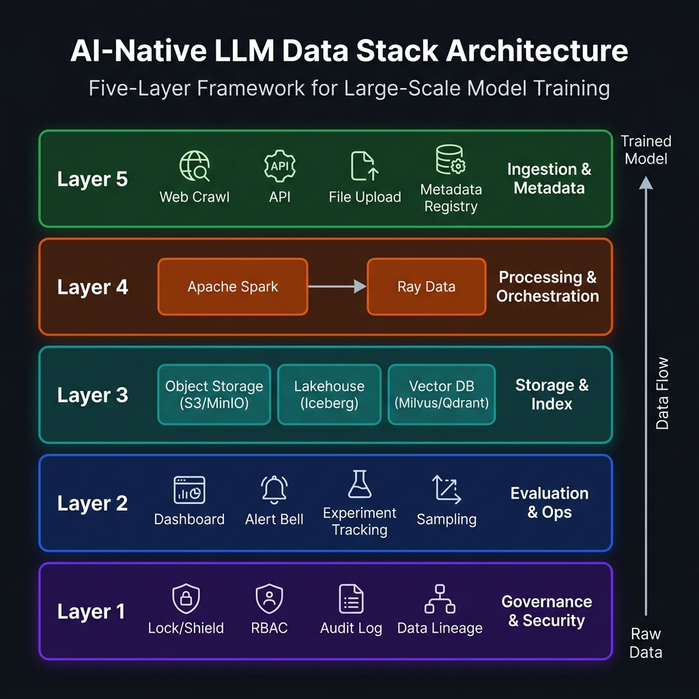
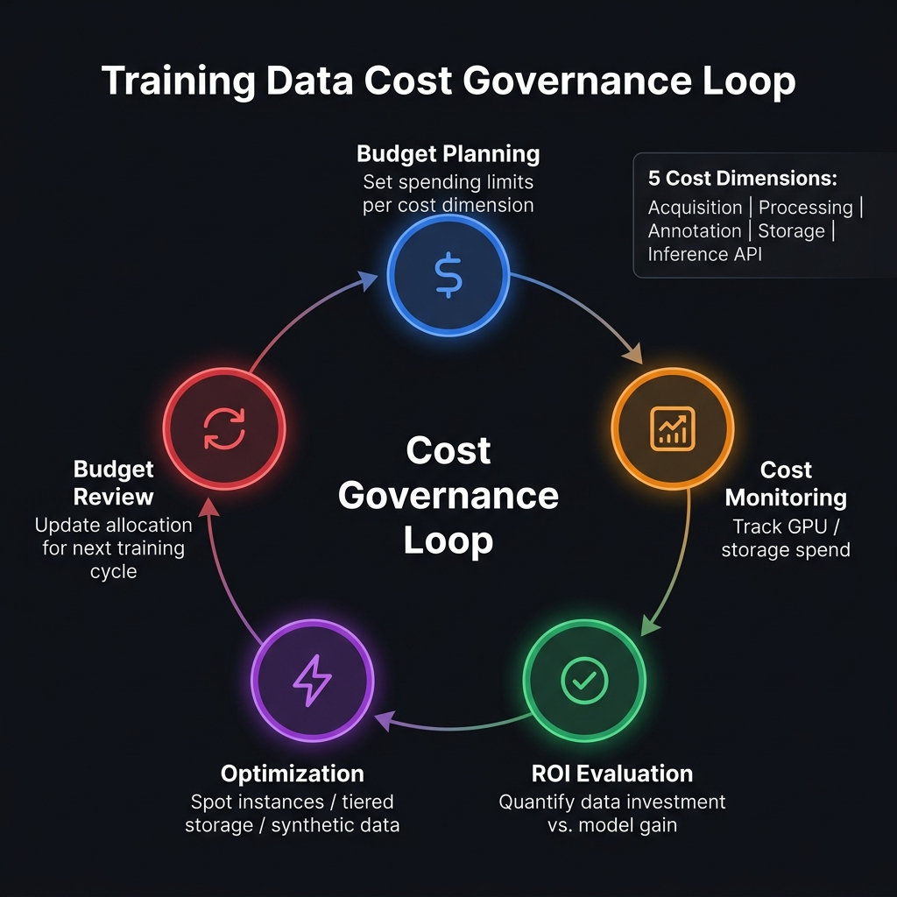

# 第3章 AI原生数据栈与成本治理

## 开篇场景：数据平台的"野蛮生长"之痛

你刚以数据负责人的身份加入一家完成 B 轮融资的大模型创业公司。接手后的第一周，你做了一次数据基础设施的全面摸底，结论令人头皮发麻：语料数据零散地分布在 50 多台工程师的本地硬盘上，格式五花八门——`.txt`、`.json`、`.csv`、`.parquet` 混用，没有任何统一规范；每次需要处理新的数据，都靠一名工程师手工编写 Python 脚本在单机上跑，一份 500GB 的文件跑三天是常态；三个月前有人因为文件路径搞错，把一个关键的高质量 SFT 数据集覆盖掉了，而这份数据没有任何备份和版本记录。CEO 问你：一个月后公司计划开始第一轮 7B 模型的预训练，数据平台能不能 ready？

这个场景并非夸张的极端案例。在大量快速成立的大模型团队中，这种状态在早期几乎是普遍现象——因为算法和模型架构是团队最优先关注的焦点，数据基础设施往往被视为"能凑合就行"的配角，直到某次关键数据丢失、训练集群因为数据 I/O 成为瓶颈，或因为合规审计发现训练数据来源不清，才被迫进行紧急的基础设施建设。

而这，恰恰是最昂贵的建设方式。因为在这种情况下，数据工程师不是在构建平台，而是在救火。

---

## 3.1 AI 原生数据栈为什么不同于传统数仓

在很多工程师的职业认知里，"数据基础设施"指的是 Hadoop + Hive + Spark 那一套经典大数据技术栈，以及围绕它构建的关系型数据库、数据仓库和 BI 报表体系。这套体系在过去十年里支撑了无数企业的数据分析和机器学习业务，是极为成熟、经过大规模生产验证的工程体系。

然而，当你把这套体系原封不动地搬到大语言模型的数据工程场景时，你会发现它在几乎每一个关键维度上都存在严重的不匹配。

### 3.1.1 目标根本不同：从"分析"到"喂养"

传统数据仓库服务的核心目标是**分析与洞察**：把业务数据汇聚起来，通过 SQL 查询和 BI 工具，帮助业务决策者回答"过去发生了什么"和"现在的业务状态如何"。在这个目标下，数据的核心价值体现在**可查询性**（Query Performance）和**一致性**（Consistency）上：数据必须准确、结构整齐、可以被快速JOIN和聚合。

LLM 数据栈服务于截然不同的核心目标：**喂养一个神经网络模型**。数据的最终消费者不是人，而是 GPU 上运行的 Attention 计算。在这个目标下，数据的核心价值体现在**训练效率**（Training Throughput）和**质量信噪比**（Signal-to-Noise Ratio）上：GPU 的利用率必须保持在 85% 以上（否则花费数百万的算力成本就是在空转），而数据中的每一个 Token 都必须经过精心筛选，确保不会让模型学到错误的知识或低质量的语言模式。

这种目标的差异，直接导致了两套体系在技术选型上的全面分叉。

### 3.1.2 工作负载的本质差异

传统数仓的典型工作负载是**读多写少的 OLAP 查询**：大量的用户并发执行 SELECT 查询，偶尔有 ETL 批量写入。数据量通常在 GB 到 TB 级别，峰值追求查询延迟低于秒级。

LLM 数据栈的工作负载有着截然不同的特征结构：

**预训练数据处理**是整个体系最重的工作负载。数十 TB 到 PB 级别的原始语料需要经过去重、过滤、格式转换和分词等多道串行处理，每一步都是 CPU 密集型操作，需要在数千个核心上并行执行，才能在合理的时间窗口内完成。这类工作负载要求计算层能够高效调度和追踪数以亿计的文件/文档级任务。

**与 GPU 训练的 I/O 对齐**是另一个关键约束。模型训练期间，DataLoader 需要以極高的频率（每 step）向 GPU 喂入数据，任何 I/O 等待都会导致 GPU 空转，直接燃烧算力预算。因此存储层必须具备能够匹配 GPU 训练带宽需求的读取速度，这对对象存储的访问模式（顺序大文件 vs 随机小文件）和网络带宽（InfiniBand / 100GbE 以太网）都有严格的要求。

**在线推理与实时反馈的并存**进一步加剧了系统复杂度。当模型上线运行推理业务时，用户的真实交互数据（包括对话记录、满意度反馈、有价值的纠错案例）需要实时回流，经过清洗和标注，进入 SFT 或 RLHF 数据管线。这意味着数据栈必须同时支持离线批处理（预训练语料清洗）和低延迟在线写入（用户反馈回流），这两种工作负载对存储和计算层的要求完全不同，在一套系统中同时支持两者，本身就是一个巨大的架构挑战。

### 3.1.3 成本约束的多维交织

在传统 BI 体系中，成本主要体现在**存储成本**和**查询计算成本**上。而在 LLM 数据体系中，四类成本形成了复杂的多维约束：

首先是**算力成本**（GPU/TPU 训练集群）。一块 H100 GPU 的租用价格约为每小时 3-4 美元，8 卡 DGX 节点约 25-30 美元/小时，一次 7B 模型的预训练往往需要持续数百小时，总算力成本轻松突破百万人民币量级。这意味着任何由于数据问题造成的训练中断或重启，代价都是极其昂贵的——这是 LLM 数据栈必须以"不允许训练失败"为最高设计准则的根本原因。

其次是**数据处理成本**。PB 级的语料清洗任务在 CPU 集群上运行，每次完整的预处理管线可能需要数十万核心小时的计算，这在公有云上的费用可达数万至数十万美元。如何通过精细调度（如使用 Spot 实例）和算法优化（如 MinHash 近似去重替代精确去重）来降低单次处理成本，是工程化必须考量的核心命题。

第三是**标注与人工成本**。高质量的 SFT 样本需要具备专业背景的标注员手工撰写，月人均产能仅约 500-2000 条高质量样本，而一个中等规模的 SFT 项目往往需要数十万条样本，这意味着标注成本很容易成为整个数据工程预算中占比最高的单项。

最后是**存储成本**。PB 级别的温热数据存储在对象存储上，即使是最便宜的 S3 Standard 层也约为 \$0.023/GB/月，100PB 的数据每月存储费用约为 235 万美元，而仅一次预训练所需的数据量就可能达到数十 PB。如何在数据的全生命周期内合理规划冷热分层（Hot / Warm / Cold），避免为已不再使用的历史数据支付高额的活跃层存储费用，是成本治理的重要课题（将在 §3.3 深入展开）。

---

## 3.2 数据栈五层拆解

在明确了 AI 原生数据栈与传统数仓的本质差异之后，我们可以开始系统性地建立这套体系的架构蓝图。一套完整的 LLM 数据栈，从底到顶可以拆解为五个功能层级，每一层都有其核心职责和关键的技术选型决策。



*图3-1：AI 原生数据栈五层架构 —— 从底层治理安全到顶层采集接入，五层协同驱动数据从原始爬取语料流向可训练的高质量数据集，右侧箭头标注了整体数据流向。*


### 3.2.1 采集接入层：让数据从"到处都是"变为"有据可查"

采集接入层是整个数据栈的入口，负责将散落在各个来源的数据以统一受控的方式纳入数据平台管理。这听起来是最"普通"的一层，但恰恰是整个体系中最容易被忽视、出了问题却代价最高的一层。

LLM 数据工程中的数据来源极为多元化：公开网页（通过 Common Crawl 快照或自研爬虫获取）、GitHub 代码仓库（通过 GitHub API 的数据集或增量镜像同步）、学术论文（从 ArXiv、PubMed、Semantic Scholar 等平台抽取）、高质量书籍（通过 Books3 等来源或合规渠道采购）、私有企业内部文档、以及用户在线反馈数据。每一类来源都有其独特的抓取方式、文件格式和更新频率。

接入层的核心工程挑战不是"如何拿到数据"（这主要是爬虫和 API 开发的工作），而是**如何在数据进入平台的第一时间，就建立起完整的元数据档案**。每一批接入的数据，必须在落盘的同时记录以下关键元信息：数据来源（source URL 或 API endpoint）、采集时间戳（用于时效性管理）、文件格式与版本、数据所有者或许可证类型（用于合规审计）、原始文件大小和文件数量，以及本次接入的任务 ID（用于断点续传和问题溯源）。没有这份元数据档案，数据进入平台后就如同"黑匣子"——你知道里面有数据，但你不知道它从哪里来、什么时候来、在哪个版本的清洗管线中被处理过。一旦出现问题，你根本无法溯源。

```python
# 元数据登记示例：每次数据接入时自动写入元数据库
from dataclasses import dataclass, asdict
from datetime import datetime
import json

@dataclass
class DataIngestionRecord:
    ingestion_id: str          # 唯一任务ID
    source_name: str           # 数据来源名称 (如 "common_crawl_2024_04")
    source_url: str            # 原始抓取URL或API端点
    ingestion_timestamp: str   # 接入时间戳 (ISO 8601)
    license_type: str          # 许可证类型 (如 "CC-BY-4.0", "Unknown", "Proprietary")
    file_format: str           # 文件格式 (如 "jsonl", "parquet", "warc")
    raw_file_count: int        # 原始文件数量
    raw_size_bytes: int        # 原始数据大小（字节）
    s3_prefix: str             # 落盘的对象存储路径前缀
    crawl_agent: str           # 采集脚本版本号

def register_ingestion(record: DataIngestionRecord, metadata_db_path: str):
    """将接入记录写入元数据库（可对接 DynamoDB/PostgreSQL/本地 SQLite）"""
    record_dict = asdict(record)
    record_dict['ingestion_timestamp'] = datetime.now().isoformat()
    # 实际生产中推荐写入 PostgreSQL 或 DynamoDB
    with open(metadata_db_path, 'a') as f:
        f.write(json.dumps(record_dict, ensure_ascii=False) + '\n')
```

### 3.2.2 处理编排层：数据工厂的流水线调度中枢

数据进入平台后，需要经历一系列串行的处理步骤，才能从原始的"毛坯数据"转化为可以直接送入训练的"精加工数据"。这些处理步骤通常包括：HTML 标签剥离与文本提取、语言识别与过滤、基于规则的噪声过滤（去除 URL 密集、广告语段等低质文本）、近似去重（MinHash LSH）、精确去重（精确匹配）、质量评分（PPL 打分或基于分类器的质量筛选）、以及最终的分词序列化。

处理编排层要解决的核心工程问题是：如何让这些步骤在数千个并行计算节点上高效执行，同时保证整个流水线的可观测性、可恢复性和可复现性。

目前工业界最主流的两种选择是 **Apache Spark** 和 **Ray Data**，两者在设计哲学和适用场景上存在根本性的差异：

**表 3-1：Apache Spark vs Ray Data 核心特性对比**

| 对比维度 | Apache Spark | Ray Data |
| :--- | :--- | :--- |
| **核心语言运行时** | Scala/Java 为核心，Python 通过 PySpark 接入，存在 JVM-Python 序列化开销 | Python 原生，无 JVM 开销，与 PyTorch / HuggingFace 无缝集成 |
| **数据抽象模型** | DataFrame（批处理思维，强调整批物化） | Dataset（流水线思维，算子间数据流式传递） |
| **GPU 计算支持** | 需借助 NVIDIA RAPIDS 插件（cuDF/cuML），集成较复杂 | 原生支持 GPU 调度，可直接在算子中调用 CUDA 算子或部署 ML 模型 |
| **内存使用模式** | 算子之间必须物化中间结果到磁盘/内存，内存压力较大 | 流水线执行，上下游算子可以重叠运行，内存效率更高 |
| **SQL 与 BI 生态** | Spark SQL 极为成熟，兼容 Hive 元数据，生态完整 | SQL 支持较弱，没有成熟的 SQL 查询接口 |
| **容错与稳定性** | 经过十余年 PB 级生产验证，稳定性极高 | 相对年轻，大规模部署的最佳实践积累少于 Spark |
| **典型代码风格** | 函数式（map/filter/groupBy 的链式调用） | 声明式 pipeline（`ds.map_batches()` 的链式拓扑） |

选择哪一个，取决于团队背景和工作负载特征。如果团队具备传统大数据背景，且数据处理管线中有大量 SQL 逻辑和对 Hive/Iceberg 的依赖，Spark 是更稳健的选择；如果团队是 AI/ML 背景，需要在数据处理中频繁调用 ML 模型（如用分类器打 PPL 分、用 NER 模型做 PII 检测），Ray Data 的 Python 原生和 GPU 调度优势则会非常明显。许多大型团队最终采用的是混合方案：Spark 负责海量粗过滤（语言识别、规则去重），Ray Data 负责需要 ML 推理的精细化处理（质量评分、基准污染检测）。

以下是一个典型的 Ray Data 数据清洗 pipeline 示例：

```python
import ray
from ray.data import read_parquet

ray.init()

def remove_html_noise(batch):
    """去除 HTML 标签，计算噪声分数"""
    import re
    texts = batch["text"].tolist()
    cleaned = [re.sub(r'<[^>]+>', '', t) for t in texts]
    noise_scores = [(len(re.findall(r'<[^>]+>', t)) * 10) / max(len(t), 1)
                    for t in texts]
    batch["text"] = cleaned
    batch["noise_score"] = noise_scores
    return batch

def filter_quality(batch):
    """过滤低质量样本"""
    mask = (batch["noise_score"] < 0.1) & (batch["text"].str.len() > 100)
    return batch[mask]

# 构建清洗 pipeline
ds = (
    read_parquet("s3://my-bucket/raw/common_crawl/")
    .map_batches(remove_html_noise, batch_format="pandas")
    .map_batches(filter_quality, batch_format="pandas")
)

# 写出到对象存储
ds.write_parquet("s3://my-bucket/processed/cc_cleaned/")
```

### 3.2.3 存储索引层：三类数据的差异化存储策略

LLM 数据栈要同时管理三种性质截然不同的数据，每种数据对存储层的要求都不相同，因此存储索引层需要采用差异化的技术方案。

**文本语料与结构化标注数据**是体量最大的一类，包括清洗后的预训练语料（Parquet 格式）、SFT 样本集（JSONL 格式）和偏好对比数据集等。这类数据的读写模式是典型的批处理：大批量顺序写入（数据处理完成后整批落盘），大批量顺序读取（训练时 DataLoader 顺序扫描）。对象存储（AWS S3 / MinIO）是这类数据毫无疑问的最优选择，但在其之上需要叠加一层数据湖表格式（Lakehouse Format）来解决版本管理和 ACID 事务的需求。

目前主流的三种数据湖格式各有其适用场景：

**表 3-2：数据湖表格式选型对比（Apache Iceberg vs Delta Lake vs Apache Hudi）**

| 特性 | Apache Iceberg | Delta Lake | Apache Hudi |
| :--- | :--- | :--- | :--- |
| **核心维护方** | Netflix → Apache 基金会 | Databricks（核心商业开源） | Uber → Apache 基金会 |
| **引擎兼容性** | Spark / Flink / Trino / DuckDB / StarRocks（最广泛） | 主要 Spark，其他需适配层 | Spark / Flink / Presto |
| **ACID 事务** | 完整支持 | 完整支持 | 支持（以 upsert/delete 见长） |
| **时间旅行查询** | 完整支持（按版本号或时间戳） | 完整支持 | 支持（较轻量） |
| **Schema 演进** | 支持（列添加/重命名/删除） | 支持 | 支持 |
| **推荐使用场景** | 多引擎混用、追求厂商中立的团队 | 深度使用 Databricks 生态的团队 | 有高频 upsert 需求（如实时知识库更新）的团队 |

对于大多数 LLM 数据工程场景，**Apache Iceberg + S3**的组合是最推荐的方案，原因是其引擎中立性——它允许你同时用 Spark 做海量清洗处理、用 DuckDB 做轻量的数据探查分析，而无需迁移数据，也不担心被任何一家商业厂商锁定。

**向量数据（Embeddings）**是第二类存储需求，主要服务于 RAG（检索增强生成）场景。向量数据库的核心职责是将海量文本 Chunk 转化为高维稠密向量并建立索引，支持高效的近似最近邻（ANN）检索。目前主流的向量数据库有 Milvus（开源，支持大规模分布式部署）、Qdrant（Rust 实现，性能极高，轻量部署友好）和 Weaviate（内置多模态向量支持，Schema 友好）等。选型时的核心决策因素是：向量数量规模（100万以下 vs 亿级）、是否需要 Hybrid Search（稠密向量 + BM25 稀疏检索的混合）、以及运维团队对分布式系统的运维能力。

**模型 Checkpoint 与实验产物**是第三类，包括训练过程中保存的模型权重文件（动辄数百 GB）、TensorBoard 或 W&B 的训练日志、以及 Tokenizer 配置等。这类数据量大、访问频率不均匀（训练中频繁写入，训练后几乎只读），适合以对象存储为主存储，配合 DVC（Data Version Control）或 MLflow Artifacts 做版本追踪。

```bash
# 使用 DVC 为数据集建立版本追踪
dvc init
dvc add datasets/sft/v2.3/  # 将数据集目录纳入 DVC 追踪
git add datasets/sft/v2.3.dvc .gitignore
git commit -m "feat: add SFT dataset v2.3 (84k samples, legal domain)"
dvc push  # 将实际数据推送到 S3 远程存储
# 其他工程师可用 dvc pull 拉取完全相同的数据
```

### 3.2.4 评测运营层：让数据质量"可见"

评测运营层的职责是为整个数据平台提供可观测性（Observability）——让团队能够实时看到数据管线的运行状态、数据质量的变化趋势，以及各类实验的追踪记录。它是数据飞轮得以持续转动的"仪表盘"。

一个成熟的评测运营层至少应当覆盖四个维度。**数据质量看板**展示每一批次数据的核心质量指标（去重率、PPL 分布、噪声比例、基准污染率），并支持与历史基线的对比，一旦某项指标偏离基线超过设定阈值，立即触发告警。**管线运行监控**追踪数据处理作业的任务完成率、处理速度（文档/秒）、失败重试次数和资源消耗（CPU/内存/网络），确保没有"静默失败"的情况（即任务在报错时没有触发告警，悄悄跳过了大批数据）。**数据抽检工具**提供随机抽样和人工审阅界面，允许数据工程师定期对各节点的输出数据进行人工"望闻问切"，发现自动化检测无法捕捉的系统性质量问题。**实验追踪**则将数据集版本与模型训练实验进行绑定记录，确保每一个模型训练实验都能准确追溯到使用了哪个版本的数据集、哪套清洗配置，这是保证实验可复现性的基础。

### 3.2.5 治理安全层：数据也需要"合规档案"

随着 GDPR、中国《个人信息保护法》等数据隐私法规的趋严，以及 LLM 训练数据版权问题引发的多起诉讼（如 OpenAI 被多家媒体起诉、Stability AI 被Getty Images起诉），治理安全层已经从"可选的未来规划"变成了"必不可少的当下要求"。

治理安全层的核心功能包括：**版权与许可证管理**，为每一批接入的数据记录其许可证类型（CC-BY / CC-BY-SA / CC-BY-NC / 商业授权 / 来源不明），并通过技术手段（如 robots.txt 合规检查、许可证分类器）在接入阶段就过滤掉高风险来源；**PII（个人身份信息）检测与脱敏**，利用 NER 模型或正则规则自动识别训练数据中的姓名、手机号、邮箱、身份证号等敏感信息，并在数据入库前完成脱敏处理；**权限与访问控制**，对不同级别的数据（如含有用户对话的反馈数据）实施严格的 RBAC（基于角色的访问控制）策略，确保只有经过授权的工程师可以访问和处理敏感数据；以及**数据血缘追踪**，记录每一批训练数据从原始来源到最终训练集的完整转化链路，确保在需要合规审计时可以提供完整的数据溯源证明。

---

## 3.3 成本模型与预算治理

大模型数据工程的成本结构远比传统数据工程复杂。很多团队在项目立项时，只将算力（GPU 租用费用）纳入预算核算，而将数据处理、标注和存储成本视为"打杂费"一笔带过，结果在项目执行到一半时，才发现数据侧的成本已经远远超出了原始预算。

### 3.3.1 五大成本维度全景拆解

LLM 数据工程的成本可以拆分为五个主要维度，理解每个维度的成本驱动因素是制定合理预算的基础。

**数据获取成本**是第一项。这包括爬虫服务器的租用和带宽费用（AWS EC2 Spot 实例推荐，成本约为按需实例的 1/3），付费购买的商业语料（如特定领域的专业数据库授权），以及 API 接口调用费用（如通过 Diffbot 或 Apify 等数据服务平台获取结构化网页内容）。对于百 TB 量级的数据获取任务，爬取成本通常在数万到十几万人民币量级。

**数据处理成本**是第二项，也是最容易被低估的。一次完整的百 TB 语料清洗管线（包括解析、过滤、去重、质量评分），在 AWS EMR + Spot 实例上的成本约为 \$2,000-\$8,000 美元（取决于具体的处理逻辑复杂度和数据规模）。如果需要在数据中进行 ML 推理（如用 GPU 运行 PPL 分类器），GPU 实例的使用成本会进一步叠加。

**标注成本**是第三项，也往往是整个数据预算中占比最高的单项。专业领域的高质量 SFT 样本（如医学、法律、金融），需要聘请具备相应领域背景的专家进行标注，每条高质量样本的人工成本约为 \$3-\$15 美元（取决于领域难度和单样本字数），十万条样本的标注成本可能高达数百万人民币。通用领域的基础 SFT 数据标注成本相对较低（约 \$0.5-\$2 美元/条），但整体数量需求更大。

**存储成本**是第四项，看似单价很低（S3 Standard 约 \$0.023/GB/月），但随着数据量的累积，也会成为实质性的持续支出。100TB 的温热数据每月存储费用约 \$2,300 美元；如果不做冷热分层管理，让大量已处理完毕的中间产物继续占用活跃层存储，长期累计的费用是非常可观的。

**推理服务成本**是第五项，用于在数据处理阶段调用强模型（如 GPT-4o、Claude-3.5）进行质量评估、合成数据生成或自动化标注的 API 费用。GPT-4o 的 API 价格约为 \$5/百万 input tokens，如果用其为 1 亿条样本进行质量打分，仅 API 费用就需要约 \$500,000 美元以上，是一项需要非常谨慎规划的成本。

### 3.3.2 训练前、中、后的分阶段成本核算

更实用的成本核算框架是按训练生命周期的三个阶段来分解：

在**训练前**阶段，数据获取和处理是主要成本。此时最关键的预算决策是确定数据规模目标（多少 Token），以及选择自建处理集群还是使用云端 Spot 实例。通常情况下，对于百亿 Token 以内的项目，云端 Spot 实例（Ray on AWS Spot）是性价比最高的方案；对于千亿 Token 以上的大规模项目，自建或租用专用 CPU 集群可以降低单位 Token 的处理成本。

在**训练中**阶段，算力成本占绝对主导，但数据 I/O 的质量直接影响 GPU 利用率，进而影响实际算力成本。一个 GPU 利用率为 70% 的训练任务，相比 GPU 利用率 90% 的任务，在数学上意味着需要多花 28% 的训练时间，等同于多烧掉 28% 的算力预算——这是用于数据 I/O 优化的工程投资拥有极高 ROI 的根本原因。

在**训练后**阶段，模型评测、数据版本归档和知识库维护（RAG更新）形成持续性成本。此时的重点是建立清晰的数据生命周期策略：已进入正式版本的数据集迁移至 S3 Glacier Instant Retrieval（成本约为 Standard 层的 1/4）；临时实验用的中间数据集设置 30 天自动删除策略；只保留有明确标记和说明的最终版本数据集。

### 3.3.3 ROI 决策框架

在面对多种数据质量提升方案时，工程师需要有一套量化的 ROI 决策框架来避免"感觉这个可能有用"这种直觉驱动的投入：

$$\text{数据工程 ROI} = \frac{\Delta\text{模型性能} \times \text{模型商业价值}}{\text{数据处理成本} + \text{标注成本} + \text{存储成本}}$$

例如，花费 50 万人民币增加 10 万条高质量法律领域 SFT 样本，使得模型在法律咨询场景的用户满意度提升了 8%，而该业务线的月收入为 500 万人民币——那么这笔数据投入在单个月内就能收回成本。这种量化分析思路，是避免数据工程陷入"感觉上做了很多工作但对模型能力没有贡献"的困境的关键工具。

将以上三个环节（规划→监控→评估→优化→复盘）串联为一个持续迭代的闭环，即构成了大模型团队的**成本治理闭环**，如下图所示：



*图3-2：训练数据成本治理闭环 —— 从预算规划出发，经过成本监控、ROI 评估和优化决策，最终回归预算复盘，形成跨版本迭代的成本降本与效能提升正循环。*


---

## 3.4 三类团队架构方案

没有一套数据栈架构可以适合所有团队规模和阶段。根据团队规模和业务成熟度，可以将 LLM 数据工程团队大致分为三类，每类对应不同的推荐架构方案。

### 3.4.1 初创轻量栈：快速验证，拒绝过度设计

**适用场景**：1-5 人数据团队，处于 Proof-of-Concept 或天使轮至 Pre-A 轮阶段，主要任务是快速验证数据配方假说，证明模型具备核心能力。

在这个阶段，最大的工程陷阱是**过度设计**：花三个月搭一套"工业级"的分布式数据平台，等到平台搭完，团队可能已经在对的方向上落后了两个月。初创团队的正确策略是：以最低成本验证核心假说，等到需要处理的数据量真正触碰到单机极限时，再逐步引入分布式能力。

推荐的轻量栈技术组合为：存储层使用 **S3 / MinIO + Parquet**（不需要 Iceberg，手动管理版本目录即可）；计算层使用 **DuckDB**（单机处理 100GB 以内的数据游刃有余，SQL 语法友好，无需配置集群）和 Python pandas/polars；版本控制使用 **DVC**（10 行命令即可上手）；管道编排使用 **Prefect** 或 **Dagster**（比 Airflow 轻得多，本地运行即可）。这套组合的工程搭建时间通常可以控制在 1-2 周以内。

值得特别说明的是，DuckDB 在初创团队中常常被低估。它可以直接读写 S3 上的 Parquet 文件，无需将数据下载到本地，同时支持标准 SQL 语法，让不熟悉 PySpark 的工程师立刻上手。一台 64 核、512GB 内存的高配云主机（AWS r7i.16xlarge，按需约 $4/小时，Spot 约 $1.2/小时）配合 DuckDB，足以在 2 小时内完成对单个 100GB Parquet 文件的全套清洗过滤，性价比远超同场景下拉起一套 Spark 集群的方案。


### 3.4.2 中型团队的平台化建设

**适用场景**：6-20 人数据/算法团队，A 轮至 B 轮阶段，已经验证了核心方向，开始进行百亿 Token 量级的预训练，同时维护数个垂直领域的 SFT 数据管线。

这个阶段面临的核心挑战是数据管线的**标准化与复用**：多个工程师各自开发的清洗脚本缺乏统一接口，无法复用；数据版本管理混乱，不同的实验用了哪个版本的数据无法准确追踪；随着数据量增长，单机处理已无法满足时效性要求。

推荐的中型团队技术栈为：计算层升级为 **Ray Data**（支持多机分布式，Python 原生友好）或 **Spark on EMR**（如果团队有 Spark 经验）；存储层引入 **Apache Iceberg + S3** 实现数据版本管理；引入 **Weights & Biases** 或 **MLflow** 进行实验追踪；数据质量监控基于本章 §2.2 描述的评分卡体系，搭建基础的 Grafana 看板。数据处理代码以算子（Operator）为单位进行模块化封装，形成可复用的算子库。

### 3.4.3 大型组织的多租户协同模式

**适用场景**：20人以上的数据工程团队，B 轮之后或已有大型 AI 业务的科技公司，同时支持多个不同的大模型项目（如通用基座、垂直行业定制、多模态专项等），需要数据基础设施在多项目之间共享资源的同时，保持项目间的数据隔离和权限管控。

大型团队架构的核心挑战是**多租户管理**：如何让不同业务线的 LLM 项目共用底层数据处理集群，同时保证项目A的脏数据不会污染项目B的数据管线？如何在数十个并行的数据处理任务中进行合理的计算资源调度和优先级分配？

推荐的大型团队方案以**统一数据平台**为核心：底层采用 Kubernetes 统一管理计算资源（包括 CPU 和 GPU 节点），Ray on Kubernetes 或 Spark on Kubernetes 提供调度；数据隔离通过 S3 的 IAM 权限策略在 Bucket-level 实现（不同项目使用独立 Bucket 或带有严格 Prefix 隔离的共享 Bucket）；元数据管理引入专业的数据目录工具（如 Apache Atlas 或 AWS Glue Data Catalog），统一管理公司内所有数据资产的血缘关系；平台团队维护一套标准化的数据处理算子库（Data Operator Library），各业务线通过调用算子库的接口开发自己的清洗管线，确保质量检测逻辑的统一。

一个重要的经验是：大型团队的数据平台应当**分三个阶段建设**，而不是一步到位。第一阶段（1-3个月）优先打通核心链路——存储接入 + 基础清洗算子 + 版本管理，确保数据能够以受控方式流转；第二阶段（3-6个月）围绕可观测性建设，搭建质量看板、实验追踪和告警系统，让平台从"黑匣子"变成"仪表盘"；第三阶段（6个月以上）才着手引入更复杂的多租户隔离机制、跨项目数据血缘洞察和资源配额管理。过早进入第三阶段往往是大型团队在数据平台建设上"失控"的根本原因——为了支撑未来可能出现的需求，花费大量工程资源建设当下根本用不到的能力，最终平台越来越复杂，但核心的数据流转效率却并没有真正提升。

**表 3-3：三类团队数据栈选型速查矩阵**

| 团队规模 | 建议存储方案 | 建议计算框架 | 建议编排工具 | 建议版本管理 | 预计搭建周期 |
| :--- | :--- | :--- | :--- | :--- | :--- |
| 1-5 人（初创） | S3/MinIO + Parquet | DuckDB / Polars | Prefect / Dagster | DVC | 1-2 周 |
| 6-20 人（中型） | S3 + Apache Iceberg | Ray Data 或 Spark | Airflow / Dagster | DVC + MLflow | 1-2 月 |
| 20+ 人（大型） | S3 + Iceberg（多 Bucket 隔离） | Ray on K8s / Spark on K8s | Airflow + Argo | DVC + Glue Catalog + Atlas | 3-6 月 |

---

## 3.5 平台接口与后续章节承接

本章构建的 AI 原生数据栈，不是一个孤立存在的技术选项菜单，而是整本书后续所有工程化内容得以落地的**共同基础设施底座**。理解这一点，有助于读者在后续章节中，当遇到具体的技术实现细节时，能够快速将其定位到本章建立的架构蓝图中对应的层级。

**第二篇（文本预训练数据工程）**中的 MinHash 大规模去重（第5章）、KenLM 困惑度过滤（第6章），以及 DataLoader 的 I/O 优化策略（第7章），全部运行在本章§3.2.2 描述的**处理编排层**（Ray Data 或 Spark 集群）之上，依赖本章§3.2.1 描述的**元数据接入层**提供数据血缘追踪。

**第三篇（多模态数据工程）**中的图文对清洗、视频切片处理，对 GPU 计算资源的调度需求，正是依赖本章§3.2.3 讨论的 Ray Data 的 GPU 原生调度能力来提供技术支撑。

**第七篇（RAG 应用数据工程）**中知识库的实时更新管线，依赖本章§3.2.3 中向量数据库选型（Milvus/Qdrant）的方案来承载向量索引，同时依赖本章§3.2.5 的合规审计能力确保进入知识库的文档不存在版权风险。

**第八篇（DataOps 平台建设）**是本章的"升维扩展版"：第8章将在本章五层架构的基础上，深入探讨如何构建数据管线的端到端可观测性系统、如何实现数据资产的自动化治理，以及如何将本章讨论的质量评分卡与 CI/CD 流水线深度集成，最终让整个数据平台从"手工作坊"升级为"智能数据工厂"。

关于能力边界的核心原则：**凡是多个项目或多个数据阶段共同需要的能力，应当平台化**（如去重算子库、质量评分卡框架、数据版本管理）；**凡是与特定业务场景高度定制的能力，应当项目化**（如某个垂直领域的实体识别规则、某个特定数据源的解析逻辑）。平台化的边界不是越大越好——过度抽象会让平台变成一个庞大但缺乏灵活性的"屠龙刀"，让每一个具体项目都被迫适应平台的接口，而不是平台服务于项目的实际需求。

---

**本章小结**

本章系统性地建立了 AI 原生数据栈的完整架构蓝图。我们首先从目标差异、工作负载特征和成本约束三个维度，剖析了为什么面向 BI 分析设计的传统数仓技术栈无法直接移植到 LLM 数据工程场景。在此基础上，我们将数据栈拆解为采集接入、处理编排、存储索引、评测运营和治理安全五个功能层，每一层给出了工业界验证过的主流选型方案和具体的技术比较依据。成本模型章节揭示了五大成本维度的构成和分阶段核算方法，并给出了量化的 ROI 决策框架。最后，针对初创、中型和大型三类不同规模的团队，分别给出了与其阶段相匹配的差异化架构方案，避免了"用小公司的资源搭大厂的架构"的常见陷阱。

带着这套基础设施蓝图，从下一章开始，我们将正式进入第二篇——文本预训练数据工程的主战场，探讨在这套数据栈之上，如何从浩如烟海的公开语料中挖掘出构建顶尖大模型所需的黄金预训练数据。
