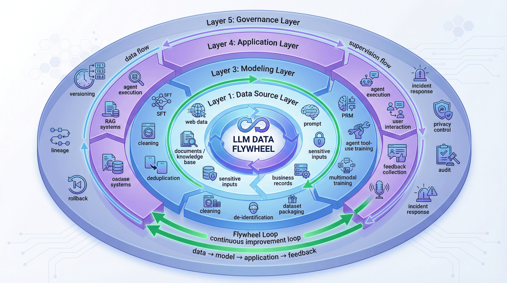
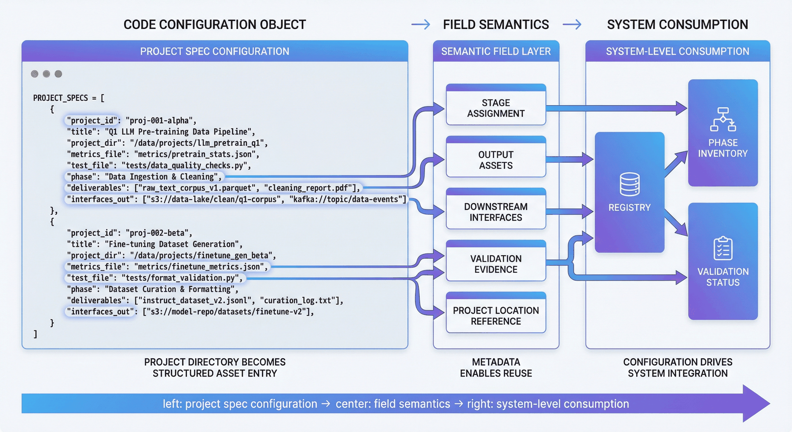
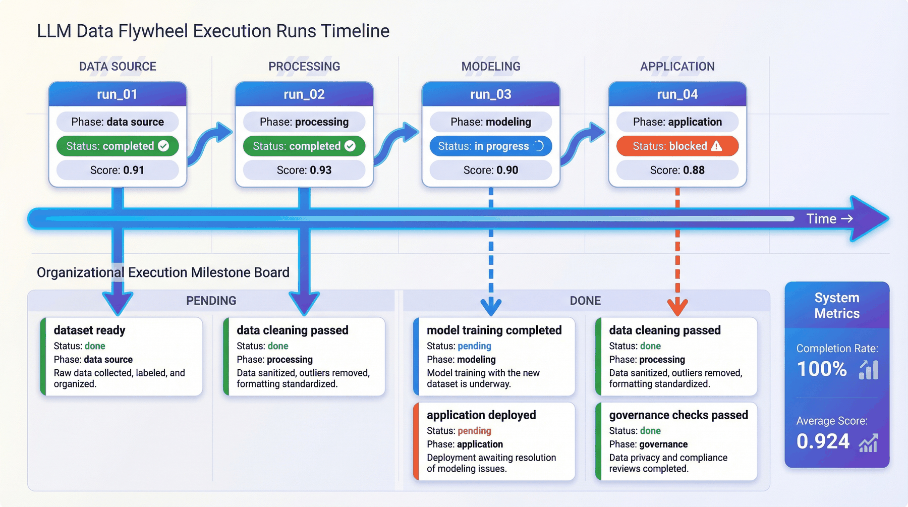
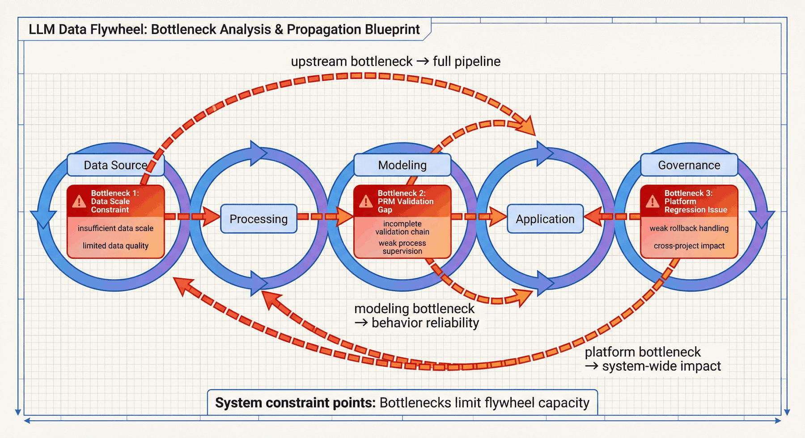
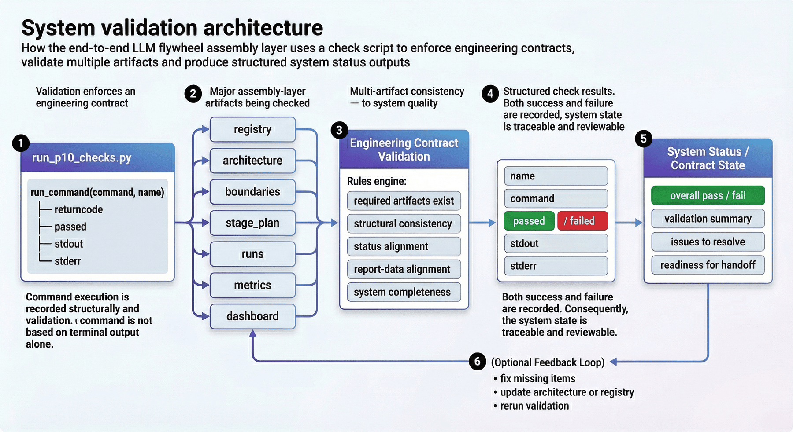

# 项目十：端到端 LLM 数据飞轮

## 本章概览

P10 聚焦把数据、监督、训练、应用、平台治理和反馈回流组织成一条持续运转的端到端 LLM 数据飞轮。章节重点不在新增单点能力，而在把前面九个项目的资产、接口、阶段和控制点整合为统一系统。

本章可以按四条主线理解：

* 资产汇总与阶段规划：把前面九个项目的产物纳入统一 registry 与阶段体系。
* 训练、应用与反馈接口：明确数据进入训练、模型进入应用、应用反馈回流上游的连接方式。
* 控制点与治理边界：把版本控制、回滚、人审、隐私隔离和异常响应写入系统结构。
* 检查验收与组织复用：通过代码、产物和检查脚本验证飞轮能否稳定运行。

如果按工程顺序阅读，本章对应的是一条完整链路：

**资产汇总 -> 阶段规划 -> 训练封装 -> 应用执行 -> 反馈回流 -> 版本治理 -> 隐私与回滚控制 -> 系统检查**

这一结构对应的核心目标，是把离散项目沉淀为一套可复盘、可检查、可扩展的 LLM 工程飞轮。

---

## 1. 项目背景：端到端 LLM 数据飞轮的必要性

通用的大模型工程实践，在单点能力上已经积累了很多成熟方法。例如，团队知道如何做预训练语料清洗，知道如何做 SFT 样本构造，知道如何做偏好对、PRM、RAG、Agent、平台化和隐私治理。但一旦进入真实组织环境，问题往往不在单点组件本身，而在于**这些组件之间没有被组织成一条持续运转的系统链路**。

最常见的断裂有三类。

第一类是**资产断裂**。前一个项目做出来的数据、模板和评估结果，无法被后一个项目直接消费。于是每个项目都像在“重新造轮子”。

第二类是**接口断裂**。明明上游已经有语料、标注结果或评测记录，但下游不知道该读什么文件、该信任什么字段、该继承什么版本信息。结果就是流程能跑一次，却难以稳定重跑。

第三类是**治理断裂**。很多团队愿意谈模型、谈效果、谈产品，但不愿意把版本控制、回滚机制、隐私边界、组织分工和事故响应写进系统设计。这会导致系统一旦放大，就无法稳定运转。

因此，P10 的目标是构建一个**端到端 LLM 数据飞轮总装层**，把前面九个项目的产物、阶段、接口、控制点和治理机制汇总为统一的系统结构。

这一结构面向的是持续迭代的组织级工程场景。随着语料扩展、新任务接入、模型替换、应用上线和反馈回流，真正能够被复用的不是某个单独脚本，而是这套“资产汇总—阶段规划—系统边界—治理控制—验证闭环”的系统方法。

---

## 2. 项目目标与边界

### 2.1 项目目标

本项目聚焦以下四个目标。

**目标一：把前面九个项目整理成一张统一的系统总图。**
即把分散在不同目录、不同报告和不同任务形态中的项目产物，统一纳入一个可追踪的 registry 与阶段体系。

**目标二：建立从数据到应用再到治理的飞轮结构。**
本项目不再只看“数据做得怎么样”或“模型训得怎么样”，而是明确区分 data source、processing、modeling、application、governance 五层，让端到端系统的主干结构清楚可见。

**目标三：把接口、控制点与瓶颈显式化。**
飞轮的价值不在于画一张流程图，而在于指出哪里有控制点、哪里有系统边界、哪里是当前瓶颈、哪里需要组织协同。

**目标四：形成可检查、可复现、可交付的总装产物。**
最终输出不仅包括架构图、阶段规划和 dashboard，还包括检查脚本、测试结果和报告文件，保证代码、产物和统计结果彼此一致。

### 2.2 项目边界

为了让项目保持可复现性，本项目显式设置了若干边界。

#### 1）集成范围边界

当前飞轮聚焦 P01-P09 已有项目产物的离线整合，而不是重新执行所有上游训练流程。这意味着它更适合作为**系统总装图与工程复盘层**，而不是在线实时生产系统本身。

#### 2）时效性边界

本项目强调的是离线流程、结构设计与交付一致性，而不是实时事件驱动的在线闭环。因此，这里展示的是“飞轮框架与方法”，而不是最终工业级在线编排平台。

#### 3）评估边界

P10 更关注跨项目整合程度、阶段完成率、控制点、瓶颈和治理结构，而不是单个模型在某个 benchmark 上的极致分数。

#### 4）组织边界

本项目已经显式纳入组织分工、共享平台收益和治理边界，但仍然属于教学型最小闭环，不应被夸大为完整企业级平台方案。

### 2.3 边界说明的作用

边界说明用于明确系统当前已经打通的范围、仍依赖的离线假设、现阶段能够支撑的结论，以及后续扩展的主要方向：

* 明确已经打通了哪些链路；
* 明确还停留在哪些离线假设；
* 明确当前结果可以支撑什么结论；
* 明确哪些部分还需要未来扩展。

对于总装层项目，这种界定直接决定章节能否作为稳定的方法资产，而不是停留在概念描述层。

---

## 3. 项目定位：P10 在能力体系中的总装层角色

如果把整条 LLM 工程能力链看成一个系统，那么 P10 位于总装层与收束层的位置。它的作用不是补充某一项局部能力，而是把预训练、SFT、多模态、偏好、RAG、PRM、Agent、平台与隐私治理组织成统一系统。

本章关注的是以下几个系统级问题：

* 单点项目如何沉淀为系统能力；
* 资产复用如何替代项目堆叠；
* 阶段规划、接口约束和治理控制如何共同构成可运行框架；
* 总装层如何通过代码、检查和报告保持一致性；
* 跨项目结果如何被收束为可复盘、可扩展的统一方法框架。

---

## 4. 整体架构：从上游项目资产到组织级飞轮总装



从工程视角看，本项目可以拆成五层，而不是只看“数据输入—模型输出”这样一条线性流程。

### 4.1 第一层：数据来源层（data source layer）

这一层解决的是“系统的原料从哪里来”。它不仅包括网页或文档数据，还包括敏感数据输入、知识文档接入和原始业务材料。这一层所对应的不是单一数据集，而是整个飞轮的入口。

### 4.2 第二层：处理层（processing layer）

这一层解决的是“原料如何变成可训练、可消费、可治理的中间资产”。清洗、去重、脱敏、指令合成、课程包装等能力都位于这里。它决定飞轮进入模型层之前，数据是否已经被工程化。

### 4.3 第三层：建模层（modeling layer）

这一层解决的是“监督信号如何被组织成模型能力”。SFT、PRM、Agent tool-use training、多模态训练都属于这一层。它不是单独训练一个模型，而是在组织哪些监督形式真正进入模型参数与行为模板。

### 4.4 第四层：应用层（application layer）

这一层解决的是“模型能力如何进入真实任务执行”。RAG 服务、Agent 执行和反馈回收都位于这里。没有应用层，飞轮只能停留在训练闭环，而无法形成业务反馈。

### 4.5 第五层：治理层（governance layer）

这一层解决的是“系统如何长期可控”。版本管理、谱系追踪、回滚机制、隐私控制、审计和事故响应都位于这里。很多团队把治理写成附录，但在飞轮中，治理本身就是主结构之一。

### 4.6 五层结构的工程作用

因为它把“飞轮”从抽象概念变成了可讨论的工程对象。团队不再只是说“我们有数据、有模型、有应用”，而是能够明确：

* 哪一层承接哪类项目；
* 哪些接口跨层传递；
* 哪些边界必须单独控制；
* 哪些问题不能在单层内部解决。

---

## 5. 上游项目汇总：registry 作为系统入口

飞轮的复用能力首先建立在 registry 之上。registry 负责明确上游项目清单、阶段归属、输出资产和下游接口，把分散项目转化为可追踪、可组合的系统资产。

P10 当前已经把前面九个项目统一纳入汇总体系，形成了项目 registry 与 phase inventory。当前结构包括：

* 已纳入上游项目 `9` 个；
* 已规划阶段 `5` 个；
* 已汇总接口 `17` 个。

这些统计反映的不是数量本身，而是系统已经具备跨项目资产登记、阶段划分和接口暴露能力，为后续复用、阶段规划和治理控制提供统一入口。

### 5.1 registry 不应停留在项目名称

如果 registry 里只有项目名称，那么它依然只是一个目录索引，而不是系统接口层。真正有价值的 registry，至少应该回答：

* 项目属于哪个阶段；
* 产出哪些 deliverables；
* 对下游暴露哪些 interfaces_out；
* 这些结果是否通过测试；
* 是否需要额外人审与治理控制。

### 5.2 registry 作为系统起点

飞轮并不会自动形成。它需要先把零散资产定义为可继承、可追踪、可复用的系统对象。registry 的作用在于：

* 它把离散项目变成了可组合模块；
* 它为阶段规划提供输入；
* 它为后续架构映射和瓶颈识别提供依据；
* 它为组织层复盘提供统一语言。


---

## 6. 代码展开一：汇总上游项目资产

`src/collect_upstream_projects.py` 负责汇总上游项目资产，并将项目信息整理为统一规格。下面的代码片段展示了 registry 的核心结构。

```python
PROJECT_SPECS = [
    {
        "project_id": "p1",
        "title": "Mini-C4 Pretraining Corpus",
        "project_dir": "project_1_mini_c4",
        "metrics_file": "data/reports/p1_metrics.json",
        "test_file": "data/reports/p1_test_results.json",
        "phase": "acquisition",
        "deliverables": ["raw_corpus", "cleaned_corpus", "train_val_split"],
        "interfaces_out": ["foundation_corpus", "training_manifest"],
    },
    {
        "project_id": "p2",
        "title": "Legal SFT Factory",
        "project_dir": "project_2_sft_data",
        "metrics_file": "data/reports/p2_metrics.json",
        "test_file": "data/reports/p2_test_results.json",
        "phase": "alignment",
        "deliverables": ["domain_sft_dataset", "preference_pairs", "risk_refusals"],
        "interfaces_out": ["sft_corpus", "preference_data"],
    },
]
```

这段结构反映了上游资产汇总的几个基本要求：

* 上游项目必须被显式建模；
* 项目元信息必须包含阶段与接口；
* “项目存在”不等于“项目可被下游消费”；
* 飞轮的第一步，是把项目目录变成结构化资产目录。

### 6.1 registry 的结构化汇总方式

这种结构化表达把项目汇总落实为可复制的方法。后续其他总装层项目也可以沿用同样方式，将已有项目逐个纳入统一 registry，而不必依赖手工整理。



---

## 7. 阶段规划：五阶段推进结构

系统闭环通常会被简化为一条线性流程：原始数据 → 清洗 → 训练 → 上线 → 反馈。这样的表达能够说明顺序，但无法说明**各环节属于哪个阶段、由谁负责，以及通过什么里程碑进入下一段**。

P10 的价值之一，就是把飞轮拆成了更清晰的阶段体系。当前结果显示，整条飞轮共包含 `5` 个阶段，并且当前阶段完成率达到 `100.00%`，平均阶段评分为 `0.924`。这些结果说明飞轮并不只是概念设计，而是已经形成了一套可度量的阶段主线。

### 7.1 阶段化与流水线化的区别

因为流水线强调顺序，而阶段化强调：

* 当前目标是什么；
* 阶段输出是什么；
* 进入下一阶段的门槛是什么；
* 哪些资源和团队在这一段承担主责。

### 7.2 阶段规划在总装层中的作用

阶段规划把飞轮从单纯的连通关系扩展为可推进、可复盘、可治理的组织结构。这里真正重要的，是把可迁移的推进方法明确下来，而不是停留在静态示意图层面。


---

## 8. 代码展开二：构建飞轮架构与阶段规划

`src/build_flywheel.py` 负责把前面九个项目映射到飞轮结构中。下面的代码片段展示了五层架构的结构化表达。

```python
def build_architecture(registry: list[dict]) -> dict:
    return {
        "layers": [
            {
                "name": "data_source_layer",
                "responsibilities": ["web/data ingestion", "sensitive data intake", "document intake"],
                "mapped_projects": ["p1", "p5", "p9"],
            },
            {
                "name": "processing_layer",
                "responsibilities": ["cleaning", "dedup", "de-identification", "instruction synthesis", "curriculum packaging"],
                "mapped_projects": ["p1", "p2", "p3", "p4", "p9"],
            },
            {
                "name": "modeling_layer",
                "responsibilities": ["SFT", "PRM", "agent tool-use training", "multimodal training"],
                "mapped_projects": ["p2", "p3", "p4", "p6", "p7"],
            },
        ]
    }
```

这段结构说明，飞轮依赖显式映射来维持一致性。项目与层级被写入数据结构后，报告、检查、dashboard 和治理分析都可以围绕同一套映射展开。

### 8.1 架构需要结构化表达

因为只写在图里的架构，很难验证，也很难维护。一旦项目新增、阶段变更或治理边界调整，如果底层没有结构化表示，所有图和说明都会很快过时。

### 8.2 从代码角度理解飞轮结构

从代码角度看，飞轮不是一个抽象名词，而是一组：

* 层级定义；
* 职责说明；
* 项目映射；
* 阶段产物；
* 运行记录；
* 里程碑与控制点。

这种表达方式，才真正让飞轮具备工程可维护性。


---

## 9. 系统边界与控制点

跨项目、跨阶段、跨团队系统的可控性，取决于边界和控制点是否被显式建模。飞轮一旦进入真实组织环境，决定系统稳定性的往往正是那些**不能被直接穿透的边界**。

P10 当前结果显示，飞轮架构包含 `5` 层、`4` 个控制点和 `4` 条治理边界。这说明项目不仅描述了数据流动路径，也把需要拦截、审查、记录和治理的位置一并纳入系统设计。

### 9.1 什么是控制点

控制点可以理解为飞轮中的“阀门”。在这些位置，系统不能只凭自动流转继续向前，而必须触发额外判断，例如：

* 是否通过质量门槛；
* 是否涉及敏感信息；
* 是否需要人工审核；
* 是否允许进入下游训练或上线。

### 9.2 治理边界需要显式建模

因为很多事故都不是发生在模型推理时，而是发生在数据进入系统之前、跨阶段交接时、上线回滚时或日志审计中。飞轮越完整，越需要边界治理，而不是越可以忽略治理。

### 9.3 控制点的工程作用

控制点的存在说明，飞轮并不追求无差别加速，而是为不同环节配置不同的流转速度、审查要求和可追踪性。


---

## 10. 运行记录与里程碑

系统项目如果只有最终报告，就缺少时间维度。真实工程通常按阶段推进、按节点完成，并通过里程碑逐步收敛。因此，P10 除了总报告，还保留了 flywheel runs 和 milestone board。

### 10.1 运行记录的作用

运行记录让系统具备时间维度，不仅可以看到最终状态，还可以追踪：

* 飞轮经历了哪些阶段；
* 每个阶段的状态和评分如何；
* 哪些里程碑已经完成；
* 哪些地方曾经存在阻塞或风险。

### 10.2 里程碑作为组织层接口

对工程师来说，阶段计划可能已经足够；但对管理者、评审和跨团队协作方来说，milestone 往往是更容易沟通的对象。它把复杂技术过程转换成更可执行的组织节奏。



---

## 11. 指标解读：系统级信号的含义

P10 当前给出的关键结果包括：

* 已纳入上游项目 `9` 个；
* 已规划阶段 `5` 个；
* 已汇总接口 `17` 个；
* 上游检查通过 `103/103`；
* 飞轮架构 `5` 层；
* 控制点 `4` 个；
* 治理边界 `4` 条；
* 阶段完成率 `100.00%`；
* 平均阶段评分 `0.924`；
* 当前主要瓶颈 `3` 项。

这些数字主要反映三个系统层面的结论。

第一，前面九个项目当前已经达到可被纳入总装层的状态。`103/103` 的上游检查通过结果说明，上游项目当前全部处于可集成状态。

第二，飞轮结构已经不只是“有很多项目”，而是形成了分层结构、阶段设计和治理边界，这让它开始具备系统级可讨论性。

第三，P10 已经开始识别系统瓶颈。总装层的价值不在于证明系统已经完美，而在于为下一轮优化提供清晰的优先级。

### 11.1 系统指标与单项模型指标的区别

单项模型指标通常回答“模型效果怎样”；而系统指标回答的是：

* 项目之间能否整合；
* 阶段是否闭环；
* 治理是否完整；
* 哪些地方会限制下一轮扩展。

P10 的独特之处，在于它衡量的不是局部最优，而是一条工程链是否已经具备闭环能力。

---

## 12. 瓶颈分析：飞轮连通后的关键约束

系统链路连通并不等于系统已经成熟。P10 明确列出了当前主要瓶颈，用于说明飞轮的完成度、约束条件和下一阶段投入重点。

当前项目识别出的三个主要瓶颈包括：

* 基础语料规模约束；
* PRM 验证 gap；
* 平台回归处理问题。

### 12.1 基础语料规模约束

飞轮并不是只靠后端监督或应用反馈就能自动变强。上游基础语料的规模与质量，依然决定整个系统的地基是否足够稳。如果基础层过薄，下游很多能力扩展都会受到限制。

### 12.2 PRM 验证 gap

因为推理与过程监督是很多 LLM 系统逐步成熟的重要部分。如果验证链条本身还不够稳定，那么下游模型即使表现不错，也可能缺少足够强的可解释与可审计支撑。

### 12.3 平台回归对飞轮的影响

飞轮一旦形成，就意味着多个项目共享平台和流程。此时任何平台回归，都不再只是局部问题，而会影响多个下游环节。因此，平台治理在飞轮里不是配套项，而是核心稳定器。

### 12.4 把瓶颈纳入主体的必要性

瓶颈分析用于说明三件事：

* 系统当前已经达到的完成度；
* 仍未解决的关键问题；
* 下一轮优化最值得投入的方向。



---

## 13. 成本与共享收益

系统级复用既带来共享收益，也引入额外集成成本。P10 当前估算结果显示，跨项目人工复核工时约为 `8.06` 小时，对应成本约 `850.33` 元。这说明飞轮已经开始把共享成本显式化，而不是默认整合为零成本。

### 13.1 总装层的集成成本

飞轮并不是自动复用机制。上游项目要被整理成可集成状态，通常需要：

* 统一接口；
* 汇总元信息；
* 对齐检查结果；
* 生成新一层报告与 dashboard；
* 在必要时重新做人审与复核。

### 13.2 共享平台收益体现在哪里

从源码逻辑看，P10 不只是计算了人工复核成本，也显式给出了共享平台收益和复用示例，例如语料与 manifest 的多项目复用、推理反馈与工具模板的复用、P8/P9 的集中治理收益等。这种写法把“飞轮能带来什么”从抽象口号变成了具体收益项。

---

## 14. 代码展开三：在评估脚本中生成系统级指标

`src/evaluate_flywheel.py` 负责把散落在多份产物中的结果收束成系统级指标与总报告。下面的代码片段展示了这种计算方式。

```python
total_manual_review_hours = round(sum(item["estimated_manual_review_hours"] for item in registry), 2)
total_manual_review_cost_rmb = round(sum(item["estimated_manual_review_cost_rmb"] for item in registry), 2)
stage_completion_rate = round(sum(item["status"] == "completed" for item in runs) / max(1, len(runs)), 4)
avg_stage_score = round(sum(item["score"] for item in runs) / max(1, len(runs)), 4)

bottlenecks = [
    {"name": "foundation_corpus_scale", "severity": "medium", "reason": "P1 final retention is only 17.37%, limiting base corpus growth."},
    {"name": "prm_validation_gap", "severity": "medium", "reason": "P6 validation pass rate is 0.6759, leaving room for stronger trace verification."},
    {"name": "platform_regression_handling", "severity": "low", "reason": "P8 still observed one regressed run and one failed run, so release gates should stay strict."},
]
```

这段计算逻辑把系统级判断落实为结构化指标与结构化结论。报告中的主要结论由 registry、runs 和其他中间产物共同支撑，而不是来自主观归纳。

### 14.1 系统级指标的计算基础

这里的关键点在于两个维度同时成立：

* 正文需要解释系统级指标的工程意义；
* 这些结论需要由结构化计算过程支撑。

因此，这段代码承担的是从指标生成到结果解读的连接作用。


---

## 15. 验证闭环：一致性检查机制

总装层项目是否成熟，不能只看是否输出了报告，还要看是否建立了一致性验证机制。否则，就会出现说明和图示已经完成，而底层产物并不一致的情况。

P10 当前检查结果为：

* 总检查项：`13`
* 通过检查项：`13`
* 总体状态：`PASS`。

同时，验证覆盖包括：

* 命令级检查项 `2` 个；
* 数据/产物级检查项 `11` 个；
* 命令级覆盖 `py_compile, evaluate_flywheel`；
* 数据级覆盖 `required_files_exist`、`all_upstream_projects_registered`、`phase_inventory_consistent`、`architecture_layers_and_control_points_present`、`stage_plan_covers_end_to_end`、`flywheel_runs_complete` 等关键项目。

### 15.1 系统项目的检查脚本

因为系统项目最容易发生“局部都对、整体不通”的问题。例如：

* 某个 JSON 文件存在，但字段已经和报告不一致；
* 某个阶段计划写得很好，但 milestone 没有同步更新；
* 代码能运行，但总报告仍引用旧数据；
* 项目已经补充了治理边界，但检查项并未覆盖。

### 15.2 PASS 的工程含义

PASS 说明 P10 当前已经具备代码、产物、统计和报告相互对齐的最小闭环。对于总装层项目，这意味着章节并非停留在文档整理，而是建立了重组、验证与再表达的一致性链路。

---

## 16. 代码展开四：将检查机制写成工程契约

P10 的 `src/run_p10_checks.py` 脚本，把总装层的验收规则写成了可执行工程契约。下面的代码片段展示了检查脚本的基础结构。

```python
def run_command(command: list[str], name: str) -> dict:
    result = subprocess.run(command, capture_output=True, text=True)
    return {
        "name": name,
        "command": command,
        "returncode": result.returncode,
        "passed": result.returncode == 0,
        "stdout": result.stdout.strip(),
        "stderr": result.stderr.strip(),
    }
```

这段结构体现了检查机制的几个基本要求：

* 命令执行结果要被结构化记录；
* 检查结果不能只看终端输出；
* 通过与失败都要能进入后续报告；
* 系统状态必须可追踪、可复核。

再往下看，主函数还会读取 registry、architecture、boundaries、stage_plan、runs、metrics 和 dashboard 等多类产物。这说明检查并不是针对单个文件，而是针对总装层一致性的检查。

### 16.1 工程契约在总装层中的位置

这一节说明，P10 并不止于汇总上游项目，还把总装层自身纳入了工程质量管理。对于整章来说，这一部分承担的是把系统整合与质量契约连接起来的作用。



---

## 17. 主要交付物：系统交付清单

对于系统总装项目，交付物清单是判断系统是否完成结构化落地的重要依据。P10 当前已经形成了较完整的交付清单，包括：

* `data/processed/upstream_project_registry.json`
* `data/processed/phase_inventory.json`
* `data/processed/flywheel_architecture.json`
* `data/processed/system_boundaries.json`
* `data/processed/stage_plan.json`
* `data/processed/flywheel_runs.jsonl`
* `data/processed/bottleneck_analysis.json`
* `data/processed/cost_model.json`
* `data/processed/org_operating_model.json`
* `data/console/milestone_board.json`
* `data/console/executive_dashboard.json`
* `data/reports/p10_metrics.json`
* `data/reports/p10_report.md`
* `data/reports/p10_test_results.json`
* `data/reports/p10_test_report.md`。

### 17.1 交付物清单的作用

这组交付物说明总装层已经沉淀为一套可复核的具体资产，并分别服务于不同角色：

* 工程师看 processed 数据；
* 项目经理看 milestone 与 dashboard；
* 评审看 report 与 metrics；
* QA 或平台角色看 test_results 与 test_report。

### 17.2 与普通项目清单的区别

普通项目清单往往只列出“代码、报告、图表”。P10 的清单更接近系统接口目录，说明不同层面的信息已经被拆分、组织并对外暴露。

---

## 18. 组织与协同：总装层的职责接口

前面很多章节更偏向单一能力模块，而 P10 天然要求跨项目、跨阶段、跨角色协同。总装层的稳定性不仅依赖代码实现，也依赖职责接口是否清晰。

### 18.1 总装层涉及的关键职责面

从 P10 的结构看，至少包括以下几类角色：

* 上游项目负责人：保证各自项目产物、指标和测试状态可供总装层消费；
* 数据/训练工程角色：理解各类输入输出接口，保证 processed 资产可被复用；
* 平台角色：负责 dashboard、版本、回滚与运行治理；
* 隐私/治理角色：确保敏感数据、审计与边界控制被显式纳入飞轮；
* 评审或项目管理角色：基于里程碑和阶段计划做跨团队复盘。

### 18.2 协同结构的必要性

很多团队在第一次搭建系统飞轮时，问题并不出在实现能力，而是出在协同结构本身：

* 没有人负责总装层；
* 没有人统一维护 registry；
* 没有人定义跨阶段接口；
* 没有人把治理要求写成工程对象；
* 所有信息都散落在口头沟通里。

因此，飞轮首先是一种组织化工程结构，其次才是一组脚本。

---

## 19. 管理视图：executive dashboard

如果说 processed 目录和检查脚本服务于工程侧，那么 executive dashboard 更偏向组织侧。它的作用在于把复杂的跨项目状态压缩为可快速理解的控制面板。

### 19.1 dashboard 在飞轮中解决什么问题

它解决的是下面这些问题：

* 当前飞轮整体是否健康；
* 哪些阶段已经完成；
* 哪些瓶颈最值得优先处理；
* 是否存在跨项目回归风险；
* 共享平台和治理层是否发挥作用。

### 19.2 dashboard 的系统角色

因为飞轮一旦进入组织级视角，就不可能只靠工程师自己读 JSON 文件来运转。总会有更多角色需要一眼看懂系统状态。dashboard 的价值，就在于为总装层提供统一可视化入口。

---

## 20. 局限与风险

P10 当前已经形成了较完整的系统结构，但它依然有非常明确的局限。

首先，它高度依赖前面九个项目的报告准确性和产物完整性。如果上游项目本身统计有误、字段失真或测试不完整，那么 P10 再完整，也只能在错误输入上进行结构化整合。

其次，当前识别出的瓶颈仍主要集中在基础语料规模、PRM 验证质量和平台回归控制上。这说明飞轮虽然已经形成，但还没有完全进入“高频自增强”状态。

最后，这仍然是一张**离线系统设计图**。它距离真实在线飞轮，还存在监控、实验反馈、在线策略切换、用户行为采集和自动预算控制等工程差距。

### 20.1 局限说明的作用

局限说明的意义，在于帮助界定当前系统的完成度与后续扩展方向：

* 什么已经跑通；
* 什么仍在过渡态；
* 下一阶段最可能补齐哪些环节。

---

## 21. 向在线飞轮扩展：下一阶段的重点

P10 已经给出了几条清晰的后续扩展方向，包括：

* 把更多在线反馈、A/B 实验和成本预算纳入飞轮；
* 继续强化跨团队阶段复盘、治理节奏和接口契约；
* 把 executive dashboard 从静态报告推进到持续更新的控制面板。

### 21.1 在线反馈回流

因为只有当应用层反馈真正回流到数据与训练层，飞轮才会从“静态闭环”进入“动态闭环”。这一步会显著提升系统的现实价值，但也会增加治理复杂度。

### 21.2 A/B 实验与预算控制的预留

因为很多团队等到系统已经很大时才开始补这两块，代价往往更高。把它们提前作为扩展方向写进来，有助于在设计早期就预留这些位置。

---

## 22. 本章在全书中的收束作用

P10 位于全书后段，其作用在于对前面项目进行系统级收束。

前面的项目分别处理：

* 某一类数据的生产方式；
* 某一类监督的构造方法；
* 某一类应用的承接路径；
* 某一类平台与治理机制的落地方式。

而 P10 处理的是这些能力之间的系统级组织关系：

* 各类能力如何被组织成一条可复用的系统链；
* 组织能力如何在单点能力之上形成稳定结构；
* 章节之间如何从并列关系转为前后依赖、相互解释的整体体系。

因此，P10 的作用不在于增加新的局部能力，而在于把前面项目从并列集合组织成结构完整的方法体系。

---

## 23. 主要交付物清单与代码索引

### 23.1 主要文档与报告

* `p10_report.md`
* `p10_metrics.json`
* `p10_test_report.md`
* `p10_test_results.json`

### 23.2 主要处理中间产物

* `upstream_project_registry.json`
* `phase_inventory.json`
* `flywheel_architecture.json`
* `system_boundaries.json`
* `stage_plan.json`
* `flywheel_runs.jsonl`
* `bottleneck_analysis.json`
* `cost_model.json`
* `org_operating_model.json`

### 23.3 主要控制台产物

* `milestone_board.json`
* `executive_dashboard.json`

### 23.4 主要源码索引

* `src/collect_upstream_projects.py`
* `src/build_flywheel.py`
* `src/evaluate_flywheel.py`
* `src/run_p10_checks.py`
* `src/pipeline_utils.py`

### 23.5 交付物与代码索引的用途

这里的目标，是让读者明确：

* 应该去看哪些文件；
* 哪些代码对应哪些章节逻辑；
* 哪些产物可以拿来复核；
* 哪些结构可以复用到自己的项目里。

---

## 24. 结语：持续性比速度更重要

“数据飞轮”通常会让人联想到增长、自动化和不断加速。但从工程角度看，飞轮更核心的价值在于**持续性**。

它体现的是以下几项系统能力：

* 项目成果能够在后续项目中持续保留与复用；
* 数据、模型、应用和治理不再彼此割裂；
* 系统可以在多轮迭代中保留结构、边界和记忆；
* 组织能够从项目堆叠转向能力体系建设。

P10 的价值并不只是总结前面九个项目，而是把它们重新组织为一条可解释、可检查、可扩展的端到端系统链。这也是本章最重要的工程意义。
