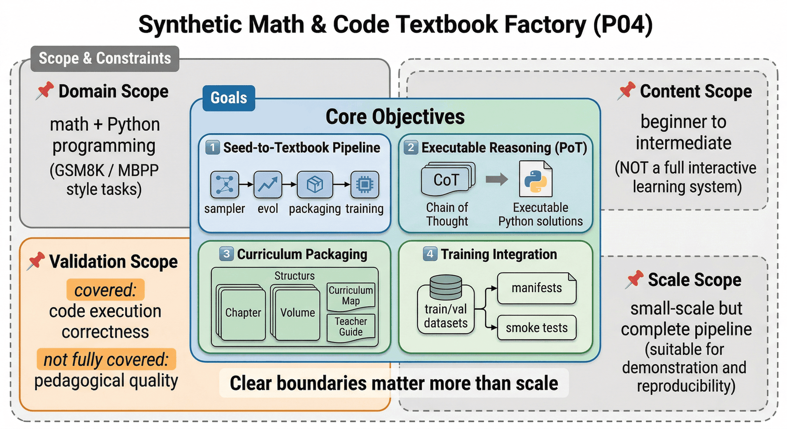
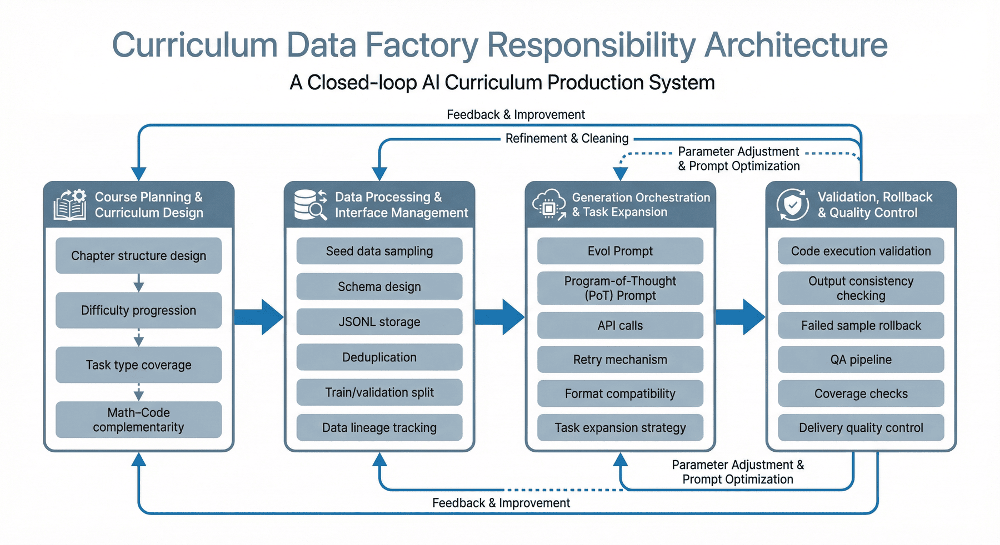
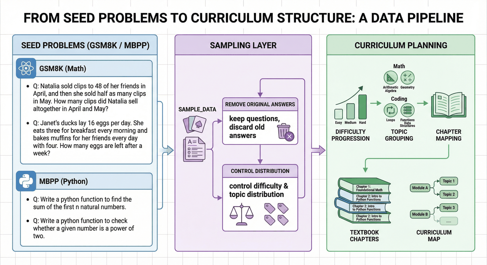
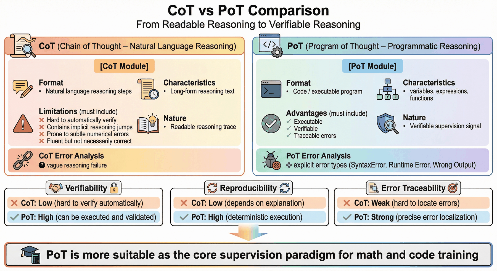
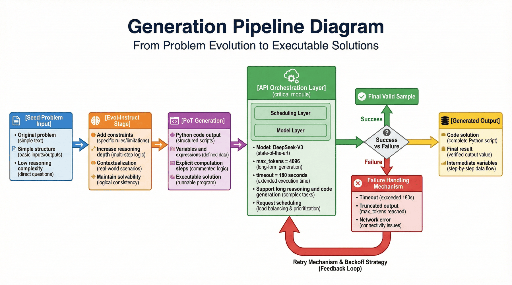
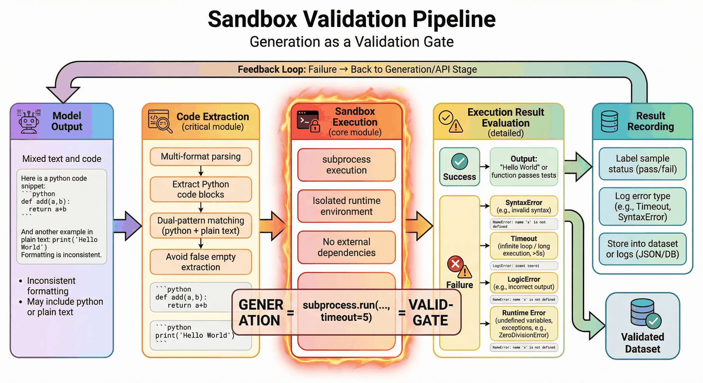
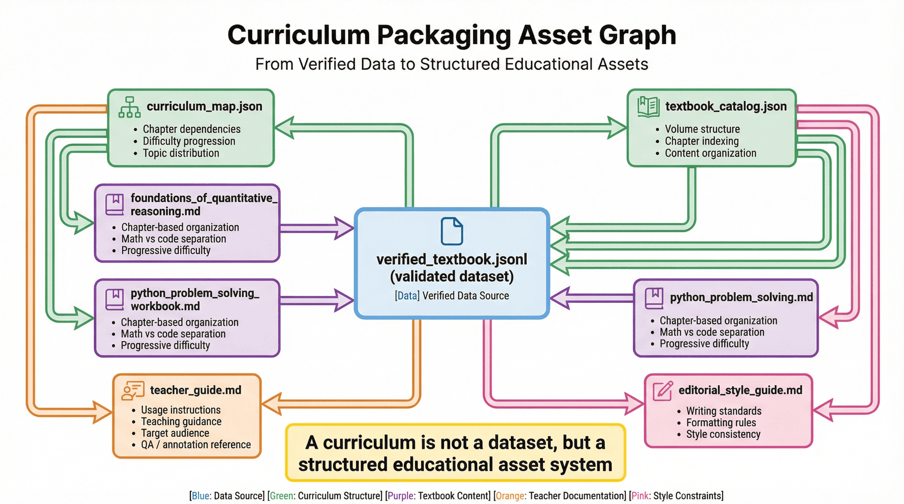
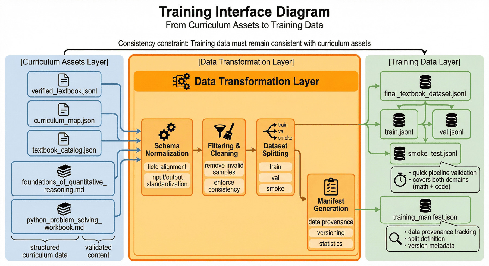

# 项目四：合成数学与代码教材工厂

## 本章概览

P04 聚焦把数学题、代码题和程序化解题过程组织成可训练、可验证、可打包的教材型数据资产。章节重点不在单次题目生成，而在生成、执行验证、教材组织和训练接口之间的工程闭环。

本章可以按四条主线理解：

* 种子任务与课程结构设计：组织数学题、代码题和章节梯度。
* 生成与执行验证：通过 PoT、沙箱执行和检查脚本约束解题过程。
* 教材资产打包：把样本沉淀为卷册、练习、课程地图和配套材料。
* 训练与交付接口：形成可被小模型训练和复现实验直接消费的成品数据。

如果按工程顺序阅读，本章对应的是一条完整链路：

**种子题采样 -> 题目进化 -> 程序化求解 -> 执行验证 -> 质量控制 -> 教材打包 -> 训练封装**

这一结构对应的核心目标，是把 Generate then Verify 方法沉淀为可复用的教材数据工厂。

---

## 1. 项目背景：合成数学与代码教材工厂的必要性


通用大模型已经能够回答很多基础数学问题，也能写出看起来像样的 Python 代码，但一旦我们真的把它们的输出当作训练数据，就会很快碰到三个问题。

第一，**表面正确不等于可验证正确**。
模型很擅长写出“像在认真推理”的答案，但这些推理文本里经常混入隐式跳步、数值替换错误、变量定义不一致，或者前文说 12 后文却按 15 继续算。从表面上看，它们很像正确解法；对于训练系统来说，这类样本会把错误逻辑包装成高质量解释。

第二，**普通 CoT 很难自动校验**。
如果一条样本只有自然语言思考过程，我们很难程序化判断它到底对不对。除非再引入人工审核，否则大规模生产时会迅速出现质量失控。相比之下，如果模型被要求输出可执行代码，我们就可以通过运行结果来判断关键步骤是否成立。

第三，**训练需要的是结构化课程资产，而不是零散样本**。
对于小模型（SLM）来说，训练材料如果只是一堆互不关联的题目，效果通常不稳定。更合理的方式是把它们整理成教材卷册、章节练习、课程地图和教师指南，让数据本身具有“教学顺序”和“难度梯度”。

因此，P04 的目标不是简单“合成几百条数学题”，而是搭建一个**带执行验证的教材数据工厂**：

> 从 GSM8K 和 MBPP 风格种子题出发，把数学问题和代码问题改写成更完整的课程化样本，并通过程序执行和检查脚本，把可训练的教材资产稳定沉淀出来。

从方法论上说，这条流水线的重要性甚至超过具体题目本身。因为未来团队要扩展到物理、统计、金融建模、算法题或 STEM 多学科教材时，真正可复用的不是某一个 prompt，而是这套“种子采样—进化生成—程序验证—教材打包—训练封装”的工程方法。

---

## 2. 项目目标与边界




### 2.1 项目目标

本项目聚焦以下四个目标。

**目标一：建立从题目种子到教材章节的转化链路。**  
项目从数学与代码种子题出发，不直接生成单条 SFT 样本，而是先形成章节草稿与教材结构，再产出可用于训练的最终记录。其核心流程包括 `src/sampler.py`、`src/evol.py`、`src/sandbox.py`、`src/package_textbook.py` 与 `src/prepare_training_data.py` 等模块。

**目标二：让“推理过程”从不可验证文本转成可执行程序。**  
项目强调 PoT（Program of Thought）格式，不满足于“模型看起来解释得很完整”，而是要求模型在关键题型上给出 Python 解法，并在沙箱里执行，减少思维链幻觉。

**目标三：把章节资产做成可课程化交付物。**  
最终交付不是一个孤立的 JSONL，而是教材卷册、课程地图、教师指南和训练 manifest 等成套产物。项目最终形成两本教材卷册，并配套 curriculum volume 与 teacher guide。

**目标四：形成训练侧可直接消费的数据资产。**  
项目输出 `train.jsonl`、`val.jsonl`、`smoke_test.jsonl` 与 `training_manifest.json` 等训练接口层文件，让教材数据不止能“展示”，还能“进入训练”。

### 2.2 项目边界

为了让本章保持可复现性，P04 也明确设置了边界。

#### 1）学科边界

当前项目只覆盖两个方向：**数学**与 **Python 代码问题求解**。种子来源集中在 GSM8K 与 MBPP 风格任务，意味着它更适合作为推理型教材工厂的原型，而不是一个全学科教育平台。

#### 2）内容边界

当前内容覆盖以**入门到进阶**阶段为主，强调概念、例题、练习和验证片段，而不是完整的视频课程、交互习题系统或多模态教学平台。

#### 3）验证边界

当前验证重点仍是**代码执行正确性**与部分检查脚本一致性。它已经能很好地过滤语法错误、变量幻觉和明显逻辑问题，但还没有完全扩展到“教学解释是否最佳”“章节排序是否最优”“学生认知负担是否合适”这类更高阶教学质量维度。

#### 4）规模边界

项目规模较小，但流程完整。它的价值不在于样本量特别大，而在于把从生成到交付的工程链条跑通。因此更适合作为实践案例和小规模验证方案。

### 2.3 边界设定的作用

因为教材工厂很容易被描述成“会生成题、会写代码、会自动出书”的万能系统。但真正可信、可复用的工程案例，应该说明：

* 在什么学科范围内工作稳定；
* 哪些验证已经做了，哪些还没覆盖；
* 目前适合做方法演示，还是已经适合生产部署；
* 数据资产能不能直接进入训练或只适合展示。

把这些边界写清楚，比夸大规模更有价值。

---

## 3. 项目定位：P04 的能力链位置

如果把整体大模型数据工程看成一条能力链，P04 解决的是其中非常关键的一段：

> **如何把“推理能力训练”从普通文本合成，升级为“可执行、可验证、可课程化”的数据生产能力。**

前面的章节可能已经讨论过预训练清洗、行业 SFT、偏好数据和 QA 体系等方法；而本章强调的是另一类常被低估的数据资产：**教材式推理数据**。

这类数据和普通问答数据不同，原因在于它同时承担三种任务：

* 它要给模型提供题目和答案；
* 它要给模型暴露一种可模仿的求解过程；
* 它还要在样本层面体现知识组织结构与难度顺序。

也就是说，本章最重要的不是说明“如何多生成几条数学题”，而是展示：

* 为什么数学推理训练需要程序化验证；
* 为什么教材内容要有卷册与课程地图，而不是散点问答；
* 为什么质量控制要前置到数据生产，而不是训练后再补救；
* 如何把生成、验证、教材打包和训练封装真正设计成一条持续生产能力。

从这个意义上说，P04 不只是一个“推理数据小项目”，更像一个**教育内容工厂的最小可复现原型**。

---

## 4. 整体架构：从种子题到教材卷册的推理数据流水线


从工程视角看，P04 可以拆成三层。

### 4.1 第一层：种子与章节规划层

这一层解决的是“我们要教什么”。核心动作包括：

* 从 GSM8K、MBPP 风格题目中抽取种子；
* 形成题型分布与难度分布；
* 将离散问题映射到章节计划与课程地图；
* 保留题目来源，便于后续追踪。

这一层不是简单随机采样，而是在为后续教材组织做准备。因为如果上游种子分布失衡，后面再怎么包装，整本教材都会偏科。

### 4.2 第二层：进化生成与 PoT 构造层

这一层解决的是“如何把题目变成更有训练价值的教材内容”。主要包括：

* 对原始题目做 Evol-Instruct 式改写；
* 引入场景化、约束条件和多步推理；
* 让模型输出 Python 代码而不是只给自然语言思考过程；
* 将求解结果整理成统一 schema。

这一层决定了数据最终学到的是“题目表层模式”，还是“程序化推理能力”。

### 4.3 第三层：验证、打包与交付层

这一层解决的是“这些内容能不能放心进入训练”。主要包括：

* 从模型输出中提取代码块；
* 用沙箱执行并捕获报错、超时和返回值；
* 清洗低质量样本并记录失败原因；
* 打包成教材卷册、课程地图、教师指南与训练文件；
* 通过检查脚本确认产物一致性。

到这一步，项目才真正从“会生成题”升级成“会生产教材资产”的工程系统。当前项目共通过 10 项检查，其中命令级 2 项、数据/产物级 8 项，总体状态为 `PASS`。

---

## 5. 工程前置：教材工厂的关键面




教材工厂如果要稳定运转，更重要的不是强调单点生成动作，而是先把**哪些职责面必须被覆盖**界定清楚。至少有以下四类职责面需要显式存在。

### 5.1 课程规划与章节设计

这一层负责定义教材卷册、章节顺序、题型覆盖和难度梯度。它需要回答的是：

* 什么题适合作为基础铺垫；
* 什么题更能体现进阶推理；
* 数学与代码内容如何形成互补而不是重复。

### 5.2 数据处理与接口维护

这一层负责种子采样、schema 设计、JSONL 落盘、去重与训练切分。它关注的是：

* 每条样本来自哪里；
* 字段是否统一；
* 训练/验证集是否泄漏；
* 中间产物是否可追踪。

### 5.3 生成编排与任务扩展

这一层负责 Evol prompt、PoT prompt、API 调用、失败重试和格式兼容。它连接“题目种子”和“教材章节草稿”，决定项目最终形成的是零散题目集合，还是具备课程组织能力的教材资产。

### 5.4 验证、回退与质量控制

这一层负责检查代码是否能跑、结果是否一致、失败样本是否需要返工，以及检查脚本是否覆盖关键交付物。它之所以重要，是因为教材场景里“看起来很像对”远远不够，必须把程序执行与质量回退一并纳入流程。

### 5.5 关键职责面的作用

很多团队卡住的地方，不是不会用模型，而是关键控制点没有被拆出来，最终导致：

* 生成逻辑在变化，但课程结构没人维护；
* 样本很多，但没有失败原因统计；
* 书已经打包了，但训练集字段并不统一；
* 指标看起来不错，但没人知道问题从哪一层产生。

把这些职责面写清楚，本质上是在说明：**教材数据工厂是一条带验证与交付闭环的生产线，而不是一个生成脚本。**

---

## 6. 种子层：题目种子的必要性




合成教材最常见的误区，是直接要求大模型“请帮我生成一本数学教材”。这种方式虽然快速，但通常有三个问题。

第一，题目分布不可控。模型会在自己熟悉的模式上过度生成，导致大量题目看似不同，实则同构。

第二，难度梯度不稳定。没有种子锚点时，模型很难持续保持“从基础到进阶”的顺序。

第三，来源不可追踪。后面一旦发现某类题总是出错，很难回溯问题来自哪些上游模式。

因此，本项目从种子题出发，在 `sample_data()` 中先对数据做采样，只保留问题本身作为后续进化的起点。当前流程明确提到从题目池中抽样并形成章节计划，再生成教材章节草稿。

### 6.1 为什么要保留问题、丢弃旧答案

现有实现里，项目保留 `seed_question`，并把原始答案单独留作参考，而不是直接把它作为最终标签。这一点很关键。

因为经过 Evol-Instruct 改写后，题目的背景、约束条件甚至数值关系都可能变化。如果直接继承原答案，就会把旧标签错误地带入新题。现有章节原稿也明确强调：

> 进化后的问题数值可能会发生变化，旧答案不再适用。

这说明项目从一开始就把“种子题”和“最终监督真值”区分开了，而不是把改写题简单视作原题的表述变体。

### 6.2 种子层要控制什么

一个教材工厂的种子层至少要控制四件事：

* **领域覆盖**：数学和代码两条线都要有；
* **难度层次**：不能全是基础题或全是高难题；
* **主题分布**：要覆盖 arithmetic、function design、lists、string algorithms 等不同主题；
* **可进化性**：题目适合被扩展成更复杂情境。

从当前结果看，项目已经形成 `math=30`、`code=18` 的两条教材线，并覆盖多类主题。

---

## 7. Evol-Instruct：题目进化机制


如果只是把“火车行驶 240 英里需要多久”改写成另一句表述，训练价值并不会显著提升。项目真正需要的是让题目从“单步计算”进化成“多约束、多变量、可程序化求解”的问题。

### 7.1 从简单题到复杂应用题

在现有实现中，进化 prompt 明确要求模型做四件事：

1. 增加约束条件；
2. 增加推理深度；
3. 进行场景化改写；
4. 保持可解性。

这几个要求看起来简单，但其实很贴合教材生成的核心目标。因为真正高质量的练习，不是把数字写得更大，而是让题目背后的关系链条更长、更像真实世界约束。

### 7.2 为什么“场景化”重要

数学训练中，很多原始题目都非常抽象，容易让模型记住形式模板而不理解关系。把问题放进商业、物流、库存、实验、预算或行程场景里，有两个好处：

* 可以自然引入更多变量和边界条件；
* 让后续 PoT 更像“求解真实问题”而不是“套公式”。

这也是为什么项目在示例中会把简单苹果题改成水果店库存与损耗问题，把速度距离题改成列车停靠计划题。当前样例已经体现了这种改写方向。

### 7.3 为什么“增加难度”还要强调“保持可解性”

很多生成系统一旦追求难度，就会走向两个极端：

* 把题目写得很绕，但其实信息不足；
* 把题目加了太多条件，最后变成不一致或无唯一解。

教材数据不能容忍这种失控。因为教学内容和开放写作不同，它必须可解、可验证、可复现。也正因此，进化只是前半步，后面还必须接程序执行验证。

---

## 8. PoT 选择：程序化推理路径




### 8.1 CoT 的价值与局限

CoT（Chain of Thought）对于推理训练当然有价值，它可以让模型更显式地展示中间思路。但 CoT 的最大问题也非常明显：

* 它很长，但不一定真；
* 它看起来通顺，却不容易自动校验；
* 它很容易夹带隐式跳步和细小数值错误。

这意味着，纯 CoT 更像是“可阅读的推理痕迹”，却未必是“可验证的监督信号”。

### 8.2 PoT 的工程优势

PoT（Program of Thought）把一部分推理转成代码，这样带来三个直接好处：

**第一，可执行。**  
样本不是只写“先算 A，再算 B”，而是真正把 A、B、C 写成变量和表达式。

**第二，可验证。**  
代码能跑通，说明至少求解过程的结构是自洽的；结果正确，则进一步提升了监督可信度。

**第三，可追踪错误。**  
如果失败，我们能知道是 `SyntaxError`、`Timeout`、变量未定义，还是执行结果错误，而不是只知道“这段解释感觉不太对”。

### 8.3 为什么 PoT 特别适合数学/代码教材

因为这类教材本身就希望模型学到：

* 如何把题目转换成变量；
* 如何把关系翻译成程序；
* 如何从程序结果回到自然语言结论。

从训练角度看，这比单纯记住某道题的答案更有泛化价值。项目把这件事做成了数据工厂的中心环节，而不是附属功能。

---

## 9. 生成链路：从 prompt 到代码解法的具体实现




本项目的生成链路可以理解为两步。

### 9.1 第一步：题目进化

系统先把种子题改造成更复杂的问题。现有 prompt 要求模型扮演“数学竞赛命题专家”，并增加约束条件、推理深度和现实场景。这一步的目的是先让题目本身更有训练价值。

### 9.2 第二步：PoT 生成

在题目进化之后，系统再要求模型输出程序化解法。也就是说，模型不能只说“应该这样算”，而要真正给出 Python 代码。

这一步的价值在于把“看似会做”转成“真的能跑”。如果代码不能通过验证，那么前面的解释再漂亮也不能进入最终数据集。

### 9.3 API 编排中的工程细节

项目当前使用 DeepSeek-V3 作为生成引擎。由于代码生成和长推理输出会显著拉长请求时间，因此在 `call_siliconflow` 中把 `max_tokens` 提高到 4096，并把 timeout 显式拉长到 180 秒。这样选择的原因，在于它在代码生成和数学推理上的性价比更适合当前流程。

这类设置在小规模运行阶段看起来像细枝末节，但实际上是生成链路稳定性的关键。因为如果超时策略过短，系统会把大量“快生成完的长样本”误判为失败；如果 token 上限太低，代码又容易在一半被截断。

### 9.4 失败重试为什么重要

生成系统不可避免会遇到网络抖动、响应不完整或偶发 API 错误。项目在调用层加入多次重试和退避逻辑，能明显提升整体可用率。这说明项目已经从“单次试验脚本”升级为“可连续跑批的工程脚本”。

---

## 10. 沙箱验证：生成即验证的核心门槛




在 P04 里，沙箱不是附属组件，而是决定数据是否可信的**生死线**。

### 10.1 不验证会发生什么

如果没有执行验证，模型生成的代码很容易出现：

* 代码块不完整；
* 语法错误；
* 变量名前后不一致；
* 逻辑结构自相矛盾；
* 依赖不存在；
* 暴力穷举导致运行时间失控。

这些问题并不总会在肉眼浏览时立刻暴露。很多代码甚至非常像“优秀答案”。也正因此，靠人工目测筛查并不现实。

### 10.2 为什么先做代码提取

模型输出往往不规整。有时用 ```python 包裹，有时只是普通 ```。如果提取逻辑不做兼容，系统会把大量本来可用的代码误判成空输出。原始章节已经明确给出 `extract_python_code()` 的两级匹配逻辑，这就是典型的工程细节：不华丽，但非常关键。

### 10.3 为什么必须设置执行超时

在执行模型生成代码时，最大的风险不是单纯的报错，而是**卡死**。例如死循环、指数级枚举、递归失控，都会让整个流水线停住。因此项目用 `subprocess.run(..., timeout=5)` 控制执行时长，5 秒内跑不完就直接终止。

这一步做对了，才能把失败样本清晰归因成：

* `SyntaxError`
* `Timeout`
* `LogicError`
* 变量未定义或运行时异常

当前示例显示，约 18% 的失败主要来自语法错误、超时和逻辑幻觉。虽然这一数字来自小规模跑测，但它已经足以说明验证环节不可省略。更重要的是，项目最终通过 10 项检查并得到 `PASS`，说明验证与产物层之间目前是一致的。

### 10.4 为什么这一步决定了“教材”与“幻觉文本”的分界线

教材数据最怕的是：内容看上去像老师讲义，但实际上答案站不住脚。沙箱执行让项目能够在样本进入教材卷册之前，就先排除掉一批不可信内容。

> 没有验证的教材，更像包装精美的文本；有验证的教材，才更接近可训练资产。

---

## 11. 教材打包：课程化资产组织




即便已经有了 `verified_textbook.jsonl`，项目也不应该在这里停止。因为训练和教学都需要更丰富的组织层。

### 11.1 教材不是样本堆

如果把所有验证通过的题目直接扔进训练集，当然能训练，但这不等于教材。教材还需要回答这些问题：

* 哪些题先学，哪些题后学；
* 数学和代码内容如何分卷；
* 难度如何渐进；
* 哪些题适合做 smoke 测试；
* 教师或评审如何快速理解整套材料。

### 11.2 当前项目已经有哪些教材交付物

当前项目除了输出验证后的章节数据，还包括：

* `curriculum_map.json`
* `textbook_catalog.json`
* `editorial_style_guide.md`
* 两本教材卷册：`foundations_of_quantitative_reasoning.md` 与 `python_problem_solving_workbook.md`
* `teacher_guide.md`

这说明项目已经从“单一数据文件”上升到了“课程资产集合”。

### 11.3 为什么课程地图重要

课程地图的存在，让训练数据不再只是扁平记录，而是具有章节依赖、主题分布与难度梯度。这对后续至少有三个价值：

* 帮助评审快速理解覆盖面；
* 帮助训练前做数据抽样与分层切分；
* 帮助未来扩充新卷册时保持结构一致。

### 11.4 教师指南为什么不是“锦上添花”

很多工程项目一谈教师指南就觉得像教学包装。但在教材型数据工厂里，教师指南其实有很强的工程意义：它是面向评审、标注、人工 QA 和训练运营人员的解释层。它能说明每本卷册教什么、如何使用、覆盖什么学习阶段，也能作为版本更新时的沟通接口。

---

## 12. 训练封装：教材数据进入训练系统




项目最终目标之一，是把教材资产转成训练侧能直接消费的数据格式。

### 12.1 训练侧需要什么

训练系统并不关心这条数据最早来自哪道题，它更关心：

* 样本 schema 是否统一；
* train / val / smoke 是否切分好；
* manifest 中是否记录了必要元信息；
* 训练数据与教材产物是否一致。

### 12.2 当前项目的训练资产

当前训练侧的完整交付物包括：

* `final_textbook_dataset.jsonl`
* `train.jsonl`
* `val.jsonl`
* `smoke_test.jsonl`
* `training_manifest.json`

这意味着项目没有把“做成教材”和“进入训练”割裂开，而是把两者打通了。

### 12.3 为什么 smoke test 必须单列

在训练工程里，smoke test 的价值并不在于评估最终效果，而在于快速检查：

* 基础 schema 是否正确；
* 训练脚本是否能读数据；
* 两个学科域是否都被覆盖；
* 某次版本改动是否破坏了基本样本质量。

当前检查项中也明确提到 `smoke_covers_both_domains`，这说明项目已经把 smoke 集合视为工程检查的一部分，而不是可有可无的附属文件。

---

## 13. 指标与结果：当前项目的结构性信号

对于教材工厂来说，最容易被误解的指标是“产出了多少章节”“生成了多少文本页数”。这些数字当然有展示价值，但真正更重要的是**验证后的结构质量**。

### 13.1 当前关键指标

当前关键结果包括：

* 种子数 `48`
* 合成章节 `48`
* 验证通过章节 `48`
* 通过率 `100.00%`
* 学科分布 `math=30`、`code=18`
* 总 token 估算 `11039`
* 最终教材卷册 `2` 本

这些指标共同说明，项目已经具备一个小而完整的教材数据闭环。

### 13.2 为什么“100% 通过率”要谨慎解读

100% 看起来非常漂亮，但也要同时看到：这很大程度依赖于当前范围较小、模板约束较强。

也就是说，这个指标表达的不是“此类问题已经被彻底解决”，而是：

* 在当前规模下，验证链路是稳定的；
* 章节、训练文件和报告之间是一致的；
* 工厂雏形已经跑通。

这是一种工程可信度，而不是无限外推的通用结论。

### 13.3 主题分布说明了什么

项目覆盖 arithmetic word problems、function design、lists and iteration、string algorithms 等多类主题，说明教材内容并不是单一题型的重写，而是横跨数学与编程不同结构。

### 13.4 难度分布说明了什么

当前结果显示 `advanced=35` 明显最多，说明当前工厂更偏中高难度练习材料。

这带来两个启发：

* 一方面，它适合展示“推理增强”的价值；
* 另一方面，也意味着未来若面向更广泛学习者，基础题和过渡题还需要补足。

---

## 14. 工程效果：P04 解决的核心问题

如果用一句话概括，P04 实际解决的是：

> **把高风险的“推理型合成数据”从不可靠文本，变成了有执行验证支撑的结构化教材资产。**

具体来说，它至少解决了四类工程问题。

### 14.1 解决了“思维链可信度不足”的问题

通过 PoT 和执行验证，项目不再完全依赖模型自然语言解释，而是把中间过程转换成程序与输出结果，从而显著提高监督信号的可核验性。

### 14.2 解决了“教材内容难组织”的问题

通过课程地图、卷册和教师指南，项目让教材不再只是题目合集，而是有顺序、有结构、有主题分布的交付物。

### 14.3 解决了“训练接入断层”的问题

项目不只做了中间产物，还输出 train / val / smoke / manifest，使训练侧可以直接对接。

### 14.4 解决了“项目可验收性”的问题

当前共有 10 项检查全部通过，这意味着项目代码、产物与报告之间已经能形成较强的一致性证据链。

---

## 15. 成本与优化：规模扩展前的瓶颈


### 15.1 当前成本特征

当前运行结果显示，生成一条复杂样本（Evol + Code）大约需要 30–60 秒，API 成本较低，1000 条高质量验证数据的成本不到 1 美元。这说明在当前范围内，生成成本并不是最主要瓶颈。

### 15.2 真正的瓶颈在哪里

真正的瓶颈通常来自三处：

* 生成耗时长，吞吐不足；
* 执行验证串行化，整体跑批速度慢；
* 失败样本返工和重试会拉长总链路。

### 15.3 可以怎么扩展

结合当前实现，后续可以优先沿以下方向扩展：

1. **并发生成**：把单线程循环改为线程池、异步请求或任务队列；
2. **任务分发**：用 `Celery + RabbitMQ` 或更轻量的 worker 分发生成任务；
3. **验证并行**：让沙箱执行与生成脱钩，做成可并发的验证队列；
4. **更细粒度检查**：从“代码能跑”扩展到“解释是否清晰”“难度是否匹配”等多维质量控制；
5. **课程资产扩充**：增加更细的难度梯度、课程推荐路径和更多教师侧材料。

### 15.4 为什么这里的优化重点不是“再便宜一点”

因为项目当前 API 成本已经很低。更值得投入的，其实是：

* 吞吐量；
* 安全隔离；
* 更细的质量控制；
* 更丰富的课程结构。

也就是说，这个项目下一阶段的主要挑战是**工程成熟度**，而不是单纯的 token 成本。

---

## 16. 关键交付物：当前产物清单


判断 P04 是否已经形成工程闭环，最直接的方式之一就是查看交付物链条。当前项目已经形成完整产物链，包括：

* 种子与中间处理文件：`seed_pool.jsonl`、`chapter_plan.json`、`synthetic_textbook_chapters.jsonl`
* 验证与质量文件：`verified_textbook.jsonl`、`verification_failures.jsonl`、`execution_results.jsonl`、`quality_audit.jsonl`
* 课程组织文件：`curriculum_map.json`、`textbook_catalog.json`、`editorial_style_guide.md`
* 教材文件：两本卷册与教师指南
* 训练文件：`final_textbook_dataset.jsonl`、`train.jsonl`、`val.jsonl`、`smoke_test.jsonl`、`training_manifest.json`
* 报告文件：`p4_report.md`、`p4_metrics.json`、`p4_test_results.json`、`p4_test_report.md`

这组交付物说明项目已经具备三种能力：

* 能生产内容；
* 能验证内容；
* 能把内容整理成训练和评审都可消费的资产。

---

## 17. 本章小结：P04 的方法价值

P04 的价值，不在于它生成了多少“看起来厉害”的推理文本，而在于它把一类高风险、高幻觉的数据生产任务，做成了一条可复现、可验证、可交付的工程流水线。

如果把它放到更大的方法论框架里，它至少回答了三个重要问题：

第一，**推理数据为什么不能只看文本表面质量。**  
没有验证的思维链，很容易只是更有说服力的幻觉。

第二，**为什么教材数据需要课程结构。**  
训练材料不是样本堆，教材卷册、课程地图和教师指南会直接影响后续使用方式。

第三，**为什么小规模项目也能体现完整工程闭环。**  
即使当前只有 48 条种子、48 个章节和 2 本卷册，只要采样、生成、验证、打包、训练和检查全部打通，它就已经形成了一套完整的工程闭环。

从工程方法的角度看，这个案例最值得复用的，不是某个局部生成技巧，而是它背后的工作方式：

> 先把推理变成程序，再把程序变成可验证的教材资产，最后把教材资产接入训练系统。

这正是很多团队在做“推理增强”时最容易缺失、却又最关键的一步。

