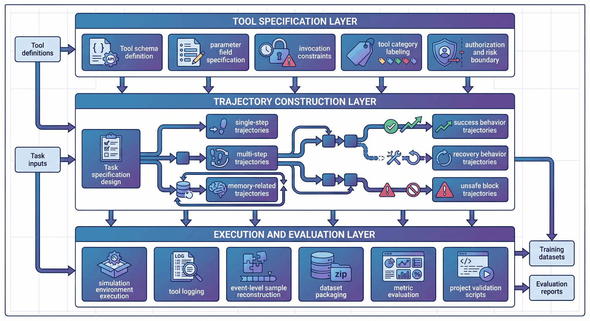
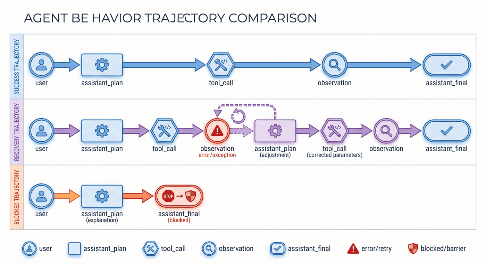
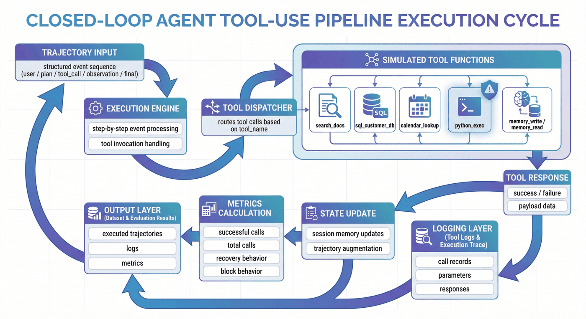
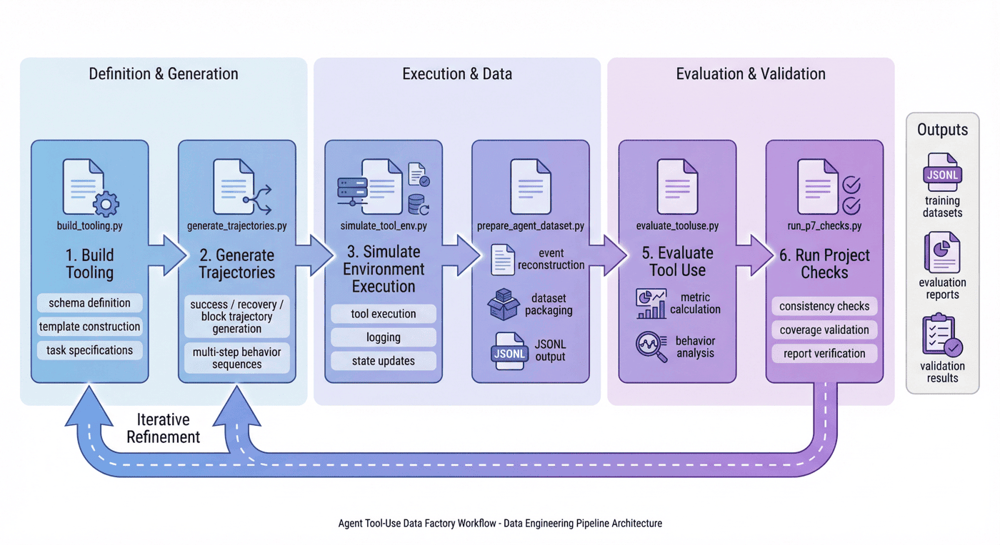
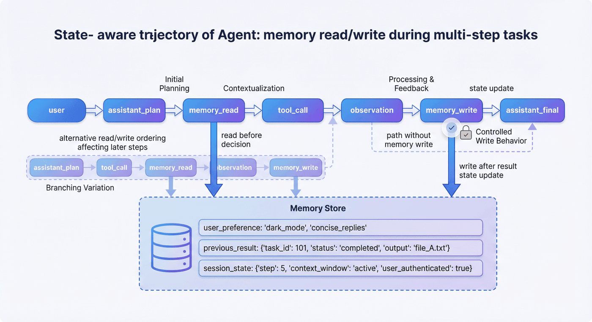
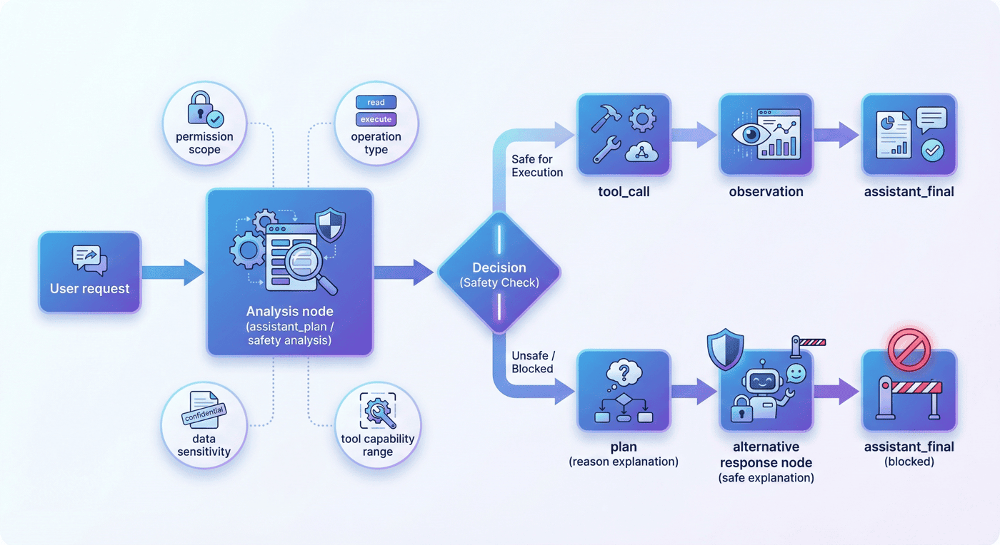
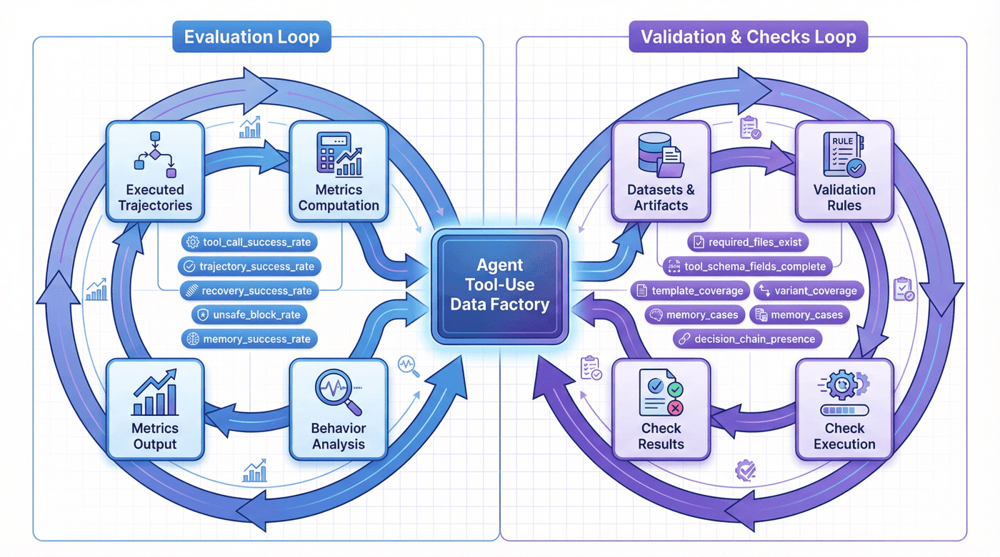

# 项目七：Agent Tool-Use 数据工厂

## 本章概览

P07 聚焦把 Agent 的工具使用行为组织成可训练、可评估、可扩展的数据资产。章节重点不在单个函数调用，而在工具规范、执行轨迹、恢复行为、安全边界和训练封装之间的完整数据链。

本章可以按四条主线理解：

* 工具规范与任务设计：明确 schema、调用条件和任务结构。
* 执行轨迹与恢复建模：保留 success、failure、recovery 等不同类型行为链。
* 安全边界与记忆机制：把 unsafe block、权限限制和记忆读写纳入监督对象。
* 数据封装与评估验收：形成可训练样本、验证指标和检查机制。

如果按工程顺序阅读，本章对应的是一条完整链路：

**工具 schema -> 任务设计 -> 轨迹生成 -> 模拟执行 -> 恢复建模 -> 安全阻断 -> 数据封装 -> 评估验收**

这一结构对应的核心目标，是构建一条能够覆盖执行、恢复和安全控制的 Agent Tool-Use 数据流水线。

---

## 1. 项目背景：Agent Tool-Use 数据工厂的必要性

通用大模型在开放域问答、摘要和写作等任务中已经展现出很强的语言能力，但一旦进入 Agent 场景，仅靠语言能力就明显不够了。

最常见的问题有三类。

第一类是**动作失真**。模型知道应该“去查一下”，但不知道该调用哪一个工具，或者明明应该查数据库却跑去搜索，明明应该先读记忆却直接回答。

第二类是**执行失真**。模型虽然选对了工具，却填错了参数，或者没看懂工具 schema，或者拿到返回结果后不会继续往下推理。这说明会说“我要调用工具”，并不等于真的会执行工具链。

第三类是**边界失真**。当用户请求涉及危险操作、越权访问或不该持久化的记忆时，模型可能仍然机械地执行。一个没有安全阻断与边界建模的 Agent，在真实场景里是非常危险的。

因此，P07 的目标不是简单收集一些函数调用示例，而是搭建一个**Agent Tool-Use 数据工厂**，把工具定义、任务轨迹、恢复行为、记忆读写和安全阻断组织成一条可复用的数据生产线。

这条生产线服务的不是一次性实验，而是一种方法论：

> 当团队未来需要从简单单工具问答迁移到复杂多工具 Agent、企业 Copilot、工作流助手和具身任务代理时，真正可以复用的不是某个函数调用 prompt，而是这套“从工具规范到监督轨迹”的工程方法。


---

## 2. 项目目标与边界

### 2.1 项目目标

本项目聚焦以下四个目标。

**目标一：建立从工具规范到监督轨迹的转化链路。**
即把工具 schema、任务模板和执行环境，转成适合训练的结构化 Agent 数据。

**目标二：建立覆盖 success、recovery、block 的轨迹体系。**
本项目不把所有样本都统一做成“成功调用案例”，而是明确保留成功轨迹、失败恢复轨迹和安全阻断轨迹，让模型学到更完整的行为分布。

**目标三：建立 memory 与安全边界的辅助监督层。**
Agent 不只是工具调用器，它还涉及多轮上下文和持久状态管理。因此项目把 memory 读写与 unsafe block 作为独立而重要的训练信号建设。

**目标四：形成训练侧可直接消费的数据资产。**
最终输出不仅包括中间执行日志，还包括 `agent_tooluse_dataset.jsonl`、`train.jsonl`、`val.jsonl`、`smoke_test.jsonl`、`training_manifest.json` 等训练接口层产物。

### 2.2 项目边界

为了保持项目可复现性，本项目显式设置了若干边界。

#### 1）工具范围边界

当前工具范围包括搜索、数据库、日历、Python 执行和 memory 等能力，但仍属于一个较小规模、可控范围内的工具集合，而不是完整企业级工具生态。

#### 2）执行环境边界

本项目采用的是**模拟执行环境**，目标是低成本地复现 Agent 工具调用中的关键行为，而不是直接接入真实生产权限。这样做更适合教学、验证和方法展示。

#### 3）样本规模边界

当前项目样本总量不算大，但轨迹类型较全，更适合作为方法演示与工厂雏形，而不是宣称已经覆盖真实世界全部 Agent 行为。

#### 4）安全能力边界

项目已经纳入 unsafe block 和未授权调用约束，但相关边界仍然较为基础，距离真实上线场景中的复杂权限体系与攻防压力还有明显差距。

### 2.3 边界说明的作用

边界写清楚非常重要。因为一个工程案例通常只有两种写法：

* 一种是把项目写得“什么都能做”；
* 另一种是把项目写成“在什么前提下能稳定做好什么”。

后者明显更可信，也更适合被团队复用。

---

## 3. 项目定位：P07 的能力链位置

如果把全书视作一条大模型数据工程能力链，那么 P07 位于“从对话模型走向可执行 Agent”的关键位置。

前面的章节可能已经讨论过通用 SFT、偏好数据、RAG、垂直领域监督构造等方法论。本章的价值在于把这些方法进一步推向一个更接近系统行为的场景：**工具使用**。

也就是说，本章不是重新讲一遍函数调用基础，而是展示：

* 在一个需要真实动作闭环的场景里，监督数据该如何设计；
* 为什么 success 轨迹并不足以支撑 Agent 行为学习；
* 为什么 recovery 和 block 要和普通工具调用并行建设；
* 为什么 memory 行为不能被当作普通文本上下文的附属物；
* 如何在项目早期就把评估、检查、一致性和上线边界考虑进去。

从这个意义上说，本章最重要的不是“工具清单”，而是回答一个更大的问题：

> Agent 数据工厂，究竟应该如何被设计成一套持续生产能力，而不是一堆零散的调用日志？

---

## 4. 整体架构：从工具 schema 到训练资产的 Agent 数据流水线

从工程视角看，本项目可以拆成三层。

### 4.1 第一层：工具规范层

这一层解决的是“Agent 面前究竟有哪些可调用能力，以及这些能力如何被机器理解”。主要包括：

* 工具 schema 定义
* 参数字段规范
* 调用约束描述
* 工具类别标注
* 授权与风险边界说明

这一步的目标不是生成样本，而是先把工具世界定义清楚。

### 4.2 第二层：轨迹构造层

这一层解决的是“如何让模型看到有代表性的 Agent 行为”。主要包括：

* 任务规格设计
* 单步与多步轨迹模板
* success 轨迹生成
* recovery 轨迹生成
* memory 轨迹构造
* unsafe block 轨迹构造

这一步是整个项目最核心的部分，因为它决定模型学到的是“一个会输出函数名的模型”，还是“一个会在环境中推进任务的 Agent”。

### 4.3 第三层：执行评估层

这一层解决的是“这些轨迹是否真的可用于训练和验证”。主要包括：

* 模拟环境执行
* 工具日志记录
* 事件级样本重组
* 数据集封装
* 指标评估
* 项目检查脚本

到这一步，项目才从“调用示例收集”变成“工程闭环”。



---

## 5. 工程前置：Agent 数据工厂的关键面

Agent Tool-Use 数据工厂的难点，并不只是“把工具调用样本做出来”，而是先把哪些工程面需要被显式约束写清楚。随着行为复杂度上升，如果这些关键面混在一起，后面的轨迹生成、执行验证和训练封装就会迅速失控。

当前项目至少涉及下面四个关键面。

### 5.1 能力与边界定义面

这一层负责定义工具边界、任务类型、恢复规则和安全约束。这里要先回答的是：什么叫“合理的 Agent 行为”，而不是只关心某条轨迹能不能跑通。

### 5.2 数据与接口组织面

这一层负责 schema、JSONL 落盘、中间产物管理、切分、版本控制和检查脚本。它关注的是数据资产是否能稳定生产和复用。

### 5.3 环境与执行控制面

这一层负责实现模拟工具环境、构造返回结果、注入失败条件和记录执行日志。没有这一层，很多轨迹只能停留在纸面上。

### 5.4 评测与安全校验面

这一层负责定义 success、recovery、block 的判定标准，检查 memory 行为是否正确，评估安全边界是否被遵守，并保证报告与产物一致。

### 5.5 关键面的前置性

因为很多团队第一次做 Agent 数据时，真正卡住的不是“不会写函数调用”，而是没有把这些关键面前置写清，导致：

* 工具 schema 没人维护；
* 失败恢复逻辑没人定义；
* 执行日志无法复盘；
* 报告与训练集互相对不上；
* 安全边界全靠上线前补丁。

因此，需要被显式写清的不是岗位分工，而是工程约束本身。**Agent Tool-Use 更像系统行为数据工程，而不是提示词技巧展示。**


---

## 6. 工具规范层：schema 作为训练起点

和 10-2 相比，P07 这一章如果只写“为什么需要 schema”，会显得偏抽象。因为这个项目的价值，本来就不只在方法论，而在于**代码里已经把 schema、模板、任务规格、执行日志和评估接口完整串起来了**。从 notebook 展开的源码顺序也能看出，整个项目是按 `build_tooling -> generate_trajectories -> simulate_tool_env -> prepare_agent_dataset -> evaluate_tooluse -> run_p7_checks` 这条主线组织的，而不是零散脚本堆叠。

### 6.1 工具 schema 作为第一步

工具 schema 决定了模型至少要知道下面几件事：

* 工具叫什么；
* 它做什么；
* 需要哪些参数；
* 参数是什么类型；
* 哪些调用是合法的；
* 哪些场景不该调用。

如果这一层定义不清楚，模型即便“想用工具”，也只能靠模糊猜测去调用。

### 6.2 工具规范的结构化实现

在 `src/build_tooling.py` 中，项目把工具规范、轨迹模板和任务规格都放在同一阶段生成，而不是先手写一堆 JSON 再由后续脚本被动读取。这里最关键的三个函数分别是：

* `build_tool_schemas()`：生成工具定义；
* `build_templates()`：生成轨迹模板；
* `build_task_specs()`：生成任务规格。

这三个函数的组合，实际上就是 P07 的“行为世界定义层”。它不是简单把工具名写出来，而是把后续轨迹生成和执行所依赖的约束一起固定下来。例如 `build_tool_schemas()` 里除了 `name` 和 `description`，还给出了 `risk_level`、`safety_boundary`、`parameters`、`returns` 和 `errors`，这使得 schema 同时承担了**能力说明、边界说明和错误接口说明**三种作用。

一个高度概括的代码形态如下：

```python
# src/build_tooling.py

def build_tool_schemas() -> list[dict]:
    return [
        {
            "name": "search_docs",
            "description": "Search an internal document corpus ...",
            "risk_level": "medium",
            "safety_boundary": "Read-only search...",
            "parameters": {
                "query": "string, required",
                "domain": "enum(...), required",
                "top_k": "integer, optional, default=3",
            },
            "returns": {...},
            "errors": [...],
        },
        ...
    ]
```

这段结构说明，项目并没有把工具看成“给模型的一段自然语言说明”，而是看成一组**可以驱动后续数据构造的结构化对象**。这也解释了为什么当前项目虽然只有 `6` 个工具 schema，但已经能够覆盖 search、db、calendar、code、memory、unsafe 等多类行为边界。

### 6.3 为什么 schema 不只是字段列表

很多人把 schema 理解成“工具名 + 参数表”，但在 Agent 项目里，这还不够。更重要的是让 schema 成为后续所有模块的共同语言。只有这样，项目后面才能：

* 基于 schema 自动生成任务模板；
* 在执行时验证参数是否合规；
* 在 recovery 轨迹中判断错误来自哪里；
* 在训练中把调用行为统一封装为可学习格式。

### 6.4 schema 在工程里的真正价值

schema 不是为了好看，而是为了让“工具定义—轨迹生成—环境执行—训练封装—评估检查”这几层之间能对齐。没有这层对齐，Agent 项目很容易变成一堆互相孤立的脚本。


---

## 7. 任务规格与轨迹模板：任务日志之外的监督结构

很多团队一开始会想：既然目标是训练 Agent 工具使用，那就去收集一些历史调用日志不就够了吗？但真实情况是，日志并不天然等于监督数据。

因为原始日志通常存在几个问题：

* 行为分布由历史流量决定，不一定覆盖关键能力；
* 失败样本杂乱无章，不一定能被直接学习；
* 缺乏“为什么调用”“何时放弃”“如何恢复”的决策上下文；
* 安全阻断和 memory 行为往往没有被单独建模。

因此，本项目并不是直接拿日志训练，而是先设计**任务规格与轨迹模板**。

### 7.1 任务规格解决什么问题

任务规格的作用，是把“用户想做的事”和“Agent 应如何行为”连接起来。它定义的不只是请求文本，还包括：

* 任务类别；
* 可能涉及的工具；
* 预期轨迹变体；
* 是否允许恢复；
* 是否涉及记忆；
* 是否可能触发安全阻断。

### 7.2 模板与任务规格的组织方式

`src/build_tooling.py` 并没有把模板写成抽象配置，而是直接把模板形状显式编码成 `shape`。例如：

```python
# src/build_tooling.py

def build_templates() -> list[dict]:
    return [
        {
            "template_id": "single_tool_success",
            "description": "One user turn, one tool call, one final answer.",
            "shape": ["user", "assistant_plan", "tool_call", "observation", "assistant_final"],
        },
        {
            "template_id": "multi_tool_chain",
            "description": "One user turn, multiple tool calls, aggregated final answer.",
            "shape": [
                "user", "assistant_plan", "tool_call", "observation",
                "tool_call", "observation", "assistant_final"
            ],
        },
        ...
    ]
```

这样的写法把“轨迹模板”从抽象概念变成了**可直接落盘、可直接检查、可直接被下游读取的结构**。后面 `run_p7_checks.py` 之所以能检查 `templates_cover_single_multi_and_safety`，就是因为模板层已经被显式结构化了。

同样，`build_task_specs()` 里并不只保存用户问题，还保存 `category`、`session_id`、`objective`、`query`、`domain`、`answer_text`、`recovery_mode` 等字段。也就是说，这一层定义的不是普通 prompt，而是“带执行意图的任务对象”。

### 7.3 模板为什么重要

模板并不是为了机械复制，而是为了让不同轨迹类型有统一骨架。这样做的好处是：

* success、recovery、block 能保持格式一致；
* 不同任务之间更容易比较；
* 后续训练与评估更容易做字段对齐；
* QA 可以更快定位问题。

### 7.4 当前项目的模板规模

当前项目包含 `5` 个轨迹模板，并围绕这些模板生成 `22` 条原始轨迹。这说明项目并不是靠海量数据取胜，而是靠轨迹类型的代表性来搭建方法样板。


---

## 8. 轨迹类型设计：success、recovery、block 并行建设

如果让一个团队凭直觉去做 Tool-Use 数据，最容易得到的数据集往往是这样的：

> 用户提出请求 -> 模型选工具 -> 调用成功 -> 返回答案

这种样本当然有价值，但如果整个数据集都长这样，模型最终学到的只是“理想路径上的工具调用”。而真实 Agent 最难的部分，恰恰不在理想路径上。

### 8.1 success 轨迹

success 轨迹解决的是最基础的问题：模型何时应该调用工具、如何构造参数、如何读取结果、如何完成任务。这是 Agent 的入门能力层。

### 8.2 recovery 轨迹

recovery 轨迹解决的是更关键的问题：当第一次调用失败后，模型能否识别错误、修正参数、重新选择工具或重试执行。这一类样本直接决定模型是不是一个“遇错即停”的脆弱系统。

### 8.3 block 轨迹

block 轨迹解决的是边界问题：当请求本身不该执行，或者工具调用越权、危险、不合规时，模型是否能够停下来，而不是继续把系统推向风险区域。

### 8.4 代码里 recovery 和 block 是怎么被显式构造的

P07 最值得写进书稿的一点，是它并没有把 recovery 当成运行时偶发现象，而是**在 `src/generate_trajectories.py` 中把 recovery 直接写成专门的轨迹构造函数**。例如：

* `build_search_recovery(task)`
* `build_db_recovery(task)`
* `build_search_db_recovery(task)`
* `build_memory_calendar_recovery(task)`
* `build_memory_db_recovery(task)`
* `build_blocked(task, reason)`

这意味着 recovery 不是“出错后顺便记一笔”，而是一个被有意识设计和生产的监督对象。

例如 `build_search_recovery()` 的结构，先故意构造一个坏参数，再显式加入修复计划和第二次调用：

```python
# src/generate_trajectories.py

def build_search_recovery(task: dict) -> list[dict]:
    bad_args = {"query": task["query"], "domain": "calendar", "top_k": 3}
    return [
        user_event(...),
        plan_event(..., "I will try the search tool..."),
        call_event(..., "search_docs", bad_args),
        plan_event(..., "The tool call failed, so I should fix the query arguments and retry."),
        call_event(..., "search_docs", corrected_args),
        final_event(...),
    ]
```

这段实现把“失败—分析—重试”的中间决策显式写了出来。对训练来说，这比只保留两次工具调用结果更有价值。

而 `build_blocked(task, reason)` 更进一步，它直接生成不触发工具调用的阻断轨迹：

```python
# src/generate_trajectories.py

def build_blocked(task: dict, reason: str) -> list[dict]:
    return [
        user_event(...),
        plan_event(..., reason),
        final_event(..., status="blocked", blocked=True),
    ]
```

这说明 block 并不是“工具调用失败”的副产物，而是一个独立的正当行为分支。

### 8.5 为什么三类轨迹要同时存在

因为一个真正可用的 Agent，不只是会做事，还必须：

* 在能做的时候做对；
* 在做错的时候修回来；
* 在不该做的时候停下来。

这三类能力缺一不可。

当前项目的变体分布为：`success = 10`、`recovery = 9`、`block = 3`。这组比例很有代表性，因为它说明项目并没有把 recovery 当成边角料，而是把它放到了几乎与 success 并重的位置。



---

## 9. 模拟执行环境：环境层作为约束面

如果没有环境层，所谓轨迹往往只是静态文本：模型说“我要调用工具”，然后研究者手工把下一步写出来。这种做法适合演示，不适合工程。

### 9.1 环境层解决什么问题

环境层的作用，是把“纸面上的调用”变成“可执行的行为”。只有进入环境，项目才能真实记录：

* 参数是否合法；
* 工具是否返回成功；
* 返回结果是什么；
* 下一步是否应该重试；
* memory 是否被正确读写；
* 安全规则是否被触发。

### 9.2 代码里环境层是怎么实现的

`src/simulate_tool_env.py` 是这一章最适合结合代码讲的地方。它并没有接真实外部服务，而是先实现一组可控的模拟工具函数：

* `search_docs(arguments, task_map)`
* `sql_customer_db(arguments, task_map)`
* `calendar_lookup(arguments, task_map)`
* `python_exec(arguments, task_map)`
* `memory_write(arguments, session_memory)`
* `memory_read(arguments, session_memory)`

这种拆法非常清楚：每一个工具都是一个可独立测试的函数，输入是 arguments 和任务上下文，输出统一为 `(success, payload)` 这样的二元结果。于是后面的执行器 `execute_trajectory()` 可以用统一接口逐步推进整条轨迹。

一个高度概括的执行框架如下：

```python
# src/simulate_tool_env.py

def execute_trajectory(trajectory: dict, task_specs: dict[str, dict]) -> tuple[dict, list[dict]]:
    session_memory = {}
    executed_events = []
    tool_logs = []
    total_calls = 0
    successful_calls = 0
    ...

    for event in trajectory["events"]:
        executed_events.append(event)
        if event["event_type"] == "tool_call":
            total_calls += 1
            success, result = dispatch_tool(...)
            tool_logs.append(...)
            if success:
                successful_calls += 1
            else:
                ...
```

这段逻辑的关键价值在于：项目把轨迹、环境、工具日志和最终指标真正连在了一起。这样一来，“恢复成功率”和“unsafe block rate”这些指标才不是纸面统计，而是执行后的真实结果。

### 9.3 Python 执行工具为什么值得单独写

`python_exec()` 里有一个很好的安全示例：代码并不是直接无条件执行，而是先检查 `UNSAFE_CODE_TOKENS`，如果命中危险模式就返回 `unsafe_code`。这说明即使在模拟环境里，项目也已经把“可执行工具”视为风险更高的一类对象，而不是普通函数。这样的代码细节非常适合在最终稿里写成“工程上如何把安全边界前移”的例子。

### 9.4 模拟环境与真实环境的关系

模拟环境不是终点，但它是很好的起点。它让团队先把“轨迹是否合理、字段是否对齐、恢复逻辑是否成立、指标是否可评估”这些基础问题解决，再决定如何迁移到真实环境。项目整体报告也明确说明当前环境以模拟执行为主，而不是直接连接真实生产工具。



---

## 10. 流程拆解：P07 是如何从定义到评估逐步落盘的

当前项目的核心流程可以概括为六步。

1. `src/build_tooling.py`：构建工具规范
2. `src/generate_trajectories.py`：生成轨迹样本
3. `src/simulate_tool_env.py`：模拟工具环境执行
4. `src/prepare_agent_dataset.py`：封装 Agent 数据集
5. `src/evaluate_tooluse.py`：评估工具使用数据
6. `src/run_p7_checks.py`：项目检查

这六步并不复杂，但它们刚好对应了一个完整数据工厂所需的最小闭环。

### 10.1 先定义，不先生成

项目第一步不是“先找点数据”，而是先定义工具规范。这个顺序很关键，因为工具空间一旦没有被显式定义，后面生成的所有轨迹都可能建立在不稳固的基础上。

### 10.2 先造轨迹，再进环境

项目第二步先生成原始轨迹，而不是一开始就进入执行。这说明系统先关注“行为设计”，再进入“环境验证”，有助于把任务层和执行层拆开。

### 10.3 先执行日志，再封装训练集

项目并没有直接把执行过程写成训练样本，而是先留下事件级记录，再在后处理中重组为数据集。这种设计非常重要，因为它保留了分析、回放和返工的空间。

### 10.4 先评估，再检查一致性

评估并不等于检查。评估回答的是“表现如何”，检查回答的是“代码、数据和报告是否一致”。把两者分开，是工程成熟度的一个明显信号。



---

## 11. 恢复机制：failure 到 recovery 的监督价值

P07 最值得强调的一点，是它没有把失败样本简单丢掉，而是显式保留了 recovery 轨迹。

### 11.1 失败为什么有价值

对普通问答模型来说，错误输出当然是不希望出现的；但对 Agent 来说，“第一次失败”并不等于“整个任务失败”。很多真实任务的关键恰恰在于：模型能否在失败后继续推进。

例如：

* 参数格式错了，能否改正后重试；
* 查不到结果，能否换一种查询方式；
* 读到的记忆不充分，能否先补信息再继续；
* 某个工具不适用，能否切换到替代工具。

### 11.2 recovery 训练的本质

recovery 训练的本质，不是教模型“犯错”，而是教模型“如何从错误中恢复”。这和只训练成功路径相比，学习目标完全不同。

### 11.3 为什么 recovery 比 success 更接近真实世界

真实用户环境里，工具会失败、参数会错、依赖会抖动、权限会变、查询会为空。如果模型只在训练中见过顺滑路径，它上线后就会非常脆弱。

当前项目中，`recovery = 9`，几乎与 `success = 10` 同量级。这说明数据工厂把恢复行为当成主体能力，而不是“补几条失败案例意思一下”。


---

## 12. Memory 轨迹：记忆行为建模

很多人第一次做 Agent 时，会把记忆简单理解为“把前文多拼一点”。但工程上真正的 memory 行为远不止如此。

### 12.1 memory 在 Agent 中解决什么问题

memory 解决的是状态问题。它让系统能够：

* 记住用户偏好；
* 记住之前执行过的动作；
* 记住环境中已有的中间结果；
* 在多轮任务里基于过去信息继续推进。

### 12.2 为什么要单独建模 memory 行为

因为 memory 并不是普通自然语言上下文的线性延长，它包含了更明确的操作性：

* 什么时候读；
* 什么时候写；
* 写什么；
* 什么不该写；
* 读出来之后如何影响后续决策。

如果这些不被单独建模，模型就容易在两头出错：要么该记的不记，要么不该持久化的信息也写进去。

### 12.3 当前项目的 memory 信号

当前训练集共有 `103` 条记录，其中 memory 记录 `34` 条，且 memory success rate 为 `100%`。这说明 memory 并不是项目中的附属项，而是一个被明确保留和单独统计的核心能力维度。

### 12.4 为什么 memory 数据特别适合早期显式构造

因为 memory 的正确行为通常非常依赖规范。如果把它完全交给线上自然生成，很难得到高质量、可解释的训练信号。相反，早期通过受控模板显式构造，反而更容易建立稳定基础。



---

## 13. 安全阻断：block 样本的边界作用

Agent 与普通生成模型相比，一个更危险的地方在于它真的会“动手”。一旦模型具备工具调用能力，安全问题就不再只是“说错话”，而可能变成“做错事”。

### 13.1 unsafe block 在项目中解决什么问题

unsafe block 解决的是：

* 请求是否越权；
* 是否涉及危险操作；
* 是否应拒绝执行；
* 是否应只做信息性回应而不真正调用工具。

### 13.2 为什么 block 不等于“简单拒答”

block 样本的价值，不只是让模型学会说“不行”，而是让它学会在工具使用场景下做**结构化阻断**：

* 识别风险来源；
* 不触发危险调用；
* 在可行时提供更安全的替代说明；
* 不让系统状态进入不受控区域。

### 13.3 当前项目的安全信号

当前 unsafe block rate 为 `100%`，未授权工具调用率为 `0%`，训练集中的 safety 记录为 `9` 条。这说明尽管样本规模不大，但项目已经明确把安全边界纳入核心评估。

### 13.4 为什么 block 数据应该早期进入训练集

因为安全边界如果只在推理侧用规则补，很容易出现“模型想做，规则在拦”的对抗状态。更好的方式是让模型在训练时就学会哪些事情不该做。



---

## 14. 数据重组与训练封装：日志到训练接口

环境跑完之后，项目并没有直接把执行日志原样扔给训练框架，而是做了一步很关键的后处理：**把事件级记录重组为训练资产**。

### 14.1 为什么原始日志不适合直接训练

因为日志更适合机器记录，不一定适合模型学习。原始日志通常：

* 粒度不统一；
* 格式偏执行而非监督；
* 缺少明确的 instruction / output 对齐；
* 不利于做 train / val / smoke 切分；
* 不便于后续版本管理。

### 14.2 轨迹重组的实现方式

`src/prepare_agent_dataset.py` 的关键，不是简单做文件拷贝，而是把整条轨迹拆成事件级训练记录。这里最核心的两个函数是：

* `render_context(events)`：把用户、计划、工具调用、观察结果渲染成统一上下文；
* `build_records(trajectory)`：基于执行后的轨迹，逐步生成训练记录。

例如 `render_context()` 会把不同事件统一改写成可读的文本形式：

```python
# src/prepare_agent_dataset.py

def render_context(events: list[dict]) -> list[str]:
    rendered = []
    for event in events:
        if event["event_type"] in {"user", "assistant_plan", "assistant_final"}:
            rendered.append(f"{event['event_type']}: {event['content']}")
        elif event["event_type"] == "tool_call":
            rendered.append(f"tool_call: {event['tool_name']} {event['arguments']}")
        else:
            rendered.append(f"observation: {event['tool_name']} -> {event['content']}")
    return rendered
```

这一步很像把“系统日志”翻译成“训练可消费语境”。

而 `build_records()` 更进一步，它并不是一条轨迹只产出一条样本，而是沿着步骤不断产出带 `record_id`、`trajectory_id`、`task_id`、`category`、`variant` 等字段的监督记录。这也是为什么最终训练集虽然只有 `22` 条原始轨迹，却能形成 `103` 条训练记录。

### 14.3 训练接口层产物

项目最终输出了：

* `data/training/agent_tooluse_dataset.jsonl`
* `data/training/train.jsonl`
* `data/training/val.jsonl`
* `data/training/smoke_test.jsonl`
* `data/training/training_manifest.json`

这说明项目的输出已经不是“几份运行结果”，而是一组可直接被训练侧消费的资产。


---

## 15. 指标体系：工具成功率之外的信号

做 Agent 项目时，很多团队最容易盯住一个数字：工具调用成功率。这个指标当然重要，但如果只看它，很容易误判整个项目。

### 15.1 当前项目的关键指标

当前项目的核心指标包括：

* 工具 schema：`6`
* 模板数量：`5`
* 原始轨迹：`22`
* 变体分布：`success = 10`、`recovery = 9`、`block = 3`
* 工具调用成功率：`78.57%`
* 轨迹成功率：`100.00%`
* 恢复成功率：`100.00%`
* unsafe block rate：`100%`
* memory success rate：`100%`
* 未授权工具调用率：`0%`
* 训练记录数：`103`

### 15.2 为什么工具成功率不等于任务成功率

工具调用成功率衡量的是“单次调用是否顺利”，但轨迹成功率衡量的是“整个任务是否被完成”。如果项目显式建模了 recovery，那么某次单工具调用失败后被修复，并最终完成任务，这在 Agent 视角里仍然是成功。

### 15.3 为什么这组指标有工程意义

这组指标最有意思的地方就在于：工具调用成功率只有 `78.57%`，但轨迹成功率和恢复成功率都达到 `100%`。这恰恰说明 recovery 机制已经在数据层发挥了作用。

这里的低工具成功率并不自动等于系统无效，反而可能意味着：项目确实把失败与修复纳入了训练信号，而不是只保留理想路径。

---

## 16. 指标解读：恢复能力的权重

一个非常常见的误区是：觉得好的 Agent 应该尽量“不出错”。在理想世界里当然如此，但从数据工程视角看，这个目标并不现实。

### 16.1 真正可用的 Agent 应该具备什么能力

真正可用的 Agent，至少需要三层能力：

* 第一层：正常情况下能完成任务；
* 第二层：异常情况下能恢复任务；
* 第三层：危险情况下能阻断任务。

如果只训练第一层，那么模型在演示里看起来很漂亮，但在真实世界里会非常脆弱。

### 16.2 recovery 为什么比“纯净 success 数据”更珍贵

因为 recovery 样本让模型学到的是一种更接近系统智能的行为：

* 识别问题；
* 理解失败原因；
* 生成修复动作；
* 再次尝试；
* 在必要时切换策略。

这些能力远比“第一次就成功”更难，也更有现实价值。

### 16.3 为什么这层解读必须保留

如果只报数字，78.57% 很容易被误读为“偏低”的结果。但一旦放回 Agent 场景中，它反而说明项目没有美化数据，而是在如实保留并利用失败恢复行为。

---

## 17. 评估与检查：表现评估与一致性检查

很多项目做到能跑出指标就结束了，但在数据工厂语境里，这还不够。因为即使指标看起来合理，代码、数据、报告三者之间也可能并不一致。

### 17.1 评估回答什么问题

评估回答的是：

* 工具调用整体是否有效；
* recovery 是否成功；
* memory 是否正确；
* block 是否生效；
* 训练数据分布是否符合预期。

### 17.2 指标计算的结构

`src/evaluate_tooluse.py` 并不是简单统计条数，而是把工具层、轨迹层、恢复层、安全层和 memory 层指标放在同一份 `metrics` 字典中统一输出。这一点很适合在章节里点明，因为它体现了 P07 的评估对象不是单一 success，而是完整行为分布。

从源码结构看，指标至少包括：

* `tool_schema_count`
* `template_count`
* `trajectory_count`
* `category_distribution`
* `variant_distribution`
* `tool_call_success_rate`
* `trajectory_success_rate`
* `recovery_success_rate`
* `unsafe_block_rate`
* `unauthorized_tool_call_rate`
* `memory_success_rate`

也正因为评估脚本是基于执行后产物和 manifest 统一计算的，当前报告中才会同时出现“工具调用成功率 78.57%”与“轨迹成功率、恢复成功率均为 100%”这样的组合，而不是只报一个孤立数字。

### 17.3 检查回答什么问题

检查回答的是：

* 必要文件是否齐全；
* 工具 schema 字段是否完整；
* 模板是否覆盖单步、多步和安全场景；
* 轨迹变体是否完整；
* 观察与决策链是否存在；
* memory 相关 case 是否成功；
* 代码和报告是否对得上。

### 17.4 检查机制的落地方式

`src/run_p7_checks.py` 先做命令级检查，再做数据/产物级检查。命令级检查里直接运行 `py_compile` 和 `evaluate_tooluse.py`；数据级检查里则逐条验证 `required_files_exist`、`tool_schema_fields_complete`、`templates_cover_single_multi_and_safety`、`variant_coverage`、`observations_and_decision_chain_present`、`memory_cases_succeed` 等规则。当前项目总检查项 `12` 个，全部通过，总体状态为 `PASS`。

这一步非常重要，因为它让本章不只是“有一份 notebook 讲故事”，而是“有一条代码可验证、产物可核查、报告可回溯的工程闭环”。



---

## 18. 当前项目的局限与风险：方法样板的边界

写局限并不是削弱项目，而是在提高项目可信度。P07 目前至少有三个明确局限。

### 18.1 工具范围仍然较小

当前工具种类只有 `6` 类，能够展示方法，但还不足以逼近真实企业 Agent 中那些复杂、多权限、多系统耦合的工具空间。

### 18.2 调用层本身仍不够稳定

工具调用成功率 `78.57%` 说明原始调用层依然存在脆弱性。虽然 recovery 层把任务成功率拉回来了，但这并不意味着底层调用问题已经解决。

### 18.3 安全边界还不够丰富

现有 unsafe block 和未授权调用样本已经覆盖了最基本的边界，但距离真实世界中的越权链路、提示注入、敏感数据外传和复杂权限协商还有很大空间。

### 18.4 为什么局限要提前写出来

因为一个方法样板真正的价值，不在于假装自己已经解决了一切，而在于让后来者知道：下一步最值得投入的地方在哪里。

---

## 19. 扩展方向：走向更真实的企业 Agent

如果把 P07 视作一个最小可复现的 Agent 数据工厂，那么下一步的扩展方向至少包括以下几类。

### 19.1 扩展工具类型

从当前的 search、db、calendar、code、memory 等基础工具，进一步扩展到邮件、文档、工单、审批、知识库、表格、工作流等更接近企业真实场景的能力。

### 19.2 扩展跨工具链路

很多真实任务不是单工具完成的，而是需要检索、查询、计算、写入、通知等多步骤协作。后续可以重点补强这类跨工具链路样本。

### 19.3 扩展跨会话状态

目前项目已经覆盖 memory，但更复杂的长期状态管理、会话切换、任务恢复和历史依赖仍值得继续建设。

### 19.4 扩展安全治理

未来可以引入更丰富的越权调用、提示注入、敏感信息泄露、数据污染和策略绕过场景，让安全边界真正接近上线前要求。

### 19.5 扩展评估维度

除了当前指标外，还可以增加更细粒度的工具选择准确率、参数正确率、重试效率、最终回答质量和多轮一致性指标。


---

## 20. P07 的关键位置：连接“会说”与“会做”的能力层

在很多教程里，大模型工程仍停留在“让模型回答更像样”这一步。但 Agent 场景提出了一个更高的要求：模型不仅要会说，还要会做；不仅要会做，还要能在做错时修回来；不仅要能修回来，还要知道什么时候根本不该做。

P07 的意义就在这里。它不是要证明自己已经是一个成熟企业 Agent，而是要说明：

* 工具使用行为可以被结构化；
* 恢复轨迹可以被训练化；
* 记忆行为可以被显式建模；
* 安全阻断可以进入监督层；
* 执行、评估和检查可以形成闭环。

这使得它在整体能力链中承担了一种承上启下的作用：它把“语言监督”推进到了“行为监督”。

---

## 21. 与普通函数调用数据的区别：Agent 行为数据的特征

表面看，P07 也包含工具 schema、调用参数和执行结果，因此有人可能会觉得它和常见 function calling 数据没有本质区别。但其实二者差异很大。

### 21.1 普通函数调用数据更强调单次映射

传统 function calling 样本通常关心的是：

* 用户意图是什么；
* 应该调用哪个函数；
* 参数如何填充；
* 返回值如何呈现。

这是一种“输入 -> 调用 -> 输出”的静态映射。

### 21.2 Agent Tool-Use 更强调行为过程

P07 更强调的是：

* 为什么现在应该调用工具；
* 如果调用失败怎么办；
* 如果需要多轮记忆怎么办；
* 如果请求危险怎么办；
* 如何把多步行为沉淀为训练资产。

这已经不是简单的 function calling，而是更接近“可执行智能体的行为数据工程”。

### 21.3 为什么这个区分必须在章节里写清楚

因为很多团队会低估 Agent 数据难度，觉得多加几个函数调用样本就够了。P07 恰好说明：真正困难的不是“能不能调”，而是“调错了怎么办、该停时能不能停、跨轮时能不能记住”。

---

## 22. 向其他 Agent 场景迁移：P07 的方法样板价值

Agent Tool-Use 并不是唯一需要行为数据工厂的方向，但它是一个非常好的样板。原因在于，它同时具备以下特征：

* 工具空间明确；
* 行为链可拆解；
* 恢复机制重要；
* 安全边界刚性；
* 评估闭环必要。

这些特征，其实同样存在于企业 Copilot、自动化工作流助手、开发助手、运维助手和多代理协作系统中。

### 22.1 哪些设计可以直接迁移

* 从工具 schema 到任务规格的定义链路；
* success / recovery / block 并行建设的思路；
* 模拟环境先行、真实环境后接入的策略；
* memory 与安全边界单独建模的做法；
* 训练封装与检查闭环。

### 22.2 哪些部分不能直接照搬

* 工具种类和权限体系必须重写；
* 企业场景中的安全边界通常更复杂；
* 多团队协作的工作流比单 Agent 场景更难；
* 真实系统的异常类型远多于模拟环境。

### 22.3 最具迁移性的核心方法

真正能迁移的不是某个调用模板，而是这条方法链：

> 定义工具空间 -> 设计任务规格 -> 构造 success / recovery / block 轨迹 -> 在环境中执行并记录 -> 重组为训练资产 -> 建立评估与检查闭环。

---

## 23. 主要交付物清单

这里给出主要交付物清单。

### 23.1 工具与处理中间产物

* `data/processed/tool_schemas.json`
* `data/processed/trajectory_templates.json`
* `data/processed/task_specs.json`
* `data/processed/raw_trajectories.jsonl`
* `data/processed/executed_trajectories.jsonl`
* `data/processed/tool_execution_log.jsonl`
* `data/processed/execution_summary.json`

### 23.2 训练接口产物

* `data/training/agent_tooluse_dataset.jsonl`
* `data/training/train.jsonl`
* `data/training/val.jsonl`
* `data/training/smoke_test.jsonl`
* `data/training/training_manifest.json`

### 23.3 报告与验证产物

* `data/reports/p7_report.md`
* `data/reports/p7_metrics.json`
* `data/reports/p7_test_results.json`
* `data/reports/p7_test_report.md`

这份交付物列表说明，P07 最终沉淀下来的不是“跑通一次实验”，而是一套从工具定义到训练接口再到评估报告的完整资产。

---

## 24. 结语：Agent 数据工厂真正要训练的，不只是调用动作，而是行为能力

很多人在看到 Tool-Use 项目时，第一反应是把它理解成“让模型学会调用函数”。但 P07 所展示的，其实是更深一层的东西：

它训练的不是一个机械 API 触发器，而是一个在工具世界中工作的行为系统。这个系统需要知道：

* 什么情况下应该行动；
* 行动时该如何调用；
* 调错了怎样修复；
* 有状态时如何记忆；
* 有风险时如何停止。

从这个意义上说，P07 的价值并不只在于它现在有多少样本、多少工具、多少指标，而在于它明确回答了一个对 Agent 时代非常重要的问题：

> 如果我们想让模型真正学会“做事”，那就必须把行为本身变成数据工程对象。

这正是 Agent Tool-Use 数据工厂的核心意义。

---

