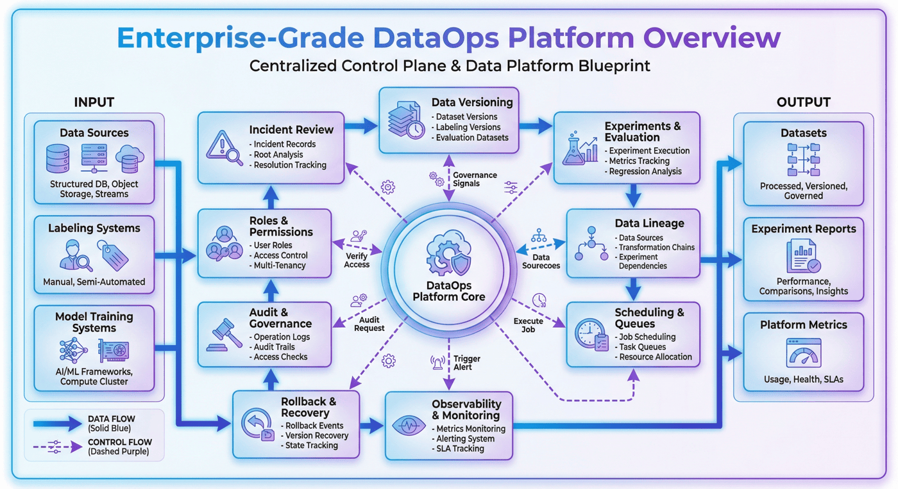
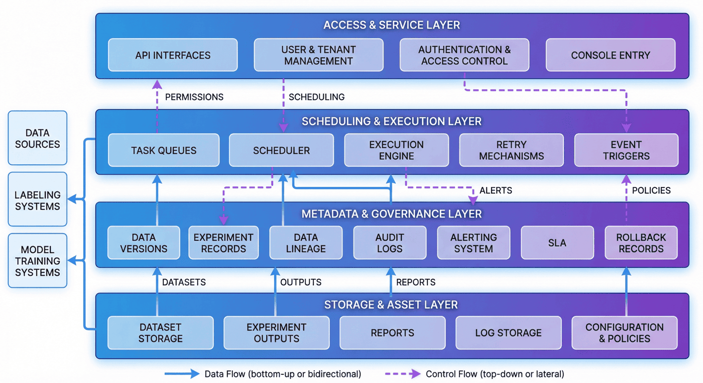
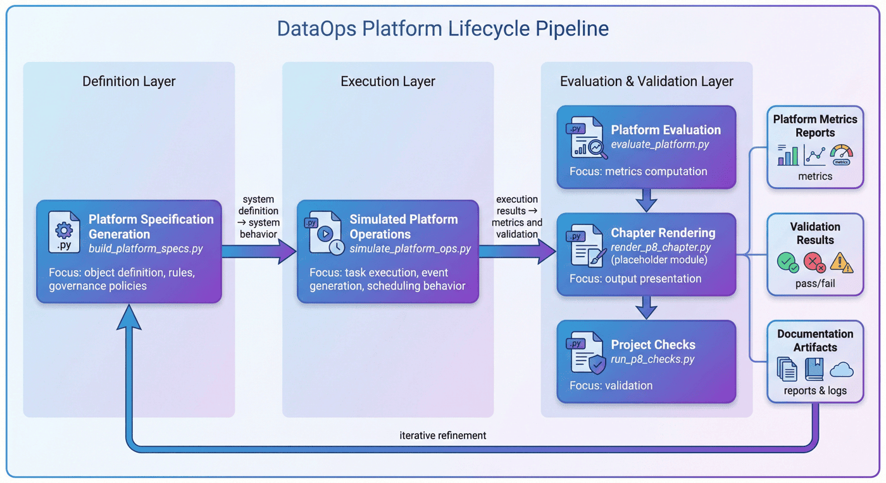
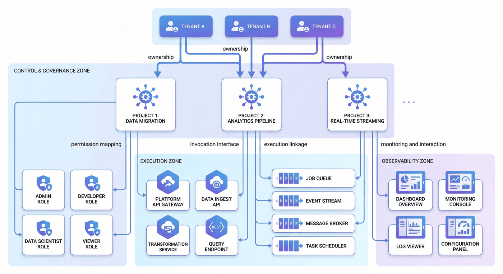
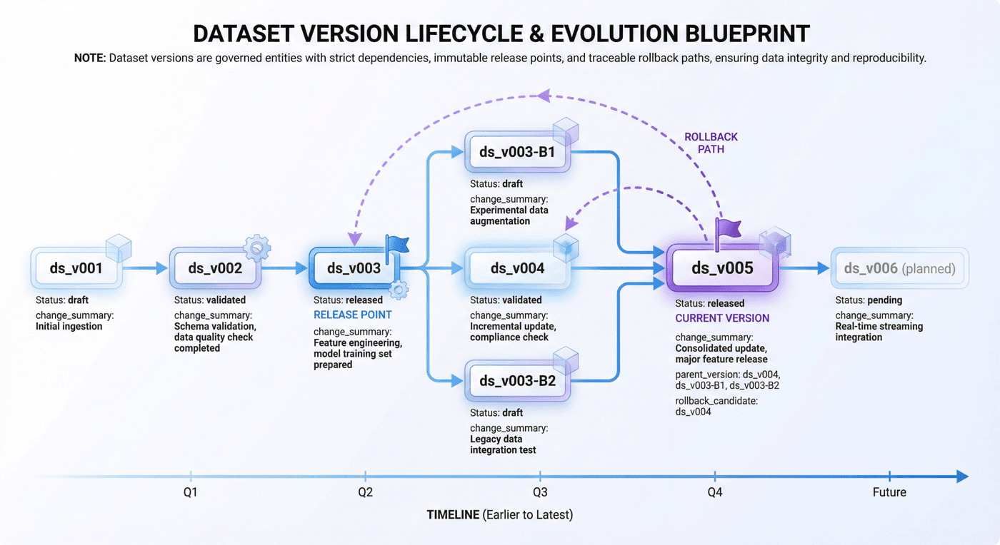
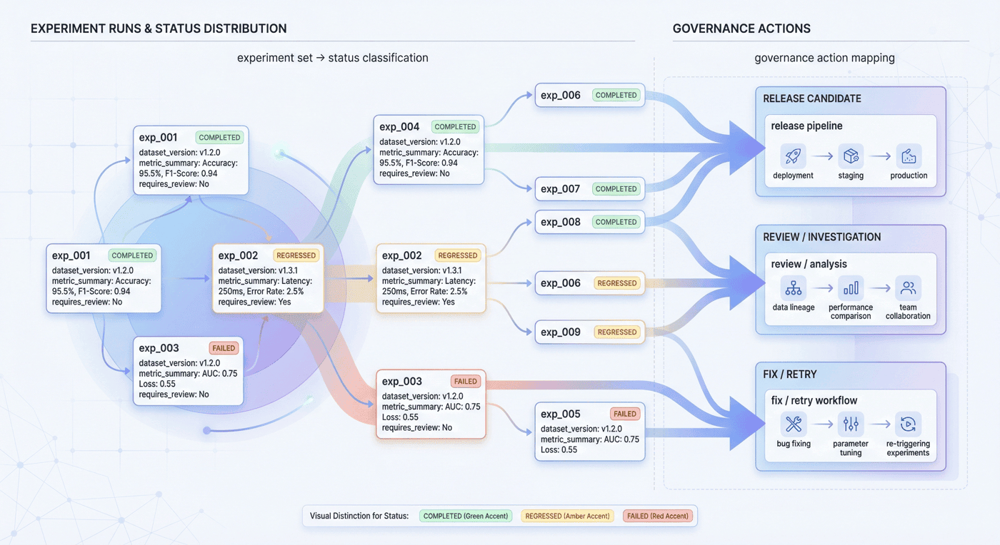
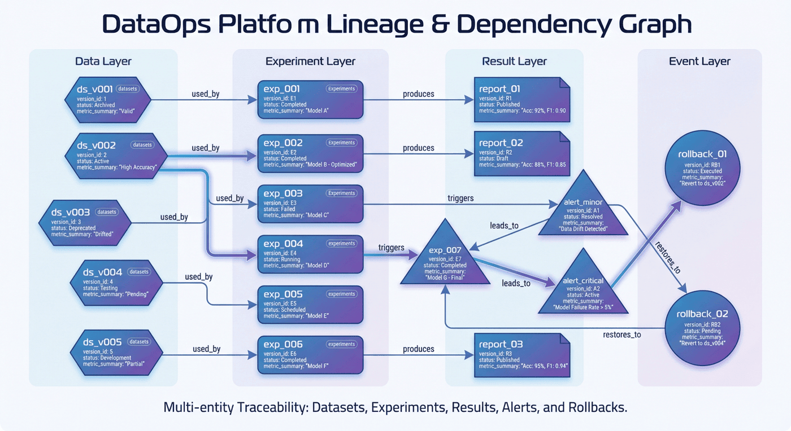
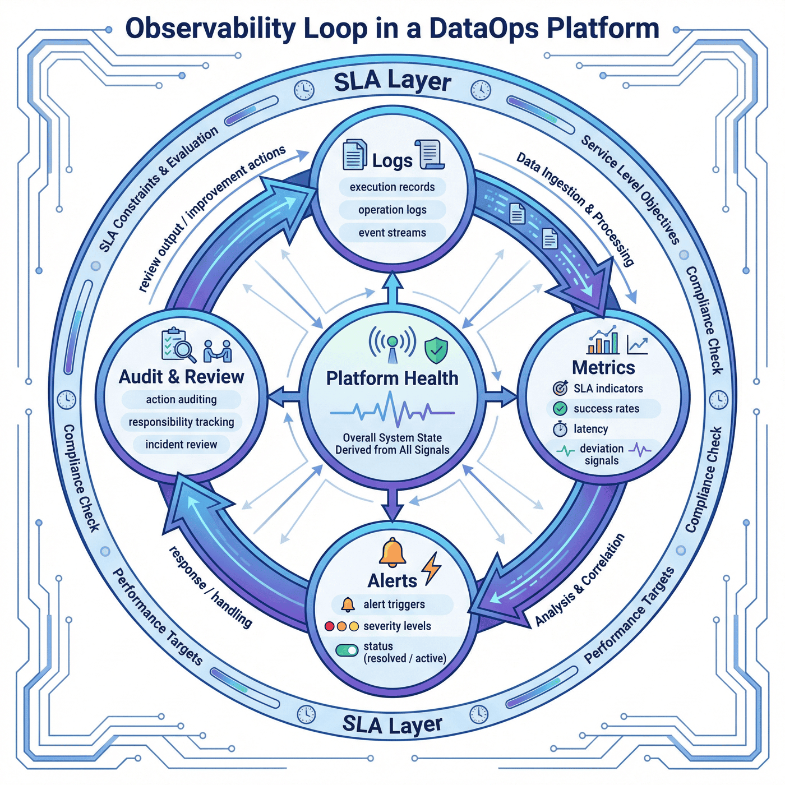
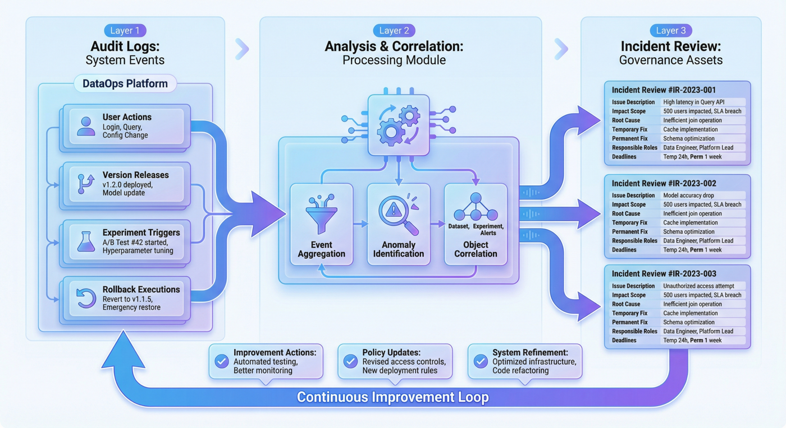
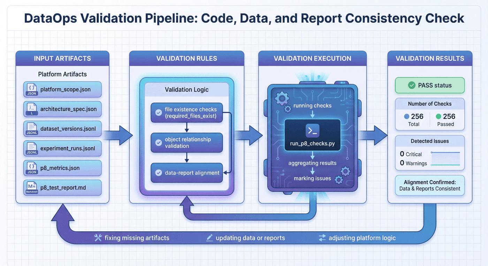

# 10-8 企业级 DataOps 平台搭建：从数据项目到组织级治理能力

## 本章概览

P08 聚焦把分散的数据工程动作组织成可治理、可追踪、可回滚、可评估的 DataOps 平台能力。章节重点不在单个控制台页面，而在对象建模、版本治理、实验追踪、血缘回滚和可观测闭环之间的系统化关系。

本章可以按四条主线理解：

- 对象模型与平台规格：明确租户、项目、角色、API 与权限边界。
- 版本治理与实验追踪：管理版本演进、实验记录、发布状态和回滚路径。
- 血缘关系与运营可观测：把指标、日志、告警、审计和事故复盘接入平台主链。
- 检查验收与组织交付：通过检查脚本和交付物验证平台的一致性与可扩展性。

如果按工程顺序阅读，本章对应的是一条完整链路：

**对象建模 -> 平台规格 -> 版本治理 -> 实验追踪 -> 血缘与回滚 -> 可观测与审计 -> 检查验收 -> 组织交付**

这一结构对应的核心目标，是把数据项目中的分散动作沉淀为可持续运行的组织级 DataOps 平台原型。

---

## 1. 项目背景：DataOps 平台的必要性

在小规模项目里，团队经常依靠少数成员的经验和默契协作完成整个流程。  
一个人写清洗脚本，一个人整理样本，一个人配置评测，一个人查看结果，最后再由项目负责人汇总汇报。  
只要项目短、团队小、版本少，这种方式往往可以运行。

但只要项目开始进入常态化迭代，这种方式就会迅速失效。

最常见的问题通常有三类。

第一类是**版本失控**。  
数据版本、实验参数、提示词配置、评测集口径、报告结论往往分散在不同目录和不同成员手里。  
当结果发生变化时，团队能看到“变化”，却看不到“变化是如何发生的”。  
没有统一版本治理，结果就无法被可靠解释，更无法被可靠回滚。

第二类是**责任失焦**。  
当一次实验效果下降时，算法工程师可能认为是数据问题，数据团队可能认为是标注问题，标注团队可能认为是评测口径变化，平台团队则可能认为是调度异常。  
如果平台没有统一的血缘和审计链路，复盘就会变成“人人都有局部证据，但没人能还原全局”。

第三类是**运营失明**。  
很多团队有作业调度系统，却没有真正的平台可观测能力。  
作业可能运行成功，但输出数据已经异常；  
指标可能产生波动，但异常没有关联到具体版本；  
告警可能被触发，但没有结构化的 incident review 与修复闭环。

所以，P08 的价值，不在于“做出一个平台概念图”，而在于它把企业级 DataOps 最关键的治理对象组织成了一个原型系统：  
**角色权限、平台架构、数据版本、实验血缘、回滚事件、SLA、告警、审计和事故复盘。** 

---

## 2. 项目目标与边界

### 2.1 项目目标

P08 的目标可以概括为四点。

**目标一：建立统一的平台规格层。**  
先定义平台范围、核心架构、API、队列、治理策略和操作模型，让平台从一开始就不是零散脚本的集合，而是有对象、有边界、有结构的系统。

**目标二：建立可追踪的数据版本与实验链路。**  
平台不仅要知道有哪些数据版本，还要知道这些版本被谁使用、被哪些实验引用、哪些实验产生了回归、哪些版本最终进入发布。

**目标三：建立可观测与可复盘能力。**  
平台不只记录“实验跑完了没有”，而是进一步记录告警、SLA、恢复时长、rollback 和 incident review，让失败路径成为平台的一部分。

**目标四：建立可检查的交付闭环。**  
项目不仅输出规格、模拟运行结果和指标文件，还输出检查脚本与测试报告，让代码、产物和文档相互对齐。现有项目共有 `13` 项检查，已全部通过。 

### 2.2 项目边界

P08 也明确设置了边界。

第一，它是一个**平台原型**，不是生产级控制平面。  
第二，它重点放在**规格设计、模拟运行、指标计算和治理机制**，而不是复杂交互式 UI。  
第三，README 中提到的 `render_p8_chapter.py` 当前缺失，这一不一致点被显式保留，而不是被掩盖。 

### 2.3 边界说明的作用

平台类项目最容易被写成两种失真的样子：

- 一种是“什么都能做”的万能平台；
- 另一种是“只能演示”的概念工程。

更可信的写法是第三种：  
**在什么边界下，这个原型已经把哪些关键治理能力结构化实现了。**

---

## 3. 项目定位：P08 的能力链位置

如果把整条数据工程能力链看成一个持续运转的系统，那么 P08 所在的位置并不在数据采集、清洗或标注本身，而在更靠后的平台化阶段。

它解决的问题不是“怎么做一个数据集”，而是：

> 当前面的数据项目、评测项目、训练项目和反馈项目越来越多时，团队如何用平台把这些动作统一治理起来？

因此，本章的重点不是解释某个具体脚本，而是展示一个平台视角下的工程问题：

- 如何定义平台对象；
- 如何组织版本与实验关系；
- 如何保留失败路径；
- 如何把观测、审计和复盘变成系统对象；
- 如何让平台产物可检查、可验证、可扩展。

根据任务书，P08 要覆盖版本、调度、质检、监控，以及与组织接口和运营节奏相关的内容。   
当前平台已经显式管理租户、项目、角色、API、队列、UI 面板、数据版本、实验、告警、审计与事故复盘。 



---

## 4. 整体架构：DataOps 平台的分层结构

当前平台已经包含 **4 个核心层**、**4 个队列**和 **5 个 UI 面板**。   
这说明平台原型并不是围绕单一调度器展开，而是按“系统层次 + 运行对象 + 治理视图”来组织。

从工程角度，一个更容易解释的拆法通常是四层。

### 4.1 接入与服务层

这一层承接租户、项目、用户和外部系统的入口。  
它通常包括 API 接口、鉴权逻辑、角色校验和控制台入口。  
平台不是先有内部逻辑，再临时给一个入口；相反，平台从一开始就要明确“谁以什么身份进入系统”。

### 4.2 调度与执行层

这一层负责把平台上的动作真正落成任务。  
包括任务队列、调度规则、执行状态、失败重试和事件触发。  
没有这一层，平台只是元数据系统；只有这一层，平台又会退化成普通调度系统。  
因此，平台必须把执行能力和治理能力同时纳入。

### 4.3 元数据与治理层

这是 DataOps 平台最核心的一层。  
这一层负责记录版本、实验、血缘、审计、告警、SLA、回滚和治理策略。  
也正是在这一层，平台和“脚本编排工具”真正拉开差距。  
如果没有这层，团队最多只能知道任务有没有跑完；  
有了这层，团队才知道任务为什么这样跑、出了问题怎么追、出现回归怎么退。

### 4.4 存储与资产层

这一层承接数据版本、实验结果、评测报告、操作日志、配置文件和运营记录。  
它保证平台管理的不是抽象流程，而是真正可复用的数据资产和治理资产。



---

## 5. 平台流程：规格生成、模拟运行与评估检查

现有项目流程是：

1. `src/build_platform_specs.py`：生成平台规格与治理设计  
2. `src/simulate_platform_ops.py`：模拟平台运行  
3. `src/evaluate_platform.py`：评估平台指标  
4. `src/render_p8_chapter.py`：渲染章节预览（README 中提到，但当前缺失）  
5. `src/run_p8_checks.py`：项目检查 

这个顺序非常重要，因为它体现出平台项目与普通数据脚本项目的区别：

> 平台首先要定义“系统是什么”，然后才去运行“系统做了什么”，最后再评估“系统运行得怎么样”。

也就是说，P08 不是先写一堆任务逻辑，再回头补说明文档；  
而是先建立平台的规格层和治理层，再去模拟平台的运行与运营。

这一点体现了平台建设的一个关键原则：

- **先定义对象与规则；**
- **再定义运行与事件；**
- **最后定义指标与验收。**



---

## 6. 对象建模：平台的关键对象层次

平台当前管理的关键对象包括：

- 租户 `3`
- 项目 `3`
- 角色 `5`
- API `6`
- 核心层 `4`
- 队列 `4`
- UI 面板 `5` 

这组对象关系说明，P08 并不是先从“功能菜单”出发，而是先从“平台对象”出发。  
这也是企业级平台与个人脚本系统的重要区别之一。

### 6.1 租户

租户是平台的最上层资源与治理边界。  
它不仅决定资源隔离，也决定权限、生效范围、审批链路和治理规则。  
一个没有租户概念的平台，很难走向真正的组织级共享使用。

### 6.2 项目

项目是平台的实际工作单元。  
数据版本、实验运行、告警事件、交付产物和报表结果都应该能够归属到具体项目。  
项目层的存在，保证平台不是一个抽象治理壳，而是能真正承接团队工作的操作空间。

### 6.3 角色

平台当前共有 `5` 个角色。   
角色模型的重要性在于，它把“谁能做什么”从口头协作变成系统能力。  
例如：

- 谁可以创建版本；
- 谁可以发布版本；
- 谁可以查看审计日志；
- 谁可以执行回滚；
- 谁负责事故复盘。

在平台项目中，角色不是为了显得“企业级”，而是为了建立最基本的责任边界。

### 6.4 API、队列与 UI 面板

平台有 `6` 个 API、`4` 个队列和 `5` 个 UI 面板。   
这三类对象分别代表：

- **API**：平台能力的程序化入口；
- **队列**：平台任务的运行承载体；
- **UI 面板**：平台治理视图的组织方式。

它们共同说明，P08 并不是只做离线产物，而是在原型层面已经思考了“系统如何被调用、如何被执行、如何被观察”。



---

## 7. 代码结合：平台规格如何落成结构化产物

P08 的交付物中已经包含：

- `data/processed/platform_scope.json`
- `data/processed/architecture_spec.json`
- `data/processed/api_catalog.json`
- `data/processed/task_queues.json`
- `data/processed/governance_policy.json`
- `data/processed/operating_model.json` 

这说明平台设计不是停留在文字说明层，而是已经把核心规格落成结构化文件。

对应实现如下，这段结构体现的是平台规格如何被落成结构化产物：

```python
from pathlib import Path
import json

OUTPUT_DIR = Path("data/processed")
OUTPUT_DIR.mkdir(parents=True, exist_ok=True)

platform_scope = {
    "tenant_count": 3,
    "project_count": 3,
    "roles": [
        "admin",
        "platform_pm",
        "data_engineer",
        "qa",
        "ops"
    ],
    "core_layers": 4,
    "queues": 4,
    "ui_panels": 5
}

with open(OUTPUT_DIR / "platform_scope.json", "w", encoding="utf-8") as f:
    json.dump(platform_scope, f, ensure_ascii=False, indent=2)
```

这段结构体现了平台设计的三个特征：

1. 平台对象被显式建模；
2. 规格定义先于运行过程；
3. 平台能力通过结构化产物被固定下来，而不是在运行结束后再做口头总结。

与单纯展示架构图相比，这种表达方式更接近可落地的平台设计。

## 8. 版本治理：平台的版本中心

当前平台共管理 **6 个数据版本**，其中 **5 个已发布**。 
这个规模并不大，但已经足以支撑一个重要论点：

> 对于 DataOps 平台来说，版本不是一个附属字段，而是整个治理闭环的基础语言。

### 8.1 版本与可解释性

在没有版本治理的平台里，实验结果通常只有“这次跑出来了什么”这个层面的意义。
但真正重要的问题往往是：

* 这次结果依赖的是哪一个数据版本？
* 与上一版相比改了什么？
* 是哪个变化导致了结果波动？
* 这个版本是否可发布？
* 如果要回滚，应该回滚到哪里？

如果这些问题不能被系统回答，那么实验结果就只能是一次性的观察，而不是组织可复用的知识。

### 8.2 版本治理与目录命名的区别

很多团队习惯按日期或按人名建目录，把这称为“版本管理”。
这种方式能提供最表面的可区分性，却无法提供真正的平台治理能力。

真正的版本治理至少应包括：

* 唯一版本标识；
* 版本状态；
* 上游依赖关系；
* 变更摘要；
* 发布与冻结规则；
* 回滚候选关系；
* 与实验、报告、发布对象之间的引用链。

### 8.3 版本结构示意

```python
dataset_version = {
    "version_id": "ds_v005",
    "project_id": "p02_legal_sft",
    "status": "released",
    "parent_version": "ds_v004",
    "change_summary": [
        "补充高风险拒答样本",
        "修复重复切块问题",
        "同步新评测标签"
    ],
    "rollback_candidate": True
}
```

在这个结构中，版本不再是静态标签，而是一个能参与运行、评估和回滚的治理对象。



---

## 9. 实验追踪：运行记录与原因追踪

当前平台共记录 **7 次实验**，其中：

* `completed = 5`
* `regressed = 1`
* `failed = 1` 

这组数字非常有代表性，因为它说明平台没有只保留成功实验。

### 9.1 保留全部实验记录

很多项目汇报习惯只展示“最佳结果”。
但平台治理的目标不是做一份漂亮的宣传材料，而是沉淀团队的真实运行轨迹。

失败实验、回归实验和不稳定实验，通常才是平台最有价值的资产，因为它们回答的是：

* 哪些策略无效；
* 哪些版本存在风险；
* 哪些指标对波动最敏感；
* 哪些实验结果不值得进入发布流程。

### 9.2 实验对象需要包含哪些核心信息

一个平台级实验对象至少应包括：

* 实验 ID
* 所属项目
* 引用的数据版本
* 关键配置
* 运行状态
* 结果摘要
* 评测结论
* 是否触发告警
* 是否关联 rollback

这让平台具备从“实验发生了”走向“实验可被追责、可被复盘、可被门禁”的能力。

### 9.3 一个实验记录的简化结构

```python
experiment_run = {
    "experiment_id": "exp_007",
    "project_id": "p02_legal_sft",
    "dataset_version": "ds_v005",
    "status": "regressed",
    "metric_summary": {
        "f1": 0.79,
        "latency_ms": 620
    },
    "requires_review": True
}
```



---

## 10. 血缘图：版本、实验与事件的关联

当前血缘图规模为：**21 个节点、19 条边**。 
这说明平台已经开始把对象之间的依赖关系组织成图，而不是停留在表格式记录。

### 10.1 血缘图的因果追踪作用

血缘图的真正价值，在于它能帮助团队回答一连串关键问题：

* 某个数据版本被哪些实验使用？
* 某次实验失败是否影响后续发布？
* 哪条告警是由哪个实验或版本触发的？
* 某次 rollback 退回的是哪条链路上的对象？
* 某个结果报表是由哪些上游对象共同生成的？

如果没有血缘图，这些问题只能依赖人工追查；
如果有血缘图，它们就可以成为平台的日常能力。

### 10.2 一个简单的边定义示例

```python
lineage_edge = {
    "from": "dataset:ds_v005",
    "to": "experiment:exp_007",
    "relation": "used_by"
}
```

### 10.3 原型期引入血缘的价值

很多团队会觉得，血缘图应该等平台成熟后再做。
但恰恰相反，越早引入血缘，越容易形成可持续的对象设计。
如果一开始就把版本、实验、告警、回滚和报告视为互相关联的图对象，后续平台扩展会更顺；
如果一开始把它们分散成若干孤立表格，后面再补血缘通常成本更高。



---

## 11. 回滚机制：平台的恢复能力

当前平台显式保留了 `rollback=1` 这一事件。 
这一点很重要，因为它说明平台不只管理前进路径，也管理撤回路径。

### 11.1 回滚作为基础能力

现实中的数据项目并不会线性向好。
一次数据修订、一次清洗逻辑调整、一次评测集替换，甚至一次任务顺序变化，都可能让结果变差。

如果平台没有显式回滚能力，团队只能在出现问题后临时恢复历史文件、人工切换版本或重新部署旧对象。
这类做法的问题在于：

* 恢复时间长；
* 操作不可审计；
* 责任边界模糊；
* 经验无法沉淀。

### 11.2 rollback 事件应该记录什么

一个合格的 rollback 事件，至少应包括：

* rollback ID
* 触发原因
* 关联实验或告警
* 回滚目标版本
* 执行时间
* 执行人
* 恢复状态
* 后续复盘链接

### 11.3 rollback 对组织信任的作用

当平台发生回归时，团队最怕的不是“需要后退”，而是“后退成本不可控”。
一个具备 rollback 能力的平台，可以把“出现问题怎么办”从紧急救火变成标准动作。


---

## 12. 可观测性：平台健康判断

当前平台可观测性侧有：

* 告警 `3` 条
* 解决率 `100.00%`
* SLA 达标率 `100.00%`
* 平均事故恢复时长 `36.5` 分钟 

这说明 P08 并不是只统计“任务是否执行成功”，而是开始衡量更接近真实平台运营的问题：

* 有没有告警；
* 告警是否被解决；
* SLA 是否达标；
* 事故恢复需要多久。

### 12.1 超出日志的可观测性

日志很重要，但日志只回答“发生了什么”。
平台运营还需要其它维度：

* 指标回答“是否偏离”；
* 告警回答“是否需要响应”；
* 审计回答“是谁做了什么”；
* 事故复盘回答“以后如何避免”。

这几个维度共同组成平台的可观测闭环。

### 12.2 SLA 视角

SLA 的价值在于，它把“系统运行”转换成“服务承诺”。
一旦平台进入组织使用阶段，团队关心的不只是脚本是否能跑完，而是：

* 平台是否持续可用；
* 异常是否及时发现；
* 故障是否在可接受时间内恢复；
* 关键治理动作是否被保障。

### 12.3 一个简化的告警结构

```python
alert = {
    "alert_id": "alert_003",
    "severity": "high",
    "category": "sla_risk",
    "related_object": "experiment:exp_007",
    "status": "resolved"
}
```



---

## 13. 审计与事故复盘：incident review 作为平台组成

P08 的主要交付物中明确包含：

* `alerts.jsonl`
* `audit_log.jsonl`
* `incident_reviews.jsonl`
* `sla_report.json` 

这说明平台没有把事故处理留在系统之外。
这点非常关键，因为很多团队会把事故复盘做成会议纪要或聊天记录，而不是平台资产。
这样做的后果是：
事故虽然“讨论过了”，但平台并没有真正变得更强。

### 13.1 incident review 应该沉淀什么

一个真正有价值的事故复盘，不只记录“发生过一次问题”，更应该沉淀：

* 问题现象；
* 影响范围；
* 根因分析；
* 临时修复动作；
* 永久修复项；
* 责任角色；
* 截止日期；
* 对应版本或对象。

### 13.2 审计日志与复盘联动

审计日志负责回答“谁做了什么”，
incident review 负责回答“为什么出问题、以后怎么不再发生”。
这两者如果分开存在，平台只能提供局部证据；
如果联动存在，平台才真正具备学习能力。



---

## 14. 控制台与运营视图：面板化治理对象

当前平台有 **5 个 UI 面板**。 
虽然当前项目重点不在 UI 实现本身，但这个数字本身说明，平台已经考虑到治理对象需要被组织成不同视图。

对于 DataOps 平台来说，面板的价值不在于“可视化很好看”，而在于：

* 把对象分门别类；
* 把运行状态结构化呈现；
* 把不同角色需要看的内容隔离开；
* 把平台日常动作转成可理解的操作界面。

一个合理的控制台视图通常可以包括：

1. 平台总览面板
2. 版本与发布面板
3. 实验与评测面板
4. 告警与 SLA 面板
5. 审计与复盘面板

这样的设计方式意味着平台不是一个统一大杂烩页面，而是将治理对象按职责拆分成不同视图。

---

## 15. 项目检查：平台一致性验证

项目当前共有 `13` 项检查，全部通过。
其中命令级检查 `2` 项，数据/产物级检查 `11` 项。
检查覆盖包括：

* `py_compile`
* `evaluate_platform`
* `required_files_exist`
* `role_and_permission_model_present`
* `architecture_layers_complete`
* `api_queue_ui_present`
* `version_lineage_links_valid`
* `experiments_reference_versions ...` 

这类检查非常重要，因为它决定平台是否真正具备代码、产物与报告之间的一致性验证能力。

### 15.1 检查链路的作用

很多项目文档能写得非常漂亮，架构图、流程图、指标解释都很完整。
但如果代码、产物和报告彼此不一致，学到的就不是工程方法，而只是案例包装。

### 15.2 检查在平台项目中的意义

对于平台项目，检查至少承担三种作用：

* 验证产物是否齐全；
* 验证对象关系是否合理；
* 验证报告描述是否与数据一致。

### 15.3 一个简化的检查示例

```python
required_files = [
    "data/processed/platform_scope.json",
    "data/processed/architecture_spec.json",
    "data/processed/dataset_versions.jsonl",
    "data/processed/experiment_runs.jsonl",
    "data/reports/p8_metrics.json",
    "data/reports/p8_test_report.md"
]

for path in required_files:
    assert Path(path).exists(), f"Missing required artifact: {path}"
```

这种检查看起来简单，但它能有效把平台工程从“概念正确”推进到“交付一致”。



---

## 16. 主要交付物：平台完整产物链

P08 的主要交付物包括：

* `data/processed/platform_scope.json`
* `data/processed/architecture_spec.json`
* `data/processed/api_catalog.json`
* `data/processed/task_queues.json`
* `data/processed/governance_policy.json`
* `data/processed/operating_model.json`
* `data/processed/dataset_versions.jsonl`
* `data/processed/experiment_runs.jsonl`
* `data/processed/lineage_graph.json`
* `data/processed/rollback_events.jsonl`
* `data/processed/alerts.jsonl`
* `data/processed/audit_log.jsonl`
* `data/processed/incident_reviews.jsonl`
* `data/processed/sla_report.json`
* `data/console/ui_panels.json`
* `data/reports/p8_report.md`
* `data/reports/p8_chapter_preview.pdf`
* `data/reports/p8_preview_stats.json`
* `data/reports/p8_metrics.json`
* `data/reports/p8_test_results.json`
* `data/reports/p8_test_report.md`

这组交付物说明，P08 并不只有最终报告，而是已经沉淀出一条完整的平台产物链。

从这组文件可以进一步看出：

* 平台不是只有“最后展示层”；
* 中间状态和治理对象都被保存；
* 报告、指标和检查来自真实产物，而不是反向编写。

---

## 17. 结果解读：P08 当前体现出的平台特征

P08 的一个关键特征，是它没有把平台收缩成只沿成功路径推进的理想系统，而是显式保留了：

* 回归实验；
* 失败实验；
* rollback 事件；
* 告警和 incident review；
* 文档与代码之间的小缺口。

这些信息共同说明，当前平台已经开始覆盖真实治理中最关键的几类对象和状态，而不只是展示一套静态架构。

如果一个平台原型只保留概念层和成功路径，后续治理能力就很难被验证。P08 当前至少已经把下面两类信息同时纳入系统：

* 一类是对象、规则、版本、实验和审计等结构化治理对象；
* 另一类是回归、失败、回滚和复盘等失败路径信息。

平台可以不大，但关键治理对象和失败路径必须被系统化保留；只有这样，平台才具备继续扩展为组织级能力的基础。

---

## 18. 局限与风险：平台原型的边界

当前项目至少有三个需要显式保留的局限。  

### 18.1 当前仍是平台原型

它已经具备对象建模、模拟运行、指标评估和检查闭环，但还不是生产级控制平面。
这说明它更适合作为方法论样板，而不是直接作为线上平台方案。

### 18.2 文档与代码仍有局部不一致

README 中提到的 `render_p8_chapter.py` 当前缺失。
这一点并不会推翻项目价值，但说明平台工程与文档同步仍然是后续要补齐的环节。

### 18.3 多租户深度治理还未展开

虽然项目已经显式包含租户概念，但跨 BU、跨组织的隔离、审批、配额和治理深度还没有真正展开。
这也是平台从原型走向组织级系统的关键差距之一。

主动把这些局限写出来，不会削弱项目，反而会提升案例的可信度。

---

## 19. 后续扩展：走向组织级 DataOps

结合当前平台结构，P08 后续最自然的扩展方向大致有三条。  

### 19.1 从原型治理走向多 BU 协同治理

把当前单团队或小规模协作原型，扩展到真正的跨团队使用环境，需要进一步补齐：

* 配额管理；
* 更细粒度权限；
* 审批与例外机制；
* 多租户隔离策略。

### 19.2 从静态记录走向动态门禁

当前平台已经能够记录版本、实验、告警和回滚。
下一步可以把这些对象进一步接入动态门禁逻辑，例如：

* 实验回归自动阻断发布；
* SLA 风险触发冻结；
* 高风险版本需要人工审批；
* 关键项目的 rollback 进入升级流程。

### 19.3 从技术平台走向运营平台

很多平台项目止步于“系统做出来了”，但真正的组织级平台还需要运营节奏，例如：

* 版本冻结日；
* 每周治理例会；
* 值班机制；
* 事故复盘节奏；
* SLA 周报或月报；
* 发布门禁 review。

只有这些节奏与平台对象连在一起，DataOps 才真正从“工具”变成“组织能力”。

---

## 20. 本章总结：责任、证据与恢复能力

P08 的关键价值，不在于证明“平台可以管理很多 JSON 文件”，而在于证明另一件更重要的事：

> 当数据工程从单项目协作走向长期组织化运转时，平台的核心职责不是让流程看起来更统一，而是让版本、实验、失败、告警、回滚和复盘都变成可追踪的系统对象。

从现有项目结果来看，P08 已经具备几个关键的工程特征：

* 有明确的平台边界，而不是泛化成“什么都做”的系统； 
* 有从规格生成到模拟运行、指标评估、项目检查的完整链路； 
* 有版本、实验、血缘、rollback、SLA、告警、审计和事故复盘等治理对象； 
* 有真实失败路径，而不是只保留成功演示； 
* 有 `13/13` 检查通过记录，说明代码、产物和报告之间是一致的。 

因此，P08 的真正价值，不是“搭了一个平台原型”，而是用一个规模适中的项目，把企业级 DataOps 平台最关键的治理逻辑做成了可讲述、可验证、可复用的案例。

可以把本章最重要的结论压缩成一句话：

> DataOps 平台真正要建设的，不是更多页面，而是更完整的治理闭环。

---

