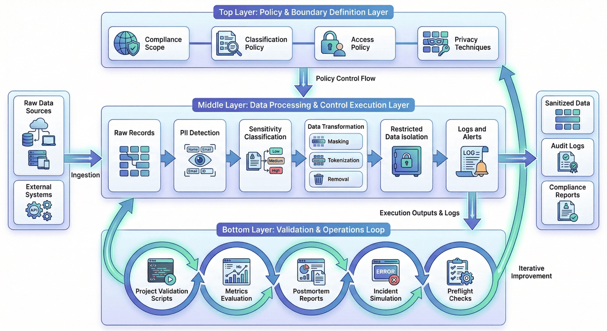
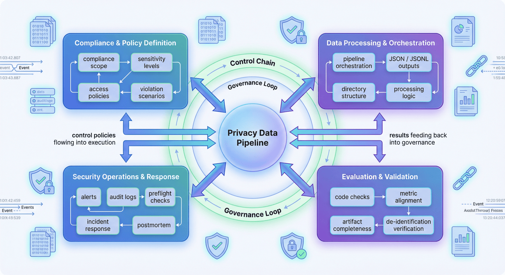
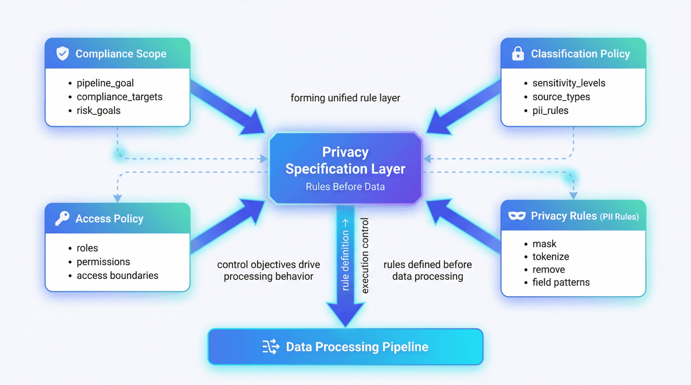
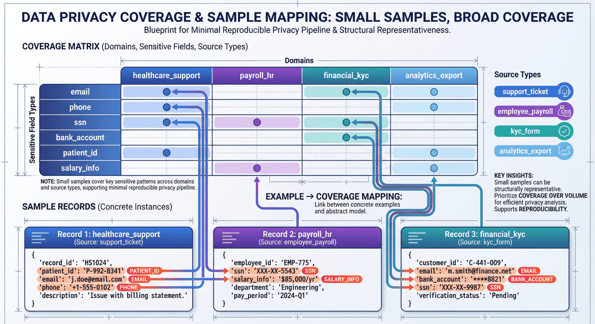
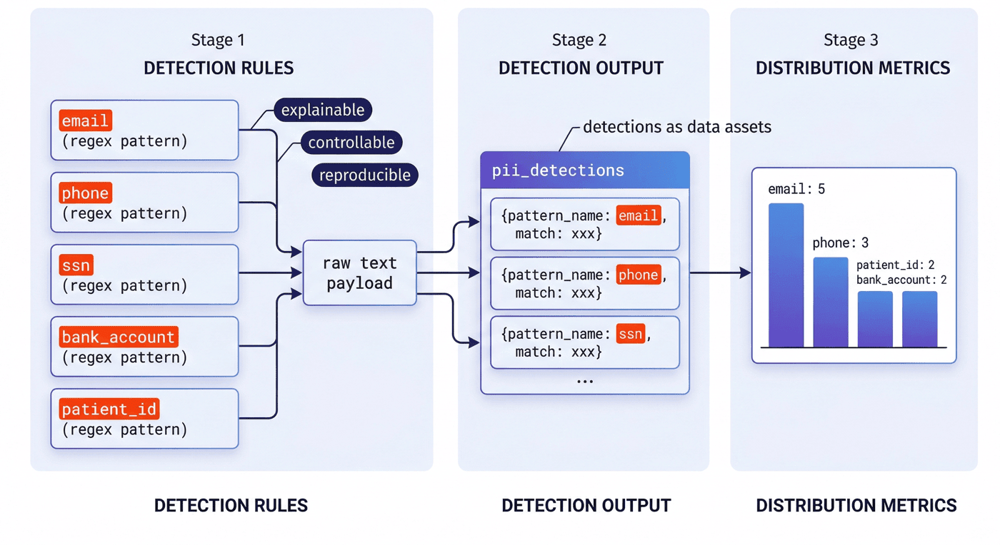
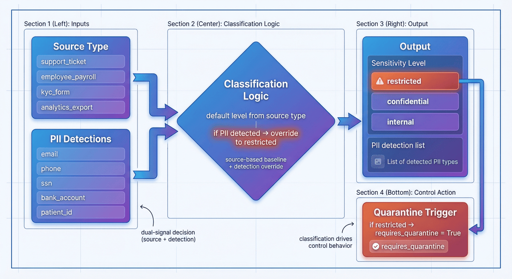
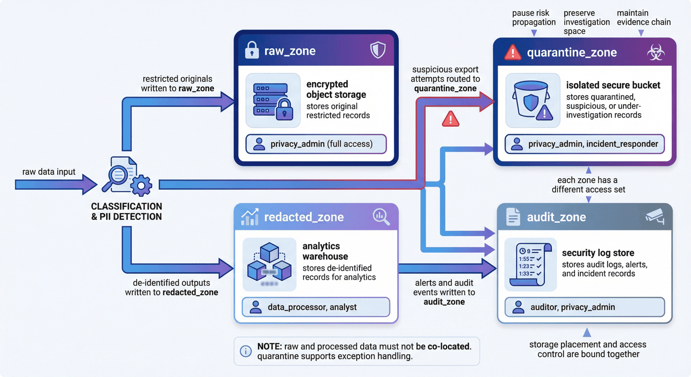
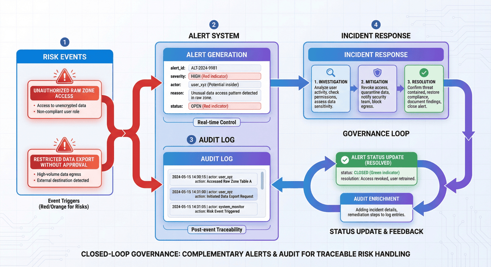
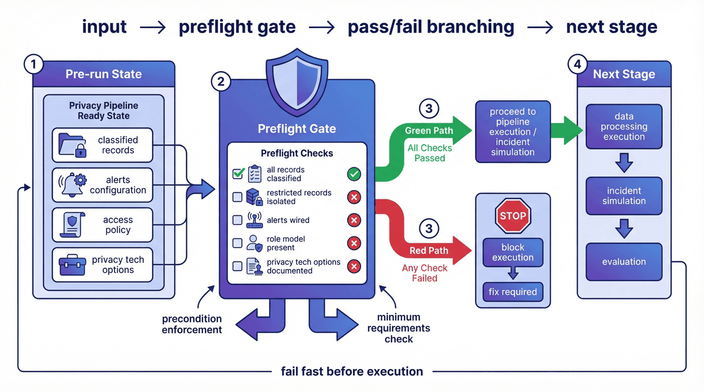
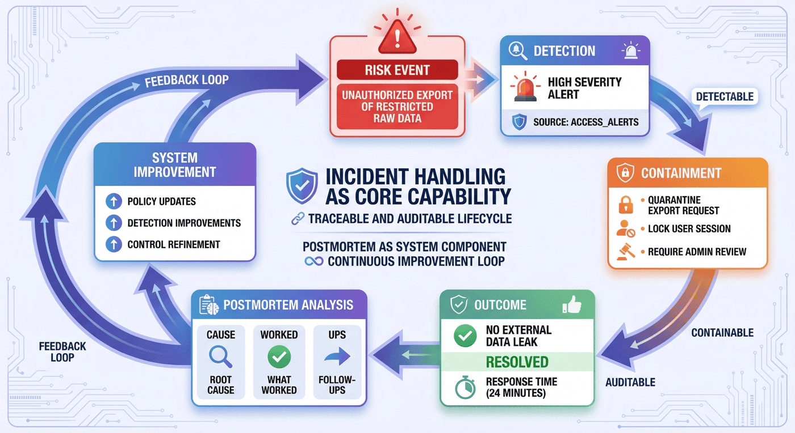

# 项目九：隐私保护数据流水线

## 本章概览

P09 聚焦敏感数据进入训练、分析与共享链路之前的治理过程。章节重点不在单点脱敏技巧，而在把控制边界、敏感记录处理、运营响应和验收机制组织成一条完整的隐私保护数据流水线。

本章可以按四条主线理解：

* 控制边界与隐私规格：明确合规范围、分类策略、访问边界与技术选项。
* 敏感记录处理链：完成 PII 检测、去标识化、隔离与存储分区。
* 运营与响应闭环：把告警、审计、preflight、incident simulation 与 postmortem 纳入主流程。
* 评估与验收机制：通过指标、交付物与检查脚本验证代码、产物和报告的一致性。

如果按工程顺序阅读，本章对应的是一条完整链路：

**合规范围定义 -> 分类策略 -> 访问边界 -> 敏感记录处理 -> 隔离与告警 -> 运维预检 -> 事故模拟 -> 指标评估 -> 项目检查**

这一结构对应的核心目标，是把隐私治理从局部处理动作提升为可复现、可审阅、可验收的工程系统。

---

## 1. 项目背景：隐私保护数据流水线的必要性

随着训练数据、业务日志和分析型数据平台不断扩张，越来越多的团队会遇到同一个问题：原始数据里天然带有身份信息、财务信息、员工信息、医疗信息或其他高敏属性，但业务部门和算法部门又希望尽快把数据送进统一的平台进行分析、建模或共享。

这时，风险并不只是“有没有把邮箱删掉”，而是更前面的链路是否被正确设计。比如：

* 原始记录和脱敏记录是否放在同一个区域；
* 哪些角色能接触原始数据，哪些角色只能读去标识化结果；
* 当有人绕过常规流程发起导出时，系统是否能告警；
* 如果出现越权访问尝试，系统是否有隔离与复盘机制；
* 最终项目如何证明这些控制真的生效，而不是停留在 README 里。

P09 的核心目标正是解决这一类问题。根据项目整体报告，P09 的重点不是“做一次脱敏”，而是构建一条把分类、权限、脱敏、隔离、审计、预检和事故复盘组织在一起的隐私处理体系。它服务的是高度敏感记录进入训练或分析系统之前的安全控制需求。

这类项目很有代表性，因为它展示的不是单点算法，而是一种**治理型数据工程**：

> 真正成熟的隐私流水线，不是一个 regex 脚本，而是一套能明确责任边界、执行处理动作并输出验证证据的 operating model。

---

## 2. 项目目标与边界

### 2.1 项目目标

本项目聚焦以下四个目标。

**目标一：建立可解释的隐私规格层。**
先把场景域、合规目标、风险目标、分类等级、访问角色和技术选项写清楚，使项目不从“处理文本”开始，而从“定义控制边界”开始。

**目标二：建立面向敏感记录的处理链路。**
从原始记录出发，完成分类、PII 检测、去标识化、隔离与告警，形成一条可复现的数据处理流程。

**目标三：建立运维与事故响应闭环。**
通过 preflight、incident simulation 和 postmortem，让流水线不仅能“平时运行”，也能展示“出事时如何响应”。

**目标四：形成可验证的工程交付。**
最终输出不仅包括处理后的 JSON/JSONL 产物，还包括指标文件、主报告、测试结果和项目检查报告，确保代码、产物与叙述一致。

### 2.2 项目边界

为了保持项目可复现性，本项目显式设置了若干边界。

#### 1）数据规模边界

当前项目使用的是一个小规模敏感记录样本集，总记录数为 8 条，重点用于展示方法链路，而不是证明大规模吞吐能力。

#### 2）场景边界

项目当前主要覆盖三个代表性场景域：医疗支持、HR 薪资与金融 KYC。这些场景足以体现敏感数据治理中的典型问题，但尚未扩展到广告归因、跨国数据流、多租户 SaaS 或训练语料供应链等更复杂环境。

#### 3）技术实现边界

项目纳入了差分隐私、TEE、FHE 等技术选项说明，但它们更多停留在“选项层”和“架构位点层”，并不意味着这些能力都已经被深度工程化实现。

#### 4）治理能力边界

项目已经具备分类、隔离、审计、预检和事故恢复等治理链路，但在跨系统权限联动、复杂导出审批、持续监测与自动化例外管理方面仍有明显扩展空间。

### 2.3 边界说明的作用

边界越明确，案例就越可信。真正需要的不是一个“什么都能做”的项目神话，而是一套可以回答下面这个问题的方法：

> 在有限样本、有限时间和有限实现深度的前提下，如何把一个隐私项目做成完整闭环，而不是只停在概念说明？

---

## 3. 项目定位：P09 的能力链位置

如果把整条大模型与数据工程能力链看成一个系统，那么 P09 所处的位置并不是训练本身，而是**训练前治理**与**数据进入系统之前的安全控制**。

很多项目章节关注的是：

* 如何构造训练数据；
* 如何设计监督信号；
* 如何做评估与偏好；
* 如何做推理优化与业务接入。

而 P09 则回答另一个经常被低估的问题：

* 当数据本身带有隐私风险时，系统如何决定谁能看、哪些能出、哪些必须隔离、哪些要记录、出了问题如何追责？

也就是说，本章要解决的不是“怎样把模型训得更强”，而是：

> 当敏感数据进入智能系统时，数据治理链路要如何被设计成可执行、可验证、可解释的工程流程？

这体现了 P09 作为隐私治理流水线的工程特征。

---

## 4. 整体架构：从隐私规格到项目检查的处理流水线



从工程视角看，P09 可以拆成三层。

### 4.1 第一层：策略与边界定义层

这一层回答的是“系统到底要保护什么、按什么规则保护”。主要包括：

* 合规范围定义（compliance scope）
* 分类策略（classification policy）
* 访问策略（access policy）
* 隐私技术选项（privacy tech options）

### 4.2 第二层：数据处理与控制执行层

这一层回答的是“敏感数据进来以后具体发生什么”。主要包括：

* 原始记录构造
* PII 检测
* 敏感级别判定
* 标识符去除、掩码与 token 化
* restricted 记录隔离
* 告警与审计日志输出

### 4.3 第三层：验证与运维闭环层

这一层回答的是“系统是否真的可靠”。主要包括：

* preflight 检查
* 事故模拟
* postmortem 报告
* metrics 评估
* 项目检查脚本

这一结构可以概括为三层：规则与范围定义层、处理与控制执行层、验证与交付闭环层。P09 的重点不在指令数据生产，而在从隐私规格生成、控制执行到治理证据沉淀的完整链路。 

---

## 5. 工程前置：隐私流水线需要先明确哪些关键面

隐私流水线不是单一脱敏脚本的线性放大，而是一条由控制目标、处理规则、运营机制和验收标准共同构成的治理链。

### 5.1 合规目标与策略定义面

这一层负责明确合规目标、敏感等级、访问边界和违规情形，使项目从控制目标出发，而不是从局部处理技巧出发。

### 5.2 数据处理与产物编排面

这一层负责流水线编排、JSON/JSONL 产物生成、目录标准化、处理逻辑落盘与评估脚本联动，保证处理链可以被复现和复核。

### 5.3 安全运营与响应闭环面

这一层负责告警、审计、预检、事故响应与复盘链路，保证控制措施不仅存在于处理逻辑中，也存在于日常运营流程中。

### 5.4 评估验证与验收面

这一层负责检查代码能否编译、报告与指标是否一致、产物是否完整、脱敏是否彻底，以及总体状态是否处于可接受范围。

### 5.5 关键面的前置性

隐私项目最常见的失败方式，往往不是正则或规则本身写错，而是关键控制面没有被显式固定下来：

* 策略定义不清；
* 权限模型缺少审核；
* 例外流程无人承接；
* 报告与产物无法对齐；
* 出现问题后缺少可追溯的定位路径。

这意味着隐私流水线首先是一条需要被完整定义的控制链，而不是若干脱敏动作的拼接。



---

## 6. 隐私规格层：规则先行的处理链

P09 的第一个脚本是 `src/build_privacy_specs.py`。这件事本身就很说明问题：项目不是先读数据，而是先生成隐私规格与策略。整体报告也明确给出了推荐执行顺序，第一步就是生成隐私规格与策略。

### 6.1 合规范围文件

在很多项目里，“为什么要保护这些字段”会被隐含在代码注释里。但 P09 把这件事显式化成 `compliance_scope.json`。这样做有三个价值：

* 让项目目标从一开始就对齐合规与风险语言；
* 让后续评估可以直接引用作用域，而不是靠口头理解；
* 让项目一开始就呈现出清晰的范围定义，而不是临时脚本式拼接。

对应代码如下：

```python
def build_scope() -> dict:
    return {
        "pipeline_goal": "Build a reproducible privacy-preserving data processing pipeline for highly sensitive records.",
        "example_domains": ["healthcare_support", "payroll_hr", "financial_kyc"],
        "compliance_targets": [
            "least_privilege",
            "auditability",
            "de-identification before analytics",
            "incident response readiness",
        ],
        "risk_goals": [
            "prevent direct PII leakage to analytics consumers",
            "separate raw storage from redacted processing zones",
            "log suspicious access and export attempts",
        ],
    }
```

这段结构说明，P09 的起点不是脱敏动作，而是控制目标。

### 6.2 分类策略的枢纽作用

分类策略一旦定义清楚，后续很多控制动作就有了依据。比如：

* 哪些 source type 默认是 restricted；
* 哪些字段模式需要 tokenize；
* 哪些字段更适合 mask 或直接 remove；
* 没有识别到明确 PII 时是否还能沿用默认等级。

`build_classification_policy()` 把这些规则组织成结构化对象：

```python
def build_classification_policy() -> dict:
    return {
        "sensitivity_levels": [
            {"level": "restricted", "description": "direct PII, health identifiers, payroll details, bank data"},
            {"level": "confidential", "description": "internal case details and support notes"},
            {"level": "internal", "description": "aggregate metrics and sanitized analytics outputs"},
        ],
        "source_types": [
            {"source_type": "support_ticket", "default_level": "confidential"},
            {"source_type": "employee_payroll", "default_level": "restricted"},
            {"source_type": "kyc_form", "default_level": "restricted"},
            {"source_type": "analytics_export", "default_level": "internal"},
        ],
        "pii_rules": [
            {"pattern_name": "email", "action": "tokenize"},
            {"pattern_name": "phone", "action": "mask"},
            {"pattern_name": "ssn", "action": "remove"},
            {"pattern_name": "bank_account", "action": "tokenize"},
            {"pattern_name": "patient_id", "action": "tokenize"},
        ],
    }
```

### 6.3 访问策略的前置约束

很多项目会先把数据处理完，再临时写一句“只有管理员可以访问原始数据”。但 P09 把 `access_policy.json` 也放在规格层生成，这意味着权限不是后补说明，而是先验约束。

这一点非常关键，因为隐私控制里最昂贵的错误，往往不是“掩码没写完整”，而是“根本不该看到原始数据的人先看到了”。



---

## 7. 原始记录与场景构造：小样本的治理覆盖

项目当前原始记录只有 8 条。这个数字并不大，但它并不是随意拼凑出来的。整体报告显示，这 8 条记录横跨 3 个场景域、4 类数据源，并对应 5 类角色模型。

### 7.1 小样本的结构覆盖能力

因为本项目的目标不是做统计显著性，而是做**方法演示**。只要样本能覆盖：

* 医疗支持中的 patient id、邮箱、电话；
* HR/薪资中的 SSN、薪资备注、工资周期；
* KYC 中的邮箱、银行账号与审核状态；
* analytics export 中相对低风险的聚合信息；

那么它已经足以支撑一个最小可复现的隐私控制案例。

### 7.2 样本构造方式

`run_privacy_pipeline.py` 中的 `build_raw_records()` 直接给出了代表性数据：

```python
def build_raw_records() -> list[dict]:
    return [
        {
            "record_id": "rec_001",
            "source_type": "support_ticket",
            "domain": "healthcare_support",
            "owner_team": "care_ops",
            "payload": "Patient John Lee, patient id PT-483920, email john.lee@example.com, phone 415-555-2198 asked about claim denial.",
        },
        {
            "record_id": "rec_002",
            "source_type": "employee_payroll",
            "domain": "payroll_hr",
            "owner_team": "hr_ops",
            "payload": "Employee Marta Chen SSN 342-19-8842 salary adjustment note for payroll cycle 2026-04.",
        },
        {
            "record_id": "rec_003",
            "source_type": "kyc_form",
            "domain": "financial_kyc",
            "owner_team": "fin_ops",
            "payload": "KYC form for beta@corp.test with bank account 998877665544 and risk review pending.",
        },
    ]
```

这类写法的优点是，不必先下载外部数据集，也能完整理解流水线逻辑。它牺牲了一定的真实复杂度，换来更强的可复现性。

### 7.3 场景样本的构造依据

如果只说“准备了一些样本”，信息量其实很弱。更重要的是写清楚：这些样本为什么选这些域、覆盖哪些字段模式、服务于后续哪些控制动作。



---

## 8. PII 检测：识别规则作为处理入口

隐私处理真正开始于 PII 检测。在 P09 里，这一步采用了规则驱动的方式：邮箱、电话、SSN、银行账号、patient id 分别使用独立正则进行匹配。

### 8.1 规则法作为起点

在这个案例里，规则法有三个明显优势：

* 可解释：每个匹配项都知道是因为什么规则命中的；
* 可控：误伤和漏检能被定位到具体 pattern；
* 可复现：复制代码即可得到相同结果。

代码如下：

```python
EMAIL_RE = re.compile(r"\b[A-Za-z0-9._%+-]+@[A-Za-z0-9.-]+\.[A-Za-z]{2,}\b")
PHONE_RE = re.compile(r"\b\d{3}-\d{3}-\d{4}\b")
SSN_RE = re.compile(r"\b\d{3}-\d{2}-\d{4}\b")
BANK_RE = re.compile(r"\b\d{10,12}\b")
PATIENT_RE = re.compile(r"\bPT-\d{4,6}\b")


def detect_pii(text: str) -> list[dict]:
    detections = []
    for pattern_name, regex in [
        ("email", EMAIL_RE),
        ("phone", PHONE_RE),
        ("ssn", SSN_RE),
        ("bank_account", BANK_RE),
        ("patient_id", PATIENT_RE),
    ]:
        for match in regex.finditer(text):
            detections.append({"pattern_name": pattern_name, "match": match.group(0)})
    return detections
```

### 8.2 检测结果作为数据资产

很多项目会在代码里检测完就直接替换，不保留检测结构。但 P09 把 `pii_detections` 放进了分类结果里，使得后续评估可以统计字段分布，检查脚本也可以验证规则是否真的生效。

这使项目从“做了脱敏”升级为“留下了检测证据”。

### 8.3 当前检测分布说明了什么

整体报告显示，PII 检测覆盖了多种字段模式，其中 email=5、phone=3、patient_id=2、bank_account=2。 这说明即使在一个小规模数据集中，项目也已经具备跨字段模式的最小覆盖，而不是只处理单一类型的标识符。



---

## 9. 分类逻辑：source type 与 PII 的联合判定

真正稳健的隐私分类，往往不是“只看字段内容”或“只看数据来源”，而是两者结合。P09 的 `classify_record()` 就体现了这一点。

```python
def classify_record(record: dict, classification_policy: dict) -> dict:
    source_type_map = {
        item["source_type"]: item["default_level"]
        for item in classification_policy["source_types"]
    }
    detections = detect_pii(record["payload"])
    sensitivity = source_type_map.get(record["source_type"], "internal")
    if detections:
        sensitivity = "restricted"
    return {
        **record,
        "sensitivity_level": sensitivity,
        "pii_detections": detections,
        "requires_quarantine": sensitivity == "restricted",
    }
```

### 9.1 这段逻辑解决了什么问题

它解决了两个常见错误。

第一，只按 source type 判定会漏掉异常内容。比如一个本该较低风险的来源里，突然出现明确的邮箱或账号，如果仍然沿用默认级别，就会失控。

第二，只看正则命中又会忽略业务语义。比如某些 payroll 或 KYC 数据即使当前文本里没有直接命中，也不应该轻易归入低敏等级。

### 9.2 `requires_quarantine` 作为控制信号

很多项目把分类结果只写成一个标签，但 P09 进一步写出了控制动作信号 `requires_quarantine`。这意味着分类不是为了报告好看，而是为了驱动后续系统行为。

这在工程上非常重要，因为：

> 真正可用的分类，不只是告诉你“它是什么”，而是告诉系统“接下来应该怎么处理它”。

### 9.3 当前结果说明了什么

整体报告显示，8 条原始记录中有 7 条被判定为 restricted，且 7 条都进入了隔离。 这与项目的场景选择是匹配的：样本集中大部分记录本来就带有高敏特征，目的是把治理链路展示清楚，而不是刻意制造大量低风险样本。



---

## 10. 脱敏与去标识化：差异化去标识策略

很多团队做脱敏时，最常见的简化就是“全部替换成 *** ”。这种做法虽然看上去安全，但会带来两个问题：

* 丢失必要的分析结构；
* 无法体现不同字段应有的不同处理强度。

P09 在 `redact_payload()` 中使用了三种策略：tokenize、mask 与 remove。

```python
def redact_payload(text: str, detections: list[dict]) -> str:
    redacted = text
    for detection in detections:
        match = detection["match"]
        if detection["pattern_name"] in {"email", "bank_account", "patient_id"}:
            replacement = hash_token(match)
        elif detection["pattern_name"] == "phone":
            replacement = "***-***-" + match[-4:]
        else:
            replacement = "[REMOVED_SSN]"
        redacted = redacted.replace(match, replacement)
    return redacted
```

### 10.1 tokenize、mask 与 remove 的分工

* **tokenize** 适合邮箱、银行账号、patient id 这类需要保留“同一实体一致性”但不应暴露原值的字段；
* **mask** 适合电话这类保留末位有助于运维核对但不能保留全值的字段；
* **remove** 适合 SSN 这类高度敏感、没有必要保留可回指结构的字段。

### 10.2 `hash_token()` 的意义是什么

辅助脚本中使用 `sha256` 生成稳定 token：

```python
def hash_token(value: str) -> str:
    digest = hashlib.sha256(value.encode("utf-8")).hexdigest()
    return f"tok_{digest[:12]}"
```

这样做的好处在于，同一个原值会映射到相同 token，既能避免直接暴露原始标识符，也能支持后续做弱关联分析。

### 10.3 策略差异的必要性

因为隐私工程里最忌讳的，就是把所有问题都写成一个模糊的“脱敏处理”。真正有工程含义的写法，必须把不同字段的控制意图区分出来。


---

## 11. 存储分区与隔离：结果与原始数据的分区控制

隐私治理里，一个非常高频但又经常被低估的问题是：哪怕你做了去标识化，如果原始记录与处理结果仍然混放在同一逻辑区，很多风险依然存在。

P09 通过 `build_isolation_plan()` 显式给出四类 zone：raw_zone、quarantine_zone、redacted_zone 和 audit_zone。

```python
def build_isolation_plan() -> dict:
    return {
        "zones": [
            {"zone_name": "raw_zone", "store": "encrypted object storage", "access": ["privacy_admin"]},
            {"zone_name": "quarantine_zone", "store": "isolated secure bucket", "access": ["privacy_admin", "incident_responder"]},
            {"zone_name": "redacted_zone", "store": "analytics warehouse", "access": ["data_processor", "analyst"]},
            {"zone_name": "audit_zone", "store": "security log store", "access": ["auditor", "privacy_admin"]},
        ],
        "deid_flow": [
            "ingest raw restricted records",
            "classify and detect PII",
            "write restricted originals to raw_zone",
            "redact identifiers and emit sanitized records to redacted_zone",
            "quarantine flagged export attempts and emit audit alerts",
        ],
    }
```

### 11.1 为什么 zone 模型重要

因为它把“谁能看什么”与“数据该放哪里”绑定起来。只有这样，权限边界才不是抽象声明，而是与存储对象、工作流动作和角色集合一起落地。

### 11.2 为什么 quarantine_zone 是关键设计

很多项目只有 raw_zone 和 redacted_zone，但没有 quarantine_zone。问题在于：当发现异常访问或可疑导出时，系统就缺少一个“既不继续处理、又不直接丢弃”的中间状态。

quarantine_zone 的意义在于：

* 暂停风险扩散；
* 为 incident responder 留出调查空间；
* 保持证据链；
* 让例外流程有一个明确落点。

### 11.3 隔离结果说明了什么

整体报告显示，当前 restricted 记录为 7 条，隔离记录也是 7 条。 这表明隔离逻辑与分类逻辑保持一致，而不是“分类归分类，隔离另说”。



---

## 12. 审计与告警：行为证据链

一个只会“处理数据”的系统，并不等于一个可治理的系统。因为真正敏感的时刻，往往不是平时处理，而是有人试图绕过规则时。P09 把告警与审计单独建成产物，正是为了让系统留下可追溯证据。

### 12.1 告警是如何被建模的

`build_alerts()` 构造了两个典型告警：

```python
def build_alerts() -> list[dict]:
    return [
        {
            "alert_id": "alert_priv_001",
            "severity": "high",
            "actor": "analyst",
            "reason": "unauthorized raw zone access attempt",
            "status": "resolved",
        },
        {
            "alert_id": "alert_priv_002",
            "severity": "medium",
            "actor": "data_processor",
            "reason": "restricted export requested without approval",
            "status": "resolved",
        },
    ]
```

这两个告警非常典型：一个是越权访问原始区，一个是未经批准请求导出 restricted 数据。它们恰好对应了隐私治理中最危险的两类动作。

### 12.2 为什么审计日志和告警必须一起出现

告警告诉系统“有风险动作发生了”，审计日志则告诉系统“谁在什么时候做了什么”。前者更偏实时控制，后者更偏事后追踪。少任何一个，治理链都会不完整。

### 12.3 当前指标反映了什么

整体报告显示，当前项目共有告警 2 条、告警解决率 100%、审计事件 5 条。 这说明项目已经不是“生成了一些脱敏文件”，而是开始具备安全运营语义。



---

## 13. preflight：运行前检查

许多数据项目只有处理主流程，没有运行前检查。但隐私流水线如果缺少 preflight，就容易出现一种假象：看起来文件都能输出，实际上条件并不满足。

P09 在 `simulate_privacy_ops.py` 中先做 preflight，再做 incident simulation。这一顺序很有工程意味。

```python
preflight = {
    "checks": [
        {"name": "all records classified", "passed": len(classified) > 0 and all("sensitivity_level" in item for item in classified)},
        {"name": "restricted records isolated", "passed": all(item["requires_quarantine"] == (item["sensitivity_level"] == "restricted") for item in classified)},
        {"name": "alerts wired", "passed": len(alerts) >= 2},
        {"name": "role model present", "passed": len(access_policy["roles"]) >= 5},
        {"name": "privacy tech options documented", "passed": len(tech_options) >= 4},
    ]
}
```

### 13.1 preflight 检查项设计

因为它们覆盖的是“流水线成立的最低前提”：

* 有分类；
* restricted 真被隔离；
* 告警不是空壳；
* 角色模型不是缺失的；
* 隐私技术选项不是空白的。

### 13.2 当前结果说明了什么

整体报告显示，preflight pass rate 为 100%。 这意味着项目在运维模拟开始前，至少满足了最小前置条件。

### 13.3 preflight 的独立价值

因为这体现了一种成熟的工程习惯：

> 不是“跑完再看”，而是“先确认最低条件成立，再进入更高风险的处理和演练阶段”。



---

## 14. incident simulation 与 postmortem：异常响应闭环

很多案例只讲成功路径，不讲失败路径。但隐私治理恰恰不能回避失败场景，因为真正决定体系是否可信的，往往是“有人越界时系统怎么响应”。

P09 将 incident 场景写成结构化记录：分析师未经批准尝试导出 restricted 原始记录，其中 detection、containment、outcome 和 response_minutes 都被显式保留。

```python
incident = {
    "incident_id": "privacy_inc_001",
    "scenario": "analyst attempted to export restricted raw records without approval",
    "detection": "access_alerts.jsonl high severity alert",
    "containment": [
        "quarantine the export request",
        "lock the analyst session",
        "require privacy_admin review",
    ],
    "outcome": "resolved with no confirmed external data leak",
    "response_minutes": 24,
}
```

对应的 postmortem 则继续记录 root cause、what_worked 和 follow_ups。

### 14.1 事件设计的完整性

因为它不是泛泛地写“发生了安全事件”，而是把事件链拆成：

* 如何被发现；
* 如何被遏制；
* 为什么没有扩散；
* 后续要做什么改进。

### 14.2 指标告诉了我们什么

整体报告显示，事故响应耗时 24 分钟，postmortem follow-up 数为 3。 这说明项目已经把运维和复盘写进了可计量结果，而不是只留一句“未来可扩展”。

### 14.3 incident 与 postmortem 的独立位置

把 incident 和 postmortem 写进去，更容易看清一件事：隐私流水线并不是一条静态 ETL，而是一套包含异常响应能力的治理体系。



---

## 15. 评估脚本：指标的结构化生成

P09 的评估由 `src/evaluate_privacy_pipeline.py` 完成。它不是手工写一份总结，而是直接读取 processed 目录中的各类产物，计算统一指标并生成 `p9_metrics.json` 与 `p9_report.md`。

### 15.1 指标是如何从产物里算出来的

评估阶段会先读取 scope、classification、access、tech options、raw/classified/redacted/quarantined、alerts、audit、preflight、incident、postmortem 等全部产物，再计算关键结果。

```python
metrics = {
    "domain_count": len(scope["example_domains"]),
    "compliance_target_count": len(scope["compliance_targets"]),
    "source_type_count": len(classification["source_types"]),
    "role_count": len(access["roles"]),
    "privacy_tech_count": len(tech_options),
    "raw_record_count": len(raw_records),
    "restricted_record_count": sum(item["sensitivity_level"] == "restricted" for item in classified),
    "quarantine_count": len(quarantined),
    "pii_detection_distribution": dict(Counter(
        detection["pattern_name"]
        for item in classified
        for detection in item["pii_detections"]
    )),
    "direct_pii_removed_rate": direct_pii_removed_rate,
    "alert_count": len(alerts),
    "resolved_alert_rate": round(sum(item["status"] == "resolved" for item in alerts) / max(1, len(alerts)), 4),
    "audit_event_count": len(audit_log),
    "preflight_pass_rate": round(preflight["passed_checks"] / max(1, preflight["total_checks"]), 4),
    "incident_response_minutes": incident["response_minutes"],
    "postmortem_follow_up_count": len(postmortem["follow_ups"]),
}
```

### 15.2 为什么 `has_direct_pii()` 很关键

评估脚本并不是简单统计文件数，还会再次用正则检查 redacted 结果中是否还残留直接 PII。这意味着评估不是“格式检查”，而是针对核心治理目标的结果验证。

### 15.3 当前关键指标

根据整体报告，目前项目关键结果包括：3 个场景域、4 个合规目标、4 类数据源、5 类角色；8 条原始记录中 7 条为 restricted 且 7 条被隔离；直接 PII 去除率 100%；preflight pass rate 100%；告警 2 条且解决率 100%；审计事件 5 条。

这些指标共同指向一个判断：P09 的重点不在数据量，而在治理链是否闭合。整体报告对这一点也有明确说明。

---

## 16. 代码—产物映射：脚本与交付物对应关系

一个好章节不能只列脚本名字，更要把“脚本做什么、产出什么、被谁消费”写清楚。P09 的整体流程大致如下：

1. `build_privacy_specs.py` 生成范围、分类、访问与技术选项；
2. `run_privacy_pipeline.py` 处理原始记录，生成分类、脱敏、隔离、审计与告警产物；
3. `simulate_privacy_ops.py` 生成 preflight、incident、postmortem；
4. `evaluate_privacy_pipeline.py` 汇总指标与主报告；
5. `run_p9_checks.py` 执行命令级与数据级检查。

### 16.1 分层映射的结构价值

因为它让系统很容易被理解成一个逐层构建的闭环：先定义，再处理，再运维，再评估，再验收。它没有把所有逻辑塞进一个脚本里，因此结构清晰。

### 16.2 交付物列表的作用

整体报告列出了完整交付物，包括：

* `compliance_scope.json`
* `classification_policy.json`
* `access_policy.json`
* `privacy_tech_options.json`
* `raw_sensitive_records.jsonl`
* `classified_records.jsonl`
* `redacted_records.jsonl`
* `quarantine_records.jsonl`
* `audit_log.jsonl`
* `access_alerts.jsonl`
* `isolation_plan.json`
* `preflight_checklist.json`
* `incident_simulation.json`
* `postmortem_report.json`
* `p9_report.md`
* `p9_metrics.json`
* `p9_test_results.json`
* `p9_test_report.md`。

这份列表的重要性在于，它说明 P09 的完成标准不是跑一个 notebook，而是形成一套可审阅的文件资产。

---

## 17. 检查脚本：代码、产物与报告的一致性

很多项目写到最后，只说“运行成功了”。但这并不足以证明项目真的完成。P09 的 `run_p9_checks.py` 正是在解决这个问题。

### 17.1 检查脚本做了什么

它分成两类检查：

* **命令级检查**：如 `py_compile` 和重新执行 `evaluate_privacy_pipeline.py`；
* **数据/产物级检查**：如 required files 是否存在、角色与 zone 模型是否存在、记录是否都被分类、restricted 是否都被隔离、redacted 中是否移除了直接 PII、PII 规则是否存在等。

从整体报告可知，总检查项为 13，全部通过，总体状态 PASS；其中命令级检查项 2 个，数据/产物级检查项 11 个。

### 17.2 验证闭环的结构位置

10-2 特别强调“代码、产物、统计与报告彼此一致”才算项目真正跑通。 P09 虽然任务不同，但继承的是同一种工程习惯：

> 一个数据工程案例，不能只靠描述自证，而必须让检查脚本成为验收器。

### 17.3 这一节的模板价值

因为很多团队真正缺的，不是“知道要做验证”，而是不知道要把验证写成什么样。P09 给出了一个非常适合作为模板的最小做法：

* 能编译；
* 能重跑评估；
* 有文件；
* 有内容；
* 有指标；
* 有一致性。

---

## 18. 指标解读：闭环感作为核心信号

从规模上看，P09 非常克制：只有 8 条原始记录，远谈不上生产级数据量。它仍然值得单独展开，是因为它呈现出了强烈的“闭环感”。

### 18.1 什么是闭环感

在这个项目里，闭环感体现在：

* 有目标与边界；
* 有分类与控制；
* 有处理与隔离；
* 有告警与审计；
* 有预检与事故演练；
* 有指标与检查脚本；
* 有报告与测试结果。

### 18.2 闭环感与吞吐量的区别

一个小而完整的项目，往往比一个大而模糊的项目更有学习价值。因为可复用的往往是结构、分层、字段设计、控制逻辑和验证模式，而不是单次吞吐量。

### 18.3 当前阶段判断

P09 更像一套隐私处理 operating model，而不是单一脱敏脚本。同时，它也承认数据代表性有限、高级隐私技术尚未深度实现、跨系统治理仍可扩展。这说明项目处于一个方法完整、规模克制、局限清楚的阶段。

---

## 19. 与 10-2 的对照：监督资产与控制资产

参考 10-2 来写 10-9，并不是简单套壳，而是要保留其最有价值的叙述骨架。

### 19.1 相同点：都强调工程闭环

10-2 讲的是法律领域 SFT 数据工厂，从种子知识、任务设计、QA、偏好对到训练交付和验证闭环层层展开。 P09 虽然不是 SFT 项目，但同样遵循：

* 先定义边界；
* 再进入主处理链；
* 最后做评估与验收。

### 19.2 不同点：一个核心是监督资产，一个核心是控制资产

10-2 的核心产物是可训练数据、偏好对和 QA 记录；
P09 的核心产物则是控制策略、处理结果、审计证据、运维文档和检查报告。

也就是说：

* 10-2 解决“模型该学什么”；
* 10-9 解决“敏感数据该如何安全进入系统”。

### 19.3 对照分析的价值

因为它展示了一个更完整的能力图谱：行业 AI 工程不只是训练和推理，还包括数据进入系统之前的治理能力。

---

## 20. 后续扩展：走向更真实的工程系统

当前已经能看到三个方向：扩展更多高风险场景、把高级隐私技术从规划推进到实现、增强自动化与异常访问检测。下面把这些方向进一步具体化。

### 20.1 从规则检测扩展到多层识别

未来可以把 regex 层扩展为：

* 词典与规则层；
* 上下文分类层；
* NER/实体归一化层；
* 风险组合判定层。

### 20.2 从静态策略扩展到动态治理

当前 access policy 更偏静态描述。下一步可以引入：

* 基于任务的临时授权；
* 双人审批；
* 导出限速与阈值；
* 行为画像与异常检测。

### 20.3 从文件级交付扩展到服务级控制

现在的交付物以 JSON/JSONL 和 Markdown 报告为主。下一阶段可以把策略服务化、审计实时化、例外流转化，把 P09 从 notebook/脚本项目推进成服务型系统。

### 20.4 从演练型 incident 扩展到持续演练

可以把 incident simulation 发展为定期桌面演练、自动化故障注入和红蓝对抗式审计，以提升体系的真实韧性。

---

## 21. 最小可复现运行链：完整案例的执行顺序

P09 的最小运行顺序可以概括为下面五步：

```bash
python src/build_privacy_specs.py
python src/run_privacy_pipeline.py
python src/simulate_privacy_ops.py
python src/evaluate_privacy_pipeline.py
python src/run_p9_checks.py
```

这五步分别对应：

1. 建立隐私规格；
2. 处理敏感记录；
3. 生成运维与事故文档；
4. 汇总评估指标；
5. 完成项目验收。

这种结构的价值在于，不只便于理解案例，也便于按顺序复现案例。

### 21.1 运行链单列的作用

因为它把整章内容从“叙述”重新收束成“动作”。章节里最容易留下印象的，往往正是这种一步一步的执行链。


---

## 22. 本章小结：P09 展示的系统能力

如果只看表面，P09 像是一个小型隐私保护项目；但从工程结构上看，它展示的是一种很完整的能力：

* 它能先定义治理边界，而不是直接处理文本；
* 它能把分类、去标识化、隔离、告警和审计连成一条控制链；
* 它能把 preflight、incident 和 postmortem 纳入项目主流程；
* 它能输出 metrics、report 和 checks，而不是停留在中间文件；
* 它能用很小的样本，把“隐私工程应该如何被组织”这件事讲清楚。

因此，这一章的价值并不在于证明某个技术点多先进，而在于展示：

> 一个训练前的数据治理项目，如何被设计成一条可解释、可复现、可验收的工程流水线。

这也是它适合作为工程案例的原因。

