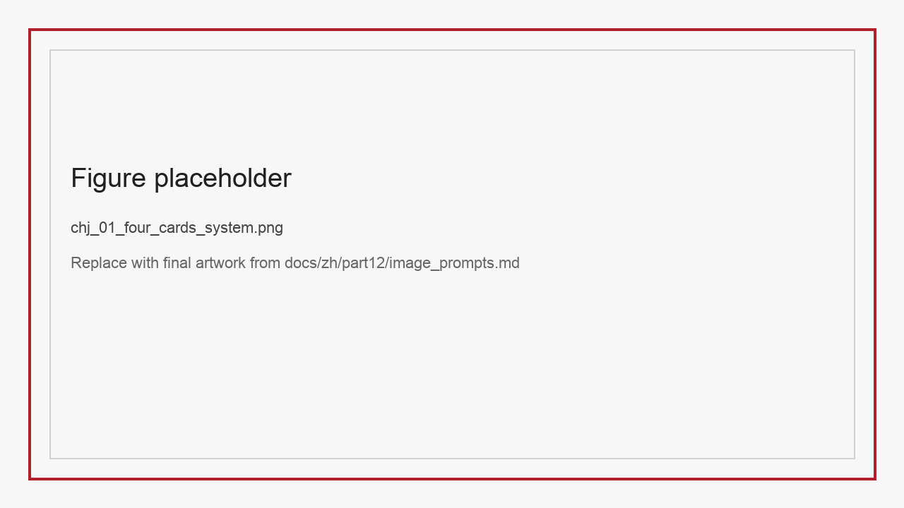
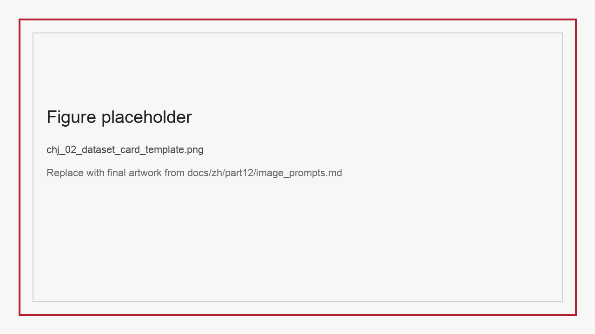
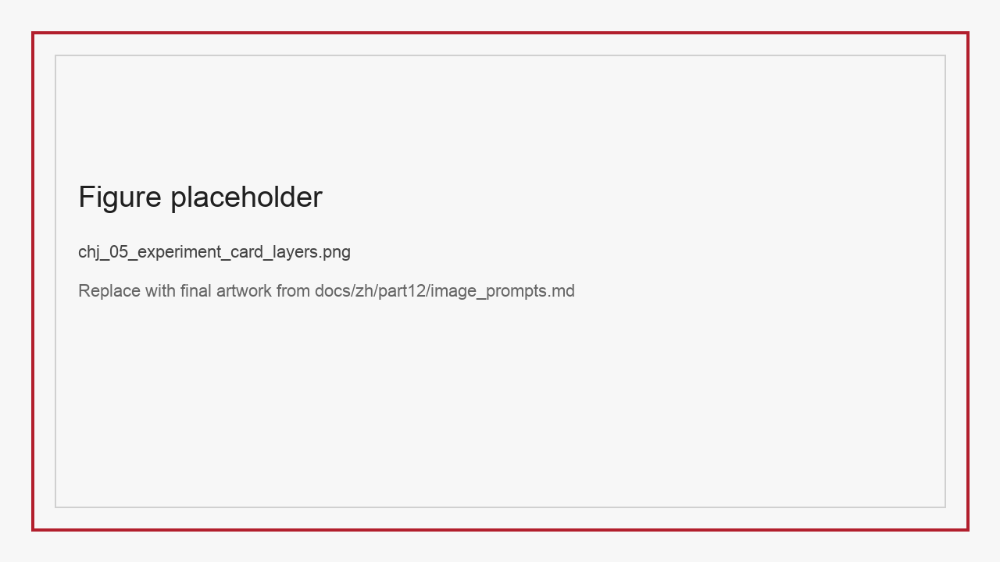
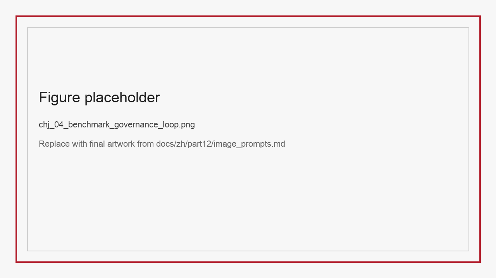

# 第38章：数据工程任务与数据集体系

“我们明明已经拿到三所高校提供的数据集，也看过论文和 README，为什么项目推进了两个月，训练脚本还是接不上、实验结果也无法比较？”  
2025 年冬，一家同时做文档智能、医疗多模态和企业问答系统的团队，在内部复盘会上第一次把这个问题摆到台面上。模型组说问题在于字段不稳定，平台组说问题在于版本不可追踪，标注组说问题在于任务定义经常变化，业务组则反过来抱怨技术团队只会索要“更标准”的数据，却说不清什么叫标准。争论持续了两个小时，最后大家发现，真正缺的不是更多样本，而是一套能够把“数据集”表达成工程资产的公共语言。

在学术语境中，一个数据集往往由四部分构成：论文里的任务描述、下载地址、若干统计表和几组 benchmark 分数。这样的表达方式足以支撑论文复现，却不足以支撑长期工程协作。工程团队面对的不是“这篇论文用了什么数据”，而是六个更直接的问题：样本长什么样、字段如何解析、缺陷在哪里、适合什么算法、实验如何比较、版本如何维护。如果这些问题没有被明确回答，数据集就无法稳定进入采集、清洗、训练、评测和上线闭环。它仍然是“研究对象”，还不是“工程资产”。

本章的目标，就是把这种模糊地带变成可执行结构。我们将引入四张卡片：

- Dataset Card：回答“数据是什么、从哪里来、包含什么、有哪些已知缺陷”。
- Algorithm Card：回答“什么方法最适合接这个数据、输入输出如何定义、容易失败在什么边界”。
- Experiment Card：回答“如何设计公平实验、如何做切片评测、如何把结论回写到数据策略”。
- Benchmark Card：回答“如何开放发布、如何提交结果、如何避免污染、如何持续维护排行榜”。

这四张卡片看起来像文档模板，实际上对应四个不同的工程环节。Dataset Card 服务于数据入口；Algorithm Card 服务于方法选择与接口协商；Experiment Card 服务于实验管理与效果归因；Benchmark Card 服务于开放治理与外部协作。很多团队只写其中一部分，例如在数据集 README 里写数据来源和下载方法，却忽略算法适用边界；或者在论文中给出指标，却没有说明版本、过滤规则和基线提交格式。结果是同一个数据集在不同阶段被不同团队“二次定义”，最终形成不可比较、不可追溯、不可维护的资产碎片。

*图38-1 四卡体系把数据、算法、实验与开放基准放到同一条资产治理链上。*

## 38.1 为什么论文式数据集说明不足以支撑工程

论文式说明的核心优势是简洁，但它的简洁往往建立在默认前提之上。论文作者知道样本的构造背景、负样本采样方法、异常样本分布和过滤脚本版本，因此一句“我们沿用官方设置”已经足够。然而，一旦数据集离开原始作者团队，问题就会开始累积。

第一个问题是字段定义漂移。很多数据集论文会说“每条记录包含问题、答案、证据和元数据”，但真正落到文件层时，字段可能叫 `question`、`prompt`、`query`、`instruction` 中的任何一种；答案可能是字符串，也可能嵌在对话结构中；证据可能是文本片段，也可能是文档页码、bbox、图像索引或工具返回观测。没有明确 schema，工程团队就不得不一边读代码一边猜测含义。

第二个问题是缺陷描述缺失。研究论文中的失败分析通常聚焦模型，而不是聚焦数据。例如作者会说“模型在无线表格上表现较差”，但不会系统说明无线表格样本占比多少、哪些业务类型最容易错、训练集与测试集之间是否存在布局偏移。对数据工程而言，这些信息比平均分更重要，因为它们决定了采样、增强、过滤和主动学习策略。

第三个问题是评测条件不稳定。很多团队习惯直接比较论文表格里的结果，却忽略 benchmark 分数背后的条件差异：输入分辨率是否一致、是否允许外部 OCR、是否使用 test-time augmentation、是否做了人工修正、是否过滤了不可回答样本、是否重新标注了有争议答案。没有 Experiment Card，数字就会被错误地当成“同口径结果”。

第四个问题是开放治理缺席。数据集一旦进入公开使用阶段，就会面临版本升级、脏样本修复、泄漏排查、提交校验和排行榜维护等问题。如果没有 Benchmark Card，团队通常会在 GitHub issue 中临时响应，久而久之形成“知道的人知道，不知道的人踩坑”的隐性制度。

因此，本章主张一个看似朴素但非常重要的观点：**数据集不是一份下载链接，而是一套长期可维护的协作协议**。这种理解与 Data Statements 所强调的“先把语言数据的背景和边界说清楚”是一脉相承的 (Bender and Friedman 2018)。随后出现的 Datasheets for Datasets 与 Model Cards，则进一步把这种说明责任从单篇论文扩展到了数据与模型的长期治理 (Gebru et al. 2021; Mitchell et al. 2019)。所谓“把数据集工程化”，并不是写更多介绍文字，而是把关键假设、约束与接口显式化。

## 38.2 Dataset Card：把样本本身讲清楚

一张合格的 Dataset Card 至少要覆盖七类信息。

第一类是任务范围。它回答“这个数据集究竟服务什么任务”，并明确说明不服务什么任务。以票据文档数据集为例，如果它的目标是 schema-based extraction，就不应被误当成普通 OCR 数据集；如果它强调逻辑一致性，就不能只用字符匹配评价它。

第二类是样本结构。它需要给出最小样本单元、字段 schema、字段类型、必填字段、可空字段、嵌套结构和序列边界。例如在工具使用数据集中，最小单元究竟是一轮问答、一条完整轨迹，还是多轮 conversation bundle，必须在 Dataset Card 中写清楚。

第三类是来源与许可。工程团队需要知道数据来自公开网页、公开学术数据、合成生成、企业内部数据还是人工标注；同时需要明确许可协议、再分发边界、敏感字段处理方式和合规风险等级。

第四类是构造流程。样本是直接采集，还是由强模型生成后筛选？负样本是否人工设计？困难样本是否上采样？是否做了去重、去污染、重标注、bbox 校正、语言翻译或轨迹合成？这些都会显著影响后续训练与评测结论。

第五类是统计分布。除了总量，Dataset Card 还要给出对工程有意义的分布视角，例如任务类型分布、难度分布、模态分布、布局分布、语言分布、工具类别分布、情绪类别分布等。

第六类是已知缺陷。好的 Dataset Card 不回避问题。它应明确写出可能存在的噪声来源、标注争议、样本偏差、类别不平衡、泄漏风险和未覆盖场景。这一部分往往最能节省后续团队的沟通成本。

第七类是推荐使用方式。包括建议的数据切分、建议 baseline、推荐指标、禁止性用法以及与其他数据集的拼接注意事项。

*图38-2 一张可工程复用的 Dataset Card 至少要同时回答任务、结构、来源、分布、缺陷和推荐用法。*

为了让这套模板具体起来，我们看三个非常不同的数据集。

第一个是 StructBill-CN。它不是“中文票据 OCR 数据集”，而是“面向高风险票据结构化抽取的 schema-based benchmark”。它的最小记录单元不是一行文本，而是“文档图像 + 结构化 JSON + 算术一致性约束”。如果不把这一点写清楚，后续团队就会错误地用纯 OCR baseline 去比较它，进而得出误导性结论。

第二个是 Ophiuchus Tool-Integrated Medical VQA。它也不是普通医学 VQA 数据集。对它来说，答案只是监督信号的一部分，另一部分是工具行为监督。样本需要保存 `<tool_call>` 与 `<obs>` 的对应关系。若 Dataset Card 不显式说明这一点，训练团队很可能只提取问答对，直接丢失最有价值的轨迹信息。

第三个是 VoiceStyleControl。它的关键并不只是“有很多语音”，而是“显式绑定了文本内容、speaker 身份、情绪风格和离散 speech token”。这意味着它既可用于风格受控 TTS，也可用于 spoken dialogue response generation。Dataset Card 若只写“语音数据集”，就等于把最核心的控制变量抹平了。

### 38.2.1 Dataset Card 最小模板

| 字段 | 说明 |
| :-- | :-- |
| 数据集名称 | 正式名称、简称、版本号 |
| 任务定义 | 目标任务、非目标任务 |
| 最小样本单元 | 每条记录长什么样 |
| 主要字段 | 字段名、类型、必填性、嵌套关系 |
| 样本来源 | 公开数据、合成数据、人工标注、内部数据 |
| 许可与合规 | License、敏感信息、再分发边界 |
| 构造流程 | 去重、过滤、重标注、增强、蒸馏、轨迹合成 |
| 数据分布 | 任务、难度、语言、模态、布局、类别分布 |
| 已知缺陷 | 噪声、偏差、争议、未覆盖场景 |
| 推荐评测 | 官方指标、建议切片 |
| 推荐使用方式 | 拼接建议、训练注意事项、禁止用法 |

## 38.3 Algorithm Card：让方法选择不再靠经验口耳相传

当团队拿到一个新数据集时，常见的错误不是“不会训练”，而是过早套用熟悉算法。例如看到表格图像，就默认上通用 OCR + HTML 线性化；看到推理轨迹，就默认转成 Long-CoT SFT；看到医学 VQA，就默认做问答对微调。这些选择并不一定错，但若不写清“算法与数据形状之间的匹配关系”，工程就会被历史惯性支配，而不是被任务需求驱动。

Algorithm Card 的作用，就是把“算法适用边界”显式化。它不是论文方法综述，而是一个工程接口说明文档。它至少应回答四个问题：输入长什么样、输出长什么样、依赖哪些监督信号、在什么边界容易失败。

以 SparseTable-Bench 为例，若算法只吃表格图像和 HTML，而不接收 bbox 或空单元标签，那么它从一开始就不适合承担“几何鲁棒性”目标。对 StructBill-CN 来说，如果算法只能优化 token-level likelihood，无法消费 schema 约束或 reward 反馈，它就无法触达数据集真正强调的逻辑一致性目标。对 Latent-Switch-69K 来说，如果算法只把短 CoT 当作普通回答，不处理 latent budget 与 mask，它就失去了数据构造的核心意图。

这说明 Algorithm Card 至少要包含三层信息。第一层是任务接口：输入输出、监督字段、损失或奖励来源。第二层是能力边界：最擅长什么、最不适合什么。第三层是复现门槛：算力、外部依赖、预处理条件、解析脚本和评测接口。

*图38-3 同样叫“多模态数据”，其监督信号和算法接口可能完全不同。*

一个成熟团队往往不会为所有数据集发明新算法，但一定会为主要数据集维护 Algorithm Card。因为真正拖慢协作的，从来不是“没有最强方法”，而是“大家对同一个数据究竟该用什么方法没有共识”。Algorithm Card 的存在，使得模型组、平台组、标注组和业务组在讨论时有共同参照系。

### 38.3.1 用六个数据集说明 Algorithm Card 为什么必要

如果只看名字，StructBill-CN、SparseTable-Bench、Ophiuchus、Latent-Switch-69K、VoiceStyleControl 和 multi-chart 都可以被归入“模型训练数据集”。但一旦从 Algorithm Card 视角审视，它们的差异会立刻变得非常具体。

StructBill-CN 的核心不是看图说话，而是把文档图像映射到 schema-bound JSON，并且最终结果要经得起算术一致性检查。因此，它更适合与结构约束、行级匹配、逻辑奖励和分层解码算法关联，而不是直接套用普通 DocVQA 的问答范式。若团队没有 Algorithm Card，很容易因为“输入是一张图片”就误判为视觉问答问题。

SparseTable-Bench 的难点则在于几何结构与空单元拓扑。对于这类数据，若算法完全不消费 bbox、空单元标记或结构先验，再高的文本解码能力也无法替代空间关系建模。也就是说，它的 Algorithm Card 应明确写出“需要几何监督信号”这一前提。如果省略这句话，团队极有可能在不合适的 baseline 上反复试错。

Ophiuchus 更能说明 Algorithm Card 的必要性。表面上它是一套医学图像问答数据，但真正有价值的是轨迹化的工具行为监督。对这类数据，如果算法没有状态表示、工具调用接口和 observation 消费能力，那么它就只是在浪费数据集最珍贵的部分。Algorithm Card 不是为了夸算法，而是为了阻止工程团队错误接入数据。

Latent-Switch-69K 则提供了另一种边界：这类数据不是“更短的 CoT 数据”，而是带有 latent budget、mask 与切换监督的推理配方。Algorithm Card 如果不写清这一点，团队就会把它当成普通 SFT 样本，最终既看不到效率收益，也误判数据集价值。

VoiceStyleControl 也常被误判为普通语音合成数据。实际上，它的关键在于 speaker 和 emotion 的显式控制变量。如果算法不能显式消费这些条件信号，或者训练框架里根本没有针对风格一致性的评测接口，那么再大的数据量也只能换来“能说话”，而不是“按要求说话”。

这五个例子共同说明，Algorithm Card 在工程上的作用不是介绍 SOTA，而是防止数据价值在接入阶段就被误伤。它强迫团队正面回答一个问题：这个数据集最想训练模型学会什么，而当前方法是否真的具备承接这种监督信号的接口。

## 38.4 Experiment Card：把实验从“跑分”升级为“归因”

很多项目失败，不是因为模型没提升，而是因为团队无法回答“到底为什么提升”。一个数据集加进训练后，分数涨了，是因为样本量更多了，还是因为某种结构化监督真的起效？一次强化学习训练失败，是因为 reward 不好，还是因为 verifier 漏洞太多？一次多模态 benchmark 分数变高，是因为 OCR 输入变强了，还是因为任务本身发生了泄漏？这些问题如果没有预先设计 Experiment Card，最终只能依赖会后猜测。

Experiment Card 的核心不是记录跑了哪些命令，而是把实验设计的对比关系、控制变量、评测切片和回写路径表达清楚。它要求团队在实验开始前就写下三件事：

- 我们想验证的因果假设是什么。
- 我们如何构造对照组与消融组。
- 如果结论成立，应当回写到数据管线的哪一步。

例如在 StructBill-CN 上，最有价值的实验不是单看总分，而是比较 `SFT-only` 与 `SFT + schema reward` 在 `Row-ACR` 与 `Doc-ACR` 上的差异。如果提升只出现在字符匹配而不出现在算术一致性，那么说明策略并没有真正触达任务本质。  
在 Ophiuchus 上，若带轨迹 SFT 的模型与直接 VQA 模型答案准确率接近，但前者工具调用有效性和观测利用率显著更高，那么这说明轨迹数据改善的是“行为策略”，不是简单的“知识回忆”。  
在 multi-chart 数据上，单问准确率和跨图表链路准确率必须分开报告，否则团队容易把“读数能力”误判为“综合推理能力”。

Experiment Card 还要求明确失败样本如何进入下一轮数据资产。例如哪些错误应该进入 hard case 池，哪些错误属于标注问题，哪些错误暴露了 benchmark 本身的缺陷。这正是它与普通实验记录最大的差异：它不是为了归档一次性结果，而是为了驱动下一轮数据改造。

### 38.4.1 一张可执行的 Experiment Card 应该长什么样

很多团队已经会记录实验参数，却仍然做不好 Experiment Card。原因在于他们把实验卡片写成了“命令清单”，而不是“问题清单”。一张真正可执行的 Experiment Card 通常要同时回答下面几组问题。

第一组问题是目标问题。我们究竟想验证什么？是“某个数据集有用”，还是“某种标签字段有用”，还是“某个 reward 设计能让逻辑错误变少”？如果这个问题一开始就没有写清，后续实验结果再多，也难以形成稳定结论。

第二组问题是对照关系。哪些变量必须保持不变，哪些变量允许变化？例如验证 StructBill-CN 的逻辑奖励时，模型结构、训练时长、输入分辨率都应尽量固定，否则提升究竟来自 reward 还是来自其他变化就说不清。  
第三组问题是切片。我们最担心模型在哪些子场景上失败？如果高风险字段、复杂布局、难例问题和边界情绪类别都不单独列出来，实验最后就只能回到一个大平均分上。  
第四组问题是回写动作。如果实验结论成立，下一步到底改数据集哪一步？是补采集、补清洗、补标注、改配比，还是改评测脚本？没有这一步，Experiment Card 就无法成为数据工程闭环的一部分。

*图38-5 一个好的实验卡片应该同时包含问题、对照、切片和回写动作。*

### 38.4.2 单章即可复用的图表任务建议

为了满足单章交付至少包含 3 张图表或表格的验收要求，Ch38 最适合直接放下列四类图表：

1. 四卡体系总览图。  
作用：一图解释 Dataset Card、Algorithm Card、Experiment Card、Benchmark Card 的关系。

2. 六个高校数据集的卡片映射表。  
作用：展示不同数据集如何分别落在结构、推理、工具、风格控制等不同任务象限。

3. 数据集工程化发布流程图。  
作用：从原始说明文档、字段 schema、实验卡片、benchmark card 到 leaderboard 的完整流程。

4. “论文式说明”与“工程式说明”的对比表。  
作用：突出本章主张的增量价值，避免被理解为简单文档整理。

如果图片还未完成，可以先保留如下占位格式，后续由作者补图：

*图38-6 建议对比字段：任务定义、字段 schema、缺陷描述、推荐算法、评测切片、版本治理。*

## 38.5 Benchmark Card：开放发布不是把数据扔上网盘

开放数据集最容易被低估的工作，是“发布后治理”。很多团队在发布阶段只做两件事：上传数据、附一篇说明。真正的难点却都发生在之后：测试集是否被污染、社区提交是否口径一致、bug 如何修复、榜单如何回滚、版本如何升级、课程实验如何维护。

Benchmark Card 就是为了解决这些后续问题而设。它与 Dynabench、SuperGLUE 这类 benchmark 工作所强调的“统一比较条件与长期维护口径”是同一类治理问题 (Kiela et al. 2021; Wang et al. 2019)。从早期 SQuAD 这类以统一问答任务组织社区比较的基准，到更强调多维能力覆盖与评测透明度的整体评测框架，benchmark 的重点其实一直在从“给出题库”转向“明确比较边界” (Rajpurkar et al. 2016; Liang et al. 2023)。它应明确：

- 正式任务定义与禁止性用法。
- 训练/验证/测试切分和隐藏测试策略。
- 提交格式、解析脚本、必填元数据。
- 官方指标与切片指标。
- 外部工具或额外数据是否允许。
- 泄漏、污染、重复提交与人工修正的处理规则。
- 版本发布机制与排行榜维护责任人。

*图38-4 Benchmark 不是静态表格，而是一条持续维护的治理流水线。*

以教学场景为例，如果一个高校数据集未来要进入课程实验，仅提供训练数据和论文远远不够。教师需要一个可运行的 baseline、学生需要统一的提交格式、助教需要可自动评测的脚本、课程负责人需要版本锁定机制。Benchmark Card 正是在开放研究和教学复现之间搭桥。

### 38.5.1 Benchmark Card 之外还需要什么

实践中，Benchmark Card 往往只是开放治理的第一步。真正让一个 benchmark 长期可用的，还包括三项常被忽视的补充资产。

第一项是 baseline bundle。很多数据集公开之后，看似有完整说明，却没有一套真正能跑通的 baseline，结果社区每个人都用不同口径起步，排行榜很快失真。一个可靠的 baseline bundle 至少应包含：数据下载脚本、预处理脚本、训练入口、评测入口、示例提交文件和结果解释说明。

第二项是 adjudication log，也就是争议裁定日志。任何高价值 benchmark 最终都会遇到样本争议：这个问题是否不可回答、这个表格标注是否偏了一列、这个工具轨迹是否存在多解。若这些争议没有留下公开裁定记录，后来的参与者就会不断重复提出同样的问题。对长期维护来说，争议日志和评分脚本同样重要。

第三项是 release note。数据集版本一旦升级，必须明确说明本次修正了什么、为什么修、会不会影响历史结果。对课程实验尤其如此，因为学生使用的是锁定学期版本，而研究团队可能在学期中继续修复 benchmark。没有 release note，就无法同时兼顾教学稳定性与研究演进。

### 38.5.2 从 Ch38 到后续章节的落地路线

Ch38 的价值不在于把所有数据集细节一次讲完，而在于给后续章节提供一套统一表达。更具体地说：

- Ch39 将主要吸收四卡中的“质量字段”“缺陷类型”“主动学习优先级”。
- Ch40 将主要吸收四卡中的“来源与许可”“去污染规则”“隐私字段矩阵”。
- Ch41 将主要吸收四卡中的“样本结构”“证据 card”“trajectory schema”。
- Ch42 将主要吸收四卡中的“实验对照关系”“切片与归因模板”。
- Ch43 将把四卡中的 Benchmark Card 扩展成 leaderboard 与教学实验治理机制。

这一章因此扮演的是“全篇语法层”的角色。它不替代后文案例，而是确保后文所有案例能被放进一套统一框架里，避免每一章都重新定义一遍“什么是好数据集”“什么是好 benchmark”“什么是好实验”。

## 38.6 本章小结

本章解决的是一个常被忽视但极其基础的问题：怎样把“数据集说明”升级为“工程资产表达”。核心结论有三条。

第一，数据集不只是下载地址，而是一套跨角色协作协议。  
第二，Dataset Card、Algorithm Card、Experiment Card 和 Benchmark Card 应分别服务于数据入口、方法选择、实验归因和开放治理。  
第三，只有当数据集的任务边界、样本 schema、监督信号、评测切片和版本规则被显式写出时，它才真正具备进入工程闭环的资格。

下一章将进一步讨论，当数据资产被卡片化之后，团队如何围绕质量评分、缺陷检测、自动修复和主动学习建立可执行的质量工程体系。

## 参考文献

Bender E M, Friedman B (2018) Data Statements for Natural Language Processing: Toward Mitigating System Bias and Enabling Better Science. Transactions of the Association for Computational Linguistics 6:587-604.

Gebru T, Morgenstern J, Vecchione B, Vaughan J W, Wallach H, Daumé III H, Crawford K (2021) Datasheets for Datasets. Communications of the ACM 64(12):86-92.

Kiela D, Bartolo M, Nie Y, Kaushik D, Geiger A, Wu Z, Vidgen B, Prasad G, Singh A, Ringshia P, Ma Z, Thrush T, Riedel S, Waseem Z, Stenetorp P, Jia R, Bansal M, Potts C, Williams A (2021) Dynabench: Rethinking Benchmarking in NLP. In: Proceedings of the 2021 Conference of the North American Chapter of the Association for Computational Linguistics: Human Language Technologies, pp 4110-4124.

Liang P, Bommasani R, Lee T, Tsipras D, Soylu D, Yasunaga M, Zhang Y, Narayanan D, Wu Y, Kumar A, et al. (2023) Holistic Evaluation of Language Models. Transactions on Machine Learning Research.

Mitchell M, Wu S, Zaldivar A, Barnes P, Vasserman L, Hutchinson B, Spitzer E, Raji I D, Gebru T (2019) Model Cards for Model Reporting. In: Proceedings of the Conference on Fairness, Accountability, and Transparency, pp 220-229.

Rajpurkar P, Zhang J, Lopyrev K, Liang P (2016) SQuAD: 100,000+ Questions for Machine Comprehension of Text. In: Proceedings of the 2016 Conference on Empirical Methods in Natural Language Processing, pp 2383-2392.

Wang A, Pruksachatkun Y, Nangia N, Singh A, Michael J, Hill F, Levy O, Bowman S R (2019) SuperGLUE: A Stickier Benchmark for General-Purpose Language Understanding Systems. In: Advances in Neural Information Processing Systems 32.
