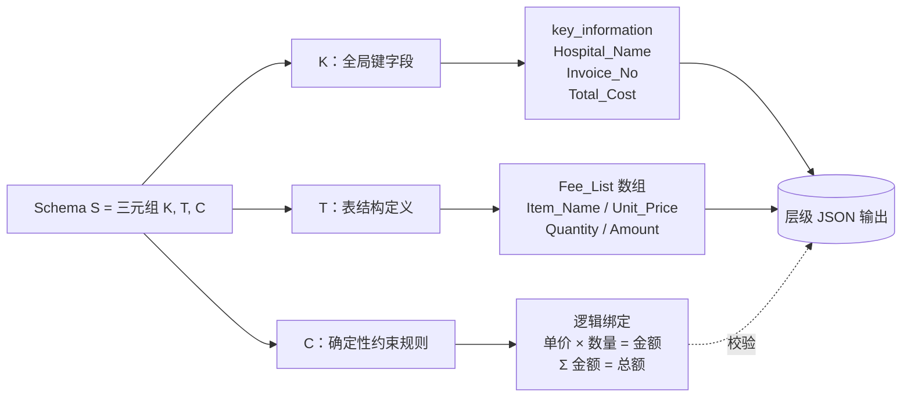
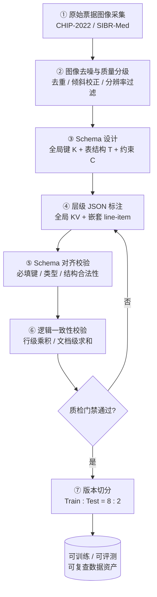
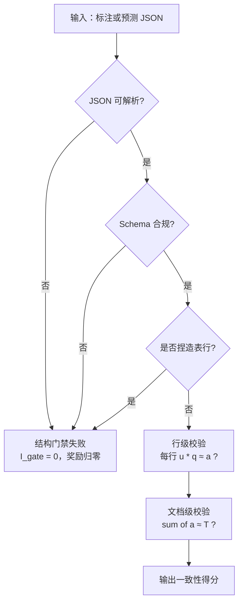

# 第38章：StructBill-CN 票据文档理解数据工程

## 摘要
在医疗票据、费用结算单、药房发票等高风险文档场景中，"把图像里的字读出来"远远不够——真正的目标是把图像直接转写成一个可查询、可入库的数据库记录。然而，当前的多模态大模型在这类任务上面临三重困境：全局键值抽取频繁出现数值幻觉与空间定位漂移，传统表格结构识别在无线表上直接失效，而 token 级损失函数无法感知"看似只差一个字符却在业务逻辑上彻底错误"的算术不一致。这意味着，一个语法完全合法、字段也基本对的 JSON 输出，仍然可能在算术上自相矛盾，无法进入下游财务审计或保险理赔系统。

本章围绕 StructBill-CN 数据集，系统讲述如何从真实票据图像、预定义 schema、层级 JSON 标注与确定性逻辑约束出发，构建一份可训练、可评测、可复查的数据资产。核心不是介绍一个数据集名称，而是说明四件事：第一，这类高风险文档为什么难做结构化抽取；第二，样本结构如何把 schema、层级 JSON 与逻辑约束编码到同一个标注里；第三，构建流水线如何通过逻辑一致性门禁保证标注本身算术自洽；第四，评测协议如何让字段级准确率、结构一致性、算术一致性和 schema 约束违反率串成闭环。

与其他章节不同，本章是第十二篇"专项数据集与数据工程实践"中的一个完整案例。它承接第三篇的文档理解与 OCR、第七篇的 RAG/文档证据组织、第八篇的数据版本与实验追踪、第九篇的数据资产与契约治理以及第十一篇的合规边界，向后则为第十三篇的 VLM 数据配方和第十四篇的多模态 RAG/隐私流水线项目提供一个中文垂直文档的数据工程案例。

## 关键词

StructBill-CN；专项数据集；评测基准；标注流程；质量控制

## 38.0 学习目标

通过本章学习，读者应能够：

- 理解中文票据与医疗费用文档为什么是一个"高风险 × 高密度 × 弱视觉线索"的数据工程挑战，而不仅仅是 OCR 问题。
- 掌握 StructBill-CN 的任务定义——Schema-based End-to-End Unified Extraction——及其与传统表格结构识别的本质差异。
- 理解样本结构中三类监督信号（全局 Key-Value、嵌套 line-item Table、逻辑约束）的设计原理，以及"语义归属优先于物理位置"的标注哲学。
- 掌握一条带逻辑一致性门禁的数据构建流水线，理解采集、去噪、schema 设计、层级 JSON 标注、结构合规校验、逻辑一致性校验和版本切分各阶段的工程要点。
- 掌握多维评测协议——字段级准确率（KV-F1 / Table-F1）、字符级精度（ANLS）、结构一致性（TEDS）、算术一致性（ACR）和 Schema 约束违反率（SCVR）——及其串成闭环的方式。
- 能够对评测结果做错误归因，并把高频错误映射到可操作的数据工程修复动作上。
- 理解高风险文档场景下的隐私、合规与审计注意事项，以及"公开基准 / 私有生产"分层的基本原则。
- 明确本章如何与前后章节形成串联，支撑后续 VLM 数据配方、多模态 RAG 和隐私流水线项目实战。

## 场景引入

某省级医保中心的信息化团队历时两个月训练了一个基于 Qwen2.5-VL(Bai et al., 2025) 的端到端票据抽取系统。离线评测显示，系统在测试集上的字符识别准确率（ANLS）超过 92%，字段级 F1 也接近 90%。团队对此充满信心，准备接入结算对账流水线。

然而，在上线前的业务验收中，财务核算组随机抽取了 200 张无线表费用清单做交叉校验，结果令人意外：近 15% 的记录无法通过"明细金额求和 = 总额"的对账规则，其中多数并非字符识别错误——数字本身都"读对了"——而是行列错位导致金额归属到了错误的行。更严重的是，大约 5% 的清单中出现了"凭空多出的表行"：模型把出院记录中的自由文本段落"编造"成了表格行项目，生成了看似合法实则不存在的费用明细。

验收组提出了三个问题。第一，现有测试集里有没有逐行检查过"单价 × 数量 = 金额"？如果标注本身不做算术一致性校验，模型从何学会守住这条规则？第二，评测指标只看了 ANLS 和 F1，有没有专门度量"多少条记录可以直接入库、不需要人工复查"？第三，如果一张图像质量太差导致本身就不可读，算模型的错还是数据的错？

这三个问题直击核心：一份只标注了"字段在哪里"的数据集，无法暴露算术不一致、结构捏造和行列错位等级联失效；一个只看字符级指标的评测，无法回答"这条记录到底能不能入库"。团队不得不回退到数据工程的起点——重新审视标注规范、校验流水线和评测协议。

StructBill-CN 要解决的，正是这类问题背后的数据工程挑战。

## 38.1 问题场景：票据与医疗费用文档为什么难做结构化抽取

医疗票据、费用结算单、药房发票这类文档，处于一个典型的「高风险 × 高密度 × 弱视觉线索」的交叉地带。它们既不是可以随意改写的自由文本，也不是结构规整、网格清晰的电子表格，而是要被直接灌入下游业务系统（财务审计、保险理赔、ERP）的**结构化记录**。这就决定了任务的真正目标不是「把图像里的字读出来」，而是「把图像直接转写成一个可查询的数据库对象」。

从数据工程视角看，这类文档的难点可以归纳为三层，它们恰好对应了后文数据集要刻意暴露与覆盖的三类挑战。

第一层是**全局键值（Key-Value）抽取本身就不可靠**。当模型去检索「总金额」「发票号」这类离散字段时，常见两种失败：一是数值幻觉，把图像里没有的数字凭空补全或抄错(Liu et al., 2024)；二是空间定位漂移，抓到了相邻列、相邻行的值。对自由文本任务来说，这种偏差可能无关紧要；但对财务记录，一个数字错位就是一条不可用的低质量数据。

第二层是**传统表格处理范式在这里直接失效**。学术界长期聚焦于表格结构识别，其核心假设是「有可见的网格线，可以预测物理坐标」。然而真实票据中充斥着无线表：没有竖直分隔线，密集的数字列在视觉上彼此粘连，基于视觉分割的方法极易发生行列错位。更关键的是，TSR 输出的是「物理结构」，而业务系统要的是「语义 schema」，两者之间还隔着一层无法自动跨越的鸿沟。

第三层，也是最容易被忽视的一层，是**逻辑一致性**。票据里隐含着确定性的算术公理：单行的「单价 × 数量 = 金额」，整单的「明细金额求和 = 总额」。这些约束在 token 级别上几乎不可微——一个错误的金额 `A'` 与正确金额 `A` 可能只差一个字符，交叉熵损失看不出差别，但在业务逻辑上它是彻底错误的。也就是说，**一个语法上完全合法、字段也基本对的 JSON，仍然可能在算术上自相矛盾**。

把这三层叠加起来，就能理解为什么这是一个数据工程问题，而不只是模型问题：要让模型学会「看懂语义布局 + 守住算术约束」，前提是先有一份**把图像、schema、层级 JSON、表格字段和逻辑约束都显式编码进去**的数据资产，并且这份资产是可训练、可评测、可复查的。StructBill-CN 要解决的，正是这个数据资产的构建问题。

### 38.1.1 管线范式与端到端范式：为什么"读对字"不等于"抽对数据"

要理解 StructBill-CN 的取舍，需要先看清文档抽取的两条技术路线。**管线范式**把任务拆成文本检测、OCR 识别、信息抽取三段独立处理，模块清晰、可解释，长期主导工业落地；但其高风险弱点是**误差累积**——检测或识别阶段的错误会不可逆地传播到抽取阶段，前一步抓错一个框，后面再好的抽取也无力回天。**端到端生成范式**则用一个多模态模型直接从图像生成结构化输出，避免了级联误差，但又带来新问题：通用模型倾向于生成"语义流畅的描述"，而不是"严格的数据库记录"，因缺乏领域对齐而频繁出现格式错误或关键信息遗漏。

StructBill-CN 站在端到端这一侧，但它要补的恰恰是端到端范式的短板：用 schema 约束把"流畅描述"逼回"严格记录"，用逻辑约束把"看起来对"逼成"算术上对"。这意味着数据集本身必须承载这两类约束——否则模型没有任何信号可学。这也是它与 FUNSD、DocVQA等只标注键值对或物理框的数据集的根本分野。

### 38.1.2 一次错位如何级联成一条废记录

逻辑约束之所以重要，是因为票据数据的错误**不是孤立的**。设想一张无线费用清单，其中某一列存在稀疏空值。模型在缺少网格线的情况下发生了行错位：把第 3 行的金额读到了第 2 行。单看字符识别，每个数字都"读对了"，ANLS 甚至很高；但行级「单价 × 数量 = 金额」会在错位行失败，文档级「Σ 明细 = 总额」也会失衡。结果是：一条字符识别近乎完美的记录，在业务上彻底不可用——它既不能入库，也不能用于理赔核算。

这正是为什么本章反复强调"算术自洽"必须成为一等公民：在高风险结构化抽取里，**衡量数据质量的单位不是字符，而是可入库的记录**。一份只看字符级指标的数据集，无法暴露这种级联失效；而 StructBill-CN 通过显式的逻辑约束与 §38.4 的一致性门禁，把"这条记录到底能不能用"变成了可标注、可校验、可度量的对象。

---

## 38.2 数据集概览：规模、来源、业务 schema 与任务定义

### 38.2.1 规模与来源

StructBill-CN 共包含 **2,300 张**高分辨率票据图像，覆盖 **6 类不同的业务 schema**，全部来自两个公开医疗数据集：CHIP-2022与 SIBR-Med。这一组合刻意混合了有线网格表、文本密集型记录与无线表三种形态，使模型必须跨越不同分布，而不是在单一文档样式上做模式匹配。数据组成如表 38-1。

*表 38-1：StructBill-CN 数据组成与特征（原始材料）*

| 来源子集  | 文档类型        |      数量 | 表格形态 |
| --------- | --------------- | --------: | -------- |
| CHIP-2022 | 住院发票        |       680 | 有线网格 |
| CHIP-2022 | 门诊发票        |       340 | 有线网格 |
| CHIP-2022 | 药房发票        |       340 | 有线网格 |
| CHIP-2022 | 出院记录        |       340 | 文本密集 |
| SIBR-Med  | 费用清单        |       400 | 无线表   |
| SIBR-Med  | 通知单          |       200 | 无表格   |
| **合计**  | **6 类 schema** | **2,300** | **混合** |

需要强调的是，这里所有图像均来自公开学术数据集，这是一个**数据合规上的有意选择**：把可发布的 benchmark 建立在公开来源之上，把真实私有数据留到生产部署阶段再按合规流程接入（详见 §38.6 的隐私与审计讨论）。这种「公开基准 / 私有生产」的分层，本身就是高风险文档数据工程的一个基本原则。

### 38.2.2 任务定义

形式上，给定一张文档图像 $X$ 与一份 schema 定义 $S=\{K, T, C\}$，其中 $K$ 是待抽取的全局键字段集合，$T$ 是表结构定义，$C$ 是确定性约束规则。目标是学习一个策略，使生成的结构化序列 $Y$ 在给定 $X$ 与 $S$ 条件下最大化后验概率 $P(Y\,|\,X, S)$。

与传统的端到端文本生成不同，这个任务要求输出**严格遵守预定义的结构约束与业务逻辑**：它不仅要"内容对"，还要"结构合法"且"算术自洽"。正是 $S$ 中这三个组成部分——键字段、表结构、约束规则——把一个 OCR/抽取任务，升级成了一个「结构 + 逻辑」双重受约束的抽取任务，也直接决定了后文标注规范与评测协议的设计。

### 38.2.3 数据集刻意暴露的三类核心挑战

StructBill-CN 在选材与标注上刻意保留了三类"难"，使它成为一个真正的压力测试基准，而不是规整票据的"舒适区"。

**其一，缺乏显式视觉线索。** 无线表的普遍存在——缺少竖直分隔符——导致密集数字列在视觉上彼此粘连，频繁引发基于分割方法的列错位与失败。对数据工程的含义是：标注阶段必须以语义而非几何来切列，质检阶段必须有列归属的复核手段。

**其二，结构歧义与幻觉风险。** 非结构化文本块会诱导模型把正文"编造"成表格行；而稀疏空值列又会引发整行平移错误。对数据工程的含义是：需要为相应 schema 显式声明反幻觉约束，并在标注规范中明确空值的占位与对齐规则。

**其三，极端密度与视觉噪声。** 真实业务文档会产生超长序列，挑战长程注意力；物理退化（污损、模糊）与语义相近字段，则严苛地考验细粒度判别与稳健性。对数据工程的含义是：采集阶段就要做质量分级与分桶，把"图像不可读"与"模型读不对"从源头分离。

这三类挑战不是缺陷，而是设计目标：它们决定了 §38.4 流水线里"为什么要有逻辑门禁、为什么要做质量分级、为什么标注要语义优先"。

不同 schema 的图像形态也各有侧重，理解这一点有助于在切分与采样时保持分布可控：CHIP-2022 的住院/门诊/药房发票是**有线网格**，结构相对规整，主要考验密集字段的精确抽取；出院记录是**文本密集型**，几乎没有表格，考验长文本理解与全局键值定位；SIBR-Med 的费用清单是典型**无线表**，是行列对齐与逻辑一致性的主战场；通知单则**无表格**，用于检验模型在"该没有表时不要捏造表"上的克制能力。

---

## 38.3 样本 schema：Key-Value、Line-Item Table、层级 JSON 与逻辑约束

### 38.3.1 三类监督信号

StructBill-CN 的每个样本，把一张票据图像与一份预定义 schema 配对，并同时携带三类互补的监督信号：

1. **全局 Key-Value 结构**：捕获文档级属性，例如医院名称、发票号、总金额。
2. **嵌套的 line-item Table**：每一行携带单元格级字段，例如项目名称、单价、数量、金额。
3. **schema 绑定的逻辑约束**：让每一个数值字段都可以被确定性的算术规则验证。

与传统「转写 + 包围框」基准最大的不同在于：StructBill-CN 的标注**语义归属优先于物理位置**——在存在打印偏移或无线表布局时，标签按业务逻辑上下文分配，而不是按几何坐标。这迫使模型从内容逻辑去推断结构，而不是依赖肤浅的视觉定位。这一条标注哲学，是后面整个质量控制与评测能否成立的根基。

为什么选择**层级 JSON**而不是扁平键值或物理坐标？原始材料的标注协议给出了清晰的工程理由：层级 JSON 把 ground truth 组织成"全局键值属性 + 嵌套行项目列表"，**直接对标真实数据库 schema**，从而把下游后处理降到最低——抽取结果可以近乎零转换地灌入业务系统。相比之下，扁平键值无法表达"一张单里有多行明细"的一对多结构，而物理坐标（包围框）虽然精确，却把"语义"留给了下游去猜。层级 JSON 是"ingestion-ready（可直接入库）"这一目标的自然产物。

语义归属优先的标注原则，在实践中常常与直觉相反。举例来说，当一行因打印偏移而在视觉上落到了相邻列下方，标注员应当依据"它在业务上属于哪个字段"来打标，而不是"它在像素上压在哪条线下"。这条原则把判断依据从几何转向逻辑，代价是标注难度更高、对标注员的领域理解要求更高，但收益是模型被迫学习内容逻辑而非视觉投影——这正是无线表场景下唯一可靠的对齐策略，也是后文质检与评测口径必须围绕"语义正确"而非"位置正确"来设计的原因。

### 38.3.2 Schema 到层级 JSON 的映射

schema 的三个部分 $\{K, T, C\}$ 与最终的层级 JSON 一一对应：$K$ 落到全局 `key_information` 对象，$T$ 落到 `Fee_List` 数组及其行内字段，$C$ 则不直接成为字段，而是作为「校验关系」贴附在数值字段之上。结构关系如图 38-1。



*图 38-1：Schema 到层级 JSON 的结构示意 —— 键字段与表结构构成可见的 JSON 节点；约束规则不是节点，而是贴附在金额、总额等数值字段上的可验证关系。*

这种"约束作为关系、而非字段"的设计，是层级 JSON 能同时服务于训练与评测的关键。约束 $C$ 不占据 JSON 的任何键位，因此不会改变输出格式；但它在校验阶段被实例化为一组等式，既可以在构建期检验标注是否自洽，又可以在评测期度量模型输出是否守约。一份 schema 的演进（例如新增一条"折后金额 = 金额 × 折扣率"），只需在 $C$ 中追加规则，而无需改动已有字段与历史标注——这正是数据契约可向后兼容演进的基础。

### 38.3.3 完整样本结构示例

下面给出一个抽象化的层级 JSON 样本（字段与逻辑关系来自原始材料的样例）。注释中标出了两类逻辑校验点：行级与文档级。

**StructBill-CN 样本结构示例（抽象化层级 JSON）：**

```json
{
  "key_information": {
    "Hospital_Name": "<医院名称>",
    "Invoice_No": "4700852972",
    "Total_Cost": 699.02              // = Σ Amount   [文档级校验]
  },
  "Fee_List": [
    {
      "Item_Name": "<项目 A>",
      "Unit_Price": 54.76,
      "Quantity": 1.00,
      "Amount": 54.76               // = Unit_Price × Quantity   [行级校验]
    },
    {
      "Item_Name": "<项目 B>",
      "Unit_Price": 2.10,
      "Quantity": 2.00,
      "Amount": 4.20                // = 2.10 × 2.00
    }
  ]
}
```

这个样本框很小，但它把本章的闭环讲清楚了：`key_information` 与 `Fee_List` 是**结构**，注释里的等式是**逻辑约束**，两者都要被标注、被校验、被评测。后文的流水线、质检与指标，全部围绕「如何让这个 JSON 既结构合法又算术自洽」展开。

### 38.3.4 字段类型、标注规则与评测指标的对应关系

不同字段类型的标注规则与评测方式并不相同。把它们对齐成表，是后续标注规范与评测脚本的"契约"，也是新标注员上手的速查表。

*表 38-2：字段类型 × 标注规则 × 评测指标对照表*

| 字段类别    | 代表字段（来自样例）               | 标注规则                              | 主要评测指标           |
| ----------- | ---------------------------------- | ------------------------------------- | ---------------------- |
| 文本属性    | `Hospital_Name`、`Item_Name`       | 语义归属优先；长文本容忍轻微 OCR 噪声 | ANLS / Entity-Level F1 |
| 编号/字符串 | `Invoice_No`                       | 精确转写；保留前导零与分隔符          | 精确匹配 F1            |
| 数值属性    | `Unit_Price`、`Quantity`、`Amount` | 标准化小数格式；绑定行级算术规则      | 精确匹配 F1 + Row-ACR  |
| 全局汇总    | `Total_Cost`                       | 与明细求和绑定                        | Doc-ACR                |
| 结构/拓扑   | `Fee_List` 行集合                  | 行级对齐；空值用占位保持拓扑          | TEDS / Table-F1        |

表 38-2 中字段均取自原始材料的样例 JSON；ANLS、F1、TEDS、ACR 等指标定义见 §38.5。

---

## 38.4 构建流水线：采集、去噪、标注、Schema 对齐、逻辑校验、版本切分

StructBill-CN 通过一条多阶段流水线构建，核心诉求是**同时保留语义内容与业务逻辑拓扑**，并在每一步设置可回溯的质量门禁。整体数据流如图 38-2。



*图 38-2：StructBill-CN 数据构建流水线 —— 关键设计是第 ⑥ 步与质检门禁：未通过逻辑一致性校验的样本会回流到标注阶段重做，而不是直接进入训练集。*

下面逐阶段说明数据工程要点。

**① 采集。** 图像来自公开学术语料 CHIP-2022 与 SIBR-Med，刻意偏重无线表、稀疏布局与长费用清单等"难样本"，以保证基准能够暴露真实失败模式，而不是只覆盖规整票据。

**② 去噪与质量分级。** 这一步是后续标注与逻辑校验能否成立的前提，工程上至少应包含：重复图像去重、倾斜/旋转校正、过低分辨率与严重残缺图像的过滤或单独分桶。质量分级的产物不只是"干净图像"，还包括一份图像质量元数据，供后续错误归因时区分"模型错"还是"图像本身不可读"。

**③ Schema 设计。** 为每一类业务文档定义 $S=\{K, T, C\}$：先确定全局键字段 $K$ 与表结构 $T$，再把领域算术规则写进约束 $C$（行级乘积关系、文档级求和关系）。schema 是这份数据资产的"契约"，它一旦冻结，标注规范与评测脚本都以它为准（参见 §38.7 对 Ch27–Ch30 数据契约治理的回链）。

**④ 层级 JSON 标注。** ground truth 被组织成"全局 Key-Value 属性 + 嵌套 line-item 列表"的 ingestion-ready 层级 JSON。标注按语义归属（而非几何坐标）分配标签，从而最小化下游后处理。对无表格的通知单这类文档，`Fee_List` 可为空，但 schema 结构保持一致，避免格式分叉。

**⑤ Schema 对齐校验。** 这是第一道自动门禁：检查 JSON 是否可被标准解析、是否包含 schema 规定的全部必填根键与表键、字段类型是否匹配。任何结构非法的标注在此被拦截。

**⑥ 逻辑一致性校验。** 这是 StructBill-CN 区别于普通抽取数据集的核心步骤——**对标注本身做算术自洽性检查**：逐行验证「单价 × 数量 ≈ 金额」，并验证「明细金额之和 ≈ 总额」（均带容差 $\varepsilon$ 以吸收 OCR 浮点误差）。校验流程见图 38-3。只有当标注本身算术自洽时，它才能作为可靠的逻辑监督信号；否则后续基于该数据训练的奖励信号就是"脏"的。



*图 38-3：逻辑一致性校验流程 —— 同一套门禁逻辑在两处复用：构建期用于拦截不自洽的标注，评测/训练期用于给模型输出打一致性分（即 §38.6 的 SCL-Reward 中的结构门禁 $I_{gate}$ 与逻辑奖励 $R_{logic}$）。这种"构建即评测"的复用，是保证训练目标与评测口径一致的关键工程手段。*

**⑦ 版本切分。** 数据集按训练 : 测试 = **8:2** 切分。工程实践上建议：切分时保证 6 类 schema 在两侧的分布可控、留出真正的跨布局测试样本；并可从训练集再切出一个小验证子集用于调参，但不污染测试集。每一个版本都应带上数据指纹与统计快照，接入数据版本与实验追踪体系。

### 38.4.1 数据血缘与元数据：让每条记录都可回溯

上述七个阶段如果只产出"图像 + JSON"，是不够的。一份可复查的数据资产，还必须为每条样本附带一组**血缘元数据**，至少包括：源子集与原始文件标识、所属 schema 及其版本号、图像质量分级（来自第②步）、标注人与复核人、各项逻辑校验的通过/失败结论及容差、以及最终所属的数据切分。

这组元数据有三重作用。**第一，错误归因。** 当某指标回归时，可据此区分是图像质量、标注口径还是模型能力的问题。**第二，审计合规。** 高风险数据要求"谁、在哪个版本、为什么改"全程可追溯（详见 §38.6.3）。**第三，可复现。** schema 版本与切分指纹被钉死后，任何一次实验都能精确复原它消费的数据子集。换言之，元数据不是附属品，而是把"数据集"升级为"数据资产"的关键一环。

值得单独点出的是 **SFT 暖启数据的特殊地位**。SRPO 的第一阶段需要一份能让模型产出"语法合法 JSON"的监督数据；如果这部分数据本身结构不干净，强化学习阶段就失去了稳定的起点。因此 §38.4 第⑤步的结构合规门禁，对暖启数据尤其严格——宁可回流复标，也不让结构非法的样本进入 SFT 集。

---

## 38.5 评测协议：字段、结构、表格、算术一致性与错误归因

StructBill-CN 的评测沿三个维度展开——**抽取准确率、结构质量、逻辑一致性**，对应的指标如下。

- **KV-F1 / Table-F1（Entity-Level F1）**：分别衡量全局键值字段与表格行内字段的抽取精确率与召回率。
- **ANLS（Average Normalized Levenshtein Similarity）**：长文本字段的字符级准确率，对轻微 OCR 噪声有容忍。
- **TEDS（Tree-Edit-Distance-based Similarity）**：基于树编辑距离的相似度，衡量生成 JSON 的拓扑正确性，对复杂嵌套表格尤为关键。
- **ACR（Arithmetic Consistency Rate，算术一致性率）**：核心逻辑推理指标，由两部分组成——**Row-ACR**（满足「单价 × 数量 ≈ 金额」的表行占比）与 **Doc-ACR**（满足「Σ 明细金额 ≈ 总额」的文档占比）。
- **CHIP-2022 Score**：对公开 CHIP-2022 子集，另报官方榜单的 Score（全字段 Macro-F1，类目/数值字段用精确匹配 F1、文本密集字段用归一化编辑距离）。

这些指标之所以要**分维度并存**，是因为它们彼此无法替代：F1 衡量"抓没抓到、抓得对不对"，但对一个数字是 54.76 还是 54.67 并不敏感（两者编辑距离很小）；ANLS 对长文本的轻微噪声宽容，却不能保证算术正确；TEDS 关注的是 JSON 树的拓扑——行列对齐、嵌套层级、合并单元格的恢复——它能抓住"结构塌了"的问题，却管不了"内容错了"；只有 Row-ACR 与 Doc-ACR 直接回答最关键的问题："这些数字加得起来吗？"一个健康的评测必须同时盯住这四类指标，因为任何单一指标都可能给出"虚高"的安全感。

把这些指标与 §38.3 的字段类型对齐，就构成了一个**评测闭环**：文本字段看 ANLS / Entity-F1，编号看精确匹配，数值字段看 F1 并叠加 Row-ACR，全局总额看 Doc-ACR，整体结构看 TEDS / Table-F1。换句话说，schema 定义了字段 → 标注规范决定了 ground truth → 逻辑校验产出一致性标签 → 指标分维度度量，四者首尾相接，没有任何一环是悬空的。

### 38.5.1 Schema 约束违反率：一个面向工程的补充指标

学术指标偏正向（"对了多少"），但生产监控更关心负向（"违反了多少"）。可以从 §38.4 的门禁逻辑直接派生一个**Schema 约束违反率**：在一批输出中，未通过结构门禁或逻辑校验的样本占比。它本质上是结构门禁 $I_{gate}$ 与一致性校验的"不通过率"，与 Doc-ACR/Row-ACR 互补——前者回答"算术错没错"，SCVR 回答"包括结构在内一共有多少条不可直接入库"。这个指标不需要新增标注，只需复用图 38-3 的校验流程，因此非常适合做线上数据质量看板与回归门禁。

SCVR 是本章为工程监控目的给出的派生指标定义（不引入任何新的数据事实或数值），其判定逻辑完全复用原始材料中的结构门禁与逻辑校验。

### 38.5.2 可复现评测的工程约定

逻辑约束让评测更可信，但要让评测**可复现**，还需要一组工程约定：固定测试切分并钉死其指纹、固定 schema 版本、固定指标实现（同一份 TEDS / ACR 脚本）、控制随机种子。对生成式模型而言，解码参数与运行次数尤其影响可复现性。

**为吸收大模型解码方差，在评测时采用 temperature=0.9、top_p=1.0，并对每个模型取 **8 次独立运行**的平均后再报告指标。单次运行的分数在高温采样下波动较大，多次平均才能得到稳定可比的结论。工程上建议把"解码参数 + 运行次数 + 随机种子"一并写入评测配置并随结果归档。

### 38.5.3 错误归因与修复动作

评测不止给一个分数，更要能把错误归因到可操作的修复动作上。表 38-3 把本数据集刻意暴露的失败模式，与对应的数据工程修复手段配对。这张表既是评测后的"分诊单"，也是标注规范的"反向校验清单"。

*表 38-3：常见错误与修复动作表*

| 错误类型 | 现象                      | 根因                     | 数据工程修复动作                                             |
| -------- | ------------------------- | ------------------------ | ------------------------------------------------------------ |
| 数值幻觉 | 金额/数量被凭空生成或抄错 | token 级近似、缺逻辑约束 | 绑定 P×Q=A 与 Σ=T 约束；以 Doc-ACR 作为质检门禁；构造数值负样本 |
| 空间漂移 | 字段抓到相邻列/行的值     | 无线表缺网格线           | 语义归属标注；列不变锚点对齐复查；标注时记录列归属           |
| 捏造表行 | 把正文文字编造成表格行    | 非结构文本块诱导         | 幻觉过滤门禁（$I_{gate}=0$）；为相应 schema 打 `anti_hallucination` 标记 |
| 行错位   | 稀疏空值列导致整行平移    | 空单元缺占位             | 空值占位标注；行级匹配（Hungarian）复查；空列样本单独分桶    |
| 结构非法 | JSON 不可解析 / 缺必填键  | 自由生成、未约束         | Schema 合规门禁；结构校验脚本前置；schema 版本冻结           |
| 汇总不平 | Σ 明细 ≠ 总额             | 缺文档级校验             | 文档级一致性校验；超容差样本回流复标并标注成因               |

错误归因的工程价值在于：当某个指标下降时，能立刻定位是"图像不可读（②的质量问题）""标注口径漂移（④的规范问题）"还是"模型能力不足（训练问题）"。结合 §38.4 第②步产出的图像质量元数据，可以把"模型错"与"数据本身不可解"分开统计，避免把低质量数据的锅扣到模型头上。

更进一步，错误归因表（表 38-3）应当与标注规范双向绑定：每当线上发现一类高频错误，就回看它对应的标注规则是否存在歧义或盲区，必要时更新规范并触发受影响样本的回流复标。这样，评测就不再是训练结束后的"一次性体检"，而成为持续驱动数据质量迭代的反馈回路——这也是把 StructBill-CN 当作"活的数据资产"而非"静态测试集"来运营的核心做法。

---

## 38.6 工程复盘：适合训练什么、评估什么、不该滥用到哪里

### 38.6.1 数据资产支撑的算法：SRPO（点到为止）

本章不展开模型细节，只从"数据如何被消费"的角度说明三者关系：

- **数据 → 奖励信号。** SRPO 的核心是把 §38.3 的离散 schema 规则，转成稠密、可验证的奖励——即 **SCL-Reward**：$R_{total}=I_{gate}\cdot[\lambda\cdot R_{content}+(1-\lambda)\cdot R_{logic}]$。其中结构门禁 $I_{gate}$、内容对齐 $R_{content}$（用 Hungarian 匹配解决表行乱序）、逻辑校验 $R_{logic}$（即图 38-3 的行级/文档级一致性）三者，全部直接读取本数据集的层级 JSON 与逻辑约束。这正是为什么数据集必须先在构建期做逻辑自洽校验：**奖励的可靠性，等于标注的可靠性**。
- **训练消费方式。** SRPO 分两段消费数据：先用数据做 SFT 暖启，得到能产出合法 JSON 的参考策略；再用 GRPO(Shao et al., 2024) 做强化学习，按组采样多个候选、用 SCL-Reward 打分、以组内相对优势更新。原始材料给出的训练配置为：SFT 10 epochs、学习率 1e−5、batch size 128；GRPO 组大小 G=8、奖励系数 $\lambda=0.4$、$\gamma=0.6$；硬件为 8× NVIDIA A800（80GB）。
- **效果（定性）。** 原始材料表明，标准 SFT 的逻辑分会在 84% 附近"封顶"，而引入逻辑奖励后 Row/Doc-ACR 有约 10 个百分点的提升——说明本数据集的逻辑标注确实把"算术一致性"变成了可优化的目标。本章不复述完整榜单，避免写成模型综述。

从数据消费的角度还能看出一个常被忽视的细节：内容对齐 $R_{content}$ 之所以要用 Hungarian 匹配(Kuhn, 1955) 做"行级一对一对齐"，正是因为模型生成的行序可能与 ground truth 不一致，或存在漏检、误检。这要求数据集的每一行都具备可用于匹配的、足够判别的字段（如项目名 + 单价 + 数量），而不是只有一个模糊的文本块。换句话说，奖励机制能否稳定工作，反过来对标注的"行级可区分性"提出了要求——这再一次说明：算法设计与数据标注规范是一体两面，必须协同设计。

### 38.6.2 适合训练什么、评估什么

适合训练：**schema 受约束的中文垂直文档抽取小模型**。本数据集天然适配"SFT 暖启 + 规则奖励 RL"的配方——它既提供合法结构的监督，又提供可验证的逻辑监督，因此适合训练 3B 级别的多模态文档模型在无线表、稀疏布局上的稳健对齐能力。

适合评估：**逻辑一致性与结构保真度**，而不仅仅是字符识别。它能回答"模型会不会算术自相矛盾""会不会捏造表行""能不能守住 schema"这类传统 OCR 基准回答不了的问题。

### 38.6.3 高风险场景下的隐私、合规与审计

医疗费用文档属于高风险数据，即便本基准使用的是公开学术来源，其方法论一旦扩展到真实生产数据，必须遵守以下底线。

**隐私与去标识。** 任何接入的真实票据/病历数据，必须在进入流水线前完成受保护健康信息（PHI）的去标识与脱敏；公开发布的基准只应基于已授权、已脱敏或公开的来源。

**人在回路。** 抽取结果用于理赔、审计、入库等下游决策时，必须保留人工复核环节；模型定位是**辅助工具**，不是自动决策器。

**可审计性。** 每条记录应可回溯到：源图像版本、schema 版本、标注人/复核人、逻辑校验结论。结合 §38.5 的 SCVR 与错误归因表，形成"谁、在哪个版本、为什么改"的审计链路。

### 38.6.4 不该滥用到哪里

明确边界同样重要。这份数据集**不适合**：

- 直接驱动**临床诊疗或自动理赔**的无人复核决策——它评测的是抽取一致性，不承担医疗/金融决策责任。
- 当作**通用 OCR 或版面还原**基准——它的标注是语义归属优先、逻辑约束绑定的，并非物理坐标还原。
- 在**跨语言/跨域**场景下不加验证地直接套用——它是中文医疗票据垂直数据，迁移到其他语言或行业需要重新做 schema 设计与逻辑校验。
- 作为**多任务联合训练**中与分类任务硬混合的唯一数据——原始材料指出，算术抽取与语义分类联合训练时存在负迁移，会拖累数值字段，需谨慎设计任务配比。

### 38.6.5 数据视角的演进方向

原始材料在展望中提到两点，对数据工程尤其有启发。其一，**多任务负迁移**：当算术抽取与分类任务联合训练时，语义理解与严格推理的优化梯度可能冲突，导致数值字段退化。这提示数据配方设计者：在 VLM 数据混合中，逻辑敏感的抽取数据与语义分类数据的配比、采样温度与课程顺序，本身就是需要被实验追踪的超参数，不能简单"一锅烩"。其二，**从确定性约束走向自适应奖励**：当前的逻辑奖励依赖手写的算术规则，未来可演进为数据驱动的自适应奖励。对数据集而言，这意味着约束规则 $C$ 不必永远静态；可以预留一个"规则版本"维度，让 schema 的逻辑约束随业务演进而迭代，并用版本治理保证每次评测口径一致。

这两点共同说明：StructBill-CN 不是一个一次性产物，而是一个**可演进的数据契约**——schema、约束、切分都带版本，能随下游 VLM 与 RAG 项目的需求持续生长。

## 本章小结

StructBill-CN 不只是"又一个数据集"，它解决的数据工程问题是：**如何把高风险中文票据/医疗费用文档，从图像 + schema + 层级 JSON + 表格字段 + 逻辑约束出发，构建成一份可训练、可评测、可复查的数据资产**。

本章用一条带逻辑一致性门禁的构建流水线、一套字段—标注—逻辑—指标对齐的评测闭环、一份可读的样本结构示例，以及隐私/合规/审计的底线约束，把这个问题讲成了一个可复现的工程范式。核心结论有三点。第一，在高风险结构化抽取里，衡量数据质量的单位不是字符，而是可入库的记录——只看字符级指标的数据集无法暴露行列错位、算术不一致和结构捏造等级联失效。第二，schema 既是标注规范的"契约"，也是评测脚本的"基线"，还是逻辑奖励的"输入"——三者首尾相接，任何一环悬空都会让整个体系失效。第三，StructBill-CN 不是一个一次性产物，而是一个可演进的数据契约——schema、约束、切分都带版本，能随下游 VLM 数据配方、多模态 RAG 与隐私流水线项目的需求持续生长。

## 参考文献

Bai, S., Chen, K., Liu, X., et al. (2025). Qwen2.5-VL Technical Report. *arXiv preprint arXiv:2502.13923*. 

Blecher, L., Cucurull, G., Scialom, T., and Stojnic, R. (2023). Nougat: Neural Optical Understanding for Academic Documents. *arXiv preprint arXiv:2308.13418*. 

Huang, Y., Lv, T., Cui, L., Lu, Y., and Wei, F. (2022). LayoutLMv3: Pre-training for Document AI with Unified Text and Image Masking. *Proc. ACM Multimedia*. 

Huang, Z., Chen, K., He, J., Bai, X., Karatzas, D., Lu, S., and Jawahar, C.V. (2019). ICDAR2019 Competition on Scanned Receipt OCR and Information Extraction. *Proc. ICDAR*, pp. 1516–1520. 

Hu, E.J., Shen, Y., Wallis, P., Allen-Zhu, Z., Li, Y., Wang, S., Wang, L., and Chen, W. (2021). LoRA: Low-Rank Adaptation of Large Language Models. *arXiv preprint arXiv:2106.09685*. 

Jaume, G., Ekenel, H.K., and Thiran, J.-P. (2019). FUNSD: A Dataset for Form Understanding in Noisy Scanned Documents. *ICDAR Workshop*. 

Kuhn, H.W. (1955). The Hungarian Method for the Assignment Problem. *Naval Research Logistics Quarterly*, 2(1–2), pp. 83–97. 

Levenshtein, V.I. (1965). Binary Codes Capable of Correcting Deletions, Insertions and Reversals. *Soviet Physics Doklady*, 10, pp. 707–710. 

Liu, H., Xue, W., Chen, Y., et al. (2024). A Survey on Hallucination in Large Vision-Language Models. *arXiv preprint arXiv:2402.00253*. 

Mathew, M., Karatzas, D., and Jawahar, C.V. (2021). DocVQA: A Dataset for VQA on Document Images. *Proc. WACV*.

Niu, J., Liu, Z., Gu, Z., et al. (2025). MinerU 2.5: A Decoupled Vision-Language Model for Efficient High-Resolution Document Parsing. *arXiv preprint*. 

Park, S., Shin, S., Lee, B., et al. (2019). CORD: A Consolidated Receipt Dataset for Post-OCR Parsing. *NeurIPS Workshop on Document Intelligence*. 

Rafailov, R., Sharma, A., Mitchell, E., Ermon, S., Manning, C.D., and Finn, C. (2024). Direct Preference Optimization: Your Language Model Is Secretly a Reward Model. *Proc. NeurIPS*. 

Schulman, J., Wolski, F., Dhariwal, P., Radford, A., and Klimov, O. (2017). Proximal Policy Optimization Algorithms. *arXiv preprint arXiv:1707.06347*. 

Shao, Z., Wang, P., et al. (2024). DeepSeekMath: Pushing the Limits of Mathematical Reasoning in Open Language Models. *arXiv preprint arXiv:2402.03300*. 

Tianchi, A. and CHIP Committee (2022). CHIP 2022 Shared Task: Medical Invoice OCR Element Extraction Dataset. *Aliyun Tianchi Platform*. 

Xu, Y., Li, M., Cui, L., Huang, S., Wei, F., and Zhou, M. (2020). LayoutLM: Pre-training of Text and Layout for Document Image Understanding. *Proc. ACM SIGKDD*, pp. 1192–1200. 

Xue, W., Yu, B., Wang, W., Tao, D., and Li, Q. (2021). TGRNet: A Table Graph Reconstruction Network for Table Structure Recognition. *arXiv preprint arXiv:2106.10598*. 

Yang, Z., Long, R., Wang, P., et al. (2023). Modeling Entities as Semantic Points for Visual Information Extraction in the Wild. *Proc. CVPR*. 

Zhang, N., Chen, M., Bi, Z., et al. (2022). CBLUE: A Chinese Biomedical Language Understanding Evaluation Benchmark. *Proc. ACL*, pp. 7888–7915. 

Zhong, X., ShafieiBavani, E., and Jimeno Yepes, A. (2020). Image-based Table Recognition: Data, Model, and Evaluation. *arXiv preprint arXiv:2011.13534*. 


注：SRPO算法代码：https://github.com/Yuefeng-Zou/SRPO_CODE
