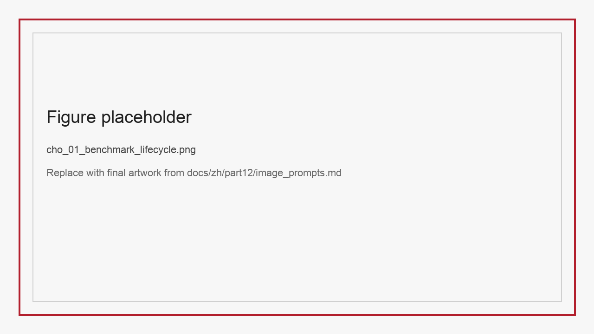
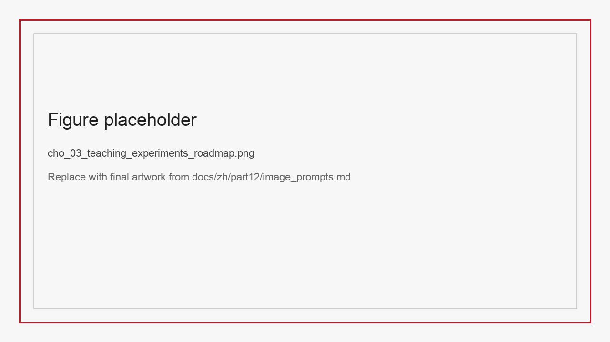
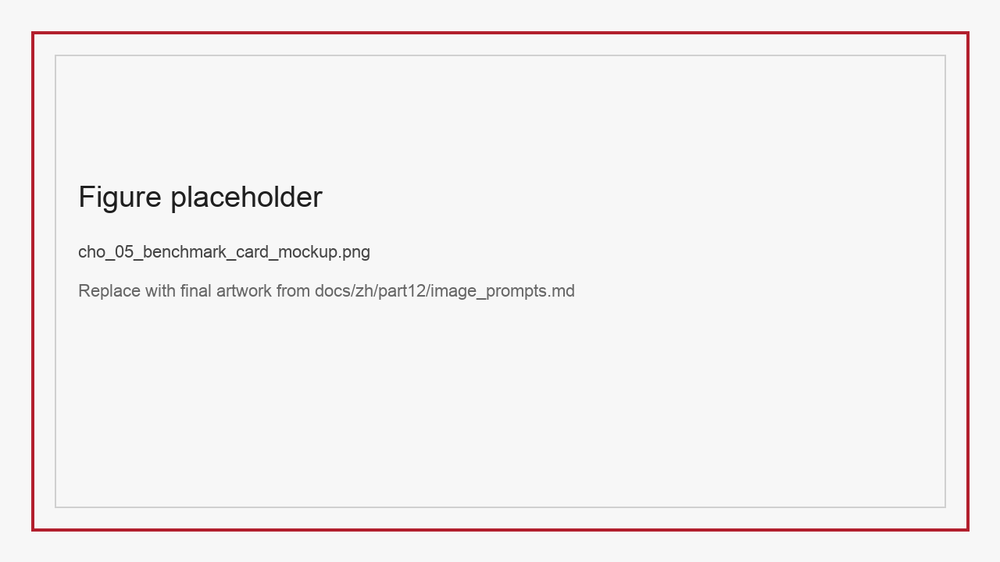

# 第43章：开放基准、排行榜与教学实验

当一个团队终于把数据集做出来、把实验跑明白、把指标和切片都整理好之后，常常会产生一种错觉：工作已经结束了。实际上，这只是资产化的中点，而不是终点。真正决定一套数据资产能否持续产生影响的，往往不是论文首发时的分数，而是它之后能否被稳定复用、被公平比较、被课程吸收、被社区维护、被下一届团队接着扩展。

开放基准、排行榜与教学实验之所以值得单独成章，正是因为它们看起来像“发布后的附加工作”，却往往决定了一套数据资产能否摆脱“项目制一次性产物”的命运。如果没有 benchmark 设计，团队内部实验无法统一；没有 leaderboard 机制，外部结果无法比较；没有课程实验，数据集很难进入稳定的人才培养和方法扩散链路。

本章将围绕三个问题展开：

- 什么样的数据集适合被包装成开放 benchmark。
- 一个可维护的 leaderboard 需要哪些制度化部件。
- 如何把一个适合开放的数据集进一步组织成 4-6 个课程实验，而不只停留在论文结果或一次性展示。

*图43-1 开放基准不是静态发布页，而是一条包含版本、评测、反馈与教学扩散的生命周期。*

## 43.1 Benchmark Card：开放发布的最小治理单元

很多团队对 benchmark 的理解过于简单，仿佛只要有测试集、有脚本、有排行榜就算完成。实际上，一个真正可维护的 benchmark 至少要同时满足四个要求：任务边界清晰、提交口径统一、污染防护可执行、版本迭代可审计。Dynabench 与 Dynaboard 之所以重要，在于它们把动态基准和评测服务化这些问题推到了台前 (Kiela et al. 2021; Ma et al. 2021)。DataPerf 与 MMLU 则分别提醒我们，数据中心开发和多任务能力覆盖本身也需要被制度化比较 (Mazumder et al. 2023; Hendrycks et al. 2021)。而像 HELM 与 BIG-bench 这样的评测框架进一步说明，开放 benchmark 的价值并不只是把题目变多，而是把能力覆盖、资源边界与解释口径一起公开化 (Liang et al. 2023; Srivastava et al. 2023)。

这也是为什么 Benchmark Card 是开放化工作的起点。它要求团队在公开之前就明确：

- 任务定义到底是什么。
- 输入输出格式和禁止性用法是什么。
- 官方指标、切片指标和辅助指标分别是什么。
- baseline 选哪些，为什么选。
- 提交时必须附带哪些元信息。
- 排行榜接受什么，不接受什么。
- 数据集版本更新后，旧结果如何保留与对齐。

如果没有这张卡，leaderboard 最终很容易变成“各种方法、各种口径、各种额外资源混在一起”的分数墙。短期看热闹，长期看没有比较价值。

### 43.1.1 Benchmark Card 最小模板

| 字段 | 说明 |
| :-- | :-- |
| Benchmark 名称 | 正式名称、简称、版本 |
| 任务边界 | 允许的任务与明确排除的任务 |
| 输入输出格式 | 文本、图像、音频、轨迹、JSON、HTML 等 |
| 官方指标 | 主指标与定义 |
| 切片指标 | 风险切片、困难切片、鲁棒性切片 |
| 提交格式 | 文件格式、字段要求、必填元数据 |
| 资源规则 | 是否允许外部数据、外部 OCR、闭源 API |
| 防污染规则 | 去重、泄漏、模板重合与多次提交约束 |
| 版本策略 | `v1.0`、`v1.1` 的兼容关系 |
| 维护角色 | 数据 owner、评测 owner、榜单 owner |

### 43.1.2 Benchmark Card 之外还需要什么发布包

只写一张 Benchmark Card，通常还不足以支撑真正可用的开放发布。因为卡片负责说明规则，但用户真正上手时，还需要一整套最小发布包。

第一部分是评测包，也就是官方脚本、输入输出示例、字段说明、样例提交文件和 sanity check 工具。没有这些内容，很多所谓“开放 benchmark”其实只开放了描述，没有开放可执行接口。  
第二部分是基线包，也就是至少一到两个可跑通的 baseline、必要的环境说明和结果复现命令。基线包的意义不只是给出起点分数，更重要的是告诉外部读者：这套任务在什么资源条件下是可落地的。  
第三部分是切片包，也就是关键切片的定义、字段来源和汇总脚本。若没有切片包，排行榜最终只会剩总分。  
第四部分是治理包，也就是版本说明、issue 流程、资源声明模板、防污染说明和撤榜规则。它们看起来不像模型内容，却决定了 benchmark 能否长期维持公信力。

把这些组件明确写出来还有一个好处：它能提醒读者，开放 benchmark 并不是“把测试集公开并附一段文字”，而是一套围绕比较条件组织起来的交付件集合。

## 43.2 六个高校数据集如何转成开放 benchmark

并非所有数据集都适合用同一种 benchmark 包装方式。我们可以把本篇涉及的六个数据集分成三种开放路线。

第一种是“结构与逻辑型基准”，代表是 StructBill-CN 与 SparseTable-Bench。这类 benchmark 的重点不是题量，而是格式严谨、指标多维、切片明确。它们尤其适合公开结构化提交格式，例如 JSON 或 HTML 序列，并在榜单中同时展示内容正确性、结构正确性和逻辑一致性。

第二种是“复杂推理型基准”，代表是 multi-chart 与 Latent-Switch-69K。它们不一定适合只用总准确率做单榜单，而更适合分任务分桶展示。例如 multi-chart 可以拆成单跳读数、跨图表推理、不可回答识别三个子榜；Latent-Switch-69K 则可以在准确率之外增加显式 token 开销、推理长度或效率相关指标。

第三种是“行为与控制型基准”，代表是 Ophiuchus 与 VoiceStyleControl。它们的关键价值不在于最终答案单指标，而在于行为过程或控制目标是否被满足。前者应同时展示 answer accuracy、tool validity 和 observation utilization，后者则应同时展示 intelligibility、speaker consistency 和 emotion control accuracy。

### 43.2.1 推荐的开放 benchmark 包装方案

| 数据集 | Benchmark 主题 | 推荐主榜单 | 推荐切片榜单 |
| :-- | :-- | :-- | :-- |
| StructBill-CN | 逻辑一致性文档抽取 | KV-F1、Table-F1、Row/Doc-ACR | 无线表格、长票据、数值密集字段 |
| SparseTable-Bench | 稀疏表格鲁棒性 | TEDS、TEDS-S | header mask、body mask、random sparse |
| multi-chart | 复合信息图推理 | 子问题准确率 | 跨图表、不可回答、多步计算 |
| Ophiuchus | 工具增强医学 VQA | answer accuracy、tool validity | zoom、segmentation、多轮观察 |
| Latent-Switch-69K | 推理效率与切换监督 | accuracy、长度效率比 | easy/medium/hard、数学/代码 |
| VoiceStyleControl | 可控语音生成 | emotion acc、speaker consistency | 情绪类别、S2S vs TTS |

*图43-2 不同任务适合不同 benchmark 结构，强行统一往往会损失任务本质。*

### 43.2.2 哪些数据集不适合直接一步公开

开放并不意味着所有数据集都应立刻“原样上线”。很多团队为了赶进度，会把能公开的和适合公开的混为一谈。实际上，至少有三类数据集更适合分阶段开放。

第一类是高敏感数据重的任务，例如医疗票据、带身份声纹的语音样本、含受限病灶线索的医学观察轨迹。这类数据即使研究价值很高，也不一定适合直接发原始副本，更合理的做法往往是开放评测接口、教学镜像或字段级受限版本。  
第二类是评测边界还不稳定的数据。例如模板污染风险尚未彻底排查、split 仍可能重切、官方指标脚本仍在快速修改的任务。这类数据过早开放，会把内部未成熟问题直接变成外部信用问题。  
第三类是尚未形成稳定任务定义的数据。比如某些多模态复杂推理集虽然看起来很新，但如果团队自己还无法清晰说明哪些问题算可回答、哪些证据算有效、哪些资源算允许，那么此时开放只会造成更多歧义。

因此，开放路线本身也应该分层：有的适合开放原始数据，有的适合开放标准提交格式和隐藏测试集，有的适合只开放教学镜像和基线包。把这一点写清楚，比一味强调“越开放越好”更符合工程实际。

### 43.2.3 开放发布最好采用分级路线

为了让“开放”既不失速，也不失控，很多同时面向研究、教学或多团队协作的数据集，更适合采用分级发布路线，而不是一次性把所有组件全部推向社区。一个实用的分级思路可以分为三级。

第一级是内部稳定级。此时任务定义、评测脚本和切片还在收敛，数据集仍主要服务内部实验与课程试跑，不建议公开完整榜单。第二级是受控开放级。此时可以开放 Benchmark Card、样例提交、基线包、隐藏测试集接口和部分教学镜像，但对高敏感字段、争议切片和高风险资源调用仍保留限制。第三级才是正式公开级。只有当任务边界、资源规则、去污染检查和争议处理机制都足够稳定时，才适合上线长期 leaderboard 并接收外部广泛提交。

这种分级的意义在于，它把“先验证治理能力，再扩大开放范围”的思路写进发布制度。对于需要长期维护、且参与者会不断变化的数据集尤其如此。若没有清晰的分级路线，很容易出现“内容公开了，治理还没准备好”的失衡状态。

## 43.3 Leaderboard：排行榜真正维护的不是分数，而是比较条件

排行榜最容易变成形式工程。只要页面上出现一张按分数排序的表，大家就会天然觉得“这里有 benchmark 了”。但真正难维护的是比较条件的一致性。若没有一致性，排行榜只会放大噪声。

一个成熟 leaderboard 至少应包含五个制度部件。

第一，提交协议。要求参赛者提供模型名称、参数规模、是否开源、是否使用外部 OCR、是否使用闭源 API、是否微调、提交时间和版本号。  
第二，自动校验。提交文件必须通过格式检查、字段合法性检查和必要的 sanity check。  
第三，重复与污染审查。对于明显异常结果、频繁重提、可疑泄漏或使用未声明外部资源的情况，需要有审核与标记机制。  
第四，版本锁定。数据集升级后，旧榜单不能消失，而应保留历史版本。  
第五，错误反馈通道。社区用户提交 bug、样本争议和评测脚本问题时，要有可跟踪的修复机制。

尤其在多团队共同使用同一套基准的场景中，leaderboard 的意义往往不仅是学术竞争，而是帮助不同团队快速理解方法边界。一个好榜单不应只告诉大家“谁第一”，还应帮助大家看到：哪个方法在逻辑一致性上更强，哪个方法在遮挡鲁棒性上更稳，哪个方法在工具行为上更可靠，哪个方法只是因为允许额外资源才领先。

### 43.3.1 Leaderboard 页面推荐字段

| 字段 | 说明 |
| :-- | :-- |
| Rank | 排名 |
| Model | 模型名称 |
| Params | 参数规模 |
| Resource Profile | 是否使用外部数据、闭源 API、额外 OCR |
| Main Score | 主榜单分数 |
| Slice Scores | 关键切片分数 |
| Reproducibility | 是否开源代码、是否可复现 |
| Submission Version | 提交对应 benchmark 版本 |
| Notes | 特殊说明 |

### 43.3.2 排行榜维护流程建议

为了让 leaderboard 不是“一次上线，后续失管”的展示页，建议把维护流程写成显式 SOP：

1. 接收提交：系统检查格式、必填字段与资源声明。  
2. 自动评测：生成主指标、切片指标与 sanity report。  
3. 异常筛查：识别极端异常结果、口径可疑结果或重复提交。  
4. 人工复核：必要时要求补充说明或运行日志。  
5. 正式上榜：记录版本、时间、资源侧备注与可复现状态。  
6. 后续纠偏：若发现污染、脚本漏洞或资源声明不实，允许撤榜或重标。

*图43-4 排行榜治理的重点不是把分数算出来，而是保证比较条件可信。*

### 43.3.3 哪些情况应该触发撤榜或重标

很多排行榜上线后会遇到一个尴尬问题：明知某次提交存在争议，却没有提前写明应如何处理。结果要么因为怕麻烦而不处理，要么临时拍脑袋处理，反而损害公信力。

更成熟的做法，是在发布之初就写清楚触发撤榜或重标的条件。常见情况至少包括四类。

第一类是资源声明不实。例如提交方声称未使用外部 OCR、未使用闭源 API、未使用额外训练数据，但后续被发现与事实不符。  
第二类是评测协议违规。例如重复提交刷榜、使用测试集反馈人工调参、规避提交字段限制、或通过脚本漏洞规避校验。  
第三类是 benchmark 自身变更。例如官方修复了评测 bug、补充了防污染切分、或修正了关键标签，这时旧结果即使不是“错”，也可能需要迁移到历史榜单。  
第四类是结论不可复核。例如极端高分结果无法提供最低限度的运行说明、资源说明或可验证日志，导致榜单无法判断其比较条件是否成立。

把这些情况写清楚，实际上是在保护榜单和提交方双方。尤其当榜单进一步进入教学、公开引用或跨团队比较场景时，模糊处理争议的成本只会越来越高。

### 43.3.4 榜单申诉与复核机制不应缺席

很多 benchmark 团队会认真设计上榜流程，却忽略了另一个同样重要的部件: 申诉与复核机制。没有这一层，榜单一旦出现争议，要么陷入管理者单方面判断，要么在公开讨论中不断消耗信任。

一个最低可行的复核机制，至少应回答四件事。第一，谁可以发起申诉，是提交方、评测维护者还是社区观察者。第二，申诉材料应包含什么，例如运行日志、资源声明、版本信息和复现实验摘要。第三，复核由谁执行，是单个 owner 还是由数据、评测、社区三方共同裁决。第四，复核结果如何公示，是保持原榜、加注说明、转入历史榜单，还是直接撤榜。

把这套机制写进 Benchmark Card 或 leaderboard 说明页，有两个直接好处。一方面，它能保护提交方不被临时性口径波动伤害；另一方面，它也能保护维护方，避免每次争议都像重新发明一次流程。对需要进入教学引用、毕业设计或跨校合作的公开榜单来说，这种制度化并不是锦上添花，而是基本公信力。

### 43.3.5 排行榜页面最好直接展示“比较条件”

很多公开榜单的页面设计只强调排名和分数，结果读者一眼看到的是“谁领先”，却看不到“为什么这些结果可以比较”。这对大模型 benchmark 尤其危险，因为相同任务下，模型可能使用了不同外部资源、不同预算、不同输入分辨率，甚至不同评测协议。

因此，排行榜页面不应只做成一张漂亮的分数表，而应把比较条件显式展示出来。最少也要包括资源口径、是否允许外部能力、是否开源可复查、提交对应的 benchmark 版本，以及关键切片表现。更进一步，还可以增加“高风险切片是否通过”“是否包含人工复核说明”“是否处于申诉期”这类状态字段。

这类设计的真正意义，不在于让页面更复杂，而在于把榜单从“热闹的分数墙”升级成“可信的比较界面”。和单纯增加几条曲线相比，这种对比较条件的显式呈现更能体现开放治理的价值。

### 43.3.6 榜单结果与论文引用之间最好有回链

很多 benchmark 团队会维护榜单，但不会进一步维护“榜单结果与论文版本、代码版本、提交版本之间的关系”。这样短期内也许还能运转，长期却会出现一个问题：读者看到论文里写的分数、榜单上显示的分数、代码仓库里复现的分数彼此对不上。

更稳妥的做法，是让每条榜单记录都尽量回链到对应论文、代码仓库、提交版本和 benchmark 版本。若论文后续更新、代码重跑或 benchmark 修订，榜单也应能清楚说明“当前显示的是哪个口径下的结果”。这样做的价值并不只是学术规范，它还能显著降低后续教学引用和跨校复现时的沟通成本。

这一节的重要性还在于，它把 benchmark 从单一网页资产进一步连到了论文资产、代码资产和教学资产，形成更完整的公开生态。

## 43.4 教学实验：把数据集从论文资产转成课程资产

开放数据集若只服务研究竞赛，生命周期往往不稳定。相反，一旦进入课程实验，它就会获得另一种持续动力：每学期都会有人复现、扩展、质疑和改进。教学实验真正重要的地方就在于，它能把“数据工程方法”从少数团队的局部经验，转成可以被持续讲授和反复验证的工程能力。

教学实验设计的关键，不是让学生重复大规模训练，而是让学生在受控成本下理解数据工程中的关键矛盾。因此，一个好的课程实验应该具备四个特征：

- 任务边界清晰，学生知道自己在优化什么。
- baseline 轻量可跑，不需要巨额算力。
- 数据切片明确，学生可以看到平均分之外的问题。
- 结论能回写到数据集本身，而不是只停在模型调参。

### 43.4.1 推荐的 5 个课程实验

1. StructBill-CN：面向无线票据的结构化抽取与逻辑校验。  
实验目标：比较纯 OCR 抽取、结构化生成和逻辑后校验三种方案。  
核心收获：理解“字段正确”与“逻辑正确”不是一回事。

2. SparseTable-Bench：空单元拓扑与遮挡鲁棒性。  
实验目标：比较是否显式建模空单元对 TEDS-S 的影响。  
核心收获：理解几何监督为什么重要。

3. multi-chart：跨图表推理与不可回答问题识别。  
实验目标：构造 read-then-reason 与 retrieve-subchart-then-reason 两种基线。  
核心收获：理解单图问答与复合信息图推理的差异。

4. Ophiuchus：工具轨迹监督与医学 VQA。  
实验目标：比较只用问答对训练与加入工具轨迹监督后的差异。  
核心收获：理解 tool-use 数据不仅是函数 JSON。

5. VoiceStyleControl：可控语音生成的标签工程。  
实验目标：比较无风格控制、单情绪控制和 speaker+emotion 双控制。  
核心收获：理解多模态生成中的“控制变量”设计。

*图43-3 教学实验应覆盖结构化抽取、鲁棒性、推理、工具行为与生成控制。*

### 43.4.2 课程实验不应只交模型结果

若把教学实验的交付物只定义成“提交一个模型结果”，学生最终学到的往往只是调参和撞运气。要让课程实验真正服务数据工程训练，交付物也必须结构化。

更合理的实验交付，至少应包含四部分。

第一部分是数据说明卡。学生需要写清楚自己用了哪些样本、删掉了哪些样本、为何这样切片、哪些规则或标签是关键。  
第二部分是实验记录卡。学生不仅要报告最终分数，还要报告资源条件、训练设定、对照组和主要异常现象。  
第三部分是切片诊断卡。学生需要指出至少一个平均分掩盖的问题，例如某类票据、某类表格、某类工具轨迹或某种情绪边界。  
第四部分是策略回写卡。要求学生说明：如果再做一轮数据工程，他们会优先改采样、改清洗、改标签还是改评测。

这四类交付件的意义，在于把“做出一个结果”转成“解释这个结果并提出下一步数据动作”。这样一来，教学实验就不再只是结果展示，而会自然回到数据说明、实验归因和后续治理这些更核心的数据工程环节。

### 43.4.3 课程评分 rubric 最好直接绑定数据工程能力

如果课程实验只按最终分数给成绩，学生几乎一定会把主要精力投向“怎样把主指标再抬一点”，而不是理解数据工程链条。更合理的做法，是把评分 rubric 直接绑定到课程真正希望训练的能力上。

| 评分维度 | 建议权重 | 关注点 |
| :-- | :-- | :-- |
| 任务理解与数据说明 | 20% | 是否清楚说明任务边界、样本来源、切片定义 |
| 基线复现与实验规范 | 20% | 是否能稳定复现 baseline，是否记录资源与配置 |
| 切片分析与错误诊断 | 25% | 是否找出平均分掩盖的问题，是否能解释异常切片 |
| 策略回写与改进建议 | 20% | 是否提出可执行的数据动作，而非空泛总结 |
| 表达与可复查性 | 15% | 报告结构、表格、日志、附件是否完整 |

这样的 rubric 有三个优点。第一，它能明确告诉学生，课程不是单纯拼分数，而是训练“把实验说清楚”的能力。第二，它能让教师在不同数据集任务之间保持统一评价语言。第三，它也更贴近本篇的主线：数据集不只是研究样本，更是可教学、可审计、可传承的工程资产。

### 43.4.4 课程实验最好区分基础层、进阶层与开放层

如果把所有学生都放进同一难度的课程实验里，常见结果有两种：要么实验做得过浅，强学生觉得没有挑战；要么实验做得过重，大部分学生只能机械照抄流程。更合适的办法，是把课程实验拆成三层。

基础层侧重复现与理解，重点是让学生跑通基线、看懂切片、学会写数据说明卡。进阶层侧重局部改进，要求学生对某个高风险切片提出并验证数据动作，例如补空单元样本、改工具轨迹监督、重写情绪边界标签。开放层则面向优秀学生或研究型课程，允许他们把实验结果回写到数据集本身，提交新增切片、错误簇分析或教学镜像改进建议。

这种三层结构非常适合那些既要兼顾教学稳定性、又希望保留研究延展空间的基准。沿着这条路径来看，数据集就不只是被发布和评测，还能被分层吸收进课程与训练体系之中。

### 43.4.5 课程实验成果最有价值的回流方式是什么

如果课程实验做完之后只留下成绩单，它对数据集本身的长期价值其实很有限。更理想的状态，是让学生产出中的一部分真正回流到 benchmark 或数据集治理中。这里最有价值的回流通常不是“又多了一次模型跑分”，而是更结构化的资产。

最值得回流的成果至少有四类。第一类是异常切片说明，也就是学生发现了哪些平均分掩盖的问题。第二类是错误簇与样本注释，帮助维护者看到哪些边界案例值得进入长期监控。第三类是教学镜像改进建议，例如哪些脚本太重、哪些 baseline 不稳定、哪些说明文档不清楚。第四类是新提出但经过验证的小型评测切片，它们可能成为下一轮 benchmark 的附加视角。

把课程成果这样组织起来，课程就不再只是“消费 benchmark”，而会开始反哺 benchmark。这种回流链路也最契合“数据资产长期演进”的主线。

## 43.5 开放维护机制：基准不维护，就会很快失真

很多 benchmark 发布半年后就迅速过时，不是因为任务没价值，而是因为维护机制缺失。没有人负责版本更新，没有人处理污染报告，没有人维护 baseline，没有人验证新提交。最终 benchmark 仍然在线，但已经无法代表真实研究进展。

因此，开放维护机制需要像数据平台一样制度化。一个最低可行的维护机制应包含：

- 固定版本节奏：例如每半年评估一次是否需要修正或扩展。
- 问题单流程：数据 bug、脚本 bug、标签争议都进入公开 issue 流。
- baseline 更新策略：何时新增 baseline，何时冻结旧 baseline。
- 提交审查规则：哪些结果直接上线，哪些结果需要人工复核。
- 教学镜像：课程实验使用锁定版本，避免学期中 benchmark 波动。

尤其对人员流动较快、协作链路较长的基准而言，维护责任最好不要完全落在个别成员身上，而应尽量绑定到课程组、实验室或项目委员会层面。否则数据集随着人员变化很容易失去持续维护者。

### 43.5.1 面向年度维护的检查清单

1. 是否新增了正式版本号和 release note。
2. 是否更新了 baseline bundle 与复现说明。
3. 是否处理了上一周期收到的标签争议与脚本 bug。
4. 是否重跑了去污染检查，尤其是新增样本部分。
5. 是否对 leaderboard 的资源声明规则进行了复核。
6. 是否为教学场景保留了锁定镜像版本。

### 43.5.2 开放维护的人力分工不应模糊

很多公开基准并不是死于技术，而是死于责任不清。大家都默认“后面有人会维护”，但没有人真正知道谁对版本、脚本、样本争议和榜单治理负责。

一个最低可行的人力分工，至少应区分四种角色。

第一类是数据 owner，负责样本版本、来源记录、字段变更和去污染检查。  
第二类是评测 owner，负责指标脚本、切片脚本、基线复现与评测 bug 修复。  
第三类是社区 owner，负责 issue 流、资源声明审核、争议样本沟通和榜单公告。  
第四类是教学 owner，负责课程镜像版本、实验说明和学期内稳定性。

这四种角色不一定由四个人分别承担，但角色本身不能缺席。尤其对于由多批次成员接续维护的基准，如果不在发布时就把角色写明，后续人员毕业、课题切换或团队重组之后，数据集很容易只剩一个静态网页，而失去真正的维护能力。

### 43.5.3 年度更新节奏最好怎样设计

开放基准最怕的两种极端，一种是几年不更新，另一种是更新太频繁。前者会让 benchmark 很快失去代表性，后者又会让外部团队根本无从对齐版本，课程实验也难以复现。

更合适的做法通常是建立“轻更新 + 重更新”的双节奏。  
轻更新可以按季度或学期执行，主要处理脚本 bug、标签争议、小规模补注和 issue 清理。这类更新原则上不改变核心 split 和主榜单口径。  
重更新则按半年或年度执行，用来处理更大的事情，例如补样本、重跑去污染、升级切片定义、引入新 baseline 或发布新主版本。重更新必须配 release note、历史榜单保留策略和迁移说明。  
对于教学场景，还可以额外加一个“学期冻结节奏”，也就是在开课前锁定一份镜像版本，整学期不再改动，确保学生实验环境稳定。

这种节奏的价值在于，它让公开基准既不会僵死，也不会混乱。换句话说，更新本身也必须被工程化，而不是完全由维护者的空闲时间决定。

### 43.5.4 维护交接如果不制度化，公开资产很容易中断

一些以课程、实验室或研究团队协作为基础的数据集，与工业基准相比，往往面临更快的人员流动。学生毕业、课题组轮换、项目经费变化，都可能让原本运行良好的 benchmark 在一年内失去维护者。因此，公开维护除了版本计划，还必须包含交接计划。

一个最低可行的交接包，至少应包含五类内容：版本现状说明、关键脚本与运行入口、已知争议样本清单、未完成 issue 列表、下一周期计划。更进一步，若榜单已经进入教学或跨校合作场景，还应保留联系方式、镜像仓库位置和回滚方案，避免负责人一旦变化，外部用户连“谁在维护”都无法确认。

把交接机制写入本章，还有一个额外意义：它能提醒读者，数据资产化并不止于“发布出去”，而是要让资产在人员变化之后仍能继续被使用、被质疑、被改进。对于强调数据工程长期主义的讨论来说，这一点非常关键。

### 43.5.5 开放 benchmark 的年度总结最好写成什么样

很多团队会定期更新 benchmark，却不一定会写年度总结。结果到了下一年，大家只记得“我们更新过几次版本”，却说不清楚到底解决了哪些问题、哪些争议还悬而未决、哪些教学实验真正被吸收进课程。一个好的年度总结，实际上是公开资产自我校准的关键环节。

一份更有价值的年度总结，至少应覆盖五块内容。第一块是版本与样本变化，说明新增、删除和重切分的规模。第二块是评测与榜单变化，说明主指标、关键切片和资源规则是否调整。第三块是争议处理，说明这一年有哪些申诉、撤榜、重标或标签修订。第四块是教学使用情况，说明哪些课程、哪些实验被稳定采用。第五块是下一年度计划，明确是继续扩样本、补切片、升级指标，还是先稳住治理边界。

把这类总结写进公开维护机制的标准流程，有助于让 benchmark 从“有人在维护”变成“维护本身也可复查”。这种年度化视角也能明显增强本章的收束感和长期资产意识。

### 43.5.6 公开维护预算最好怎样估算

很多以课程、实验室或研究团队为基础启动 benchmark 的团队，天然更愿意讨论数据集和模型，却不太愿意提前讨论维护预算。结果常常是首发做得很好，半年后却因为没人维护脚本、没人处理 issue、没人更新教学镜像而快速失真。对公开资产来说，预算不是附属问题，而是生存条件。

一个最低可行的预算估算，至少要覆盖四类成本：评测与存储成本、版本更新与问题修复的人力成本、教学镜像维护成本、以及争议样本复核成本。对于强依赖外部模型调用、人工听测或专家复审的数据集，还应额外预留高峰期审计预算。若这部分完全没有前置估算，后续很容易把本应长期运转的公共资产做成一次性展示项目。

把预算写进维护机制的讨论，不会削弱章节的技术性，反而会显著增强其工程现实感。因为本章最终要回答的并不是“如何把数据集发出来”，而是“如何让它在未来几年仍然可用、可比、可教、可维护”。

### 43.5.7 哪些图表最能帮助理解开放维护机制

开放维护机制本身往往不如模型结构或实验结果直观，因此更需要借助图表把制度、角色和节奏讲清楚。若在本节配图，最值得优先保留的通常不是装饰性示意，而是那些能帮助读者迅速理解维护结构的图表：

*图43-5 可视化展示任务定义、指标、提交格式、防污染规则与维护人。*

*图43-6 建议从结构化抽取、鲁棒性、推理、工具行为、风格控制五个实验串成课程主线。*

## 43.6 本章小结

本章讨论了如何把数据集进一步升级为开放 benchmark、leaderboard 和教学实验。核心结论有三条。

第一，开放基准的本质不是“把数据公开”，而是把比较条件制度化 (Kiela et al. 2021; Wang et al. 2019)。  
第二，排行榜真正维护的是口径一致性、版本历史与社区信任，而不只是排名 (Ma et al. 2021; Mazumder et al. 2023)。  
第三，教学实验是延长数据集生命周期、扩大方法影响力和培养工程人才的关键路径 (Raffel et al. 2020; Hendrycks et al. 2021)。

至此，第十二篇完成了从数据集卡片、质量治理、清洗与隐私、多模态与轨迹、实验归因到开放基准与教学实验的完整闭环。它与前十一篇共同构成了本书从“如何做数据”到“如何把数据做成长期资产”的最后一块拼图。

## 参考文献

Kiela D, Bartolo M, Nie Y, Kaushik D, Geiger A, Wu Z, Vidgen B, Prasad G, Singh A, Ringshia P, Ma Z, Thrush T, Riedel S, Waseem Z, Stenetorp P, Jia R, Bansal M, Potts C, Williams A (2021) Dynabench: Rethinking Benchmarking in NLP. In: Proceedings of the 2021 Conference of the North American Chapter of the Association for Computational Linguistics: Human Language Technologies, pp 4110-4124.

Liang P, Bommasani R, Lee T, Tsipras D, Soylu D, Yasunaga M, Zhang Y, Narayanan D, Wu Y, Kumar A, et al. (2023) Holistic Evaluation of Language Models. Transactions on Machine Learning Research.

Ma Z, Ethayarajh K, Thrush T, Jain S, Wu L, Jia R, Potts C, Williams A, Kiela D (2021) Dynaboard: An Evaluation-As-A-Service Platform for Holistic Next-Generation Benchmarking. In: Advances in Neural Information Processing Systems 34.

Mazumder M, Banbury C, Yao X, Karlaš B, Gaviria Rojas W, Diamos S, He L, Parrish A, Kirk H R, Quaye J, et al. (2023) DataPerf: Benchmarks for Data-Centric AI Development. In: Advances in Neural Information Processing Systems 36, Datasets and Benchmarks Track.

Srivastava A, Rastogi A, Rao A, Shoeb A A M, Abid A, Fisch A, Brown A R, Santoro A, Gupta A, Garriga-Alonso A, Kluska A, Khan A S, von Kügelgen J, Bhojanapalli A, Jain A, Rimsky N, Gur-Ari G, Welling M, Balduzzi D, Gudan J, others (2023) Beyond the Imitation Game: Quantifying and Extrapolating the Capabilities of Language Models. Transactions on Machine Learning Research.

Hendrycks D, Burns C, Basart S, Zou A, Mazeika M, Song D, Steinhardt J (2021) Measuring Massive Multitask Language Understanding. In: International Conference on Learning Representations.

Raffel C, Shazeer N, Roberts A, Lee K, Narang S, Matena M, Zhou Y, Li W, Liu P J (2020) Exploring the Limits of Transfer Learning with a Unified Text-to-Text Transformer. Journal of Machine Learning Research 21(140):1-67.

Wang A, Pruksachatkun Y, Nangia N, Singh A, Michael J, Hill F, Levy O, Bowman S R (2019) SuperGLUE: A Stickier Benchmark for General-Purpose Language Understanding Systems. In: Advances in Neural Information Processing Systems 32.
