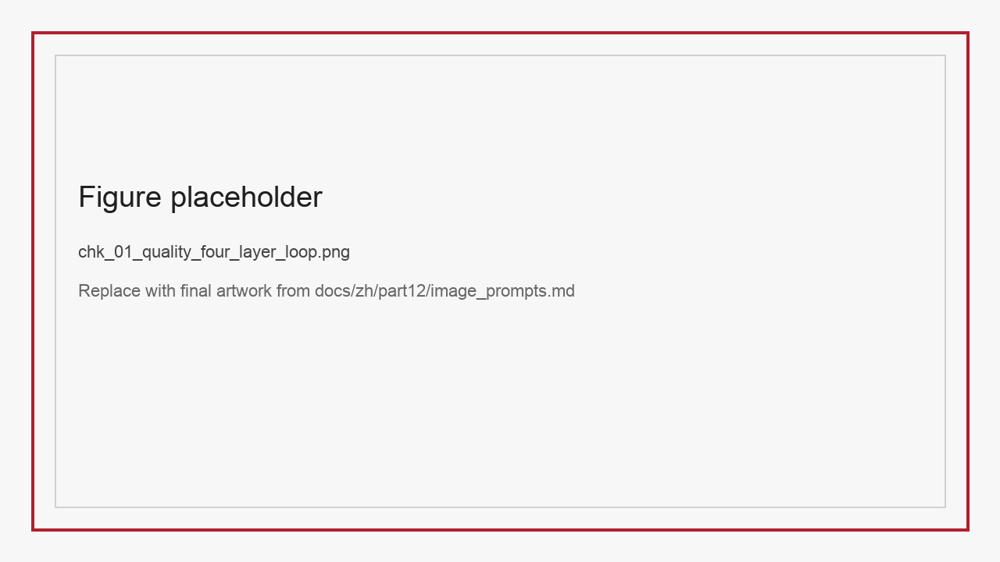
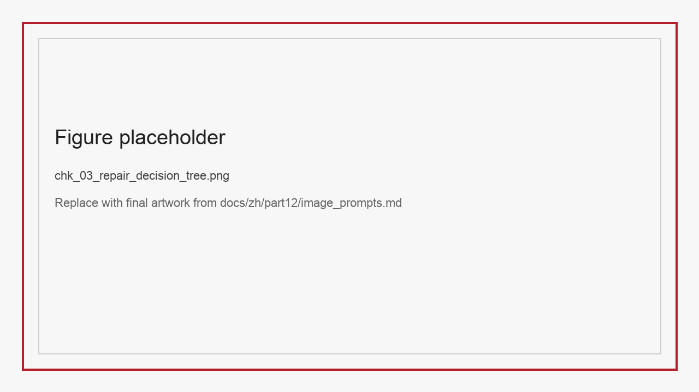
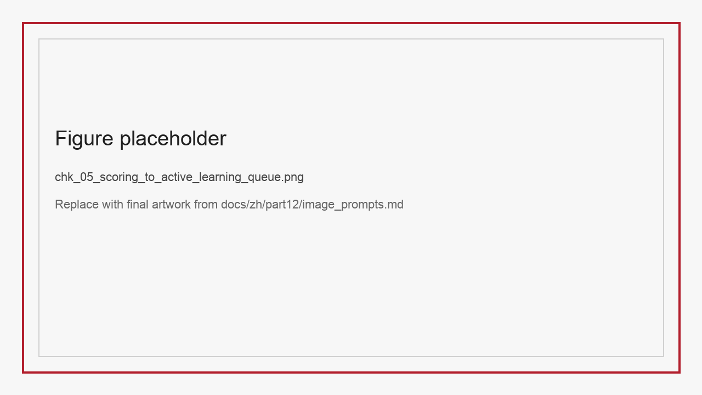

# ChK 数据质量评估、修复算法与主动学习

如果说 ChJ 解决的是“数据集怎么被描述成资产”，那么 ChK 解决的就是“资产质量如何被持续提升”。很多团队在谈数据质量时，仍然停留在非常粗糙的层面：脏不脏、全不全、准不准。这样的说法对开会有用，对工程无用。因为一旦进入真实流水线，所谓“质量问题”并不是单个概念，而是一组相互关联的算法任务：质量评分、缺陷检测、错误归因、修复建议、规则学习、样本选择和人机闭环。

更棘手的是，大模型时代的数据质量不再只对应文本清洗。推理轨迹可能出现“看似工整但本质错误”的长 CoT，多模态指令可能出现“描述完整但视觉锚点错位”的幻觉，语音风格数据可能出现“内容正确但情绪漂移”的控制失效，文档结构化数据可能出现“字符识别正确但逻辑字段对错位”的高风险错误。如果继续用单一的脏数据视角看待这一切，团队就会在不同任务上重复踩坑。

本章的立场很明确：**数据质量不是一个结果标签，而是一条可分解、可建模、可闭环的算法链路**。这条链路至少包含四层：

- 质量评分：给样本一个优先级，而不是二元地判定好坏。
- 缺陷检测：识别错误属于哪一类，发生在哪一层。
- 修复建议：决定是自动修复、弱监督修复，还是进入人工审核。
- 主动学习：决定有限的人力该优先花在哪些样本上。

*图K-1 数据质量工程不是一次过滤，而是评分、检测、修复与采样的连续闭环。*

## K.1 为什么“只做过滤”已经不够

早期文本预训练时代，很多团队的质量工程重点是“把明显脏样本删掉”。例如去除乱码、重复、广告、无效网页、极短样本和版权高风险内容。这一套方法在海量网页数据时代非常有效，因为收益主要来自降噪。然而到了今天，越来越多的数据不是“天然原始数据”，而是经过重写、重标注、蒸馏、轨迹合成和多轮筛选后的二次乃至三次数据。此时问题不再只是删脏数据，而是要判断“这条样本是否足以支持目标能力”。

例如一条推理样本可能没有语法错误、没有明显脏词、结构也很完整，但其中的中间步骤从第二步开始就偏离了正确路径。若只依赖表层过滤，这类样本会被当作高质量 CoT 留下，最终损害 PRM 或推理模型的训练稳定性。围绕数学推理 verifier 与 step-level verification 的研究已经反复说明，最终答案正确并不意味着中间过程值得学习，过程监督本身依赖对错误步骤的细粒度筛查 (Cobbe et al. 2021; Lightman et al. 2024)。Latent-Switch-69K 提供了一个重要启发：高质量推理数据不一定是“越长越详细”，而是必须正确分配隐式规划与显式验证的边界。如果样本只是机械缩短 CoT，而没有保留必要的解题意图，就会在训练中制造一种虚假的“简洁高质量”。

再看 VoiceStyleControl。它表面上是一套可控语音生成数据，字段齐全、标签明确，似乎天然高质量。但如果进一步分析，就会发现至少存在四类质量风险：speaker 标签与音色不一致、emotion 标签与韵律表达不一致、文本语义与情绪设定不匹配、离散 speech token 对应的音频片段存在截断或合成伪影。这些问题无法靠普通文本过滤发现，只能通过风格一致性评分、说话人验证模型、韵律分类器和抽样听测共同识别。

这说明大模型时代的数据质量已经从“垃圾剔除问题”演变为“能力对齐问题”。团队真正关心的是：哪些样本会稳定提升目标能力，哪些样本会带来模式坍缩、格式漂移、风格错配或奖励投机。尤其在强化学习驱动推理能力提升的训练配方里，一旦过程数据与奖励信号质量失真，错误策略会被快速放大，而不是被自动纠正 (Guo et al. 2025)。过滤只是质量工程的第一层，而不是全部。

## K.2 质量评分：从二元判断转向优先级排序

质量工程第一步不是删数据，而是给数据排序。排序之所以重要，是因为现实团队总是资源受限的：算力有限、人审预算有限、标注时间有限、模型调用成本有限。一个好系统不是把所有问题样本一口气修完，而是优先找出“修复收益最大”的样本。这种从二元过滤转向优先级排序的思路，首先与主动学习中的查询策略非常接近 (Settles 2011)。当团队进一步面对标签噪声和错标问题时，排序逻辑又会自然延伸到噪声标签建模与不确定性估计 (Northcutt et al. 2021; Frénay and Verleysen 2014)。

质量评分至少可以分成三类。

第一类是内容正确性评分。它关注样本是否在事实、逻辑、标签或结构上成立。例如在 StructBill-CN 中，可以同时打字段正确性分、结构完整性分和算术一致性分；在 Latent-Switch-69K 中，可以分别评估 intuition 是否保留关键解题意图、short CoT 是否足以支撑验证阶段、最终答案是否与 verifier 一致。

第二类是任务适配性评分。它回答“这条样本是不是适合当前模型或当前训练阶段”。例如对 VLM 指令数据而言，简单描述样本也许干净，但如果团队当前目标是提升复杂图表理解，那这类样本的边际收益就不高。再如 VoiceStyleControl 中的中性情绪样本，可能对稳定基础音质很重要，但对强化情绪控制能力的价值不如高张力情绪样本。

第三类是学习价值评分。它不只看样本对不对，还看样本能否带来新信息。主动学习和课程调度都依赖这一层。一个模型已经能稳定做对的 easy 样本，即便完全正确，继续投入人工复审的收益也很低；而那些模型预测高不确定、不同评审器意见分歧大、又集中出现在关键业务切片上的样本，才是真正值得优先处理的对象。若团队还能结合训练动态去观察样本是稳定易学、长期模糊还是持续高损失，那么这类优先级判断会更接近真实学习价值 (Swayamdipta et al. 2020)。

*图K-2 高质量不等于高价值，质量评分至少要同时考虑正确性、适配性与学习价值。*

### K.2.1 质量评分字段建议

| 字段 | 含义 |
| :-- | :-- |
| correctness_score | 内容是否正确、结构是否成立 |
| coverage_score | 是否覆盖稀缺任务或关键切片 |
| uncertainty_score | 模型是否对该样本不确定 |
| disagreement_score | 多评审器或多模型是否分歧较大 |
| repair_cost | 预计修复成本 |
| repair_gain | 修复后对目标能力的预计收益 |
| final_priority | 综合优先级，用于排队处理 |

### K.2.2 把评分真正落到六个数据集上

如果质量评分只是停留在通用字段层面，它很容易再次变成抽象概念。更有效的做法，是让每类数据都拥有“任务感知”的评分器组合。

对 StructBill-CN 来说，`correctness_score` 不能只由字符级匹配给出，而应至少拆成字段正确率、结构完整率和逻辑一致率三项。这样一来，团队才能区分“读错”和“算错”到底谁是主矛盾。  
对 SparseTable-Bench 来说，最有价值的不是文本相似度，而是结构与几何稳定性，因此 `coverage_score` 应当优先奖励稀疏度高、遮挡强、空单元复杂的样本。  
对 Ophiuchus 而言，`disagreement_score` 特别重要，因为一个问题可能答对，但工具路径分歧很大。这种分歧本身就说明样本位于策略边界，适合优先复审。  
对 Latent-Switch-69K 来说，`repair_gain` 往往集中在 hard 样本和切换边界模糊样本上，因为这些样本最能暴露模型是否学会了 latent-then-explicit 的切换机制。  
对 VoiceStyleControl 而言，则要把文本内容正确性与风格正确性拆开打分。否则模型很容易因为“念对文本”而掩盖“风格失控”。

*图K-4 不同数据类型需要不同评分器组合，单一总分会掩盖真正的质量矛盾。*

### K.2.3 评分器也需要被校准

很多团队会把质量评分器当作天然可靠的裁判，仿佛只要模型能输出一个 `quality_score`，后面的优先级排序就自动成立。现实中这往往是新的误差来源。一个未经校准的评分器，会把本来应该被优先修复的样本埋下去，也会把并不重要的样本推到前排。

评分器校准至少要回答三个问题。  
第一，分数是否有稳定语义。也就是说，`0.8` 在不同数据切片上是不是意味着相近的可信程度，还是只在某一类样本上偏乐观。  
第二，分数是否可比较。比如票据逻辑错误分、图表不可回答判断分、语音风格一致性分，若没有统一口径，就不应直接拿来做跨任务优先级。  
第三，分数是否能映射到行动。一个很高但无法解释的“问题概率”，往往不如一个中等但能明确指向“几何错位”或“情绪标签冲突”的分数更有工程价值。

因此，成熟团队通常不会只保留一个黑箱分数，而会保留“原始分、校准分、行动标签”三层输出。原始分来自检测器或 judge，校准分通过历史复审结果对齐，行动标签则把分数折叠成可操作的工单类别。噪声标签学习领域的长期经验也说明，若团队只保留一个粗糙总分，而不区分噪声来源与修复动作，后续模型很容易学到系统性偏差 (Song et al. 2023)。只有到了这一步，质量评分才真正进入工程闭环，而不是停留在研究演示。

### K.2.4 评分阈值不应全年不变

很多团队完成评分器之后，会进一步犯另一个常见错误：把阈值写死，然后一年不动。这样做看似稳定，实际上会让系统越来越偏离真实业务。原因很简单，数据分布会变，任务重点会变，模型能力也会变。去年属于“高风险可疑”的样本，今年可能已经成为模型轻松处理的常规样本；而一些新出现的复杂切片，则可能仍被旧阈值压在低优先级区。

因此，质量阈值本身也应成为周期性校准对象。至少要结合三类信号重新检查：当前高优先级样本的实际命中率是否仍高、关键业务切片是否被阈值系统性低估、人工复审资源是否正在被低收益样本大量占用。阈值调整并不意味着系统不稳定，恰恰说明团队开始把评分器当作运营工具，而不是一次性部署后不再碰的研究模型。

## K.3 缺陷检测：把“错”拆成可执行类别

一个成熟的数据质量系统不会把所有坏样本都标成 `bad`。因为只知道“错了”，并不能指导修复。缺陷检测的关键，是把错误映射到团队可以行动的类别。

在本文涉及的高校数据集中，我们至少可以总结出六类高价值缺陷类型。

第一类是逻辑缺陷。典型代表是 StructBill-CN：字符识别可能没错，但 `Unit Price × Quantity != Amount`，或者行级金额求和与总额不一致。  
第二类是几何缺陷。典型代表是 SparseTable-Bench：空单元位置漂移、bbox 锚点偏移、合并单元拓扑丢失。  
第三类是跨区域推理缺陷。典型代表是 multi-chart：模型能读局部数值，却无法在多个子图之间建立一致推理链。  
第四类是行为缺陷。典型代表是 Ophiuchus：答案可能碰巧正确，但工具调用顺序、工具选择或 observation 利用明显不合理。  
第五类是推理边界缺陷。典型代表是 Latent-Switch-69K：模型可能输出短答案，但没有完成应有的隐式规划与显式验证切换。  
第六类是风格控制缺陷。典型代表是 VoiceStyleControl：文本内容正确，但 speaker identity、情绪表达或 prosody 未满足目标风格。

缺陷类别一旦明确，修复路径就会发生根本变化。逻辑缺陷更适合 verifier 与规则修复；几何缺陷更适合重标 bbox 或结构先验增强；跨区域推理缺陷更适合补多跳样本与证据链字段；行为缺陷更适合补工具轨迹和环境反馈；风格控制缺陷则更适合引入判别器、听测和属性一致性评分。

### K.3.1 缺陷类型与检测器对应表

| 缺陷类型 | 典型任务 | 适合的检测器 |
| :-- | :-- | :-- |
| 逻辑缺陷 | 票据抽取、数值问答 | 规则验证器、算术校验器 |
| 几何缺陷 | 表格识别、版面解析 | bbox 一致性检查、结构对齐模型 |
| 证据断链 | RAG、图表推理 | 检索覆盖率、证据跨度检查 |
| 行为缺陷 | Tool-use、Agent | tool validity、observation consistency |
| 推理切换缺陷 | Long-CoT、latent reasoning | step verifier、长度-正确率分析 |
| 风格控制缺陷 | 语音生成 | speaker verifier、emotion classifier、人工听测 |

### K.3.2 检测器之间应该是接力关系，而不是相互竞争

在实际系统里，团队很容易掉进“谁的检测器最准就用谁”的思路。但数据质量治理并不要求每个检测器都独立完成终审，相反，更重要的是让它们形成接力。

第一棒通常是高召回的便宜检测器。它的任务不是给出最精确判断，而是尽快把明显问题和高风险可疑样本筛出来。  
第二棒是中成本、强解释性的检测器，例如结构一致性检查、近邻对比、统计异常分析、多模型分歧分析。它们最适合把“到底是哪类错误”这件事说清楚。  
第三棒才是昂贵但高语义能力的 judge、专家复审或多模态分析器。它们不应浪费在所有样本上，而应用来裁决那些前两棒无法稳定判断、同时又位于关键切片的样本。

如果没有接力关系，团队会很容易陷入两种低效状态：一种是所有样本都走重型 judge，成本爆炸；另一种是所有样本都只靠轻规则，结果把复杂错误全漏掉。把检测器设计成接力链，真正目的不是追求某个单点模型最强，而是让整条链路的单位成本收益最大化。

## K.4 修复建议：规则、统计、表示学习与 LLM-as-Judge 的分工

修复不是单一动作，而是一套分层决策。最常见的失败模式，是团队一旦发现质量问题，就立刻把所有样本丢给人工审核。这当然最稳，但也最贵，且无法扩展。更好的做法是把修复拆成不同层级。

第一层是规则修复。对于格式错误、字段缺失、简单算术不一致、明显标签非法等问题，规则是最便宜也最可靠的。例如 StructBill-CN 中的总额不平衡，可先做自动标记与回填候选；工具轨迹中的非法函数名或参数字段缺失，也应优先由 schema validator 处理。

第二层是统计修复。很多缺陷不是完全确定的，但可以通过异常分布识别。例如某一 speaker 的情绪标签分布异常集中、某一图表子类的答案长度明显偏离常态、某类票据的行数极端异常。统计方法不能直接给出正确答案，却能高效发现高风险区域。

第三层是表示学习修复。对于近重复样本、语义标签错配、风格相似性或几何对齐问题，embedding 检索、聚类、近邻投票和轻量分类器往往比纯规则更强。例如 VoiceStyleControl 中可以用 speaker embedding 检测“同标签不同声纹”的疑似错样；SparseTable-Bench 中可利用结构 embedding 检测拓扑异常簇。

第四层是 LLM-as-Judge 或多模态 Judge。它适合处理那些规则写不完、统计信号不够强、但又需要语义判断的问题，例如推理步骤是否自洽、图表问题是否真正不可回答、工具轨迹中的 observation 是否被合理使用。需要强调的是，Judge 的作用应当是“辅助分流”，不是“最终真理”。尤其在高风险数据上，Judge 只应提供候选意见和置信度，而不是取代终审。

*图K-3 规则、统计、表示学习与 Judge 不应互相替代，而应形成分层修复体系。*

### K.4.1 质量修复流水线应该如何排布

在工程实现上，一个能跑通的质量修复流水线通常不是单个脚本，而是四段式队列。

第一段是 cheap filters，也就是便宜且高召回的前筛。这里优先放 schema validator、字段合法性检查、哈希去重、简单算术规则、音频时长异常检测等低成本模块，目的是尽快把显而易见的问题样本抓出来。

第二段是 semantic triage，也就是语义分流。此处可以引入 embedding 聚类、近邻一致性检查、judge 评分、轻量分类器与多模型分歧分析，把前一段无法裁决的样本进一步分到“可自动修”“需人审”“暂不处理”三个池子。

第三段是 repair execution，也就是真正执行修复动作。比如对 StructBill-CN 回填缺失字段候选、对 SparseTable-Bench 重新校准 bbox、对 Ophiuchus 补 observation 标记、对 VoiceStyleControl 重跑风格判别与听测。这里的关键不是修多少，而是所有修复动作都要留下 provenance。

第四段是 post-repair evaluation。修复后的样本不能直接回流训练，而应重新通过评分器，确认它是否真的提升了质量而不是引入新噪声。否则“修复”本身就可能成为新的污染源。

### K.4.3 修复记录为什么必须结构化保存

数据修复一旦开始规模化，团队很快就会遇到一个问题：到底哪些样本被改过，为什么改，谁改的，改完是否生效。若这些信息只存在于零散日志、临时表格或聊天记录里，质量系统很快就会失去可审计性。

因此，修复记录本身也应该被看作一种数据资产。一个最低可行的修复记录至少要包含：样本 ID、触发检测器、缺陷类型、修复动作、执行人或执行器、修复时间、修复前后字段差异、是否回流训练、是否进入人工复审，以及修复后的复验结果。

这类记录有三个直接价值。  
第一，它让团队能回溯某次指标波动是否来自批量修复，而不是来自训练脚本。  
第二，它能帮助团队识别“哪些修复动作最常成功，哪些修复动作经常带来二次返工”。  
第三，它让后续的数据归因更可信，因为团队终于知道“这批样本到底被怎样改过”。

很多项目后期的问题，并不是不会修，而是不知道过去修了什么。把修复记录结构化保存，看似是额外负担，实际上是让质量治理不再失忆的必要条件。

### K.4.2 质量修复最适合放哪些图表

为了让本章在成稿阶段更像“工程章节”而不是“方法概念综述”，建议至少保留三类图表位：

*图K-5 建议突出 cheap filters、semantic triage、repair execution、post-repair evaluation 四段。*

*图K-6 可用表格展示逻辑缺陷、几何缺陷、行为缺陷、风格缺陷各自的处理链。*

*图K-7 横轴可设修复成本，纵轴可设修复收益，颜色表示业务风险等级。*

## K.5 主动学习：有限人力应该优先标什么

当缺陷被识别出来之后，团队立刻会遇到一个现实问题：人不够。主动学习的价值就在这里。它不只是从未标注池里“选最难的样本”，更是从整个质量闭环角度决定“哪些样本值得人工投入”。

一个实用的主动学习策略通常综合四个维度。

第一，模型不确定性。模型对预测最犹豫的样本，常常具有较高的信息增益。  
第二，评审分歧。多个模型、多个规则或多个 judge 对样本意见不一致，说明它处在边界区域。  
第三，业务重要性。即使不确定性不高，只要样本属于高风险切片，例如医疗票据总额、医学 ROI 定位、财报图表关键指标，也应优先进入人工审核。  
第四，修复收益。某些错误虽然显眼，但修复后只能影响极小子类；另一些错误虽然分散，却集中出现在主任务上，后者更值得优先处理。

以 Ophiuchus 为例，一个直接答对的样本未必值得复审；但如果模型需要连续两次工具调用才答对，且第一次工具选择经常偏离，那么这类样本就很适合进入“行为修复池”。对 Latent-Switch-69K 而言，模型在 hard 难度上出现“intuition 很好但显式验证失败”的样本，往往比完全做错的 easy 样本更有训练价值。对 VoiceStyleControl 而言，情绪混淆最严重的 fear-sad 边界样本，通常比大量中性样本更值得优先听测。

### K.5.1 主动学习优先级模板

| 样本ID | 不确定性 | 分歧度 | 业务风险 | 修复成本 | 预计收益 | 是否入审 |
| :-- | :-- | :-- | :-- | :-- | :-- | :-- |
| sample_a | 高 | 高 | 中 | 中 | 高 | 是 |
| sample_b | 中 | 低 | 高 | 低 | 高 | 是 |
| sample_c | 高 | 高 | 低 | 高 | 低 | 否 |

### K.5.2 人机闭环应该如何落地到团队机制

主动学习真正落地时，难点往往不在模型，而在团队协作。如果没有稳定的人机闭环制度，再漂亮的不确定性评分也只是报表。一个能长期运行的机制通常需要三类角色协同。

第一类是规则 owner，负责维护可自动执行的质量规则、字段约束、模板过滤器和 verifier。  
第二类是数据 reviewer，负责处理主动学习池中的高优先级样本，尤其是 judge 与规则意见冲突的样本。  
第三类是策略 owner，负责根据复审结果更新数据配比、采样权重、修复器阈值和难例池。

这三类角色的核心关系不是“前后串行甩单”，而是共同维护一个优先级面板：哪些错误是规则已知问题，哪些是标注协议不清，哪些是真正值得投入人力的新型错误。如果没有这一层机制，主动学习很容易退化成“把难样本全部堆给人工”。

### K.5.3 本章可直接复用的 Checklist

1. 当前数据质量问题是否已经被拆分成明确缺陷类型。
2. 每类缺陷是否都有至少一个自动检测器。
3. 是否区分了“内容正确性”与“学习价值”。
4. 人工复审池是否由优先级驱动，而不是随机抽查。
5. 修复动作是否记录 provenance、责任人和回流去向。
6. 修复后的样本是否重新经过评分与切片评测。

### K.5.4 从周报到面板：质量闭环怎样变成日常运营

很多团队在概念上理解主动学习和质量修复，但真正落地时却卡在“谁来每天推进”。原因并不复杂：只要质量治理还停留在单次项目冲刺，它就无法形成稳定复利。一个更可靠的做法，是把本章前面提到的评分、检测、修复和复审全部折叠成固定节奏的运营面板。

一个实用的周级质量面板通常包含四块信息。

第一块是库存视图，也就是“当前还有多少问题样本没有处理”。这里不只看总量，还要看按缺陷类型、风险等级、数据集来源和任务切片分层后的库存。若团队只盯总 backlog，很容易看不见真正堆积的是哪一种错误。  
第二块是流速视图，也就是“这一周修了多少、修完后回流了多少、被打回了多少”。这能帮助团队识别流程瓶颈是出在规则修复、人工复审还是 post-repair evaluation。  
第三块是收益视图，也就是“这些修复到底换来了什么”。例如 StructBill-CN 的 `Row-ACR` 是否改善，SparseTable-Bench 的 `TEDS-S` 是否抬升，VoiceStyleControl 的情绪混淆率是否下降。没有这块视图，团队容易陷入“看起来很忙，但训练没有变好”的假勤奋。  
第四块是风险视图，也就是“哪些高风险切片仍在持续恶化”。例如医疗票据总额字段、长账单、不可回答图表、fear-sad 边界语音、多步工具轨迹等。很多时候，真正应该升级处理优先级的，不是总分最低的样本，而是风险增长最快的样本簇。

这类面板的价值，不在于让团队看更多数字，而在于让数据质量从“谁有空谁看一下”变成“每周都能明确收口的运营对象”。一旦形成这样的节奏，质量治理就不再依赖某个强执行力个体，而会逐步变成团队制度。

### K.5.5 多团队协作场景下的三类复审工单

在多团队协作的数据集场景里，主动学习还有一个额外难点：错误不只来自模型，也来自数据协作链本身。不同实验室、不同标注来源、不同批次成员的交付节奏并不一致，导致复审工单不能一锅端。更高效的做法，是至少把工单拆成三类。

第一类是“规则已知型工单”。这类工单的特点是错误模式已经清晰，例如字段缺失、模板不合法、算术不平衡、非法工具参数、音频时长异常等。它们最适合积累成自动规则库，目标不是一次次人工处理，而是尽快让同类问题不再重复进入复审池。  
第二类是“协议不清型工单”。这类问题常见于结构化文档、表格、风格标签和轨迹标注。样本本身未必坏，而是标注协议边界含糊，导致不同 reviewer 会给出不同结论。这类工单的真正产出不是修一条数据，而是修订标注规范、补充例外条款和增加反例。  
第三类是“新型难例型工单”。它们最有研究价值，也最值得主动学习优先上浮。比如某些跨子图问题第一次暴露出模型会错误拼接图例与时间轴，某些 Agent 轨迹第一次暴露出 observation 已返回但模型不会继续利用，某些语音样本第一次暴露出 speaker consistency 与 emotion control 的系统性冲突。对于这类工单，团队需要的不是快速清空，而是沉淀为新一轮采样、增补与评测切片。

把三类工单混在一起处理，会直接带来两种浪费：简单规则问题抢占人工审查时间，真正新型难例又被埋在海量杂项里。只有把工单性质先分清，主动学习才能发挥“有限人力优先投在最有价值样本上”的作用。

### K.5.6 质量闭环的止损点应该设在哪里

主动学习和质量修复并不是越做越好。很多团队后期会进入一种危险状态：为了追求更干净的数据，持续扩大 review 范围，结果人力成本快速上升，而模型收益越来越小。为了避免这一点，团队需要明确止损点。

第一类止损点是边际收益止损。若某一类样本在连续两到三轮修复后，对主指标和关键切片几乎没有增益，就应暂停继续深挖，转而检查是否该从采样、任务定义或评测指标层面重新理解问题。  
第二类止损点是协议成熟度止损。若某类工单始终高度分歧，说明它可能并不适合继续当作“清洗问题”处理，而应上升为任务重定义或标签体系重构问题。继续硬修，只会制造更多不一致数据。  
第三类止损点是成本上限止损。若某类修复必须依赖高成本专家、耗时复审或大量外部模型调用，而它又不位于高风险主任务切片，就应坦率承认它暂时不值得进入主流程。

止损并不意味着放弃质量，而是承认质量工程和任何工程一样，都受资源约束。成熟团队的目标不是“消灭所有问题”，而是“用可持续成本持续把最重要的问题压下去”。

### K.5.7 主动学习样本池应如何和评测切片联动

主动学习若只根据不确定性或分歧度选样本，最终很容易演变成“谁难就审谁”，却不一定服务主任务。更稳妥的做法，是让样本池与评测切片显式联动，也就是先问清楚: 团队当前最想修复的是哪类能力短板，再决定人工预算往哪里投。

例如，如果 StructBill-CN 当前主风险集中在总额一致性和长账单，那么主动学习池就不应被大量短票据样本占满；如果 SparseTable-Bench 的主要退化发生在 body mask 和高稀疏度切片，那么优先复审对象就应向这两个区域倾斜；如果 VoiceStyleControl 的主问题是 fear 与 sad 的边界混淆，那么听测池也应优先覆盖相关情绪对，而不是继续平均抽查中性样本。

这类联动机制的本质，是把“评测告诉我们哪里在掉队”和“主动学习决定先修哪里”接成同一条闭环。只有这样，质量治理才不会出现一种常见脱节: 面板上最差的切片没人修，而 review 池里堆满了并不影响主任务的杂项样本。

### K.5.8 哪些复审结果应直接回写规则库

并不是所有人工复审结果都应该永远留在表格和评论里。很多团队复审做得很辛苦，却没有把高频、稳定、可解释的发现沉淀成规则，结果同类问题一轮又一轮重新进入人工池。更有效的做法，是明确哪些复审结果一旦出现到足够频次，就应直接回写规则库。

通常最适合回写的有三类。第一类是高重复、低争议错误，例如非法字段格式、总额不平衡、工具参数缺失、音频时长异常，这类问题最适合立刻规则化。第二类是边界清晰的协议补丁，例如某类表格空单元必须显式保留、某类 observation 不可视为有效证据、某类情绪标签必须和文本语义联查，这类发现适合写进标注协议与检查器。第三类是可被简单统计或轻量分类器稳定识别的模式，例如某些模板页眉页脚漂移、某些 speaker 标签冲突、某些轨迹恢复失败骨架反复出现，这类模式虽不是纯规则，但也不应继续完全依赖人工。

把复审结果这样回写，最大的收益不是节省一点点人力，而是让团队的质量闭环真正具有累积性。也就是说，今天的人审不只是解决今天的问题，还要尽可能减少下个月同类问题再度挤占人工预算。

## K.6 本章小结

本章把“数据质量”拆成了一条可执行工程链路：质量评分、缺陷检测、修复建议和主动学习。核心结论有三条。

第一，数据质量不再只是删脏样本，而是要判断样本是否真正服务目标能力。  
第二，不同类型的数据缺陷需要不同检测器与不同修复路径，不能一概交给人工或一概交给大模型。  
第三，主动学习的本质不是挑最难样本，而是在有限资源下优先修复收益最高的样本 (Settles 2011; Ren et al. 2018)。

下一章将进一步讨论，当质量问题已经被识别之后，团队如何在清洗、去重、去污染和隐私治理之间做出可审计的工程取舍。

## 参考文献

Cobbe K, Kosaraju V, Bavarian M, Chen M, Jun H, Kaiser L, Plappert M, Tworek J, Hilton J, Nakano R, Hesse C, Schulman J (2021) Training Verifiers to Solve Math Word Problems. arXiv preprint arXiv:2110.14168.

Guo D, Yang D, Zhang H, Song J, Wang P, Zhu Q, Xu R, Zhang R, Ma S, Bi X, et al. (2025) DeepSeek-R1 Incentivizes Reasoning in LLMs through Reinforcement Learning. Nature 645:633-638.

Lightman H, Kosaraju V, Burda Y, Edwards H, Baker B, Lee T, Leike J, Schulman J, Sutskever I, Cobbe K (2024) Let's Verify Step by Step. In: International Conference on Learning Representations.

Northcutt C G, Jiang L, Chuang I L (2021) Confident Learning: Estimating Uncertainty in Dataset Labels. Journal of Artificial Intelligence Research 70:1373-1411.

Settles B (2011) From Theories to Queries: Active Learning in Practice. In: Active Learning and Experimental Design Workshop In Conjunction with AISTATS 2010. Proceedings of Machine Learning Research 16:1-18.

Swayamdipta S, Schwartz R, Lourie N, Wang Y, Hajishirzi H, Smith N A, Choi Y (2020) Dataset Cartography: Mapping and Diagnosing Datasets with Training Dynamics. In: Proceedings of the 2020 Conference on Empirical Methods in Natural Language Processing, pp 9275-9293.

Frénay B, Verleysen M (2014) Classification in the Presence of Label Noise: A Survey. IEEE Transactions on Neural Networks and Learning Systems 25(5):845-869.

Ren M, Zeng W, Yang B, Urtasun R (2018) Learning to Reweight Examples for Robust Deep Learning. In: Proceedings of the 35th International Conference on Machine Learning, pp 4334-4343.

Song H, Kim M, Park D, Shin Y, Lee J-G (2023) Learning from Noisy Labels with Deep Neural Networks: A Survey. IEEE Transactions on Neural Networks and Learning Systems 34(11):8135-8153.
