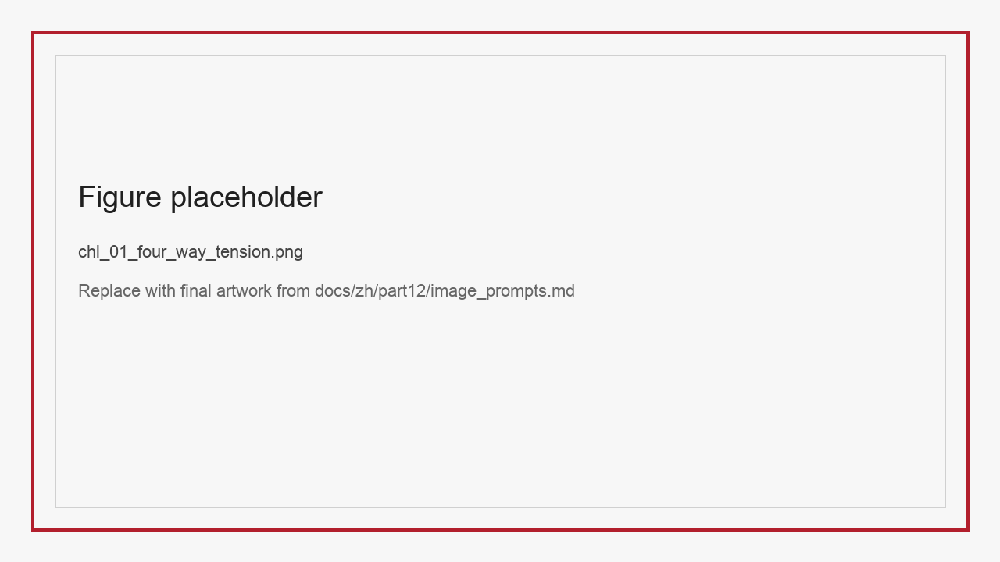
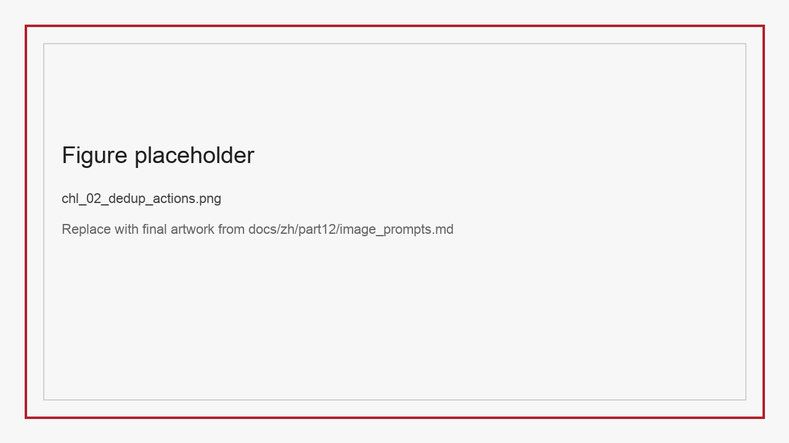
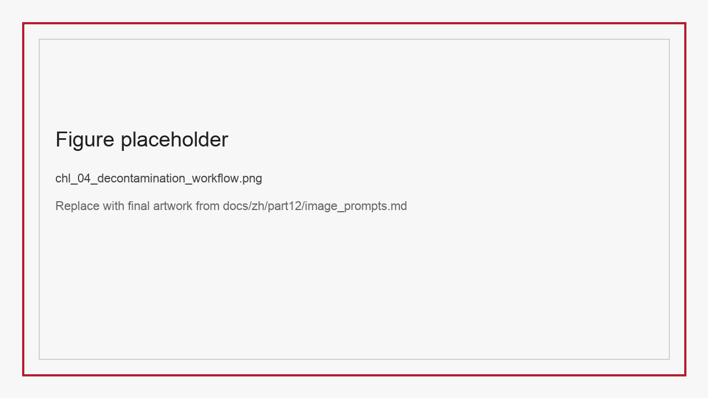
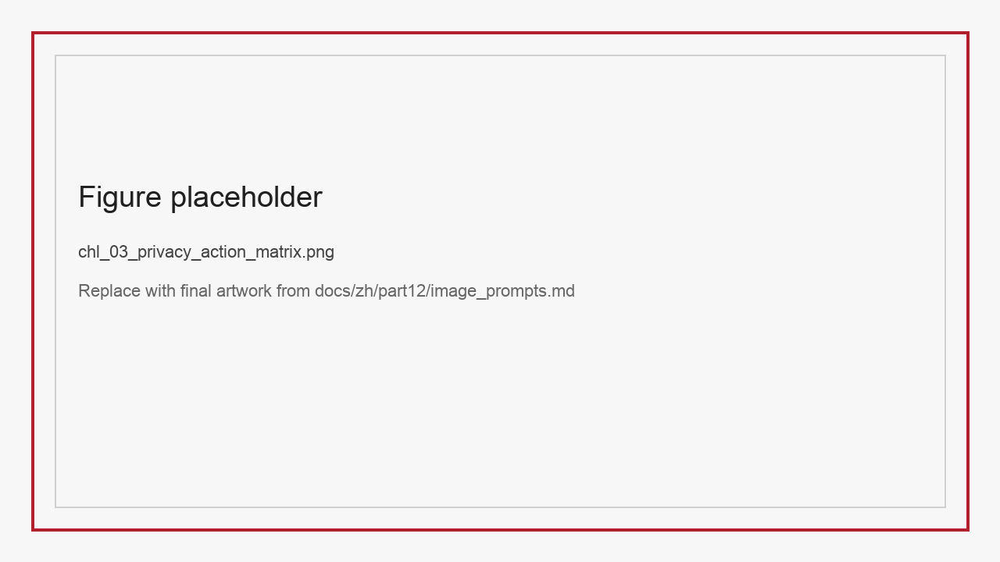

# ChL 清洗、去重、去污染与隐私数据集

在很多团队的习惯里，“清洗”是数据工程中最早、也最基础的一步：删乱码、去广告、去模板、去空行、去重复。然而当数据进入大模型时代，清洗的意义发生了变化。它不再只是把看上去脏的内容擦干净，而是在质量、泛化、合规与评测可信度之间做艰难平衡。删得太少，模型会学到噪声；删得太多，模型会失去真实分布；去重不彻底，benchmark 可能被污染；去重过度，又可能误伤风格多样性；隐私字段不处理，上线就有合规风险；隐私处理过重，又会破坏训练价值。

因此，本章不把清洗、去重、去污染和隐私治理看作四个彼此独立的工序，而是把它们视为一组相互牵连的决策。清洗决定样本是否可用，去重决定信息是否冗余，去污染决定评测是否可信，隐私治理决定资产是否可发布、可共享、可教学复现。它们共同回答同一个问题：**哪些信息应该保留，哪些信息必须去掉，以及这个决定能否被解释和审计。**

*图L-1 数据处理不是单向优化，而是在质量、泛化、评测可信度与合规之间持续权衡。*

## L.1 清洗不是“统一变干净”，而是“按任务保留价值”

最常见的清洗误区，是把所有异常都当作噪声。例如在普通网页文本中，模板片段、广告、导航栏和乱码往往应当删除；但在票据、医疗文档、表格与语音风格控制场景里，一些看似“脏”的信息恰恰是任务需要的真实信号。

StructBill-CN 就是一个典型例子。对通用 OCR 或文本抽取任务而言，无线表格中的空白区域、打印偏移、错列和长串数字，常被视为视觉噪声；但对高风险票据结构化抽取来说，这些正是决定任务难度的关键因素。如果团队为了“让数据更整洁”，把这些复杂布局样本大量过滤掉，训练出来的模型在真实场景中反而会崩得更快。

SparseTable-Bench 同样说明，清洗不能只围绕视觉完整度进行。稀疏表格中的大块空白区域不是无效像素，而是结构拓扑的一部分。若预处理把空白区域压缩、裁掉或简单视作背景，模型就失去了学习空单元位置的机会，后续极容易出现空列幻觉与结构漂移。

VoiceStyleControl 则揭示了另一种清洗困境：语音里的一些呼吸声、停顿、轻微颤音和情绪波动，从纯音频质量角度看也许是瑕疵，但从风格控制角度看却是重要监督信号。如果用“标准播音腔”审美去统一清洗，会把最有价值的 expressive cue 一起抹掉。

这意味着清洗必须服从任务定义，而不是服从统一审美。近年的高质量网页语料构建工作也反复说明，真正有效的清洗不是一次性“删脏”，而是围绕来源、去重、语言质量与可追溯性逐层蒸馏 (Penedo et al. 2024)。好的清洗策略会先回答三个问题：

- 这个异常对目标任务究竟是噪声还是信号？
- 这个异常应被删除、保留、弱化还是显式标注？
- 这个异常是否需要作为评测切片单独追踪？

### L.1.1 五类最容易误删的“高价值脏样本”

在真实项目里，最危险的不是保留了明显垃圾，而是误删了少量关键难例。以下五类样本尤其需要谨慎。

第一类是结构异常但任务关键的文档样本，例如无线票据、错列发票、歪斜扫描件。它们看上去“不干净”，却往往代表真实高风险分布。  
第二类是稀疏表格中的大面积空白区域。对通用视觉任务它们像背景，对 SparseTable-Bench 却是拓扑核心。  
第三类是情绪强烈但音质略差的语音样本。对 VoiceStyleControl 而言，这类样本可能比干净但平淡的语音更有训练价值。  
第四类是多工具、多轮 observation 的长轨迹。它们会拉高平均 token 开销，却往往最能训练 Agent 的恢复能力。  
第五类是 hard reasoning 样本中的中间试探步骤。若把这些样本过度“润色”成线性答案，Latent-Switch-69K 一类数据的价值就会下降。

因此，清洗策略不应只看“脏不脏”，还要看“这类脏样本是不是模型真正不会做的部分”。这也是为什么清洗规则最好和评测切片联动设计，而不是由预处理脚本单独决定。

### L.1.2 清洗规则应该如何和评测切片联动

很多团队把清洗看成训练前的一次性动作，把评测看成训练后的独立动作，于是两边各做各的。真正成熟的做法，恰恰是让清洗规则反向受评测切片约束。

如果评测切片显示无线表格、长账单和金额字段是高风险区域，那么清洗就不应继续简单删除所有版面混乱或数字密集样本。  
如果评测切片显示 fear 与 sad 情绪边界始终脆弱，那么清洗就不能为了“音质整齐”把高张力、轻抖动、轻噪声样本统一去掉。  
如果评测切片显示 Agent 在多轮恢复任务上持续失分，那么清洗就不能把所有轨迹冗长、途中出错的样本当作“坏轨迹”直接排除。

换句话说，评测切片回答的是“模型最容易在哪些地方失败”，清洗规则回答的是“这些失败相关样本到底该删、该留还是该显式标注”。两者只有联动起来，团队才不会一边抱怨模型在某些边界上太差，一边又在预处理阶段把边界样本主动洗掉。

### L.1.3 清洗规则也需要版本化与回滚

很多数据团队会认真给模型、评测脚本和数据集打版本号，却忽略了清洗规则本身也在不断变化。结果就是，某次数据质量突然“变好”或“变差”时，团队往往先怀疑模型和训练配置，却说不清是不是清洗脚本在某一版里额外删掉了一大批边界样本。

因此，清洗规则最好被当成正式版本资产维护。每次规则调整都至少应记录三件事：改了哪条规则、预期影响哪类样本、是否允许回滚。尤其是在多人接续维护的数据集场景里，不同成员、不同阶段维护脚本的风格并不一致，如果没有版本化，很容易出现“后来的人继承了一套结果，却完全不知道当初删样本的理由”的情况。

从工程收益看，清洗规则版本化至少有三个直接作用。第一，它让团队能把指标波动和数据处理变更一一对应起来。第二，它能帮助团队识别“哪些规则长期有效，哪些规则只是短期掩盖问题”。第三，它让教学复现更可信，因为课程实验可以明确锁定某一版清洗规则，而不是在学期中不断漂移。

## L.2 去重：重复不只是文本重复

大模型团队通常最熟悉的是文本去重，例如 exact duplicate、near duplicate、MinHash、SimHash、embedding dedup。其中 MinHash 一类近似去重方法本来就来自文档相似性与包含关系建模 (Broder 1997)。但随着数据模态和任务类型扩展，重复的形式变得更加隐蔽。

第一类是内容重复。它表现为文本相同、图像相同、音频相同或结构完全一致。  
第二类是近似重复。内容可能有轻微变化，例如同一票据的不同截图、同一表格的不同裁剪、同一语音的不同增强调制。  
第三类是语义重复。表面不同，实质是在教模型同一件事，例如同一个图表被改写出十几个高度相似的问题。  
第四类是评测重复。训练集与测试集在表面字段上不同，但在版式、答案模板、题目套路或来源文档上高度重叠。

在 multi-chart infographic reasoning dataset 这类数据上，语义重复尤为关键。不同子问题可能围绕同一张图的同一局部事实进行微调式提问，若不做语义去重或至少做簇级分析，就容易高估数据集的有效多样性。在 Ophiuchus 中，同一 ROI 可能衍生出多个选择题版本，如果它们只是换了选项表述而没有引入新观察策略，就会导致 agent 行为学习偏向模板化。

去重策略因此不应只有“删”这一种动作。更实用的做法是把样本分成三种处理结果：

- 删除：明显冗余且无新增价值。
- 合并：保留一个 canonical 样本，并记录其变体关系。
- 保留但降权：存在重复倾向，但各自仍提供少量差异信息。

*图L-2 去重不是简单的二元删除，合并与降权同样重要。*

### L.2.1 去重指标建议

| 重复类型 | 判定特征 | 典型方法 | 推荐动作 |
| :-- | :-- | :-- | :-- |
| Exact duplicate | 全字段或主字段完全相同 | 哈希、checksum | 删除 |
| Near duplicate | 局部改写、轻微增广 | MinHash、pHash、音频指纹 | 合并或降权 |
| Semantic duplicate | 问法不同、信息相同 | embedding 检索、聚类 | 合并簇，控制采样 |
| Benchmark duplicate | 训练与测试源头重叠 | 来源追踪、文档级 hash、版式聚类 | 隔离或重切分 |

### L.2.2 多模态去重为什么更容易做错

很多团队在文本数据上已经习惯了哈希、MinHash 或 embedding 去重，于是自然会把这套逻辑平移到多模态数据上。但真正进入文档图像、复合图表、语音控制和 Agent 轨迹场景后，去重会立刻变得复杂，因为“重复”的最小单位不再统一。

在 StructBill-CN 里，去重不能只看整张票据图像。两张扫描件可能因为裁剪、旋转、亮度变化而像素不同，但本质上仍是同一份业务记录。若只做像素级去重，团队会误把同一票据的多种扫描变体当作新样本。  
在 SparseTable-Bench 里，重复的风险常常来自拓扑变体而不是字符变体。同一张表格被不同方式裁切、遮挡或局部增强之后，文本未必重复，但结构难点高度重合。若这种重复集中进入训练和评测两端，就会虚高模型的结构鲁棒性。  
在 VoiceStyleControl 里，重复问题更隐蔽。相同文本、相同 speaker、相近情绪、相近 prosody 的组合即使不是逐字逐帧复制，也可能对模型形成高度重复监督。如果不控制这类组合重复，模型就会在某些标签搭配上“学得非常熟”，但在真正稀疏组合上依然脆弱。  
在 Agent 轨迹场景里，重复则往往体现在“同一个策略模板反复出现”。例如多个样本只是把工具参数换了一个数字，轨迹骨架却完全一样。这种数据看起来条数很多，实际上会让模型过度偏向少数固定解法。

因此，多模态去重真正需要统一的不是文件格式，而是“监督等价类”的概念。也就是说，团队要先回答：对于当前任务，什么样的样本变体仍然在教模型同一件事。只有把这个问题回答清楚，去重策略才不会停留在表层相似度。

### L.2.3 去重决策为什么不能只输出“删了多少”

很多项目汇报去重工作时，最喜欢展示的是一串看上去很漂亮的数字，例如“总共删除 18% 重复样本”“训练集体积压缩 22%”。这些数字当然有用，但它们只说明动作发生了，不说明动作是否正确。对于大模型数据来说，真正重要的是“删掉的是哪一类重复，保住的是不是关键多样性”。

因此，一个更成熟的去重报告，至少要回答四个问题：删除主要发生在哪些来源簇；合并与降权分别占多少；高风险评测切片是否受影响；是否有某些看似重复但被刻意保留的变体簇。尤其在 VoiceStyleControl 或 Agent 轨迹数据里，这类“刻意保留”很关键，因为表面相近的样本未必真是冗余，它们可能承载着不同情绪边界或不同恢复路径。

换句话说，去重报告的价值不在于证明团队“删得够狠”，而在于证明团队知道自己为什么删、为什么留，以及这个决定没有破坏任务真正需要的多样性。

## L.3 去污染：评测可信度比平均分更重要

当团队开始用高校数据集做 benchmark、教学实验或公开排行榜时，去污染的重要性会迅速上升。因为一旦训练数据与测试数据之间发生显式或隐式泄漏，所有漂亮分数都将失去意义。与普通去重不同，去污染的重点不在于减少冗余，而在于保护评测边界。

污染可以来自多个层面。最直观的是样本级重复：训练集中出现了测试题原文或同一图像。更隐蔽的是来源级污染：训练集和测试集都来自同一个原始文档库，只是切成了不同页面或不同题目。还有一种极难察觉的污染是模板污染：模型没有见过原题，但见过同一出题脚本、同一布局模板或同一数值生成机制，因此在测试时表现异常乐观。

StructBill-CN 与 SparseTable-Bench 这类结构化文档和表格数据尤其需要警惕模板污染。因为许多样本来自有限业务 schema，如果训练集和测试集只是文档内容不同，但版式和字段顺序高度一致，模型可能学习到的是模板记忆，而非真正的结构理解。类似地，在 VoiceStyleControl 中，如果同一说话人、同一语气模板同时大量出现在训练和评测中，风格控制表现也会被虚高。

因此，一个成熟的去污染策略通常包含三层隔离：

- 源级隔离：同一原始文档、同一录音源、同一原始图像不跨集合。
- 模板级隔离：相同版式、相同脚本、相同 prompt family 尽量不跨集合。
- 时间级隔离：新版本数据应尽量晚于历史模型训练窗口，避免“旧模型看过新测试”的不确定性。

### L.3.2 去污染工作流建议

在大多数团队里，去污染最容易被拖到最后做，因为它短期内不直接涨分，反而会让分数变难看。正因如此，才更需要把它前置到制度中。一个建议的工作流如下：

1. 在 raw source 层建立 document-level、image-level、audio-level 的唯一 ID。  
2. 切分训练/验证/测试之前，先做源级聚类与模板级聚类。  
3. 对所有 split 运行一次交叉近邻检索，筛出潜在重复和近重复。  
4. 对可疑簇人工抽查，必要时执行整簇迁移，而不是单条删改。  
5. 在 benchmark 发布前，冻结 split 并记录去污染报告。  
6. 每次版本升级时，检查新样本是否与历史测试集冲突。

*图L-4 去污染最好发生在切分之前，而不是排行榜上线之后再救火。*

### L.3.1 去污染检查清单

1. 训练集、验证集、测试集是否共享原始来源文件。
2. 同一文档、同一表格、同一对话模板是否被切碎后分散到了不同集合。
3. 数据集构造脚本是否在不同 split 上复用了同一随机种子或相同模板。
4. 外部合成模型是否可能在公开 benchmark 上见过近似题型。
5. 教学实验是否允许学生调用已经针对测试集调优过的公开系统。

### L.3.3 去污染报告至少应写哪些字段

很多团队其实做了去污染，只是没有把过程沉淀成报告。结果是半年之后谁也说不清：当初到底检查了什么、切分依据是什么、哪些风险只是暂时接受、哪些风险已经被排除。

一个最低可行的去污染报告，至少应写清五类信息。  
第一类是样本来源说明，包括原始来源数量、来源层级、是否存在共享模板或共享脚本。  
第二类是切分原则说明，包括按来源切、按模板切、按时间切还是按主体切，以及为什么这样切。  
第三类是检测方法说明，包括 hash 去重、近邻检索、模板聚类、人工抽查比例等。  
第四类是处理结果说明，包括识别出多少可疑簇、迁移了多少簇、删除了多少样本、保留了哪些带风险但业务上必要的样本。  
第五类是残余风险说明，包括哪些污染风险暂时无法完全排除，以及后续版本如何继续处理。

去污染报告的价值，不只是对外透明，更是对内防遗忘。它能让团队在下一个版本更新时，不必重新猜测上个版本的评测边界是如何成立的。

### L.3.4 去污染灰区最适合怎样处理

去污染实践里最难处理的，往往不是显式重复，而是灰区样本。它们既不能被轻易判定为安全，也不一定有充分证据证明已经污染。例如同一医院不同月份的票据模板、同一图表数据脚本的不同视觉配色版本、同一说话人不同文本但极其相近的 prosody 模板，都可能落在这种灰区。

对灰区样本，最差的做法是“为了省事先放进去看看”。更稳妥的做法通常有三种。第一种是隔离处理，把灰区样本单独放入 shadow eval 或附加验证集，不直接进入主 benchmark。第二种是切片显式化，也就是把这类样本做成单独风险切片，避免它们以“普通样本”的身份稀释主结果。第三种是挂起决策，等后续证据更充分或任务边界更清晰后再决定是否释放。

这种保守并不是拖慢进度，而是在保护评测资产。因为一旦灰区样本未经说明地混进正式测试集，后续即使发现问题，修复代价也会远高于前期多保留一层隔离。

## L.4 隐私数据集：敏感信息不是“最后一步再处理”

许多团队把隐私处理理解为“上线前打码”。这是非常危险的。因为一旦数据在采集、标注、训练或开放共享阶段已经泄露，后面再怎么打码，都只是补救。更值得警惕的是，即便原始字段已经不再直接可见，模型仍可能在训练后暴露训练样本片段或敏感模式，这说明隐私风险并不会随着“表面脱敏”自动消失 (Carlini et al. 2021)。隐私治理应当从数据集构造阶段就进入主流程。

在本文涉及的数据集中，StructBill-CN 是最典型的高敏感样本，因为其底层对象是医疗票据与业务记录。即使来源来自公开学术数据，也必须重新审视字段级敏感性：姓名、住院号、医院信息、时间戳、诊疗项目组合和极端费用模式，都可能构成可识别信号。对于 VoiceStyleControl，声音本身就可能成为生物特征，speaker label 既是训练 supervision，也带来身份映射风险。Ophiuchus 虽然强调工具轨迹与视觉观察，但医学图像中的局部区域、病灶描述和文本注释同样需要谨慎处理。

因此，隐私数据集的治理应该包括四个层次。

第一层是字段分级。哪些字段属于直接标识符，哪些属于准标识符，哪些是业务关键字段但应脱敏后保留。  
第二层是动作分层。删除、掩码、泛化、伪造、局部模糊或受控保留，不应一刀切。  
第三层是场景分层。内部训练、跨团队共享、公开发布、教学实验四种场景的可见范围应不同。  
第四层是审计分层。每次脱敏、导出、二次构造和公开发布，都应保留可追溯记录。

*图L-3 隐私治理不是统一打码，而是字段分级、动作分层与场景隔离。*

### L.4.1 隐私数据集字段矩阵示例

| 字段类型 | 示例 | 风险等级 | 推荐动作 |
| :-- | :-- | :-- | :-- |
| 直接标识符 | 姓名、身份证号、住院号 | 高 | 删除或不可逆掩码 |
| 准标识符 | 医院名称、日期、地区、声音身份 | 中高 | 泛化、分桶、场景隔离 |
| 业务关键字段 | 金额、项目、情绪标签、工具返回状态 | 中 | 保留并加强审计 |
| 非敏感结构字段 | bbox、HTML 标签、schema key | 低 | 可保留 |

### L.4.2 面向公开发布与教学复现的隐私策略差异

很多团队会把“内部训练可用”误当成“可以公开发布”。事实上，两者在隐私治理上的门槛完全不同。

内部训练阶段的重点是可控访问和字段级审计，允许在受限环境中保留较多业务关键字段，只要访问链路和责任人明确。  
公开发布阶段的重点则是不可逆再识别风险控制，即便某些字段对研究有用，也必须优先服从最小暴露原则。  
教学复现场景又介于两者之间：它既不能像内部训练那样依赖强访问控制，也不能像公开发布那样把有效信号全部抹掉。因此，最好的办法通常是准备一套教学镜像数据，保留结构和统计特征，但对身份和来源线索进行更强泛化。

这三种场景不应共用同一份数据副本，否则团队迟早会在便利性与安全性之间失手。若任务确实需要在保留统计价值的同时降低泄露风险，还可以把差分隐私训练或教师集成蒸馏一类方案纳入备选，但它们应被视为额外的训练级治理设计，而不是替代字段治理与访问治理的捷径 (Abadi et al. 2016; Papernot et al. 2018)。

### L.4.3 隐私脱敏最常见的四种假安全

隐私治理最棘手的地方，不是团队完全不做，而是团队以为自己已经做了。很多看起来合规的处理，实际上只是制造了一层“假安全”。

第一种是假匿名。最典型的做法是把姓名替换成编号，或把 speaker label 从真实姓名改成 `spk_001`。这看起来像脱敏，但如果同一编号还能跨样本稳定映射到同一身份，外部就仍然可以通过上下文、声音特征或业务事件重新识别。  
第二种是假泛化。把具体日期改成“某年某月”、把医院改成“某三甲医院”、把地区改成“某省份”，若同时保留了高稀有组合字段，例如极端费用、罕见病种、稀少情绪与独特声纹，依旧可以形成准标识符拼接。  
第三种是假切图。对医学图像、票据图像或文档页面进行局部裁剪，并不天然等于安全。很多时候，局部区域本身就带有病灶形态、机构标记、票据流水信息或手写习惯特征，照样可能被关联回原始主体。  
第四种是假教学副本。团队为了方便教学，把公开副本、内部副本和教学副本混成一种“删掉几个字段”的中间版本。这往往最危险，因为它既没有内部环境的访问控制，也没有公开副本的充分脱敏。

这四类假安全之所以常见，是因为它们都满足一个心理预期：改动看得见，所以人会误以为风险已经下降。真正可靠的隐私治理，不是看改没改，而是看是否还能被跨样本、跨来源、跨场景重新关联。

### L.4.4 隐私评审会至少要有哪几类角色

隐私治理若只交给“最懂数据的人”单独判断，往往会失真。因为数据可用性、公开风险、教学需求和项目合规目标并不总是同一方向。更稳妥的做法，是在发布或共享前组织最小化的隐私评审会。

一个最低可行的评审组合，至少应包含四类角色。第一类是数据 owner，负责解释字段来源、真实业务用途和最小保留需求。第二类是任务 owner，负责说明哪些字段一旦去掉会直接破坏训练或评测价值。第三类是治理或合规代表，负责从跨场景再识别风险角度审视脱敏动作。第四类是教学或开放发布 owner，负责确认教学镜像、公开副本和内部副本之间是否真的分开。

把这些角色拉到同一张表上讨论，最大的收益不是让每次决策更慢，而是让“为什么保留、为什么删除、为什么分场景处理”都有清晰责任链。对多团队复用的数据集尤其如此，因为很多风险恰恰不是来自单个字段，而是来自跨场景传播时的语境变化。

## L.5 清洗、去重、去污染与隐私治理如何协同

现实中最难的，不是分别理解这四件事，而是决定它们的执行顺序与相互影响。一个常见错误流程是：先做训练集拼接，后做去重；先做 benchmark 划分，后做隐私处理；先做模板清洗，后意识到把困难样本洗掉了。更稳妥的流程应该是：

1. 明确任务边界与敏感字段。
2. 在原始数据层完成源级去重与高风险字段隔离。
3. 再进行任务感知清洗，避免误删关键难例。
4. 划分训练/验证/测试并执行去污染检查。
5. 最后做面向发布场景的隐私与开放治理包装。

这个顺序的核心原则是：越靠近原始数据源的动作，越应优先处理跨场景风险；越靠近任务训练的动作，越应优先保留任务价值。换句话说，先管“能不能安全用”，再管“怎么更有效地用”。

### L.5.1 本章可直接使用的检查清单

1. 当前清洗规则是否区分了“真实难例”和“纯噪声”。
2. 去重是否覆盖 exact、near、semantic 和 benchmark duplicate 四类。
3. split 划分是否在去污染审查之后冻结。
4. 训练副本、公开副本与教学副本是否分离。
5. 所有脱敏动作是否可审计、可回溯。
6. 是否为高风险字段单独保留评测切片，而不是一删了之。

### L.5.2 发布前的治理门禁应该长什么样

清洗、去重、去污染和隐私治理如果只是“做过就算”，最终很容易在发布环节失守。更稳妥的方式，是在数据集进入公开发布、课程实验或跨团队共享之前，设置显式门禁。

第一道门禁是来源门禁。团队必须能够回答每一批样本来自哪里、是否有授权、是否包含受限来源、是否与历史 benchmark 或内部保密语料重叠。若来源不清，即便样本质量很高，也不应进入公开链路。  
第二道门禁是结构门禁。团队必须能够说明当前版本中哪些字段被保留、哪些字段被删除、哪些字段经过泛化、哪些字段只在内部副本可见。没有字段级变更说明，后续的复现、审计和问题追责都会非常困难。  
第三道门禁是评测门禁。团队应确认 split 已冻结、去污染报告已出、关键切片可追踪、官方指标脚本已稳定。否则数据集虽然“发出来了”，但根本不具备基准属性。  
第四道门禁是风险门禁。对于高敏感样本、强模板数据、容易泄漏的任务，必须有明确的责任人确认是否适合公开、是否只适合教学镜像、是否只能保留在内部。  
第五道门禁是维护门禁。团队需要在发布前就确定后续谁处理 issue、谁更新版本、谁保管基线脚本、谁负责排行榜或课程镜像，而不是等问题出现了再临时找人。

这些门禁看上去会降低发布速度，但实际上是在避免更昂贵的返工。对一本强调数据工程实践的书而言，真正成熟的态度不是“尽快把数据发出去”，而是“确保它发出去之后还能长期站得住”。

### L.5.3 这四类治理动作最容易发生顺序错误

即便团队知道清洗、去重、去污染和隐私都重要，执行时仍然常常因为顺序错位而前功尽弃。最典型的四种顺序错误如下。

第一种是先做任务清洗，再看隐私。这样会让团队花大量时间优化一批最终根本不能离开内部环境的样本。  
第二种是先切 benchmark，再做来源去重。这样往往会导致后来不得不重切 split，所有早期实验一起失效。  
第三种是先做公开副本，再补教学镜像。结果通常是教学侧要么信号太弱、要么风险太高，只能反复返工。  
第四种是先发榜单，再补去污染报告。这样会把本应在发布前解决的问题，变成公开争议之后才补救的信誉问题。

顺序看起来只是项目管理细节，实际上决定了数据治理的成本曲线。很多返工并不是因为方法错，而是因为先后关系错。把顺序写清楚，本身就是一种很有价值的工程经验。

### L.5.4 发布签字不应只有“技术通过”

很多团队的数据发布流程最后只有一个非常粗的状态: “技术检查通过，可以发”。这在小项目里也许够用，但对要进入 benchmark、课程实验或跨团队共享的数据资产而言，远远不够。因为真正决定后续返工成本的，不只是脚本能不能跑通，而是治理链上有没有被明确签字。

一个更稳妥的发布签字单，至少应包含四个确认项：清洗负责人确认关键难例没有被系统性误删，去重负责人确认重复簇处理策略已落档，去污染负责人确认 split 与报告已冻结，隐私负责人确认各副本的开放边界已经明确。若这四项里任一项只是“默认大家都知道”，后续出了争议往往就没有人能真正对外解释。

从书稿角度看，这一节的价值在于把前面所有方法讨论收束成可执行流程。因为数据工程最终不是靠一套概念成立，而是靠每次发布时能否说清楚“这套资产为什么此刻可以被信任”。

### L.5.5 教学镜像与公开副本为何不能共用构建流程

很多团队在数据发布后会自然地想：既然公开副本已经做出来了，教学实验就直接用它，省事又统一。真正执行时，这往往会带来两类问题。第一类问题是教学信号不足。为了公开安全而做的强脱敏、强删减和强去污染，未必仍保留足够多的结构边界和失败模式，学生得到的可能只是一个“过于整洁”的版本。第二类问题是维护节奏冲突。公开副本可能需要随着 issue、申诉和版本修订持续更新，而教学实验更需要学期内稳定，不能边上课边改数据定义。

因此，教学镜像和公开副本最好共享原则，但不要共享完全相同的构建流程。前者更强调可复现、稳定和教学可解释性，后者更强调对外安全边界、公开责任与长期治理。把这两条流程在一开始就拆开，反而能减少后续反复返工，也更符合本篇关于“同一数据资产面向不同场景需要不同包装”的主线。

## L.6 本章小结

本章讨论的不是机械的数据预处理，而是清洗、去重、去污染与隐私治理之间的联动关系。核心结论有三条。

第一，清洗必须服从任务目标，不能把所有异常都当噪声。  
第二，去重和去污染是两件不同的事：前者减少冗余，后者保护评测边界 (Broder 1997; Lee et al. 2022)。  
第三，隐私治理必须前置进入数据集构造，而不是上线前的附加动作。最基础的一层，是像 k-anonymity 这样围绕再识别风险建立字段保护意识 (Sweeney 2002)。再往前一步，差分隐私把“保护强度如何定义”变成了更严格的统计问题 (Dwork et al. 2006)。而成员推断攻击一类工作则提醒我们，即便模型已经训练完成，隐私风险也可能在推理阶段重新暴露出来 (Shokri et al. 2017)。

下一章将转向多模态、RAG 与 Agent 轨迹数据集，进一步讨论不同任务形态下的数据 schema、监督信号与 benchmark 设计差异。

## 参考文献

Abadi M, Chu A, Goodfellow I, McMahan H B, Mironov I, Talwar K, Zhang L (2016) Deep Learning with Differential Privacy. In: Proceedings of the 2016 ACM SIGSAC Conference on Computer and Communications Security, pp 308-318.

Broder A Z (1997) On the Resemblance and Containment of Documents. In: Proceedings of the Compression and Complexity of Sequences, pp 21-29.

Carlini N, Tramèr F, Wallace E, Jagielski M, Herbert-Voss A, Lee K, Roberts A, Brown T, Song D, Erlingsson U, Oprea A, Raffel C (2021) Extracting Training Data from Large Language Models. In: 30th USENIX Security Symposium (USENIX Security 21), pp 2633-2650.

Dwork C, McSherry F, Nissim K, Smith A (2006) Calibrating Noise to Sensitivity in Private Data Analysis. In: Theory of Cryptography Conference, pp 265-284.

Lee K, Ippolito D, Nystrom A, Zhang C, Eck D, Callison-Burch C, Carlini N (2022) Deduplicating Training Data Makes Language Models Better. In: Proceedings of the 60th Annual Meeting of the Association for Computational Linguistics (Volume 1: Long Papers), pp 8424-8445.

Penedo G, Kydlíček H, Ben Allal L, Lozhkov A, Mitchell M, Raffel C, von Werra L, Wolf T (2024) The FineWeb Datasets: Decanting the Web for the Finest Text Data at Scale. In: Advances in Neural Information Processing Systems 37, Datasets and Benchmarks Track.

Papernot N, Abadi M, Erlingsson U, Goodfellow I, Talwar K (2018) Scalable Private Learning with PATE. In: International Conference on Learning Representations.

Shokri R, Stronati M, Song C, Shmatikov V (2017) Membership Inference Attacks Against Machine Learning Models. In: 2017 IEEE Symposium on Security and Privacy, pp 3-18.

Sweeney L (2002) k-Anonymity: A Model for Protecting Privacy. International Journal of Uncertainty, Fuzziness and Knowledge-Based Systems 10(5):557-570.
