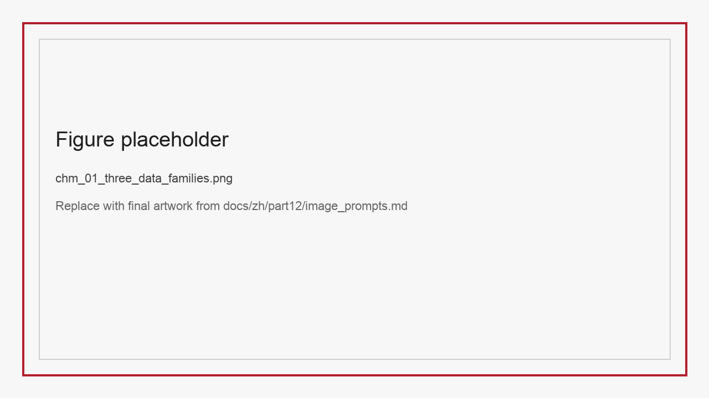
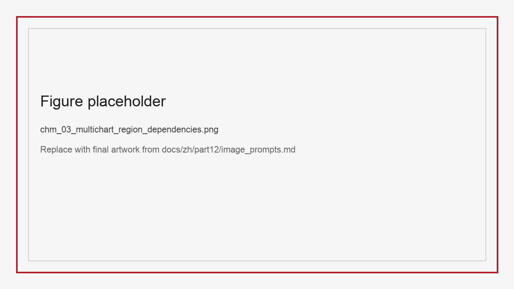
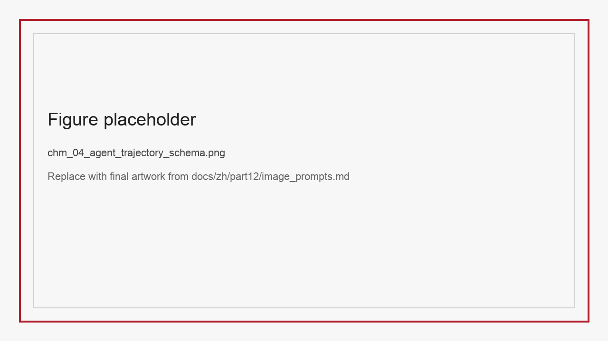

# ChM 多模态解析、RAG 与 Agent 轨迹数据集

如果把文本预训练数据看作“大模型的数据地基”，那么多模态解析、RAG 与 Agent 轨迹数据就是把模型真正推向复杂现实世界的承重结构。因为一旦任务从“读一段文字”升级到“看一份文档、理解一张图表、调用一个工具、跨多页证据回答问题”，数据形状就会发生剧烈变化。团队不再只面对 `prompt -> answer` 的简单关系，而是要同时处理页面布局、表格拓扑、图表局部区域、跨页面证据、工具状态与多轮观测。

最容易导致工程误判的地方在于，这些任务表面上都可以被归到“多模态”名下，但它们真正需要的监督信号并不相同。以文档解析为例，LayoutLM 与 LayoutLMv3 一类工作已经说明，页面结构、版面位置和文本内容必须被同时建模，单纯把图像转成文字远远不够 (Xu et al. 2020; Huang et al. 2022)。图表推理则更强调跨视觉区域的证据链，这一点在 ChartQA 一类工作里表现得很明显 (Masry et al. 2022)。RAG 数据关心的是检索证据与答案的对齐关系，这也是 Retrieval-Augmented Generation 一类方法最早强调的问题 (Lewis et al. 2020)。而 Agent 轨迹进一步要求模型在行动、观察与恢复之间形成闭环，因此 ReAct 与 Toolformer 给出的启发也并不相同 (Yao et al. 2023; Schick et al. 2023)。如果团队只用统一的图文问答格式去吸收这些数据，很多任务最珍贵的结构信息就会被主动抹平。

因此，本章的核心目标是建立三类数据资产的统一视角：

- 文档解析与图表理解数据集：解决“看得见、读得准、结构不漂移”。
- RAG 证据与检索数据集：解决“检得到、引得准、引用可审计”。
- Agent 轨迹数据集：解决“会行动、能观察、可恢复、可解释”。

*图M-1 三类数据家族共享“证据链”思想，但监督重点各不相同。*

## M.1 文档解析数据集：不仅是 OCR，更是结构与逻辑

文档理解任务最常见的误区，是把所有页面任务都理解成 OCR 的升级版。实际上，从财报、票据、病历到表格与表单，真正决定任务难度的往往不是字符本身，而是字符与结构、字段与逻辑之间的关系。

StructBill-CN 很适合作为这一点的主案例。它的目标不是把图像转写成文本，而是把复杂医疗票据转成可直接入库的层级 JSON，并同时满足 schema 与算术一致性约束。这意味着模型不仅要读字，还要理解哪一段文字属于全局 KV，哪一组数字组成同一行项目，哪一列之间存在乘积关系，最终总额又如何在文档级闭环。这类任务一旦只用字符准确率评价，就会严重低估逻辑错误风险。类似 DocVQA 与 PubTables-1M 这样的工作也早已表明，页面问答与表格抽取真正难的不是把字符抄出来，而是把页面结构、表格边界和可用监督形式组织成稳定数据接口 (Mathew et al. 2021; Smock et al. 2022)。

SparseTable-Bench 则把另一个常被忽视的问题推到前台：表格理解的难点不只在“读格子内容”，更在“恢复格子之间的空间拓扑关系”。对于稀疏或无边框表格，大块空白区域本身就是结构信号。如果训练数据没有显式记录空单元位置与 bbox，模型就容易在生成阶段脑补不存在的列或合并错误的单元格。换句话说，文档解析数据集必须同时提供内容监督和几何监督。

从工程角度看，这类数据集至少需要三个层级的 schema：

- 页面层：图像、分辨率、页码、文档来源、版面信息。
- 结构层：表格、段落、字段、bbox、阅读顺序、层级关系。
- 逻辑层：字段约束、聚合关系、校验规则、业务语义。

*图M-2 页面层、结构层与逻辑层共同构成文档理解数据的工程最小单元。*

### M.1.1 文档解析数据集需要回答的五个问题

1. 模型要输出的是纯文本、HTML、JSON 还是 schema-bound structure。
2. 页面中的空白、边框、对齐和阅读顺序是否被保留为显式信号。
3. 标签是按几何位置给出，还是按逻辑业务语义给出。
4. 评测是否同时覆盖字符正确性、结构正确性与逻辑正确性。
5. 高风险字段是否有专门切片，例如金额、数量、日期、总额、关键病灶描述。

### M.1.2 文档解析数据集最常见的三类失败模式

如果把文档解析只理解成“图像变文本”，团队就很难解释为什么很多模型在 OCR 指标不错时，业务结果却仍然频繁出错。从数据工程视角看，文档解析至少有三类常见失败模式。

第一类是阅读顺序失败。模型看到了所有字符，却没有学会从哪里读到哪里。例如表头与表体被错拼、跨栏内容被线性化成错误句子、页眉页脚插入正文。这类问题在票据、财报和病历里都非常致命，因为错误不在单字，而在结构展开顺序。  
第二类是层级恢复失败。模型能识别局部内容，但无法稳定恢复“全局字段、局部表格、子项明细、合计关系”之间的层级边界。这会直接导致看似完整的 JSON 里字段归属错位。  
第三类是业务逻辑失败。模型可能把每一格都读出来了，却没有保住真正高风险的算术关系、聚合关系或对账关系。对工程系统而言，这类错往往比字符错误更危险，因为它会以“格式正确”的样子进入下游数据库。

把这三类失败模式显式写进数据集说明和评测切片中，有两个直接好处：一是团队能更清楚地设计训练样本和规则校验器，二是读者不会再误把文档理解看成纯视觉识别问题。

### M.1.3 文档解析为什么要保留不可恢复样本

很多文档解析数据集在构造阶段会有一个强冲动：把太模糊、太偏斜、太遮挡或字段缺失严重的页面全部删掉。这样做当然能让平均标注质量更整齐，但也会带来一个严重副作用，即模型从未学过“何时应该承认无法可靠恢复”。

在真实系统里，不可恢复本身就是一种重要输出。某页票据可能因扫描截断导致总额字段缺失，某张表格可能因遮挡无法唯一恢复单元格拓扑，某段病历页边注可能因分辨率过低而不适合结构化抽取。若数据集只保留“总能恢复”的样本，模型就容易被训练成在任何情况下都强行输出结构，看上去格式完整，实则风险极高。

因此，文档解析数据集中最好有意识保留一部分不可恢复样本，并为它们提供显式标签或拒答路径。这不仅能提升系统的保守能力，也能帮助评测更接近真实业务边界。

## M.2 图表理解数据集：从“读数”走向“跨区域推理”

很多模型在 ChartQA 上拿到不错分数后，团队就会误以为“图表理解已经差不多了”。真实世界却远比标准单图问答复杂。企业报告、学术海报、商业信息图和医疗统计页面中，答案往往分散在多个子图、图例、时间轴、地图和补充说明之间。模型不仅要读局部，还要在视觉区域之间切换证据。

multi-chart infographic reasoning dataset 正好捕捉了这一点。它不是把一张图拆成若干独立题目，而是保留真实复合信息图结构，要求模型跨子图完成聚合、比较、运算与条件判断。这种设计带来两个重要启发。

第一个启发是：图表推理数据不应只保存“问题和答案”，还应尽量保存问题依赖的子图区域、图例关系、推理链路或至少推理类型标签。否则模型答对了也无法知道是靠读数、靠猜测还是靠跨区综合。

第二个启发是：不可回答问题必须成为正式任务的一部分。现实世界信息图经常存在视觉上不够、上下文不全或条件缺失的情况。如果 benchmark 永远假设“所有题都能答”，模型就会被奖励胡乱猜测。不可回答标签的存在，可以直接训练和评测模型的拒答能力。

### M.2.1 图表理解数据的推荐字段

| 字段 | 作用 |
| :-- | :-- |
| image_id | 对应完整信息图 |
| subchart_refs | 问题依赖的子图或区域 |
| question_type | 读数、比较、排序、加总、趋势、条件推理等 |
| answerability | 可回答 / 不可回答 |
| reasoning_hops | 单跳 / 多跳 |
| evidence_notes | 图例、时间、空间或补充说明线索 |

这些字段不仅有利于训练，也有利于评测归因。团队可以分开看“模型会不会读图”和“模型会不会整合多图证据”，避免总分掩盖真实短板。

### M.2.2 哪些图表最能帮助理解复合信息图推理

对于图表理解这一类任务，配图的价值并不在于增加版面丰富度，而在于帮助读者看清问题究竟依赖哪些证据区域。相比只给出抽象流程图，更值得优先保留的是那些能够直接展示“区域关系”和“证据类型”的图表：

*图M-3 建议标出子图区域、图例区域、时间轴区域与问题链路。*

*表M-1 可对照读数、比较、聚合、趋势、条件推理与不可回答问题。*

这两类图表最大的价值不在装饰，而在于帮助读者直观看到：为什么同样是“问图表问题”，有的题只需要单区读数，有的题必须跨区域拼接证据。

### M.2.3 区域级证据标注为什么不能省

图表理解数据集最常被省略的，恰恰是最关键的中间信息：区域级证据。很多团队觉得只要有完整信息图、问题和答案就足够，区域标注太贵、太细、太难统一。可一旦省掉这一层，后续训练和评测会立刻失去抓手。

没有区域级证据时，团队很难区分模型是“读不到正确区域”，还是“看到了正确区域但不会综合”。这两种失败在优化路径上完全不同。前者可能需要子图区分、区域检索或图例显式绑定；后者则更可能需要多跳推理样本、结构化中间表示或更强的 reasoning supervision。  
区域级证据还有一个常被忽略的作用：它能把不可回答问题真正定义清楚。若问题所需证据区域根本不存在，或关键区域缺少必要标注，模型拒答就不再只是“保守策略”，而是任务定义的一部分。

因此，区域级证据标注并不意味着每张图都要画到最细，而是至少要提供“问题依赖的哪些子图、图例、坐标轴或补充说明”这样的最小绑定关系。对于强调工程可评测性的书稿而言，这一点比再加一个总准确率更值得写清楚。

### M.2.4 图表不可回答样本应该如何构造

不可回答样本如果只靠“随便问一个图里没有的数字”来构造，价值其实很有限。因为这类样本对模型太容易，无法真正训练它理解证据缺失的边界。更有价值的不可回答样本，往往来自三种情形。

第一种是局部证据缺失型。问题看似合理，但关键子图、时间点或图例条件并未给出。第二种是跨区域断链型。单个子图都提供了部分信息，但缺少完成合并推理所需的桥接条件。第三种是定义冲突型。图表中存在相近概念或不同统计口径，问题如果不补充限定条件，就没有唯一答案。

这三类不可回答样本之所以重要，是因为它们能逼迫模型学会区分“我看不到”与“我没想明白”。对于开放 benchmark 和课程实验而言，这种区分比单纯再增加一些可回答题目更能体现任务边界。

## M.3 RAG 数据集：答案之外必须记录证据

RAG 场景最容易出现的误解，是把它当成“带检索的问答”。从工程角度看，这种说法太粗了。真正高质量的 RAG 数据，不只要保存 query 与 answer，还要保存 answer 成立所依赖的证据，以及证据是如何从原始语料中被选出、切片、引用和组合的。

一个不记录证据的 RAG 数据集，会带来三个后果。第一，团队无法判断模型答对是因为检索对了，还是因为模型先验知道答案。第二，无法比较不同 chunking、索引或 reranker 策略的真实差异。第三，无法审计引用质量，尤其在企业、金融、医疗和法务场景中风险很大。

因此，RAG 数据集至少应该有 `query -> answer -> evidence bundle` 这一最小结构。evidence bundle 不只是文档片段列表，还应包含来源、页码、时间戳、权限标记、证据类型和 hard negative。只有这样，团队才能真正比较“检索能力”和“答案生成能力”。

*图M-3 高质量 RAG 数据的最小单元不是 Q/A，而是 Query、Answer 与 Evidence Bundle 的联立结构。*

### M.3.1 推荐的 RAG Evidence Card 字段

| 字段 | 说明 |
| :-- | :-- |
| query | 用户问题或检索请求 |
| canonical_answer | 标准答案或答案范围 |
| evidence_ids | 证据片段编号 |
| evidence_type | 文本、表格、图像、页脚、附录等 |
| source_doc | 原始文档来源 |
| freshness | 时间属性或版本属性 |
| access_level | 权限控制级别 |
| hard_negatives | 容易混淆但不支持答案的片段 |
| citation_rule | 正确引用方式 |

这类结构特别适合与第七篇的 RAG 管线回链：第七篇强调“系统如何消费证据”，本章强调“数据集如何生产和评测证据”。

### M.3.2 RAG 数据集为什么必须显式记录 freshness 与 access level

在企业和机构场景中，很多 RAG 失败并不是因为检索不到，而是因为检索到了“不该引用的”或“已经过期的”内容。传统 benchmark 往往只看 answer 对错，却很少把 freshness 与 access level 正式纳入字段设计。这样会带来两类误导。

第一类误导是过期正确。模型给出的答案在历史上是对的，但在当前时间点已失效。如果 benchmark 不记录时间属性，团队会误把“查到旧答案”当成成功。  
第二类误导是越权正确。模型引用了本不该访问的附录、内部页或权限受限文档，答案也许对了，但系统层面是失败的。

因此，RAG 数据集若想真正服务工程，至少应把 `freshness` 与 `access_level` 当作正式字段，而不是附加注释。尤其在课程实验或开放 benchmark 中，这两个字段能帮助团队避免把“知识命中”与“合规命中”混为一谈。

### M.3.3 RAG 数据集里的负例为什么比正例更难构造

很多团队构建 RAG 数据时，最先想到的是把“问题-答案-证据”配齐。但真正拉开数据集质量差距的，往往不是正例，而是负例，尤其是 hard negative。

简单负例很好做，例如随机抽一段完全不相关的文本。这类负例对训练检索器和 reranker 的帮助有限，因为模型几乎不用思考就能排除它们。真正有价值的 hard negative 往往满足三个条件：表面相关、局部命中、整体不支撑答案。  
例如在财报问答里，一段证据可能提到相同年份和相同指标，但对应的是不同业务线；在制度问答里，一条证据可能提到同一流程名称，但适用于不同权限级别；在文档问答里，一块表格可能与问题共享相似字段，却来自另一页、另一主体或另一统计口径。

为什么这类负例难构造？因为它们要求构造者真正理解“证据为什么成立”。也正因此，负例质量会反过来暴露数据集本身是否理解了任务边界。若团队只能构造随机负例，通常意味着任务定义还不够扎实；若团队能稳定构造 hard negative，则说明它已经开始把检索、引用和归因看成一个整体系统。

对于本篇讨论的数据工程书稿来说，这一点非常值得明确写出，因为很多读者天然会把 RAG 数据集理解成“收集一些问答和文档片段”，却忽略了负例设计才是系统鲁棒性的关键来源。

### M.3.4 RAG 证据评测最容易漏掉的三件事

即使团队已经记录了 evidence bundle，RAG 评测仍然很容易做得过于粗糙。最常被漏掉的三件事，分别是证据完整性、证据顺序和证据可引用性。

第一是证据完整性。某些答案必须同时依赖表格、正文和附录，若模型只检到其中一半却碰巧答对，就不应被视为完整成功。  
第二是证据顺序。对于多跳问答，检索到正确片段不代表就能构成正确链路。模型可能先拿到结论再倒推理由，也可能混合不同主体的证据片段。像 HotpotQA 这类多跳问答数据之所以有代表性，正是因为它迫使系统面对“多个证据片段必须连起来才成立”的问题 (Yang et al. 2018)。若评测不关心证据顺序，就会高估系统对复杂任务的可靠性。  
第三是证据可引用性。某些片段虽然语义相关，但并不满足正式引用要求，例如缺乏页码、来源上下文不清、权限级别不符，或只是中间缓存文本。若这些都算成功，RAG benchmark 就会偏离真实企业使用要求。

因此，RAG 评测最好至少拆成三层：检到没有、检对没有、引得合不合规。只有这样，数据集才不会把“命中答案”错当成“完成了可审计问答”。

### M.3.5 Evidence Bundle 也需要版本管理

很多团队会给知识库整体打版本号，却忽略了 evidence bundle 本身也在变化。文档会更新、权限会变化、chunking 策略会调整、页码映射会修复，这些都会直接改变“同一个问题应该引用什么证据”。如果这些变化没有被版本化，后续就很难解释为什么上个月的 benchmark 还能通过，这个月却突然失败。

因此，RAG 数据集除了记录 query 和 answer，还应记录 evidence bundle 的版本上下文，例如证据所属文档版本、chunk 生成规则、索引批次和权限快照。这样做的好处是双重的。一方面，它让实验结果真正可复查；另一方面，它也让课程实验和公开 benchmark 能在相对固定的证据世界中运行，而不是跟着知识库日常漂移。

### M.3.6 多证据答案为什么不能只标一个“标准片段”

很多 RAG 数据集在标注时为了省成本，只给每个问题指定一个“标准证据片段”。这种做法在单跳事实问答里也许勉强可用，但一旦问题需要跨段、跨页或跨模态聚合，它就会迅速失真。原因很简单，真实答案经常不是来自单一片段，而是来自一个证据束。

例如一条制度问答可能需要正文说明流程定义、附录补充权限边界、表格给出时间例外；一条财报问答可能需要管理层讨论区解释指标口径，再由表格给出最终数值；一条文档问答还可能需要图像区域提供印章、正文提供主体、页脚提供日期。若数据集只标一个“主片段”，后续系统即使检到完整证据束，也会在评测里被低估；反过来，某些只检到局部片段却碰巧答对的系统，则可能被高估。

因此，RAG 数据设计更稳妥的方式，是允许 evidence bundle 明确标出“必要证据”“辅助证据”“干扰近邻”三种角色。这样一来，训练、评测和归因都能更接近真实知识系统，而不是被单段匹配思路牵着走。

### M.3.7 RAG 数据集发布前最值得做的三类审计

RAG 数据集在进入公开 benchmark 或课程实验前，最容易被忽略的不是答案质量，而是证据系统本身是否稳定。更稳妥的做法，是在发布前至少做三类审计。

第一类是证据完整性审计，确认 query 对应的 evidence bundle 是否真的足以支撑答案，而不是仅靠标注者先验补全。第二类是权限一致性审计，确认所有证据的 access level 与 benchmark 规则一致，避免出现“答案正确但引用越权”的样本。第三类是版本漂移审计，确认当前 evidence bundle 所指向的文档版本、chunk 规则和页码映射在发布周期内不会快速失效，或者至少会被清晰记录。

把这三类审计前置，有助于让 RAG 数据集的开放质量更接近真实企业环境，而不是停留在一次性学术演示。对于本章来说，这也进一步说明为什么 RAG 数据不能只被理解成“问答配文档片段”，而必须被看作一种带治理边界的证据资产。

## M.4 Agent 轨迹数据集：行为与观测都必须被保存

在很多团队的最初实践中，Agent 数据集只是“多轮对话 + 函数调用 JSON”。这种做法能让模型学会输出工具名和参数，但远远不足以教会模型真正的行动策略。因为真实 Agent 并不是调用完工具就结束，而是要读取环境返回的新状态，根据观测继续判断下一步，并在失败时恢复。

Ophiuchus Tool-Integrated Medical VQA 就体现了这一点。它把 `<tool_call>` 与 `<obs>` 明确写进监督信号，让模型不仅学习“要调用什么工具”，还学习“调用后该如何利用返回图像继续推理”。这比单纯记录函数名重要得多，因为在很多场景下，工具返回结果本身就是最关键的新证据。

从更一般的 Agent 任务出发，一条可工程复用的轨迹至少应保存以下要素：

- 初始任务与上下文。
- 中间思考或策略片段。
- 每一步 tool call 与参数。
- 环境或工具返回的 observation。
- 中间状态更新、失败标记与恢复动作。
- 最终答案或最终动作结果。

### M.4.1 Agent Trajectory Schema 建议

| 字段 | 说明 |
| :-- | :-- |
| task_id | 任务编号 |
| user_goal | 用户目标 |
| state_0 | 初始状态 |
| trajectory | 由 thought、tool_call、obs、state_update 组成的序列 |
| failure_type | 若失败，失败属于哪一类 |
| recovery_action | 是否执行恢复动作 |
| final_outcome | 最终答案、最终状态或执行结果 |
| audit_tags | 是否需要人工介入、是否高风险 |

*图M-4 Agent 轨迹不是对话文本，而是带状态与观测回流的行动序列。*

### M.4.2 为什么恢复样本是 Agent 数据最容易缺失的部分

Agent 数据构造时，团队最容易保留的是“成功轨迹”，因为成功轨迹看起来最整洁、最适合展示，也最像可以直接训练的示范。但如果数据里几乎没有恢复样本，模型就会学到一个高度理想化的世界：工具一调就对、观察一拿就懂、路径一走就通。

真实环境并不是这样。模型经常会遇到放大后仍不清晰的病灶区域、返回为空的检索结果、错误的中间工具选择、与预期不一致的 observation，甚至权限不足、输入字段缺失和多轮回退。这些情形如果从数据里被系统性删除，模型在训练时就根本学不到“发现失败并纠正失败”的能力。

这也是 Ophiuchus 一类轨迹数据集特别有代表性的原因。它提醒我们：Agent supervision 不应该只记录“正确答案是怎么来的”，还应记录“本来可能会错在哪里，以及后来如何被纠正”。对课程实验和开放 benchmark 而言，恢复样本还有一个额外价值，那就是帮助读者理解工具能力边界，而不是只看最终是否答对。

因此，构造 Agent 轨迹数据时，至少应主动保留三类恢复样本：首次工具选择错误后被纠正的样本、observation 已返回但第一次解读失败的样本、以及多轮回看或多工具组合后才成功的样本。这些样本也许会拉高平均轨迹长度，却是训练可靠 Agent 的必要成本。

### M.4.3 Agent 轨迹为什么要保存失败原因码

如果轨迹里只记录“成功”或“失败”，后续几乎无法做细粒度归因。一个 Agent 失败，可能是工具名选错、参数错、读取 observation 错、状态更新错、恢复策略缺失，或者最终表达格式不被系统接受。把这些失败都压成同一个标签，会让后续修复动作失去方向。

因此，Agent 数据最好为失败轨迹保留显式原因码，哪怕一开始只定义 5 到 8 个粗粒度类别，也比完全没有强得多。这样一来，团队就能分别观察“哪些失败主要靠补工具示例解决，哪些失败必须补 observation 利用样本，哪些失败其实是环境接口设计问题”。对第十二篇后续的实验归因和排行榜治理来说，这类原因码也非常有价值，因为它们能把“答错了”进一步拆成真正可行动的修复类型。

### M.4.4 Agent 评测不能只看最终任务成功率

只看最终成功率，是 Agent 数据评测里最容易出现也最危险的简化。因为同样一个“成功”，可能来自完全不同的行为过程。有的轨迹一路合理、有的轨迹频繁试错后侥幸完成、有的轨迹甚至在高成本外部能力帮助下才走通。如果这些路径在评测里全被折叠成一个成功标记，团队就无法知道系统究竟会不会稳定行动。

因此，更可用的 Agent 评测至少应把结果拆成四层。第一层是任务成功率，回答最终是否完成。第二层是工具有效率，回答调用是否合理。第三层是 observation 利用率，回答返回结果有没有真的进入后续决策。第四层是恢复率，回答系统在犯错后是否具备自纠能力。对于像 Ophiuchus 这样的数据集，这四层指标远比一个单独准确率更能反映“Agent 是否真的学会了行动”。

这一点值得在本章写透，因为它和本篇后面的开放 benchmark 设计直接相关。若数据集本身没有保留这些行为字段，后续排行榜再精致，也只能展示一个缺乏解释力的总分。

### M.4.5 Agent 轨迹数据如何转成可教学实验

Agent 轨迹看起来最像“研究型数据”，但其实也很适合转成课程实验，只是前提是把复杂度拆开。一个更可落地的做法，是把教学目标分成三层：先理解轨迹结构，再诊断失败原因，最后提出修复动作。

基础层实验可以要求学生阅读并重放一批轨迹，标出 thought、tool_call、obs、state_update 和 final_outcome 的边界，理解为什么 Agent 数据不是普通对话。进阶层实验可以要求学生围绕 failure_type 和 recovery_action 做切片诊断，比较“答错是因为工具选错”还是“工具返回了但没有利用”。开放层实验则可以进一步让学生设计新的恢复样本或失败原因码，并验证它们是否提升了恢复率或 observation 利用率。

这样的课程设计有一个明显好处：它把 Agent 从“会不会调用函数”重新拉回到“能不能稳定行动”的工程问题上，也为本篇后面的教学实验与开放 benchmark 章节提供了具体落地入口。

## M.5 跨任务统一评测：为什么必须看切片，而不是只看总分

文档解析、图表理解、RAG 和 Agent 数据表面差异很大，但从数据工程角度，它们都涉及“证据链是否完整”的问题。不同任务的评测统一点，不在于用同一指标，而在于分别回答三个问题：

1. 模型是否找到了正确证据。
2. 模型是否正确利用了证据。
3. 模型是否把结果表达成了可消费结构。

这也是为什么本章反复强调 schema、evidence card 和 trajectory schema。没有这些中间结构，团队就只能拿最终正确率做总比较，进而把结构失败、检索失败、工具失败和表达失败混成一团。

一个更成熟的统一评测框架可以采用“任务内指标 + 跨任务元指标”的双层设计：

- 任务内指标：如 `TEDS`、`ACR`、`tool validity`、`evidence recall`。
- 跨任务元指标：如证据完整性、结构可消费性、恢复能力和高风险切片鲁棒性。

这样的设计尤其适合 ChN 继续展开，因为它天然连接到实验设计、切片归因和策略回写。

### M.5.1 一张跨任务统一评测表应该如何组织

为了避免读者把文档解析、RAG 和 Agent 三类任务看成毫不相干的集合，建议在本章保留一张统一评测总表，至少包含以下列：

| 任务家族 | 最小样本结构 | 主指标 | 关键切片 | 易错点 |
| :-- | :-- | :-- | :-- | :-- |
| 文档解析 | image + structure + logic | TEDS、ACR | 无线表格、长文档 | 结构漂移、算术错 |
| 图表理解 | infographic + subchart refs | accuracy、拒答率 | 跨图表、多步推理 | 证据断链 |
| RAG | query + answer + evidence | evidence recall、citation quality | 新鲜度、权限 | 检索到错证据 |
| Agent | goal + trajectory + obs | tool validity、recovery rate | 多轮观察、失败恢复 | 行为顺序错 |

这张表很适合作为本章中段的“横向总览”，也方便后续在 ChN 中承接实验矩阵。

### M.5.2 跨任务统一基线不应该怎样搭

跨任务统一评测听起来很吸引人，但如果基线设计得过于偷懒，统一就会变成误导。最常见的错误有三种。

第一种错误是把所有任务都压成单轮问答。这样做看似统一输入输出，实际上会主动抹掉结构字段、证据链和轨迹状态，最后比较出的只是“谁更会生成一句答案”，而不是谁更会完成任务。  
第二种错误是让外部能力使用条件不一致。例如某个文档任务允许外部 OCR、某个 RAG 任务允许闭源检索 API、某个 Agent 任务允许额外环境缓存，而另一个任务不允许。这样的统一表面上整齐，实则没有可比性。  
第三种错误是只保留主指标，不保留元信息。若团队不记录输入分辨率、是否检索、是否工具增强、是否使用多轮推理预算，统一基线表就会迅速变成只剩分数的黑箱。

因此，更成熟的统一基线应该统一三件事：资源口径、样本结构消耗方式、以及报告元数据。只有在这些前提一致的情况下，跨任务总表才真正有解释力。否则它只是把彼此不可比的结果放在同一页上。

### M.5.3 把多模态、RAG 和 Agent 写成同一篇的真正理由

读者可能会自然发问：为什么要把文档解析、图表理解、RAG 和 Agent 放在同一章，而不是拆成若干独立短章。真正的原因，并不是它们都“看起来很热门”，而是它们在数据工程层面共享同一种难题。

这个共享难题可以概括成一句话：模型不是缺答案，而是缺“答案从哪里来、凭什么成立、接下来该怎么用”的中间结构。  
文档解析要解决的是字段与结构从页面哪里来；图表理解要解决的是结论依赖哪些区域；RAG 要解决的是答案依赖哪些证据束；Agent 要解决的是下一步动作依赖哪些 observation。  
一旦用这个视角去看，四类任务的共性就会非常明显：它们都要求数据集保留中间结构，而不能只保留最终输出。

把这件事写透，其实就是在为第十二篇后面的实验设计和开放基准章节打地基。否则读者会误以为后面那些评测、切片和排行榜只是额外包装，而看不见它们本来就是由这些中间结构自然生长出来的。

### M.5.4 跨任务评测报告至少要保存哪些元数据

当团队真的开始把多模态、RAG 和 Agent 放进同一个评测框架时，最容易漏掉的并不是指标，而是元数据。没有元数据，后续所有横向比较都会开始失真。举例来说，同一个文档解析模型是否用了更高分辨率，同一个 RAG 系统是否开了重排序，同一个 Agent 是否允许多轮恢复，这些条件一旦不写清楚，总表里的分数就会失去解释力。

因此，跨任务评测报告至少应统一保存六类元数据：输入资源口径、是否使用外部能力、是否启用中间结构监督、是否允许拒答或恢复、切片覆盖范围、以及评测版本号。它们看起来不像“结果”，却决定了结果能否被长期比较。对于本书这种强调从数据资产走向实验资产的写法来说，这类元数据正是把章节之间真正连起来的胶水。

### M.5.5 多模态、RAG 与 Agent 的共享失败面板应该怎么建

如果团队希望把本章三类任务真正放进同一套运营面板，那么最有效的做法不是硬凑统一指标，而是统一失败视角。一个共享失败面板至少可以沿四个维度展开：证据没找到、证据找到了但没用好、过程状态没有被保留、最终输出不可消费。

在文档解析中，“证据没找到”可能表现为阅读顺序错或区域定位错；在 RAG 中则可能表现为召回缺失或证据束不完整；在 Agent 中则可能表现为 observation 已返回但没有进入后续状态更新。类似地，“最终输出不可消费”在文档里是 schema 漂移，在 RAG 里是引用格式不合规，在 Agent 里则可能是工具走通了但结果没有转成系统可接受的结构。

这样的共享面板有两个好处。第一，它帮助团队把三个看似不同的任务重新对齐到同一套工程语言。第二，它为后续的 ChN 和 ChO 准备好了实验归因与榜单呈现的共同接口。换句话说，本章不是在并列介绍三类热门任务，而是在建立它们可以被放到同一个实验与治理体系里的原因。

### M.5.6 为什么统一评测表里必须保留“不可恢复”与“不可回答”

很多统一评测表只列成功指标，却不列“边界输出”指标。这会带来一个非常直接的问题：模型越倾向于强行回答、强行恢复结构，看起来越容易在总表里拿高分，但真实风险也越高。对本章讨论的三类任务来说，这种风险尤其明显。

在文档解析里，“不可恢复”意味着页面信息本身不足，不应强行生成结构化字段；在图表与 RAG 里，“不可回答”意味着关键证据缺失或条件不充分；在 Agent 里，则可能意味着 observation 不足以支撑下一步动作。若统一评测表里不保留这些边界输出项，团队就会系统性奖励过度自信。

因此，统一评测表除了主指标之外，最好显式保留拒答率、不可恢复判定准确率或恢复中止合理率等边界指标。这样做不仅更符合真实系统需要，也会让后续归因与开放榜单设计更有解释力。

## M.6 本章小结

本章讨论了三类关键数据资产：文档解析与图表理解数据集、RAG 证据数据集和 Agent 轨迹数据集。核心结论有三条。

第一，多模态任务不应被粗暴压缩成统一的图文问答格式，监督信号必须保留结构差异。  
第二，文档解析看重结构与逻辑，图表理解看重跨区域证据链，RAG 看重 evidence bundle，Agent 看重状态与观测回流。  
第三，跨任务统一评测的关键不是同一指标，而是围绕“证据是否找到、是否利用、是否结构化输出”建立共同框架。RAG 相关工作已经说明，仅仅答对并不能证明系统真正找到了可靠证据 (Lewis et al. 2020)。若再把检索层看得更细，像 DPR 这样的工作也提醒我们，“是否先把可用证据召回出来”本身就是一个独立问题 (Karpukhin et al. 2020)。到了 Agent 场景，这个框架还要继续向前延伸到“证据拿到之后是否真的进入了后续行动” (Yao et al. 2023)。

下一章将进一步讨论这些数据集进入实验系统后，团队如何做实验设计、评测切片和效果归因，避免被单一平均分误导。

## 参考文献

Huang Y, Lv T, Cui L, Lu Y, Wei F (2022) LayoutLMv3: Pre-training for Document AI with Unified Text and Image Masking. In: Proceedings of the 30th ACM International Conference on Multimedia, pp 4083-4091.

Lewis P, Perez E, Piktus A, Petroni F, Karpukhin V, Goyal N, Küttler H, Lewis M, Yih W-t, Rocktäschel T, Riedel S, Kiela D (2020) Retrieval-Augmented Generation for Knowledge-Intensive NLP Tasks. In: Advances in Neural Information Processing Systems 33, pp 9459-9474.

Mathew M, Karatzas D, Jawahar C V (2021) DocVQA: A Dataset for VQA on Document Images. In: Proceedings of the IEEE/CVF Winter Conference on Applications of Computer Vision, pp 2200-2209.

Schick T, Dwivedi-Yu J, Dessì R, Raileanu R, Lomeli M, Hambro E, Zettlemoyer L, Cancedda N, Scialom T (2023) Toolformer: Language Models Can Teach Themselves to Use Tools. In: Advances in Neural Information Processing Systems 36.

Smock B, Pesala R, Abraham R (2022) PubTables-1M: Towards Comprehensive Table Extraction From Unstructured Documents. In: Proceedings of the IEEE/CVF Conference on Computer Vision and Pattern Recognition, pp 4634-4642.

Xu Y, Li M, Cui L, Huang S, Wei F, Zhou M (2020) LayoutLM: Pre-training of Text and Layout for Document Image Understanding. In: Proceedings of the 26th ACM SIGKDD International Conference on Knowledge Discovery & Data Mining, pp 1192-1200.

Yao S, Zhao J, Yu D, Du N, Shafran I, Narasimhan K R, Cao Y (2023) ReAct: Synergizing Reasoning and Acting in Language Models. In: International Conference on Learning Representations.

Karpukhin V, Oguz B, Min S, Lewis P, Wu L, Edunov S, Chen D, Yih W-t (2020) Dense Passage Retrieval for Open-Domain Question Answering. In: Proceedings of the 2020 Conference on Empirical Methods in Natural Language Processing, pp 6769-6781.

Masry A, Long D X, Tan J Q, Joty S, Hoque E (2022) ChartQA: A Benchmark for Question Answering about Charts with Visual and Logical Reasoning. In: Findings of the Association for Computational Linguistics: ACL 2022, pp 2263-2279.

Yang Z, Qi P, Zhang S, Bengio Y, Cohen W, Salakhutdinov R, Manning C D (2018) HotpotQA: A Dataset for Diverse, Explainable Multi-hop Question Answering. In: Proceedings of the 2018 Conference on Empirical Methods in Natural Language Processing, pp 2369-2380.
