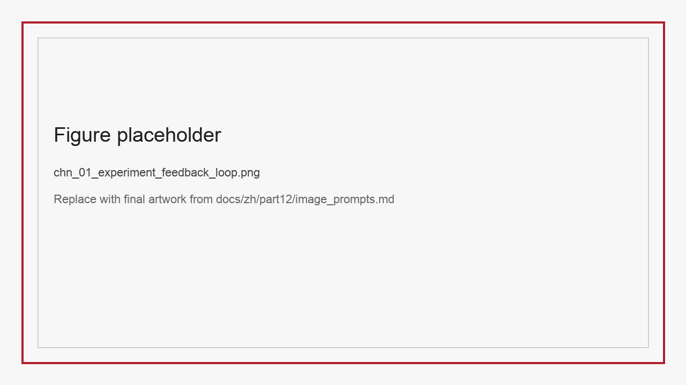
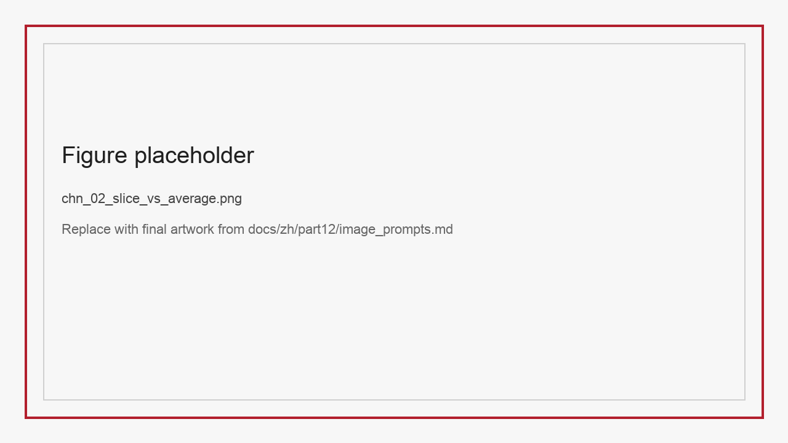
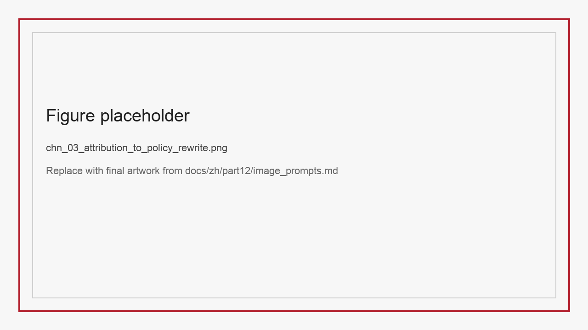

# ChN 数据实验设计、评测方法与效果归因

数据工程团队最常见的幻觉之一，是把“分数提升”直接等同于“数据策略有效”。但只要项目做得稍微复杂一些，这种推断就会迅速失灵。一次训练结果变好，可能是模型结构换了、训练时长变了、采样种子变了、评测集被污染了、输入分辨率提高了，也可能真的是数据本身更好了。若不把实验设计和效果归因做扎实，团队最终得到的不是知识，而是一串无法复用的偶然数字。统计显著性检验首先提醒我们，单次涨分远远不足以支撑稳定结论 (Dror et al. 2018)。影响函数与分布漂移基准则进一步说明，训练样本、测试环境和外部分布之间的关系比表面分数复杂得多 (Koh and Liang 2017; Koh et al. 2021)。而围绕神经语言处理分析方法的系统梳理也说明，若没有稳定分析框架，团队很容易把局部现象误读成机制性解释 (Belinkov and Glass 2019)。

尤其在本篇讨论的高校数据集场景中，这个问题格外突出。StructBill-CN 强调逻辑一致性，SparseTable-Bench 强调结构鲁棒性，multi-chart 强调跨图表推理，Ophiuchus 强调工具行为，Latent-Switch-69K 强调 latent-switch 边界，VoiceStyleControl 强调内容与风格双控制。若继续用单个平均分或单次 ablation 来评价它们，结论一定会被过度简化。

因此，本章讨论的不是“怎么跑实验”这样泛泛的操作问题，而是三个更具体的工程问题：

- 我们应该如何设计对照关系，才能把数据因素与其他因素尽量分开。
- 我们应该如何定义切片，才能看见平均分掩盖的结构性问题。
- 我们应该如何把实验结果回写到采集、清洗、去重、配比、标注与训练策略中。

*图N-1 实验的终点不是报分，而是把结论写回数据管线。*

## N.1 为什么数据效果很难被正确归因

在讨论归因之前，必须先承认一个现实：数据效果几乎总是与其他因素纠缠在一起。最典型的纠缠来自四类变量。

第一类是模型变量。基座模型不同、tokenizer 不同、上下文长度不同、视觉编码器不同，都会改变数据收益。一个对 7B 模型有显著帮助的数据策略，在 70B 模型上可能只有边际收益。

第二类是训练变量。学习率、batch size、采样配比、训练时长、冻结策略、RL 超参等，都可能与数据质量发生交互。很多“数据提升”其实来自训练制度变化，而非样本本身。

第三类是评测变量。输入分辨率、外部工具是否允许、是否启用检索缓存、是否做 test-time rerank、是否后处理答案，都会影响最终结果。评测口径稍有变化，就足以让不同实验不可比较。

第四类是污染与随机性。训练集和测试集的隐性重叠、模板泄漏、随机种子波动、多路采样不稳定，都会让团队把偶然表现误判为稳健结论。

这意味着，数据实验的第一原则不是“尽快看到上涨”，而是“尽量缩小结论空间”。一个结论若无法排除显而易见的混杂因素，它就不能指导下一步数据决策。

### N.1.1 六类最常见的归因错觉

为了让“混杂因素”不只是一个抽象名词，我们可以把常见归因错觉直接拆出来。

第一类错觉是“更大的实验一定更可信”。实际上，若变量缠在一起，大实验只会把不确定性放大成更昂贵的不确定性。  
第二类错觉是“总分上升就是数据更好”。很多时候，总分只是被 easy 样本拉起来，真正关键切片并没有改善。  
第三类错觉是“新增字段带来的提升就是字段本身有用”。若同时改了训练时长、输入分辨率或采样比例，就不能直接这样下结论。  
第四类错觉是“模型用了工具所以 Agent 更强”。也许它只是多拿到了额外信息，却没有学会更好的行动策略。  
第五类错觉是“CoT 变短所以推理更高效”。若没有同步报告正确率和时延，短输出可能只是少写了过程，而不是更会做题。  
第六类错觉是“风格命中率提高所以控制能力变强”。若 speaker pool 更单一、文本更模板化，这种提升可能只是数据分布更容易。

把这些错觉显式列出来，有助于读者在阅读后续实验设计时保持警惕：很多漂亮结论并不是假的，但也远未强到可以直接写进长期策略。

## N.2 实验设计矩阵：从问题开始，而不是从模型开始

很多失败实验的共性，是团队先选好模型和脚本，再思考“拿什么数据跑一下”。更有效的顺序应该相反：先明确要验证的数据假设，再设计最小充分实验。

举例来说：

- 若问题是“schema reward 是否真的提升票据逻辑一致性”，就应把 StructBill-CN 的主指标放在 `Row-ACR` 与 `Doc-ACR`，而不是先盯总 F1。
- 若问题是“空单元显式标注是否提升稀疏表格鲁棒性”，就应在 SparseTable-Bench 上设置标准测试与 `STB-Mask-Stress` 双条件。
- 若问题是“工具轨迹监督是否改善行动策略”，就应在 Ophiuchus 上同时报告答案准确率、tool validity 和 observation utilization。
- 若问题是“latent-switch 数据是否让模型更高效地推理”，就应比较正确率、显式 CoT 长度和延迟，而不是只看答案是否正确。
- 若问题是“风格标签是否真的被模型学会”，就应在 VoiceStyleControl 上加入 speaker consistency 与 emotion accuracy，而不是只看文本可懂度。

### N.2.1 数据实验设计矩阵示例

| 假设 | 数据集 | 对照组 | 主要指标 | 关键切片 | 预期回写 |
| :-- | :-- | :-- | :-- | :-- | :-- |
| schema reward 提升逻辑一致性 | StructBill-CN | SFT-only vs SFT+SRPO | Row-ACR、Doc-ACR | 无线表格、长账单 | reward 设计、逻辑样本采样 |
| 空单元标签提升结构鲁棒性 | SparseTable-Bench | 无空单元 vs 显式空单元 | TEDS-S | body/header/random mask | 标注协议、几何监督 |
| 工具轨迹提升行动策略 | Ophiuchus | 直接VQA vs 工具增强SFT | tool validity、obs 利用率 | zoom / segmentation 任务 | 轨迹字段、环境反馈 |
| latent-switch 提升效率 | Latent-Switch-69K | long CoT vs short CoT vs latent-switch | accuracy、tokens、latency | hard 数学 / 代码题 | reasoning 数据配方 |
| 风格标签提升可控生成 | VoiceStyleControl | 无控制 vs emotion 控制 vs speaker+emotion 控制 | speaker consistency、emotion acc | fearful/sad 边界 | 标签设计、合成规则 |

### N.2.2 四类最常用的数据实验设计

为了让实验卡片真正可复用，本章建议把数据实验固定拆成四类。

第一类是 holdout 设计。它适合回答“新增数据是否带来稳定增益”。重点是 split 边界清晰、训练制度固定。  
第二类是 ablation 设计。它适合回答“到底是哪一种字段、哪一种 reward、哪一种样本切片起作用”。  
第三类是 shadow eval 设计。它适合高风险场景，在不影响主流程的前提下，先观察新数据策略是否改变线上或准线上表现。  
第四类是 counterfactual slice 设计。它适合追问“如果只改某一类样本，结果会发生什么变化”，特别适用于高校数据集这种标签清楚、切片明确的场景。

如果团队不预先区分这四类实验，就很容易把本该做切片验证的问题交给一次性大训练，把本该做线上 shadow 的问题误塞进离线 benchmark，最终既花钱又得不到清晰结论。

### N.2.3 数据样本量、训练预算与实验结论如何配平

很多团队在做数据实验时，会天然地把“加更多样本”当成最稳妥策略。但在真实项目里，样本量、训练预算与实验结论之间经常彼此拉扯。样本加得太少，结论不稳；加得太多，成本过高，反而看不清是哪一类数据起了作用。

一个更成熟的思路，是把实验分成三层预算。

第一层是方向验证预算。它的目标不是追求最好结果，而是快速回答“这类数据值不值得继续投”。在这一层，团队应优先使用小规模、强切片、强对照的实验，而不是一上来就大规模混训。对评测成本高、切片又很多的任务来说，还可以借鉴主动测试一类思路，用更少样本先逼近最值得看的错误区域，再决定是否扩大正式评测范围 (Kossen et al. 2021)。  
第二层是结构验证预算。当前一层已经说明方向可能有效，就进入“到底是哪些字段、哪些切片、哪些样本结构在起作用”的阶段。这时最重要的不是再扩大总量，而是控制变量和拆清贡献。  
第三层是规模放大预算。只有在方向和结构都已清楚之后，才值得投入更大训练成本，验证该策略在正式生产规模上是否仍然成立。

把这三层预算混成一轮大实验，会带来最常见的伪结论：模型变好了，但团队不知道是因为数据量变大、数据结构变清晰，还是训练时长变长。对于强调工程归因的章节来说，明确这一点非常关键。

### N.2.4 对照组不应偷带额外收益

很多看似“设计严谨”的数据实验，最后仍然无法归因，并不是因为没有对照组，而是因为对照组偷偷携带了额外收益。最常见的情况有四种。

第一种是训练预算不对齐。实验组多训练了几个 epoch、用了更长上下文、开了更高分辨率，却仍被写成“只是换了数据”。第二种是资源口径不对齐。实验组允许额外 OCR、额外检索或更强后处理，对照组却没有。第三种是切片构成不对齐。表面上总样本数相同，但实验组在 hard 样本、高风险样本或关键任务切片上占比更高。第四种是报告口径不对齐。实验组展示切片分和辅助指标，对照组只展示总分，结果读者天然会把前者看成更完整、也更优秀。

因此，一个真正可用的对照组，不只是“换一列数据”那么简单，而是要保证除了目标变量之外，其他比较条件尽量锁定。更严格一点说，实验设计文档里至少应显式写出三类锁定信息：训练资源是否一致、评测资源是否一致、切片配比是否一致。只有先把这些条件写死，后续才有资格讨论“数据策略是否有效”。这类约束看起来会拖慢实验速度，但它能显著减少团队在复盘会上围绕伪提升来回争论的时间。

### N.2.5 同一结论最好跨两种预算层复核

很多团队在第一轮小预算实验里看到一个方向有效，就急着把它写进长期路线图；也有团队反过来，只相信大预算实验，对小样本验证一概轻视。这两种做法都不稳妥。对数据工程而言，更可靠的做法通常是让同一结论至少跨两种预算层出现一致信号。

例如，若某类结构样本在小预算实验中显著改善 `Row-ACR`，那么更成熟的下一步不是立刻全量扩样，而是先在中等预算层确认这种提升是否仍然出现在同一组关键切片上。反过来，如果某个策略只在大预算实验里表现出优势，却在小预算和中预算层都没有任何早期信号，那就要高度警惕它可能只是训练制度或资源堆叠带来的偶然收益。

这类跨预算复核的重要性在于，它能帮助团队区分三种情况：方向真的有效、方向只在特定资源条件下成立、方向本身其实不稳。把这三种情况混在一起，是很多数据项目后期越来越重、却越来越说不清楚为什么还要继续投的根源。

## N.3 切片评测：平均分为什么经常误导团队

平均分之所以危险，不是因为它没用，而是因为它太容易掩盖结构性短板。一个模型在 StructBill-CN 上可能总体 `KV-F1` 很高，但恰恰在金额字段和总额校验上连续失败；在 SparseTable-Bench 上可能标准集不错，但在遮挡 stress 条件下断崖式下滑；在 multi-chart 上单跳题表现很好，却在跨子图问题上接近随机；在 VoiceStyleControl 上文本清晰可懂，但 fear 和 sad 的边界几乎完全混淆。

因此，切片评测不应被视为“锦上添花的分析图”，而应当进入正式实验设计。一个成熟的数据实验，至少需要三种切片：

第一，任务切片。按问题类型、难度、模态、结构、是否需要工具、是否不可回答等划分。  
第二，风险切片。按高风险字段、高业务价值样本、复杂布局、极端长度、少数情绪类别等划分。  
第三，来源切片。按原始来源、版式模板、采样时间、标注人员、合成模型版本等划分。

切片的价值在于，它把“哪个子群体在退步”显式暴露出来。没有切片时，团队只能看到一个混合平均分；有了切片，团队才知道下一步该增补哪类样本、修复哪类标签、重写哪类规则。

*图N-2 平均分可能稳步上升，但关键切片完全可能同时退化。*

### N.3.1 切片矩阵建议

为了避免切片设计过于随意，建议团队在立项时就先画出切片矩阵。下面这类矩阵通常足够实用：

| 维度 | 示例 | 为什么重要 |
| :-- | :-- | :-- |
| 任务维度 | 单跳 / 多跳 / 工具调用 / 不可回答 | 暴露能力结构差异 |
| 风险维度 | 金额字段 / 高风险病灶 / 权限文档 | 暴露业务风险 |
| 难度维度 | easy / medium / hard | 暴露泛化与上限 |
| 结构维度 | 无线表格 / 稀疏表格 / 多子图 | 暴露布局敏感性 |
| 来源维度 | 不同医院 / 不同模板 / 不同 speaker pool | 暴露分布偏差 |

团队只要在每次实验后固定刷新这张矩阵，就能很快看出“提升是全面的，还是只发生在某一角落”。这比在会议上围绕一个总分争论更有效。

### N.3.2 切片结果应该怎样写进实验报告

很多团队其实已经做了切片，只是没有把切片变成稳定的报告结构。结果就是：实验会开的时候临时展示几张图，下一轮实验又重新来过，切片知识没有沉淀。

一个更稳妥的实验报告模板，至少应把切片写成四段。

第一段写“切片定义”，明确本次切片是按任务、风险、来源还是结构分层。  
第二段写“主趋势”，说明哪些切片整体改善、哪些切片持平、哪些切片退化。  
第三段写“异常切片”，指出最需要解释的两到三个切片，而不是把所有表格都堆出来。  
第四段写“回写动作”，也就是这次切片结果具体会改采集、改清洗、改标注还是改 reward。

当报告形成固定结构之后，切片就不再是“附录分析”，而会变成正式实验结论的一部分。像 HELM 这样的整体评测框架之所以有启发性，也正因为它要求团队把能力维度、评测条件和结果解释一起写清楚，而不是只交一个总榜单分数 (Liang et al. 2023)。对于本篇讨论的高校数据集来说，这尤其重要，因为这些数据集真正的工程价值正体现在它们能否稳定暴露某些关键子问题。

### N.3.3 失败实验复盘不应只写“没有提升”

团队最容易浪费掉的，不是成功实验，而是失败实验。很多实验在周报里只留下一句“本轮没有提升”，接着就被新的配置覆盖。长期下来，团队既记不住哪些路走不通，也不知道失败到底是样本问题、切片问题，还是实验口径问题。

更成熟的做法，是把失败实验也写成固定复盘模板。至少应回答四个问题：这次原本要验证什么假设；结论为什么不能成立；失败主要发生在哪些切片；下一轮是继续验证、调整设计，还是直接止损。只有把失败实验结构化保存，团队才能真正积累“哪些数据策略在什么条件下不值得继续投”的反知识。

| 复盘字段 | 应回答的问题 | 典型示例 |
| :-- | :-- | :-- |
| 原始假设 | 这轮实验想证明什么 | “显式空单元标签可提升遮挡稀疏表格鲁棒性” |
| 失败位置 | 是总分不涨，还是关键切片退化 | `TEDS-S` 在 body mask 上下降 |
| 主要原因 | 是变量没控住，还是数据本身无效 | 训练时长变化掩盖真实贡献 |
| 处置建议 | 下轮该怎么做 | 改成固定预算的 counterfactual slice 实验 |

对第十二篇这样的收束章节来说，失败复盘尤其重要，因为作者不是在展示一组偶然成功案例，而是在教读者如何建立一套能排错、能止损、能持续迭代的数据实验制度。把失败写清楚，往往比再多展示一张上涨曲线更有方法价值。

### N.3.4 实验报告发布前最好设置四道门禁

很多团队以为实验结束的标志是“图表已经画出来”，其实真正决定结论能不能进入长期资产的，是发布前的门禁。若没有门禁，实验报告就很容易把一次局部上涨写成组织共识，把本来只在某个切片成立的现象扩写成普遍规律。

一个更成熟的实验报告，至少应通过四道门禁。第一道是设计门禁，确认假设、对照组、资源口径和主要切片在实验前已经写明，而不是结果出来后再反向组织叙述。第二道是复现实验门禁，确认关键结论至少能被复现一次，或在多个随机种子下方向一致。第三道是风险门禁，确认高风险切片没有被平均分掩盖，尤其是票据总额、稀疏遮挡表格、跨图表多跳、工具恢复轨迹和情绪边界等本篇高价值场景。第四道是回写门禁，确认这轮实验是否真的能指导下一步动作，如果结论无法转成采样、清洗、标注、配比或评测改动，那么它更适合作为观察而不是策略。

把这四道门禁写进实验制度，最大的收益不是让报告更“官样”，而是让团队逐渐形成一致语言：哪些结果足够进入路线图，哪些结果还只能留在观察区。这样一来，实验报告承担的就不再只是单次展示功能，而会逐步变成一套可以被反复调用的实验治理框架。

### N.3.5 哪些切片应该被升级成长期监控项

不是所有切片都值得长期保留。很多团队一开始切了非常多的维度，最后却发现看板越来越重、复盘越来越慢，真正高风险的问题反而被淹没。更稳妥的做法，是在几轮实验后把部分切片升级成长期监控项，其余切片保留为临时诊断项。

通常值得长期监控的切片，至少满足三条中的两条：第一，它直接对应高风险业务后果，例如总额一致性、不可回答误答、越权引用、Agent 恢复失败；第二，它在多个版本里反复波动，说明并非一次性噪声；第三，它一旦恶化，就很可能被平均分掩盖。若团队还能结合训练动态去观察样本长期处于易学、模糊还是困难区域，就更容易判断某个切片究竟是短期噪声，还是已经值得升级为长期治理对象 (Swayamdipta et al. 2020)。满足这些条件的切片，应进入固定面板、固定周报和固定年度总结，而不是每轮临时决定看不看。

这样做的收益，在于让切片系统从“实验附属物”变成“治理基础设施”。这种长期监控意识也能明显提升章节的工程厚度，因为它把实验评测和后续的开放 benchmark、课程实验真正接在了一起。

## N.4 归因：从“相关性”走向“可行动解释”

很多团队把归因理解成“找一个最好看的解释”。真正有价值的归因则必须满足一个条件：能指导下一轮动作。也就是说，归因不是为了讲故事，而是为了决定采集、清洗、标注、配比、训练和评测要改什么。

实用的归因可以分成三个层级。

第一层是样本级归因。分析某条样本为什么错，是读错、结构错、推理错、工具错、风格错还是 verifier 错。这一层适合做 error taxonomy 和 hard case 池建设。

第二层是切片级归因。不是问“这一百条为什么错”，而是问“为什么这一类样本系统性更难”。例如无线表格、不可回答图表、多步工具轨迹、fear-sad 语音样本等。

第三层是策略级归因。把切片级发现写回管线。例如：  
如果无线表格错误显著，则增加结构先验样本与几何标注；  
如果工具轨迹主要错在 observation 利用，则补多轮观测样本而不是继续加单轮 VQA；  
如果 latent-switch 只在 hard 题有效，则调整困难样本配比与 budget 调度；  
如果风格控制主要错在某些情绪边界，则优化情绪 prompt 与 reference pool。

### N.4.1 可行动归因模板

| 现象 | 可能原因 | 排除方法 | 归因结论 | 回写动作 |
| :-- | :-- | :-- | :-- | :-- |
| 总分上涨但逻辑分不涨 | 只学到字符匹配 | 看 Row-ACR/Doc-ACR | schema reward 未真正生效 | 重写 reward、增加逻辑切片 |
| 标准集稳但 stress 掉分 | 结构先验不足 | 对比 TEDS 与 TEDS-S | 几何鲁棒性缺失 | 补空单元/遮挡样本 |
| 答案对但工具乱用 | 答案靠先验命中 | 分析 tool validity | 行为策略未学会 | 增加轨迹监督与恢复样本 |
| 文本清楚但风格不稳 | 控制标签弱 | 做 speaker/emotion 评测 | 风格 supervision 不足 | 强化风格标签和判别器 |

### N.4.2 从归因到策略回写的典型路径

归因的终点不是写一段“原因分析”，而是改系统。最常见的回写路径大致有五种：

1. 回写到采集：若某个关键切片长期稀缺，就应补采来源，而不是只靠训练补救。
2. 回写到清洗：若某类难例被误删，应调整清洗规则，把它们从噪声集合移出。
3. 回写到标注：若错误主要来自 schema 歧义或风格标签不稳，应重写标注协议。
4. 回写到配比：若新增数据只提升 easy 样本，应重新调高 hard 样本或高风险切片比例。
5. 回写到评测：若旧指标掩盖了真实问题，应升级 benchmark 的切片与辅助指标。

*图N-3 真正有价值的归因必须落到采集、清洗、标注、配比或评测的某一步。*

### N.4.3 避免伪归因的三道保险

归因最怕的不是暂时解释不清，而是解释得太快。很多“听起来合理”的结论，后来被证明只是训练噪声、模板泄漏或资源口径变化带来的错觉。为了降低这类风险，团队至少需要三道保险。

第一道保险是复现实验。若某个关键结论只出现一次、只在某个随机种子下成立，就不应立刻写进数据策略。  
第二道保险是口径复核。团队应确认输入分辨率、可用工具、外部资源、后处理脚本和评测版本没有悄悄变化。很多看似“数据贡献”的提升，实际来自评测制度变化。  
第三道保险是替代理论排除。若团队认为某个改动提升来自 reward 设计，就应至少尝试排除“只是样本量变大”“只是训练更久”“只是模板更统一”这类竞争性解释。对于带过程监督的推理任务，这一步尤其关键，因为 step-level verifier 或过程打分若没有被单独核验，很容易把“过程看起来更完整”误判成“推理真的更可靠” (Lightman et al. 2024)。

这三道保险不会让归因变得完美，却能显著降低团队把偶然现象写成长期策略的概率。对于第十二篇这样的数据工程收束篇章而言，这种克制比制造过度确定感更重要。

### N.4.4 跨版本归因台账至少要保存什么

当实验跨越多轮版本后，归因最容易失真的地方并不在模型，而在记录。团队往往还能记得“最近几周大概做了什么”，却说不清楚某次提升究竟对应哪次数据修复、哪次评测变更、哪次切片重定义。只要记录链断掉，后续所有解释都会开始漂移。

因此，建议把归因台账当成正式资产维护。一个最低可行的台账至少应保留六类字段：版本号、目标假设、变更摘要、被锁定的比较条件、关键切片结果、回写去向。这里最重要的不是写得多，而是让每一轮实验都能回答“这次到底改了什么，没改什么，为什么值得继续往前走”。

| 台账字段 | 含义 | 为什么必要 |
| :-- | :-- | :-- |
| run_id / version | 这轮实验的唯一标识 | 避免后续混淆不同试次 |
| hypothesis | 本轮要验证的假设 | 防止结果出来后反向改口径 |
| controlled_factors | 被锁定的训练与评测条件 | 支撑可比较性 |
| changed_data_factors | 真正改动的数据因素 | 支撑归因 |
| slice_outcomes | 关键切片变化 | 避免只看总分 |
| writeback_decision | 最终写回动作 | 让归因进入管线 |

很多团队在项目后期会有一种错觉，认为台账只是管理工作，不属于“技术内容”。恰恰相反，归因台账是把技术结论沉淀成可复查资产的必要接口。没有它，后续读者很难判断一章里的结论是来自单次幸运实验，还是来自长期可复验的工程判断。

### N.4.5 归因评审会最应该讨论什么

在很多项目里，归因讨论常常演变成一种“谁更会讲故事”的会议。有人强调模型结构，有人强调数据策略，有人强调训练预算，最后大家对结果都有解释，却没有一致行动。更有效的做法，是把归因评审会限定成四类问题。

第一类问题是“这次变化究竟发生在哪些切片”。若不能回答这一点，就不应进入原因讨论。第二类问题是“最强的替代理论是什么”。例如某个提升到底来自新增样本、训练更久、评测变更，还是模板更统一。第三类问题是“有哪些证据足以排除这些替代理论”。没有排除动作的归因，本质上仍是猜测。第四类问题是“如果把本轮结论写回系统，具体改哪一层”。也就是说，采样、清洗、标注、配比、训练和评测究竟谁承担动作。

这种会议结构看起来更克制，却能显著减少低质量争论。因为它迫使团队把解释压缩成可证伪、可执行的表达，而不是停留在“听起来很合理”。从写作角度看，这也有助于把本章的讨论维持在工程方法而非经验故事层面。

### N.4.6 归因结论如何进入季度路线图

如果归因工作只停留在实验复盘文档里，它很快就会失去影响力。真正成熟的组织，会把归因结论进一步翻译成季度路线图中的资源分配决策。也就是说，归因不只是解释过去，而是决定未来三个月哪些动作优先做、哪些动作暂缓做、哪些动作彻底止损。

一个实用的翻译方式，是把归因结论分成三类。第一类是“应立即回写”的结论，例如高风险切片持续退化且原因明确，这类结论可以直接进入采样、标注或评测修订计划。第二类是“需要复核后再回写”的结论，例如只在某一预算层出现的增益，这类结论应进入下一轮验证计划。第三类是“暂不进入路线图”的结论，例如解释不足或替代理论未排除的上涨，只能保留在观察区。

归因一旦以这种方式进入路线图，团队就更容易回答一个关键问题：为什么这个季度优先补某类样本，而不是继续加总量；为什么要重写某个切片定义，而不是继续堆更多训练。对整本书的收束来说，这也是把实验结果真正转成数据运营动作的重要桥梁。

## N.5 典型案例：六个数据集如何进入统一归因框架

为了避免归因方法停留在抽象原则，我们用本篇涉及的六个数据集快速映射一次。

StructBill-CN：总分之外必须单独跟踪金额、数量、总额与 schema 完整性，否则模型容易被“抄结构”掩盖真实逻辑问题。  
SparseTable-Bench：若 `TEDS` 尚可但 `TEDS-S` 崩溃，通常说明文本内容学到了一些，但空间结构未稳。  
multi-chart：若单步题上升、跨子图题不变，说明新增数据主要强化了局部读数，而不是全局综合。  
Ophiuchus：若答案准确率提高而 observation utilization 没变，说明工具监督可能只是带来了更多视觉线索，而不是行为能力本身。  
Latent-Switch-69K：若显式 token 变短但准确率不变，这是效率改进；若只在 easy 题不掉分、hard 题下降，则说明切换边界设计还不够稳。  
VoiceStyleControl：若文本 intelligibility 高，但 speaker consistency 与 emotion accuracy 低，说明模型在“说对内容”和“说出指定风格”之间仍未平衡。

把这些样本统一起来看，会发现一个共同规律：**真正重要的不是“这个数据集总分多少”，而是“它是否把任务核心矛盾暴露得足够清楚”**。一个好数据集和一个好实验设计的关系，正是互相放大彼此价值。

### N.5.1 本章适合保留的图表位

1. 数据实验设计矩阵总表。  
2. 平均分与切片分数背离示意图。  
3. 归因到策略回写闭环图。  
4. 六个数据集的统一归因雷达图。

如果暂时没有成图，可以先保留下面的图片占位，后续补图时不会破坏章节结构：

*图N-4 建议雷达维度包括结构正确性、逻辑一致性、证据完整性、行为稳定性、风格控制与鲁棒性。*

### N.5.2 一张统一归因面板至少要回答什么

如果团队只允许保留一张总览图，那么这张图不应该只是“六个数据集六条曲线”。更好的统一归因面板，至少要回答五个问题：哪类数据最依赖结构正确性，哪类数据最依赖证据完整性，哪类数据最依赖行为稳定性，哪类数据最容易受来源分布影响，哪类数据最容易被平均分掩盖关键风险。

这类面板之所以重要，是因为它能把本篇的六章内容重新收束成同一套判断语言。读者会看到，虽然 StructBill-CN、Ophiuchus、VoiceStyleControl 看起来完全不同，但在归因层面，它们都可以被问成相似问题：问题究竟出在结构、证据、行为、控制，还是评测口径。只有做到这一点，第十二篇才真正形成“从数据资产到实验资产”的闭环。

### N.5.3 归因章节为什么必须写得比“实验结果”更长

很多技术写作有一个惯性：把大量篇幅花在实验结果表，把归因只留给末尾几段评论。但对数据工程而言，真正能迁移复用的往往不是某一次分数，而是为什么这些分数成立、为什么某些分数不该被高估。

因此，归因章节应该比结果汇总更长，原因至少有三点。  
第一，结果天然依赖时间窗口和资源条件，而归因方法更能跨版本迁移。  
第二，读者真正想带走的不是“某数据集谁第一”，而是“遇到类似矛盾时，应该怎样拆变量、建切片、排除伪提升”。  
第三，第十二篇的任务不是单独再造一批 benchmark，而是把整本书前面关于数据、评测、项目和开放治理的内容收束成一套可重复的判断框架。

从这个意义上说，本章并不是在给前面章节做注脚，而是在给整本书提供“如何把数据工作说清楚”的方法论出口。

### N.5.4 六个数据集统一归因面板可以怎样落地

如果要把本篇涉及的六个数据集真正放进同一张归因面板，最重要的不是追求形式统一，而是先定义统一问题。一个可执行的面板至少可以用六列来组织：任务核心矛盾、主指标、关键切片、最常见伪提升、推荐回写动作、当前结论等级。

例如，StructBill-CN 的核心矛盾是“字符正确不等于逻辑正确”，因此主指标之外必须保留 `Row-ACR` 与 `Doc-ACR`，其最常见伪提升是字段匹配分上升但算术关系不稳，推荐回写动作往往是补逻辑样本与重写 verifier。SparseTable-Bench 的核心矛盾是“文本内容尚可但空间结构不稳”，关键切片应落在空单元和遮挡条件上。multi-chart 的核心矛盾则是“局部读数正确不代表全局推理成立”，其推荐动作常常是补跨区域证据与不可回答样本。Ophiuchus、Latent-Switch-69K 与 VoiceStyleControl 也可以按同样方式展开。

这类面板之所以值得写进书稿，是因为它让读者看到一件非常重要的事：归因不是章节末尾的修辞动作，而是把不同任务重新翻译成同一套判断语言的过程。只有把这层统一表达建立起来，后面的开放 benchmark、排行榜和教学实验才有稳定的讲述基础。

### N.5.5 从统一归因面板到年度数据路线图

如果统一归因面板最终只停留在一张图里，它仍然只是展示材料。真正更有价值的做法，是把这张面板继续翻译成年度数据路线图，也就是回答“下一年哪些问题必须优先修、哪些问题可以延后、哪些问题需要改任务定义而不是继续堆数据”。这一步看似更像管理动作，实则恰恰是归因工作的终点，因为归因只有进入资源配置，才真正改变组织行为。

一个更可执行的年度路线图，通常可以按四类动作展开。第一类是补样本动作，针对那些长期在高风险切片上掉分、且原因已相对明确的问题，例如总额一致性、遮挡稀疏表格、跨图表不可回答、恢复失败轨迹和情绪边界冲突。第二类是修协议动作，针对那些分歧反复出现、说明标注定义本身不稳的问题，例如某些工具 observation 是否算有效证据、某些风格标签是否足够区分、某些页面是否应被判为不可恢复。第三类是修评测动作，针对那些总分好看但关键风险被掩盖的任务，主动升级切片和辅助指标，而不是继续迷信平均分。第四类是止损动作，针对那些需要极高成本却持续没有稳定收益的问题，明确暂缓继续深挖，把资源转向更高收益区域。

把六个数据集放在一起看，这种路线图思维会尤其清楚。StructBill-CN 更适合把资源投向逻辑一致性与 verifier 协议；SparseTable-Bench 更适合投向结构切片与几何先验；multi-chart 更适合投向跨区域证据和不可回答边界；Ophiuchus 更适合投向恢复样本与 observation 利用；Latent-Switch-69K 更适合投向切换边界和 hard 样本配比；VoiceStyleControl 更适合投向情绪混淆区与风格一致性验证。换句话说，统一归因面板不是为了把所有数据集做成一样，而是为了让它们能够被放进同一张资源决策地图。

从第十二篇的收束任务来看，这一节还有另一个意义。前面几章分别讲清楚了数据集、质量治理、清洗隐私、多模态与 Agent，以及开放 benchmark；而这一章需要把这些内容重新连接成一套“判断之后怎么办”的方法。年度路线图正是这套方法的现实出口。它告诉读者，真正成熟的数据工程不是每一章都写得很完整，而是能在一年又一年的迭代中，持续把最关键的问题优先压下去，并且能解释为什么先压这些，而不是那些。

### N.5.6 什么时候应该承认“需要重写任务定义”

并不是所有实验问题都能靠继续补样本、补切片或调训练制度来解决。数据工程做到一定阶段后，团队迟早会遇到一种更困难也更关键的判断：问题也许不在数据量、不在模型，而在任务定义本身已经过于含混。若不愿承认这一点，团队就会持续在错误框架内做更昂贵的优化。

通常有三类信号说明应该考虑重写任务定义。第一类是长期高分歧信号。也就是说，不同标注者、不同 judge、不同实验轮次对同一类样本反复给出彼此冲突的判断，而且这种冲突无法通过补 few-shot 例子或修订个别规则消解。第二类是高返工信号。团队一次次补样本、重做清洗、调配比，结果主指标和关键切片仍然没有形成稳定改进，甚至每一轮修复都会引出新的边界争议。第三类是高解释成本信号。每次复盘都需要很长篇幅解释“这类样本到底算不算成功、这类 observation 到底算不算有效证据、这类风格到底应不应该被视作命中”，说明任务边界本身已经不够清晰。

一旦出现这类信号，最成熟的动作往往不是继续硬推，而是退一步重写任务定义。对 StructBill-CN，这可能意味着重新界定哪些字段必须进入逻辑闭环；对 SparseTable-Bench，可能意味着把某些拓扑条件从统一主任务中拆成 stress 子任务；对 multi-chart，可能意味着单独提升不可回答判定的任务地位；对 Ophiuchus，可能意味着把 observation 利用从附加分析升级成正式主指标；对 VoiceStyleControl，则可能意味着重写情绪标签体系或重新界定 speaker consistency 的判断边界。

把“重写任务定义”作为归因流程中的正式选项，有一个非常重要的好处：它能保护团队不被沉没成本绑架。很多项目之所以越做越重，不是因为方向真的值得，而是因为大家默认问题一定能靠更多实验修好。第十二篇作为全书收束篇，恰恰需要把这种克制写出来。因为真正成熟的数据工程，不只是会持续加码，也知道何时该重新定义问题本身。

## N.6 本章小结

本章从数据工程视角讨论了实验设计、切片评测与效果归因。核心结论有三条。

第一，数据效果很难天然显现，必须通过控制变量、切片设计和对照关系来逼近因果解释。  
第二，平均分只能作为入口，不能替代结构化切片评测 (Koh et al. 2021; Sagawa et al. 2020)。  
第三，归因只有在能够回写到采集、清洗、配比、标注、训练或 reward 设计时，才真正有工程价值。

下一章将进一步讨论，当这些数据集与实验体系成熟之后，团队如何把它们发布成开放基准、排行榜和教学实验，形成长期演进的公共资产。

## 参考文献

Koh P W, Liang P (2017) Understanding Black-box Predictions via Influence Functions. In: Proceedings of the 34th International Conference on Machine Learning, pp 1885-1894.

Koh P W, Sagawa S, Marklund H, Xie S M, Zhang M, Balsubramani A, Hu W, Yasunaga M, Phillips R L, Gao I, Lee T, David E, Stavness I, Guo W, Earnshaw B, Haque I, Beery S M, Leskovec J, Kundaje A, Pierson E, Levine S, Finn C, Liang P (2021) WILDS: A Benchmark of In-the-Wild Distribution Shifts. In: Proceedings of the 38th International Conference on Machine Learning, pp 5637-5664.

Kossen J, Farquhar S, Gal Y, Rainforth T (2021) Active Testing: Sample-Efficient Model Evaluation. In: Proceedings of the 38th International Conference on Machine Learning, pp 5753-5763.

Liang P, Bommasani R, Lee T, Tsipras D, Soylu D, Yasunaga M, Zhang Y, Narayanan D, Wu Y, Kumar A, et al. (2023) Holistic Evaluation of Language Models. Transactions on Machine Learning Research.

Lightman H, Kosaraju V, Burda Y, Edwards H, Baker B, Lee T, Leike J, Schulman J, Sutskever I, Cobbe K (2024) Let's Verify Step by Step. In: International Conference on Learning Representations.

Swayamdipta S, Schwartz R, Lourie N, Wang Y, Hajishirzi H, Smith N A, Choi Y (2020) Dataset Cartography: Mapping and Diagnosing Datasets with Training Dynamics. In: Proceedings of the 2020 Conference on Empirical Methods in Natural Language Processing, pp 9275-9293.

Belinkov Y, Glass J (2019) Analysis Methods in Neural Language Processing: A Survey. Transactions of the Association for Computational Linguistics 7:49-72.

Dror R, Baumer G, Shlomov S, Reichart R (2018) The Hitchhiker's Guide to Testing Statistical Significance in Natural Language Processing. In: Proceedings of the 56th Annual Meeting of the Association for Computational Linguistics (Volume 1: Long Papers), pp 1383-1392.

Sagawa S, Koh P W, Hashimoto T B, Liang P (2020) Distributionally Robust Neural Networks for Group Shifts: On the Importance of Regularization for Worst-Case Generalization. In: International Conference on Learning Representations.
