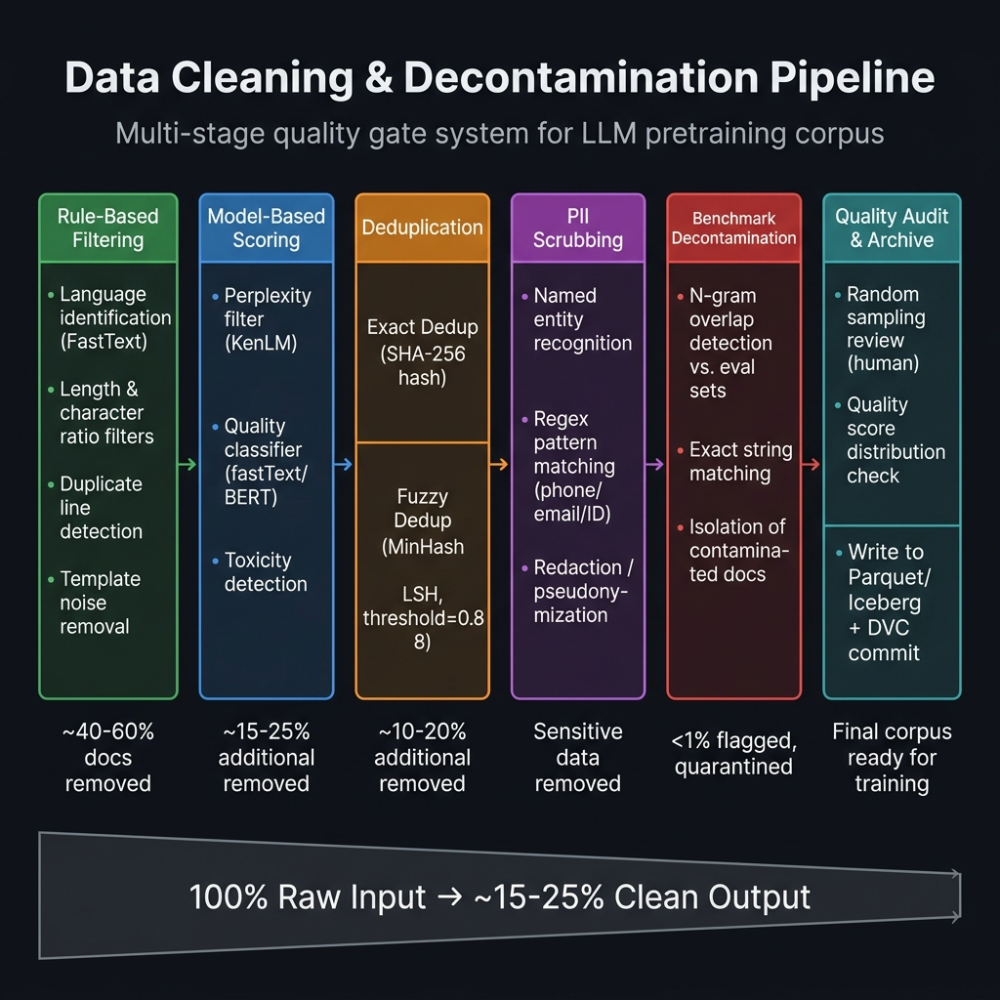
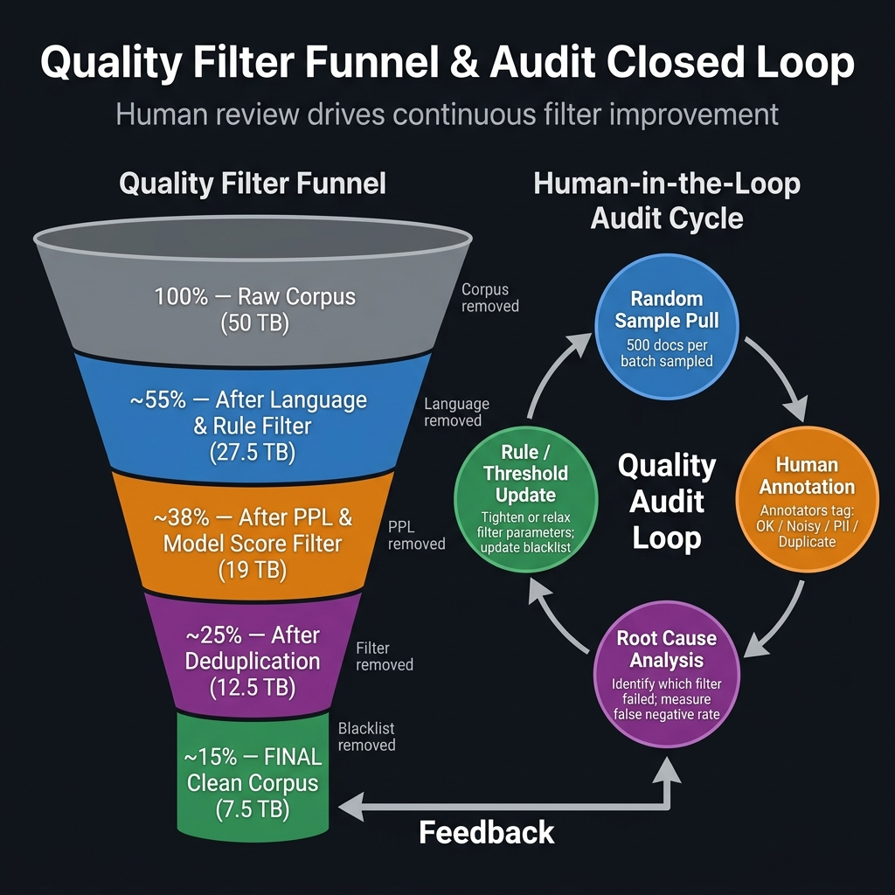

# 第5章 清洗、去重与去污染

## 开篇：一批"看起来很干净"的数据，为何让模型开始复读？

某团队在完成了第4章描述的精心数据采集之后，信心满满地启动了一个 7B 参数中文基座模型的预训练。训练过程非常稳定——Loss 曲线平滑下降，GPU 利用率保持在 90% 以上，一切指标都符合预期。直到第一次基准评测的结果出来，团队发现了一个令人困惑的现象：模型在续写任务中会反复生成完全相同的句子，有时一段回复里同一句话重复了三四遍；更奇怪的是，给模型一个简单的触发词，它竟然能够背出某电商平台商品描述的完整格式，逐字不差。

这是典型的**数据重复导致的过拟合**。在排查过程中，工程师发现训练数据中有一个大型电商平台的商品描述语料，通过不同的 URL 路径被爬取了数十次，导致同一类商品描述格式在训练集中出现了数万次之多。尽管在数据接入时做了基于 URL 的精确去重，但这些内容的 URL 不同（不同商品的 URL、不同时间爬取同一商品的归档 URL），因此精确去重完全没有发现这个问题。

这个案例说明了一个核心命题：**清洗不是"删脏数据"，而是构建训练数据质量上限的工程体系。** 从这个意义上讲，清洗章拥有资格成为全书工程密度最高的旗舰章节。

---

## 5.1 为什么清洗章是全书旗舰章

### 5.1.1 清洗投入与训练收益的非线性关系

FineWeb 项目（Hugging Face，2024）给出了一个量化答案：针对同样规模的 Common Crawl 数据，不同的清洗策略会带来相差数倍的训练效果差异。使用精细多阶段清洗管线处理的数据，在下游基准评测上的表现，比使用简单规则清洗的数据高出 5-12 个百分点——而这种差距，无法仅靠增加训练算力弥补。

这一发现颠覆了早期"数据量足够大，质量不那么重要"的粗放思维。在算力资源有限的情况下（几乎所有团队都面临这一约束），**把有限算力用在高质量数据上，永远优于把同等算力用在垃圾数据上**。从这个视角来看，数据清洗工程投资的 ROI，是整个 LLM 研发链路中最高的环节之一。

### 5.1.2 上游缺陷如何在训练阶段被指数放大

上游数据管线的细微缺陷，经过训练过程的梯度累积，会在下游呈现出数量级的放大效应。几个典型的放大路径包括：

**重复内容的"记忆化"效应**：一段文本如果在训练集中出现 100 次以上，模型就会以极高的概率将这段文本"背诵"下来，并在接受相关触发词时逐字输出。这种行为本质上是对训练集的过拟合，既破坏了模型的泛化能力，也带来了严重的版权和隐私风险（模型可能原文背出用户的个人信息）。

**PII 数据的"幻觉"激活**：训练数据中未被脱敏的个人信息（手机号、邮箱、身份证号），会被模型以统计关联的方式学习到。当用户问到某人的电话号码类问题时，模型可能生成看似合理但实际指向真实个人的信息，形成 PII 泄露风险。

**基准污染的"分数虚高"**：如果训练数据中混入了测试集的题目和答案（Benchmark Contamination），模型在基准测试上的表现会被人为虚高。这是行业内极为敏感的诚信问题——多家机构因此在发布模型时不得不追加声明和重新评测。

---

## 5.2 规则、模型与人工协同的清洗框架

面对上述问题，工业界实践证明，没有任何单一手段能够独立完成高质量的数据清洗——有效的清洗体系必然是**规则过滤、模型过滤和人工抽检**三类方法的协同组合，每类方法覆盖不同的缺陷类型，各有其最优使用场景。



*图5-1：清洗与去污染全景流程图 —— 六阶段质量闸门从原始语料（100%）精炼至最终训练语料（~15-25%），每阶段标注了典型的过滤比例。*

### 5.2.1 第一道闸门：规则过滤

规则过滤（Rule-Based Filtering）是清洗流水线的第一道防线，也是性价比最高的一关。它基于一系列可量化的启发式规则，在不需要运行任何模型的前提下，快速剔除 40-60% 的明显低质量文档。

**语言识别**是多语言语料库清洗的必要起点。FastText 的多语言识别模型（`lid.176.bin`，支持 176 种语言）是目前最推荐的工具，在中文识别上的准确率超过 99%，处理速度可以达到每秒数十万文档。实践中需要注意的是，置信度阈值应设置在 0.8 以上，低于阈值的混合语言文档（如中英夹杂的技术博客）可以保留并单独处理，而非直接丢弃。

**长度与字符比例过滤**是最基础的规则集。典型阈值设定：文档最小长度 200 字符（过短的内容通常是导航栏或标签文字），最大长度 100,000 字符（超长文档可能是被合并的多页内容，需要分段处理）；特殊字符（非字母数字字符）占比不超过 30%；数字字符占比不超过 30%（日志、数据表格类内容的判断依据）。

**重复行比例过滤**专门针对"模板噪声"——许多低质量网页会在同一页面内多次重复导航栏、版权声明、广告区域等内容，导致文档内大量行完全一致。若重复行占比超过 30%，文档可被视为低质量候选，触发进一步审查或直接丢弃。

```python
import re
from typing import Tuple

class HeuristicQualityFilter:
    """多规则启发式质量过滤器（中文预训练数据优化版）"""

    def __init__(self):
        self.rules = {
            'min_chars': 200,
            'max_chars': 100_000,
            'max_special_ratio': 0.30,
            'max_digit_ratio': 0.30,
            'max_dup_line_ratio': 0.30,
            'min_unique_word_ratio': 0.10,
        }

    def run(self, text: str) -> Tuple[bool, str]:
        n = len(text)
        if not (self.rules['min_chars'] <= n <= self.rules['max_chars']):
            return False, 'length'
        if len(re.findall(r'[^\w\s]', text, re.UNICODE)) / n > self.rules['max_special_ratio']:
            return False, 'special_chars'
        if len(re.findall(r'\d', text)) / n > self.rules['max_digit_ratio']:
            return False, 'digit_ratio'
        lines = [l.strip() for l in text.split('\n') if l.strip()]
        if lines and (1 - len(set(lines)) / len(lines)) > self.rules['max_dup_line_ratio']:
            return False, 'dup_lines'
        words = text.split()
        if words and len(set(words)) / len(words) < self.rules['min_unique_word_ratio']:
            return False, 'low_diversity'
        return True, 'pass'
```

### 5.2.2 第二道闸门：基于模型的质量评分

规则过滤能快速过滤"明显"的低质量内容，但面对一段语法完全正确、格式也没有问题、但实质上是无意义的广告堆砌或 SEO 软文，规则过滤往往无能为力。这时需要**模型过滤（Model-Based Filtering）**——利用训练好的评分模型，对文档的语言质量进行更细粒度的判断。

**困惑度过滤（Perplexity Filter）**是目前最广泛采用的模型过滤方法。KenLM 的 n-gram 语言模型可以将文本的困惑度值量化：高质量的新闻和百科文本困惑度通常在 100-300 之间；普通通顺网页文本在 200-500 之间；乱码、机器翻译、广告堆砌等低质量内容往往超过 500。值得注意的是，困惑度并非越低越好——困惑度极低（低于 50）的文本可能是被过度重复的样板文本（如格式几乎固定的法律条文或商品说明），也需要额外关注。

**质量分类器（Quality Classifier）**是 RefinedWeb、Dolma 等顶级数据集采用的进阶手段：用一个经过人工标注的高质量文档 vs 低质量文档数据集，微调一个 fastText 或轻量级 BERT 分类器，将质量打分做成强监督的二分类或五分类问题。这种方法在覆盖"规则和困惑度都无法发现但人类能判断"的质量问题上有显著优势，代价是需要一定量的人工标注成本来构建训练集。

### 5.2.3 三阶段协同：规则、模型、人工的合理分工

从实际工程的成本效益角度来看，三类方法的合理分工是：

**规则过滤**处理体量最大、最明显的问题（60% 以上的原始数据），速度极快，成本极低，但误判率较高（既会有漏网之鱼，也会有误杀），适合"宽松过滤"的第一阶段。

**模型过滤**在规则过滤之后处理剩余的模糊地带（约 15-25% 的原始数据），精度高于规则但速度慢、成本高（需要运行模型推理），适合中等精度要求的"精细过滤"第二阶段。

**人工抽检**不是全量处理，而是以"质量审计"的方式对清洗结果进行抽样验证：每批次随机抽取 500-1000 条数据，由数据工程师进行人工判读，发现系统性错误（如某类有价值的内容被规则误杀），并将发现反馈给规则和模型的迭代优化。这是质量闭环的关键闭合点。

### 5.2.4 文本标准化：让数据"说同一种话"

在完成质量过滤之后，还有一类工作经常被忽视，但对下游 Tokenizer 和模型训练有深远影响——**文本标准化（Text Normalization）**。来自不同来源的数据往往在编码格式、标点习惯、空白字符使用等方面存在大量差异，如果不在清洗阶段统一处理，这些细节差异会被分词器（Tokenizer）识别为成千上万种"不同的 token"，不仅增大了词表压力，还会干扰模型对语义等价内容的统一表示。

**Unicode 规范化**是最基础的一步。同一个汉字可能以 NFC（组合形式）或 NFD（分解形式）编码，导致字符级别的文本看起来一样，但实际字节序列不同，在精确去重时会被当作不同文档处理。推荐统一将所有文本归一化为 `unicodedata.normalize('NFC', text)`，这在 Python 中只需一行代码，但能消除大量来自不同操作系统和编辑器的编码差异。

**全半角字符统一**是中文数据预处理的特有挑战。中文互联网语料中，全角字符（如"，。！""（）"）和半角字符（`,. ! "" ()`）混用极为普遍。对于大多数大模型训练场景，建议统一为半角标点——这与绝大多数高质量训练数据（学术论文、程序文档、英文维基）的标点习惯一致，避免模型在中文回复中混用全半角造成视觉混乱。

**多余空白字符清理**包括连续空格压缩为单空格、移除行首/行尾多余空格、将 Windows 风格换行（`\r\n`）统一为 Unix 风格（`\n`）、以及清除零宽度不可见字符（如 `\u200b`、`\ufeff` BOM 标记）。这些隐形字符来自不同平台的文本粘贴和格式转换，在模型 tokenization 阶段可能产生意外的 `<unk>` token，影响训练稳定性。

**繁简体处理策略**对中文大模型有特别的重要性。训练全参数的多方言中文模型时，繁体字和简体字应当共存；但若目标是一个专注于大陆简体中文的模型，建议对繁体语料进行简体转换（opencc 库可以实现高质量的繁简转换）。需注意：机械的繁简转换会丢失一些台湾、香港等地区特有的词汇和表达，对于涉及这些地区的垂直领域模型，需要谨慎处理而非一刀切简繁归一。

```python
import unicodedata, re

def normalize_text(text: str, to_simplified: bool = False) -> str:
    """
    文本标准化：Unicode 归一化 + 标点统一 + 空白清理
    to_simplified: 是否将繁体转为简体（需额外安装 opencc-python-reimplemented）
    """
    # 1. Unicode NFC 归一化
    text = unicodedata.normalize('NFC', text)
    # 2. 移除零宽字符和 BOM
    text = re.sub(r'[\u200b\u200c\u200d\ufeff\u00ad]', '', text)
    # 3. Windows 换行统一为 Unix 换行
    text = text.replace('\r\n', '\n').replace('\r', '\n')
    # 4. 压缩连续空格和 Tab
    text = re.sub(r'[ \t]+', ' ', text)
    # 5. 去除行首行尾空格
    text = '\n'.join(line.strip() for line in text.split('\n'))
    # 6. 压缩连续空行（超过 2 行的空行压缩为 1 行）
    text = re.sub(r'\n{3,}', '\n\n', text)
    # 7. 可选：繁简转换
    if to_simplified:
        try:
            import opencc
            converter = opencc.OpenCC('t2s')
            text = converter.convert(text)
        except ImportError:
            pass  # opencc 未安装时跳过
    return text.strip()
```

文本标准化虽然在单条数据上的效果不显眼，但在 TB 级语料库的整体层面，它能有效减少分词器的词表碎片化程度，降低训练集中语义等价内容的 token 表示多样性，使模型的注意力更集中于真正的语义学习而非格式差异。这是清洗管线中成本极低、收益稳定的一环，建议在任何规模的项目中都作为标配步骤纳入。


---

## 5.3 去重：从精确匹配到语义近似查重

### 5.3.1 为什么去重是清洗体系最难啃的硬骨头

去重（Deduplication）是清洗体系中工程复杂度最高、计算成本最重的环节。以一个 50TB 的语料库为例：精确去重需要为每个文档计算哈希值并进行全局比对，这在 50 亿文档的规模下，仅 I/O 成本就已相当可观；模糊去重则需要在数十亿文档对之间计算相似度，朴素实现的 O(n²) 复杂度在这个规模上完全不可行。

研究表明，未经充分去重的预训练语料会带来两类破坏性影响：一是模型对重复内容产生过拟合（开篇案例的根因）；二是模型在续写时倾向于"重复自身"，产生"复读机"现象，严重降低生成质量的多样性和流畅性。

### 5.3.2 精确去重：SHA-256 哈希

精确去重（Exact Deduplication）通过为每个文档计算一个固定长度的哈希指纹（通常用 SHA-256），相同哈希值的文档视为完全重复，只保留第一次出现的版本。这种方法实现简单、速度极快，可以在 O(n) 时间内完成，但**只能处理完全字符级相同的文档**，无法发现"略有差别"的近似重复（如同一篇文章在不同网站转载时加了不同的页眉页脚）。

在分布式场景下，可以用 Ray Data 或 Spark 的 groupBy 算子高效实现：将文档哈希值作为分组键，每组只保留一个文档。在百亿文档的规模下，精确去重可以在 8-16 节点的 CPU 集群上以数小时内完成。

### 5.3.3 模糊去重：MinHash LSH 的三步原理与工程实现

模糊去重（Fuzzy Deduplication）的目标是识别"相似度超过阈值（如 Jaccard 相似度 > 0.8）"的文档对，并从中只保留一个版本。MinHash LSH（Locality-Sensitive Hashing）是目前处理 TB 级数据规模下模糊去重的工业标准算法，其核心思想是在极大降低计算量的前提下，以高概率识别出真正相似的文档对。

**第一步：N-gram 分解**。将文档转化为字符级或词级 n-gram 的集合（通常使用 5-gram）。两个文档的 Jaccard 相似度定义为它们 n-gram 集合的交集与并集之比。

**第二步：MinHash 签名压缩**。使用 k 个随机哈希函数，为每个文档的 n-gram 集合生成一个长度为 k 的 MinHash 签名向量（通常 k=128）。MinHash 的关键性质是：两个文档签名的匹配率，是它们 Jaccard 相似度的无偏估计。

**第三步：LSH 分桶**。将 128 维签名向量分成 b 个 band（每 band 含 r = 128/b 个维度）。两个文档只要在任意一个 band 内的签名完全匹配，就被放入同一个"候选桶"，后续只需对同桶内的文档对进行精确相似度计算。调节 b 和 r 可以控制实际的相似度检测阈值与召回率之间的权衡。

```python
import hashlib, numpy as np
from typing import Set

class MinHashLSH:
    """MinHash LSH 模糊去重实现（适用于中文 5-gram）"""

    def __init__(self, num_hashes=128, num_bands=16, ngram=5, threshold=0.8):
        self.num_hashes  = num_hashes
        self.num_bands   = num_bands
        self.rows        = num_hashes // num_bands
        self.ngram       = ngram
        # 随机参数（线性哈希族）
        rng = np.random.default_rng(42)
        self.a = rng.integers(1, 2**31, num_hashes)
        self.b = rng.integers(0, 2**31, num_hashes)
        self.p = (1 << 31) - 1              # 梅森素数
        self.buckets = [{} for _ in range(num_bands)]

    def ngrams(self, text: str) -> Set[int]:
        t = text.lower().replace(' ', '')
        return {hash(t[i:i+self.ngram]) % self.p for i in range(len(t)-self.ngram+1)}

    def signature(self, shingles: Set[int]) -> np.ndarray:
        sig = np.full(self.num_hashes, np.inf)
        for s in shingles:
            h = (self.a * s + self.b) % self.p
            sig = np.minimum(sig, h)
        return sig.astype(np.int64)

    def insert(self, doc_id: str, text: str) -> list[str]:
        """插入文档，返回候选重复文档ID列表"""
        sig = self.signature(self.ngrams(text))
        candidates = set()
        for i in range(self.num_bands):
            band_key = tuple(sig[i*self.rows:(i+1)*self.rows])
            if band_key in self.buckets[i]:
                candidates.update(self.buckets[i][band_key])
            self.buckets[i].setdefault(band_key, []).append(doc_id)
        return list(candidates)
```

### 5.3.4 去重的双重风险：过度与不足

去重并非越激进越好。**去重过度**（阈值设置过低，如 Jaccard > 0.5）会导致大量内容相关但表达不同的文档被错误地视为重复而删除，损害数据多样性——这在专业领域尤为危险，因为领域内的高质量知识本来就有相当的主题重叠。**去重不足**（阈值过高或只做精确去重）则会遗留大量近似重复，导致前述的过拟合和复读机问题。

实践中推荐的起点阈值是 Jaccard 相似度 0.7-0.8，并在代理模型评测（Proxy Model Evaluation）上对不同阈值配置进行消融实验，找出当前语料和目标任务下的最优点。

---

## 5.4 PII 脱敏与个人隐私保护

### 5.4.1 常见 PII 类型与危害

个人可识别信息（Personally Identifiable Information，PII）是训练数据中隐藏最深、危害最滞后的一类缺陷。与噪声和重复不同，PII 的存在不会直接影响 Loss 指标或基准评测分数，但会在模型上线后形成严重的隐私泄露风险。

中文训练语料中最常见的 PII 类型包括：手机号（11 位数字，以 1 开头）、身份证号（18 位，含出生日期和地区码）、电子邮件地址、家庭住址和邮政编码、姓名（高频人名与组织名）、账号密码和 API Token（在代码仓库、技术论坛中尤为常见）。其中，账号和 Token 类 PII 的危害最为直接——模型可能在生成代码示例时，将训练集中看到的真实 API Key 原文输出，导致即时的安全事故。

### 5.4.2 检测与脱敏方案

PII 检测通常采用**规则 + NER 模型**的组合方案：

**正则表达式规则**对于结构化 PII（手机号、邮箱、身份证、IP 地址等）有极高的查全率，且运行速度极快，适合作为第一道检测层：

```python
import re

PII_PATTERNS = {
    "phone_cn":   r"(?<!\d)1[3-9]\d{9}(?!\d)",         # 中国手机号
    "id_card_cn": r"\d{17}[\dXx]",                      # 身份证号
    "email":      r"[a-zA-Z0-9._%+\-]+@[a-zA-Z0-9.\-]+\.[a-zA-Z]{2,}",
    "api_key":    r"(?i)(sk-|api[_\-]?key|token)[a-zA-Z0-9]{16,}",
    "ip_addr":    r"\b(?:\d{1,3}\.){3}\d{1,3}\b",
}

def detect_and_redact_pii(text: str) -> tuple[str, list]:
    """检测并脱敏文本中的 PII，返回脱敏后文本和发现的 PII 类型列表"""
    found = []
    for pii_type, pattern in PII_PATTERNS.items():
        matches = re.findall(pattern, text)
        if matches:
            found.append(pii_type)
            text = re.sub(pattern, f"[{pii_type.upper()}_REDACTED]", text)
    return text, found
```

**命名实体识别（NER）模型**则覆盖规则难以枚举的 PII 类型，如真实人名、地址和机构名。推荐使用 spaCy 的中文模型（`zh_core_web_trf`）或 HuggingFace 上开源的中文 NER 模型，对人名（PER）、地点（LOC）、机构（ORG）等命名实体进行识别，再根据上下文判断是否需要脱敏。

---

## 5.5 基准污染检测与去污染

Benchmark Contamination（基准污染），是指训练数据中意外混入了测试/评测集的题目和答案，导致模型在这些评测集上的表现被人为虚高的现象。这是 LLM 训练数据质量治理中最敏感的诚信问题，也是近年来随着大模型评测体系日趋成熟而被越来越重视的工程挑战。

### 5.5.1 污染的传播路径

污染的发生路径通常出人意料：评测集题目出现在某个公开的技术博客中，博客被爬虫纳入训练语料；学术社区讨论评测集结果的帖子包含了原题，通过 Reddit / 知乎等论坛数据进入语料库；评测集的早期版本作为示例被纳入了公开的 GitHub 仓库，通过代码数据进入语料库。这些路径的共同特点是**间接性**——没有人故意把测试集放进训练数据，但污染还是自然地发生了。

### 5.5.2 检测与隔离方案

目前最常用的去污染方案是 **N-gram 重叠检测**：将所有评测集（MMLU、GSM8K、HumanEval、CEVAL 等）的题目和答案预先计算 13-gram 指纹集合，然后对训练数据中的每个文档进行扫描，只要与任何评测集的 13-gram 匹配率超过 50%，就将该文档标记为"污染风险"并移入隔离区（不是直接删除，而是先隔离，以便后续审查）：

```python
from collections import Counter

def build_eval_ngrams(eval_texts: list[str], n=13) -> set[str]:
    """构建评测集的 N-gram 指纹集合"""
    ngrams = set()
    for text in eval_texts:
        tokens = text.lower().split()
        ngrams.update(' '.join(tokens[i:i+n]) for i in range(len(tokens)-n+1))
    return ngrams

def contamination_score(doc: str, eval_ngrams: set[str], n=13) -> float:
    """计算文档与评测集的 N-gram 重叠率"""
    tokens = doc.lower().split()
    if len(tokens) < n:
        return 0.0
    doc_ngrams = [' '.join(tokens[i:i+n]) for i in range(len(tokens)-n+1)]
    if not doc_ngrams:
        return 0.0
    hits = sum(1 for g in doc_ngrams if g in eval_ngrams)
    return hits / len(doc_ngrams)
```

去污染工作最好在建立正式训练集之前一次性系统完成，而不是"边训练边修补"——因为评测集的范围会随时间扩大（新评测集持续涌现），需要定期更新指纹库并重新扫描。

---

## 5.6 质量评分、抽检与闭环迭代

### 5.6.1 多维质量评分与分层采样

清洗不应该是"非黑即白"的二元判断，而应当对每个文档给出一个多维质量评分向量，用于后续的分层采样：

```python
from dataclasses import dataclass

@dataclass
class DocumentQualityScore:
    doc_id: str
    noise_score: float      # 噪声分（特殊字符比例等），越低越好
    ppl_score: float        # 困惑度，越低质量越高
    dedup_status: str       # "unique" / "near-duplicate" / "exact-duplicate"
    pii_found: list[str]    # 发现的 PII 类型列表，空列表表示干净
    contamination_rate: float  # 基准污染率，越低越好

    @property
    def quality_tier(self) -> str:
        """基于多维评分确定质量层级"""
        if self.ppl_score < 200 and not self.pii_found and self.contamination_rate < 0.05:
            return "high"
        if self.ppl_score < 500 and len(self.pii_found) <= 1:
            return "medium"
        return "low"
```

分层采样策略：High 层数据在训练中给予 2x 采样权重，Medium 层 1x，Low 层 0.3x（而非直接丢弃，保持多样性）。

### 5.6.2 人工抽检闭环

质量闭环的设计思路是**人工审计驱动规则迭代**，而非"人工处理每条数据"（后者在 PB 级语料下根本不可行）。



*图5-2：质量过滤漏斗与抽检闭环 —— 左侧漏斗展示每阶段的数据留存率，右侧闭环展示人工抽检如何驱动过滤规则的持续迭代优化。*

每个清洗批次完成后，固定执行以下"质量快照"流程：随机抽取 500 条数据，由数据工程师进行人工标注（OK / 噪声 / PII 遗漏 / 误杀的高质量内容 / 近似重复漏网），统计各类错误的发生率，并追踪是哪个过滤步骤导致了该错误（误杀 or 漏检）。当某类错误率连续两个批次超过 5%，必须触发对应规则或模型阈值的审查和更新。这套机制将清洗管线从"一次性工程产物"转变为"持续迭代的质量引擎"。

---

## 5.7 常见缺陷、检测方法与代价对照

**表5-1：常见缺陷、检测方法与代价表**

| 缺陷类型 | 典型表现 | 检测方法 | 漏检代价 | 推荐阈值/工具 |
| :--- | :--- | :--- | :--- | :--- |
| **HTML/噪声残留** | 标签如 `<div>`、CSS、JS 代码混入正文 | 特殊字符比例 > 0.15；正则规则 | 模型输出乱码/标签 | 特殊字符占比 < 0.15 |
| **语言错误** | 目标语言外的内容混入 | FastText 语言识别（置信度 > 0.8） | 模型学习错误语言分布 | 置信度 ≥ 0.8 |
| **低信息密度** | SEO 关键词堆砌、广告文案、无意义重复 | KenLM PPL > 500；质量分类器 | 模型输出空洞、凑字数文本 | PPL ∈ [100, 500] |
| **精确重复** | 相同文档被多次爬取 | SHA-256 哈希全局去重 | 模型过拟合特定内容 | 相同哈希仅保留 1 份 |
| **近似重复** | 同一文章在不同网站转载（略有改动）| MinHash LSH（Jaccard 相似度） | "复读机"、泛化差 | Jaccard < 0.8 保留 |
| **PII 泄露** | 手机号、身份证、邮箱、API Key | 正则规则 + NER 模型 + 人工抽检 | 上线后隐私事故 | 零容忍，人工复核 |
| **基准污染** | 测试集题目混入训练集 | 13-gram 与评测集比对 | 评测分虚高，诚信风险 | 重叠率 > 0.5 隔离 |
| **低词汇多样性** | Type-Token Ratio 极低（循环体文本）| TTR < 0.1 | 模型词汇使用僵化 | TTR ≥ 0.1 |

**表5-2：清洗动作对训练效果影响对照**

| 清洗动作 | 不做时的典型模型症状 | 完整做时的预期提升 | 成本周期 |
| :--- | :--- | :--- | :--- |
| 语言过滤 | 模型混用语言；中文回答夹杂英文 | 语言一致性提升 | CPU，数小时 |
| 启发式规则过滤 | 模型输出格式混乱（HTML标签/广告词） | 输出流畅度提升 5-10% | CPU，数小时 |
| PPL 困惑度过滤 | 模型倾向于生成空洞、凑字数内容 | 信息密度提升，用户满意度+8% | CPU+小模型，数天 |
| MinHash 模糊去重 | "复读机"现象；生成内容重复率高 | 生成多样性提升 20-40% | CPU分布式，数天 |
| PII 脱敏 | 上线后隐私泄露事故、模型背出用户信息 | 隐私合规达标，避免法律风险 | CPU+GPU NER，数天 |
| 基准去污染 | 评测分虚高；真实用户体验与评测分脱钩 | 评测诚信达标；真实场景表现更可预期 | CPU，数小时 |
| 质量分层采样 | 高低质量数据同权重稀释高质量效果 | 同等算力下基准分提升 3-7% | 无额外计算成本 |

---

## 5.8 大规模工程案例与踩坑复盘

### 案例一：清洗过度导致知识损失——一次"阈值调过头"的代价

**背景**：某团队在完成了首轮 7B 模型预训练后，计划对数据清洗管线进行升级，目标是进一步提升训练数据的"纯净度"。团队将启发式过滤规则全面收紧：最小文档长度从 200 字提升到 800 字、PPL 阈值从 500 下调至 150、MinHash 相似度阈值从 0.85 下调至 0.6。处理后，语料库从原来的 500GB 缩减至 120GB。

**T+0（发现问题）**：使用新版语料训练的模型在通用评测基准上表现下降——尤其是在医学、法律等专业领域，回答质量明显不如旧版。工程师起初怀疑是训练超参数问题。

**T+5（根因定位）**：经过对新旧语料的差异分析，发现约 75% 的专业领域文档（如医学科普、法规条文、技术标准）被过度清洗所淘汰：医学科普文章的平均文档长度在 400-700 字之间，均低于新的 800 字最低阈值；法律条文的 PPL 分数通常在 150-200 之间（因其语言高度规范），刚好落在了新阈值的过滤范围内；不同网站转载的同一法规，因内容类似度极高被 0.6 的 MinHash 阈值大量删除，导致整个法条知识库残缺不全。

**关键教训**：清洗阈值应当**分领域、分内容类型进行差异化配置**，而非全局统一调参。专业领域内容（医学、法律、科学）的知识密度高，但其文档特征（长度分布、语言规范性、内容相似度）与通用网页有本质区别，用设计给通用网页的阈值来过滤专业内容，必然产生严重的知识损失。正确的做法是：先对语料进行领域分类，再为不同领域配置独立的清洗阈值参数，并对每个领域的处理结果进行独立的人工抽检验证。

### 案例二：PII 遗漏引发的安全事故

**背景**：某公司在将一套面向企业用户的 AI 助手产品上线后，很快收到用户反馈：在询问某些技术相关问题时，模型会在生成的代码示例中输出看起来像真实 API Key 的字符串（格式为 `sk-xxxxxxxxxxxxxxxxxxxxxxxx`，与 OpenAI API Key 格式完全一致）。

**T+0（事故发生）**：安全团队立即展开排查，确认模型输出的是**真实有效的 API Key**，来自训练数据中某个 GitHub 仓库里被提交的硬编码密钥。由于 PII 脱敏管线只覆盖了手机号、邮箱、身份证等常规类型，未将 API Key 纳入检测范围，这批密钥在训练过程中被完整学习。

**T+1（紧急处置）**：安全团队通知密钥所属服务商进行紧急吊销，同时下线模型接受审查。经排查，共发现约 8400 条 GitHub 提交记录中包含各类 API Key 或密码硬编码，覆盖 AWS、OpenAI、GitHub、数据库连接字符串等多种类型，均未被现有脱敏管线捕获。

**T+7（修复完成）**：数据团队补充了针对 API Key 和密码等结构化秘密的正则规则（参考 GitGuardian 的开源规则集），同时引入了专门检测代码中机密泄露的工具（如 truffleHog、detect-secrets），对代码语料进行了全量重扫和重新脱敏。

**关键教训**：PII 的定义应当随语料类型的扩展而扩展。代码语料中的"机密"（API Key、密码、SSH 私钥）与普通文本中的"隐私"（手机号、邮箱）是不同类型的 PII，前者危害更直接、更立竿见影，但更容易被忽视。任何接入代码语料的团队，必须在 PII 脱敏管线中专门为"机密检测"（Secrets Detection）增加独立规则集。

---

## 5.9 生产级清洗管线的最小可行组合

在理解了本章所有技术模块之后，一个现实的问题随之产生：**如果资源有限，哪些步骤是不可省略的？** 并非所有团队都有足够的工程资源在第一版就完整实现六阶段清洗管线。以下给出针对三种不同资源水位的"最小可行清洗组合"，供工程团队根据自身情况参考选用。

### 5.9.1 轻量级方案（1-3 人数据团队，数据规模 < 100GB）

轻量级方案聚焦于"守住底线"，用最少的工程投入过滤掉危害最大的缺陷：

| 步骤 | 实现方案 | 工具 | 是否必须 |
|------|---------|------|---------|
| 语言过滤 | FastText 识别，置信度 > 0.8 | fasttext | ✅ 必须 |
| 规则过滤 | 长度、特殊字符、重复行 | 自实现 Python | ✅ 必须 |
| 精确去重 | SHA-256 哈希全局去重 | hashlib | ✅ 必须 |
| PII 脱敏 | 正则规则（手机/邮箱/身份证/API Key） | re | ✅ 必须 |
| 文本标准化 | Unicode NFC + 空白清理 | unicodedata | ✅ 必须 |
| 困惑度过滤 | KenLM（可选，有时间再做） | kenlm | 🟡 推荐 |
| MinHash 去重 | 可选（数据规模小时效果有限）| datasketch | ⭕ 可选 |
| 基准去污染 | 必须在正式训练前完成 | 自实现 | ✅ 必须 |

这套组合可以在一周内完成开发，覆盖了"必须有"的底线防护，适合快速启动的早期实验阶段。代价是会遗漏相当比例的近似重复内容和低信息密度文档，但对于小规模实验来说是可接受的。

### 5.9.2 标准方案（4-10 人数据团队，数据规模 100GB - 10TB）

标准方案在轻量级基础上增加了模型评分和模糊去重，覆盖了工业实践中的主流质量需求：

在轻量级方案的基础上，补充：**KenLM 困惑度过滤**（拟合 5-gram 语言模型，针对目标语言训练），过滤 PPL > 500 的文档；**MinHash LSH 模糊去重**（Jaccard 阈值 0.8，128 维签名，16 个 band）；**NER 模型辅助 PII**（spaCy 中文模型，覆盖人名/地址/机构等规则难以枚举的 PII 类型）；**领域分层阈值**（为代码、学术论文等特殊内容类型配置独立的过滤参数，避免"通杀"）。这套方案需要约 2-4 周工程实现，并需要一定的 GPU 资源用于 NER 模型的批量推理，是中型团队最推荐的完整方案。

### 5.9.3 旗舰方案（10+ 人数据平台团队，数据规模 > 10TB）

旗舰方案面向工业级大规模数据处理，在标准方案之上进一步引入：**分布式处理架构**（Ray Data 或 Spark on Kubernetes 实现所有步骤的完全分布式化，支持数十至上百节点水平扩展）；**自定义质量分类器**（用人工标注的 10,000 条高/低质量样本对，微调 BERT 或 fastText 分类器，将文档质量判断做为强监督的分类任务）；**全量评测集去污染**（维护包含所有主流评测集的 N-gram 指纹库，并定期更新）；**自动化质量快照仪表盘**（每批次清洗完成后自动生成质量报告，展示各阶段过滤率、质量分分布、PII 发现率等关键指标）。完整旗舰方案的搭建周期通常需要 2-4 个月，但一旦建立，可以支持公司所有大模型项目的语料质量基础设施共享复用。


---

## 本章小结

本章作为全书工程密度最高的旗舰章节，从"清洗为何构成训练数据质量上限"出发，按照清洗生命周期的顺序，系统介绍了规则过滤、模型评分、精确去重、MinHash 模糊去重、PII 脱敏与基准去污染的完整技术体系。两张表格（表5-1 缺陷-检测-代价矩阵、表5-2 清洗动作效果对照）为工程师提供了可直接参考的决策工具。两个案例复盘——"清洗过度导致知识损失"和"PII 遗漏引发安全事故"——从正反两个方向印证了清洗体系的精细化配置要求。

携带这套完整的清洗技术体系，我们已经具备了将原始语料精炼为高质量训练数据的完整能力。下一章将在清洗完成的数据上，继续探讨预训练数据工程的最后一公里：**第6章 分词、序列化与高效加载**——把干净的文本转化为 GPU 可以高效消费的 Token 序列。
