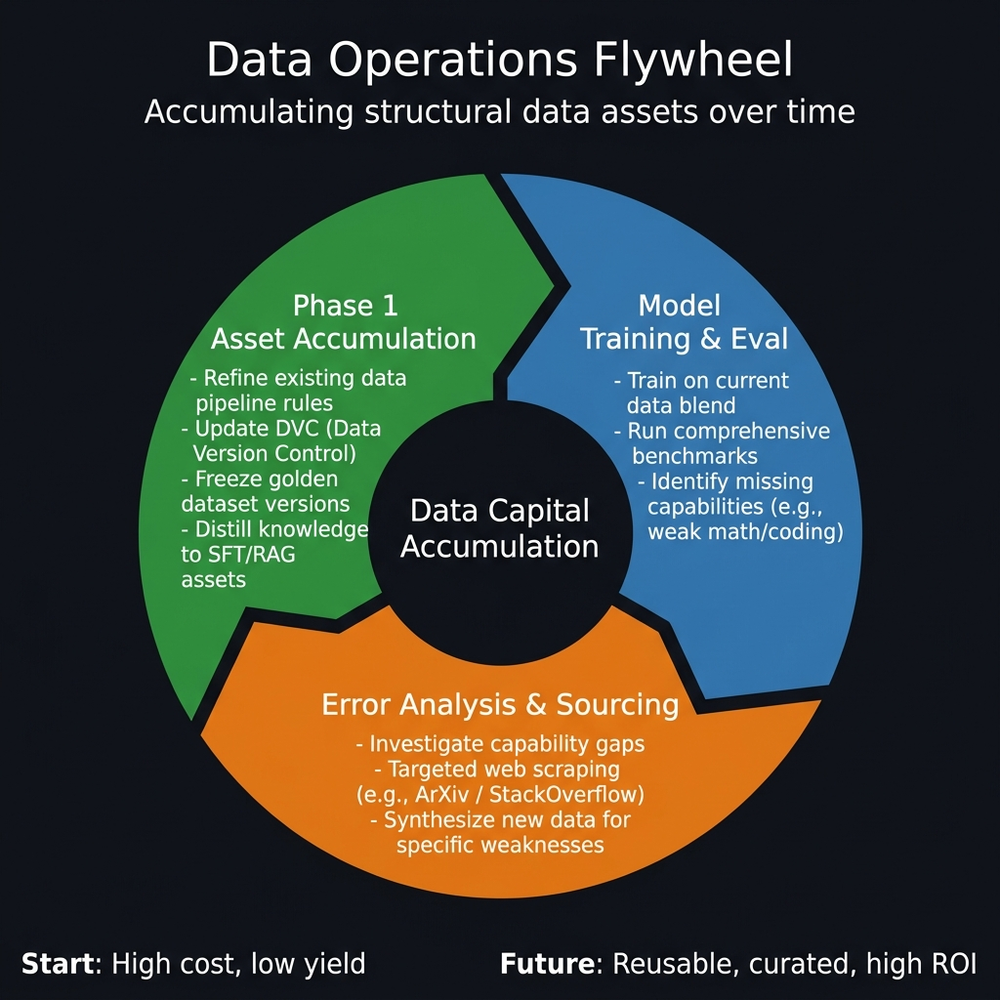
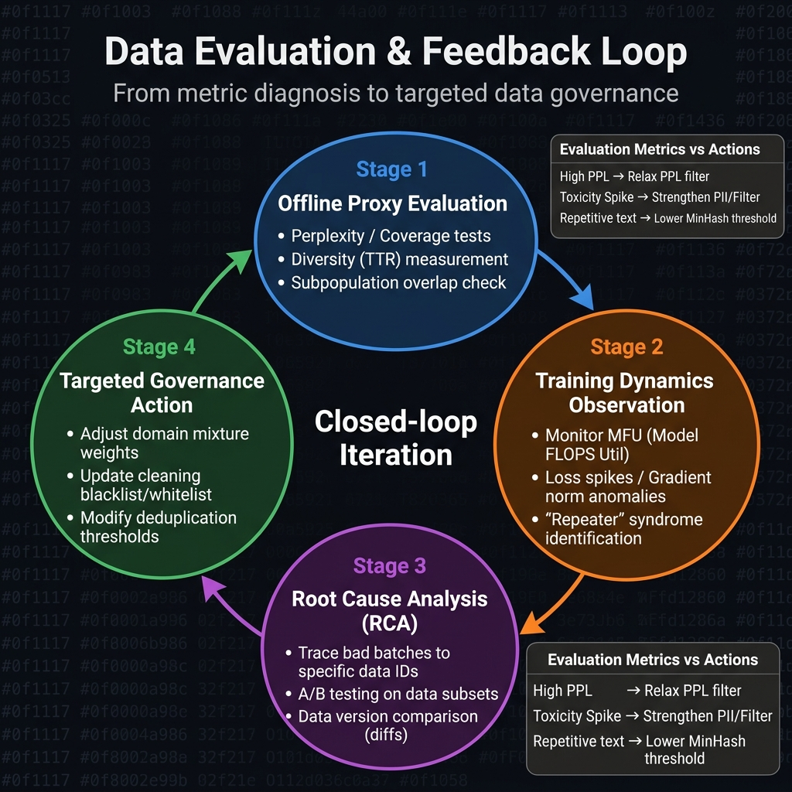

# 第7章 数据评估、质量闭环与运营迭代

## 开篇：一次令人意外的"效果倒退"

在某个 7B 语言模型的研发项目中，数据团队经过两个月的努力，将预训练语料库清洗到了一种近乎"洁癖"的程度。他们严格使用启发式规则排除了所有短文本，用大受好评的困惑度评分去除了所有“非标准语言”，并用极度严格的 MinHash 阈值查重。数据工程师骄傲地宣称：这是迄今为止最干净、最高质量的数据版本。

然而，基于新版数据训练出的模型（代号 v2.0）在多项基准评测上的表现，竟然全面落后于一个月前用粗糙数据（v1.0）训练的版本。深入排查后，大家才发现几个令人哭笑不得的真相：
1. 因为剔除了一切带有“大量换行和符号”的文本，模型几乎完全丧失了生成代码和渲染 Markdown 的能力。
2. 因为剔除了“非标准口语化表达”，模型失去了在对话任务中的共情回应能力，变得像一台冰冷的百科全书。
3. 严格的去重使得某些极高频事实（如常识地理、基础历史）在训练集中的出现频率过低，导致模型发生了严重的“知识遗忘”。

这次危机给团队上了沉重的一课：**高质量并不是一个静态标准，脱离了模型效果的“单方面洁净”毫无意义。**

本章将视角从具体的数据处理代码拉回系统工程层面，探讨大模型项目的最终决胜环节——**数据评估与运营迭代**。我们将打破“交出数据就算完工”的传统偏见，建立以离线评估和代理指标驱动的数据治理循环，让数据成为一个随着模型能力增长而进化的持续资产。

---

## 7.1 为什么数据也需要持续运营

### 7.1.1 打破“一次性交付”的工程幻觉

在传统的深度学习（如图像分类或序列标注）时代，数据集往往被视为静态资产：收集、标注、发布，然后长年冻结。基于这种范式，工程师习惯了“一次性交付”思维。

然而在大型语言模型的预训练中，数据（Data）与模型（Model）的边界变得模糊。模型的不同成长阶段需要截然不同的数据配方。比如：在冷启动初期（0 - 100B Token），模型迫切需要大规模的广度信息来学习通用语法和基础世界观；而在收敛后期或退火阶段（Cooldown），模型则需要极其稠密的高质量知识材料（数理化推理、代码结构）来拔高质量上限。**一套从头用到尾的静态数据，绝不可能训出 SOTA 模型。**

这使得数据工程师的角色从“矿工（一次性挖掘）”转变为“营养师（持续调节摄入）”，这就要求建立一套完整的数据运营（Data Operations，简称 DataOps）体系。

### 7.1.2 训练完成后再评估，为何已经太晚？

传统链路常常是流水线式的：数据团队花一个月洗数据 → 训练团队花一个月跑完预训练跑道 → 评测团队进行基准测试验证效果。如果最终结果不如预期，溯源问题将变得极其困难：是数据本身不佳？还是采样配比失调？亦或是学习率或优化器的超参崩溃？

由于 LLM 单次长周期训练的成本极为高昂，容错空间基本为零。如果不将评估体系前置（即脱离了动辄数百万美元的正式训练也能评估数据价值），如果缺乏周期性的灰度校验模型，项目就犹如蒙眼狂奔。这就必须引入**离线代理指标**（Proxy Evaluation）与**即时反馈运营**。

### 7.1.3 数据运营与模型运营的边界协同

在现代化的大模型研发组中，典型的协作边界与组织交叉点如下：
- **模型工程师**：负责监控算力集群健康度、处理梯度异常（如 Gradient Norm Spike）、设计架构调优与退火策略。
- **数据工程师**：关注数据的产线吞吐、Token 成本以及流水线错误处理。
- **数据运营长/评估官**：这一新兴岗位的职责是连接上述两侧——他们从模型的瞬时行为（如突然出现的 Loss 尖峰、模型特定能力的急剧下滑）中定位出具体的“数据批次毒药”，并指导上游及时切断或更新清洗规则。

这种跨职能协同正是通过“运营飞轮”来实现的。



*图7-1：数据运营飞轮图 —— 左侧展示高成本的起步区，右侧展示经过长期模型评估与根因分析反哺后，逐渐形成的自动化、高质量且ROI极高的数据资本积累正循环。*

---

## 7.2 离线评估与在线代理指标设计

解决评测滞后的唯一手段是设计能够脱离耗时主训练的代理指标（Proxy Metrics）。这涉及一套系统的检测动作，确保每一个版本的抽样数据在交给 GPU 之前，都经过了彻底的基因测序。

### 7.2.1 统计分层与代表性评估

首先要解决“评估什么”的问题。在万亿甚至几个 Token 的规模下进行全面的全量统计不仅耗费昂贵算力，而且毫无必要。最核心的方法是**分层抽样**。

具体实践中，根据文档所属的类别（新闻、维基、特定域名论坛、代码库），随机按 0.1% 或 0.01% 在数据装车（Serialization）前抓取固定规模的数据沙箱（例如 1亿 Token 的子集）。所有离线分析都在这个子集上进行，如果该子集的分布呈现明显异常，就能代表整个批次的坍塌。

评估一个语料库通常包含以下四大核心维度（代理指标）：

### 7.2.2 核心离线代理指标解析（附计算逻辑）

在预训练的漫长工程生命周期中，脱离具体业务聊“质量”是抽象的。工程师需要将感性的“好与坏”映射为代码可以运算、阈值可以卡控的客观数字。以下四大核心代理指标构成了质量体检报告的骨架：

#### 1. 语言学属性与困惑度（Perplexity, PPL）
- **检测目标**：语料的基本流畅性、知识密度和语言正交性。
- **验证手段**：使用一个成熟但体积较小的参照模型（Reference Model，例如使用 LLaMA-7B 基础版本，或在早期通过干净数据训练的 1B 验证版）对抽取出来的批次做无梯度的前向计算。
- **数学本质**：困惑度本质上是交叉熵损失的指数形式（$PPL = e^{Loss}$）。如果模型觉得这句话“非常常见、理所应当”，PPL 就会很低；如果觉得“匪夷所思或像乱码”，PPL 就会飙升。
- **解读逻辑**：这并不是一个“越低越好”的单向指标。
  - **极低（PPL < 5）**：通常意味着样板代码（Boilerplate）、被无限复制的免责声明或过度去重遗留的 SEO 内容。模型在这些数据上学不到任何新智力。
  - **极高（PPL > 500）**：意味着格式重度乱码、未对齐的机器翻译伪经或纯粹的无序字符串重击。
  - **优选区间**：优质文本往往呈现正态分布在 20 - 150 之间。新闻类分布更窄，而科学文献分布稍宽。

```python
# 一个典型的离线困惑度抽样计算伪代码（基于 PyTorch 和 HuggingFace API）
import torch
from transformers import AutoModelForCausalLM, AutoTokenizer

def calculate_perplexity_batch(texts, cache_model_path="llama-1b-ref"):
    tokenizer = AutoTokenizer.from_pretrained(cache_model_path)
    model = AutoModelForCausalLM.from_pretrained(cache_model_path).cuda()
    model.eval()
    
    ppl_results = []
    with torch.no_grad():
        for text in texts:
            inputs = tokenizer(text, return_tensors="pt", truncation=True, max_length=1024).to("cuda")
            # 过滤过短文本，避免 PPL 计算震荡
            if inputs.input_ids.shape[1] < 50:
                continue
            outputs = model(**inputs, labels=inputs.input_ids)
            loss = outputs.loss
            ppl = torch.exp(loss)
            ppl_results.append(ppl.item())
            
    return ppl_results  # 返回一盘数组供下游产出直方图
```

#### 2. 多样性稀疏度（Type-Token Ratio, TTR & 词汇覆盖率）
- **检测目标**：确认清洗管线是否由于阈值设定过度（或者是去重（MinHash）过于严酷），而导致小众知识或特定长尾词汇的永久流失。
- **验证手段**：统计前述文档集内不同独特词汇（Type，如词表内单独的词根）和总文本序列长度（Token）的比值。大跨度段落的 TTR 通常较低，故须用特定算法作窗口平均化（如 MATTR）。
- **解读逻辑**：如果你的文档沙箱在 1 个亿 Token 下算出的全体未重复词数少于 5 万个，说明这批数据集存在极严重的“词穷”现象（可能源于大量的电商灌水或者机翻死循环）。长此以往，模型将陷入机械式的平庸作答。
- **进阶验证 - 词汇覆盖（Coverage）**：团队需要专门编纂一套“暗语词库”（例如各类罕见病种、最新的冷门代码框架、或特定文学的人名全集）。如果在沙箱中，这类靶向词汇覆盖率不足 5%，应立刻给对应域名上游抓取添加白名单权重。

#### 3. 有毒性与负向泄露率（Toxicity & PII Density）
- **检测目标**：直接关系到商业落地的风控合规死线。检查有害内容（仇恨、恐怖、辱骂、软色情）以及 PII（个人身份、电话、密码信标）的清洗残留比率的稳定性。
- **验证手段**：这是整个指标链中计算最密集的部分。通常需要调用一个专门为安全微调（Safety Tuning）的轻量化判别器（如 Perspective API 的离线开源化变体，或者是用 RoBERTa 专门训练的 5 分类判别器），对抽样文章进行打分。
- **解读逻辑**：
  - 毒性分数不是均值游戏，而是**千分位异常捕猎**（P99 或 P99.9 指标）。
  - 如果抽样中发现 P99 分位数得分越界（>0.8），必须立刻熔断（Circuit Break）。
  - 此外，还需要对包含类似于 `sk-****` (API Token)、`13[0-9]*` (手机号码特征) 的文本触发率进行正则监控，确认 PII 屏蔽层没有在更新时意外抛错。

#### 4. 领域分类与掺杂重叠（Subpopulation Overlap）
- **检测目标**：这是数据领域近年来最“高危”的一项指标，又名防止基准污染（Benchmark Contamination Prevention）。我们必须确认日常抓取的随机数据中，没有混入那些用于年终大考的高分基准试题（如 GSM8K 的标准答案、MMLU 的英文原本）。一旦混入，将引发严重的科研诚信危机。
- **验证手段**：将所有主流 Benchmark 的测试集数据进行 N-gram（通常是 13-gram 或 15-gram）全量散列哈希；随后对待入库的抽样数据做一次交集测算。
- **解读逻辑**：重叠率（Overlap Ratio）必须无限趋近于零。若某批次维基扩展包触发了 1% 的 13-gram 撞车，通常说明某个开源库或者个人的 Github 仓库已经被完全打包进了本次流水线，必须执行定点摘除。

### 7.2.3 代理指标与真实效果的对齐偏差

需要警惕的是：所有离线指标都只是“代理（Proxy）”，与最终生成语言质量并无 100% 相关性。例如，大量灌注机器翻译语料虽然在 PPL 和 TTR 上都很漂亮，但由于长期遭受翻译腔（Translationese）污染，会使得训练出的模型在特定文化常识上频频发生幻觉。因此，对于不同质地的数据，最终还是要依靠持续构建小规模“验证器模型”。

### 7.2.4 评估指标与治理动作映射

评估绝不能停留在“看看指标”的阶段。合格的评估报告，其终点必须是确凿的系统治理动作。参考下表：

**表7-1：评估指标与治理动作映射表**

| 指标现象（离线/在线） | 常见诱因与表征 | 对应的强治理动作（Action） |
| :--- | :--- | :--- |
| **抽样 TTR (多样性) 整体降低** | MinHash 去重过于激进，杀伤了通用领域合理重叠 | **放宽 MinHash 的 Jaccard 阈值（如 0.8→0.7），引入领域专精词典保护** |
| **PPL 出现高分段长尾肥大** | HTML标签清洗不彻底；新引入的数据含有大量乱码符 | **回溯高 PPL 样本，补充 HTML 元素正则过滤项或加强语言识别置信度** |
| **代码能力评测直线下滑** | 缩进与换行在标准化过程中被机械抹除 | **切断全局换行合并规则，对代码域名走独立解析旁路设计** |
| **模型在预训练中频发复读** | 特定站点的同一页面在不同时间快照被重复打包 | **执行全量序列级 SHA256 排查，阻断源头或配置严格惩罚权重** |
| **Loss 函数局部大幅度振荡** | 混入了格式极其恶劣、标点极其破碎的外星数据堆砌 | **依据 Batch ID 调出当前读取 shard，执行异常数据降权至黑名单或过滤** |
| **Toxicity（毒性）急剧攀升** | 论坛抓取源（如 Reddit 等）爬取了黑产或敏感板块 | **更新安全过滤模型，扩大停用词或 NSFW 鉴别特征库，并执行历史清退** |

这种强绑定的治理对应关系，使团队能将单纯的数据指标立刻转化为下一轮工程优化的路线图。


---

## 7.3 版本迭代、抽检与根因复盘

要让上述的评估发挥效用，组织层面必须建立以“版本对比（A/B Testing）”为基础的迭代机制与归因追踪。大模型的数据研发本质就是一个“对齐预想参数与现实疗效”的过程，在此过程中发生任何故障都是极其正常的，重点是从挫败中沉淀规则。

### 7.3.1 DVC视角下的数据集版本化与 A/B 对比

与代码的 Git 托管类似，对于多达 TB 级别的数据湖我们必须引入 DVC（Data Version Control）或者相似的基于 SHA 挂载的不可变对象管控策略。在大规模实验中，切不可原位覆盖并覆盖原始数据，任何处理节点的修改都应产生全新的增量版本或通过 Delta Lake 切割 Snapshot。

**A/B 测试原则**：每次调整新管线（例如：新加入了由 Reddit 高质量节点解析的 20GB 数据，并增强了针对该网站特定的评论树过滤逻辑），在全面上线前，应抽取等价算力（比如以 1B Token 为规模启动一组 1B 小微模型的平行对撞训练）。只有在两只实验对照组模型完成核心评测集后，证实“数学能力或对话情感能力显著提升且没有拉挂通用世界常识指标”时，此套策略方可全量铺设进入生产版本（例如 v2.1 升级至 v2.2）。

### 7.3.2 建立“问题样本库”与追溯回环

复盘过程中，最有价值的财产就是“问题样本库（Issue Sample Pool）”。这些错误标签涵盖从源头 URL 解析错位、分类器漏杀、清洗误删到基准测试集泄漏（Contamination）等各环节。团队应该鼓励将训练过程中或者人工标注中发现的问题数据提取出来。

**回溯链设置**：单条错误样本的价值体现在它能反向暴露整个流水线的断口。
- 这条携带攻击词的语料来自哪个爬虫源？（来源追踪）
- 为什么没被过滤？（正则失效还是模型漏判）
- 它是在哪一次修改后混入库中的？（责任溯源）

### 7.3.3 从失败实验中沉淀复盘金字塔

不要将精力损耗在彼此指责，而应运用系统的复盘模型来萃取教训：
- **第一层（表现层）**：模型产生怎样的显式失效？是验证集上的 Perplexity 突然毫无征兆地暴涨？是生成代码时大量输出空白字符？还是人工安全盲审（Red Teaming）时被轻易注入诱导出了种族歧视言论？
- **第二层（机制层）**：技术链条在何处断裂？是 MinHash 并发执行时出现了未加锁导致的脏数据重写？是使用正则表达式清洗 HTML 时，误杀了所有带有 `<T>` 的泛型代码模板？还是某个专门用于识别软色情的分类器在最新一轮微调中发生“灾难性遗忘”，导致漏杀率飙升了 400%？
- **第三层（根因层）**：组织治理体系出了什么问题？为什么某个新实习生提交的正则清洗脚本可以直接合并入主干并在生产线生效？为什么在这个批次合入 `Golden Dataset` 前没有跑完标准的准入测试流？

这种追问模式被称为“5个为什么（5 Whys）数据归因法”，是把工程事故转化为防御专利的最佳策略。

### 7.3.4 案例复盘实战：一次令人窒息的 Loss 尖峰侦破

在某科技巨头的万亿集群上，当模型训练到第 870 亿个 Token 时，监控警报骤然响起：原本平滑下降至 1.8 左右的训练 Loss，在仅仅 15 个 Step 内，以一根呈 85 度角的直线狂飙至 14.5。算力账单在此刻变成了纯粹的算力燃烧，且该节点的梯度完全爆炸（Gradient Norm 变成 NaN）。模型工程师立刻将大盘拉停，并回滚到 100 步前的 Checkpoint，随后排查任务转交给了数据资产运营团队。

这是一次典型的由脏数据引发的“数据中毒（Data Poisoning）”现象。数据复盘团队接手后，立刻启动了标准侦破作业：

**动作一：捕获致死序列（Lethal Batch Trapping）**
由于训练集被打散（Shuffle）过，直接去原文件找无异于大海捞针。团队从日志系统调出了在出事前最晚加载到显卡的一批 Token IDs 序列，即第 86,995 个 Batch。

**动作二：从 Token IDs 逆向逆分词（Detokenization）**
工程师将这串引发系统崩溃的 Token 数组，使用 TikToken 词库进行解码操作。屏幕上呈现出一副诡异的画面：长达 4096 个 Token 的句子里，没有哪怕一个标点符号和一个常见字词。满屏皆是如 `\uA4\uB6\uFF\uC2` 的截断性乱码以及毫无意义的 Unicode 替代符（Placeholder）。这串高熵信息超出了模型注意力的容纳上限，引发了前向计算数值溢出（Overflow）。

**动作三：批次寻根（Batch-to-Source Tracing）**
怎么会有这么一段离奇的数据进入最高级别的数据队列？利用全局唯一标识符（GUID），数据团队检索了该文档的血统（Lineage）。结果指向了三周前一次针对“东南亚某国公开学位论文 PDF 库”的大规模拉取。

**动作四：定位清洗器缺陷**
追查当时的清洗日志发现：这些 PDF 因为经过了极为古老的第三方软件加密，其底层文字层实则是经过混淆处理的字节流。然而极其巧合的是，这些乱码在经过传统的语言识别模型（FastText Language ID）时，被算法十分自信地误判为某种“生僻印第安语系”（置信度高达 0.92），从而逃过了“非标准文字比例过高”的过滤漏斗；随后，因为这串内容实在太罕见了，在去重阶段自然显示为高度罕见的“独特内容”，就这样顺理成章地被当成极品知识喂给了模型。

**复盘与治理动作（Root Cause Action）**
查明真相后，团队立刻采取了三步走操作：
1. **清理毒源**：将属于该来源的所有 PDF 解析数据连夜从数据湖中剔除，共计 1.4 TB（约 3.5 亿 Token）。
2. **规则补丁**：给 FastText 语言模型前置一道强硬的“有效 UTF-8/中英文字符占比检测器”，强制规定主流自然语言中的标点符号密度下限必须达到 2%。
3. **安全再审核**：针对同批次入库的异构文本，额外增加一重利用小型 LLaMA 判别其能否符合基本语法结构的过滤门禁。

这次高达数万美元算力浪费的教训，深刻诠释了什么是“从失败实验中沉淀复盘金字塔”。所有的防御代码都是用显卡的电费燃烧和工程师的加班写出的规律。

**表7-2：版本迭代记录模板表**

在正规的业务迭代体系中，每一个投产至主训练集群的数据批次，都必须附带如同软件发版般严谨的迭代纪要。下表为某生产线的标杆记录模板。

| 评估维度 | 版本记录字段范例 |
| :--- | :--- |
| **基础信息** | 版本号：v2.1 → v2.2；操作人：张三（DataOps）；提交日期：2026-X-X |
| **主要变更（Changelog）** | 1. 扩充了 StackOverflow 的 30GB 中高质量问答（通过新爬虫接入）。<br>2. 收紧了 MinHash 的阈值（0.85→0.8）针对 Wikipedia 中文库的同源去重。<br>3. 修复了针对 `<p>` 标签误伤前序段落的正则表达式漏洞。 |
| **规模变化** | 预期新增 50GB，实际清理去重后净增 23GB；总 Tokens 达 1.45T。 |
| **A/B 评测结果核心点** | 小标号对撞实验中，HumanEval（代买评测）通过率提成 4.1 个点，其余通用基准上下浮动不超过 0.3%，视为无害改动。 |
| **存在及预知风险（Known Issue）** | 在增加 StackOverflow 后，部分极其陈旧的回答掺入了模型。目前暂未剔除年份久远的贴文，计划在 v2.3 使用启发式时间戳过滤修复。 |
| **最终审核结论** | ✅ 验证通过，允许挂载进 v2.2 生产主路队列提供预训练消费。 |

---

## 7.4 数据运营仪表盘与组织协同

面对动态复杂的实验管线，仅仅有 Excel 表格记录是不够的。一套统一可视化视角的“数据运营仪表盘（Data Operations Dashboard）”成为了链接训练与工程的调度核心。

### 7.4.1 数据质量看板的核心模块

优秀的质量仪表盘应当由高到低俯视各项指标。主要包含：
1. **大盘状态统览**：各域名源数据入库量、当前库存余量及已消费的进度百分比。
2. **清洗漏斗转化率（Yield Rate）**：分阶段留存指标，如语言识别拦截占比、启发式过滤抛弃比率、模糊去重剔除率。任何步骤如骤降或飙升须直接标红告警。
3. **安全风险底线观测**：记录每一周期 PII 或高敏有害文档查获数及屏蔽日志。
4. **抽检审计红绿灯**：呈现每周随机抽出的一千条语料样本盲审得分趋势，以 1 至 5 分展示数据通顺度和正确性均线走势。



*图7-2：数据评估闭环图 —— 从抽取式盲审到针对评估指标启动根因排查，再针对具体现象采取系统治理动作的环形架构。*

### 7.4.2 自动化质量预警系统架构 (Automated Alerts)

仪表盘若是单纯的“死报表”，依赖人工每日盯着屏幕巡查，必然存在巨大的遗漏风险。世界顶尖的大模型数据工厂不仅拥有静态看板，更具备一套犹如自动驾驶系统般的“主动阻断与预警哨兵”。这套预警架构往往建立在分布式的流式计算框架（如 Apache Flink 或 Spark Streaming）之上，实现毫秒级的脏数据拦截。

**第一级：基线漂移预警（Data Drift Alerts）**
每天，新的网络抓取语料、清洗后语料、甚至合成语料会如洪水般涌入数据湖。算法每天提取样本集计算分布熵（Entropy）。如果某类特定的词频在今天的批次中暴涨了 300%（可能是某特定域名的爬虫陷入死循环，不断下载冗余的导航栏标签），Slack 或飞书频道会立刻触发红色的 `[P1-DataDrift]` 告警。数据流会被自动挂起（Suspended），直到工程师人工登录仪表板解除封控。

**第二级：成本与时延红线预警**
数据预处理也是极其消耗 CPU 资源的。如果在看板上发现 `FastText` 或 `正则表达式过滤阶段` 的节点 CPU 核心打满，且数据吞吐量从平时的 2GB/s 暴跌至 100MB/s。这类警报一旦触发，必定是某段包含“灾难性回溯”（Catastrophic Backtracking）的正则表达式在处理超长文档时发生了严重的时间复杂度爆炸（也就是经典的 ReDoS 攻击现象）。此时调度系统可直接干掉超时进程，保障主流水线不受阻。

**第三级：多模态异常预警（面向下一代系统）**
随着图文多模态时代的逼近（这将在本书第 8 章详细展开），看板上开始增加图像坏链率（Broken Links）、文本-图片 Clip 相似度极值监控。一旦一批语料中图文无关比例超过阈值，也会立即鸣笛。

### 7.4.3 梯队化的责任边界体系

在这种全副武装的自动化雷达探测下，大型 AI 研发组织的权责边界得到了史无前例的清晰量化，杜绝了过去常见的踢皮球现象。

- **预训练数据架构（Data Infrastructure）组**的北极星指标只有一个：稳定吞吐与绝对成本（Cost_per_Token）。他们要证明：不惜一切代价为下游提供最高速、最低存储 I/O 开销的分布式存储架构；如果 GPU 因为 `DataLoader` 卡脖子而跌掉一分钟运算时间，就是这支团队的直接责任事故。
- **爬虫与数据采集引擎（Data Hunter）组**的眼光锁定在：获取广度覆盖度与合规（Legal/Copyright）安全。突破特定的反爬墙，拿下核心机构财报或最新 StackOverflow 源是他们的日常；如果有 PII 或极高危的有毒负面样本逃逸进入训练场，引爆公关危机，他们将承担首责。
- **预训练模型研究员（Pre-train Researchers）**的核心视线则在于：使用怎样的架构（MoE还是Dense，MHA还是GQA）以及配置合理的超参数去榨干硬件集群，能否通过当前的混合面糊使得 Loss 严格按照 Scaling Law 下降。
- **数据质量裁判（Data Ops / Evaluator）**：承担类似总厨或营养师的角色。他们正是这套“质量看板与预警流”的核心维护者！他们决定面糊的配比（网页：代码：论文 = 6:2:2），并且需要利用看板实时判断，采集工程师搞来的配菜营养浓度是否够格，同时需要评定这些配料在经过模型工程师的猛火重组后，有没有在评测集上炼就出现实世界里真正的智力跃迁。如果发现某阶段评测效果疲垮，发文叫停训练并回炉改造，正是他们被赋予的核心职权。

---

## 7.5 周度运营节奏设计：一套典型的实操模板

大模型的数据体系演进如果仅仅依靠事后复盘往往显得滞后，必须将评估、反馈与动作分解到极为高频的“周度迭代（Weekly Sprint）”中去。下面提供一套在万亿级别模型冲刺期，数据运营团队标准的周度敏捷模板。

### 7.5.1 周一：大盘核阅与指标审查会议 (Metrics Review)

**核心参与者**：数据工程师、数据产品经理、测试评价负责人。
**主要动线**：
1. **周末预训练巡检**：查看刚刚过去的周末内，主预训练分支持续喂入的总 Token 数。核对 `nvidia-smi` 监控面板是否因 DataLoader 卡顿或存储 I/O 阻塞出现 GPU 空转现象（MFU 低于警戒线）。如果存在，需要立刻在当天的第一顺位记录 I/O 缺陷日志。
2. **离线检测报告开箱**：针对周日晚间最新完成清洗的 T-1 批次数据（通常是两三个抽样后的 10GB 测试沙箱），提取 KenLM 困惑度（PPL）、类型/令牌比率（TTR）、文本长度分布直方图。
3. **指标异常警报排查**：如果 PPL 均线突然飙升至 500 以上，通常意味着最新接入的数据源包含了未被解析干净的 HTML 杂质。如果安全阻截率（Toxicity Alert）翻倍，那是因为近期加量抓取了社群讨论源（例如某开源技术论坛的风控板块）。在会议上不纠结论，只定下需要深度钻取的“异常点”。

### 7.5.2 周二与周三：异常追溯与小股试错验证 (Root Cause Defecting)

**核心参与者**：数据运营官、预训练数据工程师。
**主要动线**：
1. **针对性盲审与打标**：对周一会议发现的质量坍塌点，提取出 200 条左右的原生语料。运营评估团队人工进行抽样通读，判断规则是“误杀”（假阳性，将好文章删掉了）还是“漏杀”（假阴性，垃圾词汇绕过了正则防线）。
2. **清洗策略修正**：如果发现问题是“某些代码域名下的特殊缩进导致行过滤逻辑出错”，工程师将在周二下午修正 `FastText` 或正则脚本逻辑，对问题语料的对应模块重新跑一边 Pipeline。
3. **微型实验排期**：将新洗出的沙箱数据推送到一个 0.5B 或 1B 规模的小模型上，启动为期 12 小时到 24 小时的等价测试对撞实验。这正是 DVC（数据版本监控）发挥威力的阶段：严控变量，仅对比如 `v1.2_Base` 与 `v1.2_CodePatch` 的两组跑分。

### 7.5.3 周四：实验决断与混合面糊调配 (Data Mixing)

**核心参与者**：预训练模型工程师、数据工程师、核心构架师。
**主要动线**：
1. **A/B 效果对照**：周四早晨，微型实验跑出结果。模型工程师将公布两组数据版本的验证集 Loss 曲线是否发生交叉，以及其在特定的下游测试基准（例如 MMLU-Code 分项或 GSM8K）上的通过率偏差。
2. **定性分析**：如果新数据（`v1.2_CodePatch`）让代码能力提升了 5%，且没有拉垮通用的指令遵从度，那么这个清洗补丁（Patch）宣告胜利，代码将合入主预训练清洗仓库。
3. **数据重配子集比重**：在本步骤，也是决定下一周正式推入大型集群“混合面糊（Data Mix）”的时刻。架构师会下达指令：由于近期评测表明基础推理能力疲软，从周五开始的下一个百万步（Step），要求提升 ArXiv 论文和高分书籍的占比至 30%，相对降低开放百科的占比至 15%。数据引擎将随之改变抽样概率（Temperature Sampling）。

### 7.5.4 周五：全量产线构建与封版交付 (Production Release)

**核心参与者**：全体基础架构团队。
**主要动线**：
1. **周度版本封版（Freeze）**：结合本周通过检验的修复脚本，从原始数据湖里滚雪球式地提炼出最新一版的增量 Token。所有元数据（Metadata）记录并更新，存入云托管环境，将指向这段最新语料的指针更新至 DataLoader 的配置文件中。
2. **发布预演（Smoke Test）**：在一组闲置的 8 卡节点上运行一个长约 2 小时的拟真环境，确保这个混入了新权重的序列，在分词（Tokenization）装载、二进制压缩读取和 Tensor 拼装后，能被顺利推送进显卡且不报错。
3. **主训投料发车**：确认无误后，周五晚间对正在轰鸣的“7B主模型训练集群”执行无感热切，模型将在下一个 Checkpoint 读取到最新的 `v1.3` 高质量数据版本。整个工作流在此完成闭环，工程师可以安心度过周末。

---

## 7.6 从评估结论到采集/清洗策略的回写

评估报告本身的价值，必须依赖能够对上游（采集与清洗）产生反向控制。如果不把发现转化为持久的治理规则策略资产，所谓的监控也仅仅只是一个报警器。

### 7.6.1 向“数据采集期”回写策略

在预训练后期，运营评估往往会发现某些非常具体、狭窄的能力缺失（例如：模型在处理德语等少数语言表现惊艳，但在处理南亚某国特小语种时频繁陷入死循环；或者在量子物理领域经常出现幻觉）。

**反向采集指令**：此时需要向上游下达“靶向抓取”任务。比如，指定定向爬取特定的特定领域的开源 PDF 书籍（例如 ArXiv Physics 类别）；或者采购极其特定的某机构财务报表数据库。这种根据木桶短板决定数据挖掘方向的做法，就是数据资本的高端形式。如果盲目的进行广撒网爬虫，只会带来越发沉重的废数据冗余。

### 7.6.2 向“数据清洗期”回写规则

大部分在基准评测上的挫败都可以被归因为数据清洗体系的“松鼠症”（什么都想留）或“厌食症”（过滤得过于极端破发）：
- **对抗过度去重**：当模型生成明显缺少特定事件维度，发现该维度的数百篇新闻因为引用了一套完全相似的前情摘要，被 MinHash 的 0.85 相似度全面击杀。我们需要回写规则：建立领域白名单（White-listing），或者通过降低特定主题下的去重警戒线来捞回被错杀的文档。
- **对抗知识毒化**：如果安全检测组在灰度发布时发现某些回答引向了已关闭的色情暗网链接。通过源头域名 ID 反查，定位到某一类老旧网址库被恶意篡改。必须立即在清洗侧将这些关联的 Domain 塞入极高优先级的拦截黑名单，并通知重新清洗全量该段语料库提取器。

### 7.6.3 沉淀为 SFT（指令微调）与 RAG 的可复用资产

在大模型工程中，预训练语料清洗管线的最后也是最大的战略价值，就是“资产的向下流转”。

那些在预训练期间经过一层层严酷的评估、人工的反复打磨，并最终导致模型跑分上涨的被称为“Golden Dataset（金标准数据集）”。这部分含金量最高的内容（例如格式完美的万字说明长文，或者自带极高清晰度图文排版的结构化数据），并不需要只用一遍就扔掉。

在后期做 SFT（监督微调阶段）时，可以从这段极高质量的数据中反向抽取高质量的无监督问题，使用强大的教师模型（Teacher Model，例如 GPT-4）进行指令生成；在做 RAG（检索增强生成）系统时，预训练阶段留存下的干净、语义对齐且被切割成精巧 Token 长度的高质量文本块，直接就能无缝转化为外挂知识库中的向量索引源。

这也是数据飞轮（Flywheel）之所以能持续转动的根本：一开始高昂的人工抽验测试和离线评估，换来的是整个工程团队不断加深的对“何为好数据”的手感和经验共识。最终留下的流水线配置和领域专有名词库，将成为超越一代训练模型的企业长期知识资本。

---

## 本章小结

本章作为数据工程的指挥塔，阐述了以“数据评估、质量闭环与运营迭代”为核心的数据资产治理逻辑。我们从大模型训练阶段不可忽视的“一次性交付工程幻觉”说起，指出了如果将数据测试动作置于训练末端其后果是极为沉痛和昂贵的。

为此，本章全面解构了建立“离线代理指标（PPL/TTR等）”的必要性，并借由此指标引申出了严谨的 DVC 版本比对、问题样本库留底、A/B Testing 实验，最终汇总沉淀为包含四大运营动作周期的敏捷工作流。这使得大语言模型的数据研发不再是一个孤立的黑盒车间，而是一条兼顾质量红绿灯、能够通过不断发现的“效果缺失”反推上游数据挖掘采集的高速飞轮。

从最初的原始万维网网页，经过质量把控、排雷洗净、混分配比、最后高效流入GPU，整个浩繁的大模型文本数据流已经跑完了属于它的半路旅程。然而智能的形态远不止于抽象的文字。下一章，随着大模型感官边界的扩张，我们将跨入全书的第三篇，探讨结构极其复杂但在认知突破上至关重要的前沿领域：“**第 8 章 图文对数据工程**”，见证多模态工程下更为波澜壮阔的数据交响篇章。
