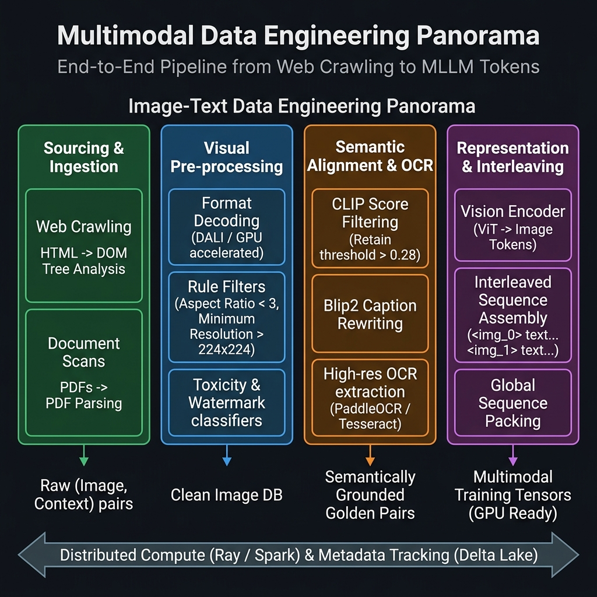
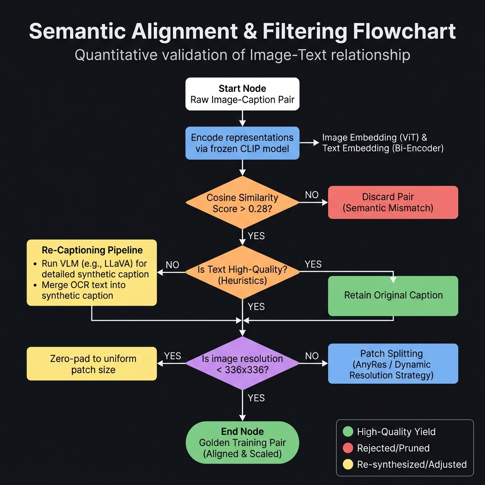

# 多模态数据工程

## 篇前导读

纯文本大模型（LLM）学习的是人类几千年沉淀下来的“抽象符号系统”，而以 GPT-4V、Gemini、Sora 为代表的多模态大模型（MLLM），需要进一步处理“物理世界的镜像”。从纯文本扩展到图文对、网页交错图文、乃至视频与音频片段，并不只是给基础大模型挂上一个预训练好的 Encoder。跨模态训练在数据工程层面会遇到四类典型挑战：
1. **对齐（Alignment）**：文字和图像在数据形式上是异构的，需要一种机制让模型把字符串“Apple”与对应的红色多边形像素矩阵建立联系。
2. **表示（Representation）**：纯文本拥有确定的一维序列边界（即明确的 Vocabulary 词表），而视觉信号是连续且高维的。如何将高分辨率截图无损地打包进变长 Token 序列，是表示层需要解决的问题。
3. **评价（Evaluation）**：文本质量可以用 PPL、TTR 等低成本指标度量；判断图像是否具备摄影美学，或是否带有版权水印，则通常需要额外的深度模型，计算代价显著上升。
4. **算力成本（Cost）**：图像的磁盘存储、I/O 解码带宽与张量传输成本，通常比同体量纯文本高出两到三个数量级。

本篇（第8至第10章）将系统介绍多模态大模型的数据工程底座与算力调度。我们以业界相对成熟的“**图文对数据工程**”为起点（也是集团 P03 等大型视觉对话模型的核心数据来源），随后讨论商业落地中绕不开的重标注与文档 OCR 理解（第9章），最终扩展到时序视频与音频流（第10章）。

---

# 第8章 图文对数据工程

## 8.1 多模态数据为何难于文本

NLP 数据工程师首次接手视觉语言模型（Vision-Language Model, VLM）的数据清洗任务时，常会发现一个共同的现象：原本在纯文本上行之有效的规则，几乎全部失效。

### 8.1.1 视觉噪声的隐蔽性

在纯文本数据工厂中，“脏数据”或乱码往往可以用低成本手段检出——一个正则表达式、一次 MinHash 计算或一次困惑度（PPL）评估即可，甚至不需要 GPU。但图像中的“噪声”定义更复杂，常见有以下几类：
- **概念性噪声**：一张 4K 高清、画质完好的风景照，可能在角落被人为加入一个仅 15×15 像素的半透明 NSFW 水印。这类样本对多模态合规性影响显著。
- **空间稀疏噪声**：一张东南亚街头杂货铺的抓拍，描述写的是“摊位上的一把梳子”，但梳子在全图中仅占 3 像素左右。经过卷积网络下采样后，目标物体几乎丢失。
- **频域压缩噪声**：一张包含财务报表或心电图的截图，在多次社交平台二次 JPEG 压缩后会出现“振铃伪影（Ringing Artifacts）”。人眼仍可辨识文字，但依赖边缘特征的 OCR 网络则会显著退化。

这些噪声很难通过哈希指纹或文件 MD5 比对剔除。在多模态数据流中，通常需要部署若干预训练好的轻量视觉判别模型（例如基于 ResNet-50 的水印分类器、基于 LAION Aesthetics 的美学评估器）执行稠密推理。这意味着，**清洗这一前置环节本身就会消耗可观的 GPU 算力。**

### 8.1.2 语义缺失与跨模态“多义错位”（WebTox）

多模态对齐学习建立在一个直观假设之上：抓取到的（Image, Text）对在描述同一事物。然而互联网上海量的“图片与替代文本（Alt-text）”往往并不严格对应。

由于多年来 SEO（搜索引擎优化）的滥用，爬虫每天会抓取到大量类似如下的图文对：
- **图片内容**：一只在草地上奔跑的金毛犬。
- **HTML 中的 Alt-text**：“2023包邮正品优质特价全场满减买一送一宠物用品”。

如果不做任何因果剥离直接送入训练，模型会在反向传播中被迫将“金毛犬的毛发纹理”与“包邮促销折扣”绑定，形成跨模态的语义错位。
这一现象在多模态数据领域被称为 **WebTox（Web 噪声污染）**。它的影响并不小：一个千亿规模模型在 VQA 测试中可能因此表现劣于未经微调的 1B 基线。CLIP Score 向量过滤等技术，正是为了应对这一问题而提出的。

### 8.1.3 分辨率与 GPU 显存的四次方关系

在纯语言建模中，无论是长报告还是短诗，送入大语言模型的代价大致与 Token 长度成线性关系。但在多模态领域，**图像分辨率对计算开销（FLOPs）的影响并非线性，而是接近指数级**。

以主流的 ViT（Vision Transformer）视觉编码器为例，假设 Patch Size 恒为 $14 \times 14$ 像素：
- 输入一张 $224 \times 224$ 的低清图片，会被切成 $(224/14) \times (224/14) = 256$ 个 Patch Token，自注意力机制（Self-Attention）的计算复杂度约为 $256^2 = 65,536$。
- 若为了识别扫描发票上的小字而将分辨率提升到 $1008 \times 1008$，图像 Token 数将增至 $(1008/14) \times (1008/14) = 5184$。
- 由于标准 Transformer Attention 与序列长度成二次方关系，单层注意力的计算量将上升到 $5184^2 \approx 26,873,856$。

边长扩大 4.5 倍，注意力开销就膨胀约 **410 倍**，对显存与互联带宽都是不小的压力。因此，图文多模态数据工程的核心权衡之一，就是**如何对高分辨率图像执行高效的动态裁切与多尺度 Patching**。



*图8-1：多模态图文数据工程全景图 —— 从最左侧的 DOM 树抓取与 PDF 解析起始，依次穿透格式解析、水印底线过滤、CLIP 语义对齐、直至最右侧的交错序列拼装与 Token 化表示。分布式计算与 Metadata 是横跨底层的核心支撑。*

---

## 8.2 图文样本的范式：从配对到交错

大模型不同训练阶段的目标，决定了所需的数据格式。根据近年来的主流架构（Flamingo、LLaVA、GPT-4V 等），多模态样本主要分为三种范式。

### 8.2.1 图文对 (Image-Caption Pairs)
这是最经典、最依赖规模的范式。
- **形式**：一张图对应一段独立描述文字，如 `{ "image": "dog.jpg", "text": "A golden retriever playing fetch in the park." }`。
- **代表开源集**：LAION-5B, COYO-700M。
- **适用场景**：主要用于冷启动阶段的**多模态对比学习（Contrastive Pre-training）**，例如训练 CLIP 的前置模型，或为新接入的 Vision Encoder 建立基础视觉感知基线。
- **局限**：仅能让模型学会识物，难以训练出复杂推理能力。

### 8.2.2 交错图文 (Interleaved Image-Text)
为了让模型具备复杂上下文中的“多图关联推理”能力，需要从网页端提取并还原原生交错版面。
- **形式**：类似维基百科或公众号文章的结构：一段背景 + `<img_1>` + 发展 + `<img_2>` + 结论。图像 Token 作为一种特殊词汇，分布在长文本序列之间。
- **代表开源集**：OBELICS, MMC4。
- **适用场景**：当前**生成式 VLM 预训练**的主要数据形态。它训练模型基于“前文”和“图片 1”推断“后文”或“图片 2”。
- **采集挑战与 DOM 解析**：交错图文的工程量较大。传统的文本爬虫遇到 `` 标签会跳过，而组装交错格式的爬虫必须解析复杂的 HTML DOM 树，并进行**“基于渲染坐标的相对距离计算”**。
  原因在于，现代网页中 CSS 的级联样式可能让代码 DOM 顺序与视觉排版顺序不一致。如果只按 HTML 标签顺序提取，可能会把页面底部的免责声明与顶部的配图错误绑定。
  
  为此，顶尖团队通常会使用带渲染引擎的无头浏览器（Headless Browser，如 Playwright）运行 JavaScript 生成页面快照，利用类似于下面的规则提取元素：
  ```python
  # 简化的 DOM 交错节点提取伪代码
  text_nodes, img_nodes = get_rendered_nodes(page)
  interleaved_sequence = []
  
  for node in all_nodes_sorted_by_y_axis():
      if node.type == 'TEXT':
          if len(node.content.split()) > 5: # 抛弃过短文本，如导航栏
              interleaved_sequence.append(node.content)
      elif node.type == 'IMAGE':
          if node.width > 200 and node.height > 200:
              # 将合法图片转化为一个占位符 Token，并将 url 存入侧边通道
              interleaved_sequence.append(f"<img_{node.id}>")
              save_to_image_db(node.url, node.id)
  ```
  一旦 DOM 结构提取错位，模型读到的图文逻辑就会出现错配。

### 8.2.3 长文档理解与截图 Grounding (Document Grounded)
面对 B 端商业落地的需求（财报阅读、发票解析等），仅靠自然图像无法满足，需要引入高分辨率文档数据。
- **形式**：输入是渲染后的高分辨率截图（如 ArXiv 论文或密集 Excel 截图），输出是结构化的 JSON 字段或边界框（Bounding Box）坐标 `<box>`。
- **适用场景**：依赖高分辨率分块（Patching）与 OCR 辅助。主要用于 SFT（监督微调）阶段，训练模型完成精密的字段提取与版面结构理解（如公式与图表的指代）。
- **坐标归一化**：在 Grounding 任务中，模型需要输出物体的像素坐标。由于训练图片分辨率差异较大，通常会将原始坐标 `(X, Y)` 映射到 `[0, 1000]` 的离散 Token 桶（如 `[<loc_255>, <loc_899>]`），把连续空间坐标转化为大语言模型熟悉的词表项。

**表8-1：图文样本类型、特征与适用任务表**

| 样本类型 | 数据特征 | 核心获取手段 | 最高适用阶段 | 带来的关键能力 |
| :--- | :--- | :--- | :--- | :--- |
| **纯图文对 (Image-Caption)** | T/I 一对一，高噪声 | 网页 ``，公有云 OSS 爬取 | 对齐预训练 (Alignment) | 基础特征感知、跨模态检索检索 |
| **交错图文 (Interleaved)** | T/I 多对多，长序列 | DOM 树渲染解析、PDF 线性化剥离 | 主力生成式预训练 | 多轮逻辑推理、Few-shot 上下文感知 |
| **长文档截图 (Doc/OCR)** | 超高分辨率，文本密集 | PDF 渲染、无头浏览器自动化截图 | 深度 SFT / 强化学习 | 排版理解、表单/论文/发票抽取分析 |
| **高精描绘 (Grounded Caption)** | 含边界框 `<box>` 的长文 | 标注员框选，或闭源千亿模型重写 | 高阶 SFT / RAG 对齐 | 图像细粒度空间感知与抗幻觉能力 |

---

## 8.3 清洗、过滤与语义对齐技术 (上篇：基础清洗)

从全网抓取的原始数据质量参差不齐，需要经过至少三轮不同层级的漏斗筛选。我们将这一阶段称为前置清洗期，主要涉及 I/O 操作与硬件加速的分类器调度。

### 8.3.1 格式解析与 GPU 解码瓶颈
文本清洗中，`JSON.loads` 或 `open()` 的开销几乎可忽略；而面对数十 TB 乃至 PB 级的图像压缩包，**解码（Decoding）**往往会成为整个训练集群的吞吐瓶颈。
互联网上的图片可能采用 JPEG、PNG 或 WebP 等多种格式，且不乏破损文件头或 ICC 色彩配置错误的样本。

若使用 Python 生态下的 CPU 端 `Pillow` 或 `OpenCV-Python` 库执行 Resize 与 Normalize：
- 在 8 卡 A100 节点上，即便将 PyTorch DataLoader 的 `num_workers` 提升到 64。
- 密集的 CPU 缩放运算也会迅速占满全部物理核心。
- 更值得注意的是，进程间通信（IPC）需要将解压后的 RGB 张量搬运到 GPU 显存，PCIe 带宽也会被压满。GPU 因此处于“饥饿等粮（GPU Starvation）”状态，MFU 常常跌破 20%。

**工程方案：基于 NVIDIA DALI 的端到端流水线**
大型企业的图文处理流水线通常会引入基于 **NVIDIA DALI（Data Loading Library）** 的显存级加速。
其思路是**“尽早把比特送进 GPU，并在显存内完成解压缩”**：
1. **CPU 仅搬运二进制**：CPU 读取未经解码的 JPEG 字节流（Byte Stream），不在 CPU 端执行解码。
2. **NVJPEG 硬件解码**：字节流经 PCIe 送入 GPU 后，由 GPU 集成的 JPEG 硬件解码器（NVJPEG）在显存内完成解压。
3. **融合算子变换**：随后的裁剪（Crop）、调整尺寸（Resize）与归一化（Normalize）等操作被编译为一个 CUDA Graph，直接在张量上执行。

通过这种方式，单张 512×512 图像的处理时延可从 CPU 端的 8 ms 降至 0.4 ms 以下，对支撑大规模多模态模型训练有显著意义（*详见附录与参考图 `图6_2_使用DALI与不使用DALI的区别`*）。

### 8.3.2 分辨率与宽高比控制（Aspect Ratio Filtering）
在原始清洗期，提效最快的做法是设置统一的尺寸过滤规则：
- **过滤过小图片**：短边低于 `224 px` 或体积低于 `20 KB` 的图片直接丢弃，这类图片通常是 UI 图标（点赞按钮、箭头等），缺乏可供模型学习的语义。
- **过滤极端长宽比图片**：电商长图等样本可能存在极端长宽比（例如宽 500、长 9000）。这类图片被强制 Resize 到 $336 \times 336$ 正方形后内容会被压缩成一条线，几乎丢失所有轮廓特征。因此**长宽比通常限制在 $[0.33, 3.0]$ 区间内**，落在区间外的样本会被标记并进入针对性的“动态切片”旁路（详见 8.4 节）。

### 8.3.3 NSFW、面部隐私与水印过滤
图文工程相比纯文本面临更高的合规要求：多模态模型不应输出人名隐私或带版权水印的内容。
该阶段的流水线通常串联部署三到四个轻量视觉分类网络：
1. **NSFW 分类器**：对评分超过阈值（如 0.4）的样本执行软删除。
2. **水印鉴别器 (Watermark Detector)**：网络图片大量来自 Getty Images、Shutterstock 等图库。模型若学到这些样本，回答中会频繁“幻想”出图库水印字样，并带来商用风险。需过滤所有含密集斜纹或高光中心水印的样本。
3. **模糊度与美学评分 (Blur/Aesthetic Score)**：利用 LAION 团队训练的 AES（Aesthetic Predictor）等美学评分模型，剔除严重失焦、光照不足或彩色噪点过多的样本。

完成上述三层基础清洗后，原本 100 亿规模的抓取库可能会降至不到 40 亿。这些图像在视觉层面已较干净，但**尚未与文字建立有效对应关系**。下一节将介绍解决该问题的核心工具：CLIP Score。

---

## 8.4 清洗、过滤与语义对齐技术 (下篇：深度语义过滤)

完成视觉层面的基础清洗后，多模态数据工程进入更具挑战的阶段：定量评估一张图与一句话之间的“匹配度”。

### 8.4.1 CLIP Score 及其进阶者 SigLIP

在 OpenAI 发布 CLIP（Contrastive Language-Image Pre-training）模型之前，图文匹配缺乏稳定的量化方法。CLIP 通过大规模对比学习，将图像 Embedding 与文本 Embedding 投影到同一个高维特征空间。

**1. 基础过滤与 InfoNCE Loss**：
通常使用预训练的稳定版 CLIP（如开源 `OpenCLIP ViT-L/14`）对图像与对应 Caption 分别做前向推理，并计算两者的**余弦相似度（Cosine Similarity，即 CLIP Score）**。
- **高匹配（Score > 0.30）**：图文高度吻合，例如图片是猫、文字是“一只橘猫在晒太阳”。这类样本会无条件加入 Golden 数据集。
- **低匹配（Score < 0.22）**：严重不匹配，例如图片是猫、文字是“欢迎关注我的公众号”。此类样本通常直接丢弃（Discarded），因为它们提供的是反向梯度噪声。
- **中等匹配（0.22 < Score < 0.30）**：灰色地带。考虑到采集成本，通常不直接抛弃，而是进入下一节的重标注流程（Re-captioning）。

**2. 从 CLIP 到 SigLIP：放弃全局 Softmax**
在大型企业数据流水线中，传统 CLIP 正逐步被 **SigLIP（Sigmoid Loss for Language Image Pre-Training）** 替代。
传统 CLIP 训练时，模型计算的是整个 Batch 内图像-文本对的全局 Softmax 概率。当分布式 Batch Size 极大（如 $32768$）时，模型需要在大量对之间区分细微差异，对“难负样本（Hard Negatives）”过于敏感，CLIP Score 推理时会产生抖动。
SigLIP 将该全局多分类问题转化为**逐对（Pairwise）的二分类 Sigmoid 预测问题**。这使其对“部分匹配”或“复杂背景图文”有更高的容忍度，打分也更稳定。工程团队可以设定更一致的截断阈值，减少因领域漂移导致阈值失效的情况。

```python
# 基于 SigLIP/CLIP 的图文对齐度过滤伪代码（可扩展为工业级流处理）
import torch
from transformers import AutoProcessor, AutoModel

device = "cuda" if torch.cuda.is_available() else "cpu"
# 使用更稳定、无需巨型 Batch Size 的 SigLIP 权重
processor = AutoProcessor.from_pretrained("google/siglip-base-patch16-224")
model = AutoModel.from_pretrained("google/siglip-base-patch16-224").to(device)

def filter_by_semantic_score(image, text_caption, threshold=0.25):
    inputs = processor(text=[text_caption], images=image, padding="max_length", return_tensors="pt").to(device)
    with torch.no_grad():
        outputs = model(**inputs)
        # 提取融合后的特征并计算点积相似度
        image_embeds = outputs.image_embeds / outputs.image_embeds.norm(p=2, dim=-1, keepdim=True)
        text_embeds = outputs.text_embeds / outputs.text_embeds.norm(p=2, dim=-1, keepdim=True)
        
        # 获取受模型温度系数缩放的 Logit，转化为客观置信度
        logits_per_image = image_embeds @ text_embeds.T * model.logit_scale.exp()
        similarity = logits_per_image.item()
        
    return similarity >= threshold, similarity
```

### 8.4.2 挽救优质图像：多粒度合成重标注 (Synthetic Re-captioning)

如果一张图像分辨率高、构图好、含有罕见实体，但原始网页文本只是“IMG_20230401.jpg”这类无意义内容，直接丢弃会浪费数据资产。在算力较充裕的当下，使用专家级视觉大模型（如 LLaVA-1.5、Qwen-VL-Max 或 GPT-4V）**重新生成描述**，是头部 AI 企业提升数据质量的常用手段。

为兼顾“冷启动对齐”与“后期长文本生成”的双重需求，数据团队通常会对此类图像执行**多粒度（Multi-granularity）重标注**流水线：

1. **短描述（Short/Brief Caption）提取**：
   - **指令（Prompt）设为**：“仅用一句话，指出画面正中央最主要的主体及其核心动作。不超过 15 个字。”
   - **产出**：“一名拉小提琴的亚裔女性。”
   - **工程价值**：短而纯净的描述适合在预训练第 1 个 Epoch 中快速建立视觉 Encoder 与文本 LLM 之间的基础对齐。一开始就喂长描述容易导致对齐焦点分散，出现“幻视”。

2. **长描述（Detailed/Dense Caption）生成**：
   - **指令（Prompt）设为**：“作为一名盲人视听解说员，请巨细靡遗地描写图片中的构图、光影、人物特征、服饰颜色、背景元素以及潜在的情绪氛围。长度在 150 字左右。”
   - **产出**：“在纽约时代广场的黄昏下，天空呈现出深邃的紫橘色晚霞。画面正中央，一名穿着破洞做旧牛仔裤和白色毛衣的亚裔女性正闭着眼拉奏一把红棕色的木质小提琴。画面的景深（Bokeh）较浅，她的背后是模糊的黄色出租车和闪烁的霓虹灯牌，整体氛围显得忧郁而专注。”
   - **工程价值**：高密度描述是训练模型获得细节描写能力、抑制幻觉的关键素材。SFT 阶段使用此类数据，模型才能形成较好的图像观察与描述能力。

3. **结构化边界框与 OCR 注入 (Grounded Injection)**：
   - **并行流合并**：仅靠视觉大模型“看图”在画面包含密集数字时往往不够准确。重标注流水线的旁路（Side-car Workflow）会并行调用 PaddleOCR。当长描述提到背景中有一块广告牌时，合并脚本会将其坐标转化为特殊 Token 拼入文本：`...背景是一块写着 "<box_45_120_350_200> Broadway 5th Ave. </box>" 的广告牌。` 这样可以把视觉符号映射为可解析的字符串。



*图8-2：图像语义对齐与过滤流程图 —— 展示了具有工业水准的量化决策树：基于 CLIP 与启发式规则将劣质匹配筛出并送往大模型 Re-captioning 流水线，最后将图片 Zero-pad 或动态切分后存入黄金训练池。*

---

## 8.5 采样配比、表示和训练适配策略

完成数据清洗后，需要进入向 GPU 投喂训练样本的最后阶段。这一步的关键在于“切片打包（Packing）”和“比例混合（Mixing）”，对架构设计要求较高。

### 8.5.1 图像在序列中的占位与 AnyRes 动态切分

在纯文本打包中，1000 个汉字大约只需要 300 个 Token。在多模态序列中，图像占用比例显著更高。以 $336 \times 336$ 图片经 ViT-L/14 处理为例，它会占据 576 个 Token。

早期 VLM（如初代 CLIP 或 BLIP）采用粗暴的 Resize 策略：无论横版风景图还是竖长发票，统一压成 $224 \times 224$ 正方形，导致文字和细节出现明显畸变（Distortion）。现代数据流水线通常在预处理末端引入 **AnyRes（动态高分辨率保持）** 策略：

1. **补零（Zero-padding）**：对希望保留原始长宽比的小图，在四周补黑色边框凑成正方形，让模型能学到相对几何关系。
2. **多重补丁（Multi-Patch Splitting）**：将 $336 \times 1008$ 的竖版图片切成 3 张 $336 \times 336$ 子图（Sub-patches），并附加一张经下采样（Down-sampled）的全局缩略图。这样一张原图会被表示为 4 个 576 Token 块，合计 2304 Token。

若不严格控制交错图文的拼接，GPU 显存会被大量像素 Token 占满，文本部分的训练效率显著下降。为此通常使用**基于长宽比分组（Aspect-Ratio Grouping）的 Sequence Packing**：把同类图文对依序填入 4096 长度的 Sequence 窗口，并在图像之间插入 `<image>`、`</image>` 边界 Token，借助 Attention Mask 隔离跨文档计算，从而减少显存浪费。

### 8.5.2 三类来源的配比 (Data Mixing)

平衡的 MLLM 预训练数据混合（Data Mix）通常按以下比例分配抓取源：
1. **通用自然图像（Web Images）约 50-60%**：提供基础世界常识（动物、车辆、风景、人物等）。多来自经过严格 CLIP Score 过滤的开源数据集（如 DataComp-1B 的核心过滤子集）。
2. **图表与示意图（Charts/Plots/Math）约 15-20%**：训练抽象数理推理能力。缺失这部分时，模型在阅读折线图、K 线图或思维导图时容易产生错误推断。
3. **高密度 OCR 文档截图（Documents）约 20-30%**：包括白皮书扫描页、PDF 单页、发票影印件等。是“合同审查”“发票解析”等下游任务的关键来源，可训练模型在自然图像中较少出现的“高细粒度文本聚焦（Fine-Grained Text Focus）”能力。

**表8-2：图像清洗策略与代价对照表**

| 清洗阶段策略 | 算力代价 | 核心作用与收益 | 残留风险与副作用 |
| :--- | :--- | :--- | :--- |
| **基础分辨率切除** | 极低（I/O密集） | 剔除无意义色块，节省约 30% 储存开支 | 可能误伤分辨率较低但具有历史价值的纪实图（如旧新闻片） |
| **DALI 硬件提速解码** | 中低（GPU密集） | 缓解 DataLoader 瓶颈，解码加速可达百倍 | 业务侵入性较高，损坏的 JPEG 文件可能触发底层 C++ 库的崩溃 |
| **NSFW / 水印检测** | 中等（CNN前向） | 守住商业落地合规底线，降低安全风险 | 难以完全防御对抗性微小水印，需要持续迭代分类器 |
| **SigLIP/CLIP 对齐** | 高（双塔特征） | 显著降低图文语义错配，是质量基础 | 高阈值段可能过滤掉带隐喻、讽刺意味的独特配图，导致语义同质化 |
| **VLM 重标注合成** | 极高（LLM生成） | 改写低质数据，恢复细节 | 成本较高，且容易引入前序模型的幻觉或重复句式 |

---

## 8.6 真实踩坑案例与商业落地长效指南

在真实商业项目（例如集团 P03 多模态底座大模型研发）中，许多教训并非来自论文推导，而是在投入大量算力后才显现出来的。

### 8.6.1 被大图库“绑架”的反向学习

研发早期，某团队为了节省时间，直接采用经过清洗的 LAION-5B 子集进行对齐训练。在阶段性的盲审中，技术评审发现一个反复出现的现象：无论展示什么风景照，模型在描述末尾都会高频地输出诸如**“下载高清免水印图片请到 Shutterstock / Getty Images 获取同款”** 的内容。

**教训分析**：这被称为“图库污染（Stock Photo Contamination）”。即便经过较高 CLIP Score 阈值过滤的“优质子集”，若初期没有用 OCR 或特征分类剔除带防盗水印的商业图，图库的标准化推广文本会逐渐渗入模型词汇分布。这部分代价无法省略，对于面向商业的多模态模型，**需要针对主要商业图库建立专门的负样本哈希清单，并对外部数据执行二次清洗**。

### 8.6.2 为项目 P03 构建的多模态数据壁垒

回顾本章的图文数据工程框架，图文大模型竞争的核心门槛并不在于“魔改的 Vision Encoder”或更花哨的训练脚本，**真正的差距通常在模型接收到第一个多模态 Tensor Token 之前的数据准备阶段已经形成。**

从互联网原始数据中提取的 DOM 树片段，经过硬件解码、宽高比裁剪、安全风控扫描，再经过 SigLIP 量化评测与高分辨率重标注（Re-captioning），才能转化为结构良好、Grounding 位置锚定齐全的多模态对（Golden Pair）。

这些数据资产并不只是若干硬盘上的 JSON 文件。这套数据流水线及其产出的数十亿规模多模态交错数据集，构成了企业在多模态业务中较难被复制的能力门槛。

## 本章小结

本章作为多模态部分的开篇，介绍了多模态数据相比纯文本所面临的四类挑战，并梳理了图文工程的三种结构范式。针对图像压缩包对流水线的高压力，我们讨论了基于 DALI 的硬件加速解码方案。

针对图文语义对齐，我们结合图示介绍了“CLIP Score 过滤”加“VLM 重标注”的两阶段方案（流程详见图8-2）。最后，通过配比调参和真实踩坑案例，给出了企业级视觉大语言模型的数据质量参考方向。

虽然图文交织是当下多模态的主要形态，但在 B 端工业场景（财报剖析、发票查验、医疗单识别）中，仅靠自然图像无法满足高密度字符的需求。下一章将进入“**第 9 章：重标注与文档理解（OCR）**”，讨论如何通过外挂文本引擎让大模型具备稳健的文档阅读能力。

## 参考文献

<!-- 待补充：本章引用的论文、博客、工具与官方文档。补全策略见 publishing/citations_progress.md。 -->
