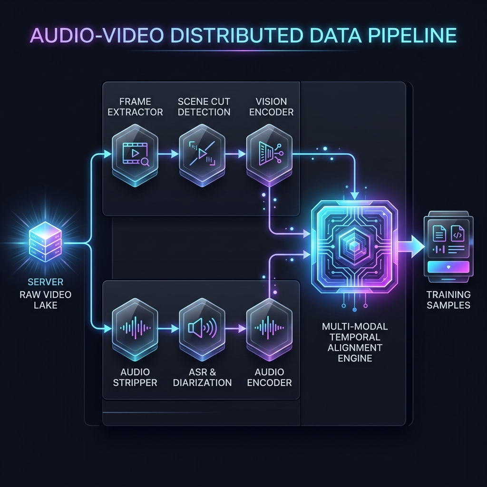
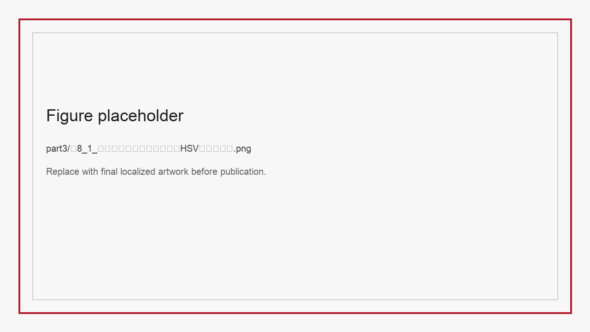
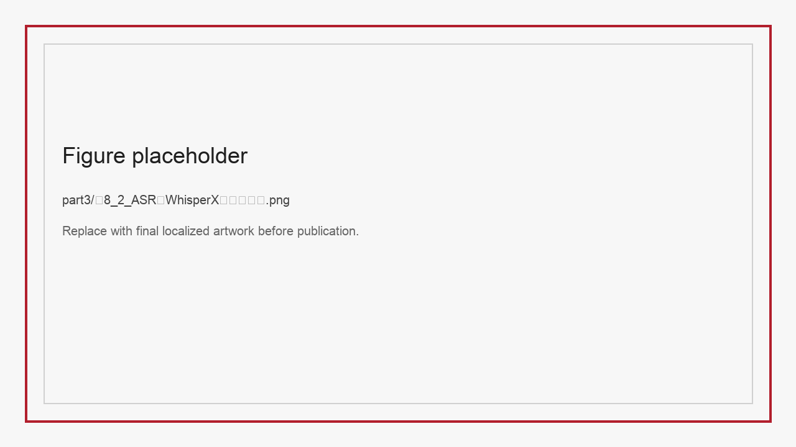
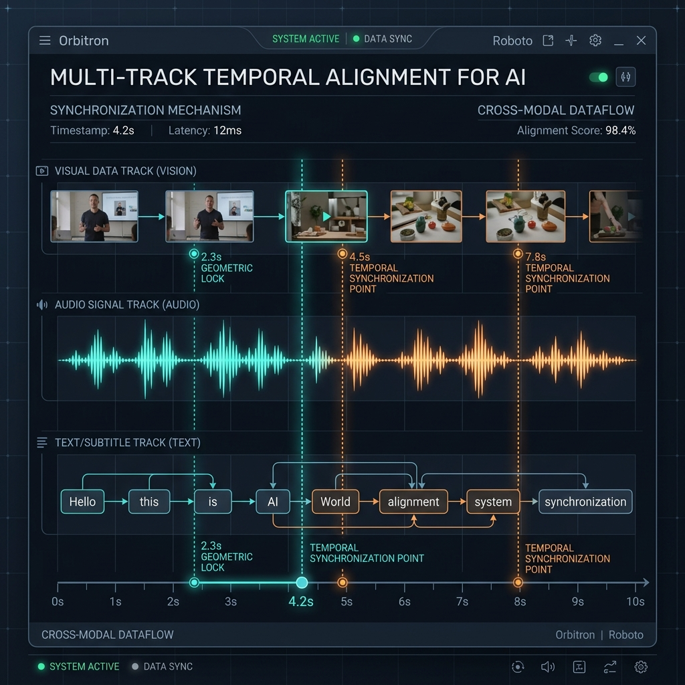

# 第10章 视频与音频数据工程

继自然语言文本（第一、二篇）和静态图文解析（第八、九章）之后，本章进入新一代多模态大模型数据工程的另一个层面——**长序列时序数据工程（Temporal Video & Audio Data Engineering）**。

基于图文对或单帧截图的训练只能让模型识别静态内容：它能认识各种苹果，但难以理解“一颗苹果从桌上掉落、滚进床底并发出撞击声”这一过程中所涉及的视听同步与时间因果。只有系统地建模时间序列，模型才有可能成为 Sora、Gemini 1.5 Pro 这样能够刻画物理与声学规律的“**世界模拟器（World Simulators）**”。

这也意味着，数据工程的复杂度从二维平面进一步扩展到了时空序列。

## 10.1 音视频数据为什么“看起来多、可用样本少”

许多刚接手多模态项目的架构师容易产生一种“数据过剩”的错觉：YouTube 和 TikTok 每天新增上百万小时视频，似乎是取之不尽的数据来源。然而真正启动预训练预处理管线时，常常会发现 1000 TB 原始视频中，真正可用的样本筛选下来不到 10 TB。

这种落差主要来自以下三个原因：

### 10.1.1 维度扩展：从二维到四维时空序列

处理纯图片时，即便分辨率较高（如 4K AnyRes），表达形式也仅限于 $(W \times H \times C)$ 的二维张量。而视频在此基础上多出一个维度：$(T \times W \times H \times C)$。
$T$ 代表时间帧数（Timesteps）。即便只有 1 分钟、30 FPS 的短视频，也会产生 1,800 帧连续高清图像。原本可控的 `CLIP Score` 计算与视觉 Token 压缩算子，在这种规模的时序张量面前，很容易触发 GPU Out-of-Memory（OOM）。因此通常需要设计严格的**视频抽帧（Key-frame Sampling）**体系，代价是丢弃 90% 以上的帧信息。

### 10.1.2 看似丰富，实则可用样本有限

1000 TB 的原始视频中，约 80% 属于以下两类：
1. **静止冗余**：例如一段两小时的在线网课，画面可能有一整段时间只是静态 PPT 与右下角一张几乎不动的讲师人脸。如果让框架将这数千张同质画面全部编码进训练样本，会使梯度被无效信号带偏，对模型能力提升基本没有贡献。
2. **底噪与音画错位**：大量生活 VLOG 混杂着风噪与背景轰鸣，也常见“画面里的人在打高尔夫、背景音乐却是流行歌”的“音画错位（Audio-Visual Misalignment）”样本。对于需要学习物理因果（如看到玻璃破碎画面要听到对应声音）的模型，这些样本都属于风险较高的训练数据。

### 10.1.3 解码算力与存储瓶颈

正如 **第 3 章** 与 **第 6 章（高效加载篇）** 中讨论过的那样，存储文本只需读取字节流，而长视频在训练期间的动态加载涉及底层文件系统的复杂处理。
视频数据通常以压缩格式（H.264/H.265/VP9）存储。要提取模型可用的原始像素帧序列与音频采样率，必须先在加载阶段执行硬解码（Decoding）。当 100 张 H100 等待批次数据时，CPU Data Loader 与集群 I/O 带宽容易因为同时解压数百 MB 的 MP4 流而出现阻塞。

---

## 10.2 切片、转写与时序对齐的“三轨并行流水线”

要处理这种四维数据，早期图文对时代“一图配一句（Image-Text Pair）”的处理模式已不适用。我们需要构建能并行处理视觉、声学和文本三条独立轨道的“**音视频样本构建流水线**”。

*图 10-1：音视频切片与对齐分布式工业管线（Audio-Video Pipeline） —— 左侧原始 Video Lake 中的混合视频被拆分为视觉、声学双轨并行处理。视觉帧提取器与声学分离器（Diarization）独立提取特征后，汇入跨模态时间对齐引擎（Temporal Alignment Engine），最终生成时间戳严格对齐的多模态训练样本。*

### 10.2.1 视觉提取：镜头切分与场景分段（Scene Segmentation）

在进入训练之前，超长视频（例如 2 小时的电影）需要先被切分为逻辑与镜头连贯的小片段（Clips），通常长度为 10–30 秒。不能使用“按每 10 秒固定切一刀”的方式，因为这容易把一个连贯动作或一句话从中间截断，造成语义损失。

1. **镜头切换点检测（Shot Boundary Detection）**
 视觉流水线（Top Path）中需要加入一道快速检测环节，例如双阈值颜色直方图比对算法或轻量级的两帧光流差异（Optical Flow Difference）计算，用以识别由机位变化、剪辑引起的硬切与软渐变。只有同一镜头内的连续帧，才能作为一个完整的事件单元（Event Grounding）输入预训练视觉模型。

*图10-2：直方图差分策略 —— 在密集帧序列中，通过比较相邻两帧在 HSV 色彩空间的差异，可以以较低成本检测出过场动画，控制视觉片段的语义边界。*

2. **自适应抽帧（Adaptive Sub-sampling）**
 切片完成后，20 秒内的镜头虽然逻辑连贯，但动作幅度可能很小。可以部署小模型，持续比较当前帧与上一保留帧在稠密视觉特征（如 DINOv2 Embedding）上的距离，超过预设的欧氏距离阈值（说明画面有新内容）才打标保留。一段原本 600 帧的 20 秒切片可能因此被压缩到约 10 张关键帧，视觉输入侧的负载相应下降约 98%。

### 10.2.2 听觉处理：转写、降噪与说话人分离（ASR & Diarization）

与视觉抽帧并行的底层通道（Bottom Path）负责提取语音语义。
首先执行**多路音轨分离（Audio Stripping）**，然后进入三层处理：

#### A. 语义层提取：基于 WhisperX 的大规模 ASR
对于语音轨，需要调用 Whisper 或 WhisperX 等开源框架，将含多种口音的语音流转写为结构化文字序列。

*图 10-3：大规模 ASR 效果对比 —— 大语言模型如果接收的是错误的 ASR 转写（例如把 `I love apples.` 听写成 `I love maples.`），下游推理的稳定性会显著下降。引入时间动态校准和多路声学解码的改进版可以减少长时序对齐中的漂移。*

#### B. 降噪与音源分离（Denoiser Layer）
并非所有视频都拥有演播室级别的隔音条件，野外采集数据常混入风噪或机械共鸣。需要使用 Demucs 等深度学习音源分离算法（Source Separation），将底层音乐（BGM）、环境声（Environment Noise）与人声（Vocal）分离开来。

#### C. 说话人分离（Speaker Diarization）
对于多人对话的播客（Podcast）或会议视频，如果将语料压成单轨字符串，模型在训练时无法分辨提问者与回答者，会学到混乱的角色对应关系。Diarization 算法可以把长音频按说话人切分并标注为 `[Speaker A]: 01:23-01:30` 与 `[Speaker B]: 01:31-01:40` 的形式，保留说话人信息。

### 10.2.3 字幕、语音、画面的时间对齐

完成关键帧抽取、ASR 字幕生成与音源分离后，进入流水线中较为关键的环节：**跨模态时间对齐（Cross-Modal Geometric & Temporal Lock）**。

一条 ASR 字幕“Hello World!”对应的具体毫秒区间和口型帧是哪些？如果不建立这种时间锚点（Temporal Anchors），模型不仅难以学到声画同步，连口型匹配也无法稳定预测。

*图 10-4：多片段时序对齐示意 —— 图中展示三条异构轨道：顶端是视觉关键帧缩略图，中段是音频波形序列，底端是离散的转写 Token 文本；当纵向时间锚轴（例如 4.2 秒处的 Geometric Lock）将三条轨道在同一时间点对齐（如画面端起水杯 + 声音波谷 + 文本“水杯”）时，该流媒体片段才能形成可用于训练的多模态对齐样本。*

工业实践中通常会部署 **Multi-modal Temporal Alignment Engine（多模时序对齐引擎）**。当前端识别器给出形如 `<start:2.1s><end:4.5s>` 的时间区间时，对齐代码会按浮点数计算反查视频中对应的帧。最终这些对齐信息会以包含元数据标签（Meta-data tags）的 **多轨混合序列（Mixed Token Pipeline）**，以 JSONL 等结构化格式提供给训练 Dataloader 使用。

---

## 10.3 事件标签生成与错位过滤

10.2 节完成了视听轨道的拆分与时间对齐，但这批基础结构化样本（Raw Structured Samples）在进入预训练之前，仍缺少更高层的“事件监督信号（Event Grounding Signals）”和“错位过滤器（Misalignment Killer）”。

### 10.3.1 多层级动态事件标签生成（Event Detection & Grounding）

仅有画面和转写文本不足以表达视频中的“动作流”。工业管线中会并行调用一批高级标注辅助模型（如 LLaVA-Video、Video-LLaMA 等行为理解模型）作为旁路集群，对对齐后的视频小切片执行**异步标注（Asynchronous Captioning Batch）**。

这些模型不仅给出整段视频的全局一句话概括（例如“一个青年在滑板公园表演翻转失败摔倒”），还会输出阶段性的细粒度时序标注（Detailed Temporal Captions）：
- `<time: 01.2s-03.5s>`: 男生助跑并借力跃上 U 型池抛面...
- `<time: 03.5s-05.1s>`: 男生试图在高空实现 360 度转体，但其背部失去平衡...
- `<time: 05.1s-06.8s>`: 男生后背重重砸在混凝土滑道上，产生沉闷的低频冲击声响。

将这种带前因后果的标签写回上一节生成的 JSONL 多轨对齐结构中，视频样本在训练中才能承载明确的时空语义信号。

### 10.3.2 音画错位检测

长时序数据的常见风险之一是“画面与声音不对应”。例如，视频画面是一头安静吃草的长颈鹿，UP 主却在该段直接混入电音舞曲或与画面无关的游戏解说音频。这类数据进入基座训练后，模型在面对长颈鹿画面时，可能会生成与画面无关的音频联想，引发幻觉（Hallucinations）。

为减少这类问题，流水线中需要引入严格的检测与复检流程：

**表10-1：时序流超频数据缺陷类型与多层检测处理动作表**

| 时空严重缺陷类型与底座视角特征表现 | 缺陷诱发根源与物理排场剖析 | 多轨对齐平台核心防御拦截动作（检测策略与方法） | 风险等级 |
| :--- | :--- | :--- | :--- |
| **音画错位（Audio-Visual Hallucination Mismatch）**：画面是寂静森林的远景，但人声音轨却在快速解说 FPS 比赛实况。 | 多为二创剪辑或自动压片时的音轨混淆（Audio Track Bleeding）。 | **使用预训练判别器计算特征余弦相似度**：抽取当前关键帧的 CLIP 视觉向量，与音频语义向量计算夹角。如果跨模态相似度（Cosine Similarity）低于阈值，就丢弃该 10 秒片段的全部标注。 | 高风险 P0 |
| **画面损坏：闪烁、黑屏、极端马赛克（Frame Corruption & Dark Out）** | 视频采集端比特率不足，或传输过程中存在严重丢包。 | 计算片段的**亮度直方图均值与锐度得分（Laplacian Variance Filters）**。若像素几乎全黑或均方差异常，立即拦截并送入废弃池（Trash-pool），并将异常退回抽帧模块排查 C++ 解码算子。 | 严重 P1 |
| **背景噪声压过人声（Irreversible Noise Flooding）** | 麦克风破音被增益放大，或背景中存在难以分离的高频噪声。 | 使用小模型对全频带频谱（Spectrogram）执行**声学信噪比评估（SNR Estimation）**，低于阈值的人声轨标记为高风险样本。在对话相关项目中通常直接舍弃。 | 视用途而定 P2 |

---

## 10.4 成本核算、量化设计与吞吐优化

只在纯文本 LLM 上估算成本的人，在接触多模态时序管线后会发现 GPU 账单显著上升。

在纯文本时代，一台 64 核 CPU 服务器一天内可以解析数亿个 Markdown 爬虫文件；而在视频清洗场景下，仅是读取 1 万小时的高清 MP4，并在内存中解码为张量供特征抽取使用，就足以把这台服务器的 CPU 与 I/O 占满。

### 10.4.1 解码算力（CPU/GPU）与 I/O 带宽

关键问题在于使用何种硬件执行视频帧解码（Decoding）。
1. **纯 CPU 解码方案的局限**：早期架构中，部分团队会使用 CPU + 多线程 ffmpeg 或 cv2 进行软件解码。在高并发下，这种方案容易将 PCIe 与 RAM 的带宽占满，瓶颈很快显现。
2. **硬件视频解码（Hardware Video Decoders, NVDEC）**：更稳妥的做法是把解码任务下放给 GPU 芯片中的专用解码模块（如英伟达 NVDEC）。借助显存高带宽，可以实现单机数百路视频流并发解码，把 CPU 解放出来用于后续校验与评估。虽然 GPU 实例成本较高，但在大规模集群下能显著提升整体吞吐。

**表10-2：残酷的长时序音视频大规模集群（1000 H100 等效）核心处理成本分类分解与降本优化矩阵**

| 后端管线底层切削流程阶段 | 服务器核心资源高度开销大口径分析 | 云成本折算与集群资金占比（大概经验概略占比） | 对应的极限吞吐量优化优化底层与工程缓解绝招策略 |
| :--- | :--- | :--- | :--- |
| **阶段 1：原始视频拉流与分块缓冲下载** | 千兆网卡的出入流量，对象存储节点的高并发 I/O（占用骨干网带宽）。 | 10% - 15% | 不建议直接访问长存储池。引入边缘缓存层（Edge Caching Layers），按预先编排的分片索引把数百 GB 文件拆成小碎片，预加载到 GPU 节点附近的本地 NVMe 缓存。 |
| **阶段 2：画面解码与自适应过采样** | 是成本占比最高的阶段。主要消耗显卡上的专用视频解码单元（NVDEC），以及配合调度的少量 CPU 算力。 | **45% - 50%（集群成本占比最高）** | 采用多尺度硬件下采样组合方案，并在调用层用 DeepSpeed-UIO、DALI 等框架替换基于 Python OpenCV 的单线程实现，将单位时间内的解码帧数提到上限。 |
| **阶段 3：异步标注与声学提取（大规模重描述、WhisperX 等）** | 密集的高端 GPU 推理算力消耗，对显存占用较高。 | 15% - 20% | 使用量化版小模型（INT8 或更低位宽）；引入动态批处理（Dynamic Batching），减少不等长序列因 Pad 填充带来的无效计算。 |
| **阶段 4：多模态切块、时序排序与封装写入存储** | 后端 NAS / S3 对象存储的高并发小文件写入 I/O。 | 少于 10% | 避免使用大量小文件的存储策略。采用 WebDataset 或 TFRecord 等块状容器格式，以管道流形式连续写入高速硬盘，可显著降低读写 I/O 压力（约 90%）。 |

---

## 10.5 真实失败案例与下一章衔接

### 10.5.1 万小时视频失败复盘（P 项目系列）

某次内部视频自研项目中，团队准备了超过 6 万小时的高清短剧与教程素材。在大约三个月的数据集制作过程中，这批数据最终因质量问题而无法直接使用。
原因在于工程架构中**省去了若干阶段性校准步骤**：音频特征分离接口存在一个不到 30 毫秒的读取偏置（Reading Offset Bug）。在多次切分与合并后，该偏置在数据库的后半段累积放大，最终导致约 70% 时长的切片中，演员的声音轨道相对口型与动作画面出现了明显的提前或滞后。

将这些时空一致性受损的样本送入 800 亿参数模型训练后，模型并未表现出预期的泛化能力。经过两周训练后，模型在多项基准评测中出现了系统性偏差——例如看到长发的人挥手打招呼，会预测后续音频是狗叫或玻璃破碎。这印证了第 1 章开篇就提及的观点：
**多模态数据预处理工程的稳定性，是模型效果可被复现的前提。**

### 10.5.2 本章总结与下一章衔接

回顾整体进展：从第一、二篇的纯文本清洗，到第八、九章的图文二维数据处理，再到本章对长时序四维音视频的拆分与对齐，我们已经建立起一套覆盖多模态原始数据的清洗与结构化方法体系，可将异构原始片段提炼为可用于训练的样本。

但这些工作主要解决了“向模型输入什么”的问题，模型本身仍然不知道在多种特征中应该按照怎样的优先级响应人类指令。要让一个具备时空感知能力的多模态模型变成一个稳定、听话且符合人类价值观的助手系统，需要进入对齐与指令数据的环节。
下一卷将进入**《第四篇：指令对齐与人类偏好数据》**，并由第 11 章的跨模态对齐与第 12 章展开后续讨论。

## 参考文献

<!-- 待补充：本章引用的论文、博客、工具与官方文档。补全策略见 publishing/citations_progress.md。 -->
