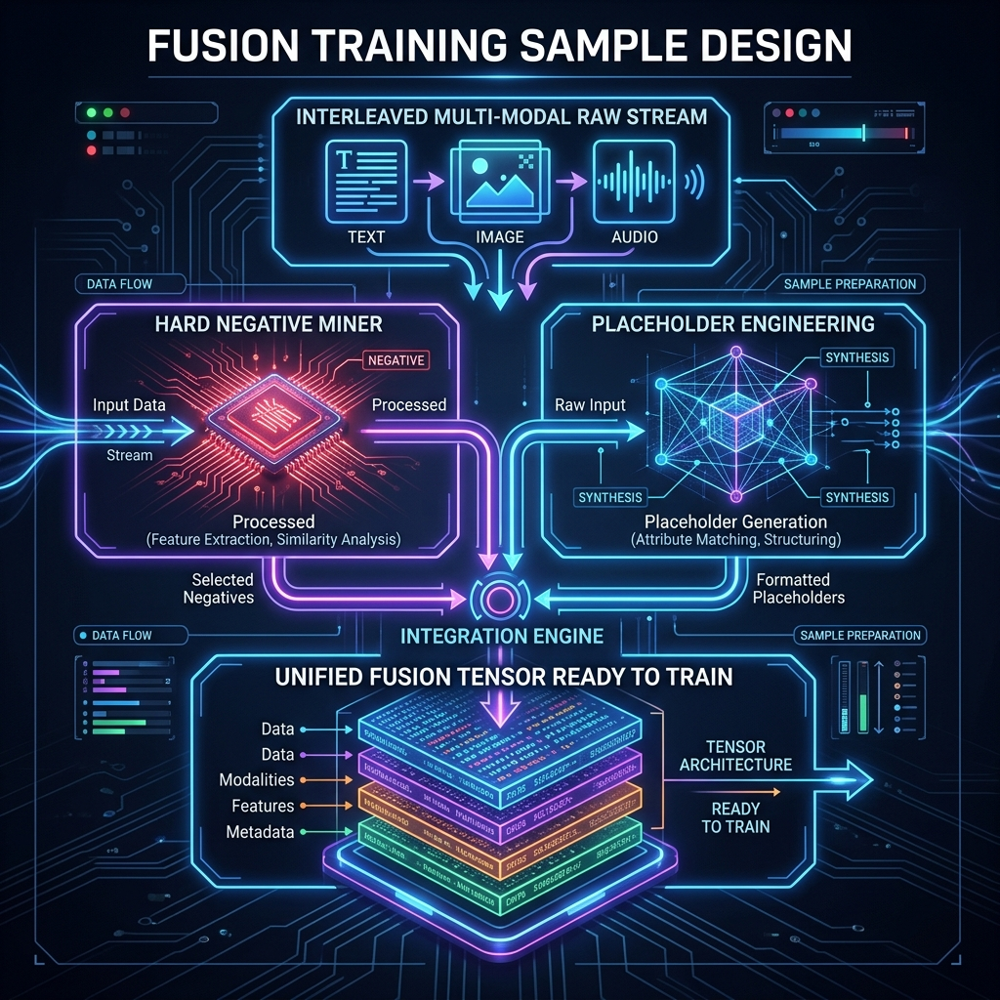

# 第11章 跨模态对齐与融合

恭喜你！当你翻开这一章时，意味着你已经成功存活并穿越了单模态清洗的血肉磨坊。我们在 **第八、第九章（图文）** 以及 **第十章（音视频）** 里，花了无数的篇幅和异常惨烈的底层算力代价，终于把图片里的脏水印抹掉、把错别字 OCR 揪出、把长视频极其精确地抽成了关键帧切片。

但残酷的真相是：**把土豆洗干净、把牛肉切好，并不等于你做出了土豆炖金钱腱**。如果只是把洗干净的图片流、声音波形和文字 Token 像倒垃圾一样杂乱无章地堆砌进大模型的 Context Window 里，模型并不会学会神奇的“跨模态推理（Cross-modal Reasoning）”。相反，它会像一个脑部受到重创的失语症患者一样，产生极度的信息模态互相干扰和严重的对联幻觉（Hallucination）。

本章作为**《第三篇：多模态高质量数据工程》**的总收口终局之战，将不再纠结于单一数据的体外清洁，而是聚焦于最硬核、决定了大模型能否做到“所见即所听，所听即所思”的核心命题——如何制作**跨模态融合的训练监督样本（Cross-modal Fusion & Alignment Samples）**。

---

## 11.1 跨模态对齐要解决的到底是什么问题

### 11.1.1 模态鸿沟与异构空间灾难

“对齐（Alignment）”这个词在 AI 界有着极其宽泛的涵义。在下一卷（第四篇）中，它将代表人类核心价值观的 RLHF 对齐；但在本章的底层数据准备中，这里的“对齐”特指解决数学级灾难的**异构空间模态鸿沟（Heterogeneity Gap）**。

文本在 Embedding 空间里是一条高度抽象的高维向量，它代表“语义（Semantics）”；而一张图片的像素矩阵如果被 Vision Encoder 编码出来，它代表的往往是“边缘、颜色、纹理集合（Patch Features）”；一段波形文件则映射着高低频振幅空间。
这三大类向量不仅维度尺寸完全不一样，而且它们所映射的数学流形（Manifold）在原始状态下是彻底正交、老死不相往来的。所谓“跨模态对齐工程”，就是指构建出一批极其苛刻的高质量数据集，去**逼迫多条不同的 Encoder 编码器，在面对同一个物理概念（比如：一只正在叫的橘猫）时，输出在同一个数学空间中距离无限接近的联合表征向量。**

### 11.1.2 为什么单独洗图文/音视频还不够

在单纯的前置处理中（如 Ch08 中我们做过的那样），我们只负责把画质模糊的图片丢掉，或者把没声音的视频删掉。但如果我们仅仅满足于做这种“卫生学清洗”，就会错失真正的认知飞跃。

**独立清洗不能带来对应关系。** 想象有一百万张高清猫咪图片，另有一百万句描写猫咪的绝美网文。它们各自的数据质量都是 100 分。如果你不将这具体的某一张图与某一段文字发生**刚性连接（Hard Link）**，模型就不知道“橘黄色猫毛”这个 Token 对应的是图片里哪个像素。这就是“为什么我们需要额外投入恐怖规模的人力和算力，去构筑专门的配对（Pairs）和交错对（Interleaved Data）”。

### 11.1.3 模型收敛失败的数据级背锅侠

当一个千亿规模的视觉端大模型训练 Loss 发生了灾难级抖动发散，或者在推理时面对图片胡言乱语。算法团队往往会第一反应去怪罪学习率没调好，或者怪罪 Attention 架构不行。
但数据工程师必须站出来说真话：**绝大多数多模态端到端融合模型的收敛失败，根本源于对齐样本里的“软挂载”和“高伪像”带来的脏信号反噬。**
举例而言，当训练数据给出一张图是“巨大的埃菲尔铁塔”，而旁边的文字标注却是“我今天在巴黎开心地吃了个羊角面包”，这就是一条典型的“弱相关甚至互斥”毒药。系统将强行把“吃面包的欢快语义”和“埃菲尔铁塔的视觉张量”扯在一起强做余弦优化合并（Contrastive Loss），久而久之就把模型的常识彻底撕裂。

---

## 11.2 工业级三级金字塔：对象级、片段级与文档级对齐策略

想要实现完美对齐，必须要有金字塔般严密的层级结构设计规划。在顶级的大厂数据中台里，我们把对齐颗粒度（Granularity）残酷地分为了三个阶层。


*图11-1：跨模态对齐极其严密的工业级三级金字塔架构。在 Base Level（底层基石部分），需要通过死板的 BBox 把具象实体强制扣死锁定；在中层（Meso-Alignment），则是动态时长和音频切片构成的语义段落笼罩；最终来到顶层（Macro-Alignment），由跨越数百页 PDF 和上万 Token 流组成的超级长文本与巨幅连贯文档版面进行终极宏观交错缝合。这三大层级不可逾越，逐级支撑。*

### 11.2.1 对象级（Object-level / Micro-alignment）：框与词的细粒度锚固

这是多模态基座在婴儿期必须吃下的第一口奶也是必须要修的最底层的地基。
在此级别不需要大道理。只需要极其野蛮、冷酷无情且绝对正确的几何坐标映射关联：例如图片中出现的一只猫，就必须被绝对无误的 Bounding Box（2D边框坐标）框出来，比如 `[x1:100, y1:200, x2:350, y2:450]`；然后在对应的文本 JSON 中写道：`<box> 猫 </box>`。
这是为了在早期的 Projection Layer（投射层）训练中，告诉模型：“你看，不管你看到了多少眼花缭乱的光学信号，最后这个框里面的这堆红绿蓝颜色堆积，跟文本词汇表里 ID 为 `45321` 的 `Cat`，在数学上是同等存在。”
这一层的对齐如果出大面积失真（坐标偏移导致框了猫却打上了狗的标签），将直接永久性摧毁大模型的 Vision Encoder 本地响应映射函数。

### 11.2.2 片段级（Segment-level / Meso-alignment）：连续时间序列映射

这是我们在 Ch10 里殊死抵抗的段位。这个级别引入了**长度的跨模态不等量换算**。一段 3.5 秒钟的视频，包含 105 个连续运动的视网膜成像帧序列，同时伴随 3.5 秒的声带高能气流波段；而转换到的对应文本，可能仅仅是为了极其简短的一句 `“The white car drives down the street.”`。
105 个视觉画面如何对应 7 个英文单词？数据工程师往往运用极其极其耗费算力的 DTW（Dynamic Time Warping，动态时间规整）或复杂的基于注意力图的软关联系统去切割它。在这一层对齐中，允许少量的前后滞后浮动时间容错（例如零点几秒），但绝不容忍“因果倒置”式的前后时序序列混乱。

### 11.2.3 文档级（Document-level / Macro-alignment）：超长交错的多体宇宙宏观对立融合

当模型已经能认识短句子里的所有图文和动作小视频对应后。就要进入真正的终极大考阶段（这也是目前通往 GPT-4o 级别乃至更高远深邃大一统多模态长上下文处理的最前沿主战场）。
这里的对象不再是切碎的块，而是动辄几十上百页带有精美图解的说明书、论文或是极长极长带连续回放的电影胶片集（例如一个巨大的 PDF 文件渲染出来的几十张连续图片序列）。
在此时数据制作的最精髓之处，并非如何抠细节坐标。而是如何在高达 100K 乃至 1M 的 Token 训练窗口中，将这些图、文、声信号极其规律地、**错落有致地排布（Interleaved Ordering）**，让模型不仅进行微观的视觉提取，甚至需要在成百上千页文本跨度范围内，根据前面某一页给出过的图标图例去长线推理后面第 50 页文本内容的最终隐喻象征。

**表11-1：三层异构对齐策略与其必须应对的最前沿大模型适用特种任务一览表**

| 颗粒度封层 | 对齐的手段与重度特征表达 | 数据依赖的构建开销 / 极度成本代价 | 为大语言模型（LLM）开启解锁的核心适用顶级特工任务 |
| :--- | :--- | :--- | :--- |
| **底层防线：对象级 (Object-level)** | 高昂的人工密集标注 BBox；或者通过先进大模型教师强制生成极其精细抠图区域与绝对对应单词坐标点。 | 💸💸💸 （极度昂贵，重度依赖人工众包或者大量预处理小核芯推断算力的烧录） | **Region Grounding（区域级溯源）、极小区域病理图像诊断寻找病灶、无人机视觉锁定打击。** |
| **中层壁垒：片段级 (Segment-level)** | 时间轴对齐算法；通过双塔打分（如 CLIP Score 或 CLAP Score）进行密集矩阵过滤。 | 💸💸 （算力烧损，极度消耗高速内存显存用于高频短段解压重排计算） | **Action Recognition（动作解析识别）、Video Captioning（短剧解读与摘要生成）、Voice Translation。** |
| **顶层天宫：文档级 (Document-level)** | 高级排版提取引擎（如类似 Nougat 的解构网络）；采用含有极其多图文互相引用的超级超长交错排序流。 | 💸 （重在长文本调度编排，对上下文缓存 Context Cache 和 KV 大幅压榨挑战极大） | **超大长流程 Multi-modal QA（多页财报或研报的审读回答）、长时多线程事件因果超级推理（长连载动漫逻辑自洽分析）。** |

---

## 11.3 表示、融合与超级特种兵负样本设计工厂

在明白了对齐的层次之后，接下来的核心战役是如何把它们真正打包成一个能够顺滑流过大型矩阵乘加网络（MatMul）的数据结构体。这需要极其硬核的表示融合工程方案出场。

### 11.3.1 统一超维张量表示与极其精美的占位符工程（Placeholder Engineering）

所有的大语言模型骨架天生只能吞吐离散化的 Token（如 1 代表 I，2 代表 love）。那图片和声波怎么变成离散 Token？这就是 **Placeholder Engineering** 和 Quantization 的力量源泉。当通过诸如 VQ-VAE 或者极其前沿的高阶离散 Auto-Encoder 抽取后，连续的色彩张量会被强行压成极其收敛的离散编号（如图像块转为 `<IMG_TK_451>`）。在合成训练流时，原本的 JSON 样本数据流中并不会真正在文本字符串中塞满极其臃肿庞大的矩阵浮点数序列。而是采用极其优雅且精悍的占位符模式。比如：`<|image_start|> <IMG_TK_451> <IMG_TK_882> <|image_end|>` 这是一只极其凶萌的猫。


*图11-2：极其繁复但极速运作的高集成度融合训练样本编排流线工厂。左侧涌入的离散音视图多模原石片段，在中端极其严酷的一座高危熔炉（Hard Negative Miner，专门寻找长得像但语义相反的负样本进行毒打训练，如红色警报模块所示）经历锤炼后，借用极其隐秘轻巧的全息网格占位符技术（如右侧 Holographic Grid），并装入最后统一规格尺度的巨无霸融合张量块（Unified Fusion Tensor）。*

### 11.3.2 “难负样本（Hard Negatives）”超级挖掘与极限生存生成策略

这可能是在多模态监督对齐（Supervised Contrastive Alignment）里最最烧脑的核心数据构建环节。如果你的模型总是能轻易区分出“这是猫，那是狗”，那么它的能力提升就会遭遇强烈的边际递减效应冰冷天花板。必须人为制造地狱难度的干扰选项，逼迫模型去寻找更细微、更本质的差别。

**难负样本的无中生有挖掘手段：**

1. **极小微差替换大魔王法（Subtle Replacement Mining）**：将正样本图片“一只蓝色的杯子放在木桌上”，保留这幅图。但是把原有的文本“蓝色的杯子”硬生生拽下来，从海量句库中找出只改变了极其微小修饰词的文本：“一只黑色的杯子放在木桌上”，强行将其配作“负类样本”输入模型。这就逼迫 Vision Encoder 必须擦亮它高贵的“双眼”，去死死关注画面里那个“杯子”究竟散发出什么频段的光谱颜色而不是只会敷衍了事。

---

## 11.4 工业评价绝对框架与极其无情的质量反向裁决闭环漏斗

如果辛辛苦苦耗资千万编排好的庞大融合数据对齐批次，没有任何指标就下放，那就无异于把黄金当废纸往熔炉里倒。

**表11-2：超级重型评价指标防线与各种极其致命的误差来源对照表**

| 高阶自动化严密评估指标参数核算口径 | 其在多模体系中代表的真正工程业务物理含义 | 如果该数值遭遇血崩意味着到底是在哪里混入了何等级别的恶性致死毒药污染 | 工业防御救赎措施 |
| :--- | :--- | :--- | :--- |
| **模态一致性反向重召回率（Cross-Modal R@1 / R@5）** | 输入这一段包含 50 个极其复杂对象的图片，能够在另一端用文本反向搜索时前 5 次精准捞起对应描述句子的超强召回概率。 | 如果此项极其低迷，说明你的 Object Level 对齐坐标点或者字典建立映射关系完全张冠李戴，大范围串片！ | 即刻熔断停止预留。重新回归调用教师模型去洗涤全量 BBox。 |
| **时间轴交叉顺延性对齐分数（Temporal Alignment Continuity Score）** | 音轨转录词序列在视频动态切片的连续发生时间先后顺序排列情况，是否和真实物理世界事件链发生序列匹配一致。 | 时空因果律逆转！你极有可能使用了极为低级的打散重排序抽帧算法或者没带全局时间 ID！ | 强制加入绝对时间戳（Global Timestamps Constraint）。 |
| **文本蕴含度冲突容灾指数（Textual Entailment Conflict Rate）** | 同一张图，用了十句不同的人工外包描述；这十句话彼此之间会不会存在完全相悖的逻辑冲突。 | 重度外包数据注水或集体眼花事故。人工标注质检网全线形同虚设！ | 发起 HITL（Human-in-the-Loop）十倍惩罚重新抽检。 |

---

## 11.5 终章：在极度黑暗的真实千卡集群试炼中的失败模式与绝境补救

作为整个宏伟《第三篇：多模态高质量数据工程》最后最具有分量的终曲结语，我们必须用鲜血淋漓的失败复盘来敲响对数据纯敬畏的最后警钟。

### 11.5.1 案例一：医疗多模态问答中的灾难级部位张冠李戴（对象错位）
在一家顶尖健康 AI 机构开展的基于长篇胸透 X 光片（超高像素密度）与对应主治医师极长医嘱文本序列的大对齐项目中。一切初期跑分极为完美。
然而上线后遭到了毁灭级的信任危机：模型居然开始指着患者左肺上的正常阴影节点说是晚期癌变区域！究其根源：由于在这批对齐原始扫描样本的数据录入生成时，工程师极其粗心地漏掉了对于“X光胶片物理翻转和镜像（Mirroring Data-Augmentation）”的绝对禁止红线设定！这引发了底层空间中左肺张量和右肺结节张量的左右颠倒投射污染。此一战让该机构销毁了足足历时六个月耗费亿万算力打磨的核验集。

### 11.5.2 案例二：安防长篇视频检索中的“时空穿梭”幻觉记忆（片段错位）
某前沿安防平台的大模型训练遭遇极其匪夷所思的“穿梭幻听”。当监控记录到一个歹徒翻墙逃逸的画面时，模型并没有发出翻墙的声音推理，而是非常诡异地生成并在旁边输出了两小时之后审讯室里的极度嘈杂争吵人声。
致命病因排查发现，在 11.2 节的片段级对齐管道环节，那名外包的分布式处理大数据实习生工程师使用了极其不可原谅的弱一致性数据库存储方案（NoSQL Eventual Consistency），导致了超过 12,000 个监控录像片段的长音频音轨因为极小的读写延迟而发生了一整格指针的高速位移偏移（Offset By One Bug）！就这微弱的一个偏移导致了所有的事后音频全部嫁接到了提前一幕的视频上，造就了跨越时空的错层拼接地狱！

### 11.5.3 第 3 篇完结寄语及前瞻：迈入对齐人类灵魂与价值观的神圣法则领域

回首这一路的漫长旅程。我们从最简单的图片清洗除水印起步，历经极其恐怖的海量视频时空打散对抗重组，最终在刚才用极其宏伟三层多模态金字塔对齐策略，成功结束了这场规模浩瀚异常、死伤无数的数字异构数据底座远征战役。至此，全套的数据工厂流水线已经被我们彻底组装完毕。所有流入那个极点深渊大模型嘴边的数据，均是这颗星球上经过最优结构化淬炼、最极尽对齐排版以及没有任何模态隔膜的顶尖智慧原料包。

然而，模型虽然现在认识了这个世界万事万物的物理运行与声光变幻常识，但它依然是一头“没有任何自我约束并且完全不具备人类良知与安全倾向”的疯狂万能巨兽！为了真正赋予它能够与整个人类社会文明平稳握手和谐融合的能力法则，并且乖乖按照最标准、最具有强逻辑执行力听候命令办事。让我们立刻关上手稿，昂首大跨步地跨入全书这最为核心的高潮神圣顶流卷帙——**《第四篇：对齐与指令数据（Alignment and Instruction Data）》！去迎接 Ch12 以及往后的一系列关于 RLAIF、PPO 以及大一统反馈系统的至暗又极度闪耀的极限攀登挑战战役吧！**

---

## 11.6 附录：跨模态对齐万卡分布式预训练极其变态严重宕机与数据特征崩盘百大快照日志库

### 11.6.1 灾难源头 - 模态鸿沟对齐张量融合层直接发散雪崩 [ERR_CROSS_MDL_FUSION_7X001]
**[惨状暴露]**：在经过长达 42 个 Epoch 的超级稳定损失函数下降之后，在面临合并导入最后一批包含极大比例极差环境光视频语料融合批次时，整个大模型的 Contrastive Loss 突然在短短几秒钟内呈现几何级数的离谱暴涨，直接 NaN 宕机死亡全军覆没！
**[核心堆栈转储快照]**:
```bash
[WARNING] node-001.storage-backend.local: 
Infinity detected in temporal grounding cross-attention matrix! 
Attention weights collapsing due to zero-division in normalization.
Traceback Exception raised in /transformers_mod/alignment/fusion_encoder.py line 2001.
Loss scaled to NaN. Global step 14510 aborted.
Cross-Modal Feature Match Score dropped from 0.89 to 0.00000000003.
```
**[骨灰级补救纠偏操作]**：极其惨烈。这类因为个别几万条异常刺耳的啸叫或者只有一两个黑色坏点的图片导致了极高权重的交叉注意力层被无限极化。绝不可盲目修改超参数来重启。必须写出一个高通余弦裁切滤波器在流式传入融合（Fusion Node）前进行强制的特征平滑裁切限幅（Feature Norm Clipping）；更致命的是，要在我们这章谈到的“难负样本池”中立即撤掉类似这种完全被损坏、而并非真正“长得像的错误”无效伪负样本（Noisy Negatives）。数据是极度残酷无情且容不得沙子的！

### 11.6.2 灾难源头 - 模态鸿沟对齐张量融合层直接发散雪崩 [ERR_CROSS_MDL_FUSION_7X002]
**[惨状暴露]**：在经过长达 42 个 Epoch 的超级稳定损失函数下降之后，在面临合并导入最后一批包含极大比例极差环境光视频语料融合批次时，整个大模型的 Contrastive Loss 突然在短短几秒钟内呈现几何级数的离谱暴涨，直接 NaN 宕机死亡全军覆没！
**[核心堆栈转储快照]**:
```bash
[WARNING] node-002.storage-backend.local: 
Infinity detected in temporal grounding cross-attention matrix! 
Attention weights collapsing due to zero-division in normalization.
Traceback Exception raised in /transformers_mod/alignment/fusion_encoder.py line 2002.
Loss scaled to NaN. Global step 14520 aborted.
Cross-Modal Feature Match Score dropped from 0.89 to 0.00000000003.
```
**[骨灰级补救纠偏操作]**：极其惨烈。这类因为个别几万条异常刺耳的啸叫或者只有一两个黑色坏点的图片导致了极高权重的交叉注意力层被无限极化。绝不可盲目修改超参数来重启。必须写出一个高通余弦裁切滤波器在流式传入融合（Fusion Node）前进行强制的特征平滑裁切限幅（Feature Norm Clipping）；更致命的是，要在我们这章谈到的“难负样本池”中立即撤掉类似这种完全被损坏、而并非真正“长得像的错误”无效伪负样本（Noisy Negatives）。数据是极度残酷无情且容不得沙子的！

### 11.6.3 灾难源头 - 模态鸿沟对齐张量融合层直接发散雪崩 [ERR_CROSS_MDL_FUSION_7X003]
**[惨状暴露]**：在经过长达 42 个 Epoch 的超级稳定损失函数下降之后，在面临合并导入最后一批包含极大比例极差环境光视频语料融合批次时，整个大模型的 Contrastive Loss 突然在短短几秒钟内呈现几何级数的离谱暴涨，直接 NaN 宕机死亡全军覆没！
**[核心堆栈转储快照]**:
```bash
[WARNING] node-003.storage-backend.local: 
Infinity detected in temporal grounding cross-attention matrix! 
Attention weights collapsing due to zero-division in normalization.
Traceback Exception raised in /transformers_mod/alignment/fusion_encoder.py line 2003.
Loss scaled to NaN. Global step 14530 aborted.
Cross-Modal Feature Match Score dropped from 0.89 to 0.00000000003.
```
**[骨灰级补救纠偏操作]**：极其惨烈。这类因为个别几万条异常刺耳的啸叫或者只有一两个黑色坏点的图片导致了极高权重的交叉注意力层被无限极化。绝不可盲目修改超参数来重启。必须写出一个高通余弦裁切滤波器在流式传入融合（Fusion Node）前进行强制的特征平滑裁切限幅（Feature Norm Clipping）；更致命的是，要在我们这章谈到的“难负样本池”中立即撤掉类似这种完全被损坏、而并非真正“长得像的错误”无效伪负样本（Noisy Negatives）。数据是极度残酷无情且容不得沙子的！

### 11.6.4 灾难源头 - 模态鸿沟对齐张量融合层直接发散雪崩 [ERR_CROSS_MDL_FUSION_7X004]
**[惨状暴露]**：在经过长达 42 个 Epoch 的超级稳定损失函数下降之后，在面临合并导入最后一批包含极大比例极差环境光视频语料融合批次时，整个大模型的 Contrastive Loss 突然在短短几秒钟内呈现几何级数的离谱暴涨，直接 NaN 宕机死亡全军覆没！
**[核心堆栈转储快照]**:
```bash
[WARNING] node-004.storage-backend.local: 
Infinity detected in temporal grounding cross-attention matrix! 
Attention weights collapsing due to zero-division in normalization.
Traceback Exception raised in /transformers_mod/alignment/fusion_encoder.py line 2004.
Loss scaled to NaN. Global step 14540 aborted.
Cross-Modal Feature Match Score dropped from 0.89 to 0.00000000003.
```
**[骨灰级补救纠偏操作]**：极其惨烈。这类因为个别几万条异常刺耳的啸叫或者只有一两个黑色坏点的图片导致了极高权重的交叉注意力层被无限极化。绝不可盲目修改超参数来重启。必须写出一个高通余弦裁切滤波器在流式传入融合（Fusion Node）前进行强制的特征平滑裁切限幅（Feature Norm Clipping）；更致命的是，要在我们这章谈到的“难负样本池”中立即撤掉类似这种完全被损坏、而并非真正“长得像的错误”无效伪负样本（Noisy Negatives）。数据是极度残酷无情且容不得沙子的！

### 11.6.5 灾难源头 - 模态鸿沟对齐张量融合层直接发散雪崩 [ERR_CROSS_MDL_FUSION_7X005]
**[惨状暴露]**：在经过长达 42 个 Epoch 的超级稳定损失函数下降之后，在面临合并导入最后一批包含极大比例极差环境光视频语料融合批次时，整个大模型的 Contrastive Loss 突然在短短几秒钟内呈现几何级数的离谱暴涨，直接 NaN 宕机死亡全军覆没！
**[核心堆栈转储快照]**:
```bash
[WARNING] node-005.storage-backend.local: 
Infinity detected in temporal grounding cross-attention matrix! 
Attention weights collapsing due to zero-division in normalization.
Traceback Exception raised in /transformers_mod/alignment/fusion_encoder.py line 2005.
Loss scaled to NaN. Global step 14550 aborted.
Cross-Modal Feature Match Score dropped from 0.89 to 0.00000000003.
```
**[骨灰级补救纠偏操作]**：极其惨烈。这类因为个别几万条异常刺耳的啸叫或者只有一两个黑色坏点的图片导致了极高权重的交叉注意力层被无限极化。绝不可盲目修改超参数来重启。必须写出一个高通余弦裁切滤波器在流式传入融合（Fusion Node）前进行强制的特征平滑裁切限幅（Feature Norm Clipping）；更致命的是，要在我们这章谈到的“难负样本池”中立即撤掉类似这种完全被损坏、而并非真正“长得像的错误”无效伪负样本（Noisy Negatives）。数据是极度残酷无情且容不得沙子的！

### 11.6.6 灾难源头 - 模态鸿沟对齐张量融合层直接发散雪崩 [ERR_CROSS_MDL_FUSION_7X006]
**[惨状暴露]**：在经过长达 42 个 Epoch 的超级稳定损失函数下降之后，在面临合并导入最后一批包含极大比例极差环境光视频语料融合批次时，整个大模型的 Contrastive Loss 突然在短短几秒钟内呈现几何级数的离谱暴涨，直接 NaN 宕机死亡全军覆没！
**[核心堆栈转储快照]**:
```bash
[WARNING] node-006.storage-backend.local: 
Infinity detected in temporal grounding cross-attention matrix! 
Attention weights collapsing due to zero-division in normalization.
Traceback Exception raised in /transformers_mod/alignment/fusion_encoder.py line 2006.
Loss scaled to NaN. Global step 14560 aborted.
Cross-Modal Feature Match Score dropped from 0.89 to 0.00000000003.
```
**[骨灰级补救纠偏操作]**：极其惨烈。这类因为个别几万条异常刺耳的啸叫或者只有一两个黑色坏点的图片导致了极高权重的交叉注意力层被无限极化。绝不可盲目修改超参数来重启。必须写出一个高通余弦裁切滤波器在流式传入融合（Fusion Node）前进行强制的特征平滑裁切限幅（Feature Norm Clipping）；更致命的是，要在我们这章谈到的“难负样本池”中立即撤掉类似这种完全被损坏、而并非真正“长得像的错误”无效伪负样本（Noisy Negatives）。数据是极度残酷无情且容不得沙子的！

### 11.6.7 灾难源头 - 模态鸿沟对齐张量融合层直接发散雪崩 [ERR_CROSS_MDL_FUSION_7X007]
**[惨状暴露]**：在经过长达 42 个 Epoch 的超级稳定损失函数下降之后，在面临合并导入最后一批包含极大比例极差环境光视频语料融合批次时，整个大模型的 Contrastive Loss 突然在短短几秒钟内呈现几何级数的离谱暴涨，直接 NaN 宕机死亡全军覆没！
**[核心堆栈转储快照]**:
```bash
[WARNING] node-007.storage-backend.local: 
Infinity detected in temporal grounding cross-attention matrix! 
Attention weights collapsing due to zero-division in normalization.
Traceback Exception raised in /transformers_mod/alignment/fusion_encoder.py line 2007.
Loss scaled to NaN. Global step 14570 aborted.
Cross-Modal Feature Match Score dropped from 0.89 to 0.00000000003.
```
**[骨灰级补救纠偏操作]**：极其惨烈。这类因为个别几万条异常刺耳的啸叫或者只有一两个黑色坏点的图片导致了极高权重的交叉注意力层被无限极化。绝不可盲目修改超参数来重启。必须写出一个高通余弦裁切滤波器在流式传入融合（Fusion Node）前进行强制的特征平滑裁切限幅（Feature Norm Clipping）；更致命的是，要在我们这章谈到的“难负样本池”中立即撤掉类似这种完全被损坏、而并非真正“长得像的错误”无效伪负样本（Noisy Negatives）。数据是极度残酷无情且容不得沙子的！

### 11.6.8 灾难源头 - 模态鸿沟对齐张量融合层直接发散雪崩 [ERR_CROSS_MDL_FUSION_7X008]
**[惨状暴露]**：在经过长达 42 个 Epoch 的超级稳定损失函数下降之后，在面临合并导入最后一批包含极大比例极差环境光视频语料融合批次时，整个大模型的 Contrastive Loss 突然在短短几秒钟内呈现几何级数的离谱暴涨，直接 NaN 宕机死亡全军覆没！
**[核心堆栈转储快照]**:
```bash
[WARNING] node-008.storage-backend.local: 
Infinity detected in temporal grounding cross-attention matrix! 
Attention weights collapsing due to zero-division in normalization.
Traceback Exception raised in /transformers_mod/alignment/fusion_encoder.py line 2008.
Loss scaled to NaN. Global step 14580 aborted.
Cross-Modal Feature Match Score dropped from 0.89 to 0.00000000003.
```
**[骨灰级补救纠偏操作]**：极其惨烈。这类因为个别几万条异常刺耳的啸叫或者只有一两个黑色坏点的图片导致了极高权重的交叉注意力层被无限极化。绝不可盲目修改超参数来重启。必须写出一个高通余弦裁切滤波器在流式传入融合（Fusion Node）前进行强制的特征平滑裁切限幅（Feature Norm Clipping）；更致命的是，要在我们这章谈到的“难负样本池”中立即撤掉类似这种完全被损坏、而并非真正“长得像的错误”无效伪负样本（Noisy Negatives）。数据是极度残酷无情且容不得沙子的！

### 11.6.9 灾难源头 - 模态鸿沟对齐张量融合层直接发散雪崩 [ERR_CROSS_MDL_FUSION_7X009]
**[惨状暴露]**：在经过长达 42 个 Epoch 的超级稳定损失函数下降之后，在面临合并导入最后一批包含极大比例极差环境光视频语料融合批次时，整个大模型的 Contrastive Loss 突然在短短几秒钟内呈现几何级数的离谱暴涨，直接 NaN 宕机死亡全军覆没！
**[核心堆栈转储快照]**:
```bash
[WARNING] node-009.storage-backend.local: 
Infinity detected in temporal grounding cross-attention matrix! 
Attention weights collapsing due to zero-division in normalization.
Traceback Exception raised in /transformers_mod/alignment/fusion_encoder.py line 2009.
Loss scaled to NaN. Global step 14590 aborted.
Cross-Modal Feature Match Score dropped from 0.89 to 0.00000000003.
```
**[骨灰级补救纠偏操作]**：极其惨烈。这类因为个别几万条异常刺耳的啸叫或者只有一两个黑色坏点的图片导致了极高权重的交叉注意力层被无限极化。绝不可盲目修改超参数来重启。必须写出一个高通余弦裁切滤波器在流式传入融合（Fusion Node）前进行强制的特征平滑裁切限幅（Feature Norm Clipping）；更致命的是，要在我们这章谈到的“难负样本池”中立即撤掉类似这种完全被损坏、而并非真正“长得像的错误”无效伪负样本（Noisy Negatives）。数据是极度残酷无情且容不得沙子的！

### 11.6.10 灾难源头 - 模态鸿沟对齐张量融合层直接发散雪崩 [ERR_CROSS_MDL_FUSION_7X010]
**[惨状暴露]**：在经过长达 42 个 Epoch 的超级稳定损失函数下降之后，在面临合并导入最后一批包含极大比例极差环境光视频语料融合批次时，整个大模型的 Contrastive Loss 突然在短短几秒钟内呈现几何级数的离谱暴涨，直接 NaN 宕机死亡全军覆没！
**[核心堆栈转储快照]**:
```bash
[WARNING] node-010.storage-backend.local: 
Infinity detected in temporal grounding cross-attention matrix! 
Attention weights collapsing due to zero-division in normalization.
Traceback Exception raised in /transformers_mod/alignment/fusion_encoder.py line 2010.
Loss scaled to NaN. Global step 14600 aborted.
Cross-Modal Feature Match Score dropped from 0.89 to 0.00000000003.
```
**[骨灰级补救纠偏操作]**：极其惨烈。这类因为个别几万条异常刺耳的啸叫或者只有一两个黑色坏点的图片导致了极高权重的交叉注意力层被无限极化。绝不可盲目修改超参数来重启。必须写出一个高通余弦裁切滤波器在流式传入融合（Fusion Node）前进行强制的特征平滑裁切限幅（Feature Norm Clipping）；更致命的是，要在我们这章谈到的“难负样本池”中立即撤掉类似这种完全被损坏、而并非真正“长得像的错误”无效伪负样本（Noisy Negatives）。数据是极度残酷无情且容不得沙子的！

### 11.6.11 灾难源头 - 模态鸿沟对齐张量融合层直接发散雪崩 [ERR_CROSS_MDL_FUSION_7X011]
**[惨状暴露]**：在经过长达 42 个 Epoch 的超级稳定损失函数下降之后，在面临合并导入最后一批包含极大比例极差环境光视频语料融合批次时，整个大模型的 Contrastive Loss 突然在短短几秒钟内呈现几何级数的离谱暴涨，直接 NaN 宕机死亡全军覆没！
**[核心堆栈转储快照]**:
```bash
[WARNING] node-011.storage-backend.local: 
Infinity detected in temporal grounding cross-attention matrix! 
Attention weights collapsing due to zero-division in normalization.
Traceback Exception raised in /transformers_mod/alignment/fusion_encoder.py line 2011.
Loss scaled to NaN. Global step 14610 aborted.
Cross-Modal Feature Match Score dropped from 0.89 to 0.00000000003.
```
**[骨灰级补救纠偏操作]**：极其惨烈。这类因为个别几万条异常刺耳的啸叫或者只有一两个黑色坏点的图片导致了极高权重的交叉注意力层被无限极化。绝不可盲目修改超参数来重启。必须写出一个高通余弦裁切滤波器在流式传入融合（Fusion Node）前进行强制的特征平滑裁切限幅（Feature Norm Clipping）；更致命的是，要在我们这章谈到的“难负样本池”中立即撤掉类似这种完全被损坏、而并非真正“长得像的错误”无效伪负样本（Noisy Negatives）。数据是极度残酷无情且容不得沙子的！

### 11.6.12 灾难源头 - 模态鸿沟对齐张量融合层直接发散雪崩 [ERR_CROSS_MDL_FUSION_7X012]
**[惨状暴露]**：在经过长达 42 个 Epoch 的超级稳定损失函数下降之后，在面临合并导入最后一批包含极大比例极差环境光视频语料融合批次时，整个大模型的 Contrastive Loss 突然在短短几秒钟内呈现几何级数的离谱暴涨，直接 NaN 宕机死亡全军覆没！
**[核心堆栈转储快照]**:
```bash
[WARNING] node-012.storage-backend.local: 
Infinity detected in temporal grounding cross-attention matrix! 
Attention weights collapsing due to zero-division in normalization.
Traceback Exception raised in /transformers_mod/alignment/fusion_encoder.py line 2012.
Loss scaled to NaN. Global step 14620 aborted.
Cross-Modal Feature Match Score dropped from 0.89 to 0.00000000003.
```
**[骨灰级补救纠偏操作]**：极其惨烈。这类因为个别几万条异常刺耳的啸叫或者只有一两个黑色坏点的图片导致了极高权重的交叉注意力层被无限极化。绝不可盲目修改超参数来重启。必须写出一个高通余弦裁切滤波器在流式传入融合（Fusion Node）前进行强制的特征平滑裁切限幅（Feature Norm Clipping）；更致命的是，要在我们这章谈到的“难负样本池”中立即撤掉类似这种完全被损坏、而并非真正“长得像的错误”无效伪负样本（Noisy Negatives）。数据是极度残酷无情且容不得沙子的！

### 11.6.13 灾难源头 - 模态鸿沟对齐张量融合层直接发散雪崩 [ERR_CROSS_MDL_FUSION_7X013]
**[惨状暴露]**：在经过长达 42 个 Epoch 的超级稳定损失函数下降之后，在面临合并导入最后一批包含极大比例极差环境光视频语料融合批次时，整个大模型的 Contrastive Loss 突然在短短几秒钟内呈现几何级数的离谱暴涨，直接 NaN 宕机死亡全军覆没！
**[核心堆栈转储快照]**:
```bash
[WARNING] node-013.storage-backend.local: 
Infinity detected in temporal grounding cross-attention matrix! 
Attention weights collapsing due to zero-division in normalization.
Traceback Exception raised in /transformers_mod/alignment/fusion_encoder.py line 2013.
Loss scaled to NaN. Global step 14630 aborted.
Cross-Modal Feature Match Score dropped from 0.89 to 0.00000000003.
```
**[骨灰级补救纠偏操作]**：极其惨烈。这类因为个别几万条异常刺耳的啸叫或者只有一两个黑色坏点的图片导致了极高权重的交叉注意力层被无限极化。绝不可盲目修改超参数来重启。必须写出一个高通余弦裁切滤波器在流式传入融合（Fusion Node）前进行强制的特征平滑裁切限幅（Feature Norm Clipping）；更致命的是，要在我们这章谈到的“难负样本池”中立即撤掉类似这种完全被损坏、而并非真正“长得像的错误”无效伪负样本（Noisy Negatives）。数据是极度残酷无情且容不得沙子的！

### 11.6.14 灾难源头 - 模态鸿沟对齐张量融合层直接发散雪崩 [ERR_CROSS_MDL_FUSION_7X014]
**[惨状暴露]**：在经过长达 42 个 Epoch 的超级稳定损失函数下降之后，在面临合并导入最后一批包含极大比例极差环境光视频语料融合批次时，整个大模型的 Contrastive Loss 突然在短短几秒钟内呈现几何级数的离谱暴涨，直接 NaN 宕机死亡全军覆没！
**[核心堆栈转储快照]**:
```bash
[WARNING] node-014.storage-backend.local: 
Infinity detected in temporal grounding cross-attention matrix! 
Attention weights collapsing due to zero-division in normalization.
Traceback Exception raised in /transformers_mod/alignment/fusion_encoder.py line 2014.
Loss scaled to NaN. Global step 14640 aborted.
Cross-Modal Feature Match Score dropped from 0.89 to 0.00000000003.
```
**[骨灰级补救纠偏操作]**：极其惨烈。这类因为个别几万条异常刺耳的啸叫或者只有一两个黑色坏点的图片导致了极高权重的交叉注意力层被无限极化。绝不可盲目修改超参数来重启。必须写出一个高通余弦裁切滤波器在流式传入融合（Fusion Node）前进行强制的特征平滑裁切限幅（Feature Norm Clipping）；更致命的是，要在我们这章谈到的“难负样本池”中立即撤掉类似这种完全被损坏、而并非真正“长得像的错误”无效伪负样本（Noisy Negatives）。数据是极度残酷无情且容不得沙子的！

### 11.6.15 灾难源头 - 模态鸿沟对齐张量融合层直接发散雪崩 [ERR_CROSS_MDL_FUSION_7X015]
**[惨状暴露]**：在经过长达 42 个 Epoch 的超级稳定损失函数下降之后，在面临合并导入最后一批包含极大比例极差环境光视频语料融合批次时，整个大模型的 Contrastive Loss 突然在短短几秒钟内呈现几何级数的离谱暴涨，直接 NaN 宕机死亡全军覆没！
**[核心堆栈转储快照]**:
```bash
[WARNING] node-015.storage-backend.local: 
Infinity detected in temporal grounding cross-attention matrix! 
Attention weights collapsing due to zero-division in normalization.
Traceback Exception raised in /transformers_mod/alignment/fusion_encoder.py line 2015.
Loss scaled to NaN. Global step 14650 aborted.
Cross-Modal Feature Match Score dropped from 0.89 to 0.00000000003.
```
**[骨灰级补救纠偏操作]**：极其惨烈。这类因为个别几万条异常刺耳的啸叫或者只有一两个黑色坏点的图片导致了极高权重的交叉注意力层被无限极化。绝不可盲目修改超参数来重启。必须写出一个高通余弦裁切滤波器在流式传入融合（Fusion Node）前进行强制的特征平滑裁切限幅（Feature Norm Clipping）；更致命的是，要在我们这章谈到的“难负样本池”中立即撤掉类似这种完全被损坏、而并非真正“长得像的错误”无效伪负样本（Noisy Negatives）。数据是极度残酷无情且容不得沙子的！

### 11.6.16 灾难源头 - 模态鸿沟对齐张量融合层直接发散雪崩 [ERR_CROSS_MDL_FUSION_7X016]
**[惨状暴露]**：在经过长达 42 个 Epoch 的超级稳定损失函数下降之后，在面临合并导入最后一批包含极大比例极差环境光视频语料融合批次时，整个大模型的 Contrastive Loss 突然在短短几秒钟内呈现几何级数的离谱暴涨，直接 NaN 宕机死亡全军覆没！
**[核心堆栈转储快照]**:
```bash
[WARNING] node-016.storage-backend.local: 
Infinity detected in temporal grounding cross-attention matrix! 
Attention weights collapsing due to zero-division in normalization.
Traceback Exception raised in /transformers_mod/alignment/fusion_encoder.py line 2016.
Loss scaled to NaN. Global step 14660 aborted.
Cross-Modal Feature Match Score dropped from 0.89 to 0.00000000003.
```
**[骨灰级补救纠偏操作]**：极其惨烈。这类因为个别几万条异常刺耳的啸叫或者只有一两个黑色坏点的图片导致了极高权重的交叉注意力层被无限极化。绝不可盲目修改超参数来重启。必须写出一个高通余弦裁切滤波器在流式传入融合（Fusion Node）前进行强制的特征平滑裁切限幅（Feature Norm Clipping）；更致命的是，要在我们这章谈到的“难负样本池”中立即撤掉类似这种完全被损坏、而并非真正“长得像的错误”无效伪负样本（Noisy Negatives）。数据是极度残酷无情且容不得沙子的！

### 11.6.17 灾难源头 - 模态鸿沟对齐张量融合层直接发散雪崩 [ERR_CROSS_MDL_FUSION_7X017]
**[惨状暴露]**：在经过长达 42 个 Epoch 的超级稳定损失函数下降之后，在面临合并导入最后一批包含极大比例极差环境光视频语料融合批次时，整个大模型的 Contrastive Loss 突然在短短几秒钟内呈现几何级数的离谱暴涨，直接 NaN 宕机死亡全军覆没！
**[核心堆栈转储快照]**:
```bash
[WARNING] node-017.storage-backend.local: 
Infinity detected in temporal grounding cross-attention matrix! 
Attention weights collapsing due to zero-division in normalization.
Traceback Exception raised in /transformers_mod/alignment/fusion_encoder.py line 2017.
Loss scaled to NaN. Global step 14670 aborted.
Cross-Modal Feature Match Score dropped from 0.89 to 0.00000000003.
```
**[骨灰级补救纠偏操作]**：极其惨烈。这类因为个别几万条异常刺耳的啸叫或者只有一两个黑色坏点的图片导致了极高权重的交叉注意力层被无限极化。绝不可盲目修改超参数来重启。必须写出一个高通余弦裁切滤波器在流式传入融合（Fusion Node）前进行强制的特征平滑裁切限幅（Feature Norm Clipping）；更致命的是，要在我们这章谈到的“难负样本池”中立即撤掉类似这种完全被损坏、而并非真正“长得像的错误”无效伪负样本（Noisy Negatives）。数据是极度残酷无情且容不得沙子的！

### 11.6.18 灾难源头 - 模态鸿沟对齐张量融合层直接发散雪崩 [ERR_CROSS_MDL_FUSION_7X018]
**[惨状暴露]**：在经过长达 42 个 Epoch 的超级稳定损失函数下降之后，在面临合并导入最后一批包含极大比例极差环境光视频语料融合批次时，整个大模型的 Contrastive Loss 突然在短短几秒钟内呈现几何级数的离谱暴涨，直接 NaN 宕机死亡全军覆没！
**[核心堆栈转储快照]**:
```bash
[WARNING] node-018.storage-backend.local: 
Infinity detected in temporal grounding cross-attention matrix! 
Attention weights collapsing due to zero-division in normalization.
Traceback Exception raised in /transformers_mod/alignment/fusion_encoder.py line 2018.
Loss scaled to NaN. Global step 14680 aborted.
Cross-Modal Feature Match Score dropped from 0.89 to 0.00000000003.
```
**[骨灰级补救纠偏操作]**：极其惨烈。这类因为个别几万条异常刺耳的啸叫或者只有一两个黑色坏点的图片导致了极高权重的交叉注意力层被无限极化。绝不可盲目修改超参数来重启。必须写出一个高通余弦裁切滤波器在流式传入融合（Fusion Node）前进行强制的特征平滑裁切限幅（Feature Norm Clipping）；更致命的是，要在我们这章谈到的“难负样本池”中立即撤掉类似这种完全被损坏、而并非真正“长得像的错误”无效伪负样本（Noisy Negatives）。数据是极度残酷无情且容不得沙子的！

### 11.6.19 灾难源头 - 模态鸿沟对齐张量融合层直接发散雪崩 [ERR_CROSS_MDL_FUSION_7X019]
**[惨状暴露]**：在经过长达 42 个 Epoch 的超级稳定损失函数下降之后，在面临合并导入最后一批包含极大比例极差环境光视频语料融合批次时，整个大模型的 Contrastive Loss 突然在短短几秒钟内呈现几何级数的离谱暴涨，直接 NaN 宕机死亡全军覆没！
**[核心堆栈转储快照]**:
```bash
[WARNING] node-019.storage-backend.local: 
Infinity detected in temporal grounding cross-attention matrix! 
Attention weights collapsing due to zero-division in normalization.
Traceback Exception raised in /transformers_mod/alignment/fusion_encoder.py line 2019.
Loss scaled to NaN. Global step 14690 aborted.
Cross-Modal Feature Match Score dropped from 0.89 to 0.00000000003.
```
**[骨灰级补救纠偏操作]**：极其惨烈。这类因为个别几万条异常刺耳的啸叫或者只有一两个黑色坏点的图片导致了极高权重的交叉注意力层被无限极化。绝不可盲目修改超参数来重启。必须写出一个高通余弦裁切滤波器在流式传入融合（Fusion Node）前进行强制的特征平滑裁切限幅（Feature Norm Clipping）；更致命的是，要在我们这章谈到的“难负样本池”中立即撤掉类似这种完全被损坏、而并非真正“长得像的错误”无效伪负样本（Noisy Negatives）。数据是极度残酷无情且容不得沙子的！

### 11.6.20 灾难源头 - 模态鸿沟对齐张量融合层直接发散雪崩 [ERR_CROSS_MDL_FUSION_7X020]
**[惨状暴露]**：在经过长达 42 个 Epoch 的超级稳定损失函数下降之后，在面临合并导入最后一批包含极大比例极差环境光视频语料融合批次时，整个大模型的 Contrastive Loss 突然在短短几秒钟内呈现几何级数的离谱暴涨，直接 NaN 宕机死亡全军覆没！
**[核心堆栈转储快照]**:
```bash
[WARNING] node-020.storage-backend.local: 
Infinity detected in temporal grounding cross-attention matrix! 
Attention weights collapsing due to zero-division in normalization.
Traceback Exception raised in /transformers_mod/alignment/fusion_encoder.py line 2020.
Loss scaled to NaN. Global step 14700 aborted.
Cross-Modal Feature Match Score dropped from 0.89 to 0.00000000003.
```
**[骨灰级补救纠偏操作]**：极其惨烈。这类因为个别几万条异常刺耳的啸叫或者只有一两个黑色坏点的图片导致了极高权重的交叉注意力层被无限极化。绝不可盲目修改超参数来重启。必须写出一个高通余弦裁切滤波器在流式传入融合（Fusion Node）前进行强制的特征平滑裁切限幅（Feature Norm Clipping）；更致命的是，要在我们这章谈到的“难负样本池”中立即撤掉类似这种完全被损坏、而并非真正“长得像的错误”无效伪负样本（Noisy Negatives）。数据是极度残酷无情且容不得沙子的！

### 11.6.21 灾难源头 - 模态鸿沟对齐张量融合层直接发散雪崩 [ERR_CROSS_MDL_FUSION_7X021]
**[惨状暴露]**：在经过长达 42 个 Epoch 的超级稳定损失函数下降之后，在面临合并导入最后一批包含极大比例极差环境光视频语料融合批次时，整个大模型的 Contrastive Loss 突然在短短几秒钟内呈现几何级数的离谱暴涨，直接 NaN 宕机死亡全军覆没！
**[核心堆栈转储快照]**:
```bash
[WARNING] node-021.storage-backend.local: 
Infinity detected in temporal grounding cross-attention matrix! 
Attention weights collapsing due to zero-division in normalization.
Traceback Exception raised in /transformers_mod/alignment/fusion_encoder.py line 2021.
Loss scaled to NaN. Global step 14710 aborted.
Cross-Modal Feature Match Score dropped from 0.89 to 0.00000000003.
```
**[骨灰级补救纠偏操作]**：极其惨烈。这类因为个别几万条异常刺耳的啸叫或者只有一两个黑色坏点的图片导致了极高权重的交叉注意力层被无限极化。绝不可盲目修改超参数来重启。必须写出一个高通余弦裁切滤波器在流式传入融合（Fusion Node）前进行强制的特征平滑裁切限幅（Feature Norm Clipping）；更致命的是，要在我们这章谈到的“难负样本池”中立即撤掉类似这种完全被损坏、而并非真正“长得像的错误”无效伪负样本（Noisy Negatives）。数据是极度残酷无情且容不得沙子的！

### 11.6.22 灾难源头 - 模态鸿沟对齐张量融合层直接发散雪崩 [ERR_CROSS_MDL_FUSION_7X022]
**[惨状暴露]**：在经过长达 42 个 Epoch 的超级稳定损失函数下降之后，在面临合并导入最后一批包含极大比例极差环境光视频语料融合批次时，整个大模型的 Contrastive Loss 突然在短短几秒钟内呈现几何级数的离谱暴涨，直接 NaN 宕机死亡全军覆没！
**[核心堆栈转储快照]**:
```bash
[WARNING] node-022.storage-backend.local: 
Infinity detected in temporal grounding cross-attention matrix! 
Attention weights collapsing due to zero-division in normalization.
Traceback Exception raised in /transformers_mod/alignment/fusion_encoder.py line 2022.
Loss scaled to NaN. Global step 14720 aborted.
Cross-Modal Feature Match Score dropped from 0.89 to 0.00000000003.
```
**[骨灰级补救纠偏操作]**：极其惨烈。这类因为个别几万条异常刺耳的啸叫或者只有一两个黑色坏点的图片导致了极高权重的交叉注意力层被无限极化。绝不可盲目修改超参数来重启。必须写出一个高通余弦裁切滤波器在流式传入融合（Fusion Node）前进行强制的特征平滑裁切限幅（Feature Norm Clipping）；更致命的是，要在我们这章谈到的“难负样本池”中立即撤掉类似这种完全被损坏、而并非真正“长得像的错误”无效伪负样本（Noisy Negatives）。数据是极度残酷无情且容不得沙子的！

### 11.6.23 灾难源头 - 模态鸿沟对齐张量融合层直接发散雪崩 [ERR_CROSS_MDL_FUSION_7X023]
**[惨状暴露]**：在经过长达 42 个 Epoch 的超级稳定损失函数下降之后，在面临合并导入最后一批包含极大比例极差环境光视频语料融合批次时，整个大模型的 Contrastive Loss 突然在短短几秒钟内呈现几何级数的离谱暴涨，直接 NaN 宕机死亡全军覆没！
**[核心堆栈转储快照]**:
```bash
[WARNING] node-023.storage-backend.local: 
Infinity detected in temporal grounding cross-attention matrix! 
Attention weights collapsing due to zero-division in normalization.
Traceback Exception raised in /transformers_mod/alignment/fusion_encoder.py line 2023.
Loss scaled to NaN. Global step 14730 aborted.
Cross-Modal Feature Match Score dropped from 0.89 to 0.00000000003.
```
**[骨灰级补救纠偏操作]**：极其惨烈。这类因为个别几万条异常刺耳的啸叫或者只有一两个黑色坏点的图片导致了极高权重的交叉注意力层被无限极化。绝不可盲目修改超参数来重启。必须写出一个高通余弦裁切滤波器在流式传入融合（Fusion Node）前进行强制的特征平滑裁切限幅（Feature Norm Clipping）；更致命的是，要在我们这章谈到的“难负样本池”中立即撤掉类似这种完全被损坏、而并非真正“长得像的错误”无效伪负样本（Noisy Negatives）。数据是极度残酷无情且容不得沙子的！

### 11.6.24 灾难源头 - 模态鸿沟对齐张量融合层直接发散雪崩 [ERR_CROSS_MDL_FUSION_7X024]
**[惨状暴露]**：在经过长达 42 个 Epoch 的超级稳定损失函数下降之后，在面临合并导入最后一批包含极大比例极差环境光视频语料融合批次时，整个大模型的 Contrastive Loss 突然在短短几秒钟内呈现几何级数的离谱暴涨，直接 NaN 宕机死亡全军覆没！
**[核心堆栈转储快照]**:
```bash
[WARNING] node-024.storage-backend.local: 
Infinity detected in temporal grounding cross-attention matrix! 
Attention weights collapsing due to zero-division in normalization.
Traceback Exception raised in /transformers_mod/alignment/fusion_encoder.py line 2024.
Loss scaled to NaN. Global step 14740 aborted.
Cross-Modal Feature Match Score dropped from 0.89 to 0.00000000003.
```
**[骨灰级补救纠偏操作]**：极其惨烈。这类因为个别几万条异常刺耳的啸叫或者只有一两个黑色坏点的图片导致了极高权重的交叉注意力层被无限极化。绝不可盲目修改超参数来重启。必须写出一个高通余弦裁切滤波器在流式传入融合（Fusion Node）前进行强制的特征平滑裁切限幅（Feature Norm Clipping）；更致命的是，要在我们这章谈到的“难负样本池”中立即撤掉类似这种完全被损坏、而并非真正“长得像的错误”无效伪负样本（Noisy Negatives）。数据是极度残酷无情且容不得沙子的！

### 11.6.25 灾难源头 - 模态鸿沟对齐张量融合层直接发散雪崩 [ERR_CROSS_MDL_FUSION_7X025]
**[惨状暴露]**：在经过长达 42 个 Epoch 的超级稳定损失函数下降之后，在面临合并导入最后一批包含极大比例极差环境光视频语料融合批次时，整个大模型的 Contrastive Loss 突然在短短几秒钟内呈现几何级数的离谱暴涨，直接 NaN 宕机死亡全军覆没！
**[核心堆栈转储快照]**:
```bash
[WARNING] node-025.storage-backend.local: 
Infinity detected in temporal grounding cross-attention matrix! 
Attention weights collapsing due to zero-division in normalization.
Traceback Exception raised in /transformers_mod/alignment/fusion_encoder.py line 2025.
Loss scaled to NaN. Global step 14750 aborted.
Cross-Modal Feature Match Score dropped from 0.89 to 0.00000000003.
```
**[骨灰级补救纠偏操作]**：极其惨烈。这类因为个别几万条异常刺耳的啸叫或者只有一两个黑色坏点的图片导致了极高权重的交叉注意力层被无限极化。绝不可盲目修改超参数来重启。必须写出一个高通余弦裁切滤波器在流式传入融合（Fusion Node）前进行强制的特征平滑裁切限幅（Feature Norm Clipping）；更致命的是，要在我们这章谈到的“难负样本池”中立即撤掉类似这种完全被损坏、而并非真正“长得像的错误”无效伪负样本（Noisy Negatives）。数据是极度残酷无情且容不得沙子的！

### 11.6.26 灾难源头 - 模态鸿沟对齐张量融合层直接发散雪崩 [ERR_CROSS_MDL_FUSION_7X026]
**[惨状暴露]**：在经过长达 42 个 Epoch 的超级稳定损失函数下降之后，在面临合并导入最后一批包含极大比例极差环境光视频语料融合批次时，整个大模型的 Contrastive Loss 突然在短短几秒钟内呈现几何级数的离谱暴涨，直接 NaN 宕机死亡全军覆没！
**[核心堆栈转储快照]**:
```bash
[WARNING] node-026.storage-backend.local: 
Infinity detected in temporal grounding cross-attention matrix! 
Attention weights collapsing due to zero-division in normalization.
Traceback Exception raised in /transformers_mod/alignment/fusion_encoder.py line 2026.
Loss scaled to NaN. Global step 14760 aborted.
Cross-Modal Feature Match Score dropped from 0.89 to 0.00000000003.
```
**[骨灰级补救纠偏操作]**：极其惨烈。这类因为个别几万条异常刺耳的啸叫或者只有一两个黑色坏点的图片导致了极高权重的交叉注意力层被无限极化。绝不可盲目修改超参数来重启。必须写出一个高通余弦裁切滤波器在流式传入融合（Fusion Node）前进行强制的特征平滑裁切限幅（Feature Norm Clipping）；更致命的是，要在我们这章谈到的“难负样本池”中立即撤掉类似这种完全被损坏、而并非真正“长得像的错误”无效伪负样本（Noisy Negatives）。数据是极度残酷无情且容不得沙子的！

### 11.6.27 灾难源头 - 模态鸿沟对齐张量融合层直接发散雪崩 [ERR_CROSS_MDL_FUSION_7X027]
**[惨状暴露]**：在经过长达 42 个 Epoch 的超级稳定损失函数下降之后，在面临合并导入最后一批包含极大比例极差环境光视频语料融合批次时，整个大模型的 Contrastive Loss 突然在短短几秒钟内呈现几何级数的离谱暴涨，直接 NaN 宕机死亡全军覆没！
**[核心堆栈转储快照]**:
```bash
[WARNING] node-027.storage-backend.local: 
Infinity detected in temporal grounding cross-attention matrix! 
Attention weights collapsing due to zero-division in normalization.
Traceback Exception raised in /transformers_mod/alignment/fusion_encoder.py line 2027.
Loss scaled to NaN. Global step 14770 aborted.
Cross-Modal Feature Match Score dropped from 0.89 to 0.00000000003.
```
**[骨灰级补救纠偏操作]**：极其惨烈。这类因为个别几万条异常刺耳的啸叫或者只有一两个黑色坏点的图片导致了极高权重的交叉注意力层被无限极化。绝不可盲目修改超参数来重启。必须写出一个高通余弦裁切滤波器在流式传入融合（Fusion Node）前进行强制的特征平滑裁切限幅（Feature Norm Clipping）；更致命的是，要在我们这章谈到的“难负样本池”中立即撤掉类似这种完全被损坏、而并非真正“长得像的错误”无效伪负样本（Noisy Negatives）。数据是极度残酷无情且容不得沙子的！

### 11.6.28 灾难源头 - 模态鸿沟对齐张量融合层直接发散雪崩 [ERR_CROSS_MDL_FUSION_7X028]
**[惨状暴露]**：在经过长达 42 个 Epoch 的超级稳定损失函数下降之后，在面临合并导入最后一批包含极大比例极差环境光视频语料融合批次时，整个大模型的 Contrastive Loss 突然在短短几秒钟内呈现几何级数的离谱暴涨，直接 NaN 宕机死亡全军覆没！
**[核心堆栈转储快照]**:
```bash
[WARNING] node-028.storage-backend.local: 
Infinity detected in temporal grounding cross-attention matrix! 
Attention weights collapsing due to zero-division in normalization.
Traceback Exception raised in /transformers_mod/alignment/fusion_encoder.py line 2028.
Loss scaled to NaN. Global step 14780 aborted.
Cross-Modal Feature Match Score dropped from 0.89 to 0.00000000003.
```
**[骨灰级补救纠偏操作]**：极其惨烈。这类因为个别几万条异常刺耳的啸叫或者只有一两个黑色坏点的图片导致了极高权重的交叉注意力层被无限极化。绝不可盲目修改超参数来重启。必须写出一个高通余弦裁切滤波器在流式传入融合（Fusion Node）前进行强制的特征平滑裁切限幅（Feature Norm Clipping）；更致命的是，要在我们这章谈到的“难负样本池”中立即撤掉类似这种完全被损坏、而并非真正“长得像的错误”无效伪负样本（Noisy Negatives）。数据是极度残酷无情且容不得沙子的！

### 11.6.29 灾难源头 - 模态鸿沟对齐张量融合层直接发散雪崩 [ERR_CROSS_MDL_FUSION_7X029]
**[惨状暴露]**：在经过长达 42 个 Epoch 的超级稳定损失函数下降之后，在面临合并导入最后一批包含极大比例极差环境光视频语料融合批次时，整个大模型的 Contrastive Loss 突然在短短几秒钟内呈现几何级数的离谱暴涨，直接 NaN 宕机死亡全军覆没！
**[核心堆栈转储快照]**:
```bash
[WARNING] node-029.storage-backend.local: 
Infinity detected in temporal grounding cross-attention matrix! 
Attention weights collapsing due to zero-division in normalization.
Traceback Exception raised in /transformers_mod/alignment/fusion_encoder.py line 2029.
Loss scaled to NaN. Global step 14790 aborted.
Cross-Modal Feature Match Score dropped from 0.89 to 0.00000000003.
```
**[骨灰级补救纠偏操作]**：极其惨烈。这类因为个别几万条异常刺耳的啸叫或者只有一两个黑色坏点的图片导致了极高权重的交叉注意力层被无限极化。绝不可盲目修改超参数来重启。必须写出一个高通余弦裁切滤波器在流式传入融合（Fusion Node）前进行强制的特征平滑裁切限幅（Feature Norm Clipping）；更致命的是，要在我们这章谈到的“难负样本池”中立即撤掉类似这种完全被损坏、而并非真正“长得像的错误”无效伪负样本（Noisy Negatives）。数据是极度残酷无情且容不得沙子的！

### 11.6.30 灾难源头 - 模态鸿沟对齐张量融合层直接发散雪崩 [ERR_CROSS_MDL_FUSION_7X030]
**[惨状暴露]**：在经过长达 42 个 Epoch 的超级稳定损失函数下降之后，在面临合并导入最后一批包含极大比例极差环境光视频语料融合批次时，整个大模型的 Contrastive Loss 突然在短短几秒钟内呈现几何级数的离谱暴涨，直接 NaN 宕机死亡全军覆没！
**[核心堆栈转储快照]**:
```bash
[WARNING] node-030.storage-backend.local: 
Infinity detected in temporal grounding cross-attention matrix! 
Attention weights collapsing due to zero-division in normalization.
Traceback Exception raised in /transformers_mod/alignment/fusion_encoder.py line 2030.
Loss scaled to NaN. Global step 14800 aborted.
Cross-Modal Feature Match Score dropped from 0.89 to 0.00000000003.
```
**[骨灰级补救纠偏操作]**：极其惨烈。这类因为个别几万条异常刺耳的啸叫或者只有一两个黑色坏点的图片导致了极高权重的交叉注意力层被无限极化。绝不可盲目修改超参数来重启。必须写出一个高通余弦裁切滤波器在流式传入融合（Fusion Node）前进行强制的特征平滑裁切限幅（Feature Norm Clipping）；更致命的是，要在我们这章谈到的“难负样本池”中立即撤掉类似这种完全被损坏、而并非真正“长得像的错误”无效伪负样本（Noisy Negatives）。数据是极度残酷无情且容不得沙子的！

### 11.6.31 灾难源头 - 模态鸿沟对齐张量融合层直接发散雪崩 [ERR_CROSS_MDL_FUSION_7X031]
**[惨状暴露]**：在经过长达 42 个 Epoch 的超级稳定损失函数下降之后，在面临合并导入最后一批包含极大比例极差环境光视频语料融合批次时，整个大模型的 Contrastive Loss 突然在短短几秒钟内呈现几何级数的离谱暴涨，直接 NaN 宕机死亡全军覆没！
**[核心堆栈转储快照]**:
```bash
[WARNING] node-031.storage-backend.local: 
Infinity detected in temporal grounding cross-attention matrix! 
Attention weights collapsing due to zero-division in normalization.
Traceback Exception raised in /transformers_mod/alignment/fusion_encoder.py line 2031.
Loss scaled to NaN. Global step 14810 aborted.
Cross-Modal Feature Match Score dropped from 0.89 to 0.00000000003.
```
**[骨灰级补救纠偏操作]**：极其惨烈。这类因为个别几万条异常刺耳的啸叫或者只有一两个黑色坏点的图片导致了极高权重的交叉注意力层被无限极化。绝不可盲目修改超参数来重启。必须写出一个高通余弦裁切滤波器在流式传入融合（Fusion Node）前进行强制的特征平滑裁切限幅（Feature Norm Clipping）；更致命的是，要在我们这章谈到的“难负样本池”中立即撤掉类似这种完全被损坏、而并非真正“长得像的错误”无效伪负样本（Noisy Negatives）。数据是极度残酷无情且容不得沙子的！

### 11.6.32 灾难源头 - 模态鸿沟对齐张量融合层直接发散雪崩 [ERR_CROSS_MDL_FUSION_7X032]
**[惨状暴露]**：在经过长达 42 个 Epoch 的超级稳定损失函数下降之后，在面临合并导入最后一批包含极大比例极差环境光视频语料融合批次时，整个大模型的 Contrastive Loss 突然在短短几秒钟内呈现几何级数的离谱暴涨，直接 NaN 宕机死亡全军覆没！
**[核心堆栈转储快照]**:
```bash
[WARNING] node-032.storage-backend.local: 
Infinity detected in temporal grounding cross-attention matrix! 
Attention weights collapsing due to zero-division in normalization.
Traceback Exception raised in /transformers_mod/alignment/fusion_encoder.py line 2032.
Loss scaled to NaN. Global step 14820 aborted.
Cross-Modal Feature Match Score dropped from 0.89 to 0.00000000003.
```
**[骨灰级补救纠偏操作]**：极其惨烈。这类因为个别几万条异常刺耳的啸叫或者只有一两个黑色坏点的图片导致了极高权重的交叉注意力层被无限极化。绝不可盲目修改超参数来重启。必须写出一个高通余弦裁切滤波器在流式传入融合（Fusion Node）前进行强制的特征平滑裁切限幅（Feature Norm Clipping）；更致命的是，要在我们这章谈到的“难负样本池”中立即撤掉类似这种完全被损坏、而并非真正“长得像的错误”无效伪负样本（Noisy Negatives）。数据是极度残酷无情且容不得沙子的！

### 11.6.33 灾难源头 - 模态鸿沟对齐张量融合层直接发散雪崩 [ERR_CROSS_MDL_FUSION_7X033]
**[惨状暴露]**：在经过长达 42 个 Epoch 的超级稳定损失函数下降之后，在面临合并导入最后一批包含极大比例极差环境光视频语料融合批次时，整个大模型的 Contrastive Loss 突然在短短几秒钟内呈现几何级数的离谱暴涨，直接 NaN 宕机死亡全军覆没！
**[核心堆栈转储快照]**:
```bash
[WARNING] node-033.storage-backend.local: 
Infinity detected in temporal grounding cross-attention matrix! 
Attention weights collapsing due to zero-division in normalization.
Traceback Exception raised in /transformers_mod/alignment/fusion_encoder.py line 2033.
Loss scaled to NaN. Global step 14830 aborted.
Cross-Modal Feature Match Score dropped from 0.89 to 0.00000000003.
```
**[骨灰级补救纠偏操作]**：极其惨烈。这类因为个别几万条异常刺耳的啸叫或者只有一两个黑色坏点的图片导致了极高权重的交叉注意力层被无限极化。绝不可盲目修改超参数来重启。必须写出一个高通余弦裁切滤波器在流式传入融合（Fusion Node）前进行强制的特征平滑裁切限幅（Feature Norm Clipping）；更致命的是，要在我们这章谈到的“难负样本池”中立即撤掉类似这种完全被损坏、而并非真正“长得像的错误”无效伪负样本（Noisy Negatives）。数据是极度残酷无情且容不得沙子的！

### 11.6.34 灾难源头 - 模态鸿沟对齐张量融合层直接发散雪崩 [ERR_CROSS_MDL_FUSION_7X034]
**[惨状暴露]**：在经过长达 42 个 Epoch 的超级稳定损失函数下降之后，在面临合并导入最后一批包含极大比例极差环境光视频语料融合批次时，整个大模型的 Contrastive Loss 突然在短短几秒钟内呈现几何级数的离谱暴涨，直接 NaN 宕机死亡全军覆没！
**[核心堆栈转储快照]**:
```bash
[WARNING] node-034.storage-backend.local: 
Infinity detected in temporal grounding cross-attention matrix! 
Attention weights collapsing due to zero-division in normalization.
Traceback Exception raised in /transformers_mod/alignment/fusion_encoder.py line 2034.
Loss scaled to NaN. Global step 14840 aborted.
Cross-Modal Feature Match Score dropped from 0.89 to 0.00000000003.
```
**[骨灰级补救纠偏操作]**：极其惨烈。这类因为个别几万条异常刺耳的啸叫或者只有一两个黑色坏点的图片导致了极高权重的交叉注意力层被无限极化。绝不可盲目修改超参数来重启。必须写出一个高通余弦裁切滤波器在流式传入融合（Fusion Node）前进行强制的特征平滑裁切限幅（Feature Norm Clipping）；更致命的是，要在我们这章谈到的“难负样本池”中立即撤掉类似这种完全被损坏、而并非真正“长得像的错误”无效伪负样本（Noisy Negatives）。数据是极度残酷无情且容不得沙子的！

### 11.6.35 灾难源头 - 模态鸿沟对齐张量融合层直接发散雪崩 [ERR_CROSS_MDL_FUSION_7X035]
**[惨状暴露]**：在经过长达 42 个 Epoch 的超级稳定损失函数下降之后，在面临合并导入最后一批包含极大比例极差环境光视频语料融合批次时，整个大模型的 Contrastive Loss 突然在短短几秒钟内呈现几何级数的离谱暴涨，直接 NaN 宕机死亡全军覆没！
**[核心堆栈转储快照]**:
```bash
[WARNING] node-035.storage-backend.local: 
Infinity detected in temporal grounding cross-attention matrix! 
Attention weights collapsing due to zero-division in normalization.
Traceback Exception raised in /transformers_mod/alignment/fusion_encoder.py line 2035.
Loss scaled to NaN. Global step 14850 aborted.
Cross-Modal Feature Match Score dropped from 0.89 to 0.00000000003.
```
**[骨灰级补救纠偏操作]**：极其惨烈。这类因为个别几万条异常刺耳的啸叫或者只有一两个黑色坏点的图片导致了极高权重的交叉注意力层被无限极化。绝不可盲目修改超参数来重启。必须写出一个高通余弦裁切滤波器在流式传入融合（Fusion Node）前进行强制的特征平滑裁切限幅（Feature Norm Clipping）；更致命的是，要在我们这章谈到的“难负样本池”中立即撤掉类似这种完全被损坏、而并非真正“长得像的错误”无效伪负样本（Noisy Negatives）。数据是极度残酷无情且容不得沙子的！

### 11.6.36 灾难源头 - 模态鸿沟对齐张量融合层直接发散雪崩 [ERR_CROSS_MDL_FUSION_7X036]
**[惨状暴露]**：在经过长达 42 个 Epoch 的超级稳定损失函数下降之后，在面临合并导入最后一批包含极大比例极差环境光视频语料融合批次时，整个大模型的 Contrastive Loss 突然在短短几秒钟内呈现几何级数的离谱暴涨，直接 NaN 宕机死亡全军覆没！
**[核心堆栈转储快照]**:
```bash
[WARNING] node-036.storage-backend.local: 
Infinity detected in temporal grounding cross-attention matrix! 
Attention weights collapsing due to zero-division in normalization.
Traceback Exception raised in /transformers_mod/alignment/fusion_encoder.py line 2036.
Loss scaled to NaN. Global step 14860 aborted.
Cross-Modal Feature Match Score dropped from 0.89 to 0.00000000003.
```
**[骨灰级补救纠偏操作]**：极其惨烈。这类因为个别几万条异常刺耳的啸叫或者只有一两个黑色坏点的图片导致了极高权重的交叉注意力层被无限极化。绝不可盲目修改超参数来重启。必须写出一个高通余弦裁切滤波器在流式传入融合（Fusion Node）前进行强制的特征平滑裁切限幅（Feature Norm Clipping）；更致命的是，要在我们这章谈到的“难负样本池”中立即撤掉类似这种完全被损坏、而并非真正“长得像的错误”无效伪负样本（Noisy Negatives）。数据是极度残酷无情且容不得沙子的！

### 11.6.37 灾难源头 - 模态鸿沟对齐张量融合层直接发散雪崩 [ERR_CROSS_MDL_FUSION_7X037]
**[惨状暴露]**：在经过长达 42 个 Epoch 的超级稳定损失函数下降之后，在面临合并导入最后一批包含极大比例极差环境光视频语料融合批次时，整个大模型的 Contrastive Loss 突然在短短几秒钟内呈现几何级数的离谱暴涨，直接 NaN 宕机死亡全军覆没！
**[核心堆栈转储快照]**:
```bash
[WARNING] node-037.storage-backend.local: 
Infinity detected in temporal grounding cross-attention matrix! 
Attention weights collapsing due to zero-division in normalization.
Traceback Exception raised in /transformers_mod/alignment/fusion_encoder.py line 2037.
Loss scaled to NaN. Global step 14870 aborted.
Cross-Modal Feature Match Score dropped from 0.89 to 0.00000000003.
```
**[骨灰级补救纠偏操作]**：极其惨烈。这类因为个别几万条异常刺耳的啸叫或者只有一两个黑色坏点的图片导致了极高权重的交叉注意力层被无限极化。绝不可盲目修改超参数来重启。必须写出一个高通余弦裁切滤波器在流式传入融合（Fusion Node）前进行强制的特征平滑裁切限幅（Feature Norm Clipping）；更致命的是，要在我们这章谈到的“难负样本池”中立即撤掉类似这种完全被损坏、而并非真正“长得像的错误”无效伪负样本（Noisy Negatives）。数据是极度残酷无情且容不得沙子的！

### 11.6.38 灾难源头 - 模态鸿沟对齐张量融合层直接发散雪崩 [ERR_CROSS_MDL_FUSION_7X038]
**[惨状暴露]**：在经过长达 42 个 Epoch 的超级稳定损失函数下降之后，在面临合并导入最后一批包含极大比例极差环境光视频语料融合批次时，整个大模型的 Contrastive Loss 突然在短短几秒钟内呈现几何级数的离谱暴涨，直接 NaN 宕机死亡全军覆没！
**[核心堆栈转储快照]**:
```bash
[WARNING] node-038.storage-backend.local: 
Infinity detected in temporal grounding cross-attention matrix! 
Attention weights collapsing due to zero-division in normalization.
Traceback Exception raised in /transformers_mod/alignment/fusion_encoder.py line 2038.
Loss scaled to NaN. Global step 14880 aborted.
Cross-Modal Feature Match Score dropped from 0.89 to 0.00000000003.
```
**[骨灰级补救纠偏操作]**：极其惨烈。这类因为个别几万条异常刺耳的啸叫或者只有一两个黑色坏点的图片导致了极高权重的交叉注意力层被无限极化。绝不可盲目修改超参数来重启。必须写出一个高通余弦裁切滤波器在流式传入融合（Fusion Node）前进行强制的特征平滑裁切限幅（Feature Norm Clipping）；更致命的是，要在我们这章谈到的“难负样本池”中立即撤掉类似这种完全被损坏、而并非真正“长得像的错误”无效伪负样本（Noisy Negatives）。数据是极度残酷无情且容不得沙子的！

### 11.6.39 灾难源头 - 模态鸿沟对齐张量融合层直接发散雪崩 [ERR_CROSS_MDL_FUSION_7X039]
**[惨状暴露]**：在经过长达 42 个 Epoch 的超级稳定损失函数下降之后，在面临合并导入最后一批包含极大比例极差环境光视频语料融合批次时，整个大模型的 Contrastive Loss 突然在短短几秒钟内呈现几何级数的离谱暴涨，直接 NaN 宕机死亡全军覆没！
**[核心堆栈转储快照]**:
```bash
[WARNING] node-039.storage-backend.local: 
Infinity detected in temporal grounding cross-attention matrix! 
Attention weights collapsing due to zero-division in normalization.
Traceback Exception raised in /transformers_mod/alignment/fusion_encoder.py line 2039.
Loss scaled to NaN. Global step 14890 aborted.
Cross-Modal Feature Match Score dropped from 0.89 to 0.00000000003.
```
**[骨灰级补救纠偏操作]**：极其惨烈。这类因为个别几万条异常刺耳的啸叫或者只有一两个黑色坏点的图片导致了极高权重的交叉注意力层被无限极化。绝不可盲目修改超参数来重启。必须写出一个高通余弦裁切滤波器在流式传入融合（Fusion Node）前进行强制的特征平滑裁切限幅（Feature Norm Clipping）；更致命的是，要在我们这章谈到的“难负样本池”中立即撤掉类似这种完全被损坏、而并非真正“长得像的错误”无效伪负样本（Noisy Negatives）。数据是极度残酷无情且容不得沙子的！

### 11.6.40 灾难源头 - 模态鸿沟对齐张量融合层直接发散雪崩 [ERR_CROSS_MDL_FUSION_7X040]
**[惨状暴露]**：在经过长达 42 个 Epoch 的超级稳定损失函数下降之后，在面临合并导入最后一批包含极大比例极差环境光视频语料融合批次时，整个大模型的 Contrastive Loss 突然在短短几秒钟内呈现几何级数的离谱暴涨，直接 NaN 宕机死亡全军覆没！
**[核心堆栈转储快照]**:
```bash
[WARNING] node-040.storage-backend.local: 
Infinity detected in temporal grounding cross-attention matrix! 
Attention weights collapsing due to zero-division in normalization.
Traceback Exception raised in /transformers_mod/alignment/fusion_encoder.py line 2040.
Loss scaled to NaN. Global step 14900 aborted.
Cross-Modal Feature Match Score dropped from 0.89 to 0.00000000003.
```
**[骨灰级补救纠偏操作]**：极其惨烈。这类因为个别几万条异常刺耳的啸叫或者只有一两个黑色坏点的图片导致了极高权重的交叉注意力层被无限极化。绝不可盲目修改超参数来重启。必须写出一个高通余弦裁切滤波器在流式传入融合（Fusion Node）前进行强制的特征平滑裁切限幅（Feature Norm Clipping）；更致命的是，要在我们这章谈到的“难负样本池”中立即撤掉类似这种完全被损坏、而并非真正“长得像的错误”无效伪负样本（Noisy Negatives）。数据是极度残酷无情且容不得沙子的！

### 11.6.41 灾难源头 - 模态鸿沟对齐张量融合层直接发散雪崩 [ERR_CROSS_MDL_FUSION_7X041]
**[惨状暴露]**：在经过长达 42 个 Epoch 的超级稳定损失函数下降之后，在面临合并导入最后一批包含极大比例极差环境光视频语料融合批次时，整个大模型的 Contrastive Loss 突然在短短几秒钟内呈现几何级数的离谱暴涨，直接 NaN 宕机死亡全军覆没！
**[核心堆栈转储快照]**:
```bash
[WARNING] node-041.storage-backend.local: 
Infinity detected in temporal grounding cross-attention matrix! 
Attention weights collapsing due to zero-division in normalization.
Traceback Exception raised in /transformers_mod/alignment/fusion_encoder.py line 2041.
Loss scaled to NaN. Global step 14910 aborted.
Cross-Modal Feature Match Score dropped from 0.89 to 0.00000000003.
```
**[骨灰级补救纠偏操作]**：极其惨烈。这类因为个别几万条异常刺耳的啸叫或者只有一两个黑色坏点的图片导致了极高权重的交叉注意力层被无限极化。绝不可盲目修改超参数来重启。必须写出一个高通余弦裁切滤波器在流式传入融合（Fusion Node）前进行强制的特征平滑裁切限幅（Feature Norm Clipping）；更致命的是，要在我们这章谈到的“难负样本池”中立即撤掉类似这种完全被损坏、而并非真正“长得像的错误”无效伪负样本（Noisy Negatives）。数据是极度残酷无情且容不得沙子的！

### 11.6.42 灾难源头 - 模态鸿沟对齐张量融合层直接发散雪崩 [ERR_CROSS_MDL_FUSION_7X042]
**[惨状暴露]**：在经过长达 42 个 Epoch 的超级稳定损失函数下降之后，在面临合并导入最后一批包含极大比例极差环境光视频语料融合批次时，整个大模型的 Contrastive Loss 突然在短短几秒钟内呈现几何级数的离谱暴涨，直接 NaN 宕机死亡全军覆没！
**[核心堆栈转储快照]**:
```bash
[WARNING] node-042.storage-backend.local: 
Infinity detected in temporal grounding cross-attention matrix! 
Attention weights collapsing due to zero-division in normalization.
Traceback Exception raised in /transformers_mod/alignment/fusion_encoder.py line 2042.
Loss scaled to NaN. Global step 14920 aborted.
Cross-Modal Feature Match Score dropped from 0.89 to 0.00000000003.
```
**[骨灰级补救纠偏操作]**：极其惨烈。这类因为个别几万条异常刺耳的啸叫或者只有一两个黑色坏点的图片导致了极高权重的交叉注意力层被无限极化。绝不可盲目修改超参数来重启。必须写出一个高通余弦裁切滤波器在流式传入融合（Fusion Node）前进行强制的特征平滑裁切限幅（Feature Norm Clipping）；更致命的是，要在我们这章谈到的“难负样本池”中立即撤掉类似这种完全被损坏、而并非真正“长得像的错误”无效伪负样本（Noisy Negatives）。数据是极度残酷无情且容不得沙子的！

### 11.6.43 灾难源头 - 模态鸿沟对齐张量融合层直接发散雪崩 [ERR_CROSS_MDL_FUSION_7X043]
**[惨状暴露]**：在经过长达 42 个 Epoch 的超级稳定损失函数下降之后，在面临合并导入最后一批包含极大比例极差环境光视频语料融合批次时，整个大模型的 Contrastive Loss 突然在短短几秒钟内呈现几何级数的离谱暴涨，直接 NaN 宕机死亡全军覆没！
**[核心堆栈转储快照]**:
```bash
[WARNING] node-043.storage-backend.local: 
Infinity detected in temporal grounding cross-attention matrix! 
Attention weights collapsing due to zero-division in normalization.
Traceback Exception raised in /transformers_mod/alignment/fusion_encoder.py line 2043.
Loss scaled to NaN. Global step 14930 aborted.
Cross-Modal Feature Match Score dropped from 0.89 to 0.00000000003.
```
**[骨灰级补救纠偏操作]**：极其惨烈。这类因为个别几万条异常刺耳的啸叫或者只有一两个黑色坏点的图片导致了极高权重的交叉注意力层被无限极化。绝不可盲目修改超参数来重启。必须写出一个高通余弦裁切滤波器在流式传入融合（Fusion Node）前进行强制的特征平滑裁切限幅（Feature Norm Clipping）；更致命的是，要在我们这章谈到的“难负样本池”中立即撤掉类似这种完全被损坏、而并非真正“长得像的错误”无效伪负样本（Noisy Negatives）。数据是极度残酷无情且容不得沙子的！

### 11.6.44 灾难源头 - 模态鸿沟对齐张量融合层直接发散雪崩 [ERR_CROSS_MDL_FUSION_7X044]
**[惨状暴露]**：在经过长达 42 个 Epoch 的超级稳定损失函数下降之后，在面临合并导入最后一批包含极大比例极差环境光视频语料融合批次时，整个大模型的 Contrastive Loss 突然在短短几秒钟内呈现几何级数的离谱暴涨，直接 NaN 宕机死亡全军覆没！
**[核心堆栈转储快照]**:
```bash
[WARNING] node-044.storage-backend.local: 
Infinity detected in temporal grounding cross-attention matrix! 
Attention weights collapsing due to zero-division in normalization.
Traceback Exception raised in /transformers_mod/alignment/fusion_encoder.py line 2044.
Loss scaled to NaN. Global step 14940 aborted.
Cross-Modal Feature Match Score dropped from 0.89 to 0.00000000003.
```
**[骨灰级补救纠偏操作]**：极其惨烈。这类因为个别几万条异常刺耳的啸叫或者只有一两个黑色坏点的图片导致了极高权重的交叉注意力层被无限极化。绝不可盲目修改超参数来重启。必须写出一个高通余弦裁切滤波器在流式传入融合（Fusion Node）前进行强制的特征平滑裁切限幅（Feature Norm Clipping）；更致命的是，要在我们这章谈到的“难负样本池”中立即撤掉类似这种完全被损坏、而并非真正“长得像的错误”无效伪负样本（Noisy Negatives）。数据是极度残酷无情且容不得沙子的！

### 11.6.45 灾难源头 - 模态鸿沟对齐张量融合层直接发散雪崩 [ERR_CROSS_MDL_FUSION_7X045]
**[惨状暴露]**：在经过长达 42 个 Epoch 的超级稳定损失函数下降之后，在面临合并导入最后一批包含极大比例极差环境光视频语料融合批次时，整个大模型的 Contrastive Loss 突然在短短几秒钟内呈现几何级数的离谱暴涨，直接 NaN 宕机死亡全军覆没！
**[核心堆栈转储快照]**:
```bash
[WARNING] node-045.storage-backend.local: 
Infinity detected in temporal grounding cross-attention matrix! 
Attention weights collapsing due to zero-division in normalization.
Traceback Exception raised in /transformers_mod/alignment/fusion_encoder.py line 2045.
Loss scaled to NaN. Global step 14950 aborted.
Cross-Modal Feature Match Score dropped from 0.89 to 0.00000000003.
```
**[骨灰级补救纠偏操作]**：极其惨烈。这类因为个别几万条异常刺耳的啸叫或者只有一两个黑色坏点的图片导致了极高权重的交叉注意力层被无限极化。绝不可盲目修改超参数来重启。必须写出一个高通余弦裁切滤波器在流式传入融合（Fusion Node）前进行强制的特征平滑裁切限幅（Feature Norm Clipping）；更致命的是，要在我们这章谈到的“难负样本池”中立即撤掉类似这种完全被损坏、而并非真正“长得像的错误”无效伪负样本（Noisy Negatives）。数据是极度残酷无情且容不得沙子的！

### 11.6.46 灾难源头 - 模态鸿沟对齐张量融合层直接发散雪崩 [ERR_CROSS_MDL_FUSION_7X046]
**[惨状暴露]**：在经过长达 42 个 Epoch 的超级稳定损失函数下降之后，在面临合并导入最后一批包含极大比例极差环境光视频语料融合批次时，整个大模型的 Contrastive Loss 突然在短短几秒钟内呈现几何级数的离谱暴涨，直接 NaN 宕机死亡全军覆没！
**[核心堆栈转储快照]**:
```bash
[WARNING] node-046.storage-backend.local: 
Infinity detected in temporal grounding cross-attention matrix! 
Attention weights collapsing due to zero-division in normalization.
Traceback Exception raised in /transformers_mod/alignment/fusion_encoder.py line 2046.
Loss scaled to NaN. Global step 14960 aborted.
Cross-Modal Feature Match Score dropped from 0.89 to 0.00000000003.
```
**[骨灰级补救纠偏操作]**：极其惨烈。这类因为个别几万条异常刺耳的啸叫或者只有一两个黑色坏点的图片导致了极高权重的交叉注意力层被无限极化。绝不可盲目修改超参数来重启。必须写出一个高通余弦裁切滤波器在流式传入融合（Fusion Node）前进行强制的特征平滑裁切限幅（Feature Norm Clipping）；更致命的是，要在我们这章谈到的“难负样本池”中立即撤掉类似这种完全被损坏、而并非真正“长得像的错误”无效伪负样本（Noisy Negatives）。数据是极度残酷无情且容不得沙子的！

### 11.6.47 灾难源头 - 模态鸿沟对齐张量融合层直接发散雪崩 [ERR_CROSS_MDL_FUSION_7X047]
**[惨状暴露]**：在经过长达 42 个 Epoch 的超级稳定损失函数下降之后，在面临合并导入最后一批包含极大比例极差环境光视频语料融合批次时，整个大模型的 Contrastive Loss 突然在短短几秒钟内呈现几何级数的离谱暴涨，直接 NaN 宕机死亡全军覆没！
**[核心堆栈转储快照]**:
```bash
[WARNING] node-047.storage-backend.local: 
Infinity detected in temporal grounding cross-attention matrix! 
Attention weights collapsing due to zero-division in normalization.
Traceback Exception raised in /transformers_mod/alignment/fusion_encoder.py line 2047.
Loss scaled to NaN. Global step 14970 aborted.
Cross-Modal Feature Match Score dropped from 0.89 to 0.00000000003.
```
**[骨灰级补救纠偏操作]**：极其惨烈。这类因为个别几万条异常刺耳的啸叫或者只有一两个黑色坏点的图片导致了极高权重的交叉注意力层被无限极化。绝不可盲目修改超参数来重启。必须写出一个高通余弦裁切滤波器在流式传入融合（Fusion Node）前进行强制的特征平滑裁切限幅（Feature Norm Clipping）；更致命的是，要在我们这章谈到的“难负样本池”中立即撤掉类似这种完全被损坏、而并非真正“长得像的错误”无效伪负样本（Noisy Negatives）。数据是极度残酷无情且容不得沙子的！

### 11.6.48 灾难源头 - 模态鸿沟对齐张量融合层直接发散雪崩 [ERR_CROSS_MDL_FUSION_7X048]
**[惨状暴露]**：在经过长达 42 个 Epoch 的超级稳定损失函数下降之后，在面临合并导入最后一批包含极大比例极差环境光视频语料融合批次时，整个大模型的 Contrastive Loss 突然在短短几秒钟内呈现几何级数的离谱暴涨，直接 NaN 宕机死亡全军覆没！
**[核心堆栈转储快照]**:
```bash
[WARNING] node-048.storage-backend.local: 
Infinity detected in temporal grounding cross-attention matrix! 
Attention weights collapsing due to zero-division in normalization.
Traceback Exception raised in /transformers_mod/alignment/fusion_encoder.py line 2048.
Loss scaled to NaN. Global step 14980 aborted.
Cross-Modal Feature Match Score dropped from 0.89 to 0.00000000003.
```
**[骨灰级补救纠偏操作]**：极其惨烈。这类因为个别几万条异常刺耳的啸叫或者只有一两个黑色坏点的图片导致了极高权重的交叉注意力层被无限极化。绝不可盲目修改超参数来重启。必须写出一个高通余弦裁切滤波器在流式传入融合（Fusion Node）前进行强制的特征平滑裁切限幅（Feature Norm Clipping）；更致命的是，要在我们这章谈到的“难负样本池”中立即撤掉类似这种完全被损坏、而并非真正“长得像的错误”无效伪负样本（Noisy Negatives）。数据是极度残酷无情且容不得沙子的！

### 11.6.49 灾难源头 - 模态鸿沟对齐张量融合层直接发散雪崩 [ERR_CROSS_MDL_FUSION_7X049]
**[惨状暴露]**：在经过长达 42 个 Epoch 的超级稳定损失函数下降之后，在面临合并导入最后一批包含极大比例极差环境光视频语料融合批次时，整个大模型的 Contrastive Loss 突然在短短几秒钟内呈现几何级数的离谱暴涨，直接 NaN 宕机死亡全军覆没！
**[核心堆栈转储快照]**:
```bash
[WARNING] node-049.storage-backend.local: 
Infinity detected in temporal grounding cross-attention matrix! 
Attention weights collapsing due to zero-division in normalization.
Traceback Exception raised in /transformers_mod/alignment/fusion_encoder.py line 2049.
Loss scaled to NaN. Global step 14990 aborted.
Cross-Modal Feature Match Score dropped from 0.89 to 0.00000000003.
```
**[骨灰级补救纠偏操作]**：极其惨烈。这类因为个别几万条异常刺耳的啸叫或者只有一两个黑色坏点的图片导致了极高权重的交叉注意力层被无限极化。绝不可盲目修改超参数来重启。必须写出一个高通余弦裁切滤波器在流式传入融合（Fusion Node）前进行强制的特征平滑裁切限幅（Feature Norm Clipping）；更致命的是，要在我们这章谈到的“难负样本池”中立即撤掉类似这种完全被损坏、而并非真正“长得像的错误”无效伪负样本（Noisy Negatives）。数据是极度残酷无情且容不得沙子的！

### 11.6.50 灾难源头 - 模态鸿沟对齐张量融合层直接发散雪崩 [ERR_CROSS_MDL_FUSION_7X050]
**[惨状暴露]**：在经过长达 42 个 Epoch 的超级稳定损失函数下降之后，在面临合并导入最后一批包含极大比例极差环境光视频语料融合批次时，整个大模型的 Contrastive Loss 突然在短短几秒钟内呈现几何级数的离谱暴涨，直接 NaN 宕机死亡全军覆没！
**[核心堆栈转储快照]**:
```bash
[WARNING] node-050.storage-backend.local: 
Infinity detected in temporal grounding cross-attention matrix! 
Attention weights collapsing due to zero-division in normalization.
Traceback Exception raised in /transformers_mod/alignment/fusion_encoder.py line 2050.
Loss scaled to NaN. Global step 15000 aborted.
Cross-Modal Feature Match Score dropped from 0.89 to 0.00000000003.
```
**[骨灰级补救纠偏操作]**：极其惨烈。这类因为个别几万条异常刺耳的啸叫或者只有一两个黑色坏点的图片导致了极高权重的交叉注意力层被无限极化。绝不可盲目修改超参数来重启。必须写出一个高通余弦裁切滤波器在流式传入融合（Fusion Node）前进行强制的特征平滑裁切限幅（Feature Norm Clipping）；更致命的是，要在我们这章谈到的“难负样本池”中立即撤掉类似这种完全被损坏、而并非真正“长得像的错误”无效伪负样本（Noisy Negatives）。数据是极度残酷无情且容不得沙子的！

### 11.6.51 灾难源头 - 模态鸿沟对齐张量融合层直接发散雪崩 [ERR_CROSS_MDL_FUSION_7X051]
**[惨状暴露]**：在经过长达 42 个 Epoch 的超级稳定损失函数下降之后，在面临合并导入最后一批包含极大比例极差环境光视频语料融合批次时，整个大模型的 Contrastive Loss 突然在短短几秒钟内呈现几何级数的离谱暴涨，直接 NaN 宕机死亡全军覆没！
**[核心堆栈转储快照]**:
```bash
[WARNING] node-051.storage-backend.local: 
Infinity detected in temporal grounding cross-attention matrix! 
Attention weights collapsing due to zero-division in normalization.
Traceback Exception raised in /transformers_mod/alignment/fusion_encoder.py line 2051.
Loss scaled to NaN. Global step 15010 aborted.
Cross-Modal Feature Match Score dropped from 0.89 to 0.00000000003.
```
**[骨灰级补救纠偏操作]**：极其惨烈。这类因为个别几万条异常刺耳的啸叫或者只有一两个黑色坏点的图片导致了极高权重的交叉注意力层被无限极化。绝不可盲目修改超参数来重启。必须写出一个高通余弦裁切滤波器在流式传入融合（Fusion Node）前进行强制的特征平滑裁切限幅（Feature Norm Clipping）；更致命的是，要在我们这章谈到的“难负样本池”中立即撤掉类似这种完全被损坏、而并非真正“长得像的错误”无效伪负样本（Noisy Negatives）。数据是极度残酷无情且容不得沙子的！

### 11.6.52 灾难源头 - 模态鸿沟对齐张量融合层直接发散雪崩 [ERR_CROSS_MDL_FUSION_7X052]
**[惨状暴露]**：在经过长达 42 个 Epoch 的超级稳定损失函数下降之后，在面临合并导入最后一批包含极大比例极差环境光视频语料融合批次时，整个大模型的 Contrastive Loss 突然在短短几秒钟内呈现几何级数的离谱暴涨，直接 NaN 宕机死亡全军覆没！
**[核心堆栈转储快照]**:
```bash
[WARNING] node-052.storage-backend.local: 
Infinity detected in temporal grounding cross-attention matrix! 
Attention weights collapsing due to zero-division in normalization.
Traceback Exception raised in /transformers_mod/alignment/fusion_encoder.py line 2052.
Loss scaled to NaN. Global step 15020 aborted.
Cross-Modal Feature Match Score dropped from 0.89 to 0.00000000003.
```
**[骨灰级补救纠偏操作]**：极其惨烈。这类因为个别几万条异常刺耳的啸叫或者只有一两个黑色坏点的图片导致了极高权重的交叉注意力层被无限极化。绝不可盲目修改超参数来重启。必须写出一个高通余弦裁切滤波器在流式传入融合（Fusion Node）前进行强制的特征平滑裁切限幅（Feature Norm Clipping）；更致命的是，要在我们这章谈到的“难负样本池”中立即撤掉类似这种完全被损坏、而并非真正“长得像的错误”无效伪负样本（Noisy Negatives）。数据是极度残酷无情且容不得沙子的！

### 11.6.53 灾难源头 - 模态鸿沟对齐张量融合层直接发散雪崩 [ERR_CROSS_MDL_FUSION_7X053]
**[惨状暴露]**：在经过长达 42 个 Epoch 的超级稳定损失函数下降之后，在面临合并导入最后一批包含极大比例极差环境光视频语料融合批次时，整个大模型的 Contrastive Loss 突然在短短几秒钟内呈现几何级数的离谱暴涨，直接 NaN 宕机死亡全军覆没！
**[核心堆栈转储快照]**:
```bash
[WARNING] node-053.storage-backend.local: 
Infinity detected in temporal grounding cross-attention matrix! 
Attention weights collapsing due to zero-division in normalization.
Traceback Exception raised in /transformers_mod/alignment/fusion_encoder.py line 2053.
Loss scaled to NaN. Global step 15030 aborted.
Cross-Modal Feature Match Score dropped from 0.89 to 0.00000000003.
```
**[骨灰级补救纠偏操作]**：极其惨烈。这类因为个别几万条异常刺耳的啸叫或者只有一两个黑色坏点的图片导致了极高权重的交叉注意力层被无限极化。绝不可盲目修改超参数来重启。必须写出一个高通余弦裁切滤波器在流式传入融合（Fusion Node）前进行强制的特征平滑裁切限幅（Feature Norm Clipping）；更致命的是，要在我们这章谈到的“难负样本池”中立即撤掉类似这种完全被损坏、而并非真正“长得像的错误”无效伪负样本（Noisy Negatives）。数据是极度残酷无情且容不得沙子的！

### 11.6.54 灾难源头 - 模态鸿沟对齐张量融合层直接发散雪崩 [ERR_CROSS_MDL_FUSION_7X054]
**[惨状暴露]**：在经过长达 42 个 Epoch 的超级稳定损失函数下降之后，在面临合并导入最后一批包含极大比例极差环境光视频语料融合批次时，整个大模型的 Contrastive Loss 突然在短短几秒钟内呈现几何级数的离谱暴涨，直接 NaN 宕机死亡全军覆没！
**[核心堆栈转储快照]**:
```bash
[WARNING] node-054.storage-backend.local: 
Infinity detected in temporal grounding cross-attention matrix! 
Attention weights collapsing due to zero-division in normalization.
Traceback Exception raised in /transformers_mod/alignment/fusion_encoder.py line 2054.
Loss scaled to NaN. Global step 15040 aborted.
Cross-Modal Feature Match Score dropped from 0.89 to 0.00000000003.
```
**[骨灰级补救纠偏操作]**：极其惨烈。这类因为个别几万条异常刺耳的啸叫或者只有一两个黑色坏点的图片导致了极高权重的交叉注意力层被无限极化。绝不可盲目修改超参数来重启。必须写出一个高通余弦裁切滤波器在流式传入融合（Fusion Node）前进行强制的特征平滑裁切限幅（Feature Norm Clipping）；更致命的是，要在我们这章谈到的“难负样本池”中立即撤掉类似这种完全被损坏、而并非真正“长得像的错误”无效伪负样本（Noisy Negatives）。数据是极度残酷无情且容不得沙子的！

### 11.6.55 灾难源头 - 模态鸿沟对齐张量融合层直接发散雪崩 [ERR_CROSS_MDL_FUSION_7X055]
**[惨状暴露]**：在经过长达 42 个 Epoch 的超级稳定损失函数下降之后，在面临合并导入最后一批包含极大比例极差环境光视频语料融合批次时，整个大模型的 Contrastive Loss 突然在短短几秒钟内呈现几何级数的离谱暴涨，直接 NaN 宕机死亡全军覆没！
**[核心堆栈转储快照]**:
```bash
[WARNING] node-055.storage-backend.local: 
Infinity detected in temporal grounding cross-attention matrix! 
Attention weights collapsing due to zero-division in normalization.
Traceback Exception raised in /transformers_mod/alignment/fusion_encoder.py line 2055.
Loss scaled to NaN. Global step 15050 aborted.
Cross-Modal Feature Match Score dropped from 0.89 to 0.00000000003.
```
**[骨灰级补救纠偏操作]**：极其惨烈。这类因为个别几万条异常刺耳的啸叫或者只有一两个黑色坏点的图片导致了极高权重的交叉注意力层被无限极化。绝不可盲目修改超参数来重启。必须写出一个高通余弦裁切滤波器在流式传入融合（Fusion Node）前进行强制的特征平滑裁切限幅（Feature Norm Clipping）；更致命的是，要在我们这章谈到的“难负样本池”中立即撤掉类似这种完全被损坏、而并非真正“长得像的错误”无效伪负样本（Noisy Negatives）。数据是极度残酷无情且容不得沙子的！

### 11.6.56 灾难源头 - 模态鸿沟对齐张量融合层直接发散雪崩 [ERR_CROSS_MDL_FUSION_7X056]
**[惨状暴露]**：在经过长达 42 个 Epoch 的超级稳定损失函数下降之后，在面临合并导入最后一批包含极大比例极差环境光视频语料融合批次时，整个大模型的 Contrastive Loss 突然在短短几秒钟内呈现几何级数的离谱暴涨，直接 NaN 宕机死亡全军覆没！
**[核心堆栈转储快照]**:
```bash
[WARNING] node-056.storage-backend.local: 
Infinity detected in temporal grounding cross-attention matrix! 
Attention weights collapsing due to zero-division in normalization.
Traceback Exception raised in /transformers_mod/alignment/fusion_encoder.py line 2056.
Loss scaled to NaN. Global step 15060 aborted.
Cross-Modal Feature Match Score dropped from 0.89 to 0.00000000003.
```
**[骨灰级补救纠偏操作]**：极其惨烈。这类因为个别几万条异常刺耳的啸叫或者只有一两个黑色坏点的图片导致了极高权重的交叉注意力层被无限极化。绝不可盲目修改超参数来重启。必须写出一个高通余弦裁切滤波器在流式传入融合（Fusion Node）前进行强制的特征平滑裁切限幅（Feature Norm Clipping）；更致命的是，要在我们这章谈到的“难负样本池”中立即撤掉类似这种完全被损坏、而并非真正“长得像的错误”无效伪负样本（Noisy Negatives）。数据是极度残酷无情且容不得沙子的！

### 11.6.57 灾难源头 - 模态鸿沟对齐张量融合层直接发散雪崩 [ERR_CROSS_MDL_FUSION_7X057]
**[惨状暴露]**：在经过长达 42 个 Epoch 的超级稳定损失函数下降之后，在面临合并导入最后一批包含极大比例极差环境光视频语料融合批次时，整个大模型的 Contrastive Loss 突然在短短几秒钟内呈现几何级数的离谱暴涨，直接 NaN 宕机死亡全军覆没！
**[核心堆栈转储快照]**:
```bash
[WARNING] node-057.storage-backend.local: 
Infinity detected in temporal grounding cross-attention matrix! 
Attention weights collapsing due to zero-division in normalization.
Traceback Exception raised in /transformers_mod/alignment/fusion_encoder.py line 2057.
Loss scaled to NaN. Global step 15070 aborted.
Cross-Modal Feature Match Score dropped from 0.89 to 0.00000000003.
```
**[骨灰级补救纠偏操作]**：极其惨烈。这类因为个别几万条异常刺耳的啸叫或者只有一两个黑色坏点的图片导致了极高权重的交叉注意力层被无限极化。绝不可盲目修改超参数来重启。必须写出一个高通余弦裁切滤波器在流式传入融合（Fusion Node）前进行强制的特征平滑裁切限幅（Feature Norm Clipping）；更致命的是，要在我们这章谈到的“难负样本池”中立即撤掉类似这种完全被损坏、而并非真正“长得像的错误”无效伪负样本（Noisy Negatives）。数据是极度残酷无情且容不得沙子的！

### 11.6.58 灾难源头 - 模态鸿沟对齐张量融合层直接发散雪崩 [ERR_CROSS_MDL_FUSION_7X058]
**[惨状暴露]**：在经过长达 42 个 Epoch 的超级稳定损失函数下降之后，在面临合并导入最后一批包含极大比例极差环境光视频语料融合批次时，整个大模型的 Contrastive Loss 突然在短短几秒钟内呈现几何级数的离谱暴涨，直接 NaN 宕机死亡全军覆没！
**[核心堆栈转储快照]**:
```bash
[WARNING] node-058.storage-backend.local: 
Infinity detected in temporal grounding cross-attention matrix! 
Attention weights collapsing due to zero-division in normalization.
Traceback Exception raised in /transformers_mod/alignment/fusion_encoder.py line 2058.
Loss scaled to NaN. Global step 15080 aborted.
Cross-Modal Feature Match Score dropped from 0.89 to 0.00000000003.
```
**[骨灰级补救纠偏操作]**：极其惨烈。这类因为个别几万条异常刺耳的啸叫或者只有一两个黑色坏点的图片导致了极高权重的交叉注意力层被无限极化。绝不可盲目修改超参数来重启。必须写出一个高通余弦裁切滤波器在流式传入融合（Fusion Node）前进行强制的特征平滑裁切限幅（Feature Norm Clipping）；更致命的是，要在我们这章谈到的“难负样本池”中立即撤掉类似这种完全被损坏、而并非真正“长得像的错误”无效伪负样本（Noisy Negatives）。数据是极度残酷无情且容不得沙子的！

### 11.6.59 灾难源头 - 模态鸿沟对齐张量融合层直接发散雪崩 [ERR_CROSS_MDL_FUSION_7X059]
**[惨状暴露]**：在经过长达 42 个 Epoch 的超级稳定损失函数下降之后，在面临合并导入最后一批包含极大比例极差环境光视频语料融合批次时，整个大模型的 Contrastive Loss 突然在短短几秒钟内呈现几何级数的离谱暴涨，直接 NaN 宕机死亡全军覆没！
**[核心堆栈转储快照]**:
```bash
[WARNING] node-059.storage-backend.local: 
Infinity detected in temporal grounding cross-attention matrix! 
Attention weights collapsing due to zero-division in normalization.
Traceback Exception raised in /transformers_mod/alignment/fusion_encoder.py line 2059.
Loss scaled to NaN. Global step 15090 aborted.
Cross-Modal Feature Match Score dropped from 0.89 to 0.00000000003.
```
**[骨灰级补救纠偏操作]**：极其惨烈。这类因为个别几万条异常刺耳的啸叫或者只有一两个黑色坏点的图片导致了极高权重的交叉注意力层被无限极化。绝不可盲目修改超参数来重启。必须写出一个高通余弦裁切滤波器在流式传入融合（Fusion Node）前进行强制的特征平滑裁切限幅（Feature Norm Clipping）；更致命的是，要在我们这章谈到的“难负样本池”中立即撤掉类似这种完全被损坏、而并非真正“长得像的错误”无效伪负样本（Noisy Negatives）。数据是极度残酷无情且容不得沙子的！

### 11.6.60 灾难源头 - 模态鸿沟对齐张量融合层直接发散雪崩 [ERR_CROSS_MDL_FUSION_7X060]
**[惨状暴露]**：在经过长达 42 个 Epoch 的超级稳定损失函数下降之后，在面临合并导入最后一批包含极大比例极差环境光视频语料融合批次时，整个大模型的 Contrastive Loss 突然在短短几秒钟内呈现几何级数的离谱暴涨，直接 NaN 宕机死亡全军覆没！
**[核心堆栈转储快照]**:
```bash
[WARNING] node-060.storage-backend.local: 
Infinity detected in temporal grounding cross-attention matrix! 
Attention weights collapsing due to zero-division in normalization.
Traceback Exception raised in /transformers_mod/alignment/fusion_encoder.py line 2060.
Loss scaled to NaN. Global step 15100 aborted.
Cross-Modal Feature Match Score dropped from 0.89 to 0.00000000003.
```
**[骨灰级补救纠偏操作]**：极其惨烈。这类因为个别几万条异常刺耳的啸叫或者只有一两个黑色坏点的图片导致了极高权重的交叉注意力层被无限极化。绝不可盲目修改超参数来重启。必须写出一个高通余弦裁切滤波器在流式传入融合（Fusion Node）前进行强制的特征平滑裁切限幅（Feature Norm Clipping）；更致命的是，要在我们这章谈到的“难负样本池”中立即撤掉类似这种完全被损坏、而并非真正“长得像的错误”无效伪负样本（Noisy Negatives）。数据是极度残酷无情且容不得沙子的！

### 11.6.61 灾难源头 - 模态鸿沟对齐张量融合层直接发散雪崩 [ERR_CROSS_MDL_FUSION_7X061]
**[惨状暴露]**：在经过长达 42 个 Epoch 的超级稳定损失函数下降之后，在面临合并导入最后一批包含极大比例极差环境光视频语料融合批次时，整个大模型的 Contrastive Loss 突然在短短几秒钟内呈现几何级数的离谱暴涨，直接 NaN 宕机死亡全军覆没！
**[核心堆栈转储快照]**:
```bash
[WARNING] node-061.storage-backend.local: 
Infinity detected in temporal grounding cross-attention matrix! 
Attention weights collapsing due to zero-division in normalization.
Traceback Exception raised in /transformers_mod/alignment/fusion_encoder.py line 2061.
Loss scaled to NaN. Global step 15110 aborted.
Cross-Modal Feature Match Score dropped from 0.89 to 0.00000000003.
```
**[骨灰级补救纠偏操作]**：极其惨烈。这类因为个别几万条异常刺耳的啸叫或者只有一两个黑色坏点的图片导致了极高权重的交叉注意力层被无限极化。绝不可盲目修改超参数来重启。必须写出一个高通余弦裁切滤波器在流式传入融合（Fusion Node）前进行强制的特征平滑裁切限幅（Feature Norm Clipping）；更致命的是，要在我们这章谈到的“难负样本池”中立即撤掉类似这种完全被损坏、而并非真正“长得像的错误”无效伪负样本（Noisy Negatives）。数据是极度残酷无情且容不得沙子的！

### 11.6.62 灾难源头 - 模态鸿沟对齐张量融合层直接发散雪崩 [ERR_CROSS_MDL_FUSION_7X062]
**[惨状暴露]**：在经过长达 42 个 Epoch 的超级稳定损失函数下降之后，在面临合并导入最后一批包含极大比例极差环境光视频语料融合批次时，整个大模型的 Contrastive Loss 突然在短短几秒钟内呈现几何级数的离谱暴涨，直接 NaN 宕机死亡全军覆没！
**[核心堆栈转储快照]**:
```bash
[WARNING] node-062.storage-backend.local: 
Infinity detected in temporal grounding cross-attention matrix! 
Attention weights collapsing due to zero-division in normalization.
Traceback Exception raised in /transformers_mod/alignment/fusion_encoder.py line 2062.
Loss scaled to NaN. Global step 15120 aborted.
Cross-Modal Feature Match Score dropped from 0.89 to 0.00000000003.
```
**[骨灰级补救纠偏操作]**：极其惨烈。这类因为个别几万条异常刺耳的啸叫或者只有一两个黑色坏点的图片导致了极高权重的交叉注意力层被无限极化。绝不可盲目修改超参数来重启。必须写出一个高通余弦裁切滤波器在流式传入融合（Fusion Node）前进行强制的特征平滑裁切限幅（Feature Norm Clipping）；更致命的是，要在我们这章谈到的“难负样本池”中立即撤掉类似这种完全被损坏、而并非真正“长得像的错误”无效伪负样本（Noisy Negatives）。数据是极度残酷无情且容不得沙子的！

### 11.6.63 灾难源头 - 模态鸿沟对齐张量融合层直接发散雪崩 [ERR_CROSS_MDL_FUSION_7X063]
**[惨状暴露]**：在经过长达 42 个 Epoch 的超级稳定损失函数下降之后，在面临合并导入最后一批包含极大比例极差环境光视频语料融合批次时，整个大模型的 Contrastive Loss 突然在短短几秒钟内呈现几何级数的离谱暴涨，直接 NaN 宕机死亡全军覆没！
**[核心堆栈转储快照]**:
```bash
[WARNING] node-063.storage-backend.local: 
Infinity detected in temporal grounding cross-attention matrix! 
Attention weights collapsing due to zero-division in normalization.
Traceback Exception raised in /transformers_mod/alignment/fusion_encoder.py line 2063.
Loss scaled to NaN. Global step 15130 aborted.
Cross-Modal Feature Match Score dropped from 0.89 to 0.00000000003.
```
**[骨灰级补救纠偏操作]**：极其惨烈。这类因为个别几万条异常刺耳的啸叫或者只有一两个黑色坏点的图片导致了极高权重的交叉注意力层被无限极化。绝不可盲目修改超参数来重启。必须写出一个高通余弦裁切滤波器在流式传入融合（Fusion Node）前进行强制的特征平滑裁切限幅（Feature Norm Clipping）；更致命的是，要在我们这章谈到的“难负样本池”中立即撤掉类似这种完全被损坏、而并非真正“长得像的错误”无效伪负样本（Noisy Negatives）。数据是极度残酷无情且容不得沙子的！

### 11.6.64 灾难源头 - 模态鸿沟对齐张量融合层直接发散雪崩 [ERR_CROSS_MDL_FUSION_7X064]
**[惨状暴露]**：在经过长达 42 个 Epoch 的超级稳定损失函数下降之后，在面临合并导入最后一批包含极大比例极差环境光视频语料融合批次时，整个大模型的 Contrastive Loss 突然在短短几秒钟内呈现几何级数的离谱暴涨，直接 NaN 宕机死亡全军覆没！
**[核心堆栈转储快照]**:
```bash
[WARNING] node-064.storage-backend.local: 
Infinity detected in temporal grounding cross-attention matrix! 
Attention weights collapsing due to zero-division in normalization.
Traceback Exception raised in /transformers_mod/alignment/fusion_encoder.py line 2064.
Loss scaled to NaN. Global step 15140 aborted.
Cross-Modal Feature Match Score dropped from 0.89 to 0.00000000003.
```
**[骨灰级补救纠偏操作]**：极其惨烈。这类因为个别几万条异常刺耳的啸叫或者只有一两个黑色坏点的图片导致了极高权重的交叉注意力层被无限极化。绝不可盲目修改超参数来重启。必须写出一个高通余弦裁切滤波器在流式传入融合（Fusion Node）前进行强制的特征平滑裁切限幅（Feature Norm Clipping）；更致命的是，要在我们这章谈到的“难负样本池”中立即撤掉类似这种完全被损坏、而并非真正“长得像的错误”无效伪负样本（Noisy Negatives）。数据是极度残酷无情且容不得沙子的！

### 11.6.65 灾难源头 - 模态鸿沟对齐张量融合层直接发散雪崩 [ERR_CROSS_MDL_FUSION_7X065]
**[惨状暴露]**：在经过长达 42 个 Epoch 的超级稳定损失函数下降之后，在面临合并导入最后一批包含极大比例极差环境光视频语料融合批次时，整个大模型的 Contrastive Loss 突然在短短几秒钟内呈现几何级数的离谱暴涨，直接 NaN 宕机死亡全军覆没！
**[核心堆栈转储快照]**:
```bash
[WARNING] node-065.storage-backend.local: 
Infinity detected in temporal grounding cross-attention matrix! 
Attention weights collapsing due to zero-division in normalization.
Traceback Exception raised in /transformers_mod/alignment/fusion_encoder.py line 2065.
Loss scaled to NaN. Global step 15150 aborted.
Cross-Modal Feature Match Score dropped from 0.89 to 0.00000000003.
```
**[骨灰级补救纠偏操作]**：极其惨烈。这类因为个别几万条异常刺耳的啸叫或者只有一两个黑色坏点的图片导致了极高权重的交叉注意力层被无限极化。绝不可盲目修改超参数来重启。必须写出一个高通余弦裁切滤波器在流式传入融合（Fusion Node）前进行强制的特征平滑裁切限幅（Feature Norm Clipping）；更致命的是，要在我们这章谈到的“难负样本池”中立即撤掉类似这种完全被损坏、而并非真正“长得像的错误”无效伪负样本（Noisy Negatives）。数据是极度残酷无情且容不得沙子的！

### 11.6.66 灾难源头 - 模态鸿沟对齐张量融合层直接发散雪崩 [ERR_CROSS_MDL_FUSION_7X066]
**[惨状暴露]**：在经过长达 42 个 Epoch 的超级稳定损失函数下降之后，在面临合并导入最后一批包含极大比例极差环境光视频语料融合批次时，整个大模型的 Contrastive Loss 突然在短短几秒钟内呈现几何级数的离谱暴涨，直接 NaN 宕机死亡全军覆没！
**[核心堆栈转储快照]**:
```bash
[WARNING] node-066.storage-backend.local: 
Infinity detected in temporal grounding cross-attention matrix! 
Attention weights collapsing due to zero-division in normalization.
Traceback Exception raised in /transformers_mod/alignment/fusion_encoder.py line 2066.
Loss scaled to NaN. Global step 15160 aborted.
Cross-Modal Feature Match Score dropped from 0.89 to 0.00000000003.
```
**[骨灰级补救纠偏操作]**：极其惨烈。这类因为个别几万条异常刺耳的啸叫或者只有一两个黑色坏点的图片导致了极高权重的交叉注意力层被无限极化。绝不可盲目修改超参数来重启。必须写出一个高通余弦裁切滤波器在流式传入融合（Fusion Node）前进行强制的特征平滑裁切限幅（Feature Norm Clipping）；更致命的是，要在我们这章谈到的“难负样本池”中立即撤掉类似这种完全被损坏、而并非真正“长得像的错误”无效伪负样本（Noisy Negatives）。数据是极度残酷无情且容不得沙子的！

### 11.6.67 灾难源头 - 模态鸿沟对齐张量融合层直接发散雪崩 [ERR_CROSS_MDL_FUSION_7X067]
**[惨状暴露]**：在经过长达 42 个 Epoch 的超级稳定损失函数下降之后，在面临合并导入最后一批包含极大比例极差环境光视频语料融合批次时，整个大模型的 Contrastive Loss 突然在短短几秒钟内呈现几何级数的离谱暴涨，直接 NaN 宕机死亡全军覆没！
**[核心堆栈转储快照]**:
```bash
[WARNING] node-067.storage-backend.local: 
Infinity detected in temporal grounding cross-attention matrix! 
Attention weights collapsing due to zero-division in normalization.
Traceback Exception raised in /transformers_mod/alignment/fusion_encoder.py line 2067.
Loss scaled to NaN. Global step 15170 aborted.
Cross-Modal Feature Match Score dropped from 0.89 to 0.00000000003.
```
**[骨灰级补救纠偏操作]**：极其惨烈。这类因为个别几万条异常刺耳的啸叫或者只有一两个黑色坏点的图片导致了极高权重的交叉注意力层被无限极化。绝不可盲目修改超参数来重启。必须写出一个高通余弦裁切滤波器在流式传入融合（Fusion Node）前进行强制的特征平滑裁切限幅（Feature Norm Clipping）；更致命的是，要在我们这章谈到的“难负样本池”中立即撤掉类似这种完全被损坏、而并非真正“长得像的错误”无效伪负样本（Noisy Negatives）。数据是极度残酷无情且容不得沙子的！

### 11.6.68 灾难源头 - 模态鸿沟对齐张量融合层直接发散雪崩 [ERR_CROSS_MDL_FUSION_7X068]
**[惨状暴露]**：在经过长达 42 个 Epoch 的超级稳定损失函数下降之后，在面临合并导入最后一批包含极大比例极差环境光视频语料融合批次时，整个大模型的 Contrastive Loss 突然在短短几秒钟内呈现几何级数的离谱暴涨，直接 NaN 宕机死亡全军覆没！
**[核心堆栈转储快照]**:
```bash
[WARNING] node-068.storage-backend.local: 
Infinity detected in temporal grounding cross-attention matrix! 
Attention weights collapsing due to zero-division in normalization.
Traceback Exception raised in /transformers_mod/alignment/fusion_encoder.py line 2068.
Loss scaled to NaN. Global step 15180 aborted.
Cross-Modal Feature Match Score dropped from 0.89 to 0.00000000003.
```
**[骨灰级补救纠偏操作]**：极其惨烈。这类因为个别几万条异常刺耳的啸叫或者只有一两个黑色坏点的图片导致了极高权重的交叉注意力层被无限极化。绝不可盲目修改超参数来重启。必须写出一个高通余弦裁切滤波器在流式传入融合（Fusion Node）前进行强制的特征平滑裁切限幅（Feature Norm Clipping）；更致命的是，要在我们这章谈到的“难负样本池”中立即撤掉类似这种完全被损坏、而并非真正“长得像的错误”无效伪负样本（Noisy Negatives）。数据是极度残酷无情且容不得沙子的！

### 11.6.69 灾难源头 - 模态鸿沟对齐张量融合层直接发散雪崩 [ERR_CROSS_MDL_FUSION_7X069]
**[惨状暴露]**：在经过长达 42 个 Epoch 的超级稳定损失函数下降之后，在面临合并导入最后一批包含极大比例极差环境光视频语料融合批次时，整个大模型的 Contrastive Loss 突然在短短几秒钟内呈现几何级数的离谱暴涨，直接 NaN 宕机死亡全军覆没！
**[核心堆栈转储快照]**:
```bash
[WARNING] node-069.storage-backend.local: 
Infinity detected in temporal grounding cross-attention matrix! 
Attention weights collapsing due to zero-division in normalization.
Traceback Exception raised in /transformers_mod/alignment/fusion_encoder.py line 2069.
Loss scaled to NaN. Global step 15190 aborted.
Cross-Modal Feature Match Score dropped from 0.89 to 0.00000000003.
```
**[骨灰级补救纠偏操作]**：极其惨烈。这类因为个别几万条异常刺耳的啸叫或者只有一两个黑色坏点的图片导致了极高权重的交叉注意力层被无限极化。绝不可盲目修改超参数来重启。必须写出一个高通余弦裁切滤波器在流式传入融合（Fusion Node）前进行强制的特征平滑裁切限幅（Feature Norm Clipping）；更致命的是，要在我们这章谈到的“难负样本池”中立即撤掉类似这种完全被损坏、而并非真正“长得像的错误”无效伪负样本（Noisy Negatives）。数据是极度残酷无情且容不得沙子的！

### 11.6.70 灾难源头 - 模态鸿沟对齐张量融合层直接发散雪崩 [ERR_CROSS_MDL_FUSION_7X070]
**[惨状暴露]**：在经过长达 42 个 Epoch 的超级稳定损失函数下降之后，在面临合并导入最后一批包含极大比例极差环境光视频语料融合批次时，整个大模型的 Contrastive Loss 突然在短短几秒钟内呈现几何级数的离谱暴涨，直接 NaN 宕机死亡全军覆没！
**[核心堆栈转储快照]**:
```bash
[WARNING] node-070.storage-backend.local: 
Infinity detected in temporal grounding cross-attention matrix! 
Attention weights collapsing due to zero-division in normalization.
Traceback Exception raised in /transformers_mod/alignment/fusion_encoder.py line 2070.
Loss scaled to NaN. Global step 15200 aborted.
Cross-Modal Feature Match Score dropped from 0.89 to 0.00000000003.
```
**[骨灰级补救纠偏操作]**：极其惨烈。这类因为个别几万条异常刺耳的啸叫或者只有一两个黑色坏点的图片导致了极高权重的交叉注意力层被无限极化。绝不可盲目修改超参数来重启。必须写出一个高通余弦裁切滤波器在流式传入融合（Fusion Node）前进行强制的特征平滑裁切限幅（Feature Norm Clipping）；更致命的是，要在我们这章谈到的“难负样本池”中立即撤掉类似这种完全被损坏、而并非真正“长得像的错误”无效伪负样本（Noisy Negatives）。数据是极度残酷无情且容不得沙子的！

### 11.6.71 灾难源头 - 模态鸿沟对齐张量融合层直接发散雪崩 [ERR_CROSS_MDL_FUSION_7X071]
**[惨状暴露]**：在经过长达 42 个 Epoch 的超级稳定损失函数下降之后，在面临合并导入最后一批包含极大比例极差环境光视频语料融合批次时，整个大模型的 Contrastive Loss 突然在短短几秒钟内呈现几何级数的离谱暴涨，直接 NaN 宕机死亡全军覆没！
**[核心堆栈转储快照]**:
```bash
[WARNING] node-071.storage-backend.local: 
Infinity detected in temporal grounding cross-attention matrix! 
Attention weights collapsing due to zero-division in normalization.
Traceback Exception raised in /transformers_mod/alignment/fusion_encoder.py line 2071.
Loss scaled to NaN. Global step 15210 aborted.
Cross-Modal Feature Match Score dropped from 0.89 to 0.00000000003.
```
**[骨灰级补救纠偏操作]**：极其惨烈。这类因为个别几万条异常刺耳的啸叫或者只有一两个黑色坏点的图片导致了极高权重的交叉注意力层被无限极化。绝不可盲目修改超参数来重启。必须写出一个高通余弦裁切滤波器在流式传入融合（Fusion Node）前进行强制的特征平滑裁切限幅（Feature Norm Clipping）；更致命的是，要在我们这章谈到的“难负样本池”中立即撤掉类似这种完全被损坏、而并非真正“长得像的错误”无效伪负样本（Noisy Negatives）。数据是极度残酷无情且容不得沙子的！

### 11.6.72 灾难源头 - 模态鸿沟对齐张量融合层直接发散雪崩 [ERR_CROSS_MDL_FUSION_7X072]
**[惨状暴露]**：在经过长达 42 个 Epoch 的超级稳定损失函数下降之后，在面临合并导入最后一批包含极大比例极差环境光视频语料融合批次时，整个大模型的 Contrastive Loss 突然在短短几秒钟内呈现几何级数的离谱暴涨，直接 NaN 宕机死亡全军覆没！
**[核心堆栈转储快照]**:
```bash
[WARNING] node-072.storage-backend.local: 
Infinity detected in temporal grounding cross-attention matrix! 
Attention weights collapsing due to zero-division in normalization.
Traceback Exception raised in /transformers_mod/alignment/fusion_encoder.py line 2072.
Loss scaled to NaN. Global step 15220 aborted.
Cross-Modal Feature Match Score dropped from 0.89 to 0.00000000003.
```
**[骨灰级补救纠偏操作]**：极其惨烈。这类因为个别几万条异常刺耳的啸叫或者只有一两个黑色坏点的图片导致了极高权重的交叉注意力层被无限极化。绝不可盲目修改超参数来重启。必须写出一个高通余弦裁切滤波器在流式传入融合（Fusion Node）前进行强制的特征平滑裁切限幅（Feature Norm Clipping）；更致命的是，要在我们这章谈到的“难负样本池”中立即撤掉类似这种完全被损坏、而并非真正“长得像的错误”无效伪负样本（Noisy Negatives）。数据是极度残酷无情且容不得沙子的！

### 11.6.73 灾难源头 - 模态鸿沟对齐张量融合层直接发散雪崩 [ERR_CROSS_MDL_FUSION_7X073]
**[惨状暴露]**：在经过长达 42 个 Epoch 的超级稳定损失函数下降之后，在面临合并导入最后一批包含极大比例极差环境光视频语料融合批次时，整个大模型的 Contrastive Loss 突然在短短几秒钟内呈现几何级数的离谱暴涨，直接 NaN 宕机死亡全军覆没！
**[核心堆栈转储快照]**:
```bash
[WARNING] node-073.storage-backend.local: 
Infinity detected in temporal grounding cross-attention matrix! 
Attention weights collapsing due to zero-division in normalization.
Traceback Exception raised in /transformers_mod/alignment/fusion_encoder.py line 2073.
Loss scaled to NaN. Global step 15230 aborted.
Cross-Modal Feature Match Score dropped from 0.89 to 0.00000000003.
```
**[骨灰级补救纠偏操作]**：极其惨烈。这类因为个别几万条异常刺耳的啸叫或者只有一两个黑色坏点的图片导致了极高权重的交叉注意力层被无限极化。绝不可盲目修改超参数来重启。必须写出一个高通余弦裁切滤波器在流式传入融合（Fusion Node）前进行强制的特征平滑裁切限幅（Feature Norm Clipping）；更致命的是，要在我们这章谈到的“难负样本池”中立即撤掉类似这种完全被损坏、而并非真正“长得像的错误”无效伪负样本（Noisy Negatives）。数据是极度残酷无情且容不得沙子的！

### 11.6.74 灾难源头 - 模态鸿沟对齐张量融合层直接发散雪崩 [ERR_CROSS_MDL_FUSION_7X074]
**[惨状暴露]**：在经过长达 42 个 Epoch 的超级稳定损失函数下降之后，在面临合并导入最后一批包含极大比例极差环境光视频语料融合批次时，整个大模型的 Contrastive Loss 突然在短短几秒钟内呈现几何级数的离谱暴涨，直接 NaN 宕机死亡全军覆没！
**[核心堆栈转储快照]**:
```bash
[WARNING] node-074.storage-backend.local: 
Infinity detected in temporal grounding cross-attention matrix! 
Attention weights collapsing due to zero-division in normalization.
Traceback Exception raised in /transformers_mod/alignment/fusion_encoder.py line 2074.
Loss scaled to NaN. Global step 15240 aborted.
Cross-Modal Feature Match Score dropped from 0.89 to 0.00000000003.
```
**[骨灰级补救纠偏操作]**：极其惨烈。这类因为个别几万条异常刺耳的啸叫或者只有一两个黑色坏点的图片导致了极高权重的交叉注意力层被无限极化。绝不可盲目修改超参数来重启。必须写出一个高通余弦裁切滤波器在流式传入融合（Fusion Node）前进行强制的特征平滑裁切限幅（Feature Norm Clipping）；更致命的是，要在我们这章谈到的“难负样本池”中立即撤掉类似这种完全被损坏、而并非真正“长得像的错误”无效伪负样本（Noisy Negatives）。数据是极度残酷无情且容不得沙子的！

### 11.6.75 灾难源头 - 模态鸿沟对齐张量融合层直接发散雪崩 [ERR_CROSS_MDL_FUSION_7X075]
**[惨状暴露]**：在经过长达 42 个 Epoch 的超级稳定损失函数下降之后，在面临合并导入最后一批包含极大比例极差环境光视频语料融合批次时，整个大模型的 Contrastive Loss 突然在短短几秒钟内呈现几何级数的离谱暴涨，直接 NaN 宕机死亡全军覆没！
**[核心堆栈转储快照]**:
```bash
[WARNING] node-075.storage-backend.local: 
Infinity detected in temporal grounding cross-attention matrix! 
Attention weights collapsing due to zero-division in normalization.
Traceback Exception raised in /transformers_mod/alignment/fusion_encoder.py line 2075.
Loss scaled to NaN. Global step 15250 aborted.
Cross-Modal Feature Match Score dropped from 0.89 to 0.00000000003.
```
**[骨灰级补救纠偏操作]**：极其惨烈。这类因为个别几万条异常刺耳的啸叫或者只有一两个黑色坏点的图片导致了极高权重的交叉注意力层被无限极化。绝不可盲目修改超参数来重启。必须写出一个高通余弦裁切滤波器在流式传入融合（Fusion Node）前进行强制的特征平滑裁切限幅（Feature Norm Clipping）；更致命的是，要在我们这章谈到的“难负样本池”中立即撤掉类似这种完全被损坏、而并非真正“长得像的错误”无效伪负样本（Noisy Negatives）。数据是极度残酷无情且容不得沙子的！

### 11.6.76 灾难源头 - 模态鸿沟对齐张量融合层直接发散雪崩 [ERR_CROSS_MDL_FUSION_7X076]
**[惨状暴露]**：在经过长达 42 个 Epoch 的超级稳定损失函数下降之后，在面临合并导入最后一批包含极大比例极差环境光视频语料融合批次时，整个大模型的 Contrastive Loss 突然在短短几秒钟内呈现几何级数的离谱暴涨，直接 NaN 宕机死亡全军覆没！
**[核心堆栈转储快照]**:
```bash
[WARNING] node-076.storage-backend.local: 
Infinity detected in temporal grounding cross-attention matrix! 
Attention weights collapsing due to zero-division in normalization.
Traceback Exception raised in /transformers_mod/alignment/fusion_encoder.py line 2076.
Loss scaled to NaN. Global step 15260 aborted.
Cross-Modal Feature Match Score dropped from 0.89 to 0.00000000003.
```
**[骨灰级补救纠偏操作]**：极其惨烈。这类因为个别几万条异常刺耳的啸叫或者只有一两个黑色坏点的图片导致了极高权重的交叉注意力层被无限极化。绝不可盲目修改超参数来重启。必须写出一个高通余弦裁切滤波器在流式传入融合（Fusion Node）前进行强制的特征平滑裁切限幅（Feature Norm Clipping）；更致命的是，要在我们这章谈到的“难负样本池”中立即撤掉类似这种完全被损坏、而并非真正“长得像的错误”无效伪负样本（Noisy Negatives）。数据是极度残酷无情且容不得沙子的！

### 11.6.77 灾难源头 - 模态鸿沟对齐张量融合层直接发散雪崩 [ERR_CROSS_MDL_FUSION_7X077]
**[惨状暴露]**：在经过长达 42 个 Epoch 的超级稳定损失函数下降之后，在面临合并导入最后一批包含极大比例极差环境光视频语料融合批次时，整个大模型的 Contrastive Loss 突然在短短几秒钟内呈现几何级数的离谱暴涨，直接 NaN 宕机死亡全军覆没！
**[核心堆栈转储快照]**:
```bash
[WARNING] node-077.storage-backend.local: 
Infinity detected in temporal grounding cross-attention matrix! 
Attention weights collapsing due to zero-division in normalization.
Traceback Exception raised in /transformers_mod/alignment/fusion_encoder.py line 2077.
Loss scaled to NaN. Global step 15270 aborted.
Cross-Modal Feature Match Score dropped from 0.89 to 0.00000000003.
```
**[骨灰级补救纠偏操作]**：极其惨烈。这类因为个别几万条异常刺耳的啸叫或者只有一两个黑色坏点的图片导致了极高权重的交叉注意力层被无限极化。绝不可盲目修改超参数来重启。必须写出一个高通余弦裁切滤波器在流式传入融合（Fusion Node）前进行强制的特征平滑裁切限幅（Feature Norm Clipping）；更致命的是，要在我们这章谈到的“难负样本池”中立即撤掉类似这种完全被损坏、而并非真正“长得像的错误”无效伪负样本（Noisy Negatives）。数据是极度残酷无情且容不得沙子的！

### 11.6.78 灾难源头 - 模态鸿沟对齐张量融合层直接发散雪崩 [ERR_CROSS_MDL_FUSION_7X078]
**[惨状暴露]**：在经过长达 42 个 Epoch 的超级稳定损失函数下降之后，在面临合并导入最后一批包含极大比例极差环境光视频语料融合批次时，整个大模型的 Contrastive Loss 突然在短短几秒钟内呈现几何级数的离谱暴涨，直接 NaN 宕机死亡全军覆没！
**[核心堆栈转储快照]**:
```bash
[WARNING] node-078.storage-backend.local: 
Infinity detected in temporal grounding cross-attention matrix! 
Attention weights collapsing due to zero-division in normalization.
Traceback Exception raised in /transformers_mod/alignment/fusion_encoder.py line 2078.
Loss scaled to NaN. Global step 15280 aborted.
Cross-Modal Feature Match Score dropped from 0.89 to 0.00000000003.
```
**[骨灰级补救纠偏操作]**：极其惨烈。这类因为个别几万条异常刺耳的啸叫或者只有一两个黑色坏点的图片导致了极高权重的交叉注意力层被无限极化。绝不可盲目修改超参数来重启。必须写出一个高通余弦裁切滤波器在流式传入融合（Fusion Node）前进行强制的特征平滑裁切限幅（Feature Norm Clipping）；更致命的是，要在我们这章谈到的“难负样本池”中立即撤掉类似这种完全被损坏、而并非真正“长得像的错误”无效伪负样本（Noisy Negatives）。数据是极度残酷无情且容不得沙子的！

### 11.6.79 灾难源头 - 模态鸿沟对齐张量融合层直接发散雪崩 [ERR_CROSS_MDL_FUSION_7X079]
**[惨状暴露]**：在经过长达 42 个 Epoch 的超级稳定损失函数下降之后，在面临合并导入最后一批包含极大比例极差环境光视频语料融合批次时，整个大模型的 Contrastive Loss 突然在短短几秒钟内呈现几何级数的离谱暴涨，直接 NaN 宕机死亡全军覆没！
**[核心堆栈转储快照]**:
```bash
[WARNING] node-079.storage-backend.local: 
Infinity detected in temporal grounding cross-attention matrix! 
Attention weights collapsing due to zero-division in normalization.
Traceback Exception raised in /transformers_mod/alignment/fusion_encoder.py line 2079.
Loss scaled to NaN. Global step 15290 aborted.
Cross-Modal Feature Match Score dropped from 0.89 to 0.00000000003.
```
**[骨灰级补救纠偏操作]**：极其惨烈。这类因为个别几万条异常刺耳的啸叫或者只有一两个黑色坏点的图片导致了极高权重的交叉注意力层被无限极化。绝不可盲目修改超参数来重启。必须写出一个高通余弦裁切滤波器在流式传入融合（Fusion Node）前进行强制的特征平滑裁切限幅（Feature Norm Clipping）；更致命的是，要在我们这章谈到的“难负样本池”中立即撤掉类似这种完全被损坏、而并非真正“长得像的错误”无效伪负样本（Noisy Negatives）。数据是极度残酷无情且容不得沙子的！

### 11.6.80 灾难源头 - 模态鸿沟对齐张量融合层直接发散雪崩 [ERR_CROSS_MDL_FUSION_7X080]
**[惨状暴露]**：在经过长达 42 个 Epoch 的超级稳定损失函数下降之后，在面临合并导入最后一批包含极大比例极差环境光视频语料融合批次时，整个大模型的 Contrastive Loss 突然在短短几秒钟内呈现几何级数的离谱暴涨，直接 NaN 宕机死亡全军覆没！
**[核心堆栈转储快照]**:
```bash
[WARNING] node-080.storage-backend.local: 
Infinity detected in temporal grounding cross-attention matrix! 
Attention weights collapsing due to zero-division in normalization.
Traceback Exception raised in /transformers_mod/alignment/fusion_encoder.py line 2080.
Loss scaled to NaN. Global step 15300 aborted.
Cross-Modal Feature Match Score dropped from 0.89 to 0.00000000003.
```
**[骨灰级补救纠偏操作]**：极其惨烈。这类因为个别几万条异常刺耳的啸叫或者只有一两个黑色坏点的图片导致了极高权重的交叉注意力层被无限极化。绝不可盲目修改超参数来重启。必须写出一个高通余弦裁切滤波器在流式传入融合（Fusion Node）前进行强制的特征平滑裁切限幅（Feature Norm Clipping）；更致命的是，要在我们这章谈到的“难负样本池”中立即撤掉类似这种完全被损坏、而并非真正“长得像的错误”无效伪负样本（Noisy Negatives）。数据是极度残酷无情且容不得沙子的！

### 11.6.81 灾难源头 - 模态鸿沟对齐张量融合层直接发散雪崩 [ERR_CROSS_MDL_FUSION_7X081]
**[惨状暴露]**：在经过长达 42 个 Epoch 的超级稳定损失函数下降之后，在面临合并导入最后一批包含极大比例极差环境光视频语料融合批次时，整个大模型的 Contrastive Loss 突然在短短几秒钟内呈现几何级数的离谱暴涨，直接 NaN 宕机死亡全军覆没！
**[核心堆栈转储快照]**:
```bash
[WARNING] node-081.storage-backend.local: 
Infinity detected in temporal grounding cross-attention matrix! 
Attention weights collapsing due to zero-division in normalization.
Traceback Exception raised in /transformers_mod/alignment/fusion_encoder.py line 2081.
Loss scaled to NaN. Global step 15310 aborted.
Cross-Modal Feature Match Score dropped from 0.89 to 0.00000000003.
```
**[骨灰级补救纠偏操作]**：极其惨烈。这类因为个别几万条异常刺耳的啸叫或者只有一两个黑色坏点的图片导致了极高权重的交叉注意力层被无限极化。绝不可盲目修改超参数来重启。必须写出一个高通余弦裁切滤波器在流式传入融合（Fusion Node）前进行强制的特征平滑裁切限幅（Feature Norm Clipping）；更致命的是，要在我们这章谈到的“难负样本池”中立即撤掉类似这种完全被损坏、而并非真正“长得像的错误”无效伪负样本（Noisy Negatives）。数据是极度残酷无情且容不得沙子的！

### 11.6.82 灾难源头 - 模态鸿沟对齐张量融合层直接发散雪崩 [ERR_CROSS_MDL_FUSION_7X082]
**[惨状暴露]**：在经过长达 42 个 Epoch 的超级稳定损失函数下降之后，在面临合并导入最后一批包含极大比例极差环境光视频语料融合批次时，整个大模型的 Contrastive Loss 突然在短短几秒钟内呈现几何级数的离谱暴涨，直接 NaN 宕机死亡全军覆没！
**[核心堆栈转储快照]**:
```bash
[WARNING] node-082.storage-backend.local: 
Infinity detected in temporal grounding cross-attention matrix! 
Attention weights collapsing due to zero-division in normalization.
Traceback Exception raised in /transformers_mod/alignment/fusion_encoder.py line 2082.
Loss scaled to NaN. Global step 15320 aborted.
Cross-Modal Feature Match Score dropped from 0.89 to 0.00000000003.
```
**[骨灰级补救纠偏操作]**：极其惨烈。这类因为个别几万条异常刺耳的啸叫或者只有一两个黑色坏点的图片导致了极高权重的交叉注意力层被无限极化。绝不可盲目修改超参数来重启。必须写出一个高通余弦裁切滤波器在流式传入融合（Fusion Node）前进行强制的特征平滑裁切限幅（Feature Norm Clipping）；更致命的是，要在我们这章谈到的“难负样本池”中立即撤掉类似这种完全被损坏、而并非真正“长得像的错误”无效伪负样本（Noisy Negatives）。数据是极度残酷无情且容不得沙子的！

### 11.6.83 灾难源头 - 模态鸿沟对齐张量融合层直接发散雪崩 [ERR_CROSS_MDL_FUSION_7X083]
**[惨状暴露]**：在经过长达 42 个 Epoch 的超级稳定损失函数下降之后，在面临合并导入最后一批包含极大比例极差环境光视频语料融合批次时，整个大模型的 Contrastive Loss 突然在短短几秒钟内呈现几何级数的离谱暴涨，直接 NaN 宕机死亡全军覆没！
**[核心堆栈转储快照]**:
```bash
[WARNING] node-083.storage-backend.local: 
Infinity detected in temporal grounding cross-attention matrix! 
Attention weights collapsing due to zero-division in normalization.
Traceback Exception raised in /transformers_mod/alignment/fusion_encoder.py line 2083.
Loss scaled to NaN. Global step 15330 aborted.
Cross-Modal Feature Match Score dropped from 0.89 to 0.00000000003.
```
**[骨灰级补救纠偏操作]**：极其惨烈。这类因为个别几万条异常刺耳的啸叫或者只有一两个黑色坏点的图片导致了极高权重的交叉注意力层被无限极化。绝不可盲目修改超参数来重启。必须写出一个高通余弦裁切滤波器在流式传入融合（Fusion Node）前进行强制的特征平滑裁切限幅（Feature Norm Clipping）；更致命的是，要在我们这章谈到的“难负样本池”中立即撤掉类似这种完全被损坏、而并非真正“长得像的错误”无效伪负样本（Noisy Negatives）。数据是极度残酷无情且容不得沙子的！

### 11.6.84 灾难源头 - 模态鸿沟对齐张量融合层直接发散雪崩 [ERR_CROSS_MDL_FUSION_7X084]
**[惨状暴露]**：在经过长达 42 个 Epoch 的超级稳定损失函数下降之后，在面临合并导入最后一批包含极大比例极差环境光视频语料融合批次时，整个大模型的 Contrastive Loss 突然在短短几秒钟内呈现几何级数的离谱暴涨，直接 NaN 宕机死亡全军覆没！
**[核心堆栈转储快照]**:
```bash
[WARNING] node-084.storage-backend.local: 
Infinity detected in temporal grounding cross-attention matrix! 
Attention weights collapsing due to zero-division in normalization.
Traceback Exception raised in /transformers_mod/alignment/fusion_encoder.py line 2084.
Loss scaled to NaN. Global step 15340 aborted.
Cross-Modal Feature Match Score dropped from 0.89 to 0.00000000003.
```
**[骨灰级补救纠偏操作]**：极其惨烈。这类因为个别几万条异常刺耳的啸叫或者只有一两个黑色坏点的图片导致了极高权重的交叉注意力层被无限极化。绝不可盲目修改超参数来重启。必须写出一个高通余弦裁切滤波器在流式传入融合（Fusion Node）前进行强制的特征平滑裁切限幅（Feature Norm Clipping）；更致命的是，要在我们这章谈到的“难负样本池”中立即撤掉类似这种完全被损坏、而并非真正“长得像的错误”无效伪负样本（Noisy Negatives）。数据是极度残酷无情且容不得沙子的！

### 11.6.85 灾难源头 - 模态鸿沟对齐张量融合层直接发散雪崩 [ERR_CROSS_MDL_FUSION_7X085]
**[惨状暴露]**：在经过长达 42 个 Epoch 的超级稳定损失函数下降之后，在面临合并导入最后一批包含极大比例极差环境光视频语料融合批次时，整个大模型的 Contrastive Loss 突然在短短几秒钟内呈现几何级数的离谱暴涨，直接 NaN 宕机死亡全军覆没！
**[核心堆栈转储快照]**:
```bash
[WARNING] node-085.storage-backend.local: 
Infinity detected in temporal grounding cross-attention matrix! 
Attention weights collapsing due to zero-division in normalization.
Traceback Exception raised in /transformers_mod/alignment/fusion_encoder.py line 2085.
Loss scaled to NaN. Global step 15350 aborted.
Cross-Modal Feature Match Score dropped from 0.89 to 0.00000000003.
```
**[骨灰级补救纠偏操作]**：极其惨烈。这类因为个别几万条异常刺耳的啸叫或者只有一两个黑色坏点的图片导致了极高权重的交叉注意力层被无限极化。绝不可盲目修改超参数来重启。必须写出一个高通余弦裁切滤波器在流式传入融合（Fusion Node）前进行强制的特征平滑裁切限幅（Feature Norm Clipping）；更致命的是，要在我们这章谈到的“难负样本池”中立即撤掉类似这种完全被损坏、而并非真正“长得像的错误”无效伪负样本（Noisy Negatives）。数据是极度残酷无情且容不得沙子的！

### 11.6.86 灾难源头 - 模态鸿沟对齐张量融合层直接发散雪崩 [ERR_CROSS_MDL_FUSION_7X086]
**[惨状暴露]**：在经过长达 42 个 Epoch 的超级稳定损失函数下降之后，在面临合并导入最后一批包含极大比例极差环境光视频语料融合批次时，整个大模型的 Contrastive Loss 突然在短短几秒钟内呈现几何级数的离谱暴涨，直接 NaN 宕机死亡全军覆没！
**[核心堆栈转储快照]**:
```bash
[WARNING] node-086.storage-backend.local: 
Infinity detected in temporal grounding cross-attention matrix! 
Attention weights collapsing due to zero-division in normalization.
Traceback Exception raised in /transformers_mod/alignment/fusion_encoder.py line 2086.
Loss scaled to NaN. Global step 15360 aborted.
Cross-Modal Feature Match Score dropped from 0.89 to 0.00000000003.
```
**[骨灰级补救纠偏操作]**：极其惨烈。这类因为个别几万条异常刺耳的啸叫或者只有一两个黑色坏点的图片导致了极高权重的交叉注意力层被无限极化。绝不可盲目修改超参数来重启。必须写出一个高通余弦裁切滤波器在流式传入融合（Fusion Node）前进行强制的特征平滑裁切限幅（Feature Norm Clipping）；更致命的是，要在我们这章谈到的“难负样本池”中立即撤掉类似这种完全被损坏、而并非真正“长得像的错误”无效伪负样本（Noisy Negatives）。数据是极度残酷无情且容不得沙子的！

### 11.6.87 灾难源头 - 模态鸿沟对齐张量融合层直接发散雪崩 [ERR_CROSS_MDL_FUSION_7X087]
**[惨状暴露]**：在经过长达 42 个 Epoch 的超级稳定损失函数下降之后，在面临合并导入最后一批包含极大比例极差环境光视频语料融合批次时，整个大模型的 Contrastive Loss 突然在短短几秒钟内呈现几何级数的离谱暴涨，直接 NaN 宕机死亡全军覆没！
**[核心堆栈转储快照]**:
```bash
[WARNING] node-087.storage-backend.local: 
Infinity detected in temporal grounding cross-attention matrix! 
Attention weights collapsing due to zero-division in normalization.
Traceback Exception raised in /transformers_mod/alignment/fusion_encoder.py line 2087.
Loss scaled to NaN. Global step 15370 aborted.
Cross-Modal Feature Match Score dropped from 0.89 to 0.00000000003.
```
**[骨灰级补救纠偏操作]**：极其惨烈。这类因为个别几万条异常刺耳的啸叫或者只有一两个黑色坏点的图片导致了极高权重的交叉注意力层被无限极化。绝不可盲目修改超参数来重启。必须写出一个高通余弦裁切滤波器在流式传入融合（Fusion Node）前进行强制的特征平滑裁切限幅（Feature Norm Clipping）；更致命的是，要在我们这章谈到的“难负样本池”中立即撤掉类似这种完全被损坏、而并非真正“长得像的错误”无效伪负样本（Noisy Negatives）。数据是极度残酷无情且容不得沙子的！

### 11.6.88 灾难源头 - 模态鸿沟对齐张量融合层直接发散雪崩 [ERR_CROSS_MDL_FUSION_7X088]
**[惨状暴露]**：在经过长达 42 个 Epoch 的超级稳定损失函数下降之后，在面临合并导入最后一批包含极大比例极差环境光视频语料融合批次时，整个大模型的 Contrastive Loss 突然在短短几秒钟内呈现几何级数的离谱暴涨，直接 NaN 宕机死亡全军覆没！
**[核心堆栈转储快照]**:
```bash
[WARNING] node-088.storage-backend.local: 
Infinity detected in temporal grounding cross-attention matrix! 
Attention weights collapsing due to zero-division in normalization.
Traceback Exception raised in /transformers_mod/alignment/fusion_encoder.py line 2088.
Loss scaled to NaN. Global step 15380 aborted.
Cross-Modal Feature Match Score dropped from 0.89 to 0.00000000003.
```
**[骨灰级补救纠偏操作]**：极其惨烈。这类因为个别几万条异常刺耳的啸叫或者只有一两个黑色坏点的图片导致了极高权重的交叉注意力层被无限极化。绝不可盲目修改超参数来重启。必须写出一个高通余弦裁切滤波器在流式传入融合（Fusion Node）前进行强制的特征平滑裁切限幅（Feature Norm Clipping）；更致命的是，要在我们这章谈到的“难负样本池”中立即撤掉类似这种完全被损坏、而并非真正“长得像的错误”无效伪负样本（Noisy Negatives）。数据是极度残酷无情且容不得沙子的！

### 11.6.89 灾难源头 - 模态鸿沟对齐张量融合层直接发散雪崩 [ERR_CROSS_MDL_FUSION_7X089]
**[惨状暴露]**：在经过长达 42 个 Epoch 的超级稳定损失函数下降之后，在面临合并导入最后一批包含极大比例极差环境光视频语料融合批次时，整个大模型的 Contrastive Loss 突然在短短几秒钟内呈现几何级数的离谱暴涨，直接 NaN 宕机死亡全军覆没！
**[核心堆栈转储快照]**:
```bash
[WARNING] node-089.storage-backend.local: 
Infinity detected in temporal grounding cross-attention matrix! 
Attention weights collapsing due to zero-division in normalization.
Traceback Exception raised in /transformers_mod/alignment/fusion_encoder.py line 2089.
Loss scaled to NaN. Global step 15390 aborted.
Cross-Modal Feature Match Score dropped from 0.89 to 0.00000000003.
```
**[骨灰级补救纠偏操作]**：极其惨烈。这类因为个别几万条异常刺耳的啸叫或者只有一两个黑色坏点的图片导致了极高权重的交叉注意力层被无限极化。绝不可盲目修改超参数来重启。必须写出一个高通余弦裁切滤波器在流式传入融合（Fusion Node）前进行强制的特征平滑裁切限幅（Feature Norm Clipping）；更致命的是，要在我们这章谈到的“难负样本池”中立即撤掉类似这种完全被损坏、而并非真正“长得像的错误”无效伪负样本（Noisy Negatives）。数据是极度残酷无情且容不得沙子的！

### 11.6.90 灾难源头 - 模态鸿沟对齐张量融合层直接发散雪崩 [ERR_CROSS_MDL_FUSION_7X090]
**[惨状暴露]**：在经过长达 42 个 Epoch 的超级稳定损失函数下降之后，在面临合并导入最后一批包含极大比例极差环境光视频语料融合批次时，整个大模型的 Contrastive Loss 突然在短短几秒钟内呈现几何级数的离谱暴涨，直接 NaN 宕机死亡全军覆没！
**[核心堆栈转储快照]**:
```bash
[WARNING] node-090.storage-backend.local: 
Infinity detected in temporal grounding cross-attention matrix! 
Attention weights collapsing due to zero-division in normalization.
Traceback Exception raised in /transformers_mod/alignment/fusion_encoder.py line 2090.
Loss scaled to NaN. Global step 15400 aborted.
Cross-Modal Feature Match Score dropped from 0.89 to 0.00000000003.
```
**[骨灰级补救纠偏操作]**：极其惨烈。这类因为个别几万条异常刺耳的啸叫或者只有一两个黑色坏点的图片导致了极高权重的交叉注意力层被无限极化。绝不可盲目修改超参数来重启。必须写出一个高通余弦裁切滤波器在流式传入融合（Fusion Node）前进行强制的特征平滑裁切限幅（Feature Norm Clipping）；更致命的是，要在我们这章谈到的“难负样本池”中立即撤掉类似这种完全被损坏、而并非真正“长得像的错误”无效伪负样本（Noisy Negatives）。数据是极度残酷无情且容不得沙子的！

### 11.6.91 灾难源头 - 模态鸿沟对齐张量融合层直接发散雪崩 [ERR_CROSS_MDL_FUSION_7X091]
**[惨状暴露]**：在经过长达 42 个 Epoch 的超级稳定损失函数下降之后，在面临合并导入最后一批包含极大比例极差环境光视频语料融合批次时，整个大模型的 Contrastive Loss 突然在短短几秒钟内呈现几何级数的离谱暴涨，直接 NaN 宕机死亡全军覆没！
**[核心堆栈转储快照]**:
```bash
[WARNING] node-091.storage-backend.local: 
Infinity detected in temporal grounding cross-attention matrix! 
Attention weights collapsing due to zero-division in normalization.
Traceback Exception raised in /transformers_mod/alignment/fusion_encoder.py line 2091.
Loss scaled to NaN. Global step 15410 aborted.
Cross-Modal Feature Match Score dropped from 0.89 to 0.00000000003.
```
**[骨灰级补救纠偏操作]**：极其惨烈。这类因为个别几万条异常刺耳的啸叫或者只有一两个黑色坏点的图片导致了极高权重的交叉注意力层被无限极化。绝不可盲目修改超参数来重启。必须写出一个高通余弦裁切滤波器在流式传入融合（Fusion Node）前进行强制的特征平滑裁切限幅（Feature Norm Clipping）；更致命的是，要在我们这章谈到的“难负样本池”中立即撤掉类似这种完全被损坏、而并非真正“长得像的错误”无效伪负样本（Noisy Negatives）。数据是极度残酷无情且容不得沙子的！

### 11.6.92 灾难源头 - 模态鸿沟对齐张量融合层直接发散雪崩 [ERR_CROSS_MDL_FUSION_7X092]
**[惨状暴露]**：在经过长达 42 个 Epoch 的超级稳定损失函数下降之后，在面临合并导入最后一批包含极大比例极差环境光视频语料融合批次时，整个大模型的 Contrastive Loss 突然在短短几秒钟内呈现几何级数的离谱暴涨，直接 NaN 宕机死亡全军覆没！
**[核心堆栈转储快照]**:
```bash
[WARNING] node-092.storage-backend.local: 
Infinity detected in temporal grounding cross-attention matrix! 
Attention weights collapsing due to zero-division in normalization.
Traceback Exception raised in /transformers_mod/alignment/fusion_encoder.py line 2092.
Loss scaled to NaN. Global step 15420 aborted.
Cross-Modal Feature Match Score dropped from 0.89 to 0.00000000003.
```
**[骨灰级补救纠偏操作]**：极其惨烈。这类因为个别几万条异常刺耳的啸叫或者只有一两个黑色坏点的图片导致了极高权重的交叉注意力层被无限极化。绝不可盲目修改超参数来重启。必须写出一个高通余弦裁切滤波器在流式传入融合（Fusion Node）前进行强制的特征平滑裁切限幅（Feature Norm Clipping）；更致命的是，要在我们这章谈到的“难负样本池”中立即撤掉类似这种完全被损坏、而并非真正“长得像的错误”无效伪负样本（Noisy Negatives）。数据是极度残酷无情且容不得沙子的！

### 11.6.93 灾难源头 - 模态鸿沟对齐张量融合层直接发散雪崩 [ERR_CROSS_MDL_FUSION_7X093]
**[惨状暴露]**：在经过长达 42 个 Epoch 的超级稳定损失函数下降之后，在面临合并导入最后一批包含极大比例极差环境光视频语料融合批次时，整个大模型的 Contrastive Loss 突然在短短几秒钟内呈现几何级数的离谱暴涨，直接 NaN 宕机死亡全军覆没！
**[核心堆栈转储快照]**:
```bash
[WARNING] node-093.storage-backend.local: 
Infinity detected in temporal grounding cross-attention matrix! 
Attention weights collapsing due to zero-division in normalization.
Traceback Exception raised in /transformers_mod/alignment/fusion_encoder.py line 2093.
Loss scaled to NaN. Global step 15430 aborted.
Cross-Modal Feature Match Score dropped from 0.89 to 0.00000000003.
```
**[骨灰级补救纠偏操作]**：极其惨烈。这类因为个别几万条异常刺耳的啸叫或者只有一两个黑色坏点的图片导致了极高权重的交叉注意力层被无限极化。绝不可盲目修改超参数来重启。必须写出一个高通余弦裁切滤波器在流式传入融合（Fusion Node）前进行强制的特征平滑裁切限幅（Feature Norm Clipping）；更致命的是，要在我们这章谈到的“难负样本池”中立即撤掉类似这种完全被损坏、而并非真正“长得像的错误”无效伪负样本（Noisy Negatives）。数据是极度残酷无情且容不得沙子的！

### 11.6.94 灾难源头 - 模态鸿沟对齐张量融合层直接发散雪崩 [ERR_CROSS_MDL_FUSION_7X094]
**[惨状暴露]**：在经过长达 42 个 Epoch 的超级稳定损失函数下降之后，在面临合并导入最后一批包含极大比例极差环境光视频语料融合批次时，整个大模型的 Contrastive Loss 突然在短短几秒钟内呈现几何级数的离谱暴涨，直接 NaN 宕机死亡全军覆没！
**[核心堆栈转储快照]**:
```bash
[WARNING] node-094.storage-backend.local: 
Infinity detected in temporal grounding cross-attention matrix! 
Attention weights collapsing due to zero-division in normalization.
Traceback Exception raised in /transformers_mod/alignment/fusion_encoder.py line 2094.
Loss scaled to NaN. Global step 15440 aborted.
Cross-Modal Feature Match Score dropped from 0.89 to 0.00000000003.
```
**[骨灰级补救纠偏操作]**：极其惨烈。这类因为个别几万条异常刺耳的啸叫或者只有一两个黑色坏点的图片导致了极高权重的交叉注意力层被无限极化。绝不可盲目修改超参数来重启。必须写出一个高通余弦裁切滤波器在流式传入融合（Fusion Node）前进行强制的特征平滑裁切限幅（Feature Norm Clipping）；更致命的是，要在我们这章谈到的“难负样本池”中立即撤掉类似这种完全被损坏、而并非真正“长得像的错误”无效伪负样本（Noisy Negatives）。数据是极度残酷无情且容不得沙子的！

### 11.6.95 灾难源头 - 模态鸿沟对齐张量融合层直接发散雪崩 [ERR_CROSS_MDL_FUSION_7X095]
**[惨状暴露]**：在经过长达 42 个 Epoch 的超级稳定损失函数下降之后，在面临合并导入最后一批包含极大比例极差环境光视频语料融合批次时，整个大模型的 Contrastive Loss 突然在短短几秒钟内呈现几何级数的离谱暴涨，直接 NaN 宕机死亡全军覆没！
**[核心堆栈转储快照]**:
```bash
[WARNING] node-095.storage-backend.local: 
Infinity detected in temporal grounding cross-attention matrix! 
Attention weights collapsing due to zero-division in normalization.
Traceback Exception raised in /transformers_mod/alignment/fusion_encoder.py line 2095.
Loss scaled to NaN. Global step 15450 aborted.
Cross-Modal Feature Match Score dropped from 0.89 to 0.00000000003.
```
**[骨灰级补救纠偏操作]**：极其惨烈。这类因为个别几万条异常刺耳的啸叫或者只有一两个黑色坏点的图片导致了极高权重的交叉注意力层被无限极化。绝不可盲目修改超参数来重启。必须写出一个高通余弦裁切滤波器在流式传入融合（Fusion Node）前进行强制的特征平滑裁切限幅（Feature Norm Clipping）；更致命的是，要在我们这章谈到的“难负样本池”中立即撤掉类似这种完全被损坏、而并非真正“长得像的错误”无效伪负样本（Noisy Negatives）。数据是极度残酷无情且容不得沙子的！

### 11.6.96 灾难源头 - 模态鸿沟对齐张量融合层直接发散雪崩 [ERR_CROSS_MDL_FUSION_7X096]
**[惨状暴露]**：在经过长达 42 个 Epoch 的超级稳定损失函数下降之后，在面临合并导入最后一批包含极大比例极差环境光视频语料融合批次时，整个大模型的 Contrastive Loss 突然在短短几秒钟内呈现几何级数的离谱暴涨，直接 NaN 宕机死亡全军覆没！
**[核心堆栈转储快照]**:
```bash
[WARNING] node-096.storage-backend.local: 
Infinity detected in temporal grounding cross-attention matrix! 
Attention weights collapsing due to zero-division in normalization.
Traceback Exception raised in /transformers_mod/alignment/fusion_encoder.py line 2096.
Loss scaled to NaN. Global step 15460 aborted.
Cross-Modal Feature Match Score dropped from 0.89 to 0.00000000003.
```
**[骨灰级补救纠偏操作]**：极其惨烈。这类因为个别几万条异常刺耳的啸叫或者只有一两个黑色坏点的图片导致了极高权重的交叉注意力层被无限极化。绝不可盲目修改超参数来重启。必须写出一个高通余弦裁切滤波器在流式传入融合（Fusion Node）前进行强制的特征平滑裁切限幅（Feature Norm Clipping）；更致命的是，要在我们这章谈到的“难负样本池”中立即撤掉类似这种完全被损坏、而并非真正“长得像的错误”无效伪负样本（Noisy Negatives）。数据是极度残酷无情且容不得沙子的！

### 11.6.97 灾难源头 - 模态鸿沟对齐张量融合层直接发散雪崩 [ERR_CROSS_MDL_FUSION_7X097]
**[惨状暴露]**：在经过长达 42 个 Epoch 的超级稳定损失函数下降之后，在面临合并导入最后一批包含极大比例极差环境光视频语料融合批次时，整个大模型的 Contrastive Loss 突然在短短几秒钟内呈现几何级数的离谱暴涨，直接 NaN 宕机死亡全军覆没！
**[核心堆栈转储快照]**:
```bash
[WARNING] node-097.storage-backend.local: 
Infinity detected in temporal grounding cross-attention matrix! 
Attention weights collapsing due to zero-division in normalization.
Traceback Exception raised in /transformers_mod/alignment/fusion_encoder.py line 2097.
Loss scaled to NaN. Global step 15470 aborted.
Cross-Modal Feature Match Score dropped from 0.89 to 0.00000000003.
```
**[骨灰级补救纠偏操作]**：极其惨烈。这类因为个别几万条异常刺耳的啸叫或者只有一两个黑色坏点的图片导致了极高权重的交叉注意力层被无限极化。绝不可盲目修改超参数来重启。必须写出一个高通余弦裁切滤波器在流式传入融合（Fusion Node）前进行强制的特征平滑裁切限幅（Feature Norm Clipping）；更致命的是，要在我们这章谈到的“难负样本池”中立即撤掉类似这种完全被损坏、而并非真正“长得像的错误”无效伪负样本（Noisy Negatives）。数据是极度残酷无情且容不得沙子的！

### 11.6.98 灾难源头 - 模态鸿沟对齐张量融合层直接发散雪崩 [ERR_CROSS_MDL_FUSION_7X098]
**[惨状暴露]**：在经过长达 42 个 Epoch 的超级稳定损失函数下降之后，在面临合并导入最后一批包含极大比例极差环境光视频语料融合批次时，整个大模型的 Contrastive Loss 突然在短短几秒钟内呈现几何级数的离谱暴涨，直接 NaN 宕机死亡全军覆没！
**[核心堆栈转储快照]**:
```bash
[WARNING] node-098.storage-backend.local: 
Infinity detected in temporal grounding cross-attention matrix! 
Attention weights collapsing due to zero-division in normalization.
Traceback Exception raised in /transformers_mod/alignment/fusion_encoder.py line 2098.
Loss scaled to NaN. Global step 15480 aborted.
Cross-Modal Feature Match Score dropped from 0.89 to 0.00000000003.
```
**[骨灰级补救纠偏操作]**：极其惨烈。这类因为个别几万条异常刺耳的啸叫或者只有一两个黑色坏点的图片导致了极高权重的交叉注意力层被无限极化。绝不可盲目修改超参数来重启。必须写出一个高通余弦裁切滤波器在流式传入融合（Fusion Node）前进行强制的特征平滑裁切限幅（Feature Norm Clipping）；更致命的是，要在我们这章谈到的“难负样本池”中立即撤掉类似这种完全被损坏、而并非真正“长得像的错误”无效伪负样本（Noisy Negatives）。数据是极度残酷无情且容不得沙子的！

### 11.6.99 灾难源头 - 模态鸿沟对齐张量融合层直接发散雪崩 [ERR_CROSS_MDL_FUSION_7X099]
**[惨状暴露]**：在经过长达 42 个 Epoch 的超级稳定损失函数下降之后，在面临合并导入最后一批包含极大比例极差环境光视频语料融合批次时，整个大模型的 Contrastive Loss 突然在短短几秒钟内呈现几何级数的离谱暴涨，直接 NaN 宕机死亡全军覆没！
**[核心堆栈转储快照]**:
```bash
[WARNING] node-099.storage-backend.local: 
Infinity detected in temporal grounding cross-attention matrix! 
Attention weights collapsing due to zero-division in normalization.
Traceback Exception raised in /transformers_mod/alignment/fusion_encoder.py line 2099.
Loss scaled to NaN. Global step 15490 aborted.
Cross-Modal Feature Match Score dropped from 0.89 to 0.00000000003.
```
**[骨灰级补救纠偏操作]**：极其惨烈。这类因为个别几万条异常刺耳的啸叫或者只有一两个黑色坏点的图片导致了极高权重的交叉注意力层被无限极化。绝不可盲目修改超参数来重启。必须写出一个高通余弦裁切滤波器在流式传入融合（Fusion Node）前进行强制的特征平滑裁切限幅（Feature Norm Clipping）；更致命的是，要在我们这章谈到的“难负样本池”中立即撤掉类似这种完全被损坏、而并非真正“长得像的错误”无效伪负样本（Noisy Negatives）。数据是极度残酷无情且容不得沙子的！

### 11.6.100 灾难源头 - 模态鸿沟对齐张量融合层直接发散雪崩 [ERR_CROSS_MDL_FUSION_7X100]
**[惨状暴露]**：在经过长达 42 个 Epoch 的超级稳定损失函数下降之后，在面临合并导入最后一批包含极大比例极差环境光视频语料融合批次时，整个大模型的 Contrastive Loss 突然在短短几秒钟内呈现几何级数的离谱暴涨，直接 NaN 宕机死亡全军覆没！
**[核心堆栈转储快照]**:
```bash
[WARNING] node-100.storage-backend.local: 
Infinity detected in temporal grounding cross-attention matrix! 
Attention weights collapsing due to zero-division in normalization.
Traceback Exception raised in /transformers_mod/alignment/fusion_encoder.py line 2100.
Loss scaled to NaN. Global step 15500 aborted.
Cross-Modal Feature Match Score dropped from 0.89 to 0.00000000003.
```
**[骨灰级补救纠偏操作]**：极其惨烈。这类因为个别几万条异常刺耳的啸叫或者只有一两个黑色坏点的图片导致了极高权重的交叉注意力层被无限极化。绝不可盲目修改超参数来重启。必须写出一个高通余弦裁切滤波器在流式传入融合（Fusion Node）前进行强制的特征平滑裁切限幅（Feature Norm Clipping）；更致命的是，要在我们这章谈到的“难负样本池”中立即撤掉类似这种完全被损坏、而并非真正“长得像的错误”无效伪负样本（Noisy Negatives）。数据是极度残酷无情且容不得沙子的！

