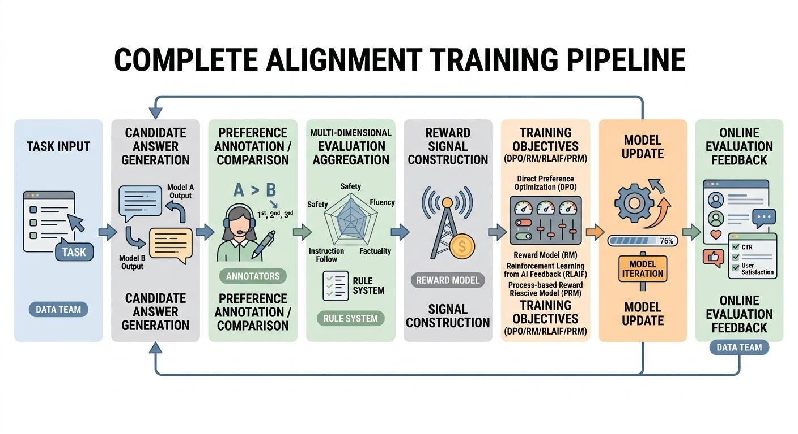
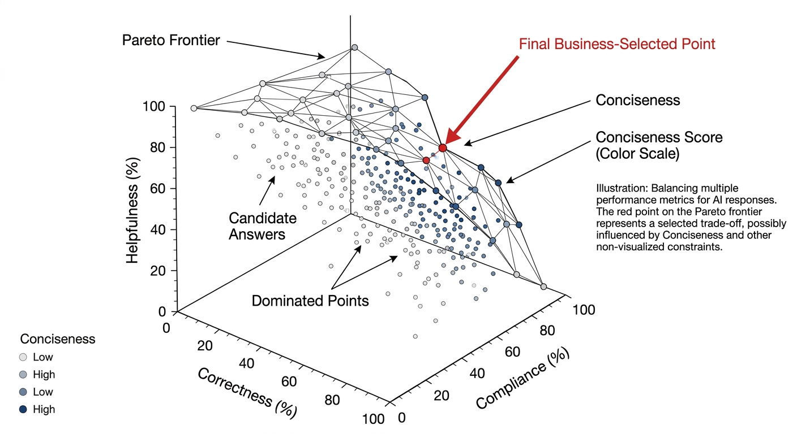

# 第13章 偏好数据与奖励信号

在大模型完成监督微调（Supervised Fine-Tuning, SFT）之后，很多团队会进入一个新的阶段：模型已经基本具备任务执行能力，能够理解指令、生成结构化答案、模仿业务语气，也能在多数常见场景中给出“看起来像样”的回答。但只要真正把模型放到业务环境中，就会很快暴露出另一个更棘手的问题：模型虽然会回答，却不一定会稳定地做出组织想要的那种选择。

这里所谓“选择”，并不是指模型在搜索空间中选取哪一个 token 这样底层的采样行为，而是指它在多个都“基本正确”的表达路径中，会偏向什么样的风格、遵循什么样的价值排序、优先满足哪些目标、在目标冲突时怎样权衡。一个没有经过偏好对齐的模型，可能在事实层面并无大错，但会表现出啰嗦、迎合、保守、含混、过度自信、过度模板化、风险边界松动，或者业务口径前后不一致等问题。它并不是不能用，而是不能被稳定地、规模化地、放心地使用。

也正因为如此，偏好数据与奖励信号才会在模型生命周期中占据独立位置。它们的任务不是教会模型“世界上有什么知识”，也不是教会模型“任务的标准答案是什么”，而是进一步规定：在多个候选行为都可以成立的情况下，什么更值得鼓励，什么必须被压低，什么在普通场景下可接受、但在高风险场景下不允许，什么虽然讨用户喜欢、却不符合业务规范。换句话说，偏好学习不是在补充知识，而是在塑造价值排序。

对负责数据设计、标注规范、训练接口与上线治理的团队来说，这意味着偏好数据不能被视作 SFT 数据的简单延伸。SFT 更像是在规定模型“会做什么”，偏好数据则是在规定模型“做这些事时，以什么方式做、优先满足谁、如何处理冲突、何时应该停下”。前者主要解决可用性，后者进一步解决可控性、一致性与组织适配性。很多团队在做完 SFT 后，会觉得模型已经“差不多可以了”；而真正成熟的团队会意识到，偏好阶段才是把抽象业务要求、风险边界和品牌风格转译成训练信号的关键工程环节。

本章面向需要把偏好学习从概念真正落到数据构造与训练接口的团队成员，系统讨论偏好数据的角色、偏好对与奖励模型的关系、过程奖励的设计、多目标偏好的聚合与 Pareto 权衡、偏好来源与监督模式、噪声与一致性治理，以及这些数据如何映射到 DPO、RM、RLAIF、PRM 等训练方法。我们尤其强调一个核心观点：偏好学习并不是“多做一轮人工反馈”，而是在显式构建一套组织级的行为排序系统；奖励信号也不是训练时顺手加上的评分，而是把这套排序系统正式转换为模型可学习目标的关键接口。

## 13.1 偏好数据的角色

### 偏好数据为什么决定模型的行为风格

如果说 SFT 是在告诉模型“应该怎么回答”，那么偏好数据真正决定的是“当存在多个可回答方案时，模型更倾向于哪一种回答方式”。很多团队最初容易低估这一点，因为从表面上看，SFT 样本里也有风格，也有措辞，也有业务规则，似乎只要把参考答案写得足够好，模型自然就会学会偏好的行为方式。但实际情况并非如此。

SFT 的本质是模仿单个目标输出。它鼓励模型在给定输入下逼近参考答案，从而形成“什么像正确答案”的分布偏好。然而，真实世界里大量场景并不存在唯一答案。对于同一个问题，可能同时存在一个更简洁的答案、一个更完整的答案、一个更谨慎的答案、一个更鼓舞用户的答案、一个更强调边界的答案。它们都可以自洽，但组织未必会一视同仁。真正决定行为风格的，不是模型能不能写出这些不同类型的答案，而是在这些答案之间，它更容易走向哪一边。

行为风格往往不是某一句模板、某个语气词或者某条规定直接决定的，而是在大量局部选择中逐渐固化出来的统计结果。一个模型被用户感知为“专业”，往往不是因为它总说“以下从专业角度分析”，而是因为它在大量边界场景中更倾向于保留不确定性、解释依据、说明限制条件；一个模型被感知为“有帮助”，也不是因为它机械地补充更多信息，而是因为它更频繁地优先给出任务完成所需的关键步骤，而不是背景铺垫。也就是说，风格是一个排序结果，而不只是一个表面特征。

从数据构造角度看，偏好数据决定行为风格，至少通过四个层面起作用。首先，它定义了比较维度。团队是否要求优先考虑真实性、帮助性、礼貌性、可执行性、合规性、简洁性，这些维度一旦被纳入偏好判断，模型就会逐步对其形成响应。其次，它定义了这些维度之间的优先级。例如在高风险任务中，正确性和边界声明必须压过自然和流畅；在营销类场景中，品牌一致性可能又比开放式发挥更重要。再次，它定义了冲突时的取舍方式，即当两个候选输出各有优劣时，谁应当获胜。最后，它定义了组织能够接受的波动范围：哪些风格差异只是可选表达，哪些则是必须消除的不稳定行为。

可以说，偏好数据真正把抽象的“行为风格”变成了训练可见的局部比较事实。只有当这种比较被系统化地、大规模地构造出来，模型才会把“什么叫更像我们想要的回答”学成参数中的稳定偏置。没有偏好数据时，模型只能在 SFT 的模仿空间中寻找近似；有了偏好数据之后，模型才开始形成明确的选择倾向。因此，偏好数据不是训练流程中的装饰性模块，而是风格塑形的核心接口。

进一步看，偏好数据之所以重要，还因为它把“组织希望模型成为什么样”这件事，从抽象口号变成了可执行的监督结构。很多团队会说，希望模型“专业、可信、自然、稳健、能落地”，但如果这些要求不被拆进候选比较与标注规则中，它们最终只会停留在会议语言层面，而不会真正进入参数更新过程。模型看不见口号，它只能看见训练样本中的局部胜负关系。谁赢、为什么赢、在什么场景下赢，这些比宏观愿景更直接地决定模型行为。

### 偏好数据如何把抽象价值转成训练信号

偏好学习真正解决的问题，并不是简单地收集更多“用户喜欢”的样本，而是把原本模糊的价值判断转化为可以进入训练的监督形式。对于一个组织而言，很多要求看上去都很合理，比如“要谨慎”“要礼貌”“要有边界”“要帮助用户完成任务”，但这些要求只有在具体样本中落到可比较的候选输出上，才会从抽象规范变成训练信号。

例如，团队说“模型要更稳健”，这本身并不是一个可直接训练的标签。只有当同一个输入下，候选 A 选择给出肯定判断，而候选 B 明确说明证据不足、限制条件和建议范围，并且标注系统持续把 B 判为更优时，“稳健”才被转译成了参数可感知的排序偏差。同理，团队说“模型要更帮助用户”，也不是单纯意味着多写一点，而是要通过大量比较让模型学会：在什么场景下优先给步骤，在什么场景下优先给结论，在什么场景下先界定问题再展开解释。

从这个意义上说，偏好数据的核心价值并不只是“筛出更好的回答”，而是把组织的隐性价值函数显式化。它迫使团队回答一系列此前可能被回避的问题：当正确性与自然度冲突时，谁优先；当安全边界与用户体验冲突时，谁优先；当完整性与简洁性冲突时，谁优先。偏好学习不是在发明这些冲突，而是在逼迫系统正视这些冲突，并用数据结构把它们固定下来。

### 行为风格的稳定性为何依赖偏好分布

模型的行为风格之所以会稳定，不是因为某一条规则被记住了，而是因为大量偏好样本在统计意义上形成了方向一致的监督分布。也就是说，风格不是由单个样本决定的，而是由样本群体反复强化出来的总体趋势决定的。

这件事和知识学习不太一样。知识类问题里，某个事实记住了就是记住了，没记住就是没记住；但风格类行为更像是在一片模糊空间里逐渐被“推”向某个方向。模型不会因为见过一句“高风险场景下应先说明限制条件”就自动把这种习惯迁移到所有相关任务中，它真正学到的，往往是在哪些表达方式、哪些回答结构、哪些语气选择上更容易得到正向反馈。换句话说，风格不是靠背规则形成的，而是靠反复经历相似取舍形成的。

假设团队希望模型在高风险场景中始终先说明限制条件，再给出建议。如果这类样本只在训练集中零散出现，模型很可能只是在少数相似输入上复现这种行为，而无法把它泛化为稳定风格。只有当这种偏好在不同主题、不同表达、不同难度层次的样本中被持续重复，模型才会把它学成更深层的行为倾向。反过来说，如果训练集里一半样本奖励谨慎表达，另一半样本又奖励强势肯定，模型最终学到的就不是一种清晰风格，而是一种不稳定的混合策略。

这种不稳定往往不会以特别显眼的方式出现。它不一定表现为明显出错，更常见的情况是：有时候谨慎，有时候武断；有时候先交代边界，有时候直接下判断；有时候语气克制，有时候又突然显得过于自信。单看某一条回答，似乎都还能解释过去，但只要把这些回答放在一起看，就会发现模型没有形成统一的行为重心。对于真实产品而言，这种“偶尔对、偶尔像样、但整体不稳”的状态，往往比单纯的内容错误更难处理。因为它削弱的是用户对系统整体行为的预期，而不是某一个点状问题。

偏好分布之所以重要，还因为风格本身往往不是单一维度，而是多个维度共同作用的结果。谨慎、简洁、礼貌、结构清楚、证据导向、不过度承诺，这些看起来都像独立要求，但在训练里它们常常会相互影响。比如一条答案可能因为“更全面”而被偏好，但这份全面到底是在强化有帮助，还是在鼓励冗长；一条答案可能因为“更坚定”而被选中，但这种坚定到底是在强化清晰，还是在纵容过度确定；一条答案可能因为“更有温度”而胜出，但这种温度到底是在提升体验，还是让边界变得松散。偏好分布设计得不清楚时，模型最后学到的就可能不是团队真正想要的风格，而是一些互相牵扯、方向暧昧的折中习惯。

所以，偏好样本最怕的不是数量少，而是方向杂。样本多而方向不稳，模型学到的往往只是“在不同情境下随机抽一种说法”；样本未必特别多，但方向持续一致，模型反而更容易形成稳定的行为倾向。很多团队在偏好学习中会有一种错觉，以为只要把喜欢的回答多写几条、多比较几轮，风格自然会出来。实际更关键的，常常不是“多写”，而是“同一种取向有没有在不同样本里被稳定重复”。如果这一点做不到，模型看到的就只是零散偏好，而不是可以归纳的风格模式。

拿高风险回答来说，真正有效的偏好分布，通常不是只在极少数典型危险问题上要求模型谨慎，而是要把这种取向扩展到一整片相邻场景里。法律问题里信息不足时要保留条件，医疗问题里症状不清时要先分流，金融建议里证据不充分时要避免过度肯定，企业内部制度问答里权限不清时要先说明适用范围。它们表面上属于不同任务，背后却在共同强化一件事：当信息不足或风险较高时，模型不应急于给出看起来完整的结论，而应优先交代边界、前提和限制。只有这种跨主题、跨表达、跨任务的重复足够多，模型才会逐渐把“先稳边界”学成一种默认动作，而不是某几个题型里的例外习惯。

反过来，如果团队在不同数据来源中没有统一这种偏好，问题就会很快出现。比如安全团队偏好保守表达，运营团队却更喜欢“有结论、够直接”的回答，业务团队又担心过度保守影响用户体验，于是在不同批次数据里分别强化了不同取向。这样做的结果，通常不是模型学会平衡，而是模型学会摇摆。它有时像安全助手，有时像营销文案，有时又像一个怕担责的问答机器人。表面上看，好像每种样子都有一点，实际上却缺少一个稳定中心。

因此，偏好学习中的“分布设计”非常关键。团队不仅要关心单个偏好标签对不对，还要关心整批偏好数据在统计上是否一致、是否覆盖关键冲突场景、是否把组织真正关心的维度放到了足够高的样本占比上。行为风格的成型，本质上是一种分布后果，而不是若干金句的叠加。

进一步说，偏好分布真正塑造的，不只是模型“喜欢怎么说”，更是模型“默认先顾什么”。有的分布会把模型推向先给结论，有的分布会把模型推向先讲依据；有的分布会让模型更愿意补足信息，有的分布会让模型更倾向于承认不确定；有的分布鼓励主动安抚和延展，有的分布则强化简洁和克制。模型最后形成的风格，并不是靠某一轮训练中谁说得最漂亮，而是在大量类似选择里慢慢形成了稳定偏向。这个偏向一旦成形，才会在新问题、新表述、新场景里表现出“像同一个系统在说话”的一致性。

所以在偏好数据建设里，真正需要防的不是某几条标签偶尔判断失误，而是整体分布悄悄偏掉。只要分布方向是散的、矛盾的、互相打架的，模型就很难形成清楚风格；只要分布方向是稳定的、持续的、跨场景复现的，哪怕单条样本没有那么“精彩”，整体上也更容易把模型推成一个行为一致的系统。风格稳定，说到底不是一句话教出来的，而是一整个样本分布慢慢压出来的。

### SFT 后为什么仍然需要偏好对齐

一个常见误解是：只要 SFT 数据足够丰富、答案足够高质量，偏好对齐似乎就不是必需的。这个判断听起来合理，因为高质量 SFT 数据确实可以显著改善模型的帮助性和格式稳定性。然而，从训练目标的性质来看，SFT 仍然无法替代偏好对齐，原因在于二者回答的问题不同。

SFT 主要回答“模型应该学会产出什么”，它通过教师信号把一组输入映射到一组被认可的参考输出，从而让模型掌握任务结构、领域知识、格式模板和语义模式。偏好对齐则在处理另一个层面的问题：当多个候选输出都能通过 SFT 的“像参考答案”标准时，模型究竟该偏好哪一个。这个差异在开放生成任务里尤其明显。SFT 可以让模型学会答题，但它通常很难系统性地压低那些“看起来也合理、但不符合组织偏好”的答案类型。

例如，在很多问答和助手场景里，SFT 后的模型常常会出现“过度帮助”的倾向：它努力填满每一个回答，把自己能想到的内容全都塞进去，结果导致关键建议被淹没在冗长铺垫里。又例如，模型可能会学会一种“假装确定”的回答习惯，因为在许多训练样本中，流畅自信的表达看起来更像一个完整参考答案，但在线上场景里，这种风格会带来事实风险和合规风险。再比如，SFT 可以教会模型在一般情况下用礼貌方式回答，却不能稳定地教会模型在高风险请求出现时立刻切换到边界更清晰、语气更规范的模式。

根本原因在于，SFT 本质上是点对点模仿，而偏好对齐是候选间排序。前者擅长建立任务能力，后者擅长塑造价值顺序。很多在 SFT 中不容易表达的问题——比如“这个答案虽然没错，但比另一个答案更冗长”“这个答案虽然信息全，但边界声明不够”“这个答案虽然自然，但给人过度承诺的感觉”——都更适合通过偏好比较来表达。因为这些问题的本质不是绝对对错，而是相对优劣。

此外，SFT 很难稳定表达目标冲突。真实业务不是单一维度优化，而是多个目标同时存在：帮助性与安全性、完整性与时延、解释性与简洁性、个性化与制度化、友好性与责任边界。SFT 样本当然可以隐含这些取舍，但它通常无法让这种取舍在整个数据集中形成稳定、可度量、可回溯的结构。而偏好对齐恰恰能把这些冲突显式化：让标注员在同一输入的多个候选输出之间进行比较，并给出偏好依据，团队由此才能看见自己真正的价值排序。

因此，SFT 后仍然需要偏好对齐，并不是因为 SFT 做得不够好，而是因为它天生不负责解决排序问题。一个成熟的训练管线不是把偏好学习视作对 SFT 的修补，而是把它看成 SFT 之后必然出现的下一层行为塑形机制。SFT 解决“模型能不能做”，偏好对齐解决“模型更倾向怎么做”，而在可部署系统中，后者往往直接决定用户体验和业务可控性。

### SFT 擅长教会能力，偏好对齐擅长决定取舍

如果把模型训练过程做一个功能分层，那么 SFT 更像是在建立基础技能库，而偏好对齐更像是在建立调度原则。SFT 让模型具备回答问题、总结信息、调用知识、遵循格式、模仿领域表达等能力；偏好对齐则进一步规定，在这些能力都具备的情况下，模型应该优先动用哪一种能力组合。

这两者最大的区别，不在于一个“教内容”、一个“教风格”这么简单，而在于它们作用的位置不同。SFT 更接近“把工具放进工具箱”这一步。模型通过大量监督样本，逐渐学会有哪些任务形态、有哪些常见输出方式、哪些表达是合规的、哪些结构是系统能接住的。它解决的是“会不会”的问题，也就是模型有没有形成某种基本能力接口。可一旦这些能力都具备了，真实系统面对的问题很快就会变成另一类：在当前场景下，模型到底该偏向哪一种回答方式，先保什么，再舍什么，哪里该展开，哪里该收住，哪里该果断，哪里该保留条件。这个层面的事情，更多就不是 SFT 自动能决定的了。

例如，一个模型既能写长答案，也能写短答案；既能强势建议，也能谨慎保留；既能偏流程化，也能偏陪伴式。SFT 让它“都会”，但并不自动决定它“更常选哪一种”。而真实上线系统最怕的，往往不是模型不会，而是模型会但选错。也正因如此，偏好对齐在工程中的地位非常像“策略层”而不是“知识层”。

这种“会但选错”的问题，在离线测试里往往不那么显眼。因为很多离线评测更容易看出模型有没有答到点上、有没有覆盖关键信息、有没有按格式输出，却不一定能充分暴露它在多种可行答案之间的取舍倾向。比如一条回答内容上没有明显错误，也符合基本要求，但它可能过于冗长，把本该一句说清的内容讲成三段；也可能太快给出肯定判断，把本来应该先说明前提的地方压过去了；也可能语气过分热情，在高风险或高严肃度场景里显得轻浮。这些问题不是能力空白，而是优先级排序出了偏差。

从这个角度看，SFT 更像是在回答“模型应该掌握哪些动作”，而偏好对齐更像是在回答“在这些动作都可用时，哪一个应该成为默认动作”。这也是为什么同一个基础模型，在经过不同的偏好数据塑形之后，最后会呈现出非常不同的系统气质。有的模型明显更克制，有的模型更主动，有的模型倾向先给结论，有的模型习惯先交代条件，有的模型偏向服务感很强的陪伴式表达，有的模型则更像一个冷静、精炼的专业助手。它们并不一定是能力差距特别大，很多时候差别主要就出在“默认怎么选”。

这件事在工程里尤其重要，因为产品体验里的很多“好不好用”，本质上并不由能力上限决定，而由默认取舍决定。一个企业客服助手，如果总是喜欢把简单问题回答得很长，或者每次都先讲背景再给操作步骤，用户很快就会觉得它效率低。一个医疗助手，如果面对信息不完整的症状描述时总想先补成一个完整答案，而不是先分流风险、先问关键症状，它哪怕知道很多医学知识，也仍然不安全。一个法务助手，如果在材料不足时总忍不住往“像结论”的方向说，它即便会引用法条，也还是不稳。这里的问题都不是“模型不懂”，而是“模型的默认倾向不对”。

这也是为什么很多团队会出现一种错觉：模型明明在离线能力测试里已经不错了，但一上线却依然显得啰嗦、不稳、过度热情、过度保守或者边界模糊。原因往往不是能力不足，而是取舍机制没有被充分塑形。偏好学习介入的，恰恰就是这一步。

偏好对齐真正处理的，往往不是“能不能做到”，而是“在多个都能做到的选项里，哪一种更值得被反复选中”。例如，面对用户追问，模型可以继续扩写，也可以先做压缩总结；面对不确定信息，它可以尝试补全，也可以先明确说明限制；面对情绪化用户，它可以偏安抚，也可以偏流程推进。SFT 给了模型这些可能性，偏好对齐则在大量比较信号里不断告诉它：在我们的产品语境里，哪一种更可取，哪一种即便也说得通，但不应该成为默认路径。

进一步说，偏好对齐的作用并不只是把模型“调得更顺眼”，而是在给模型建立一种稳定的决策重心。没有这个重心，模型就很容易在不同输入、不同上下文、不同措辞下表现出摇摆感。今天偏简洁，明天又突然铺得很开；这次很谨慎，下次却又下结论下得很快；一轮对话里很专业，另一轮又突然变得过度亲密。用户未必说得清问题出在哪里，但会明显感觉这个系统“没有一个固定脾气”。偏好对齐要解决的，就是把这种摇摆慢慢压成一种可预期的行为取向。

所以，如果说 SFT 主要是在扩大模型“能做什么”的范围，那么偏好对齐更像是在收紧模型“通常会怎么做”的范围。前者解决的是能力底盘，后者解决的是策略一致性。没有 SFT，模型很多动作根本学不会；没有偏好对齐，模型虽然什么都会一点，却很难长期表现得像同一个系统。真正可部署的模型，往往不是因为某一项能力特别夸张，而是因为它既具备足够的能力面，又在取舍上形成了清楚、稳定、符合场景的默认方向。

从团队协作的角度看，这种分工也很有价值。SFT 阶段更适合解决任务覆盖、格式规范、领域表达、基础能力接口这些问题；偏好阶段则更适合处理简洁与完整、积极与克制、效率与安抚、确定性与保留条件之间的平衡。两者如果不分开看，团队就容易把所有问题都压到 SFT 身上，最后既想用 SFT 教会模型一切，又想靠 SFT 顺便决定所有行为偏好，结果往往是样本越来越杂，训练目标越来越混，模型既没有把能力练扎实，也没有把取舍磨稳定。

也正因为如此，判断一个问题该放在 SFT 还是偏好阶段处理，关键要看它到底属于“不会”，还是属于“会但老是选得不对”。前者更像能力问题，后者更像策略问题。把这两类问题分清之后，整个后训练流程才会变得更有层次：先让模型具备足够多、足够稳的能力接口，再通过偏好对齐把这些能力组织成更符合产品目标的行为顺序。到了这一步，模型才不只是“能回答”，而是真正开始“会以你希望的方式回答”。

### 人类偏好与业务偏好的重叠和冲突

在偏好学习讨论中，“人类偏好”常常被当作一个天然合理的目标，好像只要收集人类喜欢哪个答案，模型就会自动变得更好。但对于企业级或任务型系统而言，真正需要建模的通常不是一个单一、纯粹的“人类偏好”，而是多种偏好来源的叠加：普通用户的交互偏好、专家的专业判断、业务方的组织目标、风险与合规部门的底线要求、产品设计对体验节奏的要求、品牌团队对话术和语气的一致性要求。它们之间有很大重叠，但绝不完全相同。

重叠之处通常比较直观。无论是用户、业务方还是风控部门，大多都希望模型的回答是正确的、清楚的、不胡编的、能解决问题的。这些构成了偏好学习里最容易达成共识的一层，也是帮助性、真实性、可理解性等通用维度的来源。但一旦进入更细的行为排序，就会出现明显冲突。

用户偏好往往偏向自然、及时、少限制、少拒绝、表达像真人、语气有温度、甚至适度“替我做决定”。业务偏好则常常要求边界更清楚、承诺更克制、信息更可审计、表达更统一。有些产品场景里，用户可能喜欢模型给出明确建议，即便证据并不充分；而业务方则要求模型必须暴露不确定性，不允许在证据薄弱时做强判断。还有一些场景中，用户更喜欢“像朋友一样”的对话，而企业服务则要求模型保持正式、稳健、可归责。前者强调亲近感，后者强调制度边界。

这说明，偏好数据构造不能建立在“让标注员凭直觉选择喜欢的答案”这种粗糙假设上。偏好必须被拆解成可以讨论、可以量化、可以复核的组成部分。否则，所谓“收集偏好”最终只会把标注员个人习惯、短期体验和表面风格混到一起。真正成熟的偏好系统，需要把“人类喜欢什么”和“组织允许什么”“业务最优化什么”放到同一张图里，并显式处理它们的重叠与冲突。

也正是在这里，**Pareto 权衡** 变得非常重要。对于多目标系统而言，团队追求的往往不是一个单维最优点，而是一组在不同目标之间达到合理平衡的可接受解。例如，一个回答可能在礼貌性和可读性上非常高，但在边界声明上偏弱；另一个回答可能非常稳健，却显得机械。业务真正要做的，不是抽象地说哪一个“更好”，而是依据场景判断：对于这类任务，我们更愿意牺牲一点自然感，换取更高的安全和一致性；对于另一类任务，我们则愿意给模型更大的表达自由。偏好数据的作用，正是把这种策略从口头讨论转变为可训练的排序证据。

### 为什么“用户喜欢”不能直接等于“系统应学”

在很多轻量讨论里，偏好学习常被简化为“收集用户更喜欢哪个答案”，但真正的系统设计中，这句话往往是不成立的。用户当下喜欢一个答案，可能是因为它更顺耳、更果断、更像真人、更快给出结论，也可能只是因为它迎合了用户已有立场。但系统训练所需要的，不只是“即时满意”，而是“长期可用、可控、可审计”的行为模式。

这两者有时一致，有时并不一致。例如在健康、法律、金融、教育、企业制度等场景里，用户可能偏好确定性更强的回答，但系统却必须奖励暴露不确定性、提示适用边界和建议进一步求证。再例如，用户可能偏好少拒绝、少提醒、少免责声明的体验，但对于高风险请求，组织又必须要求模型保留足够强的边界控制。也就是说，用户体验是偏好来源之一，但不是偏好定义的全部。

因此，一个成熟的偏好体系必须先区分“体验偏好”“专业偏好”“合规偏好”“品牌偏好”和“业务偏好”，再决定它们如何被聚合。否则，所谓“以用户为中心”最终可能演变成“以短期主观满意为中心”，而这恰恰会损害系统长期稳定性。

### 业务偏好如何进入标注规范

业务偏好如果不进入标注规范，就很难进入训练。很多组织在讨论偏好学习时，容易把业务要求停留在原则层面，例如“更符合品牌调性”“更像专业顾问”“更稳健但不机械”。这些要求当然重要，但它们需要继续向下拆分为标注时可操作的判断规则。

例如，“更符合品牌调性”可以拆解为：是否避免过度口语化，是否保持统一称谓，是否避免夸大式承诺，是否维持固定的回应结构；“更像专业顾问”可以拆解为：是否说明判断依据，是否暴露不确定性，是否给出条件限制，是否避免替用户做无依据决策；“更稳健但不机械”则需要进一步拆成边界声明与表达自然度两个维度，并明确冲突时的优先关系。

也就是说，业务偏好进入训练之前，必须先经历一次“数据化翻译”。谁负责翻译，如何翻译，翻译后如何被标注员理解并执行，这些都决定了偏好数据最终是不是可用。训练方法只是消费端，真正把业务目标转成监督结构的，是数据设计本身。




*图13-1：偏好数据到奖励信号流程图*

## 13.2 偏好对、标量奖励与过程奖励

### pairwise preference、scalar score、process reward 的定义

偏好学习经常被概括为“给模型反馈”，但如果站在数据工程视角，这种说法过于模糊。真正进入训练时，反馈必须以明确的数据结构存在，而不同训练方法可接受的反馈形态并不一样。对数据团队来说，首先要搞清楚的不是“我们要不要做人类反馈”，而是“我们准备用什么形式表达反馈”。在当前主流实践中，最核心的三类形式分别是偏好对、标量奖励和过程奖励。

**偏好对（pairwise preference）** 是最经典、也是目前最常用的一种形式。它的基本思想是在相同输入条件下生成两个或多个候选输出，然后由人类、模型或规则系统判断哪一个更好。最典型的数据结构可表示为：

`(x, y_w, y_l)`

其中，`x` 表示输入，`y_w` 表示胜出的回答，`y_l` 表示落败的回答。这里的“胜出”并不意味着绝对正确，而是表示在当前比较维度和当前任务上下文中更符合偏好。偏好对的最大优点在于，它避免了很多绝对打分中的尺度不一致问题。标注员未必能稳定判断一个回答值 3 分还是 4 分，但通常更容易判断在两个候选中哪一个更值得保留。也正因为如此，偏好对常常被视作低门槛、高鲁棒性的数据接口。

**标量奖励（scalar score）** 则是对单个输出赋予一个数值评分。它可表示为：

`(x, y, r)`

其中 `r` 可以是离散等级，也可以是连续值。标量奖励的直观性很强，尤其适用于需要训练**奖励模型（Reward Model, RM）** 的场景，因为 RM 的目标就是学习一个把输入与输出映射到实值分数的函数。从统一接口角度看，标量奖励还有一个优势：它更方便后续分析、排序、切阈值和多系统共享。然而，它也更容易引入评分漂移与尺度偏差。不同标注员对“4 分”和“5 分”的理解未必一致，不同任务池中的高分密度也可能不同，因此标量奖励在采集、校准和归一化上往往要付出更多治理成本。

**过程奖励（process reward）** 则针对的是另一类问题：有些任务的价值并不只体现在最终答案上，而体现在模型通向答案的过程中。对于这类任务，仅仅给最终结果打分往往不够，因为错误可能发生在中间步骤，且这些中间错误有时会被最终表面正确所掩盖。过程奖励的结构可以抽象为：

`(x, {s_1, s_2, ..., s_t}, {r_1, r_2, ..., r_t})`

这里 `s_i` 是中间步骤、推理片段、工具调用动作或局部决策状态，`r_i` 是对应步骤的局部奖励。过程奖励最适合长链推理、多工具调用、复杂执行规划、代码生成、Agent 工作流等任务，因为这些任务的成败并不仅由终态决定，而高度依赖中间行为质量。

从数据系统角度看，这三种信号的区别并不只是“存储格式不一样”，而是它们在表达偏好时各自承担不同功能。偏好对更擅长表达相对排序；标量奖励更适合形成统一评分层；过程奖励则把反馈从终态拉回到中间过程。团队应当根据任务性质、标注能力和训练目标选择合适接口，而不是把“奖励”理解成一个单一概念。

进一步说，这三者还对应了三种不同的问题意识。偏好对更适合回答“这两个输出哪个更该被保留”；标量奖励更适合回答“这个输出总体质量大概处于什么水平”；过程奖励更适合回答“这个输出是通过怎样的路径得到的，路径本身是否值得鼓励”。如果团队连问题意识都没有区分清楚，就容易出现一种常见情况：一边想解决复杂长链行为问题，一边却只采集整体满意度式标签，结果训练目标与任务结构根本不匹配。

**代码示例：三类偏好/奖励信号的最小数据格式（JSONL）**

同一条任务输入 `x`，可以用不同“反馈接口”记录监督信号。下面给出三种最小可用结构，便于落地到数据管线与标注平台。

```json
{"type":"pairwise","prompt":"用户：请用三句话解释什么是DPO。","winner":"（更简洁且覆盖关键点的回答）","loser":"（更啰嗦且偏离重点的回答）","meta":{"task":"explain","dims":["helpful","concise"],"source":"human"}}
{"type":"scalar","prompt":"用户：请总结下面这段制度说明……","response":"（候选回答）","score":4,"meta":{"task":"summary","rubric":"v1","rater":"r_1027"}}
{"type":"process","prompt":"用户：把这个问题拆成三步并完成检索。","steps":[
  {"state":"提出检索问题","output":"（step1文本）","reward":1},
  {"state":"选择工具与参数","output":"（step2工具参数）","reward":0},
  {"state":"整合证据并回答","output":"（step3最终回答）","reward":1}
],"meta":{"task":"rag_agent","unit":"step"}}
```

### 三类奖励信号分别适合什么任务

从任务类型来看，偏好对、标量奖励与过程奖励并不存在绝对优劣，它们更像是适合不同问题层次的三种接口。

偏好对尤其适合开放式生成、风格优化和相对取舍明显的任务。例如问答回复、摘要重写、邮件改写、拒答模板优化、客服话术选择、品牌表述统一等。这类任务中，团队真正关心的通常不是“这条回答值多少分”，而是“在几个可接受答案里我们更想保留哪一种”。因此，用偏好对来表达相对优劣往往最自然。

标量奖励更适合需要统一排序和跨系统共享的场景。例如团队希望建立统一的候选评分器，对不同版本模型输出做排序，对线上回流样本做粗筛，对自动生成数据做质量控制，或者在多个任务之间共用一层奖励接口时，标量奖励的价值会更明显。它的优势不一定在初次标注上，而在后续平台化复用上。

过程奖励则适合那些“结果对了还不够，路径也必须对”的任务。例如复杂推理、RAG 检索规划、Agent 工具调用、代码修复、多步表单操作、工作流编排等。这些任务的关键问题，不是单纯最终输出是否可用，而是中间步骤是否稳定、可解释、可迁移、可审计。此时只对终态做奖励，很可能把真正的风险藏起来。

### 直接偏好优化与奖励建模的数据要求

当偏好数据真正进入训练方法时，最常见的两条路线分别是**直接偏好优化（DPO）**和**奖励建模（RM）**。这两条路线都依赖偏好数据，但它们对数据质量、数据格式和治理重点的要求并不完全相同。很多团队之所以在偏好学习阶段走弯路，很大程度上是因为没有先想清楚：我们的训练方法到底要消费什么样的数据。

DPO 的优点在于路径直接。它通常不要求先单独训练一个显式奖励模型，而是直接利用偏好对，让模型在参数更新过程中提高获胜答案相对于失败答案的相对概率。换句话说，DPO 将“我们更喜欢 A 而不是 B”直接转化成训练目标。因此，对于 DPO 来说，最关键的数据资产就是高质量的偏好对。这里的关键不在于“每个答案到底值几分”，而在于比较关系是否可靠。只要胜负关系稳、候选质量有区分度、标注规则一致，DPO 往往就可以有效工作。

这意味着，数据团队在服务 DPO 时，重点应该放在候选生成机制、难例覆盖、胜负关系一致性和比较标准清晰度上。比如，若候选之间差距总是过大，DPO 学到的只是区分“明显好坏”的能力，难以适应线上那些细微却重要的风格差别；若候选之间差距总是过小，而规范又不明确，则会导致标注分歧，削弱训练信号。DPO 看似省去了一层奖励模型训练，但实际上对成对样本的构造质量要求非常高。

而 RM 路线则试图先学得一个“评分器”。它希望模型不仅知道在 A 和 B 之间谁更好，还能对单个输出进行较稳定的质量估计。这类方法对数据的要求往往更高，因为它要求信号在某种程度上具有跨样本可比较性。即便起始数据是偏好对，团队通常也需要思考如何让这些相对比较足以约束一个稳定的评分函数。如果直接使用标量奖励，则更需要解决评分尺度不一致、任务分布不均衡、时间漂移等问题。

RM 的好处是，一旦训练出一个表现可靠的奖励模型，它就可以被复用于多种环节：候选排序、离线评估、策略优化、在线监控、模型互评辅助等。从平台化建设角度看，RM 更像是搭建了一层统一的“奖励接口”。但正因如此，它对数据体系的要求也更严。团队不能只关心谁赢谁输，还要关心为什么赢、赢了多少、不同场景中的分数是否可比、维度冲突如何聚合等更复杂的问题。

从工程实践看，如果团队当前最成熟的资产是大规模偏好对，并且目标是快速把模型行为拉向更优风格，那么 DPO 通常是更顺手的入口；如果团队希望建立一套长期可复用的奖励基础设施，让不同模型、不同训练阶段、不同评测环节共享同一套奖励表征，那么 RM 的价值会更高。但无论哪条路线，真正的前提都不是“收集更多反馈”这么简单，而是先把偏好定义、候选生成、评分维度、噪声治理和版本管理这些数据基础工作做扎实。

### DPO 更依赖“比较质量”，RM 更依赖“尺度稳定”

从数据治理角度，可以把 DPO 和 RM 的差异理解得更直白一些：DPO 更怕比较关系不稳定，RM 更怕评分尺度不稳定。

对于 DPO 而言，只要同一输入下的候选胜负关系足够清楚，很多问题都是可处理的。它并不太关心某个回答究竟是 8 分还是 9 分，而更关心在 A 和 B 之间，标注系统能不能持续一致地把更优的一方选出来。因此，DPO 的主要风险在于候选构造不好、难度分布失衡、胜负依据模糊、标注员标准不一。

而 RM 由于要学一个跨样本可泛化的评分函数，就必须面对另一个问题：不同样本、不同时间、不同标注员给出的分数能否被视作同一坐标系上的量。如果不能，奖励模型学到的就不是质量函数，而是混杂了人员差异、时间差异和任务分布差异的噪声函数。所以 RM 往往对校准、标准化、来源标记和分层建模要求更高。

这也是为什么很多团队会先用偏好对做 DPO 快速起步，再逐步建设更复杂的 RM 体系。前者解决“先把方向拉对”，后者解决“建立统一奖励基础设施”。两者并非互斥，而是常常对应不同成熟度阶段。

### 候选构造为什么是奖励信号质量的前提

无论使用 DPO 还是 RM，一个经常被低估的问题都是候选构造。很多团队把重点都放在“标注是否准确”上，却忽视了标注之前最关键的一步：候选答案本身是如何生成出来的。如果候选池质量失衡，再严格的标注也只能学到低分辨率偏好。

例如，如果候选 A 明显优于候选 B，标注当然容易，但这种样本只能教会模型区分粗粒度优劣；如果候选 A 与 B 极其接近，而规范又未明确冲突维度优先级，则会导致高分歧样本增多，训练信号反而变得脆弱。更理想的情况通常是：候选之间存在真实且业务重要的差异，但差异又不是肉眼一看就完全集中在单个表面维度上。只有这样的样本，才能逼迫模型学会更细的行为取舍。

因此，候选构造其实是偏好学习的上游核心环节。候选从哪些模型来、差异如何控制、是否覆盖多种风格、是否包含边界冲突、是否刻意采集“看起来都可以但组织更偏向其一”的样本，这些都直接决定了后续奖励信号有没有信息量。

### 最终结果奖励与过程奖励的区别

很多团队在刚接触偏好学习时，会默认只对最终输出做判断：这个回答总体上好不好，这个答案是否值得鼓励。这当然是合理的起点，也是大量基础任务最自然的做法。但只要任务复杂度上升，团队很快就会发现：只看最终结果，往往会掩盖真正重要的问题。模型之所以危险，很多时候不是因为最后给出的文字明显错误，而是因为它是以不稳定、不可解释、不可迁移的过程得到这个结果的。

所谓**最终结果奖励**，本质上是把整个生成过程压缩成一个终态评价。它最适合那些终态可清楚判断价值的任务。例如摘要是否覆盖重点、分类结果是否正确、客服回复是否礼貌合规、拒答是否到位。这类任务中，结果本身就是主要价值载体，中间路径并非核心矛盾，因此只做终态奖励通常就足够有效。

但在许多复杂任务中，仅看终态会出现两种典型问题。第一种是“蒙对”问题。模型可能通过不可靠推理、跳步推理、错误工具调用甚至偶然猜中，最后给出一个正确结果。如果只奖励终态，模型并不会学到可靠的方法，只会强化“反正最后答对就行”的行为模式。第二种是“表面可用”问题。模型最终输出看似满足要求，但中间过程违反了某些重要原则，例如没有做必要检索、遗漏了证据校验、调用工具顺序低效、在关键节点过度自信，或者使用了不应暴露的中间假设。此时终态奖励会把这些风险全部遮蔽。

过程奖励的意义就在于，它把监督信号向前移动，让模型不仅为“做成什么”负责，也为“怎么做成”负责。对于推理类任务，过程奖励可以鼓励逻辑步骤完整、因果关系清楚、错误中间结论被及时修正；对于工具调用类任务，过程奖励可以鼓励先检索后回答、先校验再执行、参数完整再调用；对于代码生成或工作流编排类任务，过程奖励可以约束中间设计质量，而不是只看最终是否通过样例。

当然，过程奖励并不是免费的好处。它会显著提高数据构造难度。因为团队需要先定义“过程单元”是什么：是一句话、一步推理、一次工具调用、一个计划节点，还是一个子任务完成状态？然后还要定义什么叫“好过程”与“坏过程”，并设计可执行的标注规范。可以说，过程奖励把偏好学习从“答案比较工程”推进到了“行为分解工程”。但一旦团队进入长链任务、高价值任务或高风险自动化场景，这一步往往是迟早要走的。

### 过程奖励为什么更像“行为监督”而不只是“结果监督”

终态奖励关注的是模型交付了什么，过程奖励关注的则是模型是如何形成这些交付的。从这个意义上说，过程奖励更接近对行为本身的监督，而不仅是对结果的打分。它试图回答的不是“最后答得对不对”这一单一问题，而是“模型在通向这个答案的过程中，是否采取了可接受、可解释、可复用、可迁移的行动方式”。这使得过程奖励天然带有更强的行为约束意味，也更接近真实系统中对智能体进行管理和治理的需求。

这一区别在复杂系统里尤其关键。因为在很多自动化场景中，系统风险并不是出在结果字符串本身，而是出在形成结果的路径中。例如一个 Agent 最终完成了任务，但中间曾经进行了多余检索、错误参数调用、无证据推断或者高风险跳步，只是恰好没有在最终输出中暴露出来。如果只看终态，这种坏行为就会被默许；久而久之，模型会越来越倾向于走“侥幸但省力”的路径。对训练系统而言，这种路径依赖往往比单次答案错误更危险，因为它意味着模型在策略层面形成了不稳健的偏好：只要有概率蒙对，就没有动力去建立更规范、更可靠的执行过程。

从训练信号的角度看，终态奖励更像一种“事后验收”。任务做完之后，系统再根据最终答案或最终状态给出一个整体评价。这种评价当然有价值，因为很多任务最终还是要以外显结果来判断成败。但如果一个任务本身具有长链条、多阶段、强状态依赖的特征，那么单一的终态信号往往过于稀疏。模型在前面十几步里做对了什么、做错了什么，终态奖励并不会细致地区分。它只会把整条轨迹压缩成一个结果标签，然后再把这个标签反向传播给整条链路。这样一来，真正好的局部决策可能被错误终局一起惩罚，危险但侥幸成功的局部动作又可能随着成功结果一起被强化。

过程奖励试图解决的正是这种“信用分配失真”问题。它把监督从任务末端向中间状态展开，让系统能够对轨迹中的关键节点分别表达偏好。一个检索动作是否必要、一次工具调用是否合规、一个中间结论是否有证据支撑、一次任务切换是否发生了状态丢失，这些原本被终态奖励掩盖的行为特征，在过程奖励框架中都可以被显式纳入评价。这样，奖励不再只是“你有没有做成”，而变成“你是以什么方式做成，或者做砸的”。这会直接改变模型学习到的东西：它学到的不只是结果分布，更是行为分布。

因此，过程奖励的真正意义，不只是让模型把每一步都做得更漂亮，而是让系统把“可接受的行为路径”本身纳入监督范围。它会把偏好学习从“答案优化”推进到“策略优化”。在结果监督框架里，一个模型可能逐渐学会“什么样的回答更容易得分”；而在过程监督框架里，模型还必须学会“什么样的行动序列才是被允许、被鼓励、值得重复的”。前者更接近对输出的调形，后者则更接近对决策机制本身的塑造。

这种差别在 Agent、工具调用、多跳检索、代码执行等任务中尤为明显。因为这些任务并不是单步生成文本，而是在不断与外部环境交互，持续做出选择。在这种场景下，错误未必立即体现在最终文本中，很多时候它首先表现为行为层面的偏差：该查证时没查证，该停下时没停下，该调用安全接口时用了高权限接口，该要求确认时擅自推进流程。若训练系统无法对这些行为给予负反馈，模型就会逐渐形成“结果导向压倒过程规范”的执行习惯。一旦任务环境变得更复杂、反馈变得更延迟、容错空间变得更小，这种习惯就会迅速转化为系统性脆弱性。

进一步说，过程奖励还承担着“把隐性规范显性化”的作用。很多部署场景里，我们真正关心的并不仅是结果对错，而是过程是否符合组织要求、合规要求、风险要求和操作边界。例如金融问答中是否引用了可验证依据，医疗辅助中是否在不确定时表达保留，企业 Agent 是否遵循审批流程和权限边界。若只依赖终态奖励，这些规范往往只能作为模糊的整体偏好存在，模型很难稳定学到；而过程奖励则能把它们落到更具体的行为节点上，让“谨慎”“合规”“有依据”“不跳步”不再只是抽象口号，而成为可打分、可比较、可优化的中间行为特征。

当然，这并不意味着过程奖励可以取代终态奖励。很多任务最终还是要回到“有没有完成目标”这一终局判断。更准确的说法是，过程奖励补足了终态奖励的盲区。终态奖励负责告诉模型“什么结果值得追求”，过程奖励负责告诉模型“什么路径值得信任”。二者结合之后，训练系统才能同时优化结果有效性和过程可靠性。否则，一个只会追结果的模型，可能在静态评测中表现不错，却在真实环境中不断暴露出执行粗糙、行为冒险、策略不稳的问题。

从工程视角看，过程奖励之所以重要，正在于它让训练目标更接近部署目标。真实系统从来不是只验收最终输出，而是同样关心中间行为是否安全、稳健、经济、可解释。一个企业不会因为某个自动化系统“最后做成了”就忽略它中途越权操作、重复调用、错误读写、无依据决策的事实。同样，一个高质量的训练体系，也不能只奖励“碰巧答对”，而应逐步鼓励那些可复现、可审计、可泛化的行为方式。正是在这个意义上，过程奖励更像“行为监督”，而不只是“结果监督”的精细版本。

### 如何定义“过程单元”是过程奖励设计的第一道难题

过程奖励在概念上听起来很自然，但一落到数据构造就会遇到第一个核心问题：什么算一步？不同任务中，“过程单元”的划分方式会显著影响后续标注质量和奖励稳定性。

在推理任务中，过程单元可以是一条推理陈述、一个逻辑跳转、一个中间结论；在工具调用任务中，过程单元可以是一次检索动作、一次参数填写、一次 API 调用；在多步执行任务中，过程单元还可以是一个计划节点、一个子任务完成状态、一次状态转移。不同定义方式会让同一条任务链呈现出完全不同的监督粒度。

如果粒度过粗，过程奖励就会退化成终态奖励的近似版本；如果粒度过细，标注成本会急剧上升，且一致性更难保证。因此，过程奖励并不是简单地“多标一点中间步骤”，而是要先建立一套稳定的行为切分框架。没有这个前提，过程监督很容易变成高成本、低稳定度的数据工程。

### 多目标偏好、过程奖励与 Pareto 权衡

在真实生产系统中，偏好几乎从来都不是单目标的。一个模型可能同时被要求正确、帮助、有边界、简洁、稳定、符合品牌口径、低延迟、少幻觉、少拒答误伤，并在某些场景下提供足够解释性。问题在于，这些目标不会永远同步增长。很多时候，增强某个维度会天然牺牲另一个维度。偏好学习真正困难的地方，也正是在于这种多目标结构。

如果团队还停留在单一“总分”的思路里，就很容易出现两个问题。第一，多个目标被粗暴加总，导致团队不知道模型为什么变好了，也不知道它在哪个维度上变差了。第二，训练集里的冲突被平均掉了，模型学不到清晰的取舍策略，只能在模糊信号下形成不稳定行为。因此，在偏好数据设计中引入**多目标偏好**，不仅是更精细的做法，更是处理真实业务冲突的必要条件。

多目标偏好意味着团队不再只记录“哪个候选整体更好”，而是进一步保留多个评价维度上的判断信息。例如在一个企业问答场景里，候选答案 A 可能在帮助性和自然度上更优，但在边界清晰度上较弱；候选答案 B 可能更稳健，但略显僵硬。此时，单纯打一个总体胜负标签，会把冲突隐藏起来；而如果能同时记录各维度判断，就能为后续聚合策略、奖励模型训练和问题分析提供更高分辨率的信息。

这时，**Pareto 权衡** 就成为偏好学习中不可回避的概念。对多目标系统而言，并不存在唯一的“绝对最优答案”，而是存在一组在不同目标间互不支配的候选解，也就是 Pareto 前沿。位于前沿上的答案，通常意味着你如果想进一步提升其中一个目标，就必须在另一个目标上做出牺牲。对于数据团队来说，真正重要的不是消灭这种前沿，而是明确组织愿意落在哪个位置。也就是说，团队必须把“我们在什么场景下更愿意牺牲自然度换取稳健性”“在什么任务下更愿意牺牲一些简洁性换取更完整解释”这类问题正式写进偏好规范和数据接口。

过程奖励与多目标偏好天然具有耦合关系。很多目标并不只体现在终态，而体现在过程。例如“先证据后结论”是一种过程偏好，“高风险时先声明限制再给建议”是一种过程偏好，“调用工具前进行参数校验”也是过程偏好。也就是说，团队如果只在最终答案层面做多目标评分，却不记录过程中的局部优劣，就很难真正支撑复杂系统的 Pareto 权衡。因为很多关键目标压根就不在最后一句话里，而藏在生成路径中。

因此，从偏好学习的成熟度看，团队通常会经历一个逐步升级过程：先从整体偏好对入手，解决“总体上谁更好”；再引入多维评价，解决“为什么更好”；随后在复杂任务中加入过程奖励，解决“怎样才算以正确方式变好”；最终形成多目标、分层次、可解释的奖励信号系统。这也正是偏好学习从概念走向工程的关键标志。

**代码示例：多目标偏好标注的“维度化记录”**

当你不想被“总分”掩盖冲突时，可以在数据中同时保留维度标签与聚合策略（聚合策略可以在训练/采样阶段再决定，而不必在标注时一次性定死）。

```json
{
  "type": "pairwise_multi_dim",
  "prompt": "用户：我最近胸口有点闷，要不要吃药？",
  "candidates": {
    "A": "（更自然，但缺少风险分流与就医提示的回答）",
    "B": "（先做风险提示与信息澄清，再给一般建议的回答）"
  },
  "judgement": {
    "overall_winner": "B",
    "dims": {
      "safety_boundary": "B",
      "helpfulness": "B",
      "naturalness": "A",
      "conciseness": "A"
    },
    "reason_tags": ["高风险先分流", "信息不足先澄清"]
  },
  "meta": {"scenario":"medical","risk_level":"high","policy":"medical_v2"}
}
```

### 多目标偏好不能只靠“总分”掩盖冲突

很多团队在设计偏好数据时，会想用一个总体分数把所有维度都压缩进去，认为这样更简洁、更方便训练。但问题在于，只要系统目标真正是多元的，总分就天然会丢失关键信息。它最多告诉你“整体上似乎更好了”，却无法告诉你究竟是帮助性提升了、合规性下降了，还是简洁性提高了但解释性被牺牲了。

总分最大的诱惑，在于它看起来很干净。一个样本最后只留下“哪个好”“高了几分”，训练流程容易接，汇报也好看，版本对比时甚至还能画出一条明显上升的曲线。可问题恰恰也出在这里：一旦所有差异都被压成一个数字，团队就会越来越难看见那个数字背后到底发生了什么。模型也许确实更像“高分答案”了，但这个高分究竟是因为它更有帮助，还是因为它更会写长篇完整回答；究竟是因为它更安全，还是因为它学会了大量模糊表达来回避风险；究竟是因为它更符合品牌语气，还是因为它牺牲了效率去换取更柔和的措辞，这些都很可能被总分一起抹平。

这种信息丢失在早期也许还能容忍，但一旦系统进入精细优化阶段，就会迅速成为瓶颈。因为团队无法判断训练信号究竟在推动哪一类变化，也无法判断某次版本更新是不是把系统推到了错误的权衡点上。也正因此，多目标偏好数据往往需要保留维度标签、维度评分或者至少保留偏好依据，而不是只留下一个粗糙的最终胜负。

真实工程里，很多问题都不是“某个答案绝对更好”，而是“它在某个维度上更好，在另一个维度上却更差”。比如客服场景里，一个回答可能更热情、更完整，但也更啰嗦，导致下一步操作被埋在中间；法务场景里，一个回答可能表达更清楚，却在不确定条件下说得太满；医疗场景里，一个回答可能更克制、更安全，但用户会觉得它信息量不足，甚至没有回答到自己最关心的点。这些都不是简单的优劣关系，而是多目标之间真实存在的拉扯。如果最后只留下一个总分，团队看到的就只是“这个答案赢了”，却看不到它到底是凭什么赢的，又付出了什么代价。

这也是为什么很多系统在后期优化时，会出现一种让人很困惑的现象：线上主观感觉变了，用户反馈也变了，但离线总分并没有明显问题。模型可能变得更安全了，却也更像套话；可能变得更简洁了，却丢掉了必要解释；可能更像品牌助手了，却在复杂问题上显得避重就轻。只看总分时，这些变化很容易被平均掉，甚至被错误地解释成“整体差不多”。可对真实产品来说，用户感受到的往往不是平均值，而是具体哪一类体验在变差，哪一类边界在松动。

总分还有一个更隐蔽的问题，就是它会迫使团队提前做很多本来不该被粗暴合并的价值判断。比如帮助性和合规性发生冲突时，到底谁更重要；简洁和解释性拉扯时，应该优先哪一边；亲和力和专业感不能同时做满时，系统更该保什么。表面上看，把这些都折成一个总分，好像是让训练更直接了；实际上却等于在数据层悄悄完成了一次复杂权衡，而且这种权衡往往既不透明，也不稳定。不同标注员、不同业务团队、不同阶段的产品目标，都会让这个“总分”背后的含义发生变化。数字还是同一个数字，但它代表的东西已经不是同一件事了。

更麻烦的是，一旦只看总分，团队就很难对冲突做有意识的管理。假设一个系统当前最重要的目标，是在不明显损伤帮助性的前提下，把高风险场景中的边界收紧。如果数据里只记录最终胜负，那么训练后即便模型确实更保守了，团队也很难确认它是不是同时把大量本来可以清楚回答的问题也一起答得更虚了。反过来，如果一个版本追求更自然、更像真人，结果模型开始在本该克制的场景里说得太满，单看总分也未必能立刻暴露出来。因为总分只能告诉你“整体偏好向哪边倾斜”，却不能告诉你这种倾斜是不是以牺牲某个关键维度为代价。

所以，多目标偏好数据真正要保留下来的，不只是结果，还有结果背后的结构。至少要让团队知道，这次偏好判断主要依据的是什么，是因为更准确、更简洁、更安全，还是因为它在语气和格式上更符合要求。只有这些信息保留下来，后面的训练、分析和回归才有抓手。否则每次模型一变，团队都只能猜：这次到底是哪里被推过头了，哪里又没推到位。

在很多情况下，保留维度信息并不意味着一定要把体系设计得非常复杂。关键不在于标签有多少，而在于最重要的冲突不能被抹平。比如至少区分帮助性、合规性、简洁性、解释充分性这些高频拉扯维度；或者在偏好标注里要求标注员注明“为什么选A不选B”，让训练后分析还能回到原始依据。这样做的意义，并不是为了让表格更丰富，而是为了让团队在版本迭代时知道自己到底在改什么。总分可以作为汇总视角，但不能代替结构本身。

说到底，多目标偏好学习最难的地方，从来不是把一堆维度凑在一起，而是承认它们本来就不会永远同向变化。有些时候，更安全就会显得更保守；更简洁就可能少了一层解释；更亲和就未必最有效率。系统优化真正需要的，不是装作这些冲突不存在，而是把冲突保留下来、看清楚、再有意识地决定该往哪边偏。如果只靠一个总分把所有张力都压平，训练当然会变得省事一些，但团队也会更快失去对系统行为变化的解释能力。到了那时，分数还在涨，模型却已经慢慢偏离了原本想要的方向。

### Pareto 权衡对数据团队意味着什么

Pareto 权衡并不只是优化理论里的术语，对数据团队来说，它意味着一个非常现实的问题：你不可能同时把所有目标都推到极致，所以必须明确哪些牺牲是可接受的，哪些牺牲是不可接受的。

例如，在高风险问答中，团队可能愿意牺牲一部分自然度来换取边界清晰；在营销文案中，团队可能愿意接受一定程度的风格张力，以换取品牌表达更鲜明；在企业助手中，团队可能更看重可审计性而不是陪伴感。所有这些都不是训练算法自己能决定的，它们必须先由数据团队通过偏好规范和样本设计表达出来。

因此，Pareto 权衡在偏好学习里的真正含义，不是画一条漂亮的前沿曲线，而是要求团队把“我们到底想把系统推向哪里”这件事从口头偏好变成明确的数据选择。

### 从单一偏好到多层奖励系统的演化

从工程成熟度来看，偏好学习往往不是一步到位地进入多目标、过程化和高分辨率阶段。更常见的路径是先建立单一偏好对体系，让模型先学会基本排序；再逐步引入维度化评价，让系统不只是知道谁更好，还知道为什么更好；随后在高价值复杂任务中增加过程奖励，让系统学会“以正确方式变好”；最后再通过分层训练和版本治理，把这些不同类型的信号整合成长期可维护的奖励基础设施。

这种演化路径很重要，因为它说明偏好学习不是一套静态数据格式，而是一种逐步升级的工程能力。团队不需要一开始就把所有复杂结构都做全，但必须明确自己最终要走向哪里。否则，早期的数据体系很容易因为过度简化而在后期成为瓶颈。




*图13-2：多目标偏好权衡示意图*

## 13.3 偏好来源与监督模式

### 专家标注、普通用户反馈、模型互评、规则裁判

偏好信号从哪里来，是偏好学习设计中最根本的问题之一。因为信号来源不仅决定采集成本和规模，也决定奖励系统最终反映的是谁的价值判断。现实中，偏好数据的来源通常可以概括为专家标注、普通用户反馈、模型互评与规则裁判四类。它们各有价值，也各有明显局限。对于需要真正落地的团队而言，关键从来不是在四者中选一个“最先进”的，而是理解它们各自能承担什么角色、不能承担什么角色。

**专家标注** 适合那些知识门槛高、风险高、判断标准强依赖专业训练的任务，例如医疗建议、法律解释、金融合规、复杂企业流程问答等。在这些任务中，很多“表面像对的答案”其实隐藏着严重问题，普通用户甚至一般标注员并不容易识别。专家的最大价值，不只是能判断哪一个候选更优，更在于能够说明优劣依据，把隐性专业标准显式化。对数据团队来说，专家标注往往承担着“定标”的角色，也就是确定某类任务的高置信度基准。其缺点同样明显：成本高、速度慢、覆盖有限，而且不同专家之间也可能存在风格差异甚至理论分歧，因此专家信号虽然珍贵，却不可能单独支撑大规模偏好体系。

**普通用户反馈** 则与专家形成互补。它最接近真实产品使用场景，可以大规模反映终端体验，例如回答是否顺手、是否真正帮助完成任务、语气是否舒服、解释是否到位。很多帮助性、可读性和交互流畅性问题，用户反馈比专家更敏感。但用户反馈的问题也很突出：它是高度混合的信号。用户喜欢一个答案，可能是因为它更自然、更快、更符合个人立场，未必是因为它更正确、更安全、更符合组织要求。因此，用户反馈更适合作为体验层偏好，而不应在高风险任务中直接作为唯一监督来源。

**模型互评** 是近年来扩展偏好数据规模的常见手段。它通常表现为：多个模型生成候选，再由另一个模型扮演裁判，对候选进行比较、评分或解释。它的优点是极大降低了冷启动成本，尤其适合做初筛、扩充长尾覆盖、构造困难对比样本、给人工标注提供优先队列等。对数据团队来说，模型互评最有价值的地方不是“取代人类”，而是提升偏好数据生产效率。但它的问题也非常明显：模型裁判会继承自己的训练偏见，可能系统性偏爱某些表述方式、某种语言风格、某类结构化模板，甚至会因为对自己熟悉的表达更宽容而放大同质偏差。因此，模型互评常常适合作为辅助监督，而不是高风险场景下的最终裁决者。

**规则裁判** 则把一部分可程序化表达的判断从主观偏好中剥离出来。它适用于格式正确性、必填字段完整性、敏感词与禁止内容检测、工具调用参数校验、长度阈值控制、规则违规检测等任务。规则的优势在于一致性极高、可审计、成本低，且在合规和过程约束中非常有价值。但规则的覆盖面天然有限，它只能判断那些能够被显式编码的约束，无法替代对帮助性、自然度、真正正确性等复杂质量维度的判断。

因此，一个成熟的偏好系统通常不是单来源的，而是分层组合的。专家负责高风险与高价值任务的定标，普通用户反馈真实体验，模型互评负责规模扩充与预排序，规则裁判承担刚性边界检查。数据团队真正要做的，是为每一类来源定义权重、适用场景和与其他来源的冲突处理机制，而不是抽象地说“我们用人类偏好”或“我们用 AI 反馈”。因为“偏好来源”本身就是奖励系统设计的一部分。

### 在线偏好、离线偏好与合成偏好的混合

除了按来源分类，偏好数据还可以按照产生时机与构造方式，分为**离线偏好**、**在线偏好**和**合成偏好**。这三种形式在一个成熟系统中往往是共存的，并且承担不同生命周期角色。

**离线偏好** 通常是偏好学习的起点。团队先构建一批输入任务，再用一个或多个候选模型生成多个输出版本，然后组织人工比较、评分或过程审查。离线偏好的优点在于可控性强：任务可以精心采样，候选可以刻意设计难度分布，标注环境稳定，质检流程清楚，也便于建立黄金集和首版标注规范。对于偏好学习早期阶段，离线偏好几乎是不可替代的，因为团队需要先在一个干净、可分析、可复查的环境中学会“如何定义偏好”。

**在线偏好** 则来自产品上线后的真实交互行为，例如点赞、点踩、采纳、重试、继续追问、复制答案、人工转接、放弃任务等。它反映了模型在真实分布中的表现，也能最快发现模型在新任务、新用户群、新业务场景中的偏移问题。在线偏好最大的价值是鲜活和及时，它能让数据团队看见离线集之外的真实反馈结构。但它的噪声也最强：不是每个用户都会反馈，会反馈的人群也不代表平均用户；很多行为信号是弱标签，无法直接映射到质量判断；更复杂的是，线上行为受到 UI、交互节奏、任务上下文等诸多非内容因素影响。因此，在线偏好通常适合用来做趋势监控、样本回流、候选池扩充和在线校正，而不适合不加处理地直接作为高置信度训练标签。

**合成偏好** 则是介于人工与自动之间的扩展手段。它可能来自模型裁判生成的比较结果，也可能来自规则派生、历史日志重组、自动构造难例对、或者根据已有标量评分转换出的成对样本。合成偏好能显著提高数据生产效率，尤其适合在冷启动阶段快速形成初始偏好语料，或在某些低风险维度上大规模补足覆盖面。但合成偏好必须明确边界：它更像一种“可用但需谨慎使用”的辅助信号，而不是天然等价于人工高质量偏好。特别是在高风险场景中，合成偏好不应替代人工与专家定标，只能在明确信心等级的前提下作为补充。

真正稳健的偏好数据体系，通常采用“离线打底、在线校正、合成扩充”的混合模式。离线数据提供结构清晰的基准，在线数据提供新鲜的分布修正，合成数据提供规模与覆盖。对数据团队来说，关键并不是三选一，而是为三者建立清晰的协同关系：哪些任务优先采离线，哪些线上信号可以回流成离线标注池，哪些合成信号只用于候选筛选而不直接进主训练集，哪些来源只能做弱监督不能做黄金标注。只有这样，混合偏好系统才不会变成来源混乱、置信度不明、难以解释的“大杂烩”。

### 高风险场景的偏好标注流程设计

在高风险场景中，偏好标注的含义与普通对话场景截然不同。这里的关键不再是“哪个答案更讨人喜欢”，而是“哪个答案在责任、专业性、边界控制和风险暴露上更可接受”。因此，高风险偏好数据不能沿用轻量级标注思路，而必须被设计为一种可审计、可追踪、可复核的流程化系统。

首先，高风险任务的偏好定义必须前置，而不能靠标注员现场自由发挥。团队需要在标注开始前，把任务拆分成可执行维度，例如事实正确性、是否越权、是否体现限制条件、是否给出高风险建议、是否遗漏必要提示、是否应该拒答或转人工等。这些维度不仅要写进标注规范，还要在必要时体现在标注界面和样本元信息中。否则，所谓偏好标注最终只会变成“凭感觉选一个更像样的答案”，而这种结果在高风险系统中几乎没有治理价值。

其次，候选生成阶段就应当纳入规则初筛。明显违规、明显漏关键信息、明显不完整或明显不符合最低业务格式要求的候选答案，不应进入高成本专家比较环节。这样做一方面是节约标注成本，另一方面也是在训练前就建立一层底线过滤，避免高风险样本池被低质量噪声污染。

进入人工标注阶段后，高风险任务通常不适合只做简单的“二选一”。更合理的方式是要求标注员在比较胜负的同时，记录关键判定依据，或至少标记主要胜负维度。例如这个答案获胜是因为更准确、边界更清楚、少越权还是过程更可审计。原因信息并不只是为了事后分析，它会直接影响未来是否能做多目标偏好聚合、奖励模型解释和标注员校准。

此外，高风险偏好体系必须内置仲裁机制。对于分歧较大的样本、触发关键规则冲突的样本、涉及重大版本边界的样本，不应简单采用多数投票，而应进入高级标注员或领域专家仲裁流程。仲裁的价值不仅是给出最终标签，更重要的是沉淀争议案例，把模糊边界转化为新的规范条款或黄金集样本。对于数据团队而言，这种“用争议反哺规范”的闭环，才是高风险标注体系成熟的标志。

最后，高风险偏好数据必须带有丰富的元信息。这些信息至少应包括任务类型、风险等级、候选来源、是否经过规则初筛、标注员身份层级、分歧情况、仲裁状态、主要胜负理由、是否纳入黄金集等。因为在高风险系统中，数据的价值不止体现在训练效果，还体现在上线后的可解释性和责任链追踪。一个没有元信息的“偏好对”，在低风险场景中也许还能用，在高风险系统里则几乎失去治理意义。

## 13.4 噪声与一致性治理

### 标注分歧、风格偏见与评分漂移

偏好数据乍看上去比事实标注更简单，因为它似乎只需要回答“哪个更好”。但恰恰因为它涉及价值判断、风格选择和目标冲突，所以噪声来源远比很多团队预期的更复杂。偏好学习真正困难的地方，不在于收不到反馈，而在于收到的反馈未必一致、未必稳定、未必真正对应组织想学的那套偏好。这也是为什么噪声与一致性治理会成为偏好数据工程中的中心议题。

最常见的问题是**标注分歧**。对于一些样本，分歧的原因很直接：两个候选本来就非常接近，优劣很难判断。但更值得警惕的是那种“重复出现的结构性分歧”。例如，有的标注员长期偏爱更简洁的表达，有的标注员长期偏爱解释更充分的答案；有的人更重视礼貌与完整性，有的人更看重是否直达结论。这样的分歧并不只是人员差异，它往往意味着偏好规范中仍有关键维度没有被明确排序。如果不处理，模型最终学到的就不是稳定的组织偏好，而是“平均化的混合口味”。

第二类问题是**风格偏见**。偏好标注非常容易受到表面特征影响。更长的回答常常被误判为更认真、更全面；更自信的语气常常被误判为更专业；结构更工整的文本容易被高估，即便其中的实质内容并没有更强。这种现象在人类标注中常见，在模型裁判中同样常见。久而久之，系统就会把“听起来像好答案”的表面风格学习成“就是好答案”的本质特征。对业务系统而言，这种偏差尤其危险，因为它会让模型越来越擅长伪装质量，而不是提升真实质量。

第三类问题是**评分漂移**。它在标量奖励中尤为突出，但在偏好对中也可能以隐性方式出现。随着标注时间推移、团队扩大、规范迭代、产品目标变化，原本相似质量的样本可能会被打上不同尺度的标签。某个月的“高分”在另一个月可能只是中等；某个任务池中容易获胜的风格，在另一个任务池中却不再占优。评分漂移会直接破坏奖励信号的可比性，使得奖励模型学习到的是时间和人群差异，而不是稳定的质量函数。

此外，偏好系统还会遭遇候选构造偏差、任务分布偏差、来源混杂偏差等问题。如果候选答案总是由同类模型生成，模型互评就会在一个狭窄风格空间里打转；如果训练集中某类热门任务占比过高，奖励模型就会把“常见任务偏好”误学成“普适偏好”；如果用户反馈、专家反馈、规则信号和模型裁判结果被混在一起而不加区分，训练目标就会变得模糊甚至内在冲突。

因此，偏好数据治理的重点不应是幻想完全消除噪声，而是先识别噪声类型，再决定哪些噪声应靠流程治理，哪些应靠建模处理，哪些只能通过版本隔离与来源分层来缓解。只有承认偏好数据本质上是带噪观测，而不是绝对真值，团队才能建立真正可靠的奖励信号系统。

### 仲裁、复标、标注员校准与黄金集

既然偏好噪声不可避免，那么数据团队需要的就不是一次性“清洗”，而是一套持续运行的一致性治理机制。在实践中，最有效的四个抓手通常是仲裁、复标、标注员校准和黄金集建设。它们分别对应高分歧问题、稳定性测量、人员对齐和系统锚点这四个层次。

**仲裁** 机制用于处理那些靠简单多数投票不足以解决的问题。并不是所有分歧都值得进入仲裁，但凡是涉及高风险场景、核心指标、版本边界、风格大幅切换或专家意见冲突的样本，都应当进入更高层级复判。仲裁的作用并不只是“给一个最终答案”，更重要的是把争议背后的原因结构化地沉淀下来。比如，某类任务中大家总在“自然表达”和“边界清晰”之间摇摆，那么团队就需要明确：在这个任务下，哪一项优先级更高，什么程度的自然化是允许的，什么程度就算边界模糊。仲裁的真正价值，在于把高成本争议转化为可复用规范。

**复标** 则是测量数据稳定性的关键手段。团队不能只看第一次标注结果是否整齐，还需要周期性抽样，让样本在不同时间、不同批次甚至不同标注员群体中被重新比较。通过观察胜负翻转率、一致率变化、分数分布漂移，团队才能判断偏好定义是否稳定。如果某类任务在复标中反复翻转，那通常不是“标注员太差”，而是任务定义或维度排序本身存在模糊地带。复标因此不仅是质量检查，更是规范诊断工具。

**标注员校准** 的意义，则在于尽可能减少人为尺度差异。对于偏好数据，很多错误并非来自粗心，而来自理解框架不同。一个成熟的标注系统通常不会让标注员直接上岗，而是先通过一批代表性样本进行训练，让标注员理解关键维度、典型边界和常见误判模式。尤其在多目标偏好场景中，校准必须明确告诉标注员：当真实性与流畅性冲突时如何选，当帮助性与合规性冲突时如何选，当两个候选各自在不同维度占优时如何做整体判断。没有这一步，标注系统很快就会被个人习惯主导。

**黄金集** 则是整套一致性治理体系中的锚点。黄金集不是一堆“完美样本”，而是一批经过专家确认、规则校验、分歧仲裁并附有明确判定依据的高置信度样本。它既可以用来培训新标注员，也可以用来监控老标注员是否发生漂移；既可以用来比较不同版本偏好规范是否改变了价值函数，也可以在训练中作为高权重样本使用。对于奖励模型来说，黄金集更像是一组长期稳定的参考坐标，它不能替代大规模数据，但能让整个系统不至于在噪声中漂移失锚。

从工程角度说，仲裁、复标、校准和黄金集不是附加流程，而应被视为偏好数据生产的一部分。因为偏好学习训练出来的不只是一个模型，而是一整套价值排序函数。如果这一函数的标定过程不稳定，那么训练方法再先进，也只是在放大不稳定监督。

**代码示例：计算“标注一致率/翻转率”的一个简化脚本**

偏好对天然是“比较问题”，很适合用一致率来做日常体检。下面脚本输入同一批样本的两次标注结果，输出一致率与高分歧样本ID列表（用于进入仲裁池）。

```python
from collections import Counter
from typing import Dict, List, Tuple


def agreement(a: Dict[str, str], b: Dict[str, str]) -> Tuple[float, List[str]]:
    """
    a/b: {sample_id: winner_candidate_id}
    """
    common = sorted(set(a) & set(b))
    if not common:
        return 0.0, []

    same = [sid for sid in common if a[sid] == b[sid]]
    rate = len(same) / len(common)
    disagreed = [sid for sid in common if a[sid] != b[sid]]
    return rate, disagreed


if __name__ == "__main__":
    # 演示数据：同一批样本两次标注
    round1 = {"p1": "A", "p2": "B", "p3": "B", "p4": "A"}
    round2 = {"p1": "A", "p2": "A", "p3": "B", "p4": "B"}

    rate, disagreed = agreement(round1, round2)
    print("一致率:", rate)
    print("需仲裁样本:", disagreed)
```

### 偏好数据的去偏与可信度建模

当团队接受了“偏好数据天然带噪”的事实之后，下一步就不应再把所有样本视为同等可信。更合理的做法是：在流程治理之外，再对样本本身进行**可信度建模**，并在必要时做系统性的去偏处理。因为偏好数据并不是二值事实，而是一类带有来源、上下文、难度和判断稳定性的观测值。对数据团队来说，这意味着训练集不应只是一个简单的样本列表，而应当是一组带权重、带置信度、带来源标签的奖励信号集合。

最直接的思路，是根据样本属性为其赋予不同权重。例如，一个来自专家一致判断、规则层强支持、候选差距清楚、历史复标稳定的偏好对，应当比一个来自模型互评、分歧较大、候选非常接近的样本拥有更高训练权重。同样，一个经过仲裁后进入黄金集的样本，也应当与普通自动扩充样本区别对待。这样做的意义在于，训练过程不再把所有监督都当作绝对真值，而是显式承认不同样本在“可信程度”上的差异。

除了样本级权重，去偏还常体现在**评分归一化与分层建模**上。对于标量奖励，团队往往需要按标注员、任务类型或时间窗口做尺度校正，避免奖励模型把不同评分习惯混成一条虚假的统一刻度。对于偏好对，团队则可以按来源分层训练，或在训练与评估中保留来源标签，以观察模型是否过度拟合某一类偏好来源。对于过程奖励，去偏更复杂，因为过程片段的颗粒度与切分方式本身就可能引入系统误差。此时，团队不仅要控制局部奖励值，还要控制“什么算一步”的定义方式。

可信度建模的另一个重要维度，是**难度感知**。并不是所有偏好样本的信息量都一样。两个差距非常明显的候选，虽然容易标注，但对提升模型细粒度判断能力帮助有限；两个非常接近却在关键边界上不同的候选，信息量往往更大，却也更容易产生分歧。一个成熟的数据体系应当同时保留这两类样本，并在训练中区别对待：前者帮助模型建立基本排序方向，后者帮助模型学会真实线上最关键的微妙取舍。

更进一步，去偏还涉及采样策略。很多团队在扩充偏好数据时，容易无意中把模型最擅长的任务采得更多，把最容易判断的样本留得更多，把最明显的差例标得更多。这样虽然会让离线指标看起来快速改善，却会导致模型缺乏对困难场景、边界冲突和细粒度风格差异的敏感性。也就是说，采样偏差本身就是奖励信号的一部分偏差。数据团队需要做的，不只是清洗已有噪声，而是从数据入口处就设计多样化、分层化、覆盖关键冲突区的采样策略。

总之，偏好数据的治理不应停留在“提高一致率”这一层，而应进一步走向“对不一致与不确定性进行建模”。只有当团队能够识别哪些样本更可信、哪些来源更稳、哪些任务更容易漂移、哪些冲突更值得被保留而非强行平均，奖励信号才真正具备长期可维护性。

**表13-1 奖励噪声来源与治理动作表**

| 噪声来源 | 典型表现 | 对训练的影响 | 治理动作 |
|---|---|---|---|
| 标注分歧 | 同一样本胜负频繁翻转 | 削弱偏好信号，降低 DPO/RM 稳定性 | 建立仲裁池、复标、提高任务说明颗粒度 |
| 风格偏见 | 偏爱更长、更自信、更像模板的回答 | 奖励模型学到表面风格而非真实质量 | 维度拆分标注、盲化部分表面属性、引入反例集 |
| 评分漂移 | 不同时间/团队打分尺度不一致 | 标量奖励不可比，RM 失真 | 周期校准、黄金集回测、分标注员标准化 |
| 候选生成偏差 | 候选答案质量差距过大或过小 | 训练只会分粗粒度优劣，泛化差 | 控制候选难度分布，混入“细粒度接近样本” |
| 来源混杂 | 专家、用户、模型裁判信号未区分 | 奖励目标不稳定，冲突被隐含平均 | 增加来源标签、分层加权、分任务建模 |
| 规则误杀或漏检 | 规则系统判断与人工偏好冲突 | 合规目标表达失真 | 规则审计、人工复核、规则与人工分层决策 |
| 任务分布偏置 | 某类高频任务主导整体数据集 | 模型把任务频率误学成偏好 | 分桶采样、版本配额控制、按场景分评估 |
| 过程切分不一致 | 同类任务步骤边界划分不同 | PRM 学不到稳定的步骤监督 | 固定过程单元模板、步骤切分指南、过程黄金集 |

## 13.5 与训练方法的映射

### DPO、RM、RLAIF、PRM 等方法的数据接口

偏好数据只有在成功映射到具体训练方法之后，才真正成为可用的奖励信号。因此，数据团队不能把训练方法视为“后端同学的事情”，因为训练接口会直接反向决定你应当收集什么、保留什么、丢弃什么。理解 DPO、RM、RLAIF、PRM 等方法的数据接口差异，是偏好数据工程从概念走向可实施的关键一步。

**DPO** 最典型地消费偏好对。它要求在相同输入下，至少能够明确指出一个优答案和一个劣答案。对 DPO 而言，最重要的是成对比较关系的可靠性，而不是每个答案的绝对分数有多精细。因此，如果团队已经能够稳定地产生高质量偏好对，DPO 往往是最自然的入口。但这也意味着，DPO 的上限高度依赖候选构造与标注一致性。如果偏好对本身信息量低、风格冲突没有被显式化、或胜负标签经常漂移，那么 DPO 就会把这些问题直接放大到模型行为中。

**奖励模型（RM）** 则更像是在构建一个中间层。它希望通过偏好对、标量奖励或混合信号，学习出对单个输出的可泛化评分能力。RM 的价值在于可复用、可分析、可服务于多阶段训练和评估。例如，团队可以用 RM 进行候选预排序、在线审查辅助、不同模型版本间的离线比较，甚至为后续策略优化提供目标函数。但 RM 也要求更系统的数据治理：评分尺度要相对稳定，维度冲突要可解释，来源差异要可分离，否则这个“统一奖励层”最终只会变成统一噪声层。

**RLAIF** 的关键不在于数据结构有多特别，而在于监督来源发生了变化。它可以使用偏好对，也可以使用标量奖励，但这些信号部分或主要由 AI 裁判提供。对数据团队来说，RLAIF 的核心挑战不是格式，而是边界：哪些任务适合让模型来评判，哪些任务必须保留人工或专家定标，哪些维度可以放心交给规则和模型做大规模扩充，哪些维度则必须保持高质量人工闭环。如果边界不清，RLAIF 很容易在扩展规模的同时，把模型自己的偏见也进一步固化。

**PRM（Process Reward Model）** 面向过程奖励，它的要求最复杂。团队不仅要提供最终输出，还要提供中间步骤，以及步骤级别的正负反馈或局部评分。这意味着数据团队必须提前解决过程切分、步骤语义定义、局部奖励归因等问题。PRM 最适合那些中间行为质量决定最终可靠性的复杂任务，例如多步推理、工具调用、代码修复、Agent 规划等。它的收益往往很大，但构建门槛也最高，因此通常不作为所有任务的默认方案，而是聚焦在最值得过程监督的高价值任务上。

从实践上看，很多成熟团队并不会把 DPO、RM、RLAIF、PRM 当作互斥路线，而更像是在搭建一个分层系统。基础层用偏好对快速完成 DPO 对齐，平台层训练奖励模型形成统一评分接口，扩展层用 RLAIF 和规则裁判提高覆盖面，复杂任务层再引入 PRM 做过程约束。换言之，训练方法的多样化，本质上要求数据团队建立分层的数据接口，而不是指望一类样本通吃所有方法。

**表13-2 偏好类型与训练方法对应表**

| 偏好/奖励类型 | 典型数据结构 | 最适配的方法 | 优势 | 主要难点 |
|---|---|---|---|---|
| 偏好对（Pairwise Preference） | `(x, y_w, y_l)` | DPO、排序式 RM、部分 RLAIF | 标注直观，一致性通常较高，适合快速落地 | 需要高质量候选构造，难表达细粒度原因 |
| 标量奖励（Scalar Score） | `(x, y, r)` | RM、部分 RLAIF、策略优化 | 可复用为统一奖励层，便于打分和分析 | 评分尺度不稳，易出现漂移与主观偏差 |
| 过程奖励（Process Reward） | `(x, steps, step_rewards)` | PRM、过程监督训练、复杂 Agent 优化 | 能约束中间行为，提升复杂任务稳定性 | 过程切分难、标注成本高、规范复杂 |
| 多目标偏好 | `(x, y_i, score_1...score_k)` 或带维度标签的偏好对 | 多头 RM、加权 DPO、分层对齐 | 能表达真实业务中的目标冲突与 Pareto 权衡 | 聚合策略复杂，目标权重随场景变化 |
| 规则派生奖励 | 规则命中、格式校验、风险标签 | RLAIF、混合 RM、过滤器训练 | 低成本、高一致性、适合刚性约束 | 覆盖有限，容易把可编程约束误当总质量 |
| 在线行为偏好 | 点赞、停留、采纳、重试等行为信号 | 在线对齐、反馈回流建模 | 真实分布、更新快 | 噪声高、选择偏差强、归因困难 |

### 何时使用偏好对，何时使用过程监督

偏好对与过程监督并不是二选一的关系，但它们最适合解决的问题确实不同。对数据团队来说，最重要的不是追逐方法新潮，而是判断当前任务的主要失效模式在哪里。如果任务的核心问题体现在最终答案层面，那么偏好对通常足够；如果任务失败更多出现在中间行为层面，那么过程监督就会变得必要。

当任务本质上是“最终输出排序”时，偏好对通常是成本最低、收益最高的选择。例如客服风格优化、问答完整性比较、摘要质量比较、拒答模板优化、内容改写、文案生成、结构化回复选择等。这些场景里，模型的成败主要体现在最终呈现给用户的那段内容上，中间思路并不一定是业务关心重点。此时，团队最需要的是让模型在多个可接受答案之间形成更稳的偏好，而不是对过程逐步审查。

但当任务具有明显的多步结构，且中间步骤错误会对可靠性产生重大影响时，仅用偏好对往往不够。例如，复杂推理任务中，模型可能因为运气好得出正确答案，但推理链条混乱；工具调用任务中，模型可能最后给出可用结果，却采用了低效、不可解释甚至存在风险的调用路径；代码生成任务中，最终代码可能通过测试，但中间设计选择非常脆弱。此时，如果只对最终结果打偏好，训练信号会鼓励模型继续依赖不透明路径，而不是学习正确的中间决策模式。

更现实的情况是：很多系统需要二者配合。团队可以先用偏好对把整体风格、帮助性和终态质量拉到正确方向，再对那些“最终看起来差不多、但过程差异巨大”的高价值任务引入过程监督。这样做的好处是既控制成本，又把过程奖励集中用在最能产生收益的地方。因为过程监督很贵，若在所有任务上全面铺开，往往既不经济，也不必要。

从工程规划角度看，一个合理的问题判断标准是：如果模型只要“最后看起来对”就足以满足业务，那么偏好对优先；如果模型必须“以正确方式得到结果”，尤其是在高风险、可审计或多步骤执行场景中，那么过程监督应当尽早纳入设计。这不是方法上的偏好，而是任务结构本身决定的。

### 偏好数据集的版本治理与上线策略

偏好数据一旦进入训练闭环，它就不再只是原始数据资产，而是行为策略资产。因为偏好数据实际上定义了模型“应当如何取舍”，也即定义了一个组织级价值函数。所以，偏好数据集的每次变化，都可能引发模型行为风格变化、目标排序变化，甚至风险边界变化。也正因为如此，偏好数据的版本治理必须比一般语料版本治理更严格。

首先，团队需要明确：偏好数据版本改变的，不只是样本数量，更可能是价值函数本身。一个新版本如果增加了更多“简洁优先”的偏好对，模型最终可能会明显变短；如果强化了风险边界类样本，模型可能会更保守；如果大量引入用户反馈而减少专家权重，模型可能会更自然，却未必更稳健。因此，版本治理不能只记录“新增了多少数据”，而应记录这版数据在目标维度、来源比例、候选生成策略、评分标准、任务覆盖和风险约束上发生了什么变化。

其次，偏好数据集应尽量具有清晰的分层结构。例如，核心高风险黄金集、专家基准集、普通主训练集、自动扩充弱监督集、在线回流候选池等应明确分开管理。这样做的好处在于，团队可以在训练时决定不同层的采样比例和权重，也可以在出问题时快速定位：究竟是高置信度主干数据定义变了，还是自动扩充层带来了意外风格漂移。

上线策略同样不能仅看单一离线分数。对于偏好学习，最有价值的问题不是“总分是否提高”，而是“多目标平衡是否发生了变化”。新版本可能提升了帮助性，却降低了拒答准确性；可能提升了自然度，却牺牲了品牌一致性；可能提升了用户反馈分，但增加了延迟和过度生成。特别是在多目标偏好场景中，团队必须学会从 **Pareto 权衡** 的角度读版本结果：本次优化是把系统推向了更优前沿，还是只是把它推向了另一个权衡点？如果是后者，那么这个变化是否符合组织当前阶段的业务策略？

因此，偏好数据上线前应当进行分维度对照评估，而不仅是单个总分回归。团队最好保留一组稳定的多维评测集，分别观测正确性、帮助性、边界控制、简洁性、过程可靠性、拒答质量、风格一致性等维度，并结合不同任务桶分析行为变化。对于高风险任务，还应当有专门的回归集和专家复查机制。只有这样，偏好数据版本治理才真正具备“治理”而不是“存档”的意义。

更进一步地说，偏好数据版本管理还应服务于组织沟通。因为偏好学习本质上是在实现价值排序，很多版本调整并不是纯技术决定，而是产品、业务、风控、品牌等多方共同参与的策略选择。一个成熟的偏好数据团队，不能只说“我们更新了 20 万条偏好对”，而应能说明：这次更新强化了哪些偏好、削弱了哪些风格、在多目标空间中把系统推向了什么位置、预期收益是什么、潜在副作用是什么。只有达到这一层，偏好学习才真正成为组织级能力，而不只是训练工程的一部分。

## 本章小结

偏好学习的核心，不在于机械地收集“哪个答案更受欢迎”，而在于把组织希望模型遵循的行为排序系统正式转译成训练可消费的数据与奖励信号。偏好对让模型学会在候选中做相对选择，奖励模型把这种选择进一步抽象为可复用的评分接口，过程奖励把监督从最终答案延伸到中间行为，而多目标偏好与 Pareto 权衡则要求团队正视真实业务中无处不在的目标冲突。

对需要把偏好学习落到数据构造的团队而言，最重要的从来不是先选某个流行算法，而是先把几个基础问题回答清楚：我们究竟在比较什么；偏好来自谁；哪些维度需要显式标注；哪些冲突需要靠规范前置，哪些需要在训练中建模；哪些任务只需要终态偏好，哪些任务必须引入过程奖励；哪些噪声可以通过仲裁、复标和校准治理，哪些则应当进入可信度建模与版本隔离。只有这些问题先被系统化，后续的 DPO、RM、RLAIF、PRM 才会真正有坚实的数据基础。

从落地路径上看，一个务实而稳妥的策略通常是分阶段推进。第一步，用离线高质量偏好对建立基本排序能力，把 SFT 之后“会答但不会选”的问题先解决掉。第二步，引入多维评价和奖励模型，逐步形成统一的奖励接口，并开始显式处理多目标偏好。第三步，在复杂任务和高价值任务上增加过程奖励，让模型不只学会“得出好结果”，还学会“以可靠方式得出好结果”。第四步，在高风险场景中加强专家定标、仲裁、黄金集和版本治理，把偏好学习纳入可审计、可追责的流程体系。最终，团队应当形成一个闭环：偏好数据设计、奖励信号构造、训练方法映射、上线前多维评估、线上反馈回流、版本对照治理，这几部分缺一不可。

当偏好数据被这样理解和建设时，它就不再只是 RLHF 或对齐训练中的一个环节，而是一种正式的价值函数工程。模型最终呈现出的“风格”“稳健性”“边界感”“帮助方式”，都不再是偶然生成分布的副产物，而是数据团队、训练团队与业务团队共同定义、共同约束、共同迭代出来的组织行为结果。对于今天需要把大模型从“能生成”推向“能稳定上线”的团队来说，这正是偏好数据与奖励信号的真正意义。
