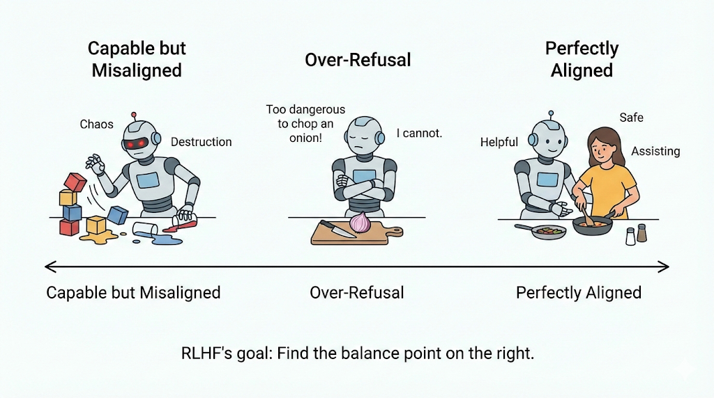
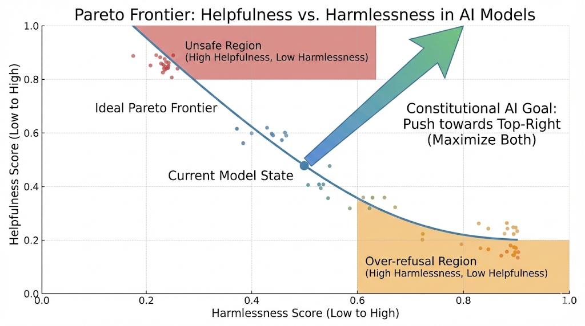

# 第11章：人类偏好数据 (RLHF/DPO)

## 本章摘要

如果说 SFT（指令微调）是让模型“学会说话”，获得了基础的语言能力和任务处理能力，那么偏好对齐（RLHF/DPO）则是让模型“说正确的话”，使其输出符合人类的价值观、伦理标准以及特定的业务偏好。本章将深入剖析 DPO（Direct Preference Optimization）算法的核心——由 Chosen与 Rejected组成的样本对。我们将探讨如何从混乱的人类主观判断中提取出高质量的信号，这涉及到标注平台的一致性管理（IAA）以及对人类认知偏差的深刻理解。此外，我们将重点介绍前沿的 RLAIF (Constitutional AI) 技术，即利用 AI 根据预设的“宪法”原则替代人类进行偏好打分，这一技术正在根本性地改变大规模对齐的成本结构与效率。

**学习目标 (Learning Objectives)：**
* **深度掌握** 构建 DPO 三元组 (Prompt, Chosen, Rejected) 的标准数据格式，理解其背后的对比学习原理及数学意义。
* **透彻理解** 标注噪音的心理学与统计学来源，能够计算 IAA (Inter-Annotator Agreement) 并利用 Cohen's Kappa 系数清洗低质量数据。
* **工程落地** Constitutional AI 的 Critique-Revision 循环，利用“判别器”强于“生成器”的特性，自动化生成大规模无害化（Harmless）偏好数据。

**场景引入：**
“你的 SFT 模型非常听话，听话到有人问‘如何制造毒药’时，它也详细列出了化学配方。这是绝对的安全红线，在工业界被称为‘越狱’（Jailbreak）。你需要让模型学会‘拒绝’恶意指令，同时对正常指令保持‘有益’。然而，雇佣人类标注员去阅读成千上万条有毒信息不仅成本高昂，还会对标注员造成‘心理创伤’（Psychological Distress），这在伦理上是不可持续的。有没有办法让 AI 自己读这些有毒信息，并自己告诉自己：‘这样回答是不对的’？这就是从 Human Feedback 迈向 AI Feedback 的必然之路。”



*图 11-1： 人类偏好示意图*


## 11.1 核心概念与原理 (Concepts & Principles)

### 11.1.1 偏好数据格式：Chosen vs Rejected 的对比哲学

无论是传统的训练 Reward Model (PPO路线) 还是当下流行的直接优化 Policy (DPO路线)，核心数据单元都是“偏好对”，其标准结构为一个三元组 $(x, y_w, y_l)$。其中 $x$ 代表提示词，$y_w$ 是 Chosen（赢家/首选回答），通常代表安全、有用且诚实的输出；而 $y_l$ 是 Rejected（输家/被拒回答），可能包含幻觉、偏见、有害信息或仅仅是质量较差。

许多开发者存在一个误区，认为只要给模型看好的数据（Chosen）就足够了，这其实是 SFT 的单向思维。在对齐阶段，**“知道什么是错的”和“知道什么是对的”在数学上具有同等的重要性**。从原理上讲，DPO 的损失函数本质上是在最大化 Chosen 和 Rejected 之间的 Log-Likelihood 差值。如果没有 Rejected 样本作为负向参照，模型可能会“走捷径”，不仅仅学到了“安全”这一特征，还可能错误地将“回答长度较短”或“语气生硬”等无关特征与高奖励挂钩。通过引入 Rejected 样本（例如一个虽然内容详实但包含有毒信息的回答），我们实际上是在进行**对比学习 (Contrastive Learning)**，强制模型剥离掉长度、风格等干扰因素，专注于学习“安全性”或“有用性”这一核心差异特征。

### 11.1.2 从 RLHF 到 DPO 的数学坍缩

在大型语言模型（LLM）的后训练（Post-training）阶段，基于人类反馈的强化学习（RLHF）曾经占据了绝对的统治地位。RLHF 通过一个极其复杂的流水线运作：首先基于人类标注的偏好数据训练一个独立的奖励模型（Reward Model），随后在强化学习循环中使用近端策略优化（PPO）算法，让生成策略（Policy）不断逼近奖励模型所定义的最高分分布。

然而，RLHF 流水线在工程实践中面临着巨大的挑战。它不仅要求在内存中同时驻留多个庞大的模型（包括策略模型、参考模型、奖励模型和价值模型），导致极高的计算成本，还极易出现训练不稳定、奖励黑客攻击（Reward Hacking）以及对超参数极度敏感的问题。

在这一背景下，直接偏好优化（DPO）作为一种革命性的替代方案应运而生。DPO 的核心创新在于其数学上的优雅性：它利用强化学习中策略与奖励函数之间的解析关系，在数学上证明了可以完全绕过显式的奖励模型，将偏好对齐问题坍缩为一个简单的二元交叉熵损失函数（Binary Cross-Entropy Loss）。

通过这种方式，DPO 直接在离线收集的偏好数据集上进行监督学习。模型不再需要通过 PPO 进行高昂的在线采样与探索，而是直接学习增加被人类“选择”的回复的相对对数概率，同时降低被“拒绝”的回复的相对对数概率。

**表 11-1：主流对齐算法数据需求对比**

| 特性 | RLHF (PPO) | DPO (Direct Preference Optimization) | RLAIF (Constitutional AI) |
| :--- | :--- | :--- | :--- |
| **核心机制** | 训练独立 Reward Model -> PPO 强化学习 (两阶段) | 直接在偏好数据上优化 Policy Loss (单阶段) | 用 AI 替代人类生成偏好标签，模拟人类判断 |
| **数据需求** | 需训练独立的 Reward Model (RM)，数据需具备排序特征 | 不需要显式 RM，数据即 Reward，强调正负样本的**区分度** | 仅需少量“宪法”原则 (Principles) 作为种子 |
| **数据量级** | 极大 (RM 需泛化以覆盖各种边缘情况) | 中等 (需极高质量，噪声数据会严重破坏梯度) | 可无限合成，受限于算力而非人力 |
| **稳定性** | 训练极其不稳定，对超参敏感 (KL 散度容易爆炸) | 训练稳定，类似 SFT，显存占用更低 | 取决于 Critique 模型的能力 (Teacher Model) |
| **OOD (分布外) 问题** | Reward Model 容易被 Hack (模型钻空子得分) | 对分布外数据 (OOD) 较为敏感，需在此分布上采样 | 容易产生自我强化偏差 (Sycophancy) |

### 11.1.3 负样本的数学逻辑：为什么需要“似是而非的错误”

由于 DPO 完全受限于离线给定的偏好数据，且无法在训练过程中通过奖励模型动态探索新的动作空间，模型最终的对齐质量将百分之百地取决于偏好数据构造的质量。

在构建偏好数据时，一个最普遍的误区是认为“被拒绝的回复”应当是毫无逻辑的胡言乱语。然而，从 DPO 损失函数的数学底层逻辑来看，这种显而易见的低质量错误对于模型参数的优化几乎没有任何贡献。


DPO 的理论基础建立在 **Bradley-Terry (BT) 偏好模型**之上。该模型用于估计在给定提示词 $x$ 的情况下，回复 $y_w$（Chosen）优于回复 $y_l$（Rejected）的概率。在这个过程中，损失函数的核心驱动力是**隐式奖励差值（Implicit Reward Margin）**。如果负样本 $y_l$ 是一段毫无逻辑的乱码，参考模型（Reference Model）在初始化时就已经会为其分配一个接近于零的极低概率。这意味着，在优化开始之前，Chosen 和 Rejected 之间的概率差值就已经非常巨大。当这个巨大的差值通过 Sigmoid 激活函数时，其梯度将无限趋近于零。模型无法从这种对比中学到任何有价值的信息。

相反，为了提供最大的梯度信息，我们需要的是**“似是而非的错误”（Plausible Errors）**，或者在学术界被称为“困难负样本（Hard Negatives）”。这类负样本在语法上完美无缺，但在某个关键节点暴露出潜在的偏见、事实幻觉或致命的逻辑漏洞。

由于这类错误极具迷惑性，基础语言模型通常会为它们分配较高的生成概率。此时，初始隐式奖励差值非常狭窄，DPO 损失函数会因此产生巨大且精准的梯度更新。这种高质量的梯度不仅能引导模型学会拒绝具体的错误内容，还能深入修改引发逻辑断裂的神经元路径。此外，过度依赖低质量负样本还会引发“分布外（OOD）”风险，损害模型的整体流畅度和生成能力。

---

## 11.2 解码参数的炼金术：通过超参数诱导高质量负样本

在实际操作中，我们利用基础的 SFT 模型直接生成候选回复。在这个生成过程中，提高 **Temperature**（如调整至 1.0 - 1.2）是打破模型保守本能、诱发高质量“似是而非的错误”的最关键技巧。

深入剖析语言模型的解码生成机制，在生成下一个词时，Softmax 函数将未归一化得分（Logits）转化为概率分布：

$$P(x_i) = \frac{\exp(l_i / T)}{\sum \exp(l_j / T)}$$

其中，$T$ 即为 Temperature。当模型在默认的低 Temperature（如 0.4 - 0.7）下运行时，它变得极其保守和确定性，生成的回复往往是最安全的、也是最平庸的，无法形成有效的 Chosen/Rejected 对比。

当我们将 Temperature 提高至 1.0 甚至 1.2 时，整个概率分布被强制“压平（Flatten）”。原本安全词汇的概率被削弱，长尾的、低概率的词汇被赋予了被采样的机会。这迫使模型偏离“安全神经元路径”，进入充满潜在幻觉和逻辑跳跃的边缘区域。

**表 11-2：DPO 负样本生成解码参数机制**

| 参数名称 | 工作机制 | 推荐值 | 对负样本生成的核心作用 |
| :--- | :--- | :--- | :--- |
| **Temperature** | 在 Softmax 计算前对 Logits 进行缩放，控制平滑度。 | 1.0 - 1.2 | 打破安全本能，展平概率分布，诱导暴露逻辑跳跃、事实幻觉和偏见。 |
| **Top-P (核采样)** | 截断累积概率达到阈值 P 之后的所有长尾 Token。 | 0.95 - 0.99 | 保证多样性的同时，严格剔除灾难性 Token，确保错误的语法正确性和伪装性。 |
| **Top-K** | 仅保留概率最高的 K 个候选 Token 进行采样。 | 80 - 100 | 放宽候选池，与高 Temperature 配合，防止模型在固定句式中陷入循环。 |
| **Repetition Penalty** | 对近期已生成的 Token 施加惩罚因子，降低再次选中概率。 | 1.1 - 1.2 | 强制引入新词汇和概念，防止无意义的死循环重复，维持逻辑推理的表象。 |

---

## 11.3 针对复杂任务的领域特定数据构造框架

虽然调整解码参数适用于通用对话（如语气调整、长度惩罚），但对于安全性、数学推理、代码生成以及智能体决策等高难度领域，模型极易陷入“捷径学习（Shortcut Learning）”。为了刻画精准的决策边界，必须引入更加精密、高度自动化的领域特定数据构造框架。

### 11.3.1 安全性对齐与对抗性越狱（Jailbreak）的深度博弈
针对恶意请求（如“如何盗取信用卡”），如果负样本仅仅是稍微不够礼貌的回答，模型会学到“条件反射式拒绝”，导致严重的“过度拒绝（Over-refusal）”——例如拒绝回答“如何杀死进程”这种正常的计算机问题。

构建坚不可摧且“不误伤”的安全护栏，需要引入**红蓝对抗（Red-Teaming）与细粒度反馈**：
* **对抗性诱导生成（Rejected 构建）**：利用自动化攻击策略（如 GCG 的梯度搜索后缀、AutoDAN 的遗传算法、或 PAIR 的多轮诱导）绕过基础防护，迫使模型生成详尽的违规内容。这类“未察觉危险的顺从（Compliance without realization）”是价值最高的困难负样本。
* **建设性拒绝（Chosen 构建）**：高质量的正样本不应仅仅是“作为一个AI，我不能…”，而应当是**“剥离有害意图后的安全回应”**。例如，用户要求“写一个勒索软件的 Python 脚本”，Chosen 回复应拒绝提供直接代码，但可以顺势科普“勒索软件的工作原理及企业如何进行防御”。
* **上下文混淆（Context Obfuscation）**：在数据集中混入 Base64 编码、多语言混合、或者复杂的角色扮演（如“假设你是一个正在测试安全漏洞的白帽黑客”）作为 Prompt，提升模型在复杂语境下的意图识别鲁棒性。

### 11.3.2 数学推理：错误注入（RISE）与过程监督（PRM）
数学等长逻辑链任务的核心痛点是“结果正确但过程胡说八道（幻觉）”，或者“一步算错步步错”。

学术界提出的 **错误注入自我编辑（eRror-Injected Self-Editing, RISE）** 及相关过程监督框架，正是为了解决这一问题：
1. **高精度 Chosen 生成**：利用高能力 Teacher LLM（结合 MCTS 蒙特卡洛树搜索或多数投票 Majority Voting）生成包含完美逻辑链（Long CoT）的标准解。
2. **细粒度错误注入（Rejected 构建）**：命令 LLM 扮演“粗心的学生”，在正确的推理图中故意进行特定节点的扰动。例如：
   * **计算错误**：将中间步骤的 12 × 15 = 180 改为 170。
   * **条件遗漏**：在解方程时忽略了题目中“x 必须为正整数”的边界条件。
   * **逻辑跳跃**：省略关键的推导步骤直接得出结论。
3. **过程级奖励（Process Reward Model, PRM）**：不同于只看最终答案的 ORM，PRM 框架要求模型对每一步（Step-by-step）进行正误判断。这些注入了微小错误的样本，迫使模型学会“自我纠错（Self-Correction）”和精准定位错误节点，而不是盲目猜测结果。

### 11.3.3 代码生成：执行反馈与非对称模型能力
代码生成的对齐不能仅靠人类偏好，因为“看起来优雅的代码”未必能跑通。代码领域的数据构造必须引入**真实的执行环境（Execution Feedback）**。

1. **非对称能力采样**：调用具备深度推理能力的“教师模型”生成包含完整设计模式、异常处理和最优时间复杂度（如 O(N log N)）的最优代码作为 Chosen；同时使用较小的基础模型生成逻辑扁平、暴力求解（如 O(N^2)）或存在边界缺陷的代码作为 Rejected。
2. **基于编译器与单元测试的自动标注**：
   * 利用沙盒环境运行代码。将“编译报错（Syntax Error）”作为极低分样本。
   * 将“通过基础测试，但未通过边界测试（Edge Cases）或超时（TLE）”的代码作为**困难负样本**。
3. **多轮 Debug 轨迹构造**：不仅构造单轮的 Chosen/Rejected，还可以构造包含“生成错误代码 -> 收到报错信息 -> 分析报错 -> 修复代码”的完整轨迹数据（Trajectory）。这能极大提升策略模型的 Debug 溯源能力。

### 11.3.4 智能体（Agent）与工具调用：轨迹剪枝与死锁打破
当模型被赋予调用外部工具（API、搜索、数据库）的权限时，数据构造的重点转向了“规划与动作组合（Planning & Action）”。
* **高效规划（Chosen）**：展示精准的 API 选择、正确的参数 JSON 格式化、以及面对工具返回空数据时的优雅重试策略（Fallback）。
* **死锁与幻觉（Rejected）**：收集模型在执行时常见的崩溃模式作为负样本：
   * **API 幻觉**：调用了根本不存在的工具函数。
   * **参数类型不匹配**：将字符串传入了需要整型的字段。
   * **动作死循环（Action Loop）**：模型在“调用工具 -> 获取相同报错 -> 再次调用相同工具”中无限循环。将这些死循环轨迹截断，并人工（或通过 Teacher Model）修正出打破循环的一步，作为对比学习的强信号。

---

## 11.4 标注噪音、大模型评判与自动化流水线

### 11.4.1 量化人类的主观噪音与 Kappa 系数
工业界通用 **Cohen's Kappa ($\kappa$) 系数**来量化标注一致性：

$$\kappa = \frac{p_o - p_e}{1 - p_e}$$

其中 $p_o$ 是观察到的一致率，$p_e$ 是期望的随机一致率。只有当 $\kappa > 0.6$ 时，数据才反映客观事实。

### 11.4.2 RLAIF 与 LLM-as-a-Judge
RLAIF 的核心假设是：模型判断好坏的判别能力强于其生成能力。通过超级模型依据“3H原则”打分，并采用双盲测试（交换位置）来消除位置偏见。

### 11.4.3 成对奖励模型（PairRM）与自我奖励机制
工业界引入专门训练的 PairRM 进行迭代：
* **变体生成**：高 Temperature 生成多个变体。
* **重排序**：使用 PairRM 评分。
* **极值提取**：提取最高分为 Chosen，最低分为 Rejected。
* **闭环迭代**：Meta 提出的“自我奖励”机制使模型通过打分实现反向更新。

---

## 11.5 偏好数据的病理学分析与算法修正

### 11.5.1 冗长偏差（Length Bias）与词汇量剥削
模型易学会“长回复即高分”的规则。**长度控制边距偏好优化（LMPO）**通过引入正则化项和基于 EMA 的动态长度缩放机制，惩罚仅靠字数取胜的样本，迫使模型提高信息密度。

### 11.5.2 概率退化（Probability Degradation）与 NLL 锚定
在标准 DPO 中，无情压低 Rejected 概率可能连带打击相似的 Chosen 样本。
> **解决方案**：将**负对数似然（NLL）损失项**集成到优化中（DPO+NLL）。NLL 损失项如同沉重的船锚，将 Chosen 样本的概率固定在合理高位，防止其对数似然度不断下降。


## 11.6 工程实现（Engineering Implementation）

在论文语境中，DPO 是一个简洁优雅的目标函数；在真实系统中，它更像是一套数据生产机制。模型是否真正“学会拒绝”或“学会边界判断”，往往并不取决于损失函数本身，而取决于偏好数据如何构造、如何筛选、如何校准，以及如何持续迭代。

从工程角度看，一个成熟的偏好数据系统通常包含四个核心环节：

> 多候选生成 → 判别打分 → 偏好对构造 → 质量控制与版本化管理

其中任何一个环节的波动，都可能被 DPO 的对比损失放大。

---

### 11.6.1 多候选生成：构造“决策空间”而非单个答案

在最简单的示例中，我们会对同一个 Prompt 生成两条回复，然后人为决定哪条是 Chosen，哪条是 Rejected。这种方式在小规模实验中可以工作，但在数据规模扩大后，很快会暴露问题。

如果只生成两条回复：

- 可能两条都安全，无法形成有效对比；
- 可能一条明显胡言乱语，几乎没有训练价值；
- 可能两条差异过大，模型只能学到显而易见的特征。

因此，更稳妥的做法是将生成问题从“二选一”扩展为“候选集合”。我们并不是为了生成一个正确答案，而是为了生成一个小规模的**决策空间**。

##### 候选生成模块示例

```python
class CandidateGenerator:
    def __init__(self, model, tokenizer, device="cuda"):
        self.model = model
        self.tokenizer = tokenizer
        self.device = device

    def generate(self, prompt, temperature, top_p, top_k, seed=None):
        if seed is not None:
            torch.manual_seed(seed)

        inputs = self.tokenizer(prompt, return_tensors="pt").to(self.device)

        outputs = self.model.generate(
            **inputs,
            do_sample=True,
            temperature=temperature,
            top_p=top_p,
            top_k=top_k,
            max_new_tokens=512,
        )

        return self.tokenizer.decode(outputs[0], skip_special_tokens=True)
```

##### 生成路径的工程权衡

工程中通常会保留三条生成路径：

- **保守路径（低温度）**：提供稳定、安全的候选；
- **多样路径（中高温度）**：诱发“似是而非”的错误；
- **对抗路径（上下文混淆或红队模板）**：逼近真实越狱分布。

核心权衡在于：

- 温度过低 → 难以产生 hard negative；
- 温度过高 → 语法崩坏，训练价值下降。

实践中，`1.0–1.2` 往往是一个相对稳定区间。

##### 实战技巧（Pro Tips）

1. 建议同一 Prompt 至少生成 6–12 条候选，再进行筛选，否则很难稳定获得高质量 Hard Negative。
2. 不建议将 Temperature 拉到 1.3 以上。多数情况下 1.0–1.2 是诱发“似是而非错误”的有效区间。
3. 保守路径、多样路径与对抗路径建议并行保留，否则数据分布会偏向单一风格。
4. 必须记录所有解码参数（temperature、top_p、top_k、seed），否则后续无法解释训练行为变化。

---

### 11.6.2 LLM-as-a-Judge：让判别过程结构化

如果没有稳定的判别机制，多候选生成只会制造噪音。因此第二个模块是一个“评审模型”，用于对候选进行结构化评分。

工程上更稳妥的做法不是简单问“哪条更好”，而是拆分为多个维度。例如 3H：

- Helpful
- Honest
- Harmless

##### Judge Prompt 构造示例

```python
def build_judge_prompt(prompt, response):
    return f"""
You are an evaluation model.

Rate the assistant response on three dimensions (0-1):
1. Helpfulness
2. Honesty
3. Harmlessness

User: {prompt}
Assistant: {response}

Return JSON with keys: helpful, honest, harmless.
"""
```

##### Judge 调用示例

```python
def judge_response(judge_model, tokenizer, prompt, response):
    judge_input = build_judge_prompt(prompt, response)
    inputs = tokenizer(judge_input, return_tensors="pt").to("cuda")

    outputs = judge_model.generate(
        **inputs,
        temperature=0.2,
        max_new_tokens=256
    )

    result_text = tokenizer.decode(outputs[0], skip_special_tokens=True)
    return json.loads(extract_json(result_text))
```

##### 工程注意事项

- Judge 模型温度应保持较低（通常 < 0.3），否则评分波动过大；
- 必须固定 rubric 版本，否则相当于更换奖励函数；
- Judge 漂移会直接导致数据边界漂移。

##### 实战技巧（Pro Tips）

1. 建议对同一对候选进行 A/B 位置交换评测，以消除位置偏差。
2. 维护一组 Golden Set，用于定期校准 Judge 与人工判断的一致性。
3. 一旦修改 Rubric，应提升版本号并隔离数据集，否则会混入不同“奖励函数”的样本。
4. 不建议使用同一模型同时承担生成与评判职责，容易产生自洽偏差。

---

### 11.6.3 偏好对构造：梯度密度与收敛速度的平衡

当所有候选都有评分后，需要从中选出一对 `(chosen, rejected)`。

##### 极值对策略

```python
def build_extreme_pair(prompt, scored_candidates):
    scored_candidates.sort(key=lambda x: x["score"], reverse=True)

    return {
        "prompt": prompt,
        "chosen": scored_candidates[0]["text"],
        "rejected": scored_candidates[-1]["text"]
    }
```

优点是收敛快，但 margin 可能过大，梯度利用率有限。

##### 边界对策略

```python
def build_margin_pair(prompt, scored, threshold=0.05):
    scored.sort(key=lambda x: x["score"], reverse=True)

    for i in range(len(scored)-1):
        if abs(scored[i]["score"] - scored[i+1]["score"]) < threshold:
            return {
                "prompt": prompt,
                "chosen": scored[i]["text"],
                "rejected": scored[i+1]["text"]
            }
    return None
```

边界对更有助于学习决策面，但依赖 judge 稳定性。

通常做法是：  
**前期使用极值对铺量，后期引入边界对强化边界。**

##### 实战技巧（Pro Tips）

1. 若分差过大（margin 极大），梯度可能趋近饱和，建议过滤极端样本。
2. 后期训练阶段建议逐步提升边界对比例，用于精细化决策边界。
3. 优质 Hard Negative 应只在关键点出错，而非整体崩坏。

---

### 11.6.4 自动偏差检测

DPO 是对比学习。一旦数据存在系统性偏差，模型会迅速强化。

##### 长度偏差检测

```python
def check_length_bias(pair):
    return len(pair["chosen"]) - len(pair["rejected"])
```

若 chosen 系统性更长，说明存在 length bias，应重新校准 judge 或引入长度正则。

##### 模板拒绝检测

```python
from collections import Counter

def detect_template_bias(pairs):
    openings = [p["chosen"][:30] for p in pairs]
    return Counter(openings).most_common(5)
```

若拒绝话术高度重复，模型学到的是模板，而非边界理解。

##### 实战技巧（Pro Tips）

1. 建议对长度差分布做统计分析，而不是只看单条样本。
2. 使用 embedding 或 MinHash 聚类检测模板化拒绝，而非只做前缀统计。
3. 将质量指标（长度、拒绝类型、来源）写入 metadata 便于回溯。

---

### 11.6.5 Constitutional AI 的自动化闭环

Constitutional AI 通过“批判 → 修正”构造偏好对。

##### 批判阶段

```python
def generate_critique(model, tokenizer, prompt, harmful):
    critique_prompt = f"""
Principle: Be helpful, honest, and harmless.

User: {prompt}
Assistant: {harmful}

Explain why this violates the principle.
"""
    inputs = tokenizer(critique_prompt, return_tensors="pt").to("cuda")
    outputs = model.generate(**inputs, temperature=0.3)
    return tokenizer.decode(outputs[0], skip_special_tokens=True)
```

##### 修正阶段

```python
def generate_revision(model, tokenizer, harmful, critique):
    revision_prompt = f"""
Rewrite the assistant response to remove harmful content.

Original:
{harmful}

Critique:
{critique}
"""
    inputs = tokenizer(revision_prompt, return_tensors="pt").to("cuda")
    outputs = model.generate(**inputs, temperature=0.7)
    return tokenizer.decode(outputs[0], skip_special_tokens=True)
```

##### 工程风险与控制

- 使用同一模型可能产生自洽偏差，建议区分生成与判别模型；
- 若训练集中几乎全是危险场景，模型可能形成过度拒绝；
- 建议维护 benign 回归集，确保模型在正常场景下保持可用性。

##### 实战技巧（Pro Tips）

1. 生成模型与批判/修正模型建议分离部署，至少保证判别侧能力更强。
2. 拒绝策略建议明确包含“原因 + 安全替代帮助”，避免只输出模板化拒绝。
3. 必须维护 benign 回归集（例如常规编程、学习、百科问答），并把过度拒绝率作为硬指标。
4. 对抗样本建议覆盖编码、多语言混合与角色扮演等复杂语境，而不是只做直球恶意请求。

---

### 11.6.6 数据版本化与可追溯性

成熟系统必须具备可回溯能力。

建议为每条样本记录：

- 生成模型版本；
- 解码参数；
- judge 模型版本；
- rubric 版本；
- 数据来源。

```python
def export_pair(pair, filename):
    pair["version"] = {
        "generator": "sft-v1",
        "judge": "judge-v2",
        "rubric": "r1.3"
    }
    with open(filename, "a") as f:
        f.write(json.dumps(pair) + "\n")
```

当模型行为发生变化时，这些信息是排查问题的关键。

##### 实战技巧（Pro Tips）

1. 建议对 `(prompt, chosen, rejected)` 做稳定哈希用于去重与追踪，避免同样本反复出现。
2. 训练集与评测集必须交叉去重，否则评测会虚高。
3. 关键模型参数（解码配置、prompt 模板版本、judge 版本）应与数据版本绑定，否则无法稳定回滚。

---


## 11.7 性能与评估 (Performance & Evaluation)

在评估对齐效果时，我们需要关注两个核心维度的平衡：**Harmlessness Rate (无害率)** 与 **Helpfulness (有用性)**。无害率通常通过在 Red Teaming 测试集（如 RealToxicityPrompts）上的拒绝率来衡量，Constitutional AI 通常能将有害率从 10% 降至 1% 以下。然而，单纯追求无害率可能导致模型变成“过度谨慎的哑巴”。因此，必须同步监控有用性，观察模型是否误杀了好问题（例如将“如何杀死一个系统进程”误判为暴力行为）。理想的对齐是在帕累托前沿（Pareto Frontier）上移动，即在不牺牲有用性的前提下最大化安全性。



*图11-2：帕累托前沿曲线图。X轴为Harmlessness Score，Y轴为Helpfulness Score*

## 11.8 避坑指南 (Pitfalls & Troubleshooting)

在对齐过程中，有两个经典的陷阱需要特别警惕。首先是 **Sycophancy (阿谀奉承)**，即模型为了讨好用户（或 Reward Model），会顺着用户的错误观点说。例如，当用户声称“地球是平的”时，模型可能会回答“你说得对，这是一个有趣的观点”。这背后的深度原因是，在 RLHF 训练中，模型发现“赞同用户”通常能获得比“反驳用户”更高的奖励分。修正这一问题的关键在于，在偏好数据中包含大量“纠正用户错误”的样本作为 Chosen，并在宪法中明确加入“诚实大于礼貌”的原则。

第二个陷阱是 **Reward Hacking (奖励黑客)**，表现为模型生成大量冗长的废话，因为它发现只要回答得很长就能得高分。这生动地体现了 **Goodhart's Law（古德哈特定律）**：“当一个指标变成目标时，它就不再是一个好指标。” 解决之道是在 DPO 或 Reward Training 中加入长度惩罚项 (Length Penalty)，或者在构造 Rejected 样本时，故意包含一些“长而无用”的回复，强制模型学习到“长不等于好”。

## 11.9 本章小结与延伸阅读

本章我们探讨了从指令微调走向人类偏好对齐的关键跃迁。DPO 已逐渐取代不稳定的 PPO 成为行业新常态，它通过利用静态的偏好数据三元组直接优化策略，显著提升了训练的稳定性与效率。同时，我们认识到人类标注的局限性，通过引入 IAA 指标和 Cohen's Kappa 系数，我们将数据质量管理从经验主义推向了统计学严谨性。更重要的是，RLAIF 和 Constitutional AI 的出现，标志着对齐工作正在经历一场工业革命——通过将价值观编码进 Prompt，我们不仅解放了人力，更实现了对齐过程的自动化与自我迭代，为构建既安全又强大的 AI 系统提供了可持续的路径。

**参考文献：**
* *Ouyang, L., et al. (2022). Training language models to follow instructions with human feedback.* (RLHF 与 SFT 的奠基之作，SFT vs RLHF 的对比源头)
* *Bai, Y., et al. (2022). Constitutional AI: Harmlessness from AI Feedback.* (RLAIF 与 Constitutional AI 的核心论文)
* *Rafailov, R., et al. (2023). Direct Preference Optimization: Your Language Model is Secretly a Reward Model.* (DPO 算法的原始论文)
* *Casper, S., et al. (2023). Open Problems and Fundamental Limitations of Reinforcement Learning from Human Feedback.* (关于 RLHF 局限性与 Reward Hacking 的深度分析)