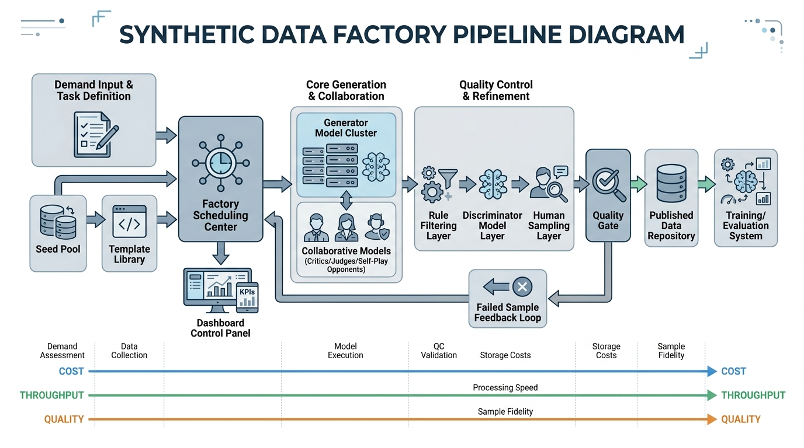
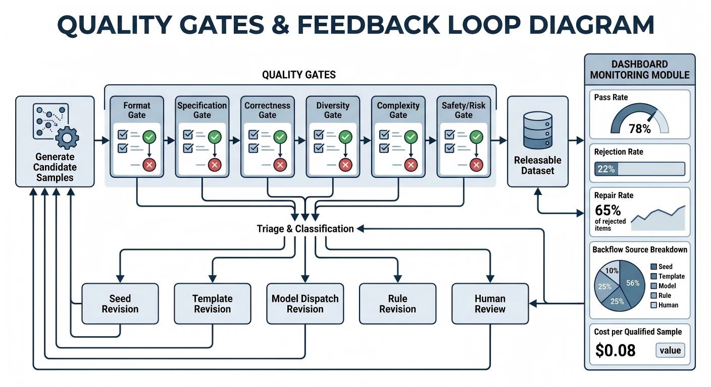

# 合成数据⼯程
在大模型训练进入精细化与规模化并行发展的阶段后，数据问题已经不再只是“有没有数据”，而是“如何持续、稳定、低成本地制造高质量训练数据”。尤其是在人工标注成本高、覆盖范围有限、复杂任务样本稀缺的背景下，利用模型生成训练数据，已经从一种辅助手段，逐渐演变为大模型迭代中的核心能力之一。合成数据不再只是几条 prompt 驱动下的临时技巧，而正在成为支撑模型持续进化的数据生产方式。

但这条路径并不天然安全。模型制造数据，看似提高了效率，实则也带来了新的系统性风险：模型可能放大原有偏差，重复生成低信息密度内容，制造表面正确却本质脆弱的样本，甚至在自我循环中不断“喂养”自身缺陷，最终形成数据污染、能力塌缩或错误行为固化的反噬效应。也就是说，合成数据的关键问题从来不是“能不能生成”，而是“怎样生成得可控、可信、可验证、可持续”。

因此，真正值得讨论的，不是把 prompt 写得更花哨，而是如何把合成数据能力从零散经验上升为一套可复用、可评估、可治理的工业化系统。这套系统不仅要解决样本生成，还要覆盖任务设计、模板编排、候选扩展、质量筛选、难度控制、去重去污染、人工抽检、版本追踪与闭环迭代等关键环节。只有当合成数据被纳入“生产—评估—反馈—优化”的完整流水线，它才真正具备成为训练基础设施的价值。
## Ch15 合成数据工厂：从种子到验证

在大模型训练逐步走向持续迭代和工程化运营之后，团队面对的核心问题已经不再只是“能不能调用模型生成一些数据”，而是“能不能稳定、低成本、可解释地生产出可用于训练的数据”。很多团队最初接触合成数据时，往往从 prompt 编写开始：给模型一段任务说明，要求它模仿某类风格、补齐某类问题、制造某类对话，再把生成结果简单清洗后送入训练。这种方式在早期验证阶段确实有效，因为它快、灵活，而且足够直观。但当数据需求从几千条扩展到几十万条、几百万条时，零散的 prompt 技巧就会迅速暴露出边界：产能不稳定，质量波动大，问题难定位，失败难复现，成本也难以预测。

因此，合成数据真正进入大规模应用之后，必须从“生成”转向“生产”。这里的“生产”不是把模型调用次数放大，而是要建立一套像工厂一样的系统：有原料输入，有模板装配，有调度系统，有多模型协作，有质量闸门，有返工和回流，有版本管理，也有日常运营控制面板。只有这样，团队才可能把“调用模型生成数据”升级为一条能持续服务训练、评估与产品迭代的数据流水线。

本章面向希望将合成数据从实验室技巧升级为工厂化流水线的团队，讨论从种子池建设到模板库设计，从生成与筛选到质量验证，再到失败样本回流、版本联动和控制面板运营的完整闭环。我们强调一个核心判断：合成数据的价值不取决于模型能说出多少内容，而取决于团队能否把这些内容组织成一个可控、可评估、可复用、可持续的工程系统。

### 1. 合成数据为什么需要工厂思维

#### 零散生成为什么难以形成稳定产能

零散生成最大的表面优势，是部署门槛低。一个会写 prompt 的工程师，配合一个足够强的基础模型，很快就能产出一批看起来不错的数据。但这类方法之所以难以形成稳定产能，根本原因在于它缺乏生产系统所必需的三个性质：输入标准化、过程可控化和结果可验收化。

首先，零散生成严重依赖个体经验。同样是“生成数学推理样本”，不同成员写出的 prompt 可能在任务边界、输出格式、难度控制、错误规避和风格要求上差异极大。结果是数据看似很多，实际却来自互不兼容的生产逻辑。模型在训练时学到的，不是统一的任务行为，而是杂糅的表达习惯和不一致的约束。

其次，零散生成很难做排产。今天为了补齐代码解释任务临时造一批数据，明天因为评测显示安全拒答不足又追加一批对抗样本，后天发现长上下文任务薄弱再去补长文总结。这样的生成过程更像救火，而不是生产。数据需求与生成资源之间没有调度关系，团队通常不知道该先生成什么、用哪个模型生成、生成多少、失败时是否重试、重试到什么程度才应停止。

更严重的问题是，零散生成缺乏可复盘性。一旦数据质量出了问题，团队往往只能看到训练效果下降，却说不清到底是 seed 不好、模板有漏洞、生成模型不稳定、筛选规则过松，还是验证口径本身就有偏差。没有可追踪的工艺链路，问题就无法被分解，自然也无法被修复。产能不稳定并不仅仅意味着“生成速度时快时慢”，它更意味着团队无法稳定地产出“可用的数据”。

进一步说，零散生成还有一个常被忽视的问题：它只能在局部时刻看起来有效，却很难在时间尺度上持续有效。一次 prompt 写得好，不代表十次、百次调用后仍然保持一致；某位成员的经验暂时奏效，也不代表团队可以将其移交、复制和规模化。只要生成能力无法脱离个人技巧而独立存在，它就仍然停留在作坊状态，而不是进入了真正的工程状态。

对于训练团队而言，最危险的不是“没有数据”，而是“手里有很多看起来像数据的内容，却不知道哪些可以放心进训练”。零散生成恰恰最容易制造这种幻觉：输出很多，表面流畅，速度很快，但其中真正具备训练价值的比例并不高。于是团队在数据侧看到的是“量很大”，在训练侧感受到的却是“收益很小”，甚至“越训越乱”。这正说明产能不能只看候选样本数量，而必须看合格样本数量、可复用样本比例和进入训练后的真实收益。

#### 从“能生成”到“能交付”：产能定义本身需要被重写

很多团队谈论合成数据产能时，习惯用“每天可以生成多少条”来衡量。但对真正的工厂系统而言，这个指标远远不够。工厂关心的不是原始输出量，而是**经过筛选、验证并可交付训练的有效产出量**。如果一个系统每天能生成十万条候选数据，却只有一万条能通过质量闸门，那么它的真实产能并不是十万条，而是一万条。更进一步，如果这批通过闸门的数据在训练后几乎不带来增益，那么从训练收益视角看，它的有效产能可能还要更低。

因此，工厂思维首先要求团队重写“产能”的定义。产能不是模型吐出了多少 token，不是脚本跑了多少轮调用，也不是存储目录里多了多少 JSON 文件。产能应至少包含四层含义：候选产出量、合格入库量、训练可消费量，以及最终对模型能力的有效贡献量。前两层属于数据生产过程指标，后两层则将数据系统与训练系统真正联结起来。只有把这几层指标分开观测，团队才知道瓶颈究竟出现在生成、筛选、验证，还是出现在数据本身对训练目标的贴合程度上。

这也是为什么很多团队明明“做了很多合成数据”，却始终感觉没有形成稳定生产能力。因为他们实际上只是把生成环节做大了，而没有把“可交付”这件事做实。工厂真正交付的不是文本，而是可进入训练链路、可解释来源、可复盘问题、可持续迭代的数据产品。

#### 标准化为什么是工厂化的起点

工厂思维之所以重要，还有一个根本原因：没有标准化，就没有后续的一切。一个没有标准化输入、标准化模板、标准化验证口径和标准化日志记录的系统，不可能谈得上排产、调度、追踪和回流。它或许可以运行，但无法治理。

标准化首先体现在任务定义上。团队必须明确一条样本到底服务于什么训练目标，输出应呈现怎样的结构，哪些错误是绝不能接受的，哪些瑕疵是可以容忍的。如果连这些基本问题都没有统一答案，那么后续所有生成都只能依赖个人理解。其次，标准化还体现在元数据上。每条合成样本都应尽可能带有来源、模板版本、生成模型、筛选结果、验证结论、难度标签等信息。因为对于工厂来说，数据不是孤立文本，而是带工艺标签的制品。

标准化的另一个作用，是把讨论从“这条样本好不好”提升到“这批样本是否符合某条生产规范”。前者是审美判断，容易陷入主观争论；后者则更接近工程判断，便于形成一致口径。只有当团队能够基于统一规范谈论质量，质量控制才有可能被自动化和规模化。

**代码示例：合成样本的“工艺元数据”推荐字段（JSONL）**

工厂化的关键是可追溯。即便样本文本本身很简单，元数据也要尽量把“它怎么来的、怎么过闸门的”记录清楚，便于后续归因与回流。

```json
{
  "id": "syn_qa_00010293",
  "meta": {
    "task": "customer_service_qa",
    "template": {"name": "cs_refund_v1", "version": "1.2.0"},
    "seed_id": "seed_cs_0041",
    "producer_model": "model_small_v3",
    "judge_model": "model_large_judge_v2",
    "difficulty": "basic",
    "risk_level": "low",
    "gating": {
      "format_ok": true,
      "policy_ok": true,
      "dup_score": 0.08,
      "judge_score": 4
    },
    "created_at": "2026-04-24"
  },
  "messages": [
    {"role": "user", "content": "我想退货，运费谁承担？"},
    {"role": "assistant", "content": "一般按平台/商家规则区分：若因商品质量问题退货，多数场景由商家承担运费；若为无理由退货，常由买家承担。为避免误导，请你补充两点：1）是否为质量问题；2）是否在无理由期限内。"}
  ]
}
```

#### 合成数据工程与传统数据增强的差异

很多团队在理解合成数据时，容易把它与传统数据增强混为一谈，仿佛只是把图像翻转、文本替换、语序扰动这类方法换成了“让模型多写一些”。但两者在工程性质上并不相同。传统数据增强本质上是对已有样本做变形，目标通常是扩大分布覆盖、提升鲁棒性，增强过程往往受到较强的规则约束，因此可控性相对较高。而合成数据工程并不是单纯的“变形”，它更像是对任务样本进行再生产，甚至是创造原本并不存在的新样本。

这意味着合成数据面对的不是增强幅度问题，而是语义正确性、任务一致性、约束遵守性和分布结构问题。一个被增强后的图像即便有轻微失真，通常仍然属于原任务分布；但一条由模型生成的问答样本，如果事实错了、前提变了、约束丢了、推理链虚构了，表面再流畅，也可能是对训练目标有害的“伪好数据”。

因此，传统数据增强更像在既有生产线上提高原料利用率，而合成数据工程是在建立一条新的生产线。它需要考虑的不只是“如何生成”，还包括“生成哪些任务、由谁生成、用什么模板生成、是否经过裁判、如何判定合格、失败如何回流”。从工程角度看，合成数据并不是一个技巧模块，而是一个横跨数据设计、模型调用、质量控制和训练运营的系统模块。

更进一步地说，传统增强通常是围绕“样本不变性”展开的：对象还是那个对象，语义还是那个语义，只是在形式上做有限变化。而合成数据工程则经常在构造新的问题、新的场景、新的约束组合，甚至新的交互轨迹。前者强调“保持核心不变”，后者强调“在可控范围内创造新监督信号”。这意味着二者面临的失败类型也不同。传统增强的失败往往是扰动过大导致语义失真，而合成数据的失败则可能发生在任务定义、逻辑链、事实一致性、角色边界和风格控制等多个层面。

#### 合成数据不是“自动写样本”，而是“自动制造监督信号”

把合成数据理解为“自动写一点文本”会严重低估它的工程难度。模型真正生成的，并不是纯粹的内容，而是用于训练的监督信号。监督信号的价值，不只取决于语句是否通顺，更取决于它是否准确编码了团队希望模型学到的行为模式。比如在工具调用任务里，真正关键的不是回答写得是否自然，而是模型是否学会在正确时机选择正确工具、填入正确参数并处理正确返回值；在安全拒答任务里，关键也不是拒答语句是否礼貌，而是模型是否在风险边界上形成稳定而一致的行为。

一旦从“监督信号制造”而非“文本生成”来理解合成数据，团队就会自然意识到：工厂化的必要性不是来自规模本身，而是来自信号质量本身。监督信号一旦制造错了，模型就会以很高效率把错误学进去。也就是说，合成数据工厂的风险和它的价值是成正比的。它越能大规模生产，越需要更强的质量治理。

#### 为什么“看起来不错”的数据仍然可能有害

在合成数据实践中，一个最常见的误判是把流畅性误认为训练价值。大模型天生擅长把内容写得像样，因此很多样本即使逻辑有漏洞、事实有偏差、约束已偏离，仍然会显得“很像正确答案”。这会让人工检查产生错觉，也会让自动筛选系统高估样本价值。

对训练而言，这类“看起来不错”的样本尤其危险，因为它们往往不会以显性错误的形式出现。它们不是乱码，不是字段缺失，也不是明显胡说八道，而是介于正确与错误之间的灰区内容。例如，结论大体正确但过程虚构，解释语气自然但没真正遵守角色设定，工具选择表面合理但实际时机不对，拒答形式合规却把用户真实需求完全堵死。这类样本最容易穿过粗糙的筛选环节，并在训练中塑造模型的模糊行为边界。

工厂思维要求团队承认这一点：高风险数据问题往往不是“差得离谱”，而是“差得不明显”。因此，越是看起来成熟的生成结果，越需要制度化的验证与闸门，而不能只凭人的直觉说“这条好像没问题”。

#### 成本、质量、吞吐之间的系统平衡

合成数据之所以需要工厂思维，还有一个现实原因：它天然处在成本、质量和吞吐三者的拉扯中。只追求质量，团队可能选择最强模型、最长上下文、最严格的裁判链和最高比例的人工抽检，但这会迅速推高每条数据的成本，吞吐也可能降到无法支撑迭代节奏。只追求吞吐，团队可能改用便宜模型并降低筛选强度，短期看产量很高，长期却会把大量低质量样本送进训练，最终拖累模型。只追求低成本，则容易把系统优化成“能出数据”而不是“能出好数据”。

真正成熟的合成数据工厂，追求的不是某一项指标的极致，而是三者之间的平衡。换句话说，系统设计者需要回答一个更具体的问题：在当前任务场景下，什么样的成本结构能够支撑足够的产能，同时把质量维持在训练可接受的阈值之上。这个问题没有统一答案，因为写作类任务、代码类任务、多轮对话任务、工具调用任务和安全对齐任务，对错误的容忍度和对多样性的需求都不一样。

工厂思维的意义，就在于把这种平衡从个人经验提升为系统参数。哪些任务用高端模型首生成，哪些任务由中型模型批量生成后再由强模型裁判；哪些数据需要双重验证，哪些数据只需要规则过滤；哪些链路容许更高的重试次数，哪些链路一旦失败就直接回流模板修订。只有当成本、质量与吞吐成为可观测、可配置、可调优的对象，合成数据才具备真正的工程属性。

如果进一步展开来看，这三者的平衡并不是一条静态曲线，而是一套动态权衡机制。在冷启动阶段，团队往往应更偏向质量，因为此时核心任务是建立可靠种子、验证模板和摸清失败模式；在扩量阶段，吞吐的重要性会迅速上升，系统需要更强的自动化筛选与调度来降低单位成本；而在上线前或高风险场景中，质量又会重新压倒吞吐，因为一次错误可能带来的代价远高于多花一点生成预算。也就是说，工厂并不是为某个固定最优点而设计，而是为在不同阶段快速切换权衡策略而设计。

#### 为什么“低成本合成”常常反而更贵

许多团队在预算压力下，会本能地追求更便宜的生成链路，例如直接改用廉价模型、缩短 prompt、降低验证强度或减少人工抽检。表面上看，这似乎降低了单条样本成本，但从全链路看，未必如此。因为如果低成本链路导致通过率下降、返工率上升、训练收益变差，甚至引发更多回流与修订，那么总体成本可能反而更高。

真正需要优化的，不是“每次调用花多少钱”，而是“每条可用且有训练收益的数据最终花多少钱”。这是一种典型的工厂视角差异。作坊只看当前花费，工厂则看成品成本。很多系统之所以长期效率低下，不是因为模型太贵，而是因为不合格品太多、修复链太长、诊断周期太慢。只有把成本放到整条工艺链上衡量，团队才会意识到：有些看起来更贵的生成和验证配置，反而能大幅降低整体生产成本。

#### 工厂化调度：让生成系统从“能跑”变成“能生产”

当团队把合成数据规模做大之后，很快会发现一个事实：生成质量不仅取决于模型本身，还取决于调度方式。所谓工厂化调度，并不是简单的任务排队，而是把任务需求、模型资源、模板优先级、预算约束、质量目标和回流机制编织成一套生产编排系统。

例如，同一时间内，系统可能同时收到三类需求：补齐高难度推理样本、扩充某行业客服对话、修复某类工具调用失败案例。它们不应由同一生产逻辑处理。高难度推理样本更适合小批量、高质量、强验证的链路；行业客服对话适合模板化扩张和批量抽检；工具调用失败案例则需要优先进入“失败回流—模板修补—定向再生成”的修复链路。如果没有调度系统，三类需求会争抢同样的模型资源和验证资源，最终造成高成本却低产出的混乱局面。

成熟的合成工厂通常会把调度分成四个层次。第一层是任务调度，决定今天生成什么、优先级如何、目标量是多少。第二层是模型调度，决定哪些模型承担生产者、批评者、裁判者和验证者的角色。第三层是预算调度，决定每类任务可消耗多少 token、多少重试次数、多少人工审核配额。第四层是质量调度，决定不同任务线采用何种闸门强度和放行标准。调度的本质不是把调用排满，而是让有限资源优先服务于最关键、最缺口、最可产生训练收益的样本类型。

进一步来看，调度系统其实承担着“把需求翻译为工艺”的职责。业务侧提出的需求通常是抽象的，例如“最近工具调用能力不稳定”“行业问答覆盖还不够”“拒答过于僵硬”。这些说法本身并不能直接指导生成。只有经过调度与拆解，系统才会把它们翻译成可执行的生产命令：补齐哪类样本、调用哪组模板、分配哪些模型、设定怎样的通过阈值、允许多少比例的人审兜底。没有这一步，生成系统再强，也只能盲目运转。

#### 调度不只是排队，而是优先级、资源与风险的协同

很多人把调度理解成“谁先跑、谁后跑”，这其实只是最表层的队列管理。对合成工厂而言，调度更核心的作用，是在有限资源下同时协调优先级、成本预算和风险暴露。比如，同样是补齐一万条样本，某些任务因为即将进入关键训练版本，优先级应更高；某些任务因为过去闸门失败率极高，说明风险更大，应先做小规模试产；某些任务虽然需求量大，但短期内对训练增益有限，就不应大量占用高端模型资源。

因此，调度系统应具备最基本的分层意识。高风险、高价值任务适合进入高保障链路，哪怕成本高一些；中等价值但需求量大的任务适合进入标准化批量链路；探索性任务则应进入试验链路，先观察通过率和训练价值，再决定是否扩量。只有把这些任务区分开来，工厂才不会陷入“所有需求都很急、所有样本都重要、所有模型都很忙”的无序状态。

#### 调度系统如何连接上游需求与下游训练

工厂化调度不能只盯着生成侧，还必须对训练侧负责。一个常见问题是，数据团队持续产出“看起来结构完整”的样本，但训练团队在使用后发现收益有限，甚至对某些能力项产生负迁移。其根源往往不是数据本身完全错误，而是调度目标没有与训练目标对齐。

真正有效的调度系统，应该把训练反馈视为生产计划的重要输入。例如，评测显示模型在多轮澄清中表现下降，那么调度系统就应提升相关任务的优先级；如果某类样本近期已连续多个版本无明显收益，则应自动降低其产能配额，把资源转向更稀缺、更有边际收益的任务线。这样一来，调度就不是静态排程，而成为“需求—生产—训练—反馈”闭环中的中枢。




*图15-1：合成数据工厂流程图*


#### 成本、产能与质量平衡表

不同工厂配置并不存在绝对优劣，它们对应的是不同阶段、不同任务和不同预算条件下的最优解。下面这张表并不是为了给出唯一答案，而是帮助团队理解：合成数据系统的核心，不是“选哪一个模型”，而是“如何设计一条匹配业务目标的生产链”。

| 工厂配置策略 | 典型做法 | 成本 | 产能 | 质量上限 | 主要风险 | 更适合的场景 |
|---|---|---:|---:|---:|---|---|
| 强模型单模型直出 | 用高端模型直接生成，轻量规则过滤后入库 | 高 | 中 | 高 | 成本过高，风格单一，难形成规模 | 冷启动期、精品集构建、标杆样本制作 |
| 中模型批量生成 + 强模型裁判 | 便宜模型扩量，强模型负责关键质量判定 | 中 | 高 | 中高 | 裁判压力大，若裁判标准不稳会误放行 | 大规模常规任务、对成本敏感的流水线 |
| 多模型协作 + 分层验证 | 生产者、批评者、裁判者分工，配合规则和抽检 | 中高 | 中高 | 高 | 系统复杂，调度与日志要求高 | 重要训练集、复杂任务、多轮/推理/工具类数据 |
| 规则主导 + 少量模型修复 | 结构化模板生产为主，模型负责局部润色和补洞 | 低 | 高 | 中 | 容易模板化过强，多样性不足 | 客服问答、格式化任务、稳定窄域数据 |
| self-play 扩张 + 人工抽检兜底 | 多轮对话或对抗样本由模型互相博弈生成 | 中 | 中高 | 中高 | 自循环偏差放大，虚假困难样本增多 | 对话数据、安全对抗、工具使用交互 |
| 高比例人工审核工厂 | 模型生成后大量依赖人工复核和返工 | 很高 | 低 | 高 | 产能受人工限制，节奏慢 | 高风险行业、上线前最后验收、合规敏感任务 |

### 2. 种子池与模板库

#### 高质量 seed 的获取、筛选与分层

如果说模型是合成工厂里的生产设备，那么 seed 就是工厂最关键的原料。很多团队把 seed 理解为“几条例子”，这是一种过于轻描淡写的看法。真正高质量的 seed，不只是示范格式，更是在向生成系统编码任务边界、内容粒度、推理方式、风格约束和错误禁区。模型后续能否稳定扩张，很大程度上取决于种子是否足够清晰地表达了这些结构。

高质量 seed 的来源通常有四类。第一类来自人工标注精品样本，这类样本昂贵，但最适合作为高可信锚点。第二类来自线上真实交互，它们具备真实分布价值，但通常噪声也高，需要筛选与脱敏。第三类来自公开数据集和行业资料，这类来源有覆盖优势，却未必直接匹配目标任务。第四类来自历史模型生成结果中的优质子集，也就是用已有工厂产物反向补充下一轮原料。

但拿到原始 seed 并不等于可以直接用来扩张。团队还必须进行筛选和分层。筛选的目标，是剔除那些虽然表面工整、实际却目标不清、质量不稳或代表性不足的样本。分层的目标，则是让 seed 能够承担不同工艺角色。例如，有些 seed 适合作为格式示范，有些适合作为高难度锚点，有些适合作为错误反例，有些适合作为边界案例。一个成熟的种子池，绝不是把好样本简单堆在一起，而是按照任务类型、难度等级、风险等级和使用目的构造成可被调度调用的原料库。

进一步来看，seed 的价值并不只体现在它本身“写得好”，而在于它能否为后续扩张提供稳定支撑。一个非常精彩但极端特殊的样本，未必比一个结构清晰、边界明确、可抽象复用的样本更有种子价值。也就是说，种子选择标准不能等同于“文学评优”或“人工主观觉得不错”，而应更偏向生产视角：它是否具有代表性，是否可拆解出模板，是否能稳定传达任务约束，是否适合作为难度或风格锚点。

#### 高质量 seed 到底“高”在哪里

“高质量”这三个字在很多团队里被频繁使用，但若没有拆开，它就很容易沦为空泛赞美。对于合成工厂来说，一个高质量 seed 至少应同时满足四个方面的要求。第一，它应目标清晰，即任务意图、输出边界和评价标准相对明确，不给后续扩张留下过大的解释空间。第二，它应结构稳定，即样本中的任务骨架、回答层次、关键信号分布较为清楚，便于模板提炼。第三，它应具有代表性，能够反映某一类真实需求、真实错误或真实行为模式，而不是孤立的漂亮个案。第四，它应可迁移，即它的核心结构能够被扩展到多个领域、场景或难度层级。

从这个角度看，很多“质量不错”的样本其实并不适合做种子。比如某条样本写得非常流畅，但任务边界模糊，甚至混合了多个目标；又或者某条专家样本十分精细，但依赖大量隐性背景知识，后续难以模板化抽象。这些样本可以作为参考素材，却未必适合进入种子池核心区。真正的种子样本更像工业母版：它不一定最华丽，但必须最稳。

#### seed 的获取不应只是收集，而应带着任务假设去找

很多团队在建设种子池时，习惯先广泛收集素材，再从中挑出看起来不错的样本。这种方式在早期没有问题，但当任务变多后，单纯“收集再挑选”的效率会迅速下降。更有效的方法，是带着明确的任务假设去获取种子。也就是说，团队应先想清楚：当前最缺的是哪类监督信号，模型最不稳定的是哪类行为，后续最希望放大的又是哪类任务结构，然后围绕这些判断有针对性地找 seed。

例如，如果目标是提升工具调用准确性，那么比起泛泛收集问答样本，更应优先收集真实调用失败记录、复杂参数案例和边界条件下的成功样本；如果目标是改善客服多轮澄清能力，那么比起简单 FAQ，更应优先收集真实对话中的意图不清、需求变化和上下文冲突案例。种子池建设一旦从“泛收集”转向“任务导向型采集”，其质量上限会显著提高。

#### seed 的筛选不仅是去坏样本，更是挑工艺母版

在许多流程里，seed 筛选被理解为去掉噪声、错误和低质量内容。但对于工厂系统而言，筛选还有更重要的一层含义：从一堆候选素材里挑出值得被放大的“工艺母版”。这意味着筛选工作不仅要判断样本现在好不好，还要判断它未来能否支撑模板化扩张。

例如，两条样本都质量不错，但其中一条包含过多偶然性的业务背景和不易复制的叙述路径，另一条则清晰体现了任务结构、约束关系和答案逻辑。前者适合作为参考，后者更适合作为 seed。也就是说，种子筛选不仅是质量判断，还是扩张潜力判断。筛出的不是最好看的样本，而是最适合成为生产起点的样本。

#### seed 分层的真正作用是让原料可调度

分层并不是为了把种子池整理得更好看，而是为了让它能被调度系统真正使用。一个不分层的种子池，虽然内容可能很多，但在生成链路中只能被当作“随机参考”。而一旦进行了分层，系统就可以根据任务需求定向调用不同原料。例如，冷启动时优先调用高可信精品层；做难度扩张时调用高难锚点层；做风险修复时调用失败案例层；做风格调节时调用角色示范层。

这意味着 seed 分层本质上是在把“原料库存”变成“可编排库存”。它让工厂不再只是拥有素材，而是拥有可以组合、复用和针对性出货的原料结构。从组织能力上看，这是从“堆资料”升级到“建仓储系统”的关键一步。

#### 任务模板、角色模板、难度模板与约束模板

只有 seed 而没有模板，合成数据就很难从“人工复制”走向“系统扩张”。模板的价值，在于把个别样本中的局部规律抽象为可复用的生产结构。这里的模板并不只是 prompt 模板，而是一套更广义的工艺模板。

任务模板决定“要生成什么”，它规定输入和输出的基本任务骨架。例如，是问答、分类解释、代码修复、工具调用、多轮协商，还是安全拒答。角色模板决定“以什么身份生成”，它影响输出视角、知识边界和语体风格。比如同样解释一段代码，面向初学者和面向资深工程师的表达方式就不应相同。难度模板决定“生成到什么程度”，它不仅影响题目复杂度，也影响推理深度、信息遮蔽程度和干扰项设计。约束模板则规定“绝不能越过哪些边界”，包括格式约束、长度约束、事实约束、安全约束和工具调用约束。

这四类模板的价值在于，它们把原本混在 prompt 里的要求拆解出来，让系统能够按模块组合。团队不再需要为每种任务手写完整 prompt，而是可以从模板库中抽取任务骨架、叠加角色设定、插入难度参数，再加载必要的约束。这样做最大的收益，不是省 prompt，而是让数据工艺开始具备结构化复用能力。后续如果某类约束发现有漏洞，团队不需要回头改几百个 prompt，只需要修订相应模板模块即可。

从工厂视角看，模板的真正价值不是“写得巧”，而是“拆得开、拼得上、改得动”。一个只能整体使用、无法局部替换的 prompt，很难称为真正意义上的模板。因为工厂中的模板必须服务于排产与修订：某个角色层有问题，就替换角色模板；某个难度梯度不合理，就修订难度模板；某类格式错误频繁出现，就检查约束模板而不是整条 prompt 全盘重写。模板的模块化程度，决定了工厂后续维护的成本和效率。

#### 模板库为什么不是 prompt 仓库

很多团队名义上建立了模板库，实际上只是把一堆 prompt 文本放进了某个目录。这种做法在数量不多时还勉强可用，但一旦模板达到几十个、几百个，它就会迅速失控。因为 prompt 仓库解决的是“存起来”，而模板库要解决的是“可调用、可组合、可治理、可版本化”。

一个真正的模板库，首先应当支持清晰分类。任务骨架、角色设定、难度参数、约束模块不应混写在同一个大段 prompt 里，而应尽可能拆为不同层。其次，它应当支持参数化。模板中的领域、对象、输入长度、输出格式、风险级别、拒答策略等变量，最好能通过配置注入，而不是靠人工逐条改写。再次，它应当有版本管理和适用说明，明确该模板适合哪些任务、已知存在什么边界、最近在哪些场景失败过。只有满足这些要求，模板库才真正是工厂资产，而不只是写作素材堆。

#### 任务模板如何定义“生成什么”

任务模板是整个模板体系中最接近训练目标的一层。它决定样本的基本问题结构，也决定后续验证该对什么负责。例如，信息抽取任务、角色扮演对话、工具调用任务和复杂推理问答，即便都可以写成“输入—输出”格式，但它们真正要求模型学会的行为完全不同。如果任务模板定义不清，后续角色、难度和约束再精细，也只能建立在摇摆的基础之上。

因此，任务模板需要明确三个问题：一是任务目标，即希望模型最终表现出什么能力；二是输入边界，即模型在回答时可依赖哪些信息、不可假设哪些前提；三是输出责任，即回答中哪些部分是必须正确的，哪些部分是允许自由表达的。模板一旦把这三件事写清楚，后续筛选和验证就有了坚实依据。

#### 角色模板如何塑造行为风格而不是表面语气

角色模板最容易被误用。许多团队把角色模板理解为“换一种说话方式”，例如“像老师一样”“像客服一样”“像专家一样”。但在工厂系统里，角色不应只影响语气，更应影响知识边界、解释深度、措辞责任和交互策略。一个“教师”角色不只是多说“同学你好”，而应体现循序解释、分层说明和适度启发；一个“客服”角色也不只是更客气，而应体现流程意识、问题确认和风险规避。

换言之，角色模板不是装饰层，而是行为规范层。如果角色只改变表面风格，不改变行为结构，那么它对训练的价值会很有限。真正高质量的角色模板应当让同一任务在不同角色下呈现出稳定、可区分、可复用的行为模式。

#### 难度模板如何避免样本库停留在“简单但好看”

合成数据系统有一种天然倾向：越容易生成、越容易通过验证的样本，越会被系统大量生产。于是久而久之，样本库虽然庞大，却集中在简单任务、单一约束和短路径推理上。这会让训练效果看上去“稳步提升”，但一到复杂场景就暴露短板。因此，难度模板的意义不仅是做“更难一点”的题，而是显式控制工厂的能力梯度。

一个成熟的难度模板至少应考虑信息量、约束数、冲突程度、推理步数、上下文长度和交互轮次等因素。难度不是抽象标签，而应映射为可操作的生成参数。只有这样，工厂才能按比例生产基础样本、进阶样本和挑战样本，而不是让难度分布被模型的舒适区自然主导。

#### 约束模板如何把“不能犯错的地方”写进生产线

对很多高风险任务来说，最重要的并不是模型能说多少，而是它**不能犯什么错**。这正是约束模板的价值所在。格式约束保证数据能被系统消费，事实约束降低幻觉，安全约束防止越界，工具约束确保调用结构合法，长度与风格约束则让样本更稳定地服务于训练目的。

约束模板的意义，还在于它把“隐性规则”显式化。许多团队之所以频繁在后期修数据，就是因为大量关键约束只存在于个别专家脑中，并未写进模板。这样一来，生成端不知道，筛选端也不知道，最终只有训练效果差了才发现问题。将约束模块化、显式化，本质上是在把经验沉淀为制度。

#### 从少量精品样本扩张到大规模样本库的方法

从少量精品到大规模样本库，最常见的失败方式，是直接要求模型“多写一点类似的”。这种方法确实能迅速扩量，但它往往只能得到表面相似、结构重复的样本，既无法覆盖任务空间，也无法支撑模型能力真正增长。有效扩张的关键，不是重复，而是系统性变体设计。

一种常见方法是基于变量替换做受控扩张，即保持任务结构不变，替换领域、对象、场景、限制条件、语气风格和答案形态，从而生成同构异表的样本。另一种方法是基于难度爬坡做层级扩张，即从基础问题逐步构造多约束、多跳、多轮、带噪声或带冲突信息的问题，使样本库不是简单变大，而是形成由浅入深的能力梯度。还有一种方法是基于错误反演做修复式扩张，即让模型围绕历史失败模式生成对抗样本、边界样本或纠错样本，把“模型做不好什么”直接转化为下一轮训练原料。

在更成熟的工厂中，扩张不是一次性动作，而是一种持续性的产线设计。系统会根据训练后评测结果、线上错误统计和人工审核反馈，动态决定扩张方向。缺少多轮澄清能力，就扩张带模糊意图的对话；工具参数经常出错，就扩张带复杂 schema 的调用样本；安全拒答过于僵硬，就扩张带软拒绝与转向建议的对齐样本。此时，样本库的增长不再是数量增长，而是面向模型短板的结构性增长。

更重要的是，扩张必须同时控制“放大什么”和“不要放大什么”。少量精品样本中往往也包含一些无伤大雅但不值得复制的局部习惯，比如特定措辞、固定论证顺序、过于均衡的句式结构等。如果这些模式在扩张时被无差别复制，样本库很快就会显得整齐而单一。于是团队虽然实现了规模化，却损失了分布丰富性。因此，扩张工艺应当既继承种子的有效结构，又主动打散不必要的表层同质性。

#### 规模扩张的关键不是“多”，而是“分布被扩得对”

很多团队在谈扩张时，容易把“数据量增长”当成天然目标。但对于工厂系统来说，真正重要的不是样本数增长本身，而是**任务分布、难度分布、错误分布和表达分布是否被正确扩张**。如果新增的一万条样本仍然集中在少数熟悉场景、少数固定模板和少数舒适难度上，那么这类扩张对模型的边际价值会迅速下降。

所以，大规模样本库建设应当始终伴随分布检查。团队需要关心的不只是“某类任务有没有”，还包括“某类任务是否过度集中于某些行业”“某类回答是否总是使用同一叙述路径”“复杂约束是否足够多”“长上下文样本是否只是长度变长而非结构变复杂”。工厂扩张一旦从数量导向转向分布导向，其建设逻辑就会成熟很多。

#### 从精品到规模，中间还需要“中间层样本”

在实践中，很多团队会出现一个断层：要么是少量专家精品，要么直接跳到大规模自动生成，中间缺乏过渡层。结果是精品样本太少，无法直接支撑大规模扩张；自动生成一上来又放得太开，偏差迅速积累。更稳妥的做法，是在两者之间引入“中间层样本”，也就是先基于精品样本生成一批小规模、高审查率、可复盘的候选集，用它们验证模板、校准裁判、发现失败模式。等这层样本稳定之后，再进入真正的扩量阶段。

这相当于工厂里的试产阶段。它既不像冷启动那样完全手工，也不像量产那样完全自动，而是承担“放大前校准工艺”的作用。对于复杂任务而言，这一层往往极为关键，因为很多模板问题和验证问题只有在中等规模运行时才会暴露。

#### 种子池与模板库如何共同决定数据上限

很多团队把种子池和模板库分开维护，结果是种子很强但模板很弱，或者模板很花哨但 seed 很空洞。前者会导致扩张后样本迅速失真，后者则会导致生成内容看起来多样，实际上缺乏真实任务锚点。真正高效的合成工厂，必须把种子池和模板库视为一对耦合资产。

种子池定义了“什么是值得被放大的样本”，模板库定义了“这些样本能被以什么方式放大”。如果种子代表真实世界需求，而模板代表可控工艺规则，那么两者共同决定了工厂的质量上限和分布边界。一个常见误区是过度依赖模板，以为模板越复杂就越好。事实上，如果模板中的约束并没有来自高质量种子的归纳，它往往只是写作者自己的想象，而非真实任务规律。这样的模板扩张得越多，偏差传播就越快。

因此，团队在建设模板库时，最好的做法不是凭经验闭门造车，而是从高质量 seed 中提炼出稳定模式，再把这些模式参数化、模块化。反过来，在维护种子池时，也不能只看单条样本是否优秀，还要看它是否适合模板抽象。真正适合进入种子池核心区的样本，通常既本身高质量，又具有代表性和可迁移性。

进一步来说，种子池和模板库之间不是单向关系，而是一种持续互动关系。好的种子会催生更稳定的模板，而好的模板运行之后，又会帮助团队识别哪些 seed 真正有效、哪些 seed 只是表面优秀。随着工厂持续运转，这两者应当在回流机制中共同进化：某类模板反复失败，可能意味着其背后的 seed 不足；某批 seed 无法稳定扩张，也可能意味着模板抽象方式有问题。把两者割裂管理，工厂就只能局部优化；把两者联动管理，工厂才会形成真正的学习能力。

#### 种子池决定“真实锚点”，模板库决定“放大方式”

如果进一步抽象，可以把种子池理解为工厂的数据现实主义部分，把模板库理解为工厂的数据工程化部分。前者回答“什么值得学”，后者回答“怎样大量生产”。一旦缺少种子池的真实锚点，模板很容易演变为脱离现实的自我想象；一旦缺少模板库的放大机制，seed 再好也只能停留在精品收藏层面，无法形成规模收益。

因此，二者共同决定的，不只是数据上限，还包括工厂的偏差方向。种子池偏了，模板越强偏差放大越快；模板设计不良，种子越多也难以有效转化为监督信号。把这两项资产并列为核心基础设施，而不是由不同成员各自零散维护，是许多团队真正迈向成熟合成工厂的分水岭。

#### 种子来源与适用任务表

下面这张表用于帮助团队建立“种子不是一类东西”的基本认识。不同来源的 seed 在真实性、成本、风险与可扩张性上都有明显差异，因此它们适合承担的任务也不同。

| 种子来源 | 典型内容 | 优势 | 主要风险 | 更适合的任务 | 使用建议 |
|---|---|---|---|---|---|
| 人工标注精品样本 | 专家撰写问答、推理、拒答、工具调用样本 | 质量高、边界清晰、可作为金标准 | 成本高、覆盖有限 | 高风险任务、复杂推理、对齐数据、首批模板抽象 | 用作核心锚点，数量不必多，但必须精 |
| 线上真实交互记录 | 用户问题、客服对话、真实失败案例 | 分布真实、覆盖真实痛点 | 噪声大、需脱敏、质量不均 | 对话系统、客服问答、真实场景修复 | 先筛选再分层，适合作为需求驱动型 seed |
| 公开数据集与行业资料 | benchmark、行业 FAQ、文档、案例集 | 获取方便、覆盖广、便于冷启动 | 与目标场景偏差可能较大 | 通用问答、知识解释、行业预热数据 | 适合作为补充原料，不宜直接全量放大 |
| 历史模型生成优质样本 | 通过旧流水线产出的高分样本 | 复用已有资产、成本低于人工 | 可能继承旧偏差，形成自循环 | 稳定任务、格式化任务、增量扩张 | 必须结合验证器与人工抽检，避免污染累积 |
| 专家失败案例回收 | 误答、漏答、格式错、工具调用错例 | 直接对应模型短板，修复价值高 | 量通常较小，分布集中 | 纠错训练、对抗样本、边界样本 | 应建立专门标签体系，适合高优先级回流 |
| 合成对抗样本 | 由批评模型或 self-play 构造的难例 | 可快速补齐边界、提升鲁棒性 | 容易“造假难”、脱离真实分布 | 安全对齐、鲁棒性训练、复杂交互 | 需与真实样本混合使用，不能独立主导分布 |

### 3. 生成、筛选与验证

#### 单模型生成、多模型协同与 self-play

在合成工厂中，最简单的生产模式是单模型生成：由一个模型同时承担理解任务、生成数据和隐含自检的职责。这种方式部署最轻，也最容易起步，但随着任务复杂度上升，它很快会暴露角色混叠的问题。生产者既负责写内容，又默认自己知道什么是好内容，这会使系统缺乏外部制衡。一旦模型存在某种系统性偏差，它就会在生成中不断复制自己。

因此，更成熟的方式是多模型协同。这里的“多模型”并不一定意味着多个完全不同的基础模型，也可能是同一模型在不同系统提示、不同温度或不同角色约束下承担不同岗位。一个典型协作链路是：生产者先给出候选样本，批评者识别漏洞与不一致，修复者根据批评意见重写，裁判者决定是否放行。对于推理类任务，还可以增加事实核验模型；对于工具调用任务，可以增加执行模拟器或 schema 检查器；对于安全任务，可以增加专门的风险判别器。

self-play 则是多模型协同中的一种特殊形态。它尤其适合多轮对话、辩论、协商、红蓝对抗和复杂工具使用场景。比如，一个模型扮演用户，不断提出更刁钻的问题；另一个模型扮演助手，尝试回应；第三个模型负责判断对话是否具有训练价值。这样做的优势，是能生成大量单轮模板不容易覆盖的交互轨迹。但 self-play 的风险也同样明显：如果缺少真实种子锚定和质量闸门，它很容易进入自我循环，生成越来越“像模型想象中的难题”，而不是现实世界中的难题。

因此，模型协作的关键不是让更多模型参与，而是让不同角色承担不同责任，并且形成互相制衡的链路。生产者负责扩张，批评者负责找错，裁判者负责准入，验证者负责出厂，人工则负责校准标准。只有角色分离，工厂才有可能既扩量又控质。

#### 单模型生成为什么适合起步，却不适合长期主导

很多团队最早搭建合成流水线时，都会从单模型直出开始。这种选择并没有错，因为冷启动阶段最重要的往往不是系统复杂度，而是尽快验证任务可合成、模板可运行、数据大体可用。单模型链路最适合作为“试产线”：它能快速暴露最明显的任务定义问题，也能帮助团队理解某类数据大致需要怎样的 prompt、怎样的约束、怎样的后处理。

但单模型直出的天花板来得也很快。它的第一个问题，是生产者与评估者重合。即使模型在 prompt 中被要求“自我检查”，这种检查本质上仍然属于自评，自评在简单错误上或许有效，但对隐蔽的逻辑漏洞、事实偏差、角色漂移和任务错位往往不够敏感。第二个问题，是单模型很容易形成稳定但错误的表达偏好。因为整个系统从生成到初筛都围绕同一种语言习惯展开，结果是样本看起来风格统一，实际上却可能系统性缺失某些多样性和边界覆盖。第三个问题，是单模型链路难以解释失败来源。样本不合格时，团队只能笼统归因于“模型没写好”，却很难知道究竟是任务理解出了错、生成阶段偷懒、还是内置自检根本没有起作用。

因此，单模型链路更适合作为冷启动手段，而不应成为长期主导生产方式。一条成熟的工厂产线，往往可以容纳单模型链路，但会把它放在较低风险、较标准化的任务上，或者只把它用于草稿生成，而不会让它独立承担最终放行责任。

#### 多模型协同的本质是岗位分离，而不是模型堆叠

在实践中，很多团队一听到“多模型协同”，就直觉地把它理解为再多接几个 API、再串更多调用。但真正的关键并不在于调用数量，而在于岗位分离。也就是说，工厂并不是因为模型多了就更可靠，而是因为不同环节的职责被拆开了，系统才获得了更好的可控性。

生产者模型的首要目标是产出候选样本，它强调扩张能力、模板遵守和内容成形速度。批评者模型则不追求“写得好”，而追求“找得准”，它的价值在于放大缺陷、定位问题和提出修复方向。修复者模型处在中间环节，它的职责不是重新自由发挥，而是围绕已经发现的问题做定向改写。裁判者模型则更像质检员，它关注的是是否符合放行标准，而不是是否还能进一步润色。验证者模型则进一步贴近出厂检查，它需要结合更明确的规则、参考答案、执行结果或外部信号做最终确认。

一旦按岗位拆开，系统的维护成本反而可能下降。因为当某一环节表现不好时，团队不需要重写整条链路，而可以针对性优化某个岗位。例如，候选样本质量不高，就先看生产者模板；批评意见经常泛泛而谈，就修批评者提示；裁判放行率异常波动，就回头检查裁判标准。岗位分离的最大收益，正是让问题可以局部定位、局部修复，而不再总是“整条流水线一起改”。

#### 不同任务类型需要不同的协作结构

并不是所有任务都需要相同深度的模型协作。对于格式化问答、基础客服回复、轻量解释类任务，单模型加规则层可能已经足够，因为这些任务结构清晰、风险相对可控，系统的主要挑战更多在于覆盖率和风格一致性。对这类任务而言，过度引入复杂协作反而会增加成本，却不一定带来显著质量收益。

但对于复杂推理、工具调用、多轮交互和安全对齐任务，协作结构的重要性会急剧上升。复杂推理样本往往需要“生成—批评—修复—再验证”的多轮链路，因为表面流畅极容易掩盖推理漏洞。工具调用任务则通常需要增加执行检查或 schema 校验，因为很多错误并不是语言层面能直接看出来的，而是参数级、时序级、调用意图级的错误。多轮交互任务则更适合采用角色对打或对话模拟结构，以确保训练数据真正包含上下文依赖与状态演化。安全对齐任务则需要额外的风险识别与行为边界判断，因为“答得自然”与“答得安全”并不是同一件事。

因此，工厂不应追求一条万能协作链，而应根据任务风险、验证难度和训练目标设计分层协作结构。真正的成熟，不是每条数据都经过同样复杂的处理，而是不同数据走上最合适的工艺路径。

#### self-play 为什么强大，也为什么危险

self-play 的诱惑力很大，因为它似乎天然适合解决“真实交互数据不足”的问题。只要让一个模型扮演用户、另一个模型扮演助手，就能迅速制造大量多轮轨迹；再加上一个评判模型，系统看起来就形成了完整闭环。对于对话、博弈、协商、对抗性问题生成等任务，这种方式确实极具生产力。

但 self-play 的危险恰恰来自它的高生产力。因为一旦没有足够强的现实锚点，模型之间很容易形成一种“内部共识”，不断生成对彼此而言合理、对现实世界却未必重要的互动轨迹。换言之，self-play 最大的问题不是会不会生成内容，而是会不会逐渐脱离真实用户行为。模型模拟出来的“困难问题”，有时只是语言上更绕、逻辑上更拧，却并不对应真实场景中的痛点。这样产生的样本越多，工厂越可能在一个内部循环的分布中自我加速。

因此，self-play 更适合作为“补边界、扩交互、造难例”的工具，而不是独立主导整体分布的主线。它应当持续接受来自真实 seed、真实失败案例和人工抽检的约束。只有当模型博弈始终被现实世界需求拉住，self-play 才是工厂的能力放大器；否则，它很容易变成偏差放大器。

#### 规则过滤、判别模型、裁判模型与人工抽检

合成数据的筛选绝不能理解为简单的“清洗”。它本质上是一次分层验收。规则过滤、判别模型、裁判模型和人工抽检并不是替代关系，而是逐级递进、互相补位的关系。

规则过滤最适合作为第一道粗筛。它成本低、速度快，擅长发现格式错误、字段缺失、长度异常、关键词违规、模板变量未替换、JSON 结构不合法、工具参数缺项等显性问题。对大规模流水线而言，规则层能够拦住大量低级错误，从而节省后续昂贵验证资源。

判别模型比规则更进一步，它关注的是“像不像好数据”。例如，一条样本是否存在明显语义重复、是否语气异常、是否偏离指定角色、是否具有机器味、是否与任务类型不匹配。判别模型通常不能直接给出最终结论，但它可以非常有效地做候选排序、风险打分和优先审查。

裁判模型则承担更接近“验收官”的职责。它需要根据明确标准，对候选样本进行更高层次的判断，例如答案是否正确、推理是否自洽、拒答是否合规、工具调用是否与用户意图一致、对话是否体现了期望行为。裁判模型不是简单的好坏分类器，而应尽量和数据规范保持一致，能够输出结构化判定理由。只有这样，后续回流系统才能知道问题到底出在哪里。

至于人工抽检，它的价值并不在于覆盖全部数据，而在于持续校正机器评判系统。一个完全依赖模型裁判的工厂，最终很可能变成“用模型批准模型”。人工抽检的意义，是建立外部参照系，让团队知道机器闸门是否漂移、是否过松、是否过严，以及是否出现了系统性盲区。人工不应只是末端兜底者，更应该是整个质量系统的校准器。

#### 规则过滤负责“显性错误”，但不要把它误当成质量判断

规则层是最容易落地的一层，因此很多团队会不自觉地高估它的作用。确实，规则过滤能够有效拦住大量格式类、结构类、字段类错误，这是任何大规模流水线都不可或缺的第一道防线。但规则层的本质，是对显性失败进行快速剔除，而不是对训练价值做全面判断。

例如，一条 JSON 完整、字段齐全、长度合理的工具调用样本，仍然可能在调用时机、参数解释或上下文理解上存在严重问题；一条符合所有格式规范的安全拒答样本，也可能在行为上过度保守或缺少合理转向。因此，规则过滤更适合承担“不能进下一道工序的基础坏样本清理”，而不应被误解为“通过规则即表示质量合格”。

成熟的工厂通常会把规则层设计得足够严谨，但不会把它设计成唯一主审层。因为规则能做的是降低后续系统负担，而不是替代后续判断。

#### 判别模型更像分诊系统，而不是最终法官

判别模型的作用，常常被理解为“自动替代人工判断”。但从工厂视角看，更准确的定位是：它像一个分诊系统。它负责的是在大量候选样本中快速识别风险分布，把最可疑、最值得深查、最可能出问题的样本优先标记出来。

这类模型尤其适合做排序和分层，而不是直接做生杀大权。例如，系统可以先用判别模型给候选样本打风险分，再将高风险样本送入更强裁判或人工复审，把低风险样本走标准验收通道。这样做的好处，是把昂贵资源集中到最需要它们的地方。否则，如果所有样本都接受同样高强度的检查，工厂成本会迅速失控。

从工程角度说，判别模型的最佳价值并不在于“永远判断正确”，而在于“以较低成本提高整体筛选效率”。它帮助工厂进行资源分配，而不是单独承担全部质量责任。

#### 裁判模型为什么必须“按标准打分”，而不是“凭感觉判断”

裁判模型之所以关键，是因为它处在“是否放行”的关口。但恰恰因为重要，很多团队会犯一个错误：让裁判模型模糊地判断“这条数据好不好”。这类提问方式看似方便，实则很危险。因为“好不好”是一个高度主观、不断漂移的概念，不同时间、不同提示、不同模型版本都可能给出不一致的答案。

更稳妥的做法，是让裁判围绕明确标准逐项判定。例如，它可以分别给出任务一致性、正确性、角色遵守、约束满足、可读性和训练价值等维度的结论，再综合决定是否放行。这样一来，裁判结果就不再只是一个黑盒分数，而变成可拆解、可追踪、可回流利用的结构化证据。团队真正需要的，不是一个神奇分数，而是一套可以服务工厂治理的判定结构。

#### 人工抽检的重点不是“多看”，而是“看准”

人工资源总是稀缺的，因此抽检不可能覆盖全量。问题不在于人工看得少，而在于看得是否足够有代表性。一个成熟的工厂不会让人工随机漫无目的地浏览样本，而会让人工重点检查三类内容：高风险任务样本、机器评判分歧样本，以及近期通过率或失败模式发生变化的样本。

这意味着人工抽检本质上是一种校准机制。它不是替代自动系统，而是验证自动系统有没有偏、有没有盲、有没有过度自信。如果人工审核频繁发现“机器说好但其实有问题”的样本，那么问题并不只是某几条数据漏检，而是整个闸门标准可能正在漂移。相反，如果人工与机器长期高度一致，团队就可以有信心适当降低某些任务线的人审比例，把资源转向更难的部分。

#### 质量闸门：把数据挡在进入训练之前

在很多失败案例中，问题并不出在模型不会生成，而是出在团队把筛选理解成“尽量多留一点”。这种思路会让低质量样本不断漏过系统，最后在训练中累积成更大的偏差。因此，合成工厂必须建立“质量闸门”而非“质量建议”。所谓闸门，意味着不满足条件就不能进入下一站，而不是打个低分后仍然勉强放行。

一个完整的质量闸门体系通常至少包含六类检查。第一类是格式闸门，确保样本在结构上可被训练系统可靠消费。第二类是规范闸门，确保角色、风格、长度、字段、工具 schema 等符合任务定义。第三类是正确性闸门，确保事实、逻辑、执行结果或参考答案处于可接受范围。第四类是多样性闸门，防止样本库被少数模板和高频措辞垄断。第五类是难度闸门，防止工厂只生成容易样本，导致训练后模型能力看似进步、实则只是在舒适区加密。第六类是风险闸门，用于拦截安全、合规、偏见或高风险错误样本。

质量闸门的关键，不在于闸门数量多，而在于每道闸门都必须和后续动作绑定。被格式闸门拒绝的样本，应直接进入自动修复或丢弃；被正确性闸门拒绝的样本，应回流到模板、seed 或模型链路定位；被多样性闸门拒绝的样本，则说明排产与模板配比需要调整。闸门不是评分展示面板，而是生产线上的硬分叉点。

更进一步说，质量闸门还必须前移。很多团队习惯于先大规模生成，再在最后统一做评估。这种方式代价极高，因为错误已经在上游被放大。真正成熟的工厂，会把闸门嵌进生成过程之中：每一批次生成都带着配额、约束和即时反馈，未通过关键闸门的链路会立刻停止扩张并触发修订，而不是等到训练效果变差时才回头检查。

#### 质量闸门和“质量评分”不是一回事

不少团队会把质量闸门误写成一套评分系统：样本得分高就放行，得分低就谨慎一点。这种做法的问题在于，它容易把本应坚决拦截的问题变成模糊加权。例如，一条工具调用样本若参数缺失，本质上属于致命错误；一条安全样本若越过风险边界，也不应通过其他维度的高分来抵消。若一味做综合评分，系统最终就会默认“只要总体还不错，就可以留下”，而这恰恰违背了闸门的初衷。

真正的质量闸门更接近工业验收中的硬标准。某些条件一旦不满足，就必须被挡下，而不是与其他优点相互折算。只有在明确了哪些问题属于“一票否决”之后，工厂才不会因为追求产能而在关键质量边界上不断退让。

#### 为什么闸门必须分层，而不能只设一个总出口

从实现角度看，最省事的办法当然是在最后设置一个统一出口，由一个裁判模型做总体判定。但这会带来两个严重后果。第一，所有错误都在末端才被发现，前序已经浪费了大量生成和筛选资源。第二，错误类型在末端被混合，团队很难判断问题究竟出在哪里。

分层闸门的价值，在于它能让问题在最早出现的地方被识别。例如，格式问题根本不该进入语义裁判层；角色漂移问题应尽量在规范闸门就被捕捉；多样性不足并不是单条样本有错，而是批次层面的问题，应由批次级闸门处理。把所有判断压到最后一层，只会让工厂越来越像黑箱。分层闸门虽然设计更复杂，但它换来的是可解释的质量治理结构。

#### 闸门前移为什么能显著降低系统成本

很多团队担心把闸门做得过前、过细会拖慢产能，其实恰恰相反。对大规模工厂而言，越早发现无意义样本，越能节省整体成本。一个明显不满足格式或约束的候选样本，如果在刚生成后就被剔除，只损失一次生成调用；如果它一路进入后续裁判、人工抽检甚至训练实验，才被发现问题，那么损失会成倍放大。

因此，闸门前移不是在“增加步骤”，而是在减少后续浪费。它让工厂把资源集中在有潜力成为成品的数据上，而不是平均分配给所有候选内容。从系统优化角度看，前移闸门是最典型的“在上游花一点，换下游省很多”的设计。

#### 正确性、可读性、多样性、难度的综合验证

单一维度的验证很容易制造假象。例如，只验证正确性，可能得到大量“答得对但写得僵硬”的样本；只验证可读性，可能得到大量流畅但空泛甚至错误的样本；只验证多样性，又可能引入不少奇怪但无训练价值的边缘内容。因此，合成数据的验证必须是综合验证，而不是单指标竞赛。

正确性是底线，但正确性的定义因任务而异。对于事实问答，它更多对应事实一致性；对于数学和代码任务，它更接近结果可验证性；对于工具调用，它体现为意图—参数—结果的一致性；对于安全对齐，它则涉及风险判断和行为边界是否符合规范。正确性验证应尽量依赖可执行、可比对、可引用的信号，而不是只凭一个裁判模型的主观判断。

可读性反映的是样本是否适合被模型学习。训练样本并不是面向人类出版，而是面向模型塑形，但这并不意味着语言质量无所谓。语义清晰、结构明确、层次得当、风格一致的样本，更容易形成稳定监督信号。可读性差的数据，即便标签正确，也可能让模型学到模糊、混乱或含糊其辞的表达方式。

多样性则决定了模型是否会被少数模式“训练窄化”。一个表面上有几十万条的数据集，若大部分都来自相似模板、相似领域、相似说法，训练收益会迅速递减。多样性验证不仅要看主题和场景覆盖，也要看表达路径、推理形态、约束组合和失败模式覆盖。真正有价值的多样性，不是换同义词，而是覆盖不同问题结构。

难度验证常常是最容易被忽视的一环。因为简单样本更容易生成、更容易通过闸门，也更容易在自动评分中取得好看结果。可一旦工厂长期偏向低难度，训练就会变成对已掌握能力的重复加固，而不是对缺口能力的有效补齐。因此，团队应对样本难度进行显式建模，至少区分基础、进阶和挑战三个层级，并根据评测反馈动态调整产线配比。

#### 正确性是底线，但不同任务的正确性证据并不相同

“正确性”听起来像一个统一概念，实际上它在不同任务中依赖完全不同的证据来源。对于知识问答，正确性更依赖外部事实、参考文档或可信引用；对于数学、代码和工具调用，正确性往往可以通过执行、单元测试或结构检查得到更强证据；对于对话与安全任务，正确性则更偏向行为是否符合规范与场景边界。

这意味着工厂在设计验证环节时，不能用一个笼统的“正确吗”问题覆盖所有任务。不同任务必须绑定不同的证据类型，否则验证就会虚化。能执行的尽量执行，能比对的尽量比对，能结构化验证的尽量不要只做主观判断。验证强度的提升，并不一定来自更强的裁判模型，很多时候恰恰来自更具体的证据来源。

**代码示例：最小“质量闸门”实现（格式校验 + 去重）**

下面示例展示两道常见闸门：JSON 结构校验（防止不可消费样本进入训练）与简单去重（防止模板化重复淹没有效信号）。

```python
import json
import hashlib
from typing import Dict, Iterable, Tuple


def gate_json_object(text: str) -> bool:
    try:
        obj = json.loads(text)
    except Exception:
        return False
    return isinstance(obj, dict)


def fingerprint16(s: str) -> str:
    """
    教材用的极简指纹：不等价于工业 simhash，仅用于演示“可重复样本拦截”思想。
    """
    h = hashlib.sha1(s.strip().encode("utf-8")).hexdigest()
    return h[:16]


def gate_dedup(samples: Iterable[str], max_repeat: int = 1) -> Tuple[int, int]:
    seen: Dict[str, int] = {}
    kept, dropped = 0, 0
    for s in samples:
        fp = fingerprint16(s)
        seen[fp] = seen.get(fp, 0) + 1
        if seen[fp] <= max_repeat:
            kept += 1
        else:
            dropped += 1
    return kept, dropped


if __name__ == "__main__":
    responses = [
        "{\"a\": 1}",
        "{\"a\": 1}",  # 重复
        "不是JSON"
    ]
    print("格式闸门:", [gate_json_object(x) for x in responses])
    kept, dropped = gate_dedup(responses)
    print("去重闸门: kept =", kept, "dropped =", dropped)
```

#### 可读性验证并不是审美，而是训练友好性验证

有些团队一提到可读性，就会担心这是否会把数据工厂变成“文章润色工厂”。其实这里的可读性并不是文学性，而是训练友好性。也就是说，一条数据是否有清楚的层次、明确的表达、稳定的格式、合适的信息密度，是否能让模型从中学到明确而非混乱的监督信号。

可读性差的样本，不一定让人完全看不懂，但它可能充满冗余绕行、句式失衡、逻辑跳步和表达含混。这些问题在人工阅读时也许还能容忍，在大规模训练中却会不断累积，最终使模型习得模糊而漂移的表达方式。因此，可读性验证不是锦上添花，而是对“监督信号是否干净”的另一种表达。

#### 多样性验证关注的是“结构差异”，不只是“措辞变化”

多样性最容易被表面化处理。很多系统在检测多样性时，只看词汇重复率、n-gram 重合度或主题分布，但这些指标往往只能看到“说法有没有变化”，看不到“问题结构有没有变化”。而对训练来说，真正有价值的多样性更偏向结构差异：不同的约束组合、不同的推理路径、不同的信息给定方式、不同的交互节奏，才更能支撑模型学习广泛能力。

因此，多样性验证应尽量超越表层文本差异，去看样本在任务层面是否真的覆盖了不同结构。否则，工厂会陷入一种“文本上很花，任务上很窄”的假繁荣。

#### 难度验证的作用是防止工厂长期待在舒适区

任何自动化系统都会趋向于产出更容易成功的结果，合成工厂也不例外。如果没有显式的难度验证和配额控制，系统很快就会偏向那些易生成、易通过、易得高分的样本。短期看，这会让 dashboard 上的合格率很漂亮；长期看，却会让模型一直在做低价值重复训练。

难度验证的意义，就在于强制工厂面对难样本供给问题。它提醒团队：高通过率不一定是好事，可能只是因为工厂在挑软柿子捏。只有当样本难度分布被持续监控，并与训练短板和评测缺口联动，工厂才不会在“高产低挑战”的路径上越走越远。




*图15-2：质量闸门与回流闭环图*


### 4. 回流、版本与控制面板

#### 合成失败样本回流到模板与 seed 修订

数据工厂和一次性数据项目的最大区别，在于它把失败视为生产信号，而不是单纯损耗。一个成熟系统不会把未通过闸门的样本简单删除，因为这些失败样本往往比通过样本更能暴露问题根源。真正重要的不是“失败了多少”，而是“失败说明了什么”。

回流机制首先要求对失败进行归因。若某批样本反复在格式闸门失败，问题大概率出在模板写法或输出约束不清；若样本普遍语义空洞但格式合格，可能是 seed 代表性不足或生成模型与任务不匹配；若裁判模型与人工审核频繁分歧，则问题未必在候选样本本身，而可能在裁判标准漂移；若某类难度样本始终无法通过，则可能意味着任务定义过于理想化，或者当前模型能力尚不足以支持该工艺。

因此，回流不是“退回重写”这么简单，而是一套面向根因的修订系统。失败样本应尽量带着结构化标签回流，例如失败类型、触发闸门、涉及模板、使用 seed、生成模型版本、判定理由和修复建议。这样一来，团队就可以按根因而不是按现象处理问题。模板缺陷修模板，种子薄弱补种子，模型不匹配换链路，裁判漂移修标准，任务定义不合理则回到需求侧重构工艺。

数据回流的真正价值，在于它让工厂具备学习能力。没有回流的工厂，只会机械重复调用；有回流的工厂，才会越做越稳，越做越准。

#### 数据版本、实验版本与模型版本的联动管理

合成数据工厂一旦开始稳定运行，版本问题就会迅速成为核心管理议题。很多团队只记录模型版本，却忽略数据版本；或者记录了数据版本，却没记录模板变化、过滤规则变化和裁判逻辑变化。结果一旦实验结果出现波动，团队根本说不清到底是模型训练参数变了，还是数据工艺本身变了。

因此，合成工厂至少需要维护三条并行版本线。第一条是数据版本，记录数据集的内容边界、样本统计、来源构成、通过闸门规则和发布日期。第二条是实验版本，记录每次训练、评测或 A/B 测试使用了哪些数据版本、训练参数和评估配置。第三条是模型版本，既包括生成模型版本，也包括裁判模型、判别模型和修复模型的版本。

更重要的是，三条版本线必须联动。一个数据版本不应只是“第 12 版数据集”，而应该明确说明：它由哪些 seed 子集、哪些模板版本、哪条调度策略、哪个裁判版本和哪套闸门阈值共同产出。这样，团队在看到训练效果变化时，才能真正建立因果追踪。否则，所谓版本管理只是文件命名，而不是工程治理。

在书籍写作语境下，可以把版本联动理解为“每一批数据都有工艺说明书”。数据不是天然存在的，它是被某套系统制造出来的。既然如此，团队就必须能够回答：这批数据是怎样被制造出来的，为什么值得被信任，以及它与上一批次相比到底改了什么。

#### 合成工厂 dashboard 与日常运营节奏

当合成数据进入持续生产阶段后，dashboard 不再是一个可有可无的展示页，而是整个工厂的运行仪表盘。它的作用不是把数字堆在一起，而是让团队快速判断：今天工厂是在健康运行，还是在表面忙碌、实际失控。

一个有效的 dashboard 至少应同时观察四类指标。第一类是产能指标，例如每日生成量、合格入库量、各任务线完成率、平均重试次数和队列积压情况。第二类是成本指标，例如每条候选样本成本、每条合格样本成本、不同模型线的 token 消耗和人工审核成本占比。第三类是质量指标，例如各闸门通过率、人工抽检一致率、裁判与人工分歧率、重复率、多样性分布和难度层级占比。第四类是回流指标，例如失败样本来源分布、模板问题占比、seed 问题占比、修复成功率和回流后再通过率。

这些指标真正有价值的地方，不在于“可看”，而在于它们能驱动日常运营节奏。一个成熟团队往往不是等到月底统一复盘，而是建立固定节奏：每天看产能与闸门波动，每周看任务结构与成本变化，每两周看模板与 seed 的修订效果，每个大版本发布前再做一次系统级抽检和对照实验。工厂之所以是工厂，不是因为它能连续运行，而是因为它能连续被运营、被调优、被纠偏。

#### 从一次性工程到持续演化的数据工厂

许多团队在做合成数据时，会不自觉地沿用项目思维：先定一个目标，再集中生成一批数据，最后交付训练使用。这种模式并非毫无价值，但它更适合短期专项，而不适合大模型长期迭代。随着模型能力、产品需求和安全要求不断变化，数据本身也必须持续演化。今天有效的模板，三个月后可能已经过拟合；今天稀缺的任务，下一版模型训练后可能已经不再稀缺；今天的高质量裁判标准，未来也可能因模型整体进步而显得过于粗糙。

因此，合成数据工厂不应被看作一个交付型项目，而应被视为一种长期能力建设。它不是“帮模型生成一点数据”的附属工具，而是模型迭代系统中的核心基础设施之一。对于训练团队而言，它连接了需求定义、数据设计、模型协作、质量控制、评测反馈和版本发布；对于组织而言，它连接了算法、工程、标注运营、产品场景和质量治理。

当团队真正具备这种工厂能力之后，合成数据就不再只是为了补齐数据缺口。它会进一步成为能力放大器：帮助团队更快修复模型短板，更快试验新任务，更快构造边界样本，更快把线上问题转化为训练资源。到这个阶段，数据工厂的价值已经超越了“省标注成本”，而成为模型研发效率和系统韧性的重要来源。

### 本章小结

合成数据真正难的地方，从来不是“让模型生成内容”，而是“让生成这件事变成一套可持续运转的生产系统”。本章围绕这一点，讨论了为什么零散 prompt 难以形成稳定产能，为什么合成数据工程不同于传统数据增强，以及为什么成本、质量和吞吐必须作为一个系统平衡问题来对待。进一步地，我们从种子池与模板库出发，说明了高质量 seed 如何决定工厂的原料质量，模板库如何把少量精品样本扩张为大规模且可控的样本体系。

在生产链路上，本章强调了单模型生成、多模型协作和 self-play 的不同角色，说明了规则过滤、判别模型、裁判模型和人工抽检如何共同构成筛选体系，并特别提出质量闸门的概念：不是把质量检查留到末端，而是将其前移为训练前的硬准入条件。最后，我们进一步补上了工厂化思维中最关键却也最容易被忽视的部分——数据回流、版本联动和 dashboard 运营节奏。只有当失败样本能够回流修订 seed 与模板，只有当数据版本、实验版本和模型版本能够联动追踪，只有当日常运营可以通过控制面板及时发现漂移与瓶颈，合成数据工厂才真正具备工业化能力。

对于希望把“调用模型生成数据”升级为工厂化流水线的团队而言，本章希望建立一个明确认识：高质量合成数据不是一次 prompt 的灵光一现，而是原料、模板、调度、协作、筛选、验证、回流与运营共同作用的结果。只有把这些环节连成闭环，合成数据才不会反过来污染模型，而会真正成为模型持续迭代中的稳定生产力。