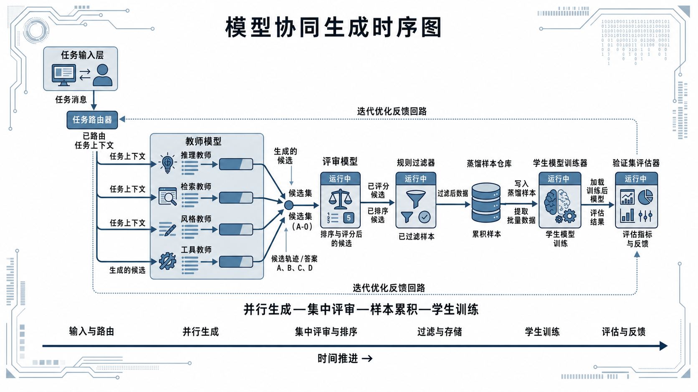
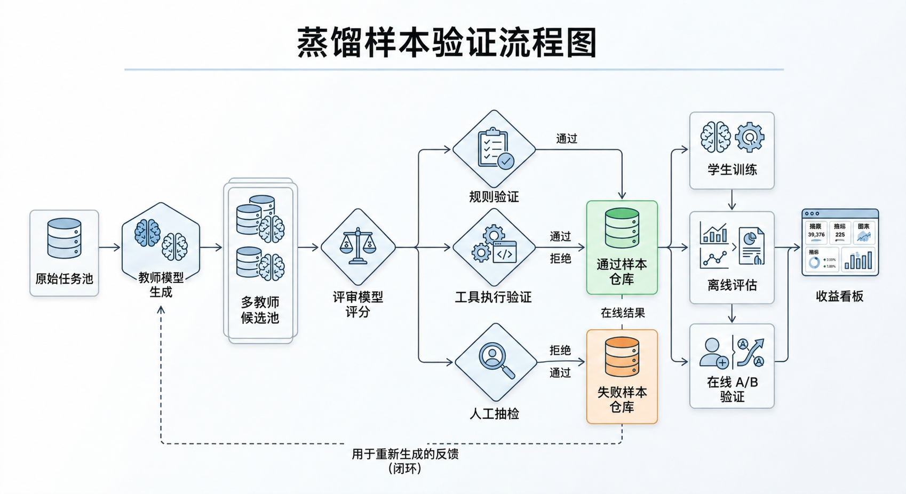

# 第16章 知识蒸馏与模型协作

大模型进入工程化落地阶段后，团队不再只关注“能不能找到一个更大的教师模型”，而是开始关注多个模型如何协同生产样本，以及这些能力能否稳定、低成本地迁移到学生模型上。对负责蒸馏流程的团队来说，难点并不只是训练出一个学生模型，而是要把样本生成、质量验证和能力迁移串成一条可以长期复用的流程。

本章讨论的重点，不是把蒸馏理解为一种孤立的训练技巧，而是把它放回整个数据与模型协作系统中重新理解：教师模型如何分工，裁判模型如何介入，学生模型如何接收和吸收能力，合成样本如何设计，蒸馏路径如何选择，教师偏差如何控制，收益又该如何验证。我们尤其强调一个工程判断：蒸馏不是“把大模型答案喂给小模型”这么简单，而是一次围绕目标能力进行的结构化再生产过程。只有当样本结构、角色分工、验证链路和收益核算都被设计清楚时，蒸馏才会真正成为一个稳定的系统能力。

---

## 16.1 为什么蒸馏的核心在于样本而不在于口号

很多团队会把知识蒸馏概括成“把大模型能力压缩给小模型”。这个说法没有错，但还不够具体。蒸馏能不能起作用，关键不只是训练框架或 loss 设计，而是样本里有没有把学生模型需要学习的能力表达清楚。教师模型输出的内容，如果不能和学生输入形式、业务约束、线上目标形成清晰映射，那么所谓蒸馏就只是在复制表面答案，而不是迁移可用能力。

从工程视角看，蒸馏并不是一次“模型压缩动作”，而是一套围绕目标任务重新组织知识表达的过程。教师模型虽然拥有更高的参数容量、更强的泛化能力和更丰富的内部表示，但这些优势不会自动转化为学生模型的可部署能力。真正发生迁移的载体不是“教师模型本身”，而是教师模型经过任务化、结构化、筛选化之后所生成的样本。蒸馏更像是把教师模型中有用的能力拆出来，再整理成学生模型能学的样本。学生真正学习的不是教师模型本身，而是这些经过筛选和重组后的训练信号。

很多团队在推动蒸馏项目时，会把注意力集中在模型大小、蒸馏框架、训练轮数甚至显卡预算上，却忽略了一个更根本的问题：学生最后究竟应该学到什么。是学会更稳定地输出标准答案，还是学会在复杂场景中进行一步一步的判断；是学会模仿教师的表达风格，还是学会教师在关键节点上的决策逻辑；是学会在有工具辅助时执行既定流程，还是在纯语言环境下做可靠推断。这些问题如果不先回答清楚，后续的样本生产就只能是表面热闹，学生模型也很难得到真正可迁移的收益。

### 蒸馏失败往往不是训练算法失败，而是样本设计失败

蒸馏效果不好时，团队往往会先调学习率、换优化器、增加训练步数，或者尝试新的 loss。但在实际项目里，更常见的问题是样本没有说清楚学生到底要学什么。如果教师输出是完整的长答案，但学生上线后只需要做短格式决策，那么样本过长、信息稀释，学生学习到的往往是冗余表达而不是决策能力。反过来，如果学生要承担复杂推理，但蒸馏样本只保留最终标签，没有中间依据和判断框架，那么学生学到的也只是结果模仿，而不是决策逻辑。

因此，蒸馏样本设计的第一原则不是“多收集答案”，而是先明确能力单元。一个能力单元可能是分类判断，可能是结构化抽取，可能是长文本重写，也可能是工具选择与调用。只有先界定能力单元，再决定样本中保留哪些字段、哪些轨迹、哪些解释、哪些约束，蒸馏才会落到实处。很多训练看似“收敛正常”，却在线上表现平平，本质上不是学生学不会，而是训练集没有把要学的东西表达清楚。

更具体地说，蒸馏失败往往来自三类样本设计错误。第一类错误是监督目标错位。教师输出看上去质量很高，但它对应的并不是学生真实要执行的任务形式。例如，业务要求学生完成结构化字段抽取，样本却提供了大段自然语言说明；业务要求学生做低延迟分类决策，样本却包含长篇论证。第二类错误是样本字段残缺。团队只保留了“问题—答案”这组最简单的配对，却删掉了教师进行判断时使用的关键证据、约束条件和失败边界。这样训练出来的学生往往会答题，但不会判题。第三类错误是样本分布失真。教师生成的数据在语气、长度、主题覆盖、难度结构上与真实业务分布差异很大，导致学生在离线集上表现不错，线上却难以适应真实输入。

这也是为什么许多蒸馏项目会出现一种错觉：团队觉得自己“已经喂了很多高质量教师答案”，却仍然没有显著收益。问题并不在于答案数量不够，而在于这些答案没有被组织成学生可学习的形式。对蒸馏团队来说，样本不能生成完就直接拿去训练，还需要筛选、压缩、改写和验证。样本设计本身就是蒸馏流程的一部分，不能只当成训练前的准备工作。

### 能力单元先于样本规模

蒸馏项目早期很容易过早追求规模。教师模型能稳定生成结果后，团队往往会马上批量造数据，希望靠数量补设计上的不足。但蒸馏不同于预训练，样本数量不是唯一重点，更重要的是这些样本是否对准了学生要学习的能力。如果能力单元没有先定义清楚，样本规模越大，错误监督也会越系统地被放大。

这个问题在项目初期尤其容易被忽视，因为“先多做一些”听起来总是很有安全感。数据量一上来，团队会觉得产能稳定了，流程跑通了，训练也有东西可以投喂了。可蒸馏和通用语料扩充不是一回事。预训练阶段，数据量本身就是能力来源的一部分；蒸馏阶段，数据更多是在传递一种有方向的监督信号。如果这个方向本身没有定清楚，那么批量化带来的就不是能力积累，而是偏差复制。说得直白一点，蒸馏里最怕的不是样本不够，而是很大一批样本都在教学生学错东西。

所谓能力单元，指的是学生需要稳定掌握的一种最小可评估能力片段。它可以是“根据用户输入判断是否调用工具”，也可以是“根据法规条文抽取责任主体”，还可以是“在检索结果中筛选支持结论的关键证据”。把蒸馏任务拆成能力单元的目的，不只是为了数据标注方便，更是为了让教师输出、样本字段和学生目标形成可追踪的对应关系。只有当一个能力单元是清楚的，团队才能知道应该蒸馏答案、蒸馏过程、蒸馏风格，还是蒸馏工具轨迹。

这一步很重要，因为同样是问答样本，实际训练目标可能完全不同。有的样本训练事实抽取，有的训练证据归纳，有的训练边界表达，还有的训练语气控制。如果不提前拆清楚，所有样本都会被笼统归到“问答能力”下面。要是不先把这些东西拆开，所有样本都会被笼统地归到“问答能力”下面，结果学生到底学到了什么，团队自己都很难说清。训练时看起来损失下降了，评估时也许局部指标还能涨一点，但一换场景或者一做错误归因，就会发现整套监督信号其实是糊在一起的。

能力单元明确之后，样本设计才有了边界。比如，对于“是否需要调用外部工具”这种判断任务，样本的关键不在于教师后面写了多少解释，而在于是否把输入上下文、触发条件、调用决策和错误反例保留下来。再比如，对于“长文本规范改写”这种任务，学生更需要学的是风格约束、信息保真和篇章结构，而不是教师在生成过程中所有的冗长思考。一个团队如果能先把任务拆解成若干明确的能力单元，再分别设计蒸馏样本结构，那么后续无论是教师替换、裁判升级还是学生换代，整条链路都会更可控。

更进一步说，能力单元还决定了评估该怎么做。没有能力单元时，团队往往只能看一个很泛的总指标，比如“整体效果”“总体可用率”“平均正确率”。这种指标当然有用，但很难告诉你问题到底出在哪。学生如果在工具调用任务上老是选错时机，和它在证据筛选任务上经常漏掉关键句，训练修法完全不是一回事。只有能力单元先被定义出来，评估才可能跟着拆开，团队才能真正回答“学生到底不会什么”“是不会做，还是会做但不稳”“是输出格式有问题，还是任务边界没学会”。

这也是为什么成熟团队通常不会一开始就追求“统一大样本池”。他们更愿意先做一小批边界清楚、目标单一的能力单元数据，把教师输出方式、样本字段、评估方法和业务目标先对齐。这个阶段的数据量可能并不大，但价值很高，因为它奠定了后面放量时的监督方向。等这些能力单元各自跑通之后，再考虑怎么扩规模、怎么拼接、怎么做课程式投喂，整个蒸馏流程才不容易失控。

从工程管理的角度看，“能力单元先于样本规模”其实是在提醒团队：蒸馏不是把教师模型的产能转化成数据量，而是把教师模型的优势拆成学生真正能学、能评、能部署的若干块能力。顺序一旦反过来，团队就很容易陷入一种看似忙碌但产出模糊的状态：数据越来越多，训练反复进行，学生模型却始终没有形成几个稳定、可解释、可复用的能力增长点。

### 不是所有教师输出都值得保留

教师模型输出并不天然等于高价值样本。即便教师整体能力远强于学生，它也仍然可能输出冗余内容、局部错误、风格失衡、边界过度自信甚至不符合业务规范的答案。如果团队把教师输出视为“自动真值”，那么蒸馏过程就会退化成错误与噪声的高效复制机制。

**代码示例：把“长教师答案”压缩成学生友好的结构化监督**

下面示例演示一个常见的“表示映射”做法：把教师长答拆成 `final/理由/限制条件` 三段（更利于小模型学稳边界），并保留最关键的元信息（教师来源、裁判分、是否进入主训练集）。

```python
from dataclasses import dataclass


@dataclass
class DistillSample:
    prompt: str
    final: str
    rationale: str
    limits: str
    meta: dict


def compress_teacher_answer(prompt: str, teacher_text: str, *, teacher_id: str, judge_score: int) -> DistillSample:
    # 教材示例：用简单分隔符演示“结构化裁剪”
    # 工业实践中通常由审稿任务/裁判模型/规则系统生成这些字段
    parts = [p.strip() for p in teacher_text.split("###") if p.strip()]
    final = parts[0] if parts else teacher_text.strip()
    rationale = parts[1] if len(parts) > 1 else ""
    limits = parts[2] if len(parts) > 2 else ""

    return DistillSample(
        prompt=prompt,
        final=final,
        rationale=rationale,
        limits=limits,
        meta={
            "teacher": teacher_id,
            "judge_score": judge_score,
            "use_for_training": judge_score >= 4
        }
    )


if __name__ == "__main__":
    p = "用户：信息不足时应该怎么答？"
    t = "结论：先说明限制条件，再提出最小必要追问。###理由：避免在证据不足时强答。###限制：高风险场景优先安全分流。"
    s = compress_teacher_answer(p, t, teacher_id="teacher_v5", judge_score=5)
    print(s)
```

这一点在实际项目里很常见。团队一开始往往会对强教师有一种天然信任，觉得既然它整体表现远好于学生，那把它的输出直接留下来，总归比人工一点点重写更划算。这个判断并不完全错，但它少了一步很关键的过滤：教师强，不等于教师在任何任务上、任何表达形式上都适合作为学生的学习材料。教师模型本身也有自己的生成习惯，有时喜欢铺陈，有时偏好过度解释，有时为了让答案显得完整，会补上一些学生其实不该学的语气和结构。要是这些东西都不加筛选地原样保留，学生学到的就不只是任务能力，还有一整套并不一定适合自己的表达负担。

因此，在蒸馏链路中，一个很重要但又常被忽略的判断是：教师的哪些部分值得保留，哪些部分应该被压缩，哪些部分应该被删除，哪些部分甚至应该被改写。教师模型的长链式解释可能对研究者有启发，但未必适合学生吸收；教师模型的复杂修辞可能显得高级，但未必利于小模型形成稳定行为；教师模型对边界问题的自信表述可能提高可读性，却可能把本不应确定的判断强行固定下来。

真正麻烦的地方在于，教师输出里“看起来好”的部分，并不总是“适合学”的部分。比如一个大模型在开放式问答里写出一段层次分明、铺垫充分的长回答，人读起来会觉得很完整，但学生模型的部署场景也许只需要一个短而稳的答复。再比如教师为了增强说服力，会在不完全确定的情况下给出较强语气，人类评阅者可能一时觉得它表达清楚，但如果学生把这种语气学实了，后面一进高风险场景就可能出边界问题。蒸馏真正要问的，从来不是“这个回答看起来强不强”，而是“这个回答里哪些东西值得让学生模仿”。

这意味着，蒸馏并不是简单的数据搬运，而是一种带有编辑性质的知识重构过程。优秀的蒸馏团队更像是“样本编辑者”，而不是“样本转运者”。他们不追求把教师说过的话全部留下，而是追求把教师真正有助于任务完成的部分抽出来、整理好、压缩清楚，然后交给学生学习。

这里面最考验团队判断力的，往往不是发现教师显而易见的错误，而是识别那些“局部看没问题，整体却不该保留”的内容。比如教师的某些长解释并不错误，但和学生最终部署目标不匹配；某些礼貌性扩展并不违规，但会拖慢回答节奏；某些高层次总结确实有启发，但对小模型来说过于抽象，反而不如明确、结构化的中间标签更容易学。说到底，蒸馏不是在做教师输出的存档，而是在做学生学习材料的剪辑。

所以在成熟的蒸馏流程里，教师输出后面通常都会跟着几步“编辑动作”。有的任务适合保留结论、压缩解释；有的任务适合保留关键中间状态、去掉修辞；有的任务适合只抽出工具决策和结果整合，不保留教师长篇思考；还有些任务则需要在保留教师骨架的同时，重新写一遍更适合学生容量和业务要求的版本。只有经历了这层编辑，教师输出才真正开始接近高价值蒸馏样本。

从这个意义上说，教师模型越强，团队越不能偷懒。因为强教师更容易生成“看起来很像完整答案”的内容，团队也就更容易放松警惕，误以为只要批量保存就够了。实际上，越是能力强的教师，越可能带着大量高层表达习惯和隐含推理捷径，这些东西对研究者可能很有价值，对学生却未必友好。蒸馏做得好不好，常常就差在这一步：有没有把教师输出当材料处理，而不是当真值照搬。

### 教师输出、学生输入与业务目标之间的映射

在蒸馏工程里，教师输出只是中间材料。关键在于如何重新组织这些材料，让它们变成适合学生学习的输入—输出样本。教师模型往往具有更长上下文、更强推理能力和更复杂的表达风格，但学生模型的部署目标通常受到成本、延迟、上下文长度和推理稳定性的约束。因此，教师输出不能原样下传，而需要经过任务映射。

这种映射至少包含三层。第一层是任务映射，即教师回答的内容是否对应学生最终承担的任务边界。第二层是表示映射，即教师的长链式分析是否要压缩为短解释、标签、步骤提要或工具调用序列。第三层是目标映射，即样本到底服务于准确率提升、风格统一、工具成功率提升，还是延迟降低后的质量兜底。只有把这三层映射对齐，蒸馏数据才不会出现“教师很强，学生很忙，但结果并不更好”的情况。

先说任务映射。教师能做的事情通常比学生最终上线要做的事情多得多。教师可以一边解释、一边扩展、一边补充背景，还能顺手给出若干替代方案；但学生也许只需要在一个固定流程里做判断、抽取或者短答。如果不先把任务边界对齐，教师输出再好，也可能是在教学生做一些自己根本不需要做的事。最常见的后果就是学生回答越来越长、越来越花，却没有更贴近业务目标。看起来像能力提升了，实际是在学错方向。

再说表示映射。教师的表达形式不一定适合学生直接吸收。一个大模型可以靠长链式推理把复杂问题拆得很细，也能在上下文里自然穿插多个中间判断，但学生模型的容量、上下文预算和推理稳定性未必支撑得住同样的表示方式。这时候团队就要判断：到底该给学生看完整过程，还是只给关键步骤；该保留自然语言解释，还是改成结构化标签；该让学生学冗长分析，还是只学最后的决策依据。表示映射做不好时，学生最容易出现一种情况：好像什么都学了一点，但没有一个地方真正学稳。

第三层是目标映射。蒸馏并不是抽象地“让学生更像教师”，而是要回答一个非常实际的问题：学生上线之后到底靠什么创造价值。是要在同样预算下接近教师质量，还是要在更低延迟下维持核心任务可用，还是要在工具调用、格式稳定、领域口径这几个方面做质量兜底。不同目标，决定了蒸馏样本该保留什么、强调什么、牺牲什么。要是这一层不明确，团队就会习惯性地把“尽量多保留教师信息”当成稳妥选择，最后学生学到一堆成本高、收益却不稳定的东西。

从业务视角看，蒸馏样本设计本质上是在做一种能力翻译：把高容量模型中的隐性能力，翻译成学生模型可吸收、可泛化、可部署的显式训练材料。这里最忌讳的是把教师输出当作天然真理直接灌入学生，因为教师的表达风格、冗长习惯和错误模式，并不一定符合学生上线的最优策略。

这种“翻译”之所以难，是因为它不是简单压缩字数那么直接。很多时候，团队面对的是一种结构转换。教师也许是通过长文本分析完成判断，学生却更适合学一个短标签加一个简要理由；教师也许通过连续几轮推理决定是否调用工具，学生却更需要一个明确的触发条件和几个边界反例；教师也许给出了一大段风格优美的规范改写，学生真正该学的却是篇章顺序、信息保真和语气约束。换句话说，映射做得好时，学生接收到的是“能力骨架”；映射做不好时，学生接收到的只是“教师说话的表面样子”。

进一步看，这种映射并不是一次性完成的，它通常要经过多轮迭代。很多团队第一次做蒸馏时，会先把教师答案完整保留，训练出一个“会说很多但不够稳”的学生；第二轮开始意识到需要压缩字段、统一格式、加入边界标签；第三轮才逐步形成真正适合学生容量和业务目标的样本结构。这说明蒸馏里的映射不是理论推导出来的，而是在业务验证中逐步校准出来的。越早把“教师输出不等于学生输入”这个原则建立起来，后续试错成本就越低。

真正成熟的团队，往往不会把这种映射当成临时加工步骤，而会把它做成一套可复用的工程方法：什么任务保留结论，什么任务保留短过程，什么任务要加入反例，什么任务只抽工具轨迹，什么任务必须重写成学生能稳定学习的格式。等这套方法逐渐稳定以后，教师即使换代，学生即使换规模，业务目标即使调整，蒸馏链路也不至于每次从头摸索。归根到底，蒸馏的核心不是“把更强模型的输出喂给更弱模型”，而是“把更强模型的能力翻译成更弱模型真正用得上的训练材料”。这中间差的，正是映射这一层。

### 任务映射：先回答“学生到底负责什么”

任务映射是三层映射中最根本的一层。很多蒸馏问题表面上是数据质量问题，实际上是任务边界没有划清。教师模型往往可以处理比学生更宽的任务范围，于是团队很容易贪多，把教师在一个大任务中展示出的全部能力都塞给学生。但学生上线通常不是为了替代教师的一切，而是为了接管其中高频、可标准化、可验证的那一部分。如果这一层边界不先划清，样本再精美也很难形成稳定收益。

例如，在一个企业问答系统中，教师可能同时具备知识问答、风格润色、事实归纳、风险提示甚至多轮澄清能力，但学生模型的真实职责也许只是“在知识库命中的情况下输出结构化答案”。这时，如果把教师所有行为都放进蒸馏样本，学生反而会学到许多并不需要承担的模式，导致模型既重又不稳。任务映射的意义，就是先把“学生必须会的”“学生最好会的”和“学生不应该负责的”区分开。

蒸馏做得好的团队，往往在项目最开始就会写出一份学生职责说明书。这份说明书不是技术文档，而是一种能力边界定义：学生在哪些场景必须做出确定回答，在哪些场景应该拒答或回退，在哪些任务上只需输出短结论，在哪些任务上需要保留解释字段。有了这样的边界，教师输出才知道该往哪里收敛，样本设计也才不会变成漫无目标的“尽量多保留”。

### 表示映射：教师能说很多，不代表学生应该都学

表示映射的核心问题，是教师能力以什么形式被学生吸收。教师模型可能通过长链分析完成了一次高质量推理，但学生并不一定要复现这条完整链路。对于容量有限、部署受限的学生模型来说，关键往往不是重放教师所有思考，而是学习教师在关键节点上的判断框架。

这件事在蒸馏里很容易被误判。团队看到教师模型回答得又长又全，往往会本能地觉得，既然这些内容帮助教师得出了好结果，那学生也应该把这些内容一起学下来。可现实往往不是这样。教师之所以能承载很长的分析链条，是因为它本身有更大的参数容量、更长的上下文预算，也更能容忍中间过程里的冗余和反复。学生模型却常常没有这种余裕。它上线时面对的是更紧的时延、更短的上下文、更少的推理空间。这个时候，把教师整段整段的长分析原样喂给学生，结果往往不是“学得更完整”，而是“学得更吃力、更不稳”。

同一个教师输出，可以被转写成多种样本表示。它可以被保留为完整答案，也可以被拆成“输入—结论—关键依据—限制条件”；可以被压缩为“问题分解—证据定位—最终判断”；也可以被改写成“何时调用工具—调用什么工具—根据结果如何收束”。不同表示方式，对学生学习效果影响极大。很多小模型之所以学不动，并不是因为任务太难，而是因为样本表示方式过于贴近教师视角，而没有适配学生的容量和任务边界。

这里真正要抓住的，不是教师说了多少，而是教师究竟在哪几个地方做出了对结果最关键的判断。比如一条法律问答，教师可能写了大段背景梳理、条文解释、条件补充和类比说明，但学生真正需要学的，也许只是三件事：先锁定适用条款，再区分已知事实和待确认事实，最后在信息不足时保留结论边界。再比如一次工具调用任务，教师可能会先分析用户意图，再展开若干候选路径，最后才决定调用哪个接口。可学生模型未必需要复现这整段自然语言分析，它更需要学会的是“什么输入特征触发工具调用”“什么参数是必填”“调用失败后应该如何回退”。

所以，表示映射不是一个单纯的压缩动作，它更像一次重写。团队不是把教师答案删短一点就结束了，而是要重新判断：哪些内容是任务骨架，哪些内容只是教师表达得比较充分；哪些步骤对学生来说是必要支撑，哪些步骤只是教师在大容量条件下自然生成出来的铺垫。这个判断做得好，学生吸收的是结构；这个判断做不好，学生吸收的就只是表面热闹。

从这个角度说，表示映射其实是在做监督信号重编码。教师输出是“原始知识表达”，蒸馏样本则是“训练友好表达”。这两个层面不应混为一谈。对一本面向工程团队的书来说，必须强调这一点：蒸馏不是保存教师的表达习惯，而是提炼教师的有效决策结构。

这一点在不同任务里会表现得很不一样。开放式问答里，学生也许适合学“简短结论 + 一条核心依据 + 一句限制说明”；结构化抽取里，学生更适合学字段定义、抽取边界和缺失值策略；多跳检索里，学生未必需要教师完整的自然语言推理，更需要学“先找什么，再筛什么，最后怎么合并”；规范改写里，学生也不一定要模仿教师所有修辞，而是要抓住篇章顺序、语气约束和信息保真。也就是说，表示映射没有一种通用答案，它必须跟着任务目的走。

很多蒸馏项目真正的问题，不是教师不够强，而是团队太舍不得丢东西。总觉得教师既然都算出来了、都写出来了，不保留好像很可惜。可对学生来说，最贵的往往不是信息不够，而是无关信息太多。学生一旦被迫同时学习结论、长解释、修辞风格、铺垫方式和教师自己的思考习惯，就很容易出现一种“什么都沾一点，但哪一块都不够稳”的状态。训练看起来很努力，真正落到部署上却不划算。

因此，表示映射最终考验的，其实不是压缩技术，而是任务理解。团队得先知道学生到底要学什么，才知道教师输出里什么该留，什么该砍，什么该改写，什么该变成标签、结构字段或者中间状态。只有这一步先做对了，蒸馏样本才会越来越像学生的训练材料，而不是教师答案的存档副本。

### 目标映射：蒸馏不是单一指标优化

目标映射回答的是另一个常见误区：蒸馏样本到底在为哪类收益服务。很多团队默认蒸馏的目标就是“提高准确率”，但在实际项目中，蒸馏经常承担的是多目标任务。它可能是为了让小模型在维持基本质量的前提下降低时延，也可能是为了让输出更稳定一致，还可能是为了把工具调用流程标准化，减少线上错误率。若不明确这一点，团队很容易在样本设计时用错导向。

“提高准确率”当然是一个合理目标，但它往往只是表层目标，不一定是业务真正最在意的东西。很多系统上线以后，最痛的点其实不是模型偶尔答错，而是它答得忽长忽短、边界忽松忽紧、工具有时会调有时不会调、同一类任务前后口径不一致。对业务方来说，这些问题未必会直接体现在一个简单的准确率数字上，却会持续消耗用户体验、系统稳定性和人工兜底成本。蒸馏如果只盯着准确率，很容易把这类真正影响部署质量的问题放过去。

例如，如果蒸馏目标是低成本替换大模型，那么样本设计就应优先围绕高频、稳定、规则清晰的任务展开，而不是执着于开放式长尾问题。反之，如果蒸馏目标是强化垂直领域质量，那么样本就应更多保留领域术语、边界定义、风险提示和错误反例。又比如，如果蒸馏目标是提升工具调用成功率，那么样本中的关键监督信号就不是答案本身，而是调用时机、参数构造、错误恢复和执行后收束方式。

这背后其实是一个很现实的判断：学生模型最终要在哪个位置创造价值。要是它承担的是高频入口任务，比如客服首轮响应、企业内部知识问答、常规表单抽取，那么更重要的可能不是把最难的问题答到极致，而是把大量常见问题做得稳、快、便宜。相反，要是它承担的是垂直高价值场景里的第一层质量兜底，那么样本设计就不能只追求吞吐和平均表现，而要把边界、术语、领域口径和高风险反例放得更重。目标不同，样本就不该长得一样。

很多团队一开始做蒸馏时，会默认把教师在离线基准上的优势尽量搬给学生，觉得这样总不会错。可真正到了部署里，常常会发现学生虽然在某些离线题上进步了，线上收益却并不明显。原因不是蒸馏没起作用，而是蒸馏信号服务的目标和业务想要的目标本来就不完全一致。比如教师特别擅长开放式解释，团队于是保留了大量长答案样本，结果学生学得更会“写”，却没有更会“办事”；又比如团队一心想让学生更像教师，在回答中保留了很多铺垫和修辞，结果上线后时延没降多少，风格却变得更重，反而偏离了原本追求低成本替换的初衷。

因此，所谓目标映射，本质上是在回答“蒸馏到底为谁服务”。是为模型排行榜服务，还是为部署指标服务；是为离线集表现服务，还是为真实流程成功率服务。这个问题如果不先讲清楚，后续所有样本设计都可能在错误方向上越做越深。

这一步之所以关键，是因为蒸馏里的很多取舍，本来就不能脱离目标来谈。比如要不要保留教师的长解释，要不要加入更多反例，要不要牺牲一点开放式能力去换结构化稳定性，要不要优先覆盖高频任务而不是困难长尾，这些都不是抽象的“好不好”，而是看它们是否符合当前项目最核心的收益方向。没有目标映射时，团队很容易掉进一种“什么都想要”的状态：既想让学生接近教师的综合能力，又想让它更快、更稳、更便宜，还希望它顺便解决所有线上问题。最后样本越来越杂，训练目标越来越混，谁也说不清这批数据到底是在优化什么。

从工程上看，目标映射最好尽量提前，并且写得足够具体。比如“用 7B 学生替换 70B 教师承担 80% 的高频问答流量，同时将平均时延压到原来的三分之一以内”；或者“在不显著增加推理成本的前提下，提高工具调用成功率和参数合法率”；再或者“在垂直法务场景中，优先保证边界表达和术语口径一致，允许开放式延展能力略弱”。只有把目标说到这个程度，样本字段、教师过滤、裁判标准和学生评估才会自然跟着收敛。

进一步看，目标映射还会决定团队如何看待“蒸馏失败”。如果目标是低成本替换，那么学生没有学会教师那些特别长、特别复杂的开放式分析，未必算失败；如果目标是提升工具链稳定性，那么学生在闲聊能力上没什么变化，也不一定重要。反过来，要是团队一开始没有把目标讲清楚，后面看到学生“少了点什么”，就很容易本能地把所有差异都当成退化，结果不断往样本里加东西，最后把原本清晰的蒸馏任务又做回了一锅大杂烩。

目标映射要解决的是：这次蒸馏到底为了什么。目标明确后，团队才知道哪些教师能力值得优先迁移，哪些样本需要多做，哪些字段必须保留，哪些表达可以删掉，以及哪些指标提升才算真正有价值。蒸馏做得好不好，到最后从来不只看学生像不像教师，而是看学生有没有以更合适的成本和形式，完成原本想让它承担的那部分工作。

### 蒸馏收益的边界：压缩、迁移与专精

蒸馏并不是一条无限增益的路径。团队在推动蒸馏时，必须清楚蒸馏收益到底来自哪里。第一类收益是压缩，即把大模型在某类任务上的可用能力转移给更小、更快、更便宜的模型，以换取推理成本和延迟上的优势。第二类收益是迁移，即借助强教师模型为弱监督或稀缺场景生成高质量伪标签，让学生快速获得某类能力。第三类收益是专精，即通过多轮蒸馏和筛选，把某个垂直场景的知识、规范和风格固化到一个更轻量的专业模型中。

但蒸馏也存在边界。对于极强的开放域推理、长程复杂规划或高度依赖最新外部知识的任务，蒸馏往往只能迁移“常见模式”，难以完整迁移“实时能力”。当业务变化极快、数据分布频繁漂移时，蒸馏的收益也会被维护成本侵蚀。换句话说，蒸馏适合把相对稳定、频繁出现、可结构化定义的能力沉淀下来，而不适合拿来替代所有在线智能。

因此，蒸馏项目的正确姿势不是追求“学生全面替代教师”，而是明确学生应该在哪些任务上接管，在哪些边界场景下继续回退到教师或检索系统。蒸馏的价值，常常来自合理分工，而不是一味追求缩小模型差距。

进一步说，压缩、迁移与专精这三种收益虽然经常被同时提及，但它们对应的工程逻辑并不相同。压缩更关注的是成本与性能平衡，迁移更关注的是数据稀缺条件下的能力引入，专精则更关注长期业务稳定性。一个项目若同时追求三者，就必须接受取舍：过于强调压缩，可能会牺牲长尾能力；过于强调迁移，可能会引入教师偏差；过于强调专精，可能会让学生在分布变化时失去弹性。蒸馏团队要做的不是否认这些矛盾，而是把它们显式地写进设计里。

### 什么时候不应该继续蒸馏

在实践中，还有一种同样重要但经常没人愿意明说的判断：有些问题本来就不适合继续靠蒸馏解决。比如，当学生模型的主要错误已经不是“不会回答”，而是“缺少最新知识”“缺少真实环境状态”“缺少工具返回结果”时，继续增加教师样本往往只能带来非常有限的改善。此时，真正需要补的不是蒸馏数据，而是检索链路、工具接入或真实交互数据。

再比如，当教师本身在某类任务上表现并不稳定，或者教师之间存在明显分歧，却没有成熟的裁判与验证机制时，盲目蒸馏只会把不稳定性固化给学生。蒸馏并不能替代真实验证，也不能掩盖上游知识与流程问题。一个成熟团队应该能识别蒸馏的停止信号：当样本越做越多，但线上收益趋近于零；当学生越来越像教师，却并没有越来越像业务需要的系统；当维护样本仓库的成本开始高于直接调用教师的成本时，就应当考虑暂停扩蒸，转向真实数据、流程优化或系统分工重构。

---

## 16.2 教师、裁判与学生的角色分工

多模型协作不是简单地把多个模型串起来，而是围绕样本生产、质量控制和能力迁移建立有边界的分工体系。教师负责生成，裁判负责约束，学生负责吸收。只有角色清晰，协作链路才不会变成一条不可解释的黑箱流水线。对于需要长期维护的蒸馏系统而言，模型分工清晰比单次峰值表现更重要，因为这决定了后续能否稳定扩展任务、替换模型和定位问题。

从系统工程角度看，角色分工的本质，是把原本集中在单个大模型身上的责任拆开。过去很多团队习惯让一个强模型既负责思考、又负责回答、还负责自我校验，似乎这样链路最短、实现最简单。但只要任务开始变复杂，尤其涉及高风险领域、多工具环境或多样化输出要求时，这种“一个模型包办所有事情”的方式就会迅速暴露问题：错误难归因、边界难控制、样本难筛选、成本难优化。于是，多模型协作的价值便体现出来了。它不是为了制造复杂性，而是为了让系统内部的责任更明确，让不同能力可以被独立优化。

在蒸馏链路里，教师模型、裁判模型和学生模型各自承担不同职责。教师模型的核心任务是生产候选知识与行为样本；裁判模型的核心任务是把控质量、决定取舍、识别偏差；学生模型的核心任务则是在受限容量下吸收最值得沉淀的部分。若这三种角色没有明确边界，团队很容易把一个环节的问题归咎给另一个环节。例如，教师输出质量波动时，错误地去调学生训练；裁判标准不稳时，误以为是教师不够强；学生容量不足时，又盲目加大教师数量。清晰的角色分工，不只是为了更好地组织系统，更是为了后续诊断与演进。

### 单教师、多教师与专家混合策略

单教师策略适合任务定义清楚、目标风格统一、教师能力与业务要求高度一致的场景。例如，某个垂直领域问答系统只需要一个高质量通用教师模型生成答案，再辅以规则过滤，就可以构建第一版蒸馏数据集。单教师的优点是链路短、实现快、样本风格统一，缺点是容易把同一种偏差、同一种表达方式和同一种错误模式规模化复制给学生。

多教师策略的价值在于互补。不同教师可以分别承担推理、检索总结、结构化抽取、风格改写等角色，从而把一个复杂任务拆解成若干可验证的小能力模块。例如，在法律或金融场景中，可以由一个教师负责法规定位，一个教师负责条款解释，一个教师负责答案重写与风险提示，再由裁判模型统一检查事实一致性和格式合规性。这样做的好处，不只是提高质量，更重要的是降低单一教师偏差被整体继承的风险。

再进一步，专家混合策略强调的不是“模型越多越好”，而是“模型只在擅长的地方出手”。在这种模式下，系统会先做任务识别，再路由到适合的专家模型生成样本。真正成熟的多模型协作系统，关注的不是平均能力，而是任务匹配能力。只有在模型分工和任务边界同时清晰时，多教师协作才不会变成高成本堆叠。

不过，单教师、多教师与专家混合并不是简单的“三选一”关系。在很多实际项目中，它们往往对应不同阶段。系统初期，为了快速验证蒸馏闭环，团队通常会先采用单教师直蒸，让流程先跑起来；当发现单教师风格单一、边界不稳或覆盖不足时，再引入第二个甚至第三个教师构成竞争关系；当任务类型开始明显分化、通用教师已无法兼顾全部场景时，专家混合策略才真正显出价值。也就是说，模型分工不是一开始就设计到极致，而是随着任务复杂度上升逐步细化的。

### 单教师策略为何经常是起点而不是终点

单教师策略之所以常见，并不是因为它最优，而是因为它最容易启动。一个团队只要有一个质量较高的教师模型，就能迅速开始生成样本、训练学生、验证最初收益。这对于项目立项和流程打通非常重要，因为很多蒸馏项目在早期最需要的不是完美设计，而是证明“这条路是能跑通的”。

但单教师策略最大的结构性问题，在于它会把教师的优点和缺点同时放大。若教师特别擅长某种表达风格，学生会很快学会这种风格；若教师在某些边界问题上有惯性偏差，学生也会同样迅速继承这些偏差。更重要的是，单教师样本通常在语言分布上比较单一，学生容易形成“熟悉格式下表现很好，稍有变化就不稳”的现象。很多蒸馏项目前期看起来很成功，后期一到真实环境就开始失真，本质上往往就是单教师样本的分布太窄。

因此，单教师策略更适合被理解为起点方案。它帮助团队快速建立数据生产、样本筛选、学生训练和初步验证的链路，但一旦进入更复杂的业务阶段，就必须开始思考如何引入多样性、如何控制偏差、如何让样本更贴近真实分布。否则，单教师方案越做越大，后续替换和修正的成本反而越高。

### 多教师不是简单叠加，而是职责分解

多教师策略真正有效的前提，不是教师数量增加，而是职责被合理拆开。若只是让多个通用教师对同一个问题重复回答，再从中随意选一个最顺眼的结果，那么多教师带来的更多是成本，而不一定是增益。多教师协作之所以有价值，是因为它允许团队把一个复杂任务拆成多个局部任务，再让不同教师在各自最擅长的部分发挥作用。

例如，在一个面向复杂问答的蒸馏系统中，可以把整个任务拆为“证据获取—证据整合—答案生成—风格修订”四个阶段。检索型教师负责外部证据归集，推理型教师负责证据间的逻辑整合，写作型教师负责将结论转为符合业务规范的输出模板，最后由裁判统一评估事实一致性与格式完整性。在这样的分工下，多教师不是在重复劳动，而是在执行一条有明确责任边界的生产链。

这种职责分解还有一个重要好处：它使偏差更容易被定位。如果最后样本出现错误，团队可以判断问题出在证据获取、逻辑整合还是表达收束，而不是笼统地说“模型答错了”。对长期建设蒸馏系统的团队而言，这种可定位性比单次精度提升更重要，因为它决定了后续优化是有章可循，还是只能依靠经验反复试错。

### 专家混合策略的本质是任务路由

所谓专家混合策略，最核心的问题不是“用几个专家”，而是“什么任务该路由给谁”。如果没有明确的任务识别与路由机制，专家模型越多，系统越容易混乱。因为一旦错误任务被送进错误专家，后面再强的裁判也只能做事后补救，而不是事前预防。

专家混合策略适合那些任务之间差异已经大到无法依靠一个通用教师统一覆盖的场景。例如，法律任务中的条款引用、金融任务中的风险归因、客服任务中的情绪安抚、工具任务中的参数构造，这些能力在输入形式、正确性标准和输出要求上都相差很大。此时，与其继续逼一个通用教师做所有事情，不如通过前置识别把任务送到更适合的专家上。这样生成出来的样本，不仅质量更高，而且天然更利于后续做分领域蒸馏。

当然，专家混合也意味着系统复杂度上升。它要求前面有任务识别能力，中间有样本融合机制，后面还有统一的质量判定口径。若这些环节配套不足，专家混合反而会让流程难以维护。因此，这种策略更适合中后期、任务已稳定分层的系统，而不适合作为任何项目的默认起手式。

### 裁判模型在过滤、打分和排序中的作用

在很多蒸馏流程中，裁判模型常被误解为“事后验收工具”，但实际上，裁判模型是整个样本生产链路中的质量控制中枢。教师负责生成可能的答案，裁判负责决定哪些答案值得进入学生训练集，哪些只能作为失败样本保留，哪些需要退回重生成。没有裁判环节的多模型协作，很容易出现样本量迅速扩大，但数据质量同步失控的问题。

裁判的作用通常体现在三个层面。第一是过滤，即识别明显错误、格式不合规、工具调用失败、事实冲突或幻觉严重的样本。第二是打分，即从正确性、可读性、一致性、覆盖度、风格匹配度等维度给出细粒度评价。第三是排序，即在多个教师给出的候选结果中，选择最适合当前学生目标的样本版本。这里尤其要注意，裁判不是为了追求最“像教师”的答案，而是为了选出最适合学生学习的答案。

在工程实践中，裁判模型往往比教师更需要稳定性。教师可以探索多样化表达，但裁判必须保持评价口径尽量一致，否则训练集会出现隐形分布抖动。同样一个回答，如果在不同批次被裁判赋予完全不同的标准，学生学到的将是混乱的边界。也正因为如此，很多团队会把裁判策略与规则系统结合起来，用规则保证底线，用模型处理复杂判断。

**代码示例：蒸馏样本的“候选—裁判—入库”结构（JSONL）**

这类结构能同时服务“多教师竞争”“失败样本保留”“按置信度加权采样”等工程需求。

```json
{
  "id": "distill_000781",
  "prompt": "（任务输入）",
  "candidates": [
    {"teacher": "teacher_A", "text": "（候选A）"},
    {"teacher": "teacher_B", "text": "（候选B）"}
  ],
  "judge": {
    "winner_teacher": "teacher_B",
    "scores": {"teacher_A": 3, "teacher_B": 5},
    "reason_tags": ["边界更清楚", "结构更可执行"]
  },
  "store": {
    "train": {"teacher_B": true, "teacher_A": false},
    "failure_pool": {"teacher_A": true}
  },
  "meta": {"task_unit": "boundary_answering", "version": "v0.2.0"}
}
```

更进一步说，裁判模型在多模型协作中承担的是“系统记忆”的角色。教师可以变化，专家可以替换，学生可以迭代，但裁判标准如果能保持相对稳定，整个样本仓库就不至于在不同周期中出现口径漂移。这一点在长周期蒸馏项目里尤其关键。没有稳定裁判的系统，很容易出现第一期样本强调正确性，第二期样本强调表达性，第三期样本又强调长度压缩，最后学生学到的是互相冲突的信号。

### 过滤不是简单删样本，而是定义训练边界

很多人把过滤理解成“把错误答案去掉”，但在蒸馏系统中，过滤的真正作用是定义学生的学习边界。一个样本被过滤掉，不一定意味着它毫无价值；它也可能意味着这个样本不适合作为正向监督，却适合作为失败样本、拒答样本或对比样本存在。若团队把过滤仅仅当作删除动作，就会损失大量有价值的边界信息。

例如，某些教师答案在事实层面部分正确，但表达过于自信，或者遗漏关键限制条件。这样的样本若直接进入正例集，会误导学生形成错误习惯；但若被改造为“错误案例 + 纠正说明”，反而可以成为极具价值的反例监督。再比如，某些工具调用轨迹虽然最终失败，却非常清晰地展示了错误发生的原因和恢复路径。这类轨迹不适合当成功样本蒸馏，却非常适合用于训练学生识别失败条件。

因此，过滤不是把样本简单分成“要”和“不要”，而是在划定训练用途。哪些进入主训练集，哪些进入难例集，哪些进入对比集，哪些进入拒答集，哪些进入人工复查池，这些都是过滤策略的一部分。裁判模型的价值，不只是替团队节省人工，更是在帮助团队形成清晰的数据分层意识。

### 打分与排序决定学生看到什么样的世界

如果说过滤决定了哪些样本能进入系统，那么打分与排序决定了学生最终主要看到什么样的样本世界。因为学生模型的训练预算始终有限，不可能平等地吸收所有候选数据。蒸馏工程里最关键的一个事实是：学生并不是被“所有数据”塑造的，而是被“被选中的那部分数据”塑造的。

这意味着，打分标准本身就是一种隐性的教学大纲。若裁判更偏好语言流畅但不够谨慎的答案，学生会逐渐变得更会说但不一定更可靠；若裁判更偏好简洁保守的答案，学生可能会稳定，但在复杂场景中缺少解释性；若裁判特别强调格式合规，学生会更像一个规范执行器，而不是开放式生成器。因此，裁判模型的评分维度必须与学生目标一致，而不能停留在抽象的“总体质量更高”。

排序同样如此。在多教师竞争场景中，最终进入训练集的不是所有候选，而是经过排序之后最靠前的一批结果。这个过程实际上在决定学生看到哪种风格、哪种逻辑和哪种边界处理方式。换句话说，排序不是一个无关紧要的后处理步骤，而是蒸馏系统中塑造学生分布的关键控制点。

### 学生模型能力目标与训练配方设计

学生模型不应被当成缩小版教师模型。它有自己的能力目标和部署约束。训练配方应该从学生最终要承担的任务出发，而不是简单照搬教师模型的输出方式。一个面向客服质检的学生模型，追求的是稳定、低延迟、格式统一；一个面向领域问答的学生模型，追求的是事实一致性与术语规范；一个面向工具调用的学生模型，追求的是参数正确率和调用成功率。不同目标，对样本结构、训练轮数、负样本比例、难例保留策略都有不同要求。

因此，蒸馏训练配方不能脱离学生能力目标单独讨论。若学生目标是稳定短答，就不应过度依赖冗长解释链；若学生目标是复杂决策，就不能只蒸馏最终标签。更进一步，训练配方还要结合学生模型的容量边界。小模型最怕样本结构过度复杂、标签噪声过高、风格分布不一致。换句话说，教师越强，越需要有人负责把输出整理成学生真正学得动的形态。

还需要强调的是，学生模型的训练目标常常不止一个。在真实系统中，学生既要“会做”，又要“做得稳”，还要“做得便宜”。这意味着训练配方必须在质量、稳定性、可部署性之间平衡。很多蒸馏方案失败，不是因为学生学不到能力，而是因为训练目标过于理想化，既想保留教师全部长链能力，又想维持极低延迟和极小模型规模。一个成熟团队不会回避这些约束，而是会主动根据学生定位裁剪训练目标。

### 学生不是教师的缩略图，而是业务执行体

这是蒸馏工程里非常值得单独强调的一点。学生模型常被想象成“更小的教师”，但这种想法会误导整个系统设计。学生不是为了忠实复刻教师而存在的，它是为了在特定业务边界内稳定执行任务而存在的。只要学生在关键任务上足够可靠、足够便宜、足够快，它就已经完成了自身使命。

正因为如此，学生训练不应以“像不像教师”为最高目标，而应以“能不能完成业务职责”为最高目标。教师可以有创造性、开放性和探索性，但学生更需要确定性、可验证性和行为边界。如果团队总是用教师视角评价学生，就会不断要求学生学更多、更全、更复杂，最终把本该轻量可控的学生变成一个高不成低不就的半成品。

一个更合理的思路是，先把学生定义为业务执行体，再倒推需要什么训练样本、什么蒸馏路径和什么裁判标准。这样，教师、裁判与学生三者的分工就会自然清晰：教师负责提供高价值能力来源，裁判负责决定哪些能力值得沉淀，学生负责把这些能力转化为稳定可部署的行为。

### 配方设计必须服从模型容量边界

在很多蒸馏项目中，团队最容易高估的，是学生模型能够承载的样本复杂度。教师模型可以处理长上下文、复杂推理、多阶段工具调用和多风格表达，但学生未必具备相同容量。若不考虑这一点，蒸馏样本越丰富，学生反而越难收敛到稳定行为。

容量边界不仅体现在参数规模上，也体现在任务承载方式上。一个较小的学生模型可能能够非常稳定地完成短格式分类，却无法同时兼顾长链解释；也可能能够学会标准模板回答，却无法稳定泛化到开放式复杂对话。因此，训练配方设计必须主动做减法：哪些字段是必要的，哪些可作为辅助信号，哪些应该从主训练集移出。蒸馏成功的关键之一，就是让样本复杂度与学生容量相匹配，而不是盲目追求把教师能力原封不动地塞进去。

为了让模型协作方式更清晰，下面给出一张常见协作模式与适用任务的对应表。

| 协作模式 | 角色配置 | 典型流程 | 适用任务 | 优势 | 风险点 |
|---|---|---|---|---|---|
| 单教师直蒸 | 1个教师 + 1个学生 | 教师生成 → 规则过滤 → 学生训练 | 格式化问答、简单分类、模板写作 | 链路短、启动快、风格统一 | 单一偏差容易继承 |
| 单教师 + 裁判 | 1个教师 + 1个裁判 + 1个学生 | 教师生成 → 裁判打分/筛选 → 学生训练 | 需要基本质量控制的垂直问答、摘要、抽取 | 质量更稳，可控性更好 | 裁判口径不稳会引入波动 |
| 多教师竞争 | 多个教师 + 1个裁判 + 1个学生 | 多教师并行生成 → 裁判排序 → 学生训练 | 长文本生成、复杂问答、开放式推理 | 多样性更高，能互补 | 成本增加，评判难度上升 |
| 专家混合蒸馏 | 路由器 + 多专家教师 + 裁判 + 学生 | 任务识别 → 专家生成 → 裁判聚合 → 学生训练 | 法律、金融、医疗等高约束场景 | 分工清晰，适配复杂任务 | 路由错误会放大系统失配 |
| 工具轨迹协作 | 教师代理 + 工具执行器 + 裁判 + 学生 | 规划 → 调工具 → 校验 → 轨迹蒸馏 | Agent、检索问答、代码助手 | 可迁移操作流程能力 | 轨迹噪声多，验证成本高 |

在多模型协作的工程实现中，时序与交接点同样重要。下面给出一张适合书稿配图的模型协作生成时序图提示词。



*图16-1：数模型协作生成时序图*

---

## 16.3 蒸馏样本的结构设计

蒸馏看起来是在做训练集，实际是在决定哪些信息应该以什么形式交给学生模型。同样一段教师输出，原样保存可能只是一段很长的答案；经过拆解、压缩、打分和字段化处理后，才更适合作为训练样本。蒸馏样本结构设计的意义，就在于决定学生究竟吸收什么、忽略什么、保留什么样的行为模式。

对于负责多模型协作和教师—学生流程的团队来说，样本结构设计不是训练前的一道附属工序，而是整个蒸馏系统中最具决定性的中间层。教师模型再强，如果输出不能被整理成学生可吸收、可泛化、可验证的样本结构，那么最终传递给学生的只会是大量“看起来很丰富”的文本，而不是稳定的能力。反过来，即便教师并非绝对最强，只要样本结构设计得足够清晰，学生仍然可能在目标任务上获得显著收益。这也是为什么蒸馏系统常常拼的不是“谁的模型更大”，而是“谁更会组织监督信号”。

进一步看，蒸馏样本结构设计的难点并不在于字段数量，而在于信息组织逻辑。一个样本到底应该包含哪些内容，取决于团队希望学生学到哪一种能力边界。若学生的目标是高效完成结构化决策，那么样本中最关键的是触发条件、判断依据与输出格式；若学生的目标是迁移复杂推理能力，那么样本中就需要保留部分中间分析结构；若学生未来承担的是工具型任务，那么样本中的调用轨迹、参数选择与执行反馈就比自然语言修辞更重要。换句话说，蒸馏样本的结构并不是一个通用模板，而是对“目标能力如何被编码”的系统回答。

### 答案蒸馏、过程蒸馏、风格蒸馏与工具轨迹蒸馏

答案蒸馏是最直观的形式，即让教师直接生成目标答案，学生学习输入到答案的映射。这种方式适合标签明确、结果导向强、对中间过程要求不高的任务，例如文本分类、结构化抽取、短答案问答和标准化写作。它的优点是简单高效，但缺点也非常明显：学生容易只学到表面输出，而难以在分布外样本上保持稳定。

过程蒸馏则试图把教师的判断依据、推理步骤、结构化分析框架一并迁移给学生。它适用于需要中间逻辑支撑的任务，例如多步问答、复杂判别、审校推理等。过程蒸馏的关键不在于保留越长越好的解释链，而在于保留那些真正帮助学生形成决策边界的中间结构。例如，可以保留“问题分解—证据归并—结论生成”的骨架，而不是照搬教师所有自然语言思考。

风格蒸馏的目标不是提升知识正确率，而是让学生学会某类输出风格，例如律师式表述、客服式表述、审计式表述、教学式表述。它尤其适合企业内部有明确语气、合规措辞和品牌表达要求的场景。工具轨迹蒸馏则进一步扩展到代理系统，把教师在调用检索、数据库、计算器、代码执行器等工具时的步骤序列也作为样本的一部分。此时学生学习的不只是“怎么答”，还包括“何时调工具、用什么参数、如何根据工具结果继续决策”。

对一个成熟团队来说，蒸馏路径往往不是四者择一，而是按任务目标组合使用：先用答案蒸馏搭底，再对关键任务加入过程蒸馏，对对外输出任务叠加风格蒸馏，对 agent 类任务加入工具轨迹蒸馏。蒸馏路径的设计，实质上就是能力分层转移的设计。

### 不同蒸馏类型对应不同的监督密度

虽然答案蒸馏、过程蒸馏、风格蒸馏和工具轨迹蒸馏常常被并列讨论，但它们之间一个非常关键的差异在于监督密度。答案蒸馏通常提供的是相对稀疏的监督信号，即学生只知道“输入最终对应什么输出”；过程蒸馏提供的是中等到高密度监督，因为学生不仅看见最终答案，还看见部分判断路径；工具轨迹蒸馏的监督密度往往更高，因为它不仅包含决策结果，还包含调用时机、动作序列、执行反馈与收束方式。

这件事看上去像是样本格式差异，实际上会直接影响学生学到什么、学得多稳。答案蒸馏最“轻”，因为它几乎只告诉学生最后该说什么。这样的监督好处是简单、干净、训练成本低，学生不容易被太多中间信息拖住，尤其适合那些输入边界清楚、结果形式稳定的任务，比如结构化抽取、短答分类、格式规范改写之类。可它的弱点也很明显：学生知道最后长成什么样，却不一定知道为什么要这么答。遇到稍微变形一点的输入，或者需要在几个相近选项里做判断时，它就容易显得脆。

过程蒸馏往前走了一步。它不再只给结论，而是试着把结论前面的关键判断暴露出来，让学生看到教师是如何从输入走到输出的。这样做的价值，在于学生不只是记住答案，还能学到一点“判断骨架”。对于需要分解问题、筛选证据、控制边界的任务，这种中间信息往往很有帮助。可问题也跟着来了：过程一旦写得太长、太散、太像教师自己的思考笔记，学生学到的就不一定是关键判断，而可能是教师的表达习惯、铺垫方式甚至一些对小模型来说根本没必要复现的中间绕路。

工具轨迹蒸馏的监督密度通常更高，因为它不仅要告诉学生最后答案是什么，还要告诉它什么时候该行动、该做哪一步、执行结果回来以后怎么往下接。对 agent 类任务来说，这类信息非常重要，因为真正决定成败的，往往不是最终那段解释文本，而是中间的决策和动作有没有做对。可监督一旦密到这个程度，样本也会迅速变长。工具选择、参数构造、调用顺序、异常处理、结果整合，这些信息全都堆在一起时，学生未必能分清哪一步是主信号，哪一步只是任务上下文里的附属细节。

监督密度越高，并不一定意味着越适合学生。对于小模型而言，过高密度的监督有时会带来两个问题。第一，样本变长、变复杂，导致有效监督被冗余信息冲淡。第二，不同层次的信息同时进入训练过程，学生可能无法区分“什么是核心信号，什么是附属描述”。因此，设计蒸馏样本时，不应简单地追求“保留越多越好”，而应追求“保留最有用的那部分”。一个成熟团队要学会根据学生模型的容量、任务复杂度和上线目标，控制监督密度，而不是一味增加样本复杂度。

更麻烦的是，监督密度不是一个越往上越好的刻度，而是一个必须跟任务匹配的选择。有些任务本来就只需要稀疏监督。比如简单的分类、模板化回复、固定字段抽取，硬塞进大段过程信息，学生不但学不到更多，反而会被额外噪声带偏。反过来，有些任务如果只给答案，学生就始终摸不到门。比如证据筛选、边界判断、工具触发这类任务，只看最终结果，学生往往不知道自己该在什么地方做出关键决策。也就是说，监督密度不是抽象地越高越先进，而是要看这个任务到底需要学生学会“结果长什么样”，还是“关键节点怎么过”。

很多团队第一次做蒸馏时，容易把“信息更全”误当成“监督更强”。可对学生来说，信息更全和信号更清楚，不是一回事。一条样本里写了很多步骤、很多解释、很多背景，不代表学生真的得到了更多有效监督。相反，越是容量有限的小模型，越需要把监督信号做得短、硬、准。该给答案的地方就给答案，该给关键判断的地方就给关键判断，该给轨迹的地方就把轨迹里最重要的几步抽出来。真正有经验的团队，往往不是在不断加字段，而是在不断删那些对学生没什么帮助、却很容易分散注意力的东西。

所以，从工程角度看，蒸馏类型的选择，背后其实是在决定监督密度怎么分配。是让学生先把结果学稳，再补一点过程；还是先用稀疏监督跑通高频任务，再在困难任务上加密监督；是让工具调用任务保留动作骨架，还是把完整轨迹原样保留。表面上看这是样本结构问题，实际上它决定了学生最后形成的是“结果模仿能力”，还是“关键决策能力”，抑或只是学会了教师那种看起来很丰富、其实并不适合自己的表达方式。

### 组合蒸馏路径比单一路径更接近真实业务

真实业务场景几乎很少是纯粹的答案任务、纯粹的风格任务或纯粹的工具任务。很多时候，一个任务同时包含内容正确性、表达规范性和过程合规性。例如，在法律问答中，学生不仅要回答结论，还要引用依据并控制措辞风险；在客服自动回复中，学生不仅要给出处理方案，还要保持品牌语气和情绪安抚风格；在 agent 场景中，学生不仅要完成工具调用，还要在调用后生成可被人理解的解释性总结。因此，蒸馏系统若过度依赖某一种单一路径，最终往往只能学到任务的一部分。

单一路径的好处当然很明显。它简单，链路短，样本结构也容易统一。只做答案蒸馏，最容易放量；只做风格蒸馏，最容易统一口径；只做工具轨迹蒸馏，最容易盯动作成功率。可真实业务的问题就在于，用户从来不是按训练范式来提问的。他们不会把一个请求先拆成“这是内容问题”“这是风格问题”“这是工具问题”，然后分别交给模型处理。真正落到线上，一个回答往往既要对，又要稳，还得像这个系统该说出来的话。有时还要先行动，再解释，或者先解释限制，再给出下一步建议。任务本身就是混合的，监督如果长期只盯一种路径，学生学到的自然也只是局部能力。

更合理的做法，是把不同蒸馏路径视为不同能力层级的监督来源。答案蒸馏负责提供任务主目标，过程蒸馏负责增强决策可迁移性，风格蒸馏负责统一输出边界，工具轨迹蒸馏负责补充行动能力。这样的组合设计，能让学生既学到“结果”，又学到“为什么是这个结果”，同时还学到“该怎么以合适方式表达和执行”。从这个意义上说，蒸馏样本结构设计并不是在选一种方法，而是在编排一种课程结构。

这里最关键的，不是把几种蒸馏类型机械地拼在一起，而是弄清它们各自解决什么问题。答案蒸馏通常负责“把事情做对”，这是最基础的一层；过程蒸馏补的是“为什么这么做”，它能帮助学生在遇到相似任务时不只是背答案，而是学会一点迁移；风格蒸馏管的是“怎么说才像同一个系统”，它让学生在不同任务之间保持语气、边界和表达习惯的一致；工具轨迹蒸馏则对应“什么时候动、怎么动、动完怎么收”，没有这一层，学生往往只会解释，不会执行。把这些层次分开看，组合蒸馏才不会变成一锅混杂样本。

比如法律问答就是一个很典型的混合任务。只做答案蒸馏，学生可能能说出一个大体正确的结论，但未必会带上依据，也未必懂得在材料不足时收住口。只做风格蒸馏，它可能学会了谨慎措辞，却不一定真能抓到条文对应关系。只做过程蒸馏，它也许能复述一些判断路径，但最后写出来的答案不一定符合行业表达规范。真正更接近业务需要的，通常是把这几层拆开再组合：先保证结论正确，再强化依据提取和边界控制，最后把语气和结构收成法律场景该有的样子。

客服自动回复也一样。用户并不在乎模型到底是靠哪种蒸馏学会的，他们只关心这条回复能不能把事情往前推进。它既要说明处理方案，又要保持品牌语气，还要在用户有情绪时表现出基本安抚能力。碰到需要查单、查物流、查退款状态的场景，还可能牵涉工具调用。这个时候，只靠答案蒸馏，学生很容易学会“回复内容”；只靠风格蒸馏，它可能变得更像客服，但处理流程还是不稳；只靠工具轨迹，它又可能机械地会调接口，却不会在结果回来后把话说圆。组合路径的价值，就在于让学生最后形成的是一整套更接近真实服务动作的能力，而不是某一层单独变好。

在 agent 场景里，这种组合关系会更明显。一个可用的 agent 不只是把工具调通就结束了。它还要先判断要不要调工具，调完之后要不要继续调下一步，结果不符合预期时如何回退，最后怎么把整个过程解释给人听。这里面既有轨迹问题，也有决策问题，还有表达问题。要是蒸馏只盯着工具动作本身，学生很可能学会按流程跑，却不会在异常情况下收束；要是只盯着结果总结，它又可能把正确答案写出来，却不知道中间该怎么走。业务真正需要的，从来不是某一步单独正确，而是整条链能不能闭起来。

组合蒸馏的重点不在于把几种数据都做一遍，而在于按任务层次安排监督信号。学生先要学会目标答案长什么样，再学习关键判断怎么做，之后还要学会如何表达，以及在需要行动时如何执行。这个顺序其实很像一门课：先学基本结论，再理解判断框架，再学行业话语和系统边界，最后把这些东西接进真实流程。把蒸馏样本结构看成课程结构，团队在设计时就不会只想着“哪种方法更好”，而会去想“学生现在缺哪一层，下一轮该补哪一层”。

这也是为什么成熟团队通常不会执着于单一蒸馏范式。他们更关心的是，不同类型的监督怎样搭配，才能在学生容量、业务约束和部署目标之间找到合适的平衡。有些高频任务可以主要靠答案蒸馏打底，再少量补风格约束；有些复杂判断任务需要答案和过程一起上；有些 agent 任务则必须把轨迹、结果和收束表达一并考虑。路径怎么组合，并没有一条固定公式，但只走一条路，最后大概率都只能学到一部分。

从这个意义上说，蒸馏样本设计并不是在回答“选哪一种蒸馏方法”，而是在回答“学生到底要被教成什么样”。如果目标只是让它会复述答案，那么单一路径也许够用；可只要目标是上线、是接流程、是替代部分真实业务能力，蒸馏就很难只靠一种监督形态完成。真实世界里的任务本来就是交叉的，蒸馏路径也就不该被想得太单薄。真正有效的组合，不是把方法名并排放在一起，而是让学生在不同层次的监督下，最后长成一个结果能对、过程能过、表达能用、行动能落地的系统。

### 教师置信度、解释链与失败样本的保留策略

蒸馏样本最容易被忽视的一点，是“不是所有坏样本都应该删掉”。在传统观念里，失败样本意味着噪声，应该尽可能剔除。但在很多任务中，失败样本恰恰是定义边界最有价值的材料。一个教师在高混淆样本上给出的错误回答，如果能够被正确标记并补充失败原因，就可能成为学生学习判别边界的重要反例。

这就要求样本仓库中不只保存“最终答案”，还要保存与样本可信度相关的元信息。教师置信度可以是显式分数，也可以是由裁判打分、模型一致性、工具执行成功率、外部校验通过率等信号综合而来。解释链则需要区分是否公开给学生、公开到什么粒度，以及是否压缩成结构化提示。例如，过长的解释链可能增加噪声，但经过摘要化处理后的关键判断依据，则可能显著提升学生稳定性。

失败样本保留的关键不在于“数量多”，而在于“标注清楚”。如果失败样本只是简单混入训练集，学生会学到错误模式；但如果失败样本被设计为对比学习材料、拒答样本、边界警示样本或纠错样本，它们就会成为高价值信息源。因此，蒸馏系统不能只有正例仓库，还要有边界样本仓库与失败模式仓库。教师偏差控制也往往从这里开始：先让系统看见失败，再决定哪些错误应该被阻断，哪些错误应该被转化为学生的学习机会。

### 教师置信度不是装饰字段，而是样本调度信号

很多团队在构造蒸馏样本时，偶尔会把教师置信度作为附加字段保留下来，但并没有真正把它纳入样本调度与训练决策。事实上，教师置信度如果被合理设计，它并不仅仅是一个“参考信息”，而可以成为整个蒸馏系统中非常重要的控制信号。置信度高的样本可以优先进入主训练集，用于构造稳定监督；置信度中等但价值较高的样本，可以进入复核池或难例池；置信度低但具有代表性的样本，则可以作为失败样本或对比样本保留。

这种做法的价值在于，它让样本仓库从一堆平面化数据，变成一个带层级的训练资源池。学生模型不是面对一团混合监督，而是在不同阶段接触不同可信度、不同难度、不同用途的样本。对于蒸馏团队而言，这种分层不仅提升训练稳定性，也有助于做后续归因分析。若某一类能力没有提升，团队可以回头检查对应置信度区间的样本是否存在问题，而不是笼统地怀疑“整个蒸馏方案失效”。

### 解释链保留的关键不是长度，而是可迁移性

在大模型蒸馏中，解释链一直是一个容易被神化的对象。很多团队直觉上认为，只要把教师的思考过程完整保留下来，学生就更容易学会推理。但实际情况要复杂得多。解释链是否有价值，并不由它是否完整决定，而由它是否对学生形成可迁移的判断结构决定。

这种误解很常见，因为从人的视角看，一段长而完整的解释链往往显得“信息很多”。教师先分析背景，再拆解条件，再权衡若干可能性，最后得出结论，整个过程看上去很像真正的推理轨迹。可问题在于，学生模型并不是在阅读这段过程，它是在拿这段过程当训练信号。对小模型来说，过长的自然语言解释并不一定会自动变成更清楚的推理框架，反而很可能先变成一堆要模仿的句式、铺垫和表达习惯。最后学到手的，常常是“像在分析”，而不一定是真的更会判断。

如果解释链只是教师为了得到答案而产生的大段自然语言，它可能对研究者很有启发，但对学生并不一定有益。尤其是容量较小的学生模型，在面对冗长、发散、表述风格过强的解释链时，往往学到的是语言模式，而不是推理逻辑。真正更有价值的解释链，通常是经过压缩和结构化处理的中间信息，例如关键证据、决策步骤摘要、判断依据的层次关系、需要警惕的反例边界等。这样的解释链不是在复制教师的全部思维，而是在提炼教师能够迁移出去的判断框架。

这里最关键的一点，是“可迁移性”要比“完整性”重要得多。所谓可迁移，不是指学生把这段解释原样背下来，而是它在遇到同类但不完全相同的输入时，仍然能沿着相似的判断骨架走下去。比如一条法规问答的教师解释链，如果只是大段复述条文、反复转述用户问题，再补充一些很像专家评论的话，那学生即便学到了，也未必能迁移到下一道题。可要是这段解释链被压成“先判断适用范围，再核对主体身份，再确认限制条件，不足时停止下结论”，那它就更像一套可以迁移的判断顺序。学生以后面对新问题时，更有可能沿着这条顺序做出稳定决策。

这也是为什么很多蒸馏项目里，原样保留 CoT 并没有想象中那么神奇。团队一开始会觉得，大模型既然靠这些过程得到了好答案，那把这些过程一起喂给学生，总归不会错。可训练几轮之后，常见的情况往往是：学生回答变长了，语气更像老师了，甚至偶尔也会写出几句像模像样的分析，但真正到了输入变形、条件冲突、证据不足的场景，它还是不稳。问题不一定出在模型太小，而是那条解释链虽然长，却没有把最应该迁移的部分显式提出来。

真正有用的解释链，通常不会把所有中间话语都留下，而是会主动做一层筛选。哪些证据是关键证据，哪些只是背景材料；哪些步骤是必须走的判断节点，哪些只是教师在大容量条件下的自然展开；哪些边界一旦踩到就该停下，哪些情况仍然可以继续回答。这些东西一旦被整理出来，解释链才真正从“教师说了什么”变成“学生该学什么”。不然的话，它就只是教师输出里的附带文本，看上去很丰富，实际训练价值却未必高。

从任务类型上看，这种差别会更明显。做检索问答时，学生真正需要的也许不是整段推理，而是“哪几条证据支持结论、哪几条只是相关但不足以定结论”；做工具调用时，学生更需要“什么条件触发调用、什么条件应当停止调用”，而不是教师在调用前后那一长段自然语言分析；做长文本判断时，学生往往需要学的是“先抓结论段，再识别限制条件，再核对反例”，而不是教师所有铺陈出来的阅读轨迹。换句话说，解释链的价值并不在于它像不像人类思考过程，而在于它能不能把任务里的关键判断骨架交给学生。

因此，团队在设计解释链字段时，不能简单问“要不要保留 CoT”，而应更具体地问：学生需要哪一层中间信息，才能更稳定地形成能力边界。回答了这个问题，解释链才不会沦为一段增加 token 成本却不一定提升效果的装饰文本。

再往前走一步，团队其实还要继续追问：这条解释链究竟是为了提升哪一类能力。是为了让学生在证据不足时更懂得收住，还是为了让它在多步任务里更少走偏，还是为了让它在相似任务之间形成更稳定的判断顺序。只要这个问题不清楚，解释链字段就很容易越写越长，最后变成一种“既然教师都写了，那我们先留着”的保守做法。可蒸馏里真正值钱的，从来不是保留了多少，而是留下来的东西是不是正好卡在学生最需要的那几个判断节点上。

所以，解释链设计到最后，考验的不是团队有没有勇气保留长过程，而是有没有能力把长过程打碎、筛选、重组，最后变成学生能消化、能迁移、能在新任务里复用的监督信号。对蒸馏工程来说，这一步往往比“要不要 CoT”本身更重要。

### 失败样本不仅用于排错，也用于定义拒答与谨慎边界

在很多高风险任务中，学生模型不只是要“答对”，还要知道“什么时候不该自信作答”。这一点仅靠正例很难学到，因为正例只能告诉模型什么情况下应当输出什么，却无法充分告诉模型什么情况下应该保守、拒答、提示不确定，或者回退给教师、规则系统和人工审核。失败样本恰恰承担了这个作用。

很多团队一开始收集失败样本，目的都很直接，就是为了找错、修错、压指标。这个思路当然没问题，但如果只把失败样本当成“坏例子”，它的价值其实被用窄了。对高风险系统来说，失败样本更重要的一层作用，是告诉学生哪些地方不是简单的“再认真一点就能答对”，而是本来就不应该硬答、不应该过度自信、不应该越过业务边界。这类信息如果不通过样本显式教给学生，它很难自己长出来。

例如，在法规解释、金融建议、医学问答等高约束场景中，失败样本常常包含非常重要的边界信息：哪些条件一旦缺失就不应下结论，哪些输入虽然表面相似但实际上属于另一类任务，哪些情境需要明确提示风险和限制。若这些失败样本被设计成纠错监督、拒答监督或边界对比监督，学生就不只是学会“给出答案”，还会学会“控制答案”。从业务角度看，这种能力常常比单纯提高若干点准确率更重要，因为它直接关系到系统是否可靠、是否合规、是否能够长期上线。

失败样本真正有价值的地方，往往不是它告诉学生“上次这里答错了”，而是它把“什么情况下不该继续往下答”这件事具体化了。比如法律场景里，用户少给了一个合同前提，学生最危险的不是抽取错一条条款，而是在条件缺失的情况下还试图给出确定结论；金融场景里，风险评估信息不完整，学生最危险的也不是表述不够漂亮，而是把本该提示补充信息的问题硬生生说成了建议；医疗场景里，症状描述含混且存在潜在红旗信号，最不能做的也不是“没答全面”，而是用看似平稳的话把高风险情况轻轻带过去。这些场景里，失败样本其实是在告诉学生：问题的核心不是怎么把答案补完整，而是先学会在哪停下来。

所以，失败样本不只是错误案例，它还是一种边界样本。它把那些“差一点就越界”“看起来能答其实不该答”“表面像同类任务但处理方式完全不同”的情况单独拎了出来。正例更多是在教学生路径该怎么走，失败样本则在教学生哪几条路别走偏、哪些岔口别误入。两者一起放进蒸馏体系里，学生学到的才不是一味向前冲，而是带着刹车系统的能力。

这也是为什么高风险任务里的失败样本，最好不要只做成简单的纠错对。要是样本最后只变成“错误答案 → 正确答案”，学生当然会学到一些修正，但它未必能学到“为什么这里应该保守”“为什么这里该拒答”“为什么这里应该回退到规则系统或人工审核”。真正更有用的做法，通常是把失败样本做得更明确一点：哪些条件缺失、哪个判断节点不成立、应该如何表达不确定、是否需要提示补充信息、是否应该停止自动回答。这样学生不只是学会把答案改对，而是开始学会控制输出强度和边界。

再进一步说，失败样本对拒答与谨慎边界的定义，还有一个很现实的作用，就是帮助团队把“业务担心什么”真正写进训练集里。很多高约束系统上线后，业务方最怕的往往不是模型偶尔答不到，而是它明明不知道却还像知道一样说。可这种担心如果只停留在会议纪要、规范文档或者口头提醒里，最后很难变成稳定的模型行为。只有当这些高风险失败场景被系统地整理成样本，学生才会在训练中真正碰见这些边界，并逐渐形成更稳的默认反应。

这类样本还有助于区分两种完全不同的改进方向。有些失败说明学生确实不会，需要补能力；有些失败则说明学生已经有了部分能力，但在不该自信的时候太自信，在该停下的时候没停下。前一种问题要补知识、补判断框架、补任务样本；后一种问题则往往更需要补边界样本、补拒答监督、补谨慎表达模板。要是没有失败样本来帮助团队分辨这两类问题，后面的修法就很容易混在一起，最后不是把系统训得越来越重，就是把原本该守住的边界继续放松。

从业务角度看，这种能力常常比单纯提高若干点准确率更重要，因为它直接关系到系统是否可靠、是否合规、是否能够长期上线。一个偶尔答错但知道在高风险场景里停下来的系统，往往比一个平均分更高、但边界忽松忽紧的系统更值得信任。用户和业务方真正依赖的，也不是模型永远全对，而是它在不确定时能不能表现出足够稳定的克制。

所以，失败样本的价值不能只停留在排错层面。它更深的一层作用，是把系统的谨慎边界变成训练信号，把“什么时候该退一步”这件事教给学生。只有这样，学生学到的才不只是如何给出答案，还包括如何控制答案、何时暂停答案，以及在什么情况下把判断权交还给更可靠的机制。对很多真正要上线的系统来说，这一步往往不是附加项，而是核心能力的一部分。

### 样本压缩与高信息密度设计

高质量蒸馏数据并不意味着越长越详细。对于学生模型而言，最有价值的样本往往是那些在最小冗余下保留最多关键信息的样本。所谓高信息密度设计，就是把真正决定任务成败的字段留下，把仅仅体现教师表达习惯的部分压缩掉。尤其在小模型训练中，冗余文本会显著稀释监督信号，使学生把大量容量浪费在风格模仿和局部措辞上。

样本压缩通常发生在三个层面。第一是内容压缩，把长答案压缩成结构化字段，例如结论、依据、限制条件、输出格式。第二是过程压缩，把冗长推理链压缩成关键步骤骨架。第三是分布压缩，把高度相似、低增益的样本做聚类去重，把宝贵训练预算留给代表性强、边界清晰、覆盖面广的样本。很多团队在蒸馏中追求“大规模”，但真正有效的策略往往是“高密度 + 高覆盖”，而不是单纯堆数量。

在这个意义上，样本压缩并不是削弱教师能力，而是在帮助学生聚焦。一个成熟的蒸馏团队，应当像做数据编辑一样经营样本：删除冗余、保留差异、强化边界、突出关键字段。这也是为什么优秀蒸馏项目往往更像“样本工程”，而不只是“模型训练”。

### 信息密度决定学生的有效学习速度

样本压缩之所以重要，并不仅仅是为了节省 token 或减小训练数据体积，更重要的是它会直接影响学生模型的有效学习速度。学生每看到一个样本，实际上都在消耗有限的参数容量去吸收监督信号。若一个样本中大部分内容只是教师的语言习惯、重复表述或低价值铺垫，那么这些内容就会和真正重要的监督信号竞争注意力。

这也是为什么两个规模相似的数据集，最终带来的训练效果可能差别巨大。一个数据集看似内容丰富，但充满冗余和同质化样本；另一个数据集虽然更小，却在每条样本中都高度集中地保留了关键任务信息。后者往往更能让学生形成稳定能力，因为它减少了学习过程中的无效噪声。对蒸馏团队来说，信息密度不是美学问题，而是训练效率问题。

### 样本压缩不是一味做短，而是做结构化裁剪

需要警惕的是，样本压缩并不等于一味把文本做短。很多团队意识到冗余问题后，容易走向另一个极端：把教师输出过度裁剪，最后只剩一个非常简短的答案或标签。这样做确实减小了样本长度，但也可能把有价值的判断依据一起删掉，导致学生只学到表层结果，失去泛化所需的中间结构。

真正有效的压缩，更接近一种结构化裁剪。它保留的是任务真正需要的部分，删除的是对学生学习帮助不大的部分。比如，对于结构化决策任务，保留“结论 + 关键依据 + 限制条件”通常比保留大段解释更有效；对于工具型任务，保留“触发条件 + 调用参数 + 工具反馈 + 最终收束”比保留自然语言推理更重要。也就是说，压缩不是在和长度作斗争，而是在和无效信息作斗争。

### 去重、聚类与代表性采样决定样本分布质量

蒸馏样本一旦开始大规模生成，很快就会出现一个问题：大量样本在表面上不同，但在能力意义上高度相似。若不做去重和聚类处理，学生模型就会在同一种模式上反复训练，而对真正稀缺的边界样本、长尾样本和高混淆样本接触不足。这样训练出来的模型往往在常规输入上表现不错，但一旦遇到稍有变化的真实场景就变得脆弱。

因此，样本压缩还有一个分布层面的含义，即用有限预算覆盖尽可能丰富的能力空间。聚类可以帮助团队识别哪些样本只是措辞不同、本质相同；代表性采样可以帮助团队在不同难度、不同任务类型、不同错误模式之间保持平衡；难例提升策略则可以确保学生不会被大量容易样本“喂得很舒服”，却始终学不会真正困难的判断。一个成熟的蒸馏系统，最终追求的不是最大样本量，而是最合理的样本分布。

### 样本结构最终决定学生继承什么样的教师

从更高层面看，蒸馏样本结构设计其实决定了学生继承的是“哪个版本的教师”。教师模型本身是一个复杂整体，它既有高水平能力，也有表达习惯、局部偏差、冗长倾向和错误边界。学生并不会自动继承教师的全部，而只会继承样本中被保留下来的那部分教师。因此，样本结构设计本质上是一种“教师切片”过程：团队在决定让学生继承教师的哪些知识、哪些风格、哪些行为模式，又切断哪些冗余和偏差。

这也说明，样本结构从来不是一个中性的技术细节，而是蒸馏系统中的核心治理手段。谁来定义字段，谁来决定解释链保留到什么程度，谁来规定失败样本如何标注，谁来裁剪冗余，谁就在决定学生最终会成为一个什么样的模型。从这个意义上说，蒸馏团队不仅是在做数据工程，更是在做能力治理。

### 样本仓库应当是可演化的结构，而不是一次性产物

最后还需要强调，蒸馏样本结构不应被视为一经确定就长期不变的静态模板。随着业务目标变化、教师模型升级、裁判标准演进以及学生容量调整，样本结构本身也需要演化。一个初期以答案蒸馏为主的系统，可能在后期加入关键依据字段；一个最初不保留失败样本的系统，可能在积累线上案例后建立起边界样本池；一个主要处理纯文本任务的系统，也可能在引入工具后增加轨迹字段与执行反馈字段。

因此，样本仓库的建设应该从一开始就具备“可演化”意识。字段设计要能扩展，样本用途要能分层，元信息要能回填，验证结果要能反哺重构。只有这样，蒸馏样本结构设计才不会变成一次性工程，而会成为支撑多模型协作持续迭代的中枢资产。对于真正长期做教师—学生流程的团队而言，这一点甚至比单次训练结果更重要，因为它决定了系统能否不断吸收新能力、纠正旧偏差，并在新的业务约束下继续保持有效。

---

## 16.4 验证链路与收益测算

蒸馏最容易出问题的环节，不是在训练开始之前，而是在训练结束之后。许多团队只看学生模型在验证集上是否有一点提升，却没有建立完整的归因链路，因此很难判断收益究竟来自样本质量、训练策略、模型分工，还是偶然的数据分布匹配。没有验证链路的蒸馏，最多只能算一次试验；只有建立了从样本到训练再到线上效果的因果追踪，蒸馏才算进入工程阶段。

### 蒸馏前后效果比较与归因方法

蒸馏前后比较不能只看一个总分，而应当至少拆成任务维度、样本难度维度、场景维度和成本维度来分析。因为学生模型很可能在常规样本上提升明显，却在长尾样本上退化；也可能在摘要任务上进步，但在工具调用或格式约束任务上下降。只有把指标拆开，团队才能知道蒸馏样本究竟在补什么，是否真正匹配了既定目标。

更进一步，归因分析要尽量回到蒸馏链路本身。一个常见方法是做分桶实验：分别比较只用单教师样本、多教师样本、经裁判筛选样本、加入失败样本样本时，学生能力的变化差异。这样可以识别真正的增益来源。另一个方法是做字段级 ablation，例如去掉解释链、去掉工具轨迹、去掉置信度字段，观察模型在哪些任务上下降，从而判断哪些字段值得长期保留。

归因工作的本质，是让蒸馏不再停留于“结果变好了”，而能回答“为什么变好了”。只有这样，后续模型替换、教师升级、任务拓展时，团队才不会重新陷入摸黑试错。

### 模型成本、延迟、推理质量的综合收益核算

蒸馏是一项系统性投资，必须把收益与成本放在一起计算。单看质量提升，很容易得出“值得蒸馏”的乐观结论；但如果教师生成成本极高、裁判成本极高、样本维护成本长期存在，而学生上线后的成本节约有限，那么项目的真实 ROI 可能并不理想。相反，有些蒸馏项目即使质量只提升不多，但如果大幅降低了延迟和单位请求成本，也具有很强的工程价值。

因此，收益核算至少应覆盖三个维度。第一是质量收益，即准确率、事实一致性、工具成功率、格式合规率、用户满意度等。第二是系统收益，即平均延迟、峰值吞吐、资源占用、部署复杂度。第三是运营收益，即是否减少人工审核量、是否降低对教师模型在线调用的依赖、是否缩短交付周期。只有把这三类收益同时拉出来看，团队才能判断蒸馏到底是在创造价值，还是在制造一个昂贵的中间层。

**代码示例：一个极简 ROI 估算器（把“节省的线上成本”与“蒸馏投入”放在同一张账上）**

```python
def distill_roi(
    *,
    qps: float,
    teacher_cost_per_1k: float,
    student_cost_per_1k: float,
    avg_tokens: int,
    days: int,
    offline_total_cost: float
) -> float:
    """
    返回 ROI = (节省的线上推理成本 - 离线投入) / 离线投入
    仅用于工程估算：实际还应计入质量差异带来的人工兜底成本变化。
    """
    requests = qps * 86400 * days
    cost_teacher = requests * (avg_tokens / 1000) * teacher_cost_per_1k
    cost_student = requests * (avg_tokens / 1000) * student_cost_per_1k
    saved = cost_teacher - cost_student
    return (saved - offline_total_cost) / max(offline_total_cost, 1e-9)


if __name__ == "__main__":
    roi = distill_roi(
        qps=20,
        teacher_cost_per_1k=0.06,
        student_cost_per_1k=0.01,
        avg_tokens=800,
        days=30,
        offline_total_cost=2000
    )
    print("ROI =", round(roi, 3))
```

下面给出一张适合书稿使用的蒸馏收益与成本对照表，帮助团队做更系统的决策。

| 评估维度 | 典型收益 | 典型成本 | 常见隐患 | 适用判断 |
|---|---|---|---|---|
| 推理质量 | 提升准确率、一致性、风格稳定性 | 教师生成成本、裁判评测成本 | 高分可能来自数据泄漏或验证集同质化 | 适合目标明确、评价标准清楚的任务 |
| 延迟表现 | 小模型替代大模型后响应更快 | 前期蒸馏和迭代周期较长 | 延迟改善但长尾错误增多 | 适合在线高并发场景 |
| 成本控制 | 降低单次调用费用、节省 GPU 资源 | 构建样本仓库和验证系统需要投入 | 教师长期参与时总体成本未必下降 | 适合稳定高频任务 |
| 领域专精 | 强化垂直术语、格式、流程规范 | 需要持续维护领域样本与边界样本 | 领域变化快时样本容易过时 | 适合法律、金融、客服等强规范场景 |
| 工具能力迁移 | 提高调用成功率与流程稳定性 | 轨迹标注、执行验证与重放成本高 | 工具版本更新会导致样本失效 | 适合 Agent 和流程自动化任务 |
| 组织协同 | 形成可复用教师—裁判—学生流水线 | 流程复杂度上升，协作角色更多 | 责任边界不清会拖慢优化 | 适合中大型团队长期建设 |

为了让验证链路更直观，下面给出一张蒸馏样本验证流程图的生图提示词。




*图16-2：蒸馏样本验证流程图*


### 何时应该停止蒸馏、转向真实数据补充

蒸馏不是永远值得继续加码的。一个明显信号是，当新增蒸馏样本已经无法显著改善关键指标，而错误模式开始更多来自真实用户分布、真实上下文缺失、真实工具环境变化时，就说明蒸馏的边际收益正在下降。此时继续扩大合成样本和教师生成规模，往往只会让训练集越来越“像教师”，却不一定越来越“像用户”。

另一个停止信号来自偏差积累。当团队发现学生模型越来越擅长复现教师风格，却在真实场景中出现同质化错误，或者对某些边界问题持续保持错误自信时，就应当警惕教师偏差正在被稳定内化。此时最有效的做法通常不是继续蒸馏，而是引入真实交互数据、人工纠错数据、线上失败案例和业务反馈数据，对样本分布进行再校正。

因此，一个成熟的蒸馏体系必须包含“退出条件”。蒸馏不是目的，稳定提升业务能力才是目的。当合成样本已经不能代表真实世界的复杂性时，团队就应该果断转向真实数据补充，让学生重新对齐现实任务，而不是继续在教师世界中循环优化。

---

## 16.5 工程案例与模式总结

知识蒸馏真正的价值，不在实验室中的一次漂亮对比，而在于能否支撑长期、可扩展、低成本的模型协作生产体系。工程案例的意义，就是帮助团队理解不同模式在什么条件下有效、失败通常发生在哪里、教师偏差如何在组织流程中被发现与修正。下面结合两类典型场景做总结。

### 通用模型蒸馏到垂直小模型案例

在很多企业场景中，团队最初会直接调用通用大模型处理任务，例如客服问答、合同摘要、工单分类、舆情归因、知识问答等。这样做启动快，但成本高、延迟大、风格不稳定。于是团队往往会选择一条标准蒸馏路径：先由强教师模型在领域任务上批量生成答案与解释，再由裁判模型和规则系统筛选高质量样本，最后把这些样本用于训练一个更小的垂直学生模型。

这类项目成功的关键，不是教师有多强，而是任务边界是否足够清晰。例如，若学生只需输出标准化结论和固定字段，那么样本结构就应围绕“输入—关键依据—标准输出”来设计，而不应保留过多开放式长文本。很多垂直小模型之所以表现稳定，恰恰不是因为它学会了所有通用知识，而是因为它只学了业务真正需要的那一部分。

这类案例也最能体现“专精收益”。一个经过蒸馏的垂直小模型，可能在开放域能力上远弱于教师，但在特定业务上更快、更稳、更便宜、更符合合规要求。因此，蒸馏的目标并不是制造一个缩小版全能模型，而是制造一个在关键任务上足够强、足够稳的业务执行体。

### 多教师协作提升法律/金融场景质量案例

法律与金融场景通常同时具备高风险、高规范和高解释要求，这使得单教师蒸馏往往不够稳健。更常见的做法，是采用多教师协作：一个教师负责检索或条款定位，一个教师负责推理解释，一个教师负责答案改写和风格控制，再由裁判模型综合评估事实一致性、风险提示完整性和输出格式。只有通过这种分工，系统才能把“找到依据”“解释依据”“规范表达”这三件事拆开治理。

在这些场景中，教师偏差控制尤为重要。因为强教师即使整体能力很强，也可能在法规更新滞后、术语歧义、风险提示不足、结论过于自信等方面表现出系统性偏差。若直接蒸馏，学生就会把这些偏差稳定继承下来。解决办法通常包括：让多教师互相竞争并交叉校验；引入规则和外部知识库作为事实底线；保留失败样本用于对比训练；对裁判模型单独做评测，保证其评分口径稳定。

这类案例说明，多教师协作不是为了追求复杂，而是为了控制风险。越是高约束场景，越需要让不同模型承担不同责任，避免把所有判断都压在一个教师身上。对负责模型协同与蒸馏的团队来说，这种模式背后的真正价值，不在于模型更多，而在于责任边界更清晰、偏差更可见、收益更可核算。

---

## 本章小结

知识蒸馏不能只理解成“让小模型学习大模型”。在工程里，它涉及样本生产、能力迁移和收益验证。蒸馏能不能成功，首先看样本有没有把目标能力表达清楚，而不只是看训练框架复杂不复杂。教师、裁判与学生之间的角色分工越清晰，样本结构越贴近业务目标，蒸馏链路就越稳定，后续迭代也越容易。

从工程视角看，多模型协作和合成基础是蒸馏成立的前提。只有先用合理的模型分工构建出高质量候选样本，再通过裁判、规则、工具执行和人工抽检把样本验证清楚，学生模型的训练才有坚实基础。与此同时，蒸馏路径并不是固定模板，而应根据任务类型在答案蒸馏、过程蒸馏、风格蒸馏和工具轨迹蒸馏之间做组合。教师偏差控制也不能停留在口头提醒上，而必须落实到多教师互补、裁判校验、失败样本保留与真实数据回流之中。

最终，一个成熟的蒸馏系统不是追求学生全面复制教师，而是让学生在明确边界内稳定接管高频、可结构化、可验证的任务。当蒸馏收益开始下降，或者教师偏差开始累积时，团队又应当及时停止过度蒸馏，转向真实数据补充与分布再校正。只有这样，知识蒸馏才不是一次性的训练技巧，而会成为组织长期可复用的模型协作能力。