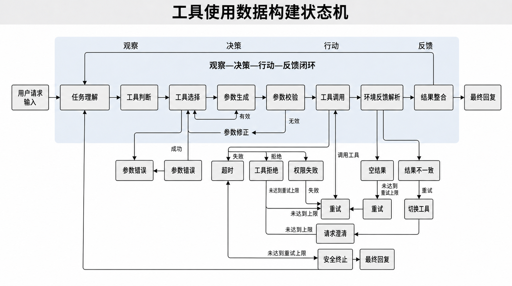
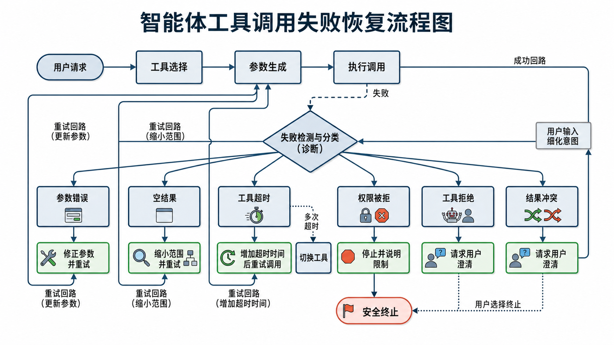

# 第19章 Tool-Use 与函数调用数据

大模型进入任务执行场景后，系统表现更多取决于它能否理解工具、选对工具、填准参数，并根据返回结果修正动作；语言生成能力只是其中一部分。构建 Tool-Use 数据时，不能只准备几条函数调用示例，还要把任务描述、环境状态、调用动作、反馈观测、失败恢复和权限约束一并纳入设计。

本章讨论 Tool-Use 数据、函数调用样本、Agent 轨迹、调用日志和安全约束的设计方法，重点说明 schema、成功/失败轨迹、评测与治理如何共同影响系统下限。本章的基本判断是：工具调用不是给语言模型套一层接口，而是在状态转移、环境反馈和风险边界中训练模型做行动决策。 如果数据只覆盖“调用成功”的理想路径，模型上线后就会在真实世界中频繁暴露出参数不稳、上下文断裂、恢复无能和越权调用等缺陷。

---

## 19.1 为什么工具调用数据决定 Agent 的下限

### 函数调用与 Agent 的基础概念

在纯文本问答中，模型的主要任务是根据输入生成输出；而在 Tool-Use 场景中，模型面对的是一个更接近“感知—决策—执行—反馈”的闭环。这里的函数调用，不只是把自然语言翻译成 JSON 或参数列表，更是把用户意图映射为某种可执行动作。所谓 Agent，也不应被简单理解为“会连续说很多步话的模型”，而应理解为一个能够在外部环境中进行多轮观察、选择动作并根据反馈调整行为的系统。

从这个角度看，函数调用数据承担了两个作用。第一，它教会模型什么情况下该调用工具、调用哪个工具、如何填写参数、调用后应当怎样读取返回结果。第二，它教会模型如何把外部环境视为任务求解的一部分，而不是把一切问题都试图在语言空间内“直接说出来”。很多系统在纯文本问答中表现正常，一接入搜索、数据库、代码执行、日历、邮件等工具就不稳定，常见原因不是模型不会表达，而是缺少针对执行行为的训练数据。

如果把这一过程拆开来看，函数调用至少涉及三个连续环节。首先是意图到动作的映射。用户说“帮我看看下周三下午有没有会”，系统并不是简单提取出“会议”“下午”这几个关键词，而是要判断这句话背后对应的是查询类动作，而不是生成类动作；对应的是日历工具，而不是搜索工具；查询的对象是时间段冲突，而不是单个事件详情。其次是动作到参数的实例化。模型不仅要决定调用哪个函数，还要把含糊的时间表达还原为具体的日期区间、时区和查询范围。最后是结果到响应的消费。工具返回的并不是最终交付给用户的自然语言答案，而是结构化反馈，模型还必须理解这些反馈在当前任务里的含义，并据此决定是直接回答、继续追问，还是触发下一次调用。

因此，函数调用不能只按“单步格式生成”来训练，它还要服务于整条执行链中的任务推进。很多系统可以输出看起来完全合法的函数格式，但依然不能算真正具备 Tool-Use 能力，原因就在于它们只学会了“把一句话改写成某个调用”，却没有学会如何在调用前判断、在调用后消费、在异常时调整。函数调用更像 Agent 的执行接口，而不是语言模型表面的一种模板写法。

从 Agent 的角度看，这一点尤其重要。Agent 与普通对话模型的根本差异，不在于它生成了更长的文本，也不在于它看起来更“主动”，而在于它具有把外部世界纳入求解过程的能力。对于一个只会文本生成的模型来说，世界是一个需要被描述的对象；而对于一个真正的 Agent 来说，世界是一个可以被查询、被操作、被反馈、被再次利用的环境。工具调用数据决定的，正是模型是否能够完成这种角色转变。

### 从“会回答”到“会执行”的能力跃迁

在很多项目初期，团队往往会把工具调用理解为文本能力的自然延伸，仿佛只要模型足够强，它就会自动学会怎样调 API、怎样读数据库、怎样查日历。但工程实践表明，从“会回答”到“会执行”并不是一次平滑过渡，而是一次非常明显的能力跃迁。前者主要发生在语言空间中，依赖的是理解、组织和表达；后者则要求模型跨越语言空间与行动空间之间的边界，把抽象意图转化为外部系统中可落地的操作。

这两类能力的评价标准也并不相同。对于纯文本任务，模型的回答往往存在一定容错空间。措辞不够精准、表述不够完整，甚至部分细节模糊，用户仍然可能接受这次输出，因为它在语义上大体可用。然而在工具调用任务中，很多错误没有“差不多正确”这一说。一个时间字段填错一天，一个数据库表名拼错一个字母，一个收件人地址少一个字符，一个写操作漏掉确认条件，结果都可能从“基本可接受”直接跌落为“彻底失败”。这说明工具调用任务对精确性、一致性和顺序性的要求远高于普通文本生成。

也正因为如此，工具调用数据训练的不是一种更好看的回答风格，而是一套可以稳定落地的执行行为。模型在这类数据中学到的，首先不是“怎样解释问题”，而是“怎样完成任务”。一旦数据不能真实反映任务执行过程，模型就很容易停留在语言拟态层：解释听起来合理，动作看起来规范，但系统一接入真实环境就频繁失效。很多团队误以为这是推理模型不够强，其实往往是因为训练材料根本没有教会模型什么叫执行。

### 会说不会做的根源常在工具数据而非模型本体

工程实践中常见一种误判：一旦 Agent 执行失败，就倾向于把问题归因于模型“推理不够强”或“基座不够大”。但很多失败案例并不源自复杂推理，而源自工具数据层的缺失。例如，样本里只教会模型“搜索天气”，却没有教会它在地名缺失、时间含糊、接口返回空值时如何补齐条件或请求澄清；又例如，样本只覆盖“数据库查询成功”的路径，却没有覆盖 SQL 语法错误、权限拒绝、字段不存在、分页截断等现实情形。模型在训练中没有看到这些结构化失败，自然就难以在部署中形成稳定策略。

更关键的是，纯文本任务中的错误通常体现为答案不够好，而工具任务中的错误往往直接体现为操作失败。前者更多影响内容质量，后者则直接影响任务完成率。这使得工具数据的缺陷在用户感知层面被成倍放大。用户不会因为 Agent 说得不够优雅而立即放弃，但很可能会因为一次下错参数、调用错工具或无法从失败中恢复，而迅速失去信任。

所谓“会说不会做”，在 Tool-Use 场景中通常表现得非常具体。模型可能能准确解释某个工具的用途，却在真正调用时频繁漏掉必填字段；它可能能输出形式上完全合法的 JSON，却不知道两个字段之间存在互斥关系；它可能能读懂错误文本的大意，却不会基于错误类型选择合适的恢复动作。表面上看，这些问题都像是推理或理解出了偏差，但实际上更常见的原因是：训练数据没有把这些行为差异清晰地编码进去，模型只能在模糊经验中自行猜测。

进一步说，模型本体决定的是它有多强的模式学习能力，而工具数据决定的是它究竟学到了什么模式。如果训练样本几乎都来自顺利案例，模型会默认用户输入完整、参数容易推断、工具始终可用、返回结果干净可用；真实部署中这些假设往往不成立。可是真实部署环境恰恰相反。用户表达常常不完整，字段映射经常不明确，工具接口偶尔会抖动，外部返回值也可能噪声很大。模型若长期只在理想路径上被训练，就会在真实环境中持续暴露出脆弱性。

所以，许多失败并不是模型“不聪明”，而是数据没有把难点组织成模型可反复学习的结构。一个只在成功案例上训练出来的 Agent，看起来能完成任务，但本质上只是学会了在顺风条件下沿着模板前进。一旦环境偏离模板，它就很容易暴露出无从下手的状态。

### 工具数据缺失最常见的四个位置

从数据工程视角复盘真实系统，工具调用失败最常见的原因并不是完全不会调某个工具，而是训练数据在若干关键位置上存在系统性空洞。第一类空洞出现在“是否调用”的判断阶段。很多数据只标注了应该怎样调用，却没有标注什么时候不该调用、什么时候应先澄清、什么时候仅靠文本回答即可。结果模型要么过度调用，把简单问题也变成工具链；要么过于保守，在本该访问外部环境时仍然试图硬答。

第二类空洞出现在“参数实例化”阶段。大量数据集里的用户请求都过于规范，字段条件过于完备，几乎没有真实世界里常见的别名、简称、模糊时间、含糊对象、单位歧义和多轮补齐。模型在这种数据中学到的是“字段填写题”，而不是“缺信息条件下的参数构造题”。一旦进入真实系统，它就会频繁犯下那些离用户很近、却在线下数据中极少出现的错误。

第三类空洞出现在“结果消费”阶段。很多函数调用样本把调用动作本身视为终点，仿佛只要工具返回成功，任务就已经完成了。但在真实 Agent 中，调用成功往往只是中间步骤。数据库结果需要筛选，搜索结果需要判别可信度，日历结果需要判断冲突优先级，代码执行结果需要结合 stderr 和 exit code 做进一步决策。若数据不覆盖这一层，模型就会呈现出“会调不会用”的典型问题。

第四类空洞出现在“失败恢复”阶段。训练语料中失败样本过少，或者失败样本没有明确区分类型，只统一表现为一句“调用失败，请重试”，都会让模型在真实部署中丧失恢复能力。它可能对所有失败都采用同一种动作，例如机械重试，既浪费资源，也可能扩大风险。

这四类空洞共同构成了 Agent 的下限。因为下限不是由系统在最理想情况下能做多好决定的，而是由系统在最常见的异常条件下最容易在哪里断掉决定的。工具数据如果不能覆盖这些关键断点，模型即使在演示环境中表现亮眼，也很难在生产场景中稳定工作。

### 工具调用失败如何放大用户体验问题

工具调用失败之所以比文本回答错误更致命，是因为它通常具有连锁效应。一次错误的参数填写，可能导致错误查询；错误查询带来错误观察；错误观察再驱动下一步错误决策，最终形成整条轨迹的偏航。尤其在多工具串行场景中，前一环节的小误差会被后续步骤不断放大。例如，搜索结果的时间范围填错，可能使数据库查询对象不对；数据库结果理解偏差，又会让日历写入或邮件回复落到错误目标上。

这类失败还会带来一种用户体验上的不对称：系统一次成功调用未必能显著提升好感，但一次错误操作就足以破坏信任。因此，Tool-Use 数据不能只追求“平均成功率”，还必须关注失败路径上的损失控制能力。一个成熟的 Agent，并不是永远不犯错，而是在犯错后能及时发现、解释、修正，并避免风险继续扩大。

用户对工具型 Agent 的预期，与对普通问答系统的预期并不一样。对于聊天型系统，用户默认它可能偶尔说错，因此会给它保留一定的解释空间；但对于具备搜索、读写、执行、调度能力的系统，用户更倾向于把它视为一个工作代理，甚至是流程执行者。此时，任何失败都会被理解为流程失败，而不只是回答失败。尤其是涉及写操作、调度操作和执行操作时，用户真正担心的不仅是“做不成”，更是“做错了以后会不会产生后果”。

这种后果性使得工具失败具有比文本错误更强的破坏力。一个回答错误，用户往往可以自行判断和忽略；一个工具操作错误，却可能已经改写了外部世界。例如，错误地发出一封邮件、错误地修改一条日程、错误地执行一段脚本，都会留下需要后续补救的成本。Agent 一旦跨过“仅生成文字”的边界，进入真实环境操作层，其错误就从内容层问题转化为行动层问题。这也是为什么工具数据必须把失败控制作为核心目标之一，而不能只看成功路径。

### 连锁失败如何从局部错误演化为全局失效

为了看清这种放大机制，可以把工具调用轨迹看成一条依赖链。链条中前一状态的输出，往往直接成为后一状态的输入。这样一来，局部错误就不再只是某一步“答得不好”，而会逐步演化为整条链的状态漂移。例如，在“搜索联系人—读取空闲时间—创建会议”这一流程里，如果第一步选错了同名联系人，那么后续两步即使都严格遵守了 schema，也仍然是在错误对象上执行。系统从局部看似乎每一步都正确，从整体看却是在稳定地完成错误任务。

这说明，Agent 体验的核心并不只是每一步看起来是否合理，而是整段执行链是否保持语义一致。工具调用数据若只按单步任务来构造，而不关注状态在多步间的传递关系，就很容易训练出“局部都不错，整体却经常错”的系统。真正成熟的数据设计，会把跨步状态保持、关键变量继承、中间结果验证等信息显式纳入轨迹，使模型学会在长链条中维持目标一致性。

### Tool-Use 数据与纯文本指令数据的本质差异

纯文本指令数据的核心是输入与输出之间的映射，而 Tool-Use 数据的核心是**状态与状态之间的转移**。在文本任务中，样本通常可以被视为静态配对；在工具任务中，样本则往往是带有时间顺序的轨迹。这个轨迹至少包含四类元素：用户意图、环境状态、系统动作、动作后反馈。只有把这四类元素组织起来，模型才不只是学会“生成一个函数调用”，而是学会在动态环境中采取下一步最合适的动作。

因此，构建工具调用数据时，团队面对的不是单一标注问题，而是行动建模问题。它要求数据能够表达前提条件、工具可用性、参数约束、返回结果、不确定性、失败类型以及恢复策略。也正因如此，Tool-Use 数据的质量，往往直接决定了 Agent 能力的下限。

更具体地说，纯文本数据的监督信号主要来自参考答案，而 Tool-Use 数据的监督信号同时来自参考轨迹与环境反馈。前者只要求模型把话说对，后者则要求模型既要把动作做对，又要能根据外部反馈修正后续动作。这意味着 Tool-Use 训练天然更接近交互式决策学习，而不只是静态模仿学习。数据集中若缺失环境反馈这一层，模型就只能学到动作外观，而学不到动作与环境之间的关系。

此外，纯文本指令数据通常允许较强的表达多样性，因为不同措辞只要语义相近就都可能是好答案；但 Tool-Use 数据除了语言多样性之外，还必须维持行为一致性。同一个任务可以有不同自然语言表达，却不能因为表达变了就让工具选择、字段含义和风险边界也跟着漂移。也就是说，Tool-Use 数据同时追求“语言空间中的覆盖”和“行动空间中的规范”，其设计难度显著高于普通指令数据。

### 为什么 Tool-Use 数据更适合按“轨迹”而不是按“单条样本”来理解

在传统问答场景中，一条问题对应一条答案，样本天然是以“单条”为单位组织的。但在 Tool-Use 场景中，单条调用记录往往并不足以承载真实能力。因为模型需要学习的不是某一次函数调用本身，而是整段“观察—决策—行动—反馈”的链条。换言之，真正的监督对象不是孤立动作，而是动作如何嵌入上下文、如何受到前序状态约束、如何被后续反馈验证。

这意味着数据团队在构建、抽样和评测时，更应以轨迹为中心而不是以单步为中心。一条只包含“用户问题 + 函数调用”的样本，也许能训练格式输出，但难以训练任务推进；而一条包含失败、修正、再次调用、最终完成的轨迹，虽然更长、更复杂，却更接近真实 Agent 所需的能力结构。用轨迹来组织 Tool-Use 数据，可以更直接地暴露 Agent 的薄弱环节：问题往往不在最熟练的单步调用，而在最容易中断的上下文传递或恢复环节。

---

## 19.2 Tool schema 与样本结构设计

### 工具描述、参数 schema、约束与错误码设计

工具 schema 不是给开发者看的接口说明书翻版，而是给模型学习“行动语义”的行为规范。一个高质量 schema 至少需要清楚表达四件事：这个工具是做什么的，输入参数是什么，参数之间有哪些约束，以及出现错误时系统会如何反馈。若 schema 只写工具名称和参数名，模型即使能生成合法 JSON，也未必真正理解调用条件。

**代码示例：一个“可训练”的 tool schema（含必填、枚举、互斥与错误码）**

下面示例以“日历查询”工具为例，展示 schema 中哪些信息对模型学习最关键：字段类型、必填、枚举、时间范围约束、以及常见错误码语义。

```json
{
  "name": "calendar_search",
  "description": "查询指定时间范围内的日历事件，用于判断冲突与空闲时段。",
  "parameters": {
    "type": "object",
    "required": ["start_time", "end_time", "timezone"],
    "properties": {
      "start_time": {"type": "string", "format": "date-time"},
      "end_time": {"type": "string", "format": "date-time"},
      "timezone": {"type": "string", "examples": ["Asia/Shanghai"]},
      "participants": {"type": "array", "items": {"type": "string"}, "default": []},
      "limit": {"type": "integer", "minimum": 1, "maximum": 50, "default": 20},
      "include_cancelled": {"type": "boolean", "default": false},
      "mode": {"type": "string", "enum": ["events", "freebusy"], "default": "events"}
    }
  },
  "constraints": [
    "end_time 必须晚于 start_time",
    "start_time/end_time 必须与 timezone 一致解释",
    "mode=freebusy 时建议填写 participants，否则返回结果意义不明确"
  ],
  "error_codes": {
    "missing_param": "必填字段缺失",
    "invalid_datetime": "时间格式或范围非法",
    "permission_denied": "无权限访问日历",
    "timeout": "服务超时，可缩小范围后重试"
  }
}
```

参数 schema 的设计要尤其重视可判定性。参数名称应尽量避免语义重叠，字段类型要明确，是否必填、可选值范围、默认行为、互斥关系、依赖关系都应显式表达。例如，一个“搜索日历事件”的工具，若同时包含 `date`、`start_time`、`end_time`、`timezone` 等字段，就应明确它们的覆盖关系与缺失时的解释规则。否则模型很容易在相近字段间反复摇摆，形成表面合法、语义错误的调用。

schema 设计的关键，不只是让工具“能被调用”，而是让工具“能被模型稳定学会如何调用”。这要求 schema 兼具三种性质：一是可读性，即字段命名和说明足够清晰，使模型能够稳定建立语义映射；二是可执行性，即后端校验规则与字段结构一致，不会出现文档一套、真实行为一套的情况；三是可学习性，即相似情形下字段使用规律尽量稳定，避免过多依赖隐式约定。很多工具接口对工程师来说是可用的，但对模型来说却并不友好，因为它们包含太多默认规则、历史兼容字段或语义模糊命名。

对于数据团队而言，tool schema 本身就是训练材料的一部分，而不是训练之外的背景说明。模型并不会像工程师那样通读接口文档再建立系统性理解，它主要通过样本中的反复出现来归纳规则。schema 如果写得太泛，而样本又没有反复呈现关键约束，模型就容易学出不稳定的调用习惯。结果往往是：离线示例里能调通，上线一遇到边界条件就开始漂移。

### schema 设计的核心不是“字段全”，而是“语义稳”

很多团队在设计 tool schema 时会本能地追求信息完备，希望把所有可能用到的字段、选项和兼容参数都纳入定义中。但从模型学习角度看，字段越多并不自动意味着越好。一个字段体系若过于庞杂、语义边界不清、历史兼容关系复杂，反而会显著增加模型判断难度。模型面对的不是静态文档，而是连续决策任务。它需要的是“在这个上下文里该填哪个字段、为什么填、和其他字段是什么关系”的稳定规则，而不是一个无限展开的参数列表。

因此，schema 的关键往往不在于是否覆盖了所有可能性，而在于是否在高频场景中保持语义稳定。例如，同样表示地理位置，若系统中同时存在 `location`、`place`、`region`、`city_name` 等多个相近字段，而又没有清晰区分使用条件，模型就极易在训练中学出混乱映射。再如，一个字段在文档中标记为“可选”，但在某些操作里又几乎是事实上的必填，如果这种条件化约束不被明确表达，模型就很可能在最关键的场景里漏填。

从这个意义上说，schema 设计不是信息堆砌，而是语义压缩。团队需要把后端系统复杂的真实约束，压缩成模型可以稳定学习的、可判定的规则集合。谁能在这个层面上把接口设计清楚，谁就更可能训练出行为稳定的 Agent。

### 参数 schema 的可判定性与可学习性

参数 schema 的设计质量，直接影响模型是否能在真实场景中稳定填参。这里最关键的原则不是“字段越全越好”，而是“字段含义越可判定越好”。所谓可判定，指的是模型在给定上下文时，能够较明确地判断某字段是否需要填写、应填什么类型、与其他字段有何关系。若字段边界模糊、命名重叠、依赖隐蔽，模型就很容易在格式合法的前提下产生语义错误。

例如，一个工具同时存在 `location`、`region`、`city`、`place_name` 四类字段，却没有明确说明优先级和适用条件，那么模型很可能在不同样本中随意切换；又如，一个字段支持字符串和对象两种形式，但没有明确何时使用哪种形式，模型就可能学出不稳定的混合格式。这类问题在演示场景中不一定明显，但上线后会迅速演化为高频调用失败。

从训练视角看，一个可学习的 schema 还应尽量减少隐式默认知识。凡是后端有默认行为但对任务结果可能产生重要影响的，都应考虑显式化。例如默认时区、默认排序方式、默认结果条数、默认时间范围等。因为模型并不知道这些“后端常识”，如果样本又没有反复呈现这些规则，它就会在关键场景下不断踩中隐式假设。

参数可判定性还意味着字段之间的逻辑关系应当被直接表达，而不是让模型通过少量案例自行猜测。很多真实系统里的调用失败，并不是字段值本身填错，而是字段组合关系错了。例如开始时间和结束时间顺序颠倒、日期与时区表达不一致、分页参数与查询模式冲突、写操作对象与权限范围不匹配。这类错误如果只靠后端兜底，再由模型阅读一条笼统报错信息去反推，学习效率会很低。更有效的做法，是在 schema 和样本中把这些约束变成可见规则，让模型更早地形成结构化判断。

### 约束设计决定模型能否学会“合法且有用”的调用

在 Tool-Use 场景中，合法调用与有用调用并不总是同一件事。一个 JSON 可以完全符合字段类型约束，却仍然无法完成任务。例如时间范围合法但过宽，导致查询结果噪声极大；关键词合法但过于模糊，导致搜索几乎没有区分度；收件人字段格式正确，却因为缺乏身份确认而把消息发错对象。因此，schema 中的约束设计不能只停留在语法层，还必须尽可能包含语义层和业务层的信息。

常见约束大致可以分为四类。第一类是格式约束，也就是字段类型、长度、枚举范围和基础校验规则，这是最底层的合法性保证。第二类是组合约束，即多个字段之间的互斥、依赖、覆盖与优先级关系，它决定了参数组合是否真正成立。第三类是业务约束，例如哪些写操作必须二次确认、哪些查询必须限制范围、哪些对象在某些身份下不可访问。第四类是风险约束，例如超时上限、资源配额、敏感字段脱敏、危险命令禁止执行等。这些约束一旦缺位，模型很可能学会“能调通”的调用，却学不会“能上线”的调用。

因此，数据团队在设计样本时不能把约束当作后端的事情。后端当然可以在执行时拦截错误，但如果训练中从未显式出现这些边界，模型就永远学不会主动规避。真正成熟的 Tool-Use 数据，会让模型不仅知道“什么格式合法”，还知道“什么做法稳妥、什么边界不能碰、什么情况下宁可停下来也不能继续”。

### 错误码与失败语义的分层设计

错误码设计也不应只服务后端调试，而应服务训练数据与恢复策略。把“参数缺失”“权限不足”“资源不存在”“速率限制”“超时”“内部错误”等失败类型明确区分，能为失败样本和恢复样本提供稳定锚点。没有错误语义分层的系统，往往只能让模型从模糊报错文本里猜测原因，这会极大削弱恢复能力。

更进一步，错误码体系最好能同时满足三个目标：其一，便于系统执行侧定位问题；其二，便于数据侧按失败类型组织样本；其三，便于模型侧学习恢复分支。也就是说，错误码不应只是后端内部的技术编号，而应具有足够稳定的语义层级。例如，“参数错误”可以继续细分为缺失参数、类型不符、枚举非法、字段冲突；“权限失败”也可以区分为未认证、已认证但无权限、资源隔离导致不可访问。层级清楚的错误码体系，会直接决定失败样本能否被有效组织。

在实践中，很多系统的错误文本来自底层服务，表达混乱且风格不一。若不在数据层做抽象归一，模型只能记住一些表面措辞，很难形成可泛化的恢复能力。因此，一个成熟的数据工程流程往往会同时保留“原始错误文本”和“标准化错误标签”两层表示：前者保留环境真实感，后者提供可学习的稳定结构。

分层错误码的另一个价值，在于它可以把“是否继续尝试”这一决策提前结构化。并非所有失败都适合重试。超时类问题通常存在重试空间，参数类问题更适合修正后重试，权限类问题则常常应该终止并解释限制，注入风险或高危写操作冲突则可能需要直接中止流程。如果错误体系本身没有把这些语义差异表达出来，模型就容易对所有失败采用单一策略，导致恢复行为粗糙且不安全。

### 单工具、多工具、串行工具与并行工具样本

工具调用样本不应只覆盖最简单的单工具路径。现实任务中，很多操作都需要多工具协同完成，而且协同关系并不相同。有些任务是单工具完成的，例如查询天气；有些是串行工具完成的，例如先搜索联系人，再查询日历，再创建会议；还有些是并行工具完成的，例如同时查询多个数据源后进行结果汇总。

不同结构的样本，教会模型的是不同层级的能力。单工具样本主要训练“是否调用”与“如何填参”；多工具串行样本训练的是中间结果如何驱动后续调用；并行工具样本则训练模型如何在多个子任务之间共享原始意图、拆分参数并最终合并结果。如果数据里只大量存在单工具案例，模型上线后往往会表现出一个明显特征：每一步都像样，但整体任务无法闭环。

因此，样本设计时不能只统计“调用次数”，更应统计“调用结构”。团队需要知道训练集中单工具、双工具、多工具、串行、并行、嵌套恢复等不同结构的比例，并使之与目标场景分布尽量一致。

不同工具结构的样本，本质上对应着不同层级的执行能力。单工具样本重点解决局部执行问题，回答的是“该不该调、怎么调、调完如何说”；串行样本重点解决状态传递问题，回答的是“前一步得到的结果如何约束后一步动作”；并行样本重点解决任务分解与结果整合问题，回答的是“同一意图怎样拆成多个可并发处理的子任务，以及多个返回结果如何合成为一致结论”。如果数据集中这些结构严重失衡，模型就会在相应能力层级上表现出明显短板。

### 工具组合方式本身也是一种能力标签

在很多团队的早期数据组织中，工具调用样本常常被统一放在一个篮子里，只要包含函数名和参数就算一条 Tool-Use 数据。但从能力建模的角度看，工具组合方式本身就应该被视为一种重要标签。因为单工具、串行、多工具并行、带恢复分支的多步轨迹，并不是同一种难度、也不是同一种能力。它们分别对应局部执行、流程推进、任务拆分、异常恢复等不同层面的要求。

一旦团队用这种方式重新理解数据，就会发现很多过去被忽略的问题。例如，某个模型在单工具查询上准确率很高，但在双工具串行上经常丢失中间变量；另一个模型能够并行检索多个源，却不会在结果冲突时做优先级判断。若没有调用结构层面的标签，这些差异很容易被总体成功率掩盖，看起来系统“还不错”，实际却在关键工作流上非常脆弱。

因此，在训练集与评测集设计中，把调用结构作为显式维度记录下来，通常比单纯增加样本数量更有价值。它能帮助团队更清楚地回答一个问题：模型到底是在哪一层执行能力上出了问题，而不是只知道“它平均上不太稳定”。

### 自然语言、函数调用、观测结果之间的统一格式

Tool-Use 数据的难点，不在于是否使用 JSON，而在于是否存在一套统一且可扩展的表示格式，能够稳定地承载自然语言输入、函数调用动作和环境反馈结果。一个成熟的数据格式，通常需要把以下几层信息放在同一轨迹中：用户请求、系统当前可用工具、模型决策、函数参数、调用结果、下一步观察、最终响应。

**代码示例：统一轨迹格式（messages + tool_call + tool_result）**

下面给出一条“成功闭环”样本：先查询日程，再基于冲突结果给出可执行建议。重点是把工具结果作为**环境反馈**单独入轨，而不是混成普通文本。

```json
{
  "messages": [
    {"role": "system", "content": "你是日程助手。需要查询时先调用工具，再基于返回结果给出结论。"},
    {"role": "user", "content": "帮我看看下周三下午2点到4点有没有会？在上海时区。"},
    {
      "role": "assistant",
      "tool_call": {
        "name": "calendar_search",
        "arguments": {
          "start_time": "2026-04-29T14:00:00",
          "end_time": "2026-04-29T16:00:00",
          "timezone": "Asia/Shanghai",
          "mode": "events",
          "limit": 20
        }
      }
    },
    {
      "role": "tool_result",
      "name": "calendar_search",
      "content": {
        "status": "ok",
        "events": [
          {"title": "例会", "start": "2026-04-29T15:00:00", "end": "2026-04-29T15:30:00"}
        ]
      }
    },
    {
      "role": "assistant",
      "content": "14:00-15:00 空闲；15:00-15:30 有一场“例会”；15:30-16:00 空闲。你希望我帮你改到14点开始，还是16点之后？"
    }
  ]
}
```

如果这几层信息散落在不同样本体系中，模型训练时就容易出现断层。例如，自然语言理解数据放在一处，函数调用格式数据放在一处，错误恢复数据放在另一处，结果是模型学会了各局部能力，却无法在同一上下文内把它们衔接起来。统一格式的价值，在于让模型看到“从语言到动作、从动作到观测、从观测再到动作”的连续过程。

实践中，可以用消息序列组织样本，并用 `user`、`assistant`、`tool_call`、`tool_result`、`assistant_followup` 标记用户输入、模型动作、工具反馈和后续回应。这种方式的优势不只是贴近推理接口，更重要的是便于表达时间顺序和环境反馈。

真正重要的统一，并不是把所有工具都压成同一种表面外观，而是让角色边界和时序关系保持清晰。模型需要明确知道哪一段是用户请求，哪一段是系统动作，哪一段是环境反馈，哪一段是反馈后的响应。如果这些角色在样本中混杂不清，模型就会把原本应当被区别对待的信息混为一谈。例如把工具返回值当作普通自然语言继续生成，或者把外部环境中的文本错误地当成用户新指令。表面上看这是理解问题，实际上却是格式设计没有把信息来源分层。

### 统一格式的重点在角色语义，而不在外观整齐

很多团队讨论 Tool-Use 表示格式时，很快会把焦点放在 JSON 结构、字段嵌套方式或消息外观上，仿佛只要格式足够统一，模型就能自然学会调用。但从训练角度看，真正关键的并不是外观是否整齐，而是角色语义是否稳定。因为模型不是在阅读一份漂亮的数据表，而是在不断归纳“谁在说话、谁在行动、谁在反馈、当前处于哪一步”这些决策前提。

因此，统一格式最重要的不是让所有工具结果长得一样，而是让所有轨迹中的角色关系都足够清楚。用户输入就是用户输入，工具调用就是系统动作，工具结果就是环境反馈，后续解释就是对反馈的消费。只要这几类角色在长期样本中保持稳定边界，模型就更容易形成跨工具泛化能力。相反，若不同样本在角色表达上时常切换，模型就会把本应是通用模式的部分学得非常脆弱。

### 观测结果不应被当成普通文本附属物

在不少数据集中，工具返回结果只是被简单拼接到上下文里，像是又多了一段需要模型阅读的文本。但从 Agent 学习角度看，观测结果并不是普通的上下文材料，而是具有环境地位的反馈信号。它告诉模型外部世界发生了什么、当前动作是否成功、下一步动作空间是否发生变化。若这类反馈没有被单独建模，模型就很难真正学会基于环境状态调整行为。

这在检索、网页浏览、数据库查询和代码执行等工具中尤为明显。搜索返回的不是答案本身，而是候选证据；数据库返回的不是最终结论，而是待解释的数据行；代码执行返回的 stdout、stderr 和 exit code 共同构成了当前执行状态。如果模型只是把这些返回值当普通文本读取，而没有把它们当作行动后的环境反馈，就很难形成闭环控制能力。

因此，一个成熟的统一格式应当让观测结果具有独立地位。它不应只是附在调用后面的一段字符串，而应被表达为具有明确来源、明确结构和明确决策价值的环境信号。只有这样，模型才可能逐步学会“基于反馈行动”，而不是“读到什么就顺着继续写什么”。

### 调用日志结构：从训练样本到线上行为的桥梁

调用日志结构是 Tool-Use 数据工程中经常被忽视、却极其关键的一层。它连接了线下构造的训练样本与线上真实发生的调用行为。没有良好的日志结构，团队就无法从部署环境中系统性回收失败案例，也无法分析模型到底是“不会选工具”“不会填参数”“不会读结果”还是“不会恢复”。

用于数据回流的调用日志，至少应记录任务/会话 ID、步骤编号、用户原始请求、工具名称、输入参数、校验结果、执行状态、返回摘要、错误码、耗时、重试次数、恢复动作和最终任务状态。日志并不要求完整记录所有内部推理细节，但必须能够复原“这一步为什么发生、发生了什么、出了什么错、后续怎么处理”的最小链条。

从数据工程角度看，日志不是单纯的运维数据，而是失败样本、恢复样本与安全样本的重要来源。一个没有结构化日志的 Agent 系统，即使线上积累了大量交互，也很难沉淀成真正可训练的数据资产。

调用日志的意义，还在于它为数据团队提供了一个从真实世界反观模型行为的稳定窗口。离线构造的训练样本再完善，也很难穷尽线上所有表达变体、接口边界和交互噪声。日志能够持续揭示模型在真实环境里最脆弱的点：是字段映射出了问题，还是工具选择策略不稳；是恢复动作过于单一，还是某个版本的接口升级破坏了旧的调用习惯。没有这些结构化记录，团队看到的只会是“系统有点不稳定”，却很难定位到具体机制。

### 调用日志是数据回流的起点，而不是事后排障材料

在很多系统里，日志被默认为运维资产：出问题了就去查，没问题时就长期沉睡。但对于 Tool-Use 数据工程来说，日志不应只是事后排障材料，而应被视为持续生产训练样本和评测样本的起点。尤其是失败轨迹和恢复轨迹，往往最难在线下靠人工想象完整覆盖，却最容易在线上真实出现。只要日志结构设计得足够好，团队就可以把这些高价值案例稳定地回收到数据流水线中。

例如，线上日志可以自动筛出“首次参数错误、一次修正后成功”的样本，作为恢复学习的高价值材料；也可以筛出“同类请求频繁在两个工具之间摇摆”的案例，用来定位工具选择不稳定问题；还可以把“权限失败后继续尝试高风险调用”的轨迹标为安全缺陷样本。这些都说明，日志不是训练完成后的附属物，而是训练迭代中的核心输入之一。

也正因此，日志结构应当在样本结构设计阶段就同步规划，而不能等到系统上线后再临时补字段。因为一旦关键状态没有被记录，后续再想从真实行为中复原训练所需轨迹就会非常困难。对 Tool-Use 团队来说，样本格式与日志格式最好从一开始就按同一套状态观组织，这样线下与线上之间才真正可打通。

### 表：工具类型与样本字段表

| 工具类型 | 典型任务 | 核心输入字段 | 核心环境反馈字段 | 恢复相关字段 | 备注 |
|---|---|---|---|---|---|
| 搜索类工具 | 网页搜索、文档检索、知识查询 | query、filters、top_k、time_range | hits、source、snippet、empty_result | reformulated_query、fallback_source | 需重视 query 改写与空结果恢复 |
| 数据库工具 | SQL 查询、向量检索、键值读取 | db_name、query/embedding、table、limit | rows、schema_hint、execution_status | retry_query、permission_check | 需覆盖语法错误与权限错误 |
| 日历/事务工具 | 查日程、创建事件、修改提醒 | date、participants、location、timezone | matched_events、conflicts、write_status | clarify_slot、retry_write | 写操作风险高，需显式确认边界 |
| 通信工具 | 发邮件、发消息、通知 | recipient、subject、body、channel | send_status、delivery_error | draft_mode、recipient_check | 高风险场景应加入二次校验 |
| 代码执行工具 | 执行脚本、计算、文件处理 | code、runtime、input_files、timeout | stdout、stderr、exit_code、artifacts | patch_code、safe_abort | 必须考虑沙箱与资源限制 |
| 文件工具 | 读取、写入、转换、解析 | file_id、path、mode、format | content_preview、parse_error | fallback_parser、permission_check | 文件权限与格式兼容性常见 |
| 外部 API 工具 | 第三方服务调用 | endpoint、method、payload、auth | response_body、status_code、quota | retry_backoff、auth_refresh | 需记录版本与配额信息 |

从表中可以看出，所谓“统一样本结构”并不意味着所有工具都应使用完全相同的字段，而是意味着不同工具应在共享的轨迹框架下暴露各自最关键的执行信息。搜索类工具更关注查询表达与空结果反馈，数据库工具更关注 schema 感知与执行状态，日历和通信类工具更强调对象对齐、冲突识别和写入风险，代码执行工具则必须额外暴露运行环境和安全中止信号。不同工具类型的这些差异，不是样本设计中的噪声，而是模型形成可迁移执行能力的必要材料。

参考工具字段表时，不应把它当成固定字段清单，而应把它看作不同工具在轨迹中需要暴露的关键状态集合。谁能够把这些关键状态设计得既充分又不混乱，谁就更可能构建出既统一又有效的 Tool-Use 数据集。




*图19-1：Tool-Use 数据构造状态机图*


把 Tool-Use 数据构造成状态机，比把它看作一组独立函数调用更有利于描述真实执行过程。用户请求进入系统后，并不会直接跳到“生成某个函数调用”这一步，而是会依次经过任务理解、是否需要工具的判断、工具选择、参数生成、参数校验、调用执行、环境反馈解析和结果整合等阶段。每一个阶段都对应一种可观察状态，也对应一组潜在的失败方式。当状态和转移关系在数据中被写清楚时，模型更容易学到稳定执行路径，而不只是模仿局部调用格式。

状态机视角最重要的价值，在于它把成功轨迹、失败轨迹和恢复轨迹放进了同一套框架中。对于真实 Agent 而言，失败不是可以忽略的边缘情况，而是系统运行中的常见组成部分。参数错误意味着状态从“参数生成”转移到了“校验失败”；超时意味着状态从“调用执行”转移到了“执行异常”；权限不足意味着系统不应继续推进主路径，而应转入解释限制或安全终止。若训练数据只保留主路径，不显式表达这些失败转移，模型就无法真正学会异常情形下的行为选择。

从数据构造角度看，状态机并不要求每条样本都覆盖全部节点，而是要求数据集整体能够覆盖关键状态与主要转移。例如，一类样本重点覆盖“任务理解—工具选择—成功调用”的标准路径，另一类样本重点覆盖“参数校验失败—参数修正—再次调用成功”的恢复路径，还有一类样本则覆盖“权限失败—停止调用—向用户解释限制”的安全路径。通过这种方式，模型学到的就不再是一个个彼此孤立的调用实例，而是一套围绕状态变化不断调整动作的执行规律。

这种表示方法还有一个重要作用，就是帮助团队发现数据缺口究竟出现在什么位置。如果线上系统经常把工具选错，问题很可能不是函数格式训练不足，而是“任务理解—工具判定—工具选择”这一段状态转移没有学稳；如果系统能成功调用却仍然给出错误结论，说明“环境反馈解析—结果整合”这一段状态表达不足；如果系统一遇到错误就反复重试，往往意味着失败状态被记录了，但失败到恢复的转移没有被充分建模。换言之，状态机不是为了画图而画图，而是为了把 Tool-Use 数据中的行为结构拆解为可分析、可补样、可评测的具体单元。

对于构建 Agent 数据的团队来说，这一点非常关键。Tool-Use 数据要训练的不是某个工具的参数格式，而是模型在不同状态下如何行动，并根据反馈进入下一状态。只要这种规律没有被稳定地写进数据，模型就很容易停留在模板层；而一旦这种规律被显式组织起来，模型才可能逐步具备接近真实 Agent 的执行能力。

---

## 19.3 成功轨迹、失败轨迹与恢复样本

### 成功调用样本的最小完整要素

很多团队在构建函数调用数据时，会把“用户问题 + 正确函数调用”当作一个完整样本。但从 Agent 训练角度看，这通常还不够。一个真正可用的成功样本，至少应包含六类要素：用户意图、工具选择依据、参数内容、执行结果、结果解释、最终响应。只有这样，模型才能学到这次调用不仅格式正确，而且语义合理、执行有效、结果可被正确消费。

如果只保留调用动作本身，而省略结果消费过程，模型就可能学会“会调不会用”。这类模型能发出漂亮的工具请求，却不知道如何根据返回结果继续决策。例如，搜索工具返回多个候选项时，模型可能不知道该如何选取最相关结果；日历工具返回时间冲突时，模型可能不知道应当建议替代时段还是继续创建事件。成功轨迹的价值，不只是证明调用成功，更是定义“成功之后应当如何把结果转化为任务完成”。

在数据建模中，成功不能只看函数是否返回 200，或调用是否符合 schema；更应看这条调用链是否推动任务完成，并满足用户目标。因此，成功样本的最小完整性不能只停留在工具层，而必须延伸到任务层。模型不仅要看到“调用是怎样发生的”，还要看到“调用之后任务状态发生了什么变化”。只有这样，它学到的才不是一种局部动作模式，而是一种完整的执行逻辑。

这一点在多步任务中尤其明显。假设用户请求“帮我找出下周最空的一天下午，并约一个半小时的讨论会”，其中包含日历检索、候选时段比较、冲突判断和会议创建等多个环节。如果训练样本只保留“检索日历”这一步，那么模型学到的只是一个中间动作；只有当样本继续展示它如何比较不同返回结果、如何选定候选时段、如何调用创建事件接口并向用户反馈最终安排时，模型才真正学会了“任务完成”而不是“调用成功”。

### 成功轨迹中的“最小完整”不是最短，而是闭环成立

很多团队在追求样本规模时，习惯于把成功样本压缩到尽可能短，认为只要保留最关键字段即可。但 Tool-Use 场景中的“最小完整”，并不等于“最短表示”，而是指闭环所需的信息不能缺失。因此，样本可以简短，但必须交代工具选择、参数来源、返回信息、返回含义，以及系统如何把结果转成用户可用的输出。

如果这些问题中有任意一个环节缺失，样本在训练中就会留下断层。例如，若只给模型看到“用户请求—函数调用—最终答案”，它可能学不会如何消费中间结果；若只保留“用户请求—函数调用—工具返回”，它又可能学不会如何把结构化结果转成用户真正关心的结论。所谓最小完整，本质上是一种闭环最小性，而不是字段最小性。

从工程实践看，很多“离线表现不错、上线后不稳定”的系统，恰恰是因为成功样本被裁得过短，以至于模型看到了调用动作，却没有看到任务完成的机制。这样的样本在单步格式学习上是高效的，在真实 Agent 能力塑形上却是不足的。

### 成功轨迹需要显式呈现工具选择依据

在成功样本中，工具选择依据是一个经常被省略、但实际上非常重要的部分。模型不仅要知道“最后用了哪个工具”，还应尽可能知道“为什么在当前上下文下应该用这个工具，而不是另一个工具或纯文本回答”。这种依据不一定要写成冗长解释，但至少应以某种结构化方式体现在样本中，例如通过决策标签、上下文约束字段、工具选择理由摘要等形式表达。

这是因为工具选择本身就是 Tool-Use 的关键能力之一。若训练数据总是直接给出正确工具，而不展示选择过程，模型就容易把工具调用学成条件反射：看到某类表达就盲目调用某个函数。可一旦真实环境中出现意图混合、信息不充分或多个工具均可部分满足需求的情况，模型就会迅速暴露出工具判定不稳的问题。因此，成功轨迹不仅应展示“做了什么”，还应展示“为什么这样做”。

### 参数内容不仅是字段值，更是上下文压缩结果

很多时候，团队把参数内容理解为字段和值的集合，好像只要最终参数正确就足够了。但对模型而言，参数并不是天生存在的，它们是从用户表达、多轮上下文、系统默认规则和业务约束中压缩出来的。比如“明天下午晚一点”需要被转化为具体时间范围，“上次那个客户”需要映射为某个联系人标识，“帮我发个简短提醒”需要对应到通信工具中的主题、正文和目标对象。参数的生成本质上是一种语义压缩与结构化映射过程。

因此，高质量成功样本最好不要把参数视为凭空出现的最终答案，而应尽可能在轨迹中体现参数来源。例如，通过前文上下文、澄清问题、工具结果继承或默认值展开，让模型看到这些参数不是随意填写，而是受到任务约束的。只有这样，模型在真实部署中才更可能在不完整信息下学会稳定补全，而不是在样本外大量猜测。

### 参数错误、工具拒绝、超时、权限失败等恢复轨迹

失败样本不应被视为脏数据的副产品，而应被视为 Agent 能力学习中最有价值的部分之一。因为真实系统的韧性，不来自“从不失败”，而来自“知道不同失败意味着什么，并能采取不同恢复动作”。这要求数据对失败类型进行明确分层。

参数错误通常意味着输入不合法、字段缺失或字段组合冲突，对应的恢复策略是参数修正、补齐缺失值或向用户请求澄清。工具拒绝往往意味着当前请求不满足业务规则，例如写权限不足、对象状态不允许修改，这时继续重试通常无效，更合理的恢复是解释限制并提供可行替代。超时则可能对应网络波动、服务拥塞或复杂查询，此时合适的恢复方式可能是重试、缩小范围、降低结果数量或切换数据源。权限失败更需要谨慎，因为它不仅是技术错误，也可能是安全边界信号，恢复策略应优先考虑停止越权尝试，而不是让模型“想办法绕过去”。

如果训练数据不区分这些失败，只把它们都写成“调用失败，请重试”，模型上线后就会出现恢复动作单一化的问题：无论什么失败都机械重试，既浪费资源，也可能触碰安全红线。

在 Agent 系统里，失败并不只是“没有成功”的另一面，它本身就是一种高密度监督信号。因为一次失败往往清楚地揭示了系统在何处理解错了、选择错了、参数错了或边界判断错了。与成功样本相比，失败样本更能暴露模型的真实薄弱点。对于数据团队而言，失败轨迹最重要的价值不是用来证明系统“不够好”，而是用来训练系统学会“在不理想条件下仍然能继续做对的事”。

### 失败类型不是标签清单，而是恢复策略的入口

在很多粗糙的数据集中，失败类型只是被当作一种标注结果，例如把样本分成“参数错误”“超时”“权限失败”几类后就结束了。但对 Agent 训练来说，失败类型真正重要的原因在于，它们决定了后续恢复动作应该如何分化。失败分类不是为了统计好看，而是为了把不同失败映射到不同恢复路径。

例如，参数缺失最常见的恢复方式是补齐信息或发起澄清；字段冲突则往往需要重新解释约束并修正组合；空结果并不一定意味着失败，有时只是查询表达太宽泛或太模糊，需要改写 query 或切换筛选条件；权限失败通常不应继续重试，而应进入限制解释与安全终止；工具拒绝则往往意味着当前对象状态或业务规则不允许这次动作，需要考虑替代方案。只有当这些分支在训练数据中被清楚表达，模型才会逐渐形成“看到什么失败，就知道下一步应该进入哪类恢复模式”的能力。

从这个意义上说，失败样本的质量并不主要体现在失败本身，而体现在失败之后的动作是否合理。一个成熟的数据集，不会满足于记录“这里失败了”，而会进一步记录“为什么会失败”“这类失败该如何处理”“处理后结果如何”。这才是真正能提升系统韧性的恢复监督。

### 恢复样本的核心不是重试，而是有条件地调整策略

真实系统中的恢复，不应被简化为“失败了再试一次”。恢复之所以重要，正是因为它要求系统基于失败原因改变策略，而不是机械重复原动作。参数错误后的恢复应当伴随参数修正，空结果后的恢复应当伴随查询改写或范围调整，工具不可用时的恢复应当考虑切换工具或推迟动作，权限失败时的恢复则往往是终止而不是继续。

恢复样本要训练模型根据失败类型选择动作：不同失败对应不同处理方式，也对应不同风险边界。若训练数据把所有失败后的下一步都写成“retry”，模型就会学会一种非常脆弱的恢复观：把失败理解为暂时波动，把所有问题都寄托于重复调用。这样的系统不仅效率低，也很危险，因为某些失败本就不应继续推进。

高质量恢复样本往往具有一个共同特征，即它们显式体现了“策略变化”。模型在前一步失败后，不是简单重复原调用，而是改变了参数、改变了范围、改变了工具、改变了交互方式，甚至改变了是否继续执行的判断。只有这种变化被稳定写进数据，恢复能力才会真正形成。

### 环境反馈：Agent 学习闭环的关键监督来源

环境反馈是 Tool-Use 数据中与纯文本任务最不相同的一部分。模型在文本世界里主要依赖语言监督，而在工具世界里，它还必须学会理解环境返回的结构化信息。环境反馈包括显式返回值，如 `status_code`、`rows`、`stdout`、`error_message`；也包括隐式状态变化，如资源是否创建、任务是否完成、外部状态是否按预期更新。

很多系统之所以看似“会调用”，却始终不够可靠，就是因为它们把环境反馈当作流水账，而没有把它建模为决策监督。正确的数据构造方式，应当让模型在样本中明确看到：这一步返回了什么，这个返回意味着什么，因此下一步该做什么。只有在数据中明确写出“反馈—解释—下一动作”的关系，模型才更容易形成闭环能力。

从数据标注角度看，环境反馈最好同时保留原始结果与抽象标签。原始结果用于训练模型读懂真实接口格式，抽象标签用于稳定化失败分类与恢复策略。例如，一条数据库报错原文可以保留，但同时应标注为“syntax_error”或“permission_denied”。这样既保留真实感，又便于模型形成可泛化的恢复模式。

环境反馈很重要，因为它会改变 Tool-Use 数据的监督信号。普通文本任务中，模型通常只需对齐一份参考答案；但在工具任务中，模型的动作是否合理，往往要依赖环境返回来确认。也就是说，环境反馈不仅告诉模型“刚才发生了什么”，还在不断重写“接下来应该做什么”。若训练样本没有把这种重写关系表达清楚，模型就难以形成真正的闭环决策能力。

### 原始反馈与抽象反馈应当并存

环境反馈的建模，不能只保留其中一种表示。若只保留原始反馈，模型会接触到真实接口风格，但可能难以在跨工具、跨版本、跨场景时形成稳定恢复模式；若只保留抽象标签，模型又会失去对真实环境噪声和接口多样性的适应能力。因此，更合理的做法通常是让原始反馈与抽象反馈同时存在。

例如，一条数据库错误可以同时以两层方式呈现：一层是原始返回内容，如具体报错文本、状态码、失败位置；另一层是抽象解释，如“syntax_error”或“permission_denied”。再如，一次搜索空结果可以同时保留真实的 hits 为空的返回结构，以及“empty_result”这一规范标签。这样一来，模型既能学习如何读懂真实世界里的返回格式，又能学习如何把这些多样化返回归入少数可决策的恢复类型。

这类双层反馈设计的价值，在于它为模型提供了“真实感”与“可泛化性”的平衡。前者让系统不会在实际接口前显得陌生，后者让系统不会被表层措辞牵着走而失去迁移能力。

### 反馈的关键不在“看见”，而在“解释后行动”

很多系统已经能够把工具返回结果放进上下文，因此从表面上看似乎并不缺少环境反馈。但问题在于，“看见反馈”和“基于反馈行动”是两回事。一个模型可以读到返回值，却未必真正知道它意味着什么，更未必知道应当因此采取什么动作。比如，搜索工具返回十个候选项，模型是否知道该比较可信度、时间和相关性？代码执行返回 stderr，模型是否知道这是语法问题、环境问题还是权限问题？日历接口返回冲突事件列表，模型是否知道该提出候选时段而不是继续硬写入？

因此，环境反馈的核心不是把结果塞进上下文，而是把“结果解释—动作选择”的关系稳定写进样本。模型不能只把工具结果当作文本材料续写，还要学会根据返回状态调整查询、重试、终止或继续执行。

### 观察—决策—行动闭环样本的建模方式

观察—决策—行动闭环，是 Tool-Use 数据区别于静态指令数据的核心。所谓观察，不只是用户最初输入，还包括工具返回的环境反馈；所谓决策，不只是是否调用工具，还包括是否继续、是否恢复、是否终止；所谓行动，则包括函数调用、参数修正、澄清提问和安全中止等多种类型。

因此，样本建模时不能只记录“最终成功路径”，而应尽量保留每一步观察对应的决策理由。这里并不是要求暴露冗长的自由思维文本，而是要在数据中至少有一个能够表达决策依据的结构层。例如，可以用简短标签表示“因结果为空，选择改写 query 重试”；也可以用规范化字段表示“由于权限不足，转入终止并解释限制”。这样的结构化决策说明，有助于模型学习状态转移规则，而不是死记某个接口格式。

闭环样本设计的重点，在于让每一步动作都可以回溯到前一步观察。换句话说，数据中应尽可能形成一种因果可见性：模型之所以这样做，是因为它看到了某种输入或某种反馈；它之所以改变策略，是因为前一步结果暴露了某种问题；它之所以终止，是因为环境已经给出了不能继续推进的信号。没有这种因果链，样本就会退化为一连串表面相邻、实际上断裂的动作。

### 结构化决策理由不是暴露思维链，而是补足状态转移信号

在构建这类闭环样本时，团队常常担心：如果加入决策理由，会不会变成冗长的思维链数据，既难标又不稳定。这里不需要模型输出完整自由推理过程，但样本中应保留简洁稳定的决策信号，用来说明状态为什么从 A 转到 B。

这种信号可以很短，例如“empty_result → reformulate_query”“permission_denied → explain_and_stop”“timeout → retry_with_narrower_scope”。它的作用不是替代模型推理，而是让状态转移规律显式可学。对 Tool-Use 数据来说，这种轻量级决策标记通常比冗长自然语言解释更稳定，也更适合在大规模样本中保持一致。

从训练效果看，若没有这层结构化决策理由，模型常常会学到动作表面，却学不到动作之间的逻辑条件。结果就是在相似失败前采取不一致动作，在不同失败前采取相同动作。加入简洁的决策信号，正是为了减少这种不稳定性。

### 闭环样本应覆盖继续、恢复与终止三类出口

很多团队在设计闭环样本时，关注的主要是“如何继续推进任务”，于是成功与恢复样本较多，而终止样本明显不足。但对于真实 Agent 来说，继续、恢复与终止是三类同等重要的出口。系统并不是每次都应该往前走，有时应该修复后继续，有时则应当在识别到边界后停止。

因此，高质量闭环样本不能只覆盖“调用后继续下一步”的路径，还应系统性包含“失败后恢复”的路径，以及“识别风险或越权后安全终止”的路径。特别是在高风险工具场景里，终止并解释限制本身就是一种正确行为，而不是系统能力不足的表现。若样本中缺乏这类轨迹，模型就容易把“尽量完成任务”错误理解为“无论如何都不要停”，这会直接侵蚀系统的安全边界。

### 调用日志如何回收失败样本

线上系统的失败样本回收，不应依赖人工在海量日志中手工挑选，而应依赖事先设计好的调用日志结构。只要日志中存在步骤编号、调用参数、执行状态、错误码、重试链与最终结果，团队就可以按失败类型自动切分出可训练的样本簇。例如，把所有“参数校验失败但通过一次修正成功”的案例汇总为一类恢复样本；把所有“连续重试仍因权限失败而终止”的案例汇总为另一类安全终止样本。这样，日志就不再只是排障材料，而成为持续迭代数据集的生产线入口。

日志回收失败样本的关键，不在于“把失败都存下来”，而在于“把失败变成可训练、可分层、可评测的结构化资产”。如果线上日志只是零散记录报错文本，团队很难自动识别哪些失败值得保留、哪些恢复轨迹具有代表性、哪些安全中止案例暴露了潜在风险。只有当日志中同时具备步骤上下文、参数快照、失败类型、恢复动作和最终结果时，失败样本才真正具备进入数据流水线的条件。

进一步看，日志回流最大的价值在于它能持续提供“线下很难想全、线上却频繁发生”的样本。比如，某些参数别名只在少数用户群体中出现，某些接口冲突只在特定版本组合下触发，某些恢复动作看似合理却在真实用户交互中始终不被接受。若没有日志，团队很难系统性发现这些模式；若有结构化日志，团队就可以把这些线上长尾失败稳定沉淀为下一轮训练与评测的高价值数据。

### 从日志到样本，需要一次失败语义重建

需要注意的是，调用日志本身并不天然等于训练样本。日志记录的是系统发生了什么，而训练样本要求的是“模型应当学会什么”。因此，从日志回收失败样本时，通常需要做一次失败语义重建：把原始日志中的步骤、报错、重试和结果重新组织成适合训练的轨迹单元。

例如，一串日志里可能包含三次连续失败调用、一次澄清提问和一次最终成功。对运维来说，这是一段问题排查记录；对数据团队来说，它更像一条完整的恢复样本，需要重新提炼出关键观察、失败类型、决策变化和最终结果。又如，一次权限失败日志可能本身并不长，但若能识别出它对应的是“应该立即终止而非继续尝试”的模式，它就具有很高的安全训练价值。

也就是说，日志回流并不是简单导出，而是一次面向学习目标的重构过程。谁能把这一步做得结构化、自动化，谁就更容易把真实线上问题转化为可持续积累的数据资产。




*图19-2：调用失败恢复流程图*

把失败恢复过程单独抽象成流程，而不是把它散落在若干失败样本里，有助于数据团队清楚识别恢复能力到底由哪些节点组成。一次工具失败并不是一个不可再分的事件，它通常至少包含失败检测、失败归因、恢复动作选择、恢复执行与恢复结果判断几个环节。若这些环节在数据中被混成一句“失败后重试”，模型就很难学到恢复的内在结构；相反，若流程被清晰展开，模型就更容易形成“不同失败进入不同分支、不同分支对应不同动作、不同动作再导向继续或终止”的行为规律。

这类流程尤其重要的地方在于，它把“失败后的正确行为”从一种模糊经验变成了可表达、可重复、可评测的结构。参数错误不应与权限失败走同一条恢复路径，空结果不应与工具拒绝采用同一种处理方式，返回结果冲突也不应简单等同于超时重试。对数据团队来说，把这些差异明确组织进恢复流程，实际上是在为模型提供一张失败后的行为地图。模型学到的将不再是“遇到问题时试试看”，而是“识别当前失败属于哪一类，并进入与之相匹配的恢复或终止分支”。

从样本设计角度看，失败恢复流程图所对应的，不应只是少数复杂案例，而应成为恢复样本组织的总体骨架。每一类恢复样本都可以被看成这张流程图中某一条具体路径的实例化：有的路径从参数错误进入参数修正并最终成功，有的路径从空结果进入 query 改写后成功，有的路径从权限失败直接进入解释与终止。这样一来，恢复样本就不再是零散个案的堆积，而会逐渐形成结构清晰、可覆盖、可补样的恢复数据体系。

对于 Agent 来说，恢复能力本质上是一种“在错误条件下维持任务可控性”的能力。它并不要求系统永远把失败挽回为成功，而是要求系统在面对失败时采取合适动作：能修的修，不能修的停，能解释的解释，能换路的换路。调用失败恢复流程之所以值得被单独呈现，正因为它把这种能力拆解成了可学习的具体环节，也把“失败并不可怕，错误恢复才是能力分水岭”这一点明确地写进了数据结构之中。

---

## 19.4 评测、安全与治理

### exact match、execution success、recovery rate 等指标

Tool-Use 数据的评测不能只看函数名和参数是否“长得像标准答案”。在很多场景中，exact match 只是最低层指标，它用于衡量模型输出是否与参考调用在表面结构上匹配。但真实系统更关心 execution success，也就是调用是否真的执行成功、返回结果是否有效。再进一步，还应关注 task completion，即工具调用是否真正推动了用户任务完成。

对于 Agent 场景，recovery rate 是尤其重要的指标。因为失败在真实系统中不可避免，关键在于模型能否在错误发生后恢复到正确轨道。因此，评测集不应只包含理想路径，还应包含参数错误、工具不可用、结果为空、返回冲突等异常样本，并统计不同失败类型上的恢复成功率。只有这样，团队才能判断系统是“看起来会调”，还是“在真实环境中真正可用”。

### 高风险工具、越权调用与注入攻击防护

所有工具都不是同等风险的。搜索和读取类工具，主要风险在结果污染和误导；写入和执行类工具，则可能直接影响真实外部环境。发送邮件、写数据库、执行代码、修改日历、调用企业内部系统等，都属于高风险工具。对于这类工具，训练数据中必须明确体现安全边界，而不能一味追求“自动化程度更高”。

越权调用是一个典型风险。用户可能通过含糊表达诱导系统访问其无权访问的资源，或要求执行本不允许的写操作。若数据中缺乏明确的拒绝样本和约束说明，模型很容易把“尽量完成任务”误解为“尽量绕过限制”。此外，工具场景还经常面临注入攻击问题。检索到的网页、文档、邮件内容中，可能包含伪造指令，诱导 Agent 忽略原始任务、泄露信息或执行危险操作。对此，数据必须教会模型区分“用户指令”“系统约束”和“外部内容中的不可信文本”，而不能把环境内容一概当作新的高优先级指令。

### 安全红线必须体现在样本中，而不是只写在制度里

很多团队拥有一套很完整的安全规范文档，但模型行为仍然频繁越界，原因在于安全红线没有被真正编码进训练样本。模型学习的不是制度本身，而是制度在具体情境中的可执行形式。如果样本中从未出现“应拒绝调用”的实例，模型就很难学会在灰色场景中主动收缩行为。

因此，安全红线应当体现在三类数据中。第一类是直接拒绝样本，即明确告诉模型哪些请求不应触发工具。第二类是约束执行样本，即允许调用，但必须加入确认、脱敏、范围限制、只读模式等约束。第三类是终止恢复样本，即当系统检测到权限不足、风险过高、外部内容可疑时，不继续尝试，而是解释原因并安全结束。真正有效的安全治理，不只是拦截危险调用，更是让模型在训练中习得“何时不做”和“如何体面地不做”。

### 工具版本升级带来的数据同步问题

工具层并不是静止的。工具名称会调整，字段会新增或废弃，错误码会变化，默认行为也可能随版本升级而改变。若数据集与真实工具版本不同步，模型就会在训练中学到过时的 schema，部署后出现稳定性问题。工具升级带来的麻烦，并不只在推理接口兼容性上，更在于样本语义漂移：曾经正确的参数组合，可能在新版本中已不再合法；曾经的错误码语义，也可能在新版本中发生拆分或合并。

因此，工具数据治理必须包含版本管理机制。训练样本需要标记工具版本；评测集要跟随线上版本滚动更新；调用日志也应保留实际执行时的版本信息。否则，团队会陷入一种常见误区：明明模型在离线评测上表现良好，线上却持续出现无法解释的调用失败，实际原因只是训练数据与真实工具已经不在同一语义层上。

### 表：安全风险与约束机制表

| 风险类型 | 典型表现 | 可能后果 | 约束机制 | 数据样本要求 |
|---|---|---|---|---|
| 越权访问 | 请求读取无权限资源、修改受限对象 | 数据泄露、合规风险 | 权限校验、只读模式、显式拒绝 | 必须有拒绝调用与安全解释样本 |
| 注入攻击 | 外部网页/文档中嵌入伪指令 | 偏离原任务、执行危险动作 | 指令优先级隔离、内容降权、来源标记 | 必须有“忽略外部伪指令”样本 |
| 危险写操作 | 发信、删库、改日程、执行命令 | 真实环境被破坏 | 二次确认、范围限制、操作白名单 | 必须有确认样本与中止样本 |
| 参数滥用 | 超大范围查询、超长运行、资源滥用 | 成本飙升、服务阻塞 | 参数上限、配额控制、超时终止 | 必须覆盖资源限制错误与恢复 |
| 敏感信息泄露 | 在参数或响应中暴露凭证、隐私数据 | 隐私风险、账户风险 | 脱敏、最小必要返回、日志遮盖 | 必须有脱敏前后对照样本 |
| 重试失控 | 无差别重复调用失败工具 | 资源浪费、放大错误 | 指数退避、最大重试次数、失败分类 | 必须有“停止重试”样本 |
| 版本漂移 | schema 更新后仍按旧格式调用 | 执行失败、结果异常 | 版本标记、兼容层、样本同步更新 | 必须维护多版本样本与回归测试 |

---

## 19.5 工程案例与模式总结

### 搜索、数据库、日历、代码执行等工具场景案例

不同工具场景虽然都属于 Tool-Use，但它们面对的主要难点并不相同。搜索工具的核心难点在于 query 改写、结果筛选与空结果恢复；数据库工具更强调 schema 感知、参数精确性与执行结果解释；日历类和通信类工具则更强调写操作风险、时间与对象对齐、冲突处理与确认机制；代码执行工具除了参数与结果解释外，还必须额外处理运行环境、资源约束和沙箱安全。

因此，样本库不应试图用一套抽象模板覆盖所有工具，而应在统一轨迹格式之下，为不同工具类型保留其特有字段与失败模式。工程上最忌讳的是把所有工具都压扁成“名称 + 参数 + 输出”三元组。那样虽然形式统一，却会牺牲最关键的领域差异，最终导致模型在具体工具上始终学不扎实。

### 企业内部 Agent 工具层的数据治理实践

企业内部 Agent 的工具层治理，通常要比公开演示系统更复杂。原因在于内部工具往往涉及权限体系、部门边界、审计要求和快速迭代的业务接口。一个成熟的治理实践，通常包含四层机制：第一层是 schema 注册与版本管理，确保所有工具有统一描述与可追踪演进；第二层是日志标准化，确保线上所有调用都能回流分析；第三层是失败样本与安全样本的持续沉淀，确保模型能从真实错误中迭代；第四层是评测与灰度机制，确保新版本模型和新版本工具在上线前经过充分回归验证。

工具层数据治理不是简单的标注外包，而是模型、平台、后端和安全团队共同维护的一套协同工程。只要其中任何一层断裂，Tool-Use 数据就会退化为零散案例堆积，而无法形成稳定生产能力。

### 常见模式：成功模板化，失败结构化，恢复规范化

从大量工具调用项目中可以总结出一个很有用的经验：成功样本需要模板化，失败样本需要结构化，恢复样本需要规范化。所谓成功模板化，是指对常见高频任务建立稳定表示，降低模型在标准路径上的格式波动；所谓失败结构化，是指明确区分失败类型，而不是把所有失败压成一句“调用失败”；所谓恢复规范化，是指为不同失败类型建立相对固定的恢复动作集合，让模型学会在错误出现时沿着可预测轨道修复。

这种模式的价值在于，它既避免了成功路径数据过于松散，也避免了失败路径数据沦为不可泛化的个例堆砌。对于数据团队而言，这比盲目追求样本数量更重要。因为 Tool-Use 能力的关键，不在于看过多少函数名，而在于是否掌握了一套稳定的状态转移规律。

---

## 本章小结

Tool-Use 与函数调用数据，是 Agent 从“会回答”走向“会执行”的关键桥梁。它决定的不是模型能力的上限，而是系统可用性的下限。一个缺乏高质量工具数据的 Agent，往往会呈现出“语言能力看似很强，执行能力却很脆弱”的典型特征。

本章强调，构建工具调用数据时，不能把问题简化为函数名和参数格式匹配，而必须把它视为一个包含状态、环境反馈、失败恢复与安全约束的行动建模问题。围绕这一点，我们讨论了工具 schema 的表达方式、成功与失败轨迹的最小要素、调用日志结构、环境反馈建模、恢复样本设计、评测指标、安全红线与版本治理问题。对于真正面向生产环境的数据团队而言，这些内容共同构成了 Tool-Use 数据工程的基础框架。

从后续实践出发，最值得持续建设的能力有三项：其一，是让线上调用日志能够稳定回流为失败样本与恢复样本；其二，是让安全红线真正进入训练样本，而不是停留在制度文本中；其三，是让工具版本演进与数据版本演进保持同步。只有这样，Tool-Use 数据才能从“演示函数调用”升级为“支撑 Agent 稳定执行”的核心资产。