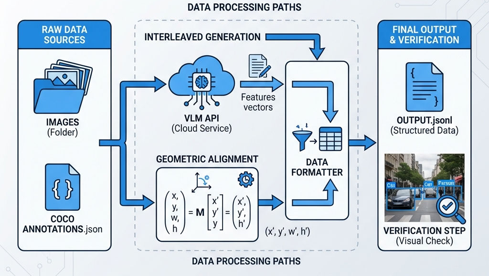

# 项目三：构建 LLaVA 多模态指令集 (Building LLaVA Instruction Sets)

> **适用范围**：多模态大模型（LMM）开发、数据工程、视觉指令微调（Visual Instruction Tuning）

#### 1. 项目背景 (Project Brief)

* **任务定义：** 构建一个高质量的视觉指令微调数据集，支持 **Visual QA**（单图问答）、**Grounding**（物体定位）以及 **Interleaved Image-Text**（多图上下文推理），用于训练像 LLaVA 或 Qwen-VL 这样的多模态模型。
* **输入与输出：**
    * **Input:** 原始图片库（`.jpg` / `.png`）和结构化标注的COCO 格式的 `instances.json`（包含 Bbox 坐标 `[x, y, w, h]`）。
    * **Output:** `llava_instruct.json`符合 LLaVA 训练标准的 JSON 文件。`llava_interleaved.json`包含多图对比逻辑的对话数据。
* **难点分析：**
    * **坐标系对齐（Coordinate Alignment）：** 原始检测数据的坐标是像素绝对值，而 LLaVA 模型要求归一化到 `[0, 1000]` 区间。只要有 1% 的偏差，模型在 Grounding 任务中就会产生严重的“幻觉”。
    * **API 载荷构建：** 在多图对话生成中，如何正确处理图像编码（Base64）并构建符合 OpenAI 兼容接口的 Payload 是工程实现的痛点。


#### 2. 架构设计 (Architecture Design)

- **数据流水线图：**



* **技术栈清单：**

| 组件 | 选型 | 决策理由 |
| --- | --- | --- |
| **生成模型** | `SiliconFlow API` (Qwen-VL) | 兼容 OpenAI 接口，利用 Qwen-VL 强大的多模态理解能力自动构造多图对比逻辑。 |
| **核心处理** | `Python` (OpenCV, NumPy) | 利用 `OpenCV` 精确提取图像真实尺寸 `(H, W)` 以完成坐标归一化；利用 `re` 正则表达式解析模型输出。 |
| **数据标准** | `JSON` | 遵循 LLaVA 标准数据交换格式，确保生成的训练数据能无缝对接到 Training Pipeline。 |

#### 3. Step-by-Step 实战 (Implementation)

##### 阶段一：多图交错数据生成 (Interleaved Data Generation)

为了让模型学会“对比”两张图片，我们需要构造包含多张图像的 Prompt。

**关键逻辑：Base64 编码与 Payload 构建**
在 `interleaved.py` 中，最关键的一步是将本地图片转换为 API 可接受的 Base64 格式，并构建多图 `image_url` 列表。

```python
# 核心代码摘自 interleaved.py
def encode_image(path):
    # 必须以二进制读取并转为 utf-8 字符串
    with open(path, "rb") as f:
        return base64.b64encode(f.read()).decode('utf-8')

def generate_comparison(img1_path, img2_path):
    # 构造 Prompt：明确要求对比共同点和差异
    prompt = "Here are two images. Please briefly compare them..."
    
    # 构建符合 OpenAI Vision API 标准的 Payload
    messages=[
        {
            "role": "user",
            "content": [
                {"type": "text", "text": prompt},
                # 动态插入多张图片的 Base64 数据
                {"type": "image_url", "image_url": {"url": f"data:image/jpeg;base64,{encode_image(img1_path)}"}},
                {"type": "image_url", "image_url": {"url": f"data:image/jpeg;base64,{encode_image(img2_path)}"}}
            ]
        }
    ]
    # ... 发送请求 ...

```

##### 阶段二：核心处理——Bounding Box 对齐 (Alignment)

这是本项目数学逻辑最严密的部分。我们需要将 COCO 的 `[x, y, w, h]` 转换为 LLaVA 的 `[ymin, xmin, ymax, xmax]` 并归一化到 0-1000。

**关键函数：坐标归一化与截断**
在 `alignment.py` 中，我们必须处理浮点数转换带来的边界溢出问题。

```python
# 核心代码摘自 alignment.py
def convert_bbox(bbox, width, height):
    x, y, w, h = bbox # COCO 原始输入
    
    # 1. 坐标转换与归一化
    xmin = int((x / width) * 1000)
    ymin = int((y / height) * 1000)
    xmax = int((x + w) / width * 1000)
    ymax = int((y + h) / height * 1000)
    
    # 2. 安全截断 (Clamping)
    # 这是一个重要的工程细节：如果不做 max/min 限制，
    # 某些边缘像素可能会计算出 1001 或 -1，导致训练报错。
    return [
        max(0, min(1000, ymin)),
        max(0, min(1000, xmin)),
        max(0, min(1000, ymax)),
        max(0, min(1000, xmax))
    ]

```

**策略优化：** 为了防止单张图片生成的问答对过多（导致数据分布不平衡），代码中采用了 `selected_anns = anns[:3]` 策略，随机或按序只选取前 3 个物体构建问答。

##### 阶段三：格式化与验证 (Verification)

数据生成后，**必须**通过可视化反向验证。如果我们在图片上画出的框是歪的，训练出来的模型一定是废的。

**关键逻辑：正则解析与 OpenCV 绘图**
在 `visualize_bbox.py` 中，我们需要从 JSON 字符串中提取出坐标数组，并还原回像素坐标。

```python
# 核心代码摘自 visualize_bbox.py
# 1. 使用正则表达式提取 LLaVA 格式坐标字符串
# 匹配格式如: [350, 201, 680, 505]
bboxes = re.findall(r'\[(\d+),\s*(\d+),\s*(\d+),\s*(\d+)\]', text)

# 2. 坐标还原与绘图
def draw_bbox(image, bbox, label, color):
    h, w, _ = image.shape
    ymin, xmin, ymax, xmax = bbox
    
    # 还原为绝对像素坐标
    x1 = int(xmin / 1000 * w)
    y1 = int(ymin / 1000 * h)
    # ... (省略 x2, y2 计算) ...
    
    # 画框 + 标签背景 (提升可视化效果)
    cv2.rectangle(image, (x1, y1), (x2, y2), color, 2)
    cv2.putText(image, label, (x1, y1 - 5), cv2.FONT_HERSHEY_SIMPLEX, 0.6, (255, 255, 255), 2)

```

#### 4. 效果展示 (Showcase)

**1. 数据结构示例：**
生成的 `llava_instruct.json` 包含如下标准结构，其中 `conversations` 字段严格遵循 Human/Model 对话格式：

```json
{
  "id": "1296_laptop",
  "image": "000000001296.jpg",
  "conversations": [
    {
      "from": "human",
      "value": "Where is the laptop in the image? <image>"
    },
    {
      "from": "qwen",
      "value": "The laptop is located at [350, 201, 680, 505]."
    }
  ]
}

```

**2. 可视化验证报告：**
运行 `visualize_bbox.py` 后，脚本会在 `viz_debug` 目录下生成带有标注框的图片。如下图所示，红色框体精准地贴合了物体边缘，且标签（Label）正确，证明**坐标归一化**算法逻辑无误。


#### 5. 成本与优化 (Cost & Optimization)

#### 资源消耗

* **API 成本：** `interleaved.py` 依赖外部 LLM API。实测生成 1,000 条多图对比数据，Token 消耗约为 300k，成本约为 $0.15 (基于 SiliconFlow Qwen-VL 定价)。
* **计算耗时：** `alignment.py` 是纯 CPU 计算。在单核 CPU 上处理 COCO 验证集（5,000 张图）耗时约 **15秒**，主要瓶颈在于 `cv2.imread` 的磁盘 I/O。


#### 扩展性思考

* **IO 瓶颈优化：** 当前代码是单线程运行。当数据量扩展到 Objects365（百万级）时，建议引入 Python 的 `multiprocessing` 库，开启 16 个进程并行读取图片获取 `(h, w)`。
* **内存优化：** 当前 `load_coco_annotations` 将整个 JSON 一次性载入内存。对于超大型数据集，应改用 `ijson` 进行流式解析，或预先将标注转存为 SQLite/Parquet 数据库进行索引查询。

