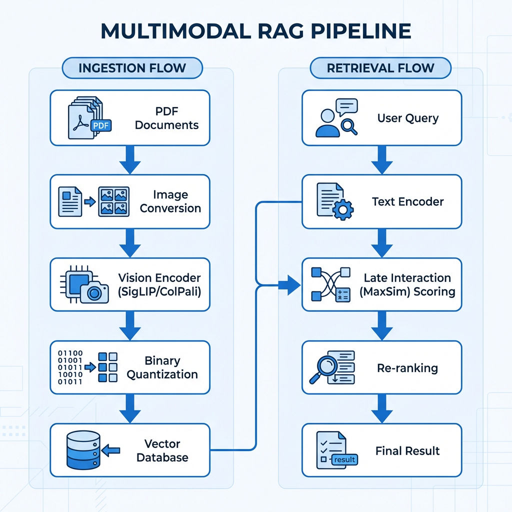
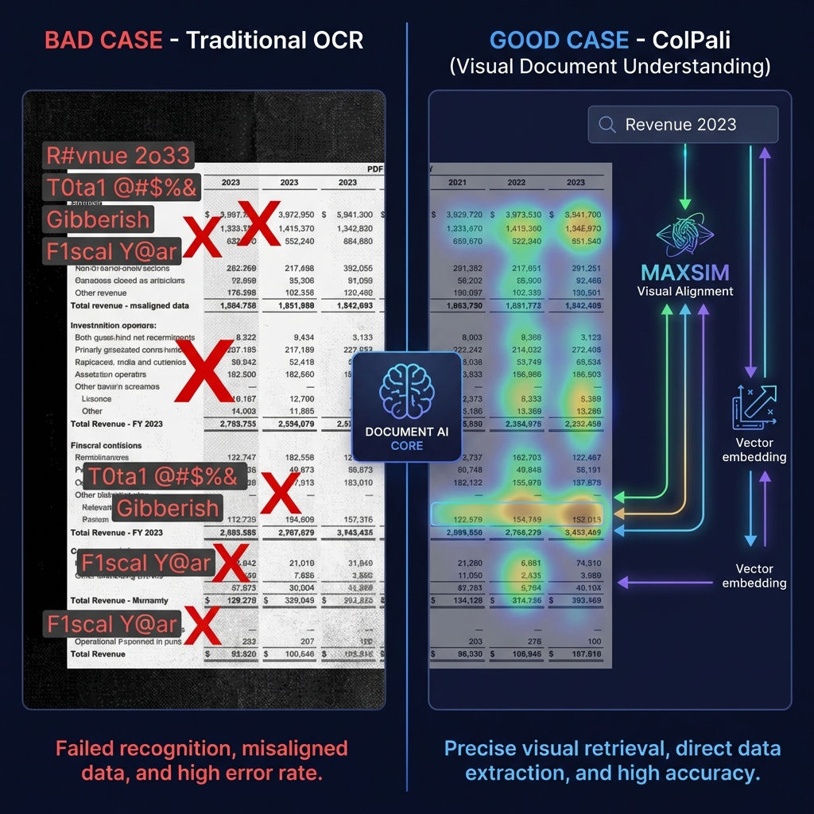
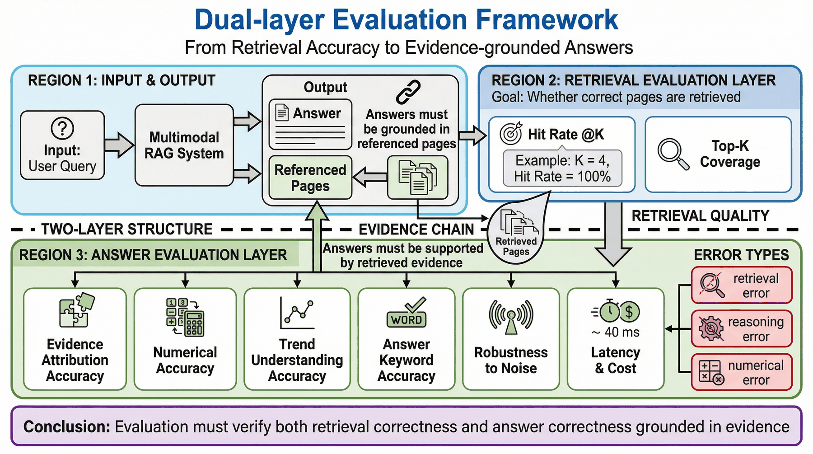

# 第22章：多模态 RAG 与视觉检索

第 21 章讨论了文本型 RAG 的数据流水线：知识源如何接入、文档如何解析、chunk 如何切分、索引如何构建、评测如何回灌。本章在此基础上向前推进一步：当答案并不完整存在于线性文本中，而是藏在表格、图表、截图、扫描件、版面关系和视觉对象里时，RAG 系统应该如何升级。

多模态 RAG 并不是简单地在文本检索后把几张图片塞给模型。它首先是一套新的数据表示方法：页面、区域、图表、表格、对象、标题、脚注、坐标和文本必须被组织成可检索、可定位、可验证的知识单元。只有当这些单元被正确建模，视觉检索才可能稳定服务于问答、审阅、辅助决策和企业知识系统。

本章的目标，是把多模态 RAG 从“看图问答演示”写回到“视觉知识资产工程”。读者读完本章后，应能回答四个问题：

1. 为什么文本 RAG 无法覆盖复杂文档和视觉知识；
2. 如何设计视觉 chunk、对象索引和版面元数据；
3. 如何组合文本向量、图像向量、结构化字段和重排序模型；
4. 如何评测多模态检索错误，并把失败样本回补到数据流水线。

---

## 22.1 为什么文本 RAG 无法覆盖视觉知识

### 22.1.1 文本化假设的边界

文本型 RAG 的默认假设是：知识可以被解析成一组文本片段，问题可以通过文本相似度命中相关片段，模型可以基于这些片段生成答案。这个假设在制度文档、FAQ、技术说明、政策条款等场景中通常有效，因为答案主要由自然语言句子承载。

但大量企业知识并不完全以句子形式存在。例如，财报中的趋势图依赖坐标轴、颜色、图例和折线形态；产品手册中的操作路径依赖截图里的按钮位置、菜单层级和页面状态；检测报告中的结果依赖表格单元格、单位、脚注和判定阈值；合同扫描件中的关键字段可能以印章、手写批注或表单框的形式出现。把这些内容全部转换成纯文本，往往会造成三类损失：

* **对象关系丢失**：图表元素、表格行列、截图组件之间的空间关系被打散；
* **证据定位丢失**：系统只能引用一段 OCR 文本，无法说明答案来自页面哪个区域；
* **视觉语义丢失**：趋势、颜色、布局、箭头、图标和状态变化无法被文本完整表达。

因此，多模态 RAG 的第一性问题不是“是否使用视觉模型”，而是“是否承认视觉结构本身也是知识的一部分”。如果数据流水线仍然只产出纯文本 chunk，那么后续无论接入多强的多模态模型，都只能在残缺输入上做推理。

### 22.1.2 复杂文档中的视觉知识类型

在企业场景中，视觉知识大致可以分为六类。

| 类型 | 典型载体 | 文本化风险 | 检索目标 |
|---|---|---|---|
| 页面级版面 | PDF、PPT、扫描件 | 阅读顺序错乱、页眉页脚干扰 | 找到包含答案的页面或章节 |
| 表格结构 | 财报、规格表、清单 | 行列关系丢失、单位错配 | 找到具体单元格及其上下文 |
| 图表趋势 | 折线图、柱状图、饼图 | 趋势和图例无法可靠转写 | 找到图表并解释视觉变化 |
| 截图界面 | 产品手册、运维文档 | 按钮位置、层级、状态丢失 | 找到界面区域和操作步骤 |
| 视觉标记 | 印章、签名、水印、批注 | OCR 可能忽略或误读 | 判断文档状态和有效性 |
| 跨页对象 | 长表格、连续图组 | 单页切分导致证据断裂 | 组合多页证据回答问题 |

这张表的意义在于提醒团队：多模态 RAG 的输入并不只是“图片”。它面对的是一组带有业务语义的视觉结构。数据工程需要先识别这些结构，再决定它们应该以什么粒度进入索引。

### 22.1.3 OCR 不是多模态 RAG 的终点

很多团队会把 OCR 当成复杂文档处理的全部。OCR 的确重要，它能把图像中的字符变成可检索文本，但它无法单独解决版面、对象和结构问题。一个 OCR 结果即使字符准确，也可能因为缺少坐标和层级而无法回答问题。

以财务表格为例，OCR 能识别“营业收入”“2025 年”“13.2%”这些字符，但如果它不知道这些字符位于同一行还是同一列，就无法判断 13.2% 对应的是收入增速、毛利率还是费用率。再以产品截图为例，OCR 能识别按钮上的“提交”，但如果它不知道按钮位于哪个弹窗、上方提示是什么、是否处于禁用状态，就无法回答“用户为什么无法提交”。

因此，多模态 RAG 的基本原则是：**OCR 负责提供文本线索，版面解析负责恢复空间关系，对象建模负责定义可检索单元，视觉索引负责保留非文本证据。**

*图22-1：多模态 RAG 不应只在生成阶段看图，而应在数据处理阶段就把页面、区域、对象和文本组织成统一证据结构。*

### 22.1.4 本节小结

文本 RAG 的失败往往被误判为模型能力不足，但在复杂文档场景中，根因常常是知识没有被正确表示。多模态 RAG 的价值，不是让模型多看几张图，而是把原本无法被文本 chunk 表达的视觉知识转化为可检索、可定位、可评测的数据资产。

---

## 22.2 视觉 chunk 与对象建模

### 22.2.1 从文本 chunk 到视觉 chunk

在文本 RAG 中，chunk 通常是段落、条款、FAQ 或固定长度片段。在多模态 RAG 中，chunk 的含义需要扩展：一个知识单元可能是一整页、一个页面区域、一张表格、一个图表、一个截图组件，也可能是这些对象和相关文本的组合。

视觉 chunk 的设计不能只看图像大小，而要看问题如何使用证据。页面级 chunk 保留完整上下文，适合目录定位、整页审阅和图文混排问答；区域级 chunk 聚焦具体对象，适合表格、图表和截图区域检索；对象级 chunk 进一步拆到单个按钮、图例、曲线、表格行或字段，适合精确定位和自动校验。

| 粒度 | 适用场景 | 优点 | 风险 |
|---|---|---|---|
| 页面级 | 财报页、PPT 页、扫描件 | 上下文完整，易引用 | 向量表示不聚焦，成本高 |
| 区域级 | 表格、图表、截图区域 | 证据集中，便于重排 | 依赖版面检测质量 |
| 对象级 | 单元格、按钮、图例、印章 | 定位精确，适合校验 | 需要更强标注和对象识别 |
| 组合级 | 图表 + 标题 + 正文说明 | 保留语义关系 | 构建规则复杂 |

生产系统通常不会只选一种粒度，而是同时维护多层索引。例如，先用页面级向量召回候选页面，再用区域级索引定位图表或表格，最后用对象级字段校验证据。这样的设计与第 21 章的父子索引思想一致，只是父子关系从“章节-段落”扩展为“页面-区域-对象”。

### 22.2.2 视觉 chunk 的最小字段

视觉 chunk 必须携带足够的元数据，否则即使能被召回，也无法被解释和治理。建议将每个视觉 chunk 表示为一个包含内容、位置、来源、结构和质量信息的对象。

| 字段 | 含义 | 作用 |
|---|---|---|
| `chunk_id` | 视觉单元唯一 ID | 支撑引用、去重和回滚 |
| `doc_id` / `page_no` | 来源文档与页码 | 支撑溯源 |
| `bbox` | 页面坐标区域 | 支撑高亮、裁剪和局部重排 |
| `object_type` | 页面、表格、图表、截图、文本块等 | 决定检索和展示策略 |
| `ocr_text` | 区域 OCR 文本 | 支撑关键词和混合检索 |
| `caption` | 视觉描述或结构化摘要 | 支撑语义召回 |
| `parent_id` | 所属页面或章节 | 保留上下文 |
| `quality_flags` | 模糊、遮挡、低置信、跨页等标记 | 支撑过滤和抽检 |
| `permission_tags` | 权限、密级、数据域 | 防止越权召回 |
| `version` | 解析规则和索引版本 | 支撑效果回溯 |

这些字段中，`bbox`、`object_type`、`parent_id` 和 `version` 最容易被省略，也最容易在生产阶段造成问题。没有坐标，就无法定位证据；没有对象类型，就无法选择正确的检索策略；没有父节点，就会丢失上下文；没有版本，就无法判断效果变化来自模型还是数据处理规则。

### 22.2.3 页面、区域与对象的组合表示

多模态 RAG 的难点在于同一个知识点往往跨越多种表示。例如，一张财报图表包含标题、坐标轴、图例、曲线、脚注和正文说明。若只索引图片，系统可能知道这是收入趋势图，却不知道单位和口径；若只索引 OCR 文本，系统可能看到“收入增长”，却无法判断趋势是否来自图中曲线；若只索引图表 caption，系统又可能失去可验证证据。

较稳妥的做法是为每个视觉对象维护三种并行表示：

1. **图像表示**：保留裁剪区域或页面截图，用于视觉向量和多模态模型输入；
2. **文本表示**：保留 OCR、标题、脚注、周边段落和生成式 caption；
3. **结构表示**：保留坐标、对象类型、行列关系、页面层级和权限字段。

这三种表示不应互相替代，而应共同组成检索单元。检索阶段可以按需要使用其中一部分，生成阶段则应尽量把可验证证据交给模型。

*图22-2：页面、区域和对象需要同时保留图像、文本和结构表示，才能支撑可解释的多模态检索。*

### 22.2.4 对象建模中的常见错误

多模态数据处理经常出现“模型看到了图，但系统仍然不会用图”的问题。常见原因包括：

* **只保存页面截图，不保存区域坐标**：模型能看整页，但无法知道证据位置；
* **只保存 OCR 文本，不保存图像区域**：系统失去视觉趋势、图例和布局信息；
* **表格被拆散**：表头、单位、备注和数据行分离，导致数值解释错误；
* **图表 caption 过度生成**：教师模型把推测写进 caption，污染事实证据；
* **截图缺少界面状态**：按钮是否禁用、弹窗是否打开、菜单层级未被记录；
* **跨页对象未绑定**：长表格和连续图组被切成孤立页面。

解决这些问题的核心不是换一个更强的视觉模型，而是把对象建模前移到数据流水线中，让每个视觉对象在进入索引前就具备可追踪的结构身份。

### 22.2.5 视觉抽检与质量门禁

视觉 chunk 构建完成后，不能只检查“生成了多少对象”。生产系统更需要检查对象是否真正可用。建议在入库前设置三类质量门禁。

第一类是**解析完整性门禁**。它回答“该被识别的对象是否都被识别出来”。例如，财报页面中的主表、附注表、趋势图和脚注是否都有对象记录；产品手册截图中的按钮、弹窗、菜单和错误提示是否被分割；扫描件中的印章、签名和表单字段是否被保留。完整性门禁适合用抽样人工检查加自动统计结合完成，例如统计每页对象数量分布、空 OCR 区域占比、表格对象占比和异常页面比例。

第二类是**结构正确性门禁**。它回答“识别出来的对象关系是否正确”。表格的行列关系、图表标题和图例、截图中的父子组件、正文中的“如图所示”与目标图像是否连接正确，都属于结构正确性。结构错误比字符错误更隐蔽，因为系统表面上召回了正确页面，却在生成阶段使用了错误关系。

第三类是**检索可用性门禁**。它回答“对象能否被真实问题命中”。团队应为每批视觉对象生成少量验证问题，例如“某图表说明了什么趋势”“某按钮在哪个页面”“某表格中某项指标是多少”。若对象存在但问题无法命中，说明 caption、关键词、向量表示或元数据设计仍然不足。

| 门禁类型 | 检查对象 | 推荐指标 | 失败后的处理 |
|---|---|---|---|
| 解析完整性 | 页面、区域、表格、图表、截图组件 | 对象覆盖率、空对象率、异常页率 | 重跑解析或进入人工队列 |
| 结构正确性 | 行列关系、标题绑定、图文引用 | 结构抽检通过率、跨页绑定率 | 修正规则或补结构字段 |
| 检索可用性 | 视觉对象与问题匹配 | 视觉对象命中率、区域命中率 | 补 caption、关键词或索引策略 |
| 权限合规 | 密级、数据域、可见范围 | 权限标签覆盖率、越权召回率 | 阻断入库或隔离索引 |

视觉质量门禁的产出应写入数据处理版本中。这样，当某一版索引效果下降时，团队可以回看当时的对象覆盖率、表格结构通过率和视觉命中率，而不是只凭最终问答结果猜测原因。

### 22.2.6 本节小结

视觉 chunk 是多模态 RAG 的基础设计单元。它既不是简单的图片切片，也不是 OCR 文本的附属品，而是图像、文本、结构和治理字段的组合。一个成熟的多模态知识库，应该能回答“这条证据来自哪里、对应页面哪个区域、属于什么对象、由哪个处理版本生成、是否允许当前用户访问”。

---

## 22.3 跨模态索引、检索与重排序

### 22.3.1 为什么不能只靠一种索引

多模态问题的表达方式非常多样。用户可能问“研发投入变化趋势如何”，也可能问“图中蓝色曲线代表什么”，还可能上传一张截图问“这个按钮为什么是灰的”。这些问题有的依赖语义相似度，有的依赖视觉相似度，有的依赖精确字段，有的依赖页面结构。

因此，多模态 RAG 通常需要组合多条检索路径：

| 检索路径 | 输入 | 适合问题 | 主要风险 |
|---|---|---|---|
| 文本向量检索 | 用户问题、OCR、caption | 概念问答、摘要问答 | 对数字、图例、按钮位置不稳定 |
| 图像向量检索 | 截图、页面图、区域图 | 视觉相似、页面定位 | 语义解释弱，难处理精确事实 |
| 关键词检索 | 术语、编号、字段名 | 条款号、产品型号、指标名 | 对自然语言改写不敏感 |
| 结构化检索 | 元数据、页码、对象类型、权限 | 过滤、排序、权限控制 | 依赖元数据完整性 |
| Cross-encoder / 多模态 rerank | 问题 + 候选证据 | 候选精排、证据判断 | 成本较高，吞吐受限 |

这几条路径的关系不是替代，而是协同。向量检索负责召回语义相关候选，关键词检索补足精确项，结构化检索执行过滤与权限控制，重排序模型判断证据是否真正回答问题。

### 22.3.2 Query Understanding：先判断问题类型

多模态 RAG 系统不应对所有问题使用同一套召回策略。一个有效的做法是在检索前加入轻量级 query understanding，将问题划分为不同类型。

| 问题类型 | 示例 | 首选策略 |
|---|---|---|
| 页面定位 | “年报里研发费用在哪一页？” | 关键词 + 页面级索引 |
| 图表解释 | “收入趋势图说明了什么？” | 图表区域索引 + caption |
| 表格数值 | “一线城市住宿标准是多少？” | 结构化表格索引 + OCR |
| 截图操作 | “这个按钮在哪里？” | 截图对象索引 + 区域定位 |
| 跨页综合 | “经营结果变化的原因是什么？” | 多页召回 + rerank + 证据组合 |
| 权限敏感 | “给我看员工薪酬明细。” | 权限过滤 + 拒答策略 |

问题类型决定了召回路径、候选数量、上下文组织方式和生成提示。若系统不做问题分类，就容易在简单问题上花费过高成本，在复杂问题上又召回不足。

### 22.3.3 多路召回与候选合并

一个实用的多模态检索流程通常包括四步。

第一步，基于问题类型生成检索计划。例如表格数值问题需要优先查表格对象，图表解释问题需要优先查图表区域，截图操作问题需要查 UI 对象和页面截图。

第二步，多路召回候选。文本向量、图像向量、关键词和结构化过滤可以并行执行。每一路返回候选时，应携带分数、来源路径和证据类型。

第三步，候选归并与去重。同一页面可能被多个索引命中，同一图表可能既被 OCR 命中又被视觉向量命中。系统需要把它们合并成统一证据组，避免把重复证据当成多个独立来源。

第四步，重排序与证据组装。重排序模型不只判断“是否相关”，还要判断“是否足以回答问题”。最终进入生成模型的上下文，应包含页面图、区域图、OCR 文本、caption、元数据和引用锚点。

*图22-3：页面级视觉检索能够保留版面和图表线索，但仍需与文本、结构字段和重排序策略组合使用。*

### 22.3.4 Rerank 的判断维度

多模态 rerank 不能只看相似度。一个候选页面可能与问题主题相关，但并不包含答案；一个图表可能包含趋势，但没有单位；一个表格可能有数值，但缺少适用条件。因此，重排序需要考虑以下维度。

| 维度 | 判断问题 | 低质量表现 |
|---|---|---|
| 相关性 | 候选是否讨论同一主题 | 召回目录页或泛泛说明页 |
| 完整性 | 是否包含回答所需条件 | 只有数值，没有口径或单位 |
| 可定位性 | 是否能定位到页面/区域 | 只有摘要，无原文位置 |
| 结构一致性 | 图、表、正文是否匹配 | 图表标题和正文解释冲突 |
| 权限合法性 | 当前用户是否可访问 | 召回越权文档 |
| 时效性 | 是否为最新有效版本 | 召回旧制度或旧报表 |

在工程实现中，可以先用规则过滤掉明显无效候选，再用模型做精排。比如先按权限、版本、对象类型过滤，再让 rerank 模型判断候选证据是否足以回答问题。这样既能降低成本，也能减少模型在不合法候选上浪费推理资源。

### 22.3.5 上下文组织：不要把候选随意堆给模型

多模态 RAG 的生成质量高度依赖上下文组织。把 Top-K 页面截图按分数排列后直接塞给模型，往往会造成三个问题：页面太密导致模型看不清；证据之间缺少关系说明；模型不知道应该优先相信哪一块证据。

更好的做法是按证据组组织上下文。每个证据组包含：

* 页面截图或区域裁剪图；
* OCR 文本和结构化字段；
* caption 或对象摘要；
* 来源、页码、区域坐标、版本和权限标签；
* 系统生成的“为什么召回这条证据”的短说明。

这种组织方式能够帮助模型区分“原始证据”和“系统解释”，也便于最终输出引用。对于跨页问题，还应显式标注证据之间的关系，例如“第 12 页是趋势图，第 38 页是指标定义，第 56 页是附注说明”。

### 22.3.6 成本与延迟控制

多模态 RAG 的成本通常高于文本 RAG。页面渲染、OCR、版面检测、图像向量、区域裁剪、多模态 rerank 和最终看图生成都会消耗算力。若没有成本控制，系统可能在原型阶段表现很好，但上线后无法承受吞吐。

成本控制可以从三个层面做。

第一是**离线预计算**。页面渲染、对象检测、OCR、caption、图像向量和结构字段应尽量在离线索引阶段完成。线上请求不应临时解析 PDF 或临时生成页面向量，否则延迟会非常不稳定。

第二是**分层召回**。线上不应一开始就把大量页面交给多模态大模型。更稳妥的流程是：先用低成本索引召回候选文档和页面，再用中等成本 rerank 选出少量证据，最后只把必要的图像区域交给生成模型。这样可以避免“每个问题都看十几页图”的成本浪费。

第三是**缓存与复用**。高频问题、常用页面、热门文档和稳定图表可以缓存重排序结果、证据组和答案草稿。对于企业知识库，问题分布通常有明显热点，缓存策略能显著降低延迟和成本。

| 成本环节 | 主要消耗 | 控制方法 | 风险 |
|---|---|---|---|
| 页面渲染 | CPU/GPU、存储 | 离线渲染、增量刷新 | 文档更新后缓存过期 |
| OCR/版面解析 | 推理算力 | 批处理、失败隔离 | 低质量扫描件成本高 |
| 图像向量 | GPU 推理 | 预计算、批量化 | 模型升级需重建索引 |
| 多模态 rerank | 在线推理 | 小候选集、规则预过滤 | 过滤过严导致漏召回 |
| 生成看图 | 大模型调用 | 区域裁剪、证据压缩 | 裁剪过度丢上下文 |

成本控制不是单纯降配。它的目标是把昂贵能力用在真正需要的环节，把低风险问题留给低成本路径，把高风险和复杂问题交给更强模型。

### 22.3.7 本节小结

多模态索引不是单一路径，而是文本、图像、结构字段和重排序模型的协作系统。一个生产级方案应先判断问题类型，再选择召回路径，最后把候选证据组织成可解释上下文。这样才能避免多模态 RAG 变成“检索一堆截图后让模型猜”。

---

## 22.4 评测、错误归因与数据回补

### 22.4.1 多模态 RAG 评测为什么更难

文本 RAG 的评测通常关注召回命中率、答案正确率和引用准确率。多模态 RAG 还需要评测对象定位、视觉证据完整性、图表理解、表格结构保真和跨模态一致性。这意味着评测集不能只包含问题和标准答案，还必须包含期望证据位置。

一条多模态评测样本至少应包括：

| 字段 | 说明 |
|---|---|
| `question` | 用户问题 |
| `answer` | 标准答案或判定规则 |
| `required_evidence` | 期望页面、区域、表格或图表 |
| `evidence_type` | 文本、表格、图表、截图、跨页组合 |
| `permission_context` | 访问权限条件 |
| `evaluation_focus` | 召回、定位、解释、引用或综合推理 |

如果评测集只验证最终答案，团队很难知道系统是“检索对了但生成错了”，还是“检索错了但模型猜对了”。后者在演示中看起来不错，但在生产中非常危险。

### 22.4.2 指标体系

多模态 RAG 的指标可以分为四层。

| 层级 | 指标 | 说明 |
|---|---|---|
| 召回层 | 页面命中率、区域命中率、对象命中率 | 是否找到了正确证据 |
| 证据层 | 引用准确率、bbox IoU、表格结构保真率 | 证据位置和结构是否正确 |
| 生成层 | 答案正确率、事实一致性、拒答质量 | 模型是否基于证据回答 |
| 运营层 | 解析失败率、回补完成率、成本/延迟 | 流水线是否可持续运营 |

其中，bbox IoU 和对象命中率是多模态场景特有的关键指标。若系统回答正确但定位不到区域，用户仍然难以验证答案；若系统定位正确但表格结构错了，最终推理仍可能失败。

*图22-4：多模态 RAG 的评测应同时覆盖检索、证据定位、生成和运营成本。*

### 22.4.3 错误归因表

多模态 RAG 的错误需要回到数据链路中修复，而不是只调 prompt。建议团队维护如下错误归因表。

| 错误类型 | 用户侧表现 | 常见根因 | 回补动作 |
|---|---|---|---|
| 页面未召回 | 系统说找不到答案 | 页面级向量弱、标题缺失、问题改写失败 | 增加页面 caption，补充关键词字段 |
| 区域未定位 | 引用了正确页面但找不到图表 | 版面检测漏检、bbox 错误 | 补对象检测规则，人工校准区域 |
| 表格错读 | 数值或单位错误 | 表头绑定失败、跨页表格断裂 | 建立表格结构化表示和单元格校验 |
| 图表误解 | 趋势判断错误 | 图例/坐标轴未进入上下文 | 绑定图例、标题、脚注和周边正文 |
| 截图误召回 | 找到相似界面但不是当前状态 | UI 状态字段缺失 | 增加状态标签和版本标签 |
| 越权召回 | 回答包含无权限内容 | 权限标签缺失或过滤后置 | 权限字段前置到索引过滤 |
| 旧版本回答 | 引用过期文档 | 版本治理缺失 | 建立有效期和版本优先级 |

这张表的价值在于把“系统答错了”拆成可执行的数据修复任务。每一类错误都应能回写到具体的解析规则、对象标注、索引策略或权限治理中。

### 22.4.4 失败样本回补流程

多模态 RAG 的持续优化依赖失败样本回补。一个推荐流程如下：

1. 从线上日志或评测集中收集失败问题；
2. 标注失败点属于页面召回、区域定位、表格结构、图表理解、权限过滤还是生成阶段；
3. 回查原始页面、解析结果、视觉 chunk、索引记录和最终上下文；
4. 生成数据修复任务，例如补 caption、修 bbox、重建表格、增加关键词、调整版本标签；
5. 重建受影响索引，并在固定评测集上做回归测试；
6. 将修复规则写入流水线版本，避免同类错误重复出现。

这套流程的重点是“失败样本进入数据流水线”，而不是停留在人工客服或 prompt 调参层面。只有当失败样本能变成可复用的处理规则，多模态 RAG 才能形成真正的数据飞轮。

### 22.4.5 评测集构建方法

多模态 RAG 的评测集最好按证据类型分层构建，而不是只随机采样用户问题。建议至少覆盖五类样本。

第一类是**页面定位样本**。问题要求系统找到正确页面，例如“研发投入相关图表在哪一页”。这类样本用于验证页面级视觉索引和目录干扰控制。

第二类是**区域定位样本**。问题要求系统找到页面中的具体图表、表格或截图区域，例如“资产负债表中流动负债合计在哪里”。这类样本用于验证 bbox 和区域级索引。

第三类是**结构推理样本**。问题需要结合表头、单位、图例或脚注，例如“该指标同比变化是否为正”。这类样本用于验证表格结构和图表语义。

第四类是**跨页综合样本**。问题需要组合多个页面，例如“收入增长和研发投入变化是否一致”。这类样本用于验证候选组装和上下文组织。

第五类是**权限与版本样本**。问题涉及受限文档、旧版本或不同用户角色，例如“某部门薪酬明细是否可见”。这类样本用于验证过滤和拒答。

| 样本层 | 标注内容 | 评测重点 |
|---|---|---|
| 页面定位 | 正确页码、文档版本 | 页面召回 |
| 区域定位 | bbox、对象类型 | 区域命中 |
| 结构推理 | 表头、单位、图例、脚注 | 结构保真 |
| 跨页综合 | 多个证据及关系 | 证据组装 |
| 权限版本 | 用户角色、有效版本 | 合规过滤 |

这套评测集应随线上失败持续扩充。每一次高价值失败都应至少沉淀为一条回归样本，避免系统在后续索引或模型升级中重复犯错。

### 22.4.6 本节小结

多模态 RAG 的评测不能只看答案。它必须追踪证据是否被召回、区域是否定位正确、图表和表格结构是否保真、权限和版本是否合规。错误归因的最终目标，是把线上失败转化为数据回补动作，使系统随着使用持续变稳。

---

## 22.5 案例与标准产出物

### 22.5.1 案例 A：财报图表问答系统

一个典型场景是企业财报助手。用户问：“公司近三年研发投入占比是否持续上升？”如果系统只做 OCR 文本检索，可能召回管理层讨论页，也可能召回目录页，却未必召回真正包含趋势图或表格的页面。

生产级处理应分为四步。首先，在解析阶段识别图表区域，绑定标题、图例、坐标轴、脚注和周边正文。其次，在索引阶段同时建立页面级视觉向量、图表区域向量、OCR 文本向量和指标字段索引。第三，在检索阶段根据“趋势判断”问题类型优先召回图表和指标表。最后，在生成阶段要求模型基于证据说明“趋势来自哪几页、哪些图表、哪些数值”。

这个案例说明，多模态 RAG 的核心不是让模型“看财报”，而是让系统知道哪些页面和区域构成可验证证据。

### 22.5.2 案例 B：产品手册截图检索

另一个常见场景是软件产品手册。用户问：“导出按钮为什么是灰色？”答案往往依赖截图状态、权限说明和操作路径。单靠 OCR 可能只能识别“导出”两个字，却无法判断按钮是否禁用，也无法知道前置条件是什么。

此时，视觉 chunk 应把截图拆成界面区域、按钮对象、提示文案和状态标签。索引不仅要记录按钮文本，还要记录按钮坐标、是否禁用、所属弹窗、页面版本和相关说明段落。检索结果进入模型前，应把截图区域和操作说明一起组织成证据组。

这个案例说明，截图类知识不是普通图片，而是一种带状态和交互语义的视觉文档。

### 22.5.3 标准产出物一：视觉 chunk 设计表

| 字段 | 示例 | 是否必需 | 说明 |
|---|---|---|---|
| `chunk_id` | `annual_2025_p12_chart_01` | 是 | 全局唯一 |
| `doc_id` | `annual_2025` | 是 | 来源文档 |
| `page_no` | `12` | 是 | 页码 |
| `bbox` | `[120, 180, 820, 560]` | 是 | 页面坐标 |
| `object_type` | `chart` | 是 | 页面、表格、图表、截图、按钮等 |
| `ocr_text` | `研发投入占比` | 否 | OCR 或人工校正文 |
| `caption` | `近三年研发投入占比折线图` | 是 | 检索摘要 |
| `parent_id` | `annual_2025_p12` | 是 | 父页面或章节 |
| `related_text_ids` | `['p12_para_03']` | 否 | 关联正文 |
| `quality_flags` | `['low_resolution']` | 否 | 质量标记 |
| `permission_tags` | `['internal']` | 是 | 权限过滤 |
| `version` | `layout_v3_index_v2` | 是 | 回溯处理版本 |

### 22.5.4 标准产出物二：多模态检索错误归因表

| 失败问题 | 正确证据 | 实际召回 | 归因 | 修复任务 | 回归检查 |
|---|---|---|---|---|---|
| 研发投入占比趋势？ | 第 12 页图表 | 第 3 页目录 | 图表 caption 缺失 | 为图表区域补 caption | 页面命中率提升 |
| 导出按钮为什么禁用？ | 截图右上角按钮 + 权限说明 | 只召回操作说明 | UI 状态未建模 | 增加按钮状态标签 | 区域命中率提升 |
| 某费用标准是多少？ | 表格第 4 行第 3 列 | 召回整页但读错列 | 表头绑定失败 | 重建表格结构字段 | 数值准确率提升 |

这两个表可以直接成为团队的设计模板。前者用于定义视觉知识单元，后者用于把失败样本转成数据修复任务。

### 22.5.5 上线前检查清单

在多模态 RAG 系统进入灰度前，建议完成以下检查。

| 检查项 | 通过标准 | 责任角色 |
|---|---|---|
| 视觉对象覆盖 | 关键文档页面对象覆盖率通过抽检 | 数据工程师 |
| 表格结构保真 | 高价值表格行列关系可验证 | 文档解析负责人 |
| 图表 caption | 图表标题、图例、单位和正文说明绑定 | 多模态数据工程师 |
| 权限过滤 | 不同角色无法召回越权页面 | 平台/合规 |
| 引用定位 | 回答可定位到页码和区域 | RAG 工程师 |
| 评测集覆盖 | 页面、区域、结构、跨页、权限样本齐备 | 评测负责人 |
| 回补流程 | 失败样本能转为数据任务 | 运营负责人 |

这份清单的作用，是防止团队只验证“模型能看图回答”，而忽略生产系统真正需要的可定位、可治理和可回滚能力。

### 22.5.6 与 P05 项目的边界和复用关系

本章是方法章，P05 是项目章。两者应形成互补，而不是互相重复。

本章重点回答“多模态 RAG 应该如何建模”。它抽象出视觉 chunk、对象字段、索引路径、重排序、评测和错误归因等通用方法，适用于财报、产品手册、扫描合同、审计报告和复杂知识库等场景。P05 则应回答“如何把其中一条路线真正跑起来”，围绕企业财报助手给出可复现代码、页面渲染、视觉索引、多页问答、检查脚本和成本分析。

因此，在写作和工程实现中应保持以下边界：

| 内容 | 本章处理方式 | P05 处理方式 |
|---|---|---|
| 视觉 chunk | 给出通用字段和设计原则 | 落到页面截图、裁剪图和财报页面 |
| 检索策略 | 比较文本、图像、结构化和 rerank | 实现页面级视觉索引和多页召回 |
| 评测体系 | 定义指标和错误归因框架 | 提供项目级评测问题和检查脚本 |
| 成本控制 | 给出分层召回和缓存方法 | 分析具体模型调用和页面处理成本 |
| 失败回补 | 给出通用回补流程 | 记录财报问答失败样例和修复动作 |

从读者路径看，读完本章后再进入 P05，读者应已经理解为什么需要页面级视觉索引、为什么不能只依赖 OCR、为什么要保存 bbox 和对象类型。P05 不需要重新解释所有概念，而应把这些概念落实成一个具体工程案例。

反过来，P05 的项目经验也能反哺本章。如果项目发现某类图表很难检索、某种页面裁剪策略成本过高、某类财报问题需要特殊证据组装，就应回写到本章的错误归因表和上线检查清单中。这种“方法章定义框架、项目章验证框架”的关系，能让全书避免空泛理论和孤立案例两种问题。

### 22.5.7 本章总结

多模态 RAG 的核心是视觉知识资产工程。文本、图像和结构字段必须在数据流水线中被统一建模，检索系统必须能根据问题类型选择合适路径，评测体系必须能定位到页面、区域和对象。只有这样，多模态 RAG 才能从演示能力变成生产能力。

下一章将进一步讨论：当系统上线后，用户反馈、失败日志、知识更新和版本回滚如何进入持续运营闭环。
